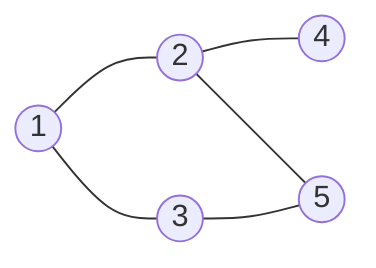

# Bài 10: BFS & DFS - Duyệt Đồ Thị!

> **Tác giả:** Hà Trí Kiên<br>
> **Nội dung tham khảo từ:** VNOI Wiki - BFS, Cây DFS và ứng dụng, CP-Algorithms

## 1. Đồ thị là gì?

### Ẩn dụ: Bản đồ đường phố

Thành phố có N ngã tư (đỉnh), M con đường (cạnh) nối các ngã tư. Muốn đi từ A đến B → cần thuật toán tìm đường!

**Đồ thị** = tập đỉnh + tập cạnh nối giữa các đỉnh.

<p align="center"><br><em>Minh họa đồ thị vô hướng</em></p>

### Các loại đồ thị

| Loại | Mô tả | Ví dụ |
|------|-------|-------|
| **Vô hướng** | Cạnh không có chiều | Bạn bè trên Facebook |
| **Có hướng** | Cạnh có chiều | Theo dõi trên Twitter |
| **Có trọng số** | Cạnh có giá trị | Bản đồ (khoảng cách) |
| **Liên thông** | Đi được từ mọi đỉnh đến mọi đỉnh khác | - |
| **Nhị phân** | Chia đỉnh thành 2 tập, cạnh chỉ nối 2 tập khác nhau | - |

### Biểu diễn đồ thị

**Cách 1: Danh sách kề** (phổ biến nhất, ưu tiên dùng)

=== "C++"

    ```cpp
    // Danh sách kề - O(V + E) bộ nhớ
    vector<int> adj[MAXN];
    adj[1].push_back(2);  // đỉnh 1 nối với đỉnh 2
    adj[2].push_back(1);  // đồ thị vô hướng → thêm cả chiều ngược
    
    // Duyệt đỉnh kề của u
    for (int v : adj[u]) {
        // xử lý v
    }
    ```

=== "Python"

    ```python
    from collections import defaultdict
    
    # Danh sách kề - O(V + E) bộ nhớ
    adj = defaultdict(list)
    adj[1].append(2)  # đỉnh 1 nối với đỉnh 2
    adj[2].append(1)  # đồ thị vô hướng → thêm cả chiều ngược
    
    # Duyệt đỉnh kề của u
    for v in adj[u]:
        # xử lý v
        pass
    ```

**Cách 2: Ma trận kề** (dùng khi cần truy cập O(1))

=== "C++"

    ```cpp
    // Ma trận kề - O(V²) bộ nhớ
    int adj[MAXN][MAXN];
    adj[1][2] = 1;  // đỉnh 1 nối với đỉnh 2
    adj[2][1] = 1;  // đồ thị vô hướng
    
    // Kiểm tra 2 đỉnh có nối nhau không - O(1)
    if (adj[u][v]) { ... }
    ```

=== "Python"

    ```python
    # Ma trận kề - O(V²) bộ nhớ
    n = 100
    adj = [[0] * n for _ in range(n)]
    adj[1][2] = 1  # đỉnh 1 nối với đỉnh 2
    adj[2][1] = 1  # đồ thị vô hướng
    
    # Kiểm tra 2 đỉnh có nối nhau không - O(1)
    if adj[u][v]: pass
    ```

### Khi nào dùng gì?

| | Danh sách kề | Ma trận kề |
|--|---------------|------------|
| Bộ nhớ | O(V + E) | O(V²) |
| Kiểm tra cạnh | O(degree) | **O(1)** |
| Duyệt đỉnh kề | **O(degree)** | O(V) |
| Phổ biến | **Rất phổ biến** | Ít dùng |

→ **Luôn dùng danh sách kề** trừ khi cần kiểm tra cạnh nhanh O(1).

---

## 2. BFS - Duyệt theo chiều rộng

!!! tip "Thử tương tác BFS/DFS"
    <iframe src="https://visualgo.net/en/dfsbfs" style="width: 100%; height: 500px; border: 1px solid #ccc; border-radius: 8px;"></iframe>

### Ẩn dụ: Sóng nước lan rộng

Thả hòn đá xuống hồ → sóng lan đồng đều. BFS cũng vậy: duyệt đỉnh cách 1 bước trước, rồi 2 bước, 3 bước...

<p align="center"><br><em>Minh họa thuật toán BFS (duyệt theo chiều rộng)</em></p>

### Ý tưởng cốt lõi

1. Cho đỉnh nguồn vào **hàng đợi** (queue)
2. Lấy đỉnh đầu hàng đợi ra → duyệt tất cả đỉnh kề **chưa thăm**
3. Đánh dấu đã thăm, cho vào hàng đợi
4. Lặp lại cho đến khi hàng đợi rỗng

**Đặc điểm:** BFS luôn thăm đỉnh theo thứ tự **tầng** (level) - đỉnh cách 1 bước trước, rồi 2 bước, 3 bước...

### Code C++

=== "C++"

    ```cpp
    vector<int> adj[MAXN];
    bool visited[MAXN];
    int dist[MAXN];
    int parent[MAXN];  // Truy vết đường đi
    
    void bfs(int start) {
        queue<int> q;
        q.push(start);
        visited[start] = true;
        dist[start] = 0;
        parent[start] = -1;
        
        while (!q.empty()) {
            int u = q.front();
            q.pop();
            
            for (int v : adj[u]) {
                if (!visited[v]) {
                    visited[v] = true;
                    dist[v] = dist[u] + 1;
                    parent[v] = u;  // Lưu vết
                    q.push(v);
                }
            }
        }
    }
    
    // Truy vết đường đi từ start → target
    vector<int> getPath(int target) {
        vector<int> path;
        for (int v = target; v != -1; v = parent[v])
            path.push_back(v);
        reverse(path.begin(), path.end());
        return path;
    }
    ```

=== "Python"

    ```python
    from collections import deque
    
    def bfs(adj, start):
        n = len(adj)
        visited = [False] * n
        dist = [-1] * n
        parent = [-1] * n
    
        q = deque([start])
        visited[start] = True
        dist[start] = 0
    
        while q:
            u = q.popleft()
            for v in adj[u]:
                if not visited[v]:
                    visited[v] = True
                    dist[v] = dist[u] + 1
                    parent[v] = u
                    q.append(v)
        return dist, parent
    
    def get_path(parent, target):
        path = []
        v = target
        while v != -1:
            path.append(v)
            v = parent[v]
        path.reverse()
        return path
    ```

### Độ phức tạp

- **Thời gian:** O(V + E) - mỗi đỉnh và cạnh thăm đúng 1 lần
- **Bộ nhớ:** O(V) - hàng đợi tối đa V đỉnh

### Minh họa từng bước



```
BFS từ đỉnh 1:
Bước 1: Queue = [1]           → lấy 1 ra, thêm kề 2,3
Bước 2: Queue = [2, 3]        → lấy 2 ra, thêm kề 4,5 (3 đã ở queue)
Bước 3: Queue = [3, 4, 5]     → lấy 3 ra, kề 5 đã thăm → bỏ qua
Bước 4: Queue = [4, 5]        → lấy 4 ra, không kề mới
Bước 5: Queue = [5]           → lấy 5 ra, không kề mới
Bước 6: Queue = []            → xong!

Thứ tự thăm: 1 → 2 → 3 → 4 → 5
Khoảng cách: 0    1   1   2   2
```

---

## 3. DFS - Duyệt theo chiều sâu

### Ẩn dụ: Khám phá hang động

Tại mỗi ngã rẽ, chọn 1 đường đi sâu hết mức. Đến đường cụt → quay lui → thử đường khác.

<p align="center"><br><em>Minh họa thuật toán DFS (duyệt theo chiều sâu)</em></p>

### Ý tưởng cốt lõi

1. Đánh dấu đỉnh hiện tại đã thăm
2. Duyệt tất cả đỉnh kề **chưa thăm**
3. Với mỗi đỉnh kề → gọi đệ quy DFS
4. Khi không còn đỉnh kề nào → quay lui

**Đặc điểm:** DFS đi **sâu** hết mức có thể trước khi quay lại.

### Code C++

=== "C++"

    ```cpp
    vector<int> adj[MAXN];
    bool visited[MAXN];
    
    // Cách 1: Đệ quy (đơn giản)
    void dfs(int u) {
        visited[u] = true;
        for (int v : adj[u])
            if (!visited[v])
                dfs(v);
    }
    
    // Cách 2: Stack (không đệ quy)
    void dfsIterative(int start) {
        stack<int> st;
        st.push(start);
        while (!st.empty()) {
            int u = st.top();
            st.pop();
            if (visited[u]) continue;
            visited[u] = true;
            for (int v : adj[u])
                if (!visited[v])
                    st.push(v);
        }
    }
    ```

=== "Python"

    ```python
    # Cách 1: Đệ quy (đơn giản)
    def dfs(adj, u, visited):
        visited[u] = True
        for v in adj[u]:
            if not visited[v]:
                dfs(adj, v, visited)
    
    # Cách 2: Stack (không đệ quy)
    def dfs_iterative(adj, start):
        n = len(adj)
        visited = [False] * n
        stack = [start]
        while stack:
            u = stack.pop()
            if visited[u]:
                continue
            visited[u] = True
            for v in adj[u]:
                if not visited[v]:
                    stack.append(v)
    ```

### Độ phức tạp

- **Thời gian:** O(V + E) - mỗi đỉnh và cạnh thăm đúng 1 lần
- **Bộ nhớ:** O(V) - stack đệ quy tối đa V tầng

### Minh họa từng bước

```
Đồ thị:     1 --- 2 --- 4
             |     |
             3 --- 5

DFS từ đỉnh 1 (đệ quy):
Bước 1: Thăm 1 → gọi DFS(2)
Bước 2:   Thăm 2 → gọi DFS(4)
Bước 3:     Thăm 4 → không còn đỉnh kề chưa thăm → quay lui
Bước 4:   Quay lại 2 → gọi DFS(5)
Bước 5:     Thăm 5 → gọi DFS(3)
Bước 6:       Thăm 3 → đỉnh kề 1, 5 đều đã thăm → quay lui
Bước 7:     Quay lại 5 → xong
Bước 8:   Quay lại 2 → xong
Bước 9: Quay lại 1 → xong

Thứ tự thăm: 1 → 2 → 4 → 5 → 3
```

---

## 4. Ứng dụng thực tế của BFS & DFS

### 4.1. Tìm đường ngắn nhất trong lưới (BFS)

**Bài toán:** Cho lưới N×M, tìm đường đi ngắn nhất từ A đến B (tránh vật cản).

=== "C++"

    !!! tip "Cú pháp C++17: Structured Binding"
        `auto [x, y] = q.front()` là cú pháp **structured binding** (C++17) - gán nhiều giá trị từ tuple/pair cùng lúc. Thay vì viết:
        ```cpp
        int x = q.front().first;
        int y = q.front().second;
        ```
        Bạn có thể viết ngắn gọn: `auto [x, y] = q.front();`

    ```cpp
    int dx[] = {-1, 1, 0, 0};
    int dy[] = {0, 0, -1, 1};
    
    int bfsGrid(vector<vector<int>>& grid, int sx, int sy, int ex, int ey) {
        int n = grid.size(), m = grid[0].size();
        queue<pair<int,int>> q;
        vector<vector<int>> dist(n, vector<int>(m, -1));
        
        q.push({sx, sy});
        dist[sx][sy] = 0;
        
        while (!q.empty()) {
            auto [x, y] = q.front();
            q.pop();
            
            if (x == ex && y == ey) return dist[x][y];
            
            for (int d = 0; d < 4; d++) {
                int nx = x + dx[d], ny = y + dy[d];
                if (nx >= 0 && nx < n && ny >= 0 && ny < m 
                    && grid[nx][ny] != 1 && dist[nx][ny] == -1) {
                    dist[nx][ny] = dist[x][y] + 1;
                    q.push({nx, ny});
                }
            }
        }
        return -1;
    }
    ```

=== "Python"

    ```python
    from collections import deque
    
    def bfs_grid(grid, sx, sy, ex, ey):
        n, m = len(grid), len(grid[0])
        dx = [-1, 1, 0, 0]
        dy = [0, 0, -1, 1]
        dist = [[-1] * m for _ in range(n)]
        q = deque([(sx, sy)])
        dist[sx][sy] = 0
    
        while q:
            x, y = q.popleft()
            if x == ex and y == ey:
                return dist[x][y]
            for d in range(4):
                nx, ny = x + dx[d], y + dy[d]
                if 0 <= nx < n and 0 <= ny < m and grid[nx][ny] != 1 and dist[nx][ny] == -1:
                    dist[nx][ny] = dist[x][y] + 1
                    q.append((nx, ny))
        return -1
    ```

**Ứng dụng thực tế:** Game tìm đường (Pacman, RPG), robot di chuyển, GPS.

### 4.2. Đếm thành phần liên thông (DFS/BFS)

**Bài toán:** Cho đồ thị có N đỉnh, đếm số "nhóm" liên thông.

=== "C++"

    ```cpp
    int countComponents(int n) {
        int count = 0;
        for (int i = 1; i <= n; i++) {
            if (!visited[i]) {
                dfs(i);
                count++;
            }
        }
        return count;
    }
    ```

=== "Python"

    ```python
    def count_components(n, adj):
        visited = [False] * n
        count = 0
        for i in range(n):
            if not visited[i]:
                dfs(adj, i, visited)
                count += 1
        return count
    ```

**Ứng dụng thực tế:** Kiểm tra mạng lưới có liên thông không, phân cụm dữ liệu.

### 4.3. Kiểm tra đồ thị nhị phân (BFS/DFS)

**Bài toán:** Kiểm tra đồ thị có thể chia thành 2 tập sao cho cạnh chỉ nối 2 tập khác nhau không.

**Ý tưởng:** Tô màu 2 màu xen kẽ. Nếu đỉnh kề cùng màu → không nhị phân!

=== "C++"

    ```cpp
    bool isBipartite(int n, vector<vector<int>>& adj) {
        vector<int> color(n, -1);
        queue<int> q;
        
        for (int start = 0; start < n; start++) {
            if (color[start] != -1) continue;
            
            color[start] = 0;
            q.push(start);
            
            while (!q.empty()) {
                int u = q.front(); q.pop();
                for (int v : adj[u]) {
                    if (color[v] == -1) {
                        color[v] = color[u] ^ 1;  // Đổi màu
                        q.push(v);
                    } else if (color[v] == color[u]) {
                        return false;  // Cùng màu → không nhị phân
                    }
                }
            }
        }
        return true;
    }
    ```

=== "Python"

    ```python
    from collections import deque
    
    def is_bipartite(n, adj):
        color = [-1] * n
        
        for start in range(n):
            if color[start] != -1:
                continue
            color[start] = 0
            q = deque([start])
            
            while q:
                u = q.popleft()
                for v in adj[u]:
                    if color[v] == -1:
                        color[v] = color[u] ^ 1
                        q.append(v)
                    elif color[v] == color[u]:
                        return False
        return True
    ```

**Ứng dụng thực tế:** Phân công công việc (2 nhóm không xung đột), kiểm tra đồ thị có phải là cây không.

### 4.4. Phát hiện chu trình (DFS)

**Bài toán:** Kiểm tra đồ thị có chứa chu trình không.

**Đồ thị vô hướng:**

=== "C++"

    ```cpp
    bool hasCycleUndirected(int u, int parent) {
        visited[u] = true;
        for (int v : adj[u]) {
            if (!visited[v]) {
                if (hasCycleUndirected(v, u)) return true;
            } else if (v != parent) {
                return true;  // Thăm lại đỉnh khác cha → có chu trình
            }
        }
        return false;
    }
    ```

=== "Python"

    ```python
    def has_cycle_undirected(adj, u, parent, visited):
        visited[u] = True
        for v in adj[u]:
            if not visited[v]:
                if has_cycle_undirected(adj, v, u, visited):
                    return True
            elif v != parent:
                return True  # Thăm lại đỉnh khác cha → có chu trình
        return False
    ```

**Lưu ý:** Hàm trên chỉ kiểm tra 1 thành phần liên thông. Với đồ thị không liên thông, cần gọi từ mọi đỉnh chưa thăm.

**Đồ thị có hướng:**

=== "C++"

    ```cpp
    // 0: chưa thăm, 1: đang thăm, 2: đã thăm xong
    int state[MAXN];
    
    bool hasCycleDirected(int u) {
        state[u] = 1;  // Đang thăm
        for (int v : adj[u]) {
            if (state[v] == 1) return true;   // Gặp lại đỉnh đang thăm → chu trình
            if (state[v] == 0 && hasCycleDirected(v)) return true;
        }
        state[u] = 2;  // Đã thăm xong
        return false;
    }
    ```

=== "Python"

    ```python
    def has_cycle_directed(adj, u, state):
        state[u] = 1  # Đang thăm
        for v in adj[u]:
            if state[v] == 1:
                return True   # Gặp lại đỉnh đang thăm → chu trình
            if state[v] == 0 and has_cycle_directed(adj, v, state):
                return True
        state[u] = 2  # Đã thăm xong
        return False
    ```

**Ứng dụng thực tế:** Kiểm tra deadlock trong hệ điều hành, kiểm tra phụ thuộc vòng tròn.

### 4.5. Sắp xếp tô-pô (DFS)

**Bài toán:** Với đồ thị có hướng không chu trình (DAG), tìm thứ tự tuyến tính sao cho nếu có cạnh u→v thì u đứng trước v.

=== "C++"

    ```cpp
    vector<int> topoOrder;
    bool visited[MAXN];
    
    void topoSort(int u) {
        visited[u] = true;
        for (int v : adj[u])
            if (!visited[v])
                topoSort(v);
        topoOrder.push_back(u);  // Thêm SAU khi duyệt xong
    }
    
    // Gọi: gọi topoSort(i) với mọi i chưa thăm, sau đó đảo ngược topoOrder
    ```

=== "Python"

    ```python
    def topo_sort(adj, n):
        visited = [False] * n
        order = []
        
        def dfs(u):
            visited[u] = True
            for v in adj[u]:
                if not visited[v]:
                    dfs(v)
            order.append(u)  # Thêm SAU khi duyệt xong
        
        for i in range(n):
            if not visited[i]:
                dfs(i)
        order.reverse()
        return order
    ```

**Ứng dụng thực tế:** Sắp xếp thứ tự học môn (môn tiên quyết), build hệ thống, xử lý dependency.

### 4.6. Flood Fill (BFS/DFS)

**Bài toán:** Cho lưới 2D, tô màu tất cả ô liên thông cùng màu với ô xuất phát.

=== "C++"

    ```cpp
    void floodFill(vector<vector<int>>& grid, int x, int y, int newColor) {
        int n = grid.size(), m = grid[0].size();
        int oldColor = grid[x][y];
        if (oldColor == newColor) return;
        
        queue<pair<int,int>> q;
        q.push({x, y});
        grid[x][y] = newColor;
        
        int dx[] = {-1, 1, 0, 0};
        int dy[] = {0, 0, -1, 1};
        
        while (!q.empty()) {
            auto [cx, cy] = q.front(); q.pop();
            for (int d = 0; d < 4; d++) {
                int nx = cx + dx[d], ny = cy + dy[d];
                if (nx >= 0 && nx < n && ny >= 0 && ny < m && grid[nx][ny] == oldColor) {
                    grid[nx][ny] = newColor;
                    q.push({nx, ny});
                }
            }
        }
    }
    ```

=== "Python"

    ```python
    from collections import deque
    
    def flood_fill(grid, x, y, new_color):
        n, m = len(grid), len(grid[0])
        old_color = grid[x][y]
        if old_color == new_color:
            return
        q = deque([(x, y)])
        grid[x][y] = new_color
        dx = [-1, 1, 0, 0]
        dy = [0, 0, -1, 1]
        while q:
            cx, cy = q.popleft()
            for d in range(4):
                nx, ny = cx + dx[d], cy + dy[d]
                if 0 <= nx < n and 0 <= ny < m and grid[nx][ny] == old_color:
                    grid[nx][ny] = new_color
                    q.append((nx, ny))
    ```

**Ứng dụng thực tế:** Paint bucket tool, đếm số vùng trong ảnh, game Minesweeper.

---

## 5. So sánh BFS vs DFS

| | BFS | DFS |
|--|-----|-----|
| Cấu trúc dữ liệu | **Queue** (FIFO) | **Stack** / Đệ quy |
| Thứ tự duyệt | Lan rộng theo "tầng" | Đi sâu rồi quay lui |
| Đường ngắn nhất | **Có** (đồ thị không trọng số) | Không đảm bảo |
| Bộ nhớ | O(V) (hàng đợi) | O(V) (đệ quy stack) |
| Thời gian | O(V + E) | O(V + E) |

### Khi nào dùng BFS?

- Cần tìm **đường ngắn nhất** trong đồ thị không trọng số
- Duyệt theo **tầng** (level-order)
- Bài toán trên **lưới 2D** (tìm đường, flood fill)

### Khi nào dùng DFS?

- Kiểm tra **chu trình**
- **Sắp xếp tô-pô**
- Tìm **thành phần liên thông**
- Bài toán cần **quay lui** (backtracking)
- Đồ thị rất **sâu** (ít tốn bộ nhớ hơn BFS)

---

## 6. Lưu ý / Cạm bẫy hay gặp

### Bẫy 1: Quên đánh dấu đã thăm

```cpp
// SAI: quên visited[v] = true trước khi push
q.push(v);
visited[v] = true;  // ← Quá trễ! Có thể push trùng!

// ĐÚNG: đánh dấu NGAY KHI push
visited[v] = true;
q.push(v);
```

### Bẫy 2: Đệ quy quá sâu → Stack Overflow

DFS đệ quy với N = 100.000 có thể tràn stack.

**Khắc phục:** Dùng DFS iterative (stack) hoặc tăng giới hạn stack.

```python
import sys
sys.setrecursionlimit(300000)  # Tăng giới hạn đệ quy
```

### Bẫy 3: BFS trên đồ thị có trọng số

BFS chỉ cho đường ngắn nhất trên đồ thị **không trọng số**. Nếu có trọng số → dùng Dijkstra!

### Bẫy 4: Quên đỉnh xuất phát trong đồ thị không liên thông

```cpp
// SAI: chỉ gọi BFS/DFS từ đỉnh 1
bfs(1);  // Chỉ thăm được 1 thành phần!

// ĐÚNG: gọi từ mọi đỉnh chưa thăm
for (int i = 1; i <= n; i++)
    if (!visited[i])
        bfs(i);
```

### Mẹo thi cử

| Bài toán | Thuật toán |
|----------|-----------|
| Đường ngắn nhất (không trọng số) | BFS |
| Thành phần liên thông | DFS/BFS |
| Kiểm tra chu trình | DFS |
| Sắp xếp tô-pô | DFS |
| Kiểm tra nhị phân | BFS/DFS |
| Flood Fill | BFS/DFS |
| Đồ thị có trọng số | Dijkstra (bài 13) |

---

## 7. Bài tập luyện tập

| Bài | Nền tảng | Độ khó | Chủ đề |
|-----|----------|--------|--------|
| [CSES - Building Roads](https://cses.fi/problemset/task/1666) | CSES | ⭐ | Thành phần liên thông |
| [CSES - Message Route](https://cses.fi/problemset/task/1667) | CSES | ⭐⭐ | BFS đường ngắn nhất |
| [CSES - Labyrinth](https://cses.fi/problemset/task/1193) | CSES | ⭐⭐ | BFS trên lưới |
| [CSES - Building Teams](https://cses.fi/problemset/task/1668) | CSES | ⭐⭐ | Kiểm tra nhị phân |
| [CSES - Round Trip](https://cses.fi/problemset/task/1669) | CSES | ⭐⭐ | Phát hiện chu trình |
| [CSES - Course Schedule](https://cses.fi/problemset/task/1679) | CSES | ⭐⭐ | Sắp xếp tô-pô |
| [SPOJ - BUGLIFE](https://www.spoj.com/problems/BUGLIFE/) | SPOJ | ⭐⭐ | Kiểm tra nhị phân |
| [LeetCode - Number of Islands](https://leetcode.com/problems/number-of-islands/) | LeetCode | ⭐⭐ | DFS/BFS trên lưới |
| [LeetCode - Flood Fill](https://leetcode.com/problems/flood-fill/) | LeetCode | ⭐ | BFS/DFS cơ bản |
| [LeetCode - Course Schedule](https://leetcode.com/problems/course-schedule/) | LeetCode | ⭐⭐ | Topo sort + DFS |
| [LeetCode - Max Area of Island](https://leetcode.com/problems/max-area-of-island/) | LeetCode | ⭐⭐ | DFS đếm vùng |
| [VNOJ - Gặm cỏ](https://oj.vnoi.info/problem/vmunch) | VNOJ | ⭐⭐ | BFS trên lưới |

## Tài liệu tham khảo

- [CP-Algorithms - BFS](https://cp-algorithms.com/graph/breadth-first-search.html)
- [CP-Algorithms - DFS](https://cp-algorithms.com/graph/depth-first-search.html)
- [CP-Algorithms - Bipartite Check](https://cp-algorithms.com/graph/bipartite-check.html)
- [VNOI Wiki - BFS](https://wiki.vnoi.info/algo/graph-theory/breadth-first-search)
- [VNOI Wiki - Cây DFS và ứng dụng](https://wiki.vnoi.info/algo/graph-theory/Depth-First-Search-Tree)
- [USACO Guide - Graph Traversal](https://usaco.guide/silver/graph-traversal)
- [VisuAlgo - Graph Traversal](https://visualgo.net/en/dfsbfs)
- [YouTube - Graph Traversal (takeuforward)](https://www.youtube.com/watch?v=pcKY4hjDrxk)
