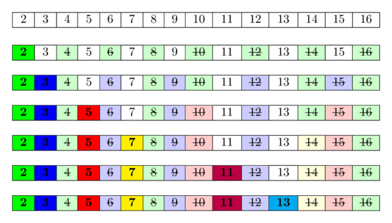

# Bài 11: Lũy Thừa Nhị Phân & Sàng Nguyên Tố

> **Tác giả:** Hà Trí Kiên<br>
> **Nội dung tham khảo từ:** VNOI Wiki - Lũy thừa nhị phân, Sàng nguyên tố

## 1. Lũy Thừa Nhị Phân (Binary Exponentiation)

### Ẩn dụ: Nhân đôi tiền tiết kiệm

Muốn tính 3¹⁰. Thay vì nhân 3 mười lần, ta "nhân đôi":

- 3¹ = 3
- 3² = 3 × 3 = 9
- 3⁴ = 9 × 9 = 81
- 3⁸ = 81 × 81 = 6561

10 = 8 + 2 → 3¹⁰ = 3⁸ × 3² = 6561 × 9 = 59049

Chỉ cần **4 phép nhân** thay vì 10!

### Công thức

```
a^b = (a^(b/2))²       nếu b chẵn
a^b = (a^(b/2))² × a   nếu b lẻ
```

### Minh họa từng bước: Tính 3¹⁰

| Bước | a (gần nhân đôi) | b (số mũ còn lại) | result | Hành động |
|------|-----------------|-----------------|--------|----------|
| Khởi đầu | 3 | 10 | 1 | - |
| i=1 | 3²=9 | 10/2=5 | 1 | b chẵn → chỉ nhân đôi a |
| i=2 | 9²=81 | 5/2=2 | 1×9=9 | b lẻ → result×a, rồi nhân đôi a |
| i=3 | 81²=6561 | 2/2=1 | 9 | b chẵn → chỉ nhân đôi a |
| i=4 | - | 1/2=0 | 9×6561=59049 | b lẻ → result×a. b=0, dừng! |

3¹⁰ = 59049 ✅

**Thành thập phân của 10 = 1010₂. Mỗi bit 1 tương ứng 1 lần nhân!**

### Code C++

```cpp
// Tính a^b - O(log b)
long long power(long long a, long long b) {
    long long result = 1;
    while (b > 0) {
        if (b % 2 == 1)        // Nếu b lẻ → bit này = 1 → nhân result × a
            result *= a;
        a *= a;                 // Nhân đôi a (chuẩn bị cho bit tiếp theo)
        b /= 2;                // Dịch phải b
    }
    return result;
}

// Tính a^b % MOD - O(log b) - DÙNG NHIỀU NHẤT!
long long powerMod(long long a, long long b, long long MOD) {
    long long result = 1;
    a %= MOD;                  // Bước đầu: rút gọn a theo MOD
    while (b > 0) {
        if (b % 2 == 1)        // Bit này = 1 → nhân result × a
            result = (result * a) % MOD;
        a = (a * a) % MOD;     // Nhân đôi a (rồi rút gọn)
        b /= 2;
    }
    return result;
}
```

### Code Python

```python
# Python có sẵn hàm pow(a, b, mod) - rất nhanh!
result = pow(2, 100, 10**9 + 7)  # 2^100 mod (10^9+7)

# Tự cài đặt
def power_mod(a, b, mod):
    result = 1
    a %= mod
    while b > 0:
        if b % 2 == 1:         # Bit này = 1
            result = (result * a) % mod
        a = (a * a) % mod      # Nhân đôi a
        b //= 2
    return result
```

### Ứng dụng: Tính nCk mod p (quan trọng trong thi đấu!)

Để tính $\binom{n}{k} = \frac{n!}{k!(n-k)!} \pmod{p}$, ta cần **nghịch đảo modulo** của giai thừa. Vì $p$ thường là 10⁹+7 (số nguyên tố), dùng định lý Fermat nhỏ: $a^{-1} \equiv a^{p-2} \pmod{p}$.

```cpp
const int MOD = 1e9 + 7;
const int MAXN = 200001;
long long fact[MAXN], inv_fact[MAXN];

void precompute() {
    fact[0] = 1;
    for (int i = 1; i < MAXN; i++)
        fact[i] = fact[i-1] * i % MOD;  // Tính giai thừa
    
    // Nghịch đảo của fact[MAXN-1] bằng Fermat: fact^(MOD-2)
    inv_fact[MAXN-1] = powerMod(fact[MAXN-1], MOD - 2, MOD);
    
    // Tính ngược lại: inv_fact[i] = inv_fact[i+1] * (i+1)
    for (int i = MAXN - 2; i >= 0; i--)
        inv_fact[i] = inv_fact[i+1] * (i+1) % MOD;
}

// nCk mod MOD - O(1) sau khi precompute
long long nCk(int n, int k) {
    if (k < 0 || k > n) return 0;
    return fact[n] % MOD * inv_fact[k] % MOD * inv_fact[n-k] % MOD;
}
```

```python
MOD = 10**9 + 7
MAXN = 200001
fact = [1] * MAXN
for i in range(1, MAXN):
    fact[i] = fact[i-1] * i % MOD

inv_fact = [1] * MAXN
inv_fact[MAXN-1] = pow(fact[MAXN-1], MOD - 2, MOD)  # Fermat
for i in range(MAXN - 2, -1, -1):
    inv_fact[i] = inv_fact[i+1] * (i+1) % MOD

def nCk(n, k):
    if k < 0 or k > n: return 0
    return fact[n] * inv_fact[k] % MOD * inv_fact[n-k] % MOD
```

---

## 2. Sàng nguyên tố Eratosthenes



### Ẩn dụ: Loại người gian lận

Bạn có 100 người xếp hàng. Bắt đầu từ người số 2: đánh dấu tất cả bội số của 2 (4, 6, 8, ...). Tiếp theo người số 3 chưa bị đánh dấu → đánh dấu bội số của 3 (6, 9, 12, ...). Tiếp tục... Ai không bị đánh dấu → là số nguyên tố!

### Sàng SPF (Smallest Prime Factor)
SPF giúp ta phân tích thừa số nguyên tố của bất kỳ số $N$ nào trong $O(\log N)$ sau khi sàng trong $O(N \log \log N)$.

```cpp
vector<int> spf(MAXN);
void sieve_spf() {
    for (int i = 1; i < MAXN; i++) spf[i] = i;
    for (int i = 2; i * i < MAXN; i++) {
        if (spf[i] == i) {
            for (int j = i * i; j < MAXN; j += i)
                if (spf[j] == j) spf[j] = i;
        }
    }
}
vector<int> get_factors(int n) {
    vector<int> res;
    while (n > 1) { res.push_back(spf[n]); n /= spf[n]; }
    return res;
}
```

### Code C++

```cpp
// Sàng Eratosthenes - O(N log log N)
vector<bool> sieve(int n) {
    vector<bool> isPrime(n + 1, true);
    isPrime[0] = isPrime[1] = false;       // 0 và 1 không phải số nguyên tố
    
    for (int i = 2; i * i <= n; i++) {     // Chỉ cần đến √N
        if (isPrime[i]) {                   // Nếu i là số nguyên tố
            for (int j = i * i; j <= n; j += i)
                isPrime[j] = false;         // Đánh dấu bội số (bắt đầu từ i²!)
        }
    }
    return isPrime;
}

// Kiểm tra 1 số có phải nguyên tố không - O(sqrt(N))
bool isPrime(int n) {
    if (n < 2) return false;
    if (n == 2) return true;
    if (n % 2 == 0) return false;
    for (int i = 3; i * i <= n; i += 2)    // Chỉ kiểm tra số lẻ
        if (n % i == 0) return false;
    return true;
}
```

### Code Python

```python
# Sàng Eratosthenes
def sieve(n):
    is_prime = [True] * (n + 1)
    is_prime[0] = is_prime[1] = False
    for i in range(2, int(n**0.5) + 1):
        if is_prime[i]:
            for j in range(i*i, n+1, i):
                is_prime[j] = False
    return is_prime

# Kiểm tra nguyên tố
def is_prime(n):
    if n < 2: return False
    for i in range(2, int(n**0.5) + 1):
        if n % i == 0: return False
    return True
```

---

## 3. Lưu ý

### Bẫy 1: Tràn số khi tính lũy thừa

```cpp
// SAI: a*a có thể tràn long long
result = result * a % MOD;

// ĐÚNG: dùng __int128 hoặc nhân theo modulo
result = (__int128)result * a % MOD;
```

### Code Python

```python
# Python không bị tràn số nguyên (bigint tự động)
# Nhưng vẫn cần modulo để giữ số nhỏ
result = result * a % MOD  # An toàn trong Python!
```

### Bẫy 2: Sàng nguyên tố với N lớn

N = 10⁷ → sàng OK. N = 10⁸ → có thể thiếu bộ nhớ!

**Giải pháp:** Dùng segmented sieve (sàng phân đoạn) cho N rất lớn.

### Mẹo thi cử

| Bài toán | Dùng gì |
|----------|---------|
| Tính a^b % MOD | `powerMod(a, b, MOD)` |
| Kiểm tra nguyên tố N ≤ 10⁷ | Sàng Eratosthenes |
| Kiểm tra nguyên tố N ≤ 10¹² | Miller-Rabin (nâng cao) |
| Phân tích thừa số | Duyệt đến √N |

---

---

## Bài tập luyện tập

| Bài | Nền tảng | Độ khó | Chủ đề |
|-----|----------|--------|--------|
| [CSES - Exponentiation](https://cses.fi/problemset/task/1095) | CSES | ⭐⭐ | Lũy thừa nhị phân |
| [CSES - Exponentiation II](https://cses.fi/problemset/task/1712) | CSES | ⭐⭐⭐ | Fermat nhỏ |
| [CSES - Counting Divisors](https://cses.fi/problemset/task/1713) | CSES | ⭐⭐ | Sàng ước |
| [CSES - Primes](https://cses.fi/problemset/task/1714) | CSES | ⭐⭐ | Sàng nguyên tố |
| [SPOJ - Prime Generator](https://www.spoj.com/problems/PRIME1/) | SPOJ | ⭐⭐ | Sàng phân đoạn |

## Bài viết liên quan

- [Bài 18: Euclid & Modular Inverse](18-euclid-modular-inverse.md)
- [Bài 26: Số học nâng cao](26-so-hoc-nang-cao.md)

## Tài liệu tham khảo

- [VNOI Wiki - Lũy thừa nhị phân](https://wiki.vnoi.info/algo/algebra/binary_exponentation)
- [VNOI Wiki - Sàng nguyên tố](https://wiki.vnoi.info/algo/algebra/prime_sieve)
- [CP-Algorithms - Binary Exponentiation](https://cp-algorithms.com/algebra/binary-exp.html)
- [CP-Algorithms - Sieve of Eratosthenes](https://cp-algorithms.com/algebra/sieve-of-eratosthenes.html)
- [HackerEarth - Number Theory](https://www.hackerearth.com/practice/math/number-theory/basic-number-theory-1/tutorial/)
- [GeeksforGeeks - Binary Exponentiation](https://www.geeksforgeeks.org/dsa/modular-exponentiation-power-in-modular-arithmetic/)

**Bài tiếp theo:** [Linked List chi tiết →](33-linked-list.md)
