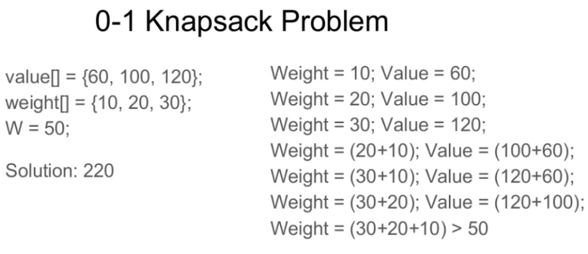

# Bài 12: Quy Hoạch Động (DP) - Từ Nhập Môn Đến Thành Thạo!

> **Tác giả:** Hà Trí Kiên<br>
> **Nội dung tham khảo từ:** VNOI Wiki - Quy hoạch động, Topcoder - DP from Novice to Advanced

## 1. DP là gì?

**DP** = Đệ quy + Nhớ kết quả!

### Ẩn dụ: Leo cầu thang nhớ đường

Bạn leo cầu thang, mỗi bước 1 hoặc 2 bậc. Thay vì tính lại từ đầu mỗi lần, bạn **nhớ kết quả** các bậc đã tính → không tính lại!

**Hai cách tiếp cận DP:**

1. **Top-down (Từ trên xuống):** Dùng đệ quy có nhớ (Memoization). Giải bài toán lớn bằng cách gọi đệ quy các bài toán nhỏ hơn và lưu lại kết quả.
2. **Bottom-up (Từ dưới lên):** Dùng bảng (Tabulation). Giải từ bài toán nhỏ nhất rồi xây dựng dần lên bài toán lớn bằng vòng lặp.

> **Lời khuyên:** Người mới bắt đầu nên luyện tập **Bottom-up** vì nó dễ kiểm soát độ phức tạp và tối ưu bộ nhớ hơn.

---

## 2. 4 bước xây dựng DP

| Bước | Câu hỏi | Ví dụ (Leo cầu thang) |
|------|---------|----------------------|
| 1. Trạng thái | `dp[i]` lưu gì? | Số cách lên bậc i |
| 2. Công thức | `dp[i]` tính từ đâu? | `dp[i] = dp[i-1] + dp[i-2]` |
| 3. Cơ sở | Giá trị ban đầu? | `dp[1]=1, dp[2]=2` |
| 4. Đáp án | Kết quả ở đâu? | `dp[n]` |

---

## 3. Các dạng DP cơ bản

### 3.1. DP tuyến tính (1D)

```cpp
// Leo cầu thang
int climbStairs(int n) {
    if (n <= 2) return n;
    vector<int> dp(n + 1);
    dp[1] = 1; dp[2] = 2;
    for (int i = 3; i <= n; i++)
        dp[i] = dp[i-1] + dp[i-2];
    return dp[n];
}

// Dãy con tăng dài nhất (LIS) - O(N log N)
int lis(vector<int>& a) {
    vector<int> tail;
    for (int x : a) {
        auto it = lower_bound(tail.begin(), tail.end(), x);
        if (it == tail.end()) tail.push_back(x);
        else *it = x;
    }
    return tail.size();
}
```

### Code Python: DP tuyến tính

```python
import bisect

# Leo cầu thang
def climb_stairs(n):
    if n <= 2:
        return n
    dp = [0] * (n + 1)
    dp[1], dp[2] = 1, 2
    for i in range(3, n + 1):
        dp[i] = dp[i - 1] + dp[i - 2]
    return dp[n]

# Dãy con tăng dài nhất (LIS) - O(N log N)
def lis(a):
    tail = []
    for x in a:
        pos = bisect.bisect_left(tail, x)
        if pos == len(tail):
            tail.append(x)
        else:
            tail[pos] = x
    return len(tail)
```

### 3.2. DP 2 chiều (Knapsack)



```cpp
// Cái túi 0/1
int knapsack(vector<int>& w, vector<int>& v, int W) {
    int n = w.size();
    vector<vector<int>> dp(n + 1, vector<int>(W + 1, 0));
    for (int i = 1; i <= n; i++) {
        for (int j = 0; j <= W; j++) {
            dp[i][j] = dp[i-1][j];  // Không lấy
            if (j >= w[i-1])
                dp[i][j] = max(dp[i][j], dp[i-1][j - w[i-1]] + v[i-1]);
        }
    }
    return dp[n][W];
}
```

### Code Python: Knapsack 0/1

```python
def knapsack(w, v, W):
    n = len(w)
    dp = [[0] * (W + 1) for _ in range(n + 1)]
    for i in range(1, n + 1):
        for j in range(W + 1):
            dp[i][j] = dp[i - 1][j]  # Không lấy
            if j >= w[i - 1]:
                dp[i][j] = max(dp[i][j], dp[i - 1][j - w[i - 1]] + v[i - 1])
    return dp[n][W]
```

### 3.3. DP trên xâu

```cpp
// Xâu con chung nhất (LCS)
int lcs(string a, string b) {
    int n = a.size(), m = b.size();
    vector<vector<int>> dp(n + 1, vector<int>(m + 1, 0));
    for (int i = 1; i <= n; i++) {
        for (int j = 1; j <= m; j++) {
            if (a[i-1] == b[j-1])
                dp[i][j] = dp[i-1][j-1] + 1;
            else
                dp[i][j] = max(dp[i-1][j], dp[i][j-1]);
        }
    }
    return dp[n][m];
}

// Khoảng cách chỉnh sửa (Edit Distance)
int editDistance(string a, string b) {
    int n = a.size(), m = b.size();
    vector<vector<int>> dp(n + 1, vector<int>(m + 1));
    for (int i = 0; i <= n; i++) dp[i][0] = i;
    for (int j = 0; j <= m; j++) dp[0][j] = j;
    for (int i = 1; i <= n; i++) {
        for (int j = 1; j <= m; j++) {
            if (a[i-1] == b[j-1]) dp[i][j] = dp[i-1][j-1];
            else dp[i][j] = 1 + min({dp[i-1][j], dp[i][j-1], dp[i-1][j-1]});
        }
    }
    return dp[n][m];
}
```

### Code Python: DP trên xâu

```python
# Xâu con chung nhất (LCS)
def lcs(a, b):
    n, m = len(a), len(b)
    dp = [[0] * (m + 1) for _ in range(n + 1)]
    for i in range(1, n + 1):
        for j in range(1, m + 1):
            if a[i - 1] == b[j - 1]:
                dp[i][j] = dp[i - 1][j - 1] + 1
            else:
                dp[i][j] = max(dp[i - 1][j], dp[i][j - 1])
    return dp[n][m]

# Khoảng cách chỉnh sửa (Edit Distance)
def edit_distance(a, b):
    n, m = len(a), len(b)
    dp = [[0] * (m + 1) for _ in range(n + 1)]
    for i in range(n + 1):
        dp[i][0] = i
    for j in range(m + 1):
        dp[0][j] = j
    for i in range(1, n + 1):
        for j in range(1, m + 1):
            if a[i - 1] == b[j - 1]:
                dp[i][j] = dp[i - 1][j - 1]
            else:
                dp[i][j] = 1 + min(dp[i - 1][j], dp[i][j - 1], dp[i - 1][j - 1])
    return dp[n][m]
```

### 3.4. DP trên lưới (Grid DP)

```cpp
// Đếm số cách đi từ góc trái trên đến góc phải dưới
// Chỉ được đi sang phải hoặc đi xuống
int uniquePaths(int n, int m) {
    vector<vector<int>> dp(n, vector<int>(m, 0));
    for (int i = 0; i < n; i++) dp[i][0] = 1;
    for (int j = 0; j < m; j++) dp[0][j] = 1;
    for (int i = 1; i < n; i++)
        for (int j = 1; j < m; j++)
            dp[i][j] = dp[i-1][j] + dp[i][j-1];
    return dp[n-1][m-1];
}

// Tổng lớn nhất trên đường đi trong lưới
int maxPathSum(vector<vector<int>>& grid) {
    int n = grid.size(), m = grid[0].size();
    vector<vector<int>> dp(n, vector<int>(m));
    dp[0][0] = grid[0][0];
    for (int i = 1; i < n; i++) dp[i][0] = dp[i-1][0] + grid[i][0];
    for (int j = 1; j < m; j++) dp[0][j] = dp[0][j-1] + grid[0][j];
    for (int i = 1; i < n; i++)
        for (int j = 1; j < m; j++)
            dp[i][j] = max(dp[i-1][j], dp[i][j-1]) + grid[i][j];
    return dp[n-1][m-1];
}
```

### Code Python: DP trên lưới

```python
# Đếm số cách đi từ góc trái trên đến góc phải dưới
def unique_paths(n, m):
    dp = [[0] * m for _ in range(n)]
    for i in range(n):
        dp[i][0] = 1
    for j in range(m):
        dp[0][j] = 1
    for i in range(1, n):
        for j in range(1, m):
            dp[i][j] = dp[i - 1][j] + dp[i][j - 1]
    return dp[n - 1][m - 1]

# Tổng lớn nhất trên đường đi trong lưới
def max_path_sum(grid):
    n, m = len(grid), len(grid[0])
    dp = [[0] * m for _ in range(n)]
    dp[0][0] = grid[0][0]
    for i in range(1, n):
        dp[i][0] = dp[i - 1][0] + grid[i][0]
    for j in range(1, m):
        dp[0][j] = dp[0][j - 1] + grid[0][j]
    for i in range(1, n):
        for j in range(1, m):
            dp[i][j] = max(dp[i - 1][j], dp[i][j - 1]) + grid[i][j]
    return dp[n - 1][m - 1]
```

### 3.5. DP bitmask (Trạng thái nén)

Khi N ≤ 20 và cần lưu trạng thái "đã chọn những phần tử nào":

```cpp
// Bài toán: Phân công N người vào N việc sao cho tổng chi phí nhỏ nhất
// dp[mask] = chi phí nhỏ nhất khi đã phân công các người theo mask
int assignment(vector<vector<int>>& cost) {
    int n = cost.size();
    vector<int> dp(1 << n, INT_MAX);
    dp[0] = 0;
    for (int mask = 0; mask < (1 << n); mask++) {
        int person = __builtin_popcount(mask);  // Người thứ mấy
        for (int job = 0; job < n; job++) {
            if (!(mask & (1 << job))) {  // Việc job chưa được giao
                int newMask = mask | (1 << job);
                dp[newMask] = min(dp[newMask], dp[mask] + cost[person][job]);
            }
        }
    }
    return dp[(1 << n) - 1];
}
```

### Code Python: DP bitmask

```python
# Phân công N người vào N việc sao cho tổng chi phí nhỏ nhất
def assignment(cost):
    n = len(cost)
    INF = float('inf')
    dp = [INF] * (1 << n)
    dp[0] = 0
    for mask in range(1 << n):
        person = bin(mask).count('1')  # Người thứ mấy
        for job in range(n):
            if not (mask & (1 << job)):  # Việc job chưa được giao
                new_mask = mask | (1 << job)
                dp[new_mask] = min(dp[new_mask], dp[mask] + cost[person][job])
    return dp[(1 << n) - 1]
```

### 3.6. Tối ưu bộ nhớ

```cpp
// Chỉ cần 1 hàng thay vì 2D
vector<int> dp(W + 1, 0);
for (int i = 1; i <= n; i++) {
    for (int j = W; j >= w[i-1]; j--)  // Duyệt NGƯỢC!
        dp[j] = max(dp[j], dp[j - w[i-1]] + v[i-1]);
}
```

### Code Python: Tối ưu bộ nhớ

```python
# Chỉ cần 1 hàng thay vì 2D
def knapsack_optimized(w, v, W):
    dp = [0] * (W + 1)
    for i in range(len(w)):
        for j in range(W, w[i] - 1, -1):  # Duyệt NGƯỢC!
            dp[j] = max(dp[j], dp[j - w[i]] + v[i])
    return dp[W]
```

### Code Python

```python
import bisect

# ===== 1. Leo cầu thang =====
def climb_stairs(n):
    if n <= 2: return n
    dp = [0] * (n + 1)
    dp[1], dp[2] = 1, 2
    for i in range(3, n + 1):
        dp[i] = dp[i-1] + dp[i-2]
    return dp[n]

# ===== 2. LIS - Dãy con tăng dài nhất O(N log N) =====
def lis(a):
    tail = []
    for x in a:
        pos = bisect.bisect_left(tail, x)
        if pos == len(tail):
            tail.append(x)
        else:
            tail[pos] = x
    return len(tail)

# ===== 3. Knapsack 0/1 =====
def knapsack(w, v, W):
    n = len(w)
    dp = [[0] * (W + 1) for _ in range(n + 1)]
    for i in range(1, n + 1):
        for j in range(W + 1):
            dp[i][j] = dp[i-1][j]  # Không lấy
            if j >= w[i-1]:
                dp[i][j] = max(dp[i][j], dp[i-1][j - w[i-1]] + v[i-1])
    return dp[n][W]

# ===== 4. LCS - Xâu con chung nhất =====
def lcs(a, b):
    n, m = len(a), len(b)
    dp = [[0] * (m + 1) for _ in range(n + 1)]
    for i in range(1, n + 1):
        for j in range(1, m + 1):
            if a[i-1] == b[j-1]:
                dp[i][j] = dp[i-1][j-1] + 1
            else:
                dp[i][j] = max(dp[i-1][j], dp[i][j-1])
    return dp[n][m]

# ===== 5. Edit Distance =====
def edit_distance(a, b):
    n, m = len(a), len(b)
    dp = [[0] * (m + 1) for _ in range(n + 1)]
    for i in range(n + 1): dp[i][0] = i
    for j in range(m + 1): dp[0][j] = j
    for i in range(1, n + 1):
        for j in range(1, m + 1):
            if a[i-1] == b[j-1]:
                dp[i][j] = dp[i-1][j-1]
            else:
                dp[i][j] = 1 + min(dp[i-1][j], dp[i][j-1], dp[i-1][j-1])
    return dp[n][m]

# ===== 6. Grid DP - Số cách đi =====
def unique_paths(n, m):
    dp = [[0] * m for _ in range(n)]
    for i in range(n): dp[i][0] = 1
    for j in range(m): dp[0][j] = 1
    for i in range(1, n):
        for j in range(1, m):
            dp[i][j] = dp[i-1][j] + dp[i][j-1]
    return dp[n-1][m-1]

# ===== 7. Knapsack tối ưu bộ nhớ =====
def knapsack_optimized(w, v, W):
    dp = [0] * (W + 1)
    for i in range(len(w)):
        for j in range(W, w[i] - 1, -1):  # Duyệt NGƯỢC!
            dp[j] = max(dp[j], dp[j - w[i]] + v[i])
    return dp[W]
```

---

## 4. Nhận biết bài DP

| Dấu hiệu | Dạng DP |
|----------|---------|
| "Đếm số cách" | Cộng trạng thái |
| "Tìm max/min" | Max/min trạng thái |
| "Có N vật, chọn hoặc không" | Knapsack |
| "Xâu con chung" | LCS |
| "Dãy con tăng" | LIS |
| "Palindrome" | DP trên xâu |
| "Đi trên lưới" | DP 2D |

### Mẹo nhận biết bài DP

1. **Có từ "cách" hoặc "đếm":** Gần như chắc chắn là DP đếm
2. **Có từ "tối ưu" (max, min, ít nhất, nhiều nhất):** Gần như chắc chắn là DP tối ưu
3. **Bài toán có thể chia thành bài toán con nhỏ hơn:** Dấu hiệu rõ ràng của DP
4. **Quyết định tại mỗi bước:** "Chọn hoặc không chọn", "đi trái hoặc phải" → DP
5. **Kết quả của bài toán con không phụ thuộc cách đạt được nó:** Thỏa mãn tính chất tối ưu con

### Cách tiếp cận bài DP mới

1. **Xác định trạng thái:** `dp[i]` hoặc `dp[i][j]` lưu gì?
2. **Viết công thức truy hồi:** `dp[i]` tính từ đâu?
3. **Xác định cơ sở:** Giá trị ban đầu?
4. **Xác định thứ tự tính:** Tính từ cơ sở → đáp án
5. **Truy vết (nếu cần):** Lưu lại lựa chọn tại mỗi bước

---

## 4.5. Lưu ý / Cạm bẫy

### 4.5.1. Sai thứ tự duyệt (Knapsack tối ưu bộ nhớ)

```cpp
// SAI: Duyệt xuôi → dùng 1 vật nhiều lần (Unbounded Knapsack)
for (int i = 0; i < n; i++)
    for (int j = w[i]; j <= W; j++)  // Xuôi!
        dp[j] = max(dp[j], dp[j - w[i]] + v[i]);

// ĐÚNG: Duyệt ngược → mỗi vật dùng đúng 1 lần (0/1 Knapsack)
for (int i = 0; i < n; i++)
    for (int j = W; j >= w[i]; j--)  // Ngược!
        dp[j] = max(dp[j], dp[j - w[i]] + v[i]);
```

**Quy tắc:**

- 0/1 Knapsack: duyệt **ngược** (từ W về w[i])
- Unbounded Knapsack: duyệt **xuôi** (từ w[i] đến W)

### 4.5.2. Quên cơ sở (Base Case)

```cpp
// SAI: Quên khởi tạo dp[0]
// dp[0] = ? (chưa gán → giá trị rác!)

// ĐÚNG: Luôn khởi tạo cơ sở trước
dp[0] = 0;  // hoặc dp[0] = 1 tùy bài

// Edit Distance: PHẢI khởi tạo hàng 0 và cột 0
for (int i = 0; i <= n; i++) dp[i][0] = i;  // Xóa i ký tự
for (int j = 0; j <= m; j++) dp[0][j] = j;  // Chèn j ký tự
```

### 4.5.3. Tràn số nguyên (Integer Overflow)

```cpp
// SAI: dp[i] có thể vượt quá int
int dp[MAXN];  // int chỉ đến ~2×10^9

// ĐÚNG: Dùng long long khi có thể
long long dp[MAXN];

// Dấu hiệu cần long long:
// - Giá trị a[i] đến 10^9, N đến 10^3 → tổng đến 10^12
// - Đếm số cách với MOD 10^9+7 → vẫn dùng long long để tránh overflow khi nhân
```

### 4.5.4. Quên modulo khi đếm

```cpp
// SAI: Kết quả quá lớn → overflow
dp[i] = dp[i-1] + dp[i-2];

// ĐÚNG: Luôn modulo
const int MOD = 1e9 + 7;
dp[i] = (dp[i-1] + dp[i-2]) % MOD;

// Cẩn thận khi trừ:
dp[i] = (dp[i-1] - dp[i-2] + MOD) % MOD;  // +MOD để tránh số âm!
```

### 4.5.5. Truy vết sai chỉ số

```cpp
// SAI: Dùng i-1 nhưng mảng 0-indexed
if (a[i] == b[j])  // Nếu mảng 0-indexed → đúng
    dp[i][j] = dp[i-1][j-1] + 1;

// Cẩn thận với mảng 1-indexed:
// dp[i][j] tương ứng a[i-1], b[j-1] (vì dp khởi tạo từ 1)
if (a[i-1] == b[j-1])  // PHẢI dùng i-1, j-1
    dp[i][j] = dp[i-1][j-1] + 1;
```

### 4.5.6. Space Optimization: Quên rằng chỉ cần hàng trước

```cpp
// SAI: Dùng toàn bộ mảng 2D khi chỉ cần hàng trước
vector<vector<int>> dp(n + 1, vector<int>(W + 1));

// ĐÚNG: Chỉ cần 2 hàng (hoặc 1 hàng + duyệt ngược)
vector<int> prev(W + 1, 0), curr(W + 1, 0);
for (int i = 1; i <= n; i++) {
    for (int j = 0; j <= W; j++) {
        curr[j] = prev[j];
        if (j >= w[i-1])
            curr[j] = max(curr[j], prev[j - w[i-1]] + v[i-1]);
    }
    swap(prev, curr);  // Hàng hiện tại thành hàng trước
}
```

### 4.5.7. Bitmask DP: Sai thứ tự duyệt mask

```cpp
// SAI: Duyệt mask không đảm bảo submask đã tính
for (int mask = (1<<n)-1; mask >= 0; mask--)  // Ngược!

// ĐÚNG: Duyệt xuôi (từ 0 đến 2^n - 1)
for (int mask = 0; mask < (1 << n); mask++) {
    // Mọi submask của mask đều đã được tính
}
```

---

## 5. Bài tập luyện tập (theo độ khó)

| Bài | Nền tảng | Độ khó |
|-----|----------|--------|
| [CSES - Dice Combinations](https://cses.fi/problemset/task/1633) | CSES | ⭐ |
| [CSES - Minimizing Coins](https://cses.fi/problemset/task/1634) | CSES | ⭐⭐ |
| [CSES - Longest Common Subsequence](https://cses.fi/problemset/task/3403) | CSES | ⭐⭐ |
| [Atcoder DP Contest](https://atcoder.jp/contests/dp) | Atcoder | ⭐⭐-⭐⭐⭐ |
| [LeetCode - DP Study Plan](https://leetcode.com/studyplan/dynamic-programming/) | LeetCode | ⭐⭐-⭐⭐⭐ |
| [VNOJ - Atcoder DP D - Knapsack 1](https://oj.vnoi.info/problem/atcoder_dp_d) | VNOJ | ⭐⭐ |
| [VNOJ - Atcoder DP F - LCS](https://oj.vnoi.info/problem/atcoder_dp_f) | VNOJ | ⭐⭐ |
| [VNOJ - Atcoder DP E - Knapsack 2](https://oj.vnoi.info/problem/atcoder_dp_e) | VNOJ | ⭐⭐⭐ |
| [VNOJ - LIS](https://oj.vnoi.info/problem/lis) | VNOJ | ⭐⭐ |

## 6. Bài viết liên quan

- [Bài 6: Đệ quy và quay lui](06-de-quy-va-quay-lui.md) (Nền tảng cho DP)
- [Bài 3: Tìm kiếm nhị phân](03-tim-kiem-nhi-phan.md) (Binary Search on Answer)
- [Bài 5: Phép toán bit](05-phep-toan-bit.md) (DP bitmask)
- [Bài 15: Deque & Sliding Window](15-deque-sliding-window.md) (Tối ưu DP)
- [Bài 13: MST, Dijkstra, Topo Sort](13-mst-dijkstra-topo-sort.md) (DP trên DAG)

## 7. Tài liệu tham khảo

- [CP-Algorithms - Introduction to DP](https://cp-algorithms.com/dynamic_programming/intro-to-dp.html)
- [USACO Guide - Introduction to DP](https://usaco.guide/gold/intro-dp)
- [Topcoder - DP from Novice to Advanced](https://www.topcoder.com/thrive/articles/Dynamic%20Programming:%20From%20Novice%20to%20Advanced)
- [Codeforces - DP Tutorial and Problem List](https://codeforces.com/blog/entry/67679)
- [Errichto - DP Tutorials (YouTube)](https://www.youtube.com/playlist?list=PLtfqa971vD5FQIQuAaZe4thK-QGOdAou3)
- [VNOI Wiki - Quy hoạch động cơ bản](https://wiki.vnoi.info/algo/dp/basic-dynamic-programming-1)
- [GeeksforGeeks - Dynamic Programming](https://www.geeksforgeeks.org/dsa/introduction-to-dynamic-programming-data-structures-and-algorithm-tutorials/)
