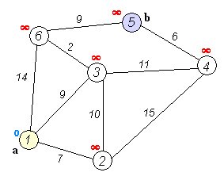
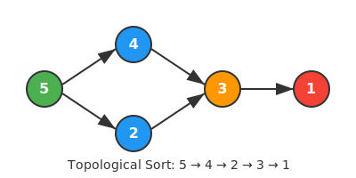

# Bài 13: MST, Dijkstra, Topo Sort - Đồ Thị Nâng Cao

> **Tác giả:** Hà Trí Kiên<br>
> **Nội dung tham khảo từ:** VNOI Wiki - Cây khung nhỏ nhất, Đường đi ngắn nhất, Sắp xếp Tô-pô

## 1. MST - Cây Khung Nhỏ Nhất

### Ẩn dụ: Lắp mạng internet

Có N nhà, M đường dây nối giữa các nhà. Muốn nối tất cả nhà với chi phí thấp nhất → tìm **cây khung nhỏ nhất** (MST)!

### Thuật toán Kruskal

**Ý tưởng:** Sắp xếp tất cả cạnh theo trọng số tăng dần. Duyệt, nếu cạnh không tạo chu trình → thêm vào MST.

=== "C++"

    ```cpp
    #include <algorithm>
    using namespace std;
    
    struct Edge {
        int u, v, w;
        bool operator<(const Edge& other) const {
            return w < other.w;
        }
    };
    
    // DSU (Disjoint Set Union) - xem lại Bài 8
    struct DSU {
        vector<int> parent, sz;
        DSU(int n) {
            parent.resize(n + 1);
            sz.resize(n + 1, 1);
            for (int i = 1; i <= n; i++) parent[i] = i;
        }
        int find(int v) {
            if (v == parent[v]) return v;
            return parent[v] = find(parent[v]);
        }
        bool unite(int a, int b) {
            a = find(a); b = find(b);
            if (a == b) return false;
            if (sz[a] < sz[b]) swap(a, b);
            parent[b] = a;
            sz[a] += sz[b];
            return true;
        }
    };
    
    long long kruskal(int n, vector<Edge>& edges) {
        sort(edges.begin(), edges.end());
        DSU dsu(n);
        long long mst_weight = 0;
        int edges_used = 0;
        
        for (auto& e : edges) {
            if (dsu.unite(e.u, e.v)) {
                mst_weight += e.w;
                edges_used++;
                if (edges_used == n - 1) break;
            }
        }
        return (edges_used == n - 1) ? mst_weight : -1;
    }
    ```

=== "Python"

    ```python
    class DSU:
        def __init__(self, n):
            self.parent = list(range(n + 1))
            self.sz = [1] * (n + 1)
        
        def find(self, v):
            if v == self.parent[v]:
                return v
            self.parent[v] = self.find(self.parent[v])
            return self.parent[v]
        
        def unite(self, a, b):
            a, b = self.find(a), self.find(b)
            if a == b:
                return False
            if self.sz[a] < self.sz[b]:
                a, b = b, a
            self.parent[b] = a
            self.sz[a] += self.sz[b]
            return True
    
    def kruskal(n, edges):
        edges.sort(key=lambda e: e[2])  # Sắp xếp theo trọng số
        dsu = DSU(n)
        mst_weight = 0
        edges_used = 0
        
        for u, v, w in edges:
            if dsu.unite(u, v):
                mst_weight += w
                edges_used += 1
                if edges_used == n - 1:
                    break
        
        return mst_weight if edges_used == n - 1 else -1
    ```

### Thuật toán Prim

**Ý tưởng:** Bắt đầu từ đỉnh bất kỳ. Mỗi bước, chọn cạnh nhỏ nhất nối đỉnh đã thăm với đỉnh chưa thăm.

=== "C++"

    ```cpp
    long long prim(int n, vector<vector<pair<int,int>>>& adj) {
        vector<bool> visited(n + 1, false);
        priority_queue<pair<int,int>, vector<pair<int,int>>, greater<>> pq;
        pq.push({0, 1});  // {trọng số, đỉnh}
        long long mst_weight = 0;
        int count = 0;
        
        while (!pq.empty() && count < n) {
            auto [w, u] = pq.top();
            pq.pop();
            if (visited[u]) continue;
            visited[u] = true;
            mst_weight += w;
            count++;
            
            for (auto [v, weight] : adj[u]) {
                if (!visited[v])
                    pq.push({weight, v});
            }
        }
        return (count == n) ? mst_weight : -1;
    }
    ```

=== "Python"

    ```python
    import heapq
    
    def prim(n, adj):
        visited = [False] * (n + 1)
        pq = [(0, 1)]  # (trọng số, đỉnh)
        mst_weight = 0
        count = 0
        
        while pq and count < n:
            w, u = heapq.heappop(pq)
            if visited[u]:
                continue
            visited[u] = True
            mst_weight += w
            count += 1
            
            for v, weight in adj[u]:
                if not visited[v]:
                    heapq.heappush(pq, (weight, v))
        
        return mst_weight if count == n else -1
    ```

!!! tip "Thử tương tác"
    - [Kruskal's MST](https://algorithm-visualizer.org/greedy/kruskals-minimum-spanning-tree)
    - [Prim's MST](https://algorithm-visualizer.org/greedy/prims-minimum-spanning-tree)
    - [Dijkstra's Shortest Path](https://algorithm-visualizer.org/greedy/dijkstras-shortest-path)

---

## 2. Dijkstra - Đường Đi Ngắn Nhất

### Ẩn dụ: Google Maps

Bạn muốn đi từ A đến B. Có nhiều con đường, mỗi con đường có độ dài khác nhau. Tìm đường ngắn nhất!

### Ý tưởng

Bắt đầu từ đỉnh nguồn. Mỗi bước, chọn đỉnh **chưa thăm** có khoảng cách nhỏ nhất, cập nhật khoảng cách các đỉnh kề.


*Minh họa thuật toán Dijkstra tìm đường đi ngắn nhất*

=== "C++"

    ```cpp
    vector<long long> dijkstra(int start, int n, vector<vector<pair<int,int>>>& adj) {
        vector<long long> dist(n + 1, LLONG_MAX);
        priority_queue<pair<long long,int>, vector<pair<long long,int>>, greater<>> pq;
        
        dist[start] = 0;
        pq.push({0, start});
        
        while (!pq.empty()) {
            auto [d, u] = pq.top();
            pq.pop();
            
            if (d > dist[u]) continue;  // Đã có đường ngắn hơn
            
            for (auto [v, w] : adj[u]) {
                if (dist[u] + w < dist[v]) {
                    dist[v] = dist[u] + w;
                    pq.push({dist[v], v});
                }
            }
        }
        return dist;
    }
    ```

=== "Python"

    ```python
    import heapq
    
    def dijkstra(start, n, adj):
        dist = [float('inf')] * (n + 1)
        dist[start] = 0
        pq = [(0, start)]
        
        while pq:
            d, u = heapq.heappop(pq)
            if d > dist[u]:
                continue
            for v, w in adj[u]:
                if dist[u] + w < dist[v]:
                    dist[v] = dist[u] + w
                    heapq.heappush(pq, (dist[v], v))
        return dist
    ```

**Độ phức tạp:** O((V + E) log V) với priority_queue.

### Minh họa chạy chi tiết Dijkstra

```
Đồ thị:   1 --1--> 2 --2--> 4
          |                 ↑
          4                 |
          ↓                 1
          3 --------3------→

Adjacency list:
  1: [(2, 1), (3, 4)]
  2: [(4, 2)]
  3: [(4, 1)]

Dijkstra từ đỉnh 1:

Khởi tạo: dist = [∞, 0, ∞, ∞]  (dist[1]=0, còn lại ∞)
          pq = [(0, 1)]

Bước 1: Pop (0, 1). Duyệt kề:
  2: dist[1]+1=1 < ∞ → dist[2]=1, push (1, 2)
  3: dist[1]+4=4 < ∞ → dist[3]=4, push (4, 3)
  dist = [∞, 0, 1, 4, ∞]
  pq = [(1, 2), (4, 3)]

Bước 2: Pop (1, 2). Duyệt kề:
  4: dist[2]+2=3 < ∞ → dist[4]=3, push (3, 4)
  dist = [∞, 0, 1, 4, 3]
  pq = [(3, 4), (4, 3)]

Bước 3: Pop (3, 4). 4 không có đỉnh kề chưa thăm.
  pq = [(4, 3)]

Bước 4: Pop (4, 3). Duyệt kề:
  4: dist[3]+1=5 > dist[4]=3 → KHÔNG cập nhật!
  pq = []

Kết quả: dist = [∞, 0, 1, 4, 3]
  Đường ngắn nhất 1→4: 1→2→4, độ dài = 3 ✅
```

**Lưu ý quan trọng:** Tại bước 4, đỉnh 3 cố gắng cập nhật dist[4] nhưng bị bỏ qua vì đã có đường ngắn hơn (3 < 5). Đây chính là lý do Dijkstra chỉ hoạt động đúng với trọng số không âm!

---

## 3. Sắp Xếp Tô-pô (Topological Sort)


*Minh họa sắp xếp tô-pô (Topological Sort)*

### Ẩn dụ: Môn học tiên quyết

Muốn học "Lập trình" phải học "Tin học cơ bản" trước. Muốn học "Cấu trúc dữ liệu" phải học "Lập trình" trước. Sắp xếp thứ tự học hợp lý!

### Ý tưởng

Sắp xếp các đỉnh của DAG (đồ thị có hướng không chu trình) sao cho mọi cạnh đều đi từ trái sang phải.

=== "C++"

    ```cpp
    vector<int> topoSort(int n, vector<vector<int>>& adj) {
        vector<int> inDegree(n + 1, 0);
        for (int u = 1; u <= n; u++)
            for (int v : adj[u])
                inDegree[v]++;
        
        queue<int> q;
        for (int i = 1; i <= n; i++)
            if (inDegree[i] == 0) q.push(i);
        
        vector<int> result;
        while (!q.empty()) {
            int u = q.front();
            q.pop();
            result.push_back(u);
            
            for (int v : adj[u]) {
                inDegree[v]--;
                if (inDegree[v] == 0)
                    q.push(v);
            }
        }
        
        if (result.size() != n) return {};  // Có chu trình!
        return result;
    }
    ```

=== "Python"

    ```python
    from collections import deque
    
    def topo_sort(n, adj):
        in_degree = [0] * (n + 1)
        for u in range(1, n + 1):
            for v in adj[u]:
                in_degree[v] += 1
        
        q = deque([i for i in range(1, n + 1) if in_degree[i] == 0])
        result = []
        
        while q:
            u = q.popleft()
            result.append(u)
            for v in adj[u]:
                in_degree[v] -= 1
                if in_degree[v] == 0:
                    q.append(v)
        
        return result if len(result) == n else []
    ```

---

## 4. Lưu ý

| Thuật toán | Khi nào dùng | Độ phức tạp |
|-----------|---------------|-------------|
| Kruskal | MST, cạnh ít | O(E log E) |
| Prim | MST, cạnh nhiều | O(E log V) |
| Dijkstra | Đường đi ngắn nhất (trọng số ≥ 0) | O(E log V) |
| Bellman-Ford | Đường đi ngắn nhất (có trọng số âm) | O(VE) |
| Floyd-Warshall | Đường đi ngắn nhất mọi cặp | O(V³) |
| Topo Sort | Sắp xếp thứ tự ưu tiên trên DAG | O(V + E) |

### Bẫy hay gặp

**Bẫy 1: Dijkstra với trọng số âm**

```cpp
// SAI: Dijkstra KHÔNG hoạt động đúng với trọng số âm!
// Ví dụ: A --(-5)--> B --(1)--> C
// Dijkstra: dist[B] = -5, nhưng đã pop B trước khi cập nhật
// → Kết quả sai nếu có đường tốt hơn qua C

// ĐÚNG: Dùng Bellman-Ford cho đồ thị có trọng số âm
```

**Bẫy 2: Topo Sort trên đồ thị có chu trình**

```cpp
// Nếu result.size() < n → đồ thị có chu trình!
if (result.size() != n) return {};  // Báo lỗi

// Bẫy: Quên kiểm tra → kết quả sai mà không biết
```

**Bẫy 3: MST trên đồ thị không liên thông**

```cpp
// Kruskal: edges_used < n-1 → không liên thông → không có MST!
return (edges_used == n - 1) ? mst_weight : -1;

// Bẫy: Quên kiểm tra → trả về MST "một phần" mà không biết
```

**Bẫy 4: Prim với đồ thị có cạnh trùng**

```cpp
// Nếu có nhiều cạnh giữa 2 đỉnh, Prim vẫn đúng (chọn nhỏ nhất)
// Nhưng Kruskal cũng đúng (DSU bỏ qua cạnh tạo chu trình)
```

**Bẫy 5: Quên `visited` trong Prim**

```cpp
// SAI: Không kiểm tra visited → đỉnh bị xử lý nhiều lần
if (visited[u]) continue;  // ← PHẢI CÓ DÒNG NÀY
```

---

---

## Bài tập luyện tập

| Bài | Nền tảng | Độ khó | Chủ đề |
|-----|----------|--------|--------|
| [CSES - Road Reparation](https://cses.fi/problemset/task/1675) | CSES | ⭐⭐ | MST |
| [CSES - Road Construction](https://cses.fi/problemset/task/1676) | CSES | ⭐⭐ | DSU + MST |
| [CSES - Shortest Routes I](https://cses.fi/problemset/task/1671) | CSES | ⭐⭐ | Dijkstra |
| [CSES - Shortest Routes II](https://cses.fi/problemset/task/1672) | CSES | ⭐⭐ | Floyd-Warshall |
| [CSES - Course Schedule](https://cses.fi/problemset/task/1679) | CSES | ⭐⭐ | Topo Sort |
| [CSES - Longest Flight Route](https://cses.fi/problemset/task/1680) | CSES | ⭐⭐⭐ | Topo + DP |
| [VNOJ - QBMST](https://oj.vnoi.info/problem/qbmst) | VNOJ | ⭐⭐ | MST cơ bản |
| [VNOJ - DIJKSTRA](https://oj.vnoi.info/problem/dijkstra) | VNOJ | ⭐⭐ | Dijkstra |
| [VNOJ - TOPOSORT](https://oj.vnoi.info/problem/toposort) | VNOJ | ⭐⭐ | Topo sort |

## Bài viết liên quan

- [Bài 8b: DSU](08b-dsu.md)
- [Bài 10: BFS & DFS](10-bfs-dfs-do-thi.md)
- [Bài 23: Floyd-Warshall & Bellman-Ford](23-floyd-warshall-bellman-ford.md)

## Tài liệu tham khảo

- [VNOI Wiki - Cây khung nhỏ nhất](https://wiki.vnoi.info/algo/graph-theory/minimum-spanning-tree)
- [VNOI Wiki - Đường đi ngắn nhất](https://wiki.vnoi.info/algo/graph-theory/shortest-path)
- [VNOI Wiki - Sắp xếp Tô-pô](https://wiki.vnoi.info/algo/graph-theory/topological-sort)
- [CP-Algorithms - Prim's Algorithm](https://cp-algorithms.com/graph/mst_prim.html)
- [CP-Algorithms - Kruskal's Algorithm](https://cp-algorithms.com/graph/mst_kruskal.html)
- [CP-Algorithms - Topological Sort](https://cp-algorithms.com/graph/topological-sort.html)
- [GeeksforGeeks - Kruskal's MST](https://www.geeksforgeeks.org/dsa/kruskals-minimum-spanning-tree-algorithm-greedy-algo-2/)
- [YouTube - Dijkstra's Algorithm (takeuforward)](https://www.youtube.com/watch?v=V6H1qAeB-l4)

**Bài tiếp theo:** [Hash xâu & Z-algorithm →](14-hash-xau-z-algorithm.md)