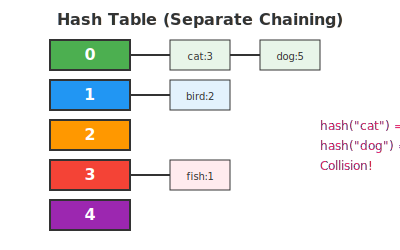

# Bài 16: Hash Table (Bảng Băm)

> **Tác giả:** Hà Trí Kiên<br>
> **Nội dung tham khảo từ:** VNOI Wiki - Bảng băm

## 1. Chuyện gì đang xảy ra?

### Bài toán: Tra cứu từ điển

Bạn có 100.000 từ tiếng Anh. Người dùng nhập 1 từ, hỏi từ đó có trong từ điển không?

**Cách "ngốc":** Duyệt tuần tự → O(N) mỗi truy vấn. 100.000 truy vấn → O(10¹⁰). Quá chậm!

**Hash Table:** O(1) mỗi truy vấn! Như tra cứu theo mục lục sách.

---

## 2. Hash Table hoạt động như thế nào?



### Ẩn dụ: Tủ hồ sơ

Mỗi hồ sơ có 1 "mã số" (hash). Khi cần tìm hồ sơ → tính mã số → mở ngăn kéo đúng mã số → lấy ra!

```
"hello" → hash("hello") = 7 → lưu ở ngăn kéo 7
"world" → hash("world") = 3 → lưu ở ngăn kéo 3
```

### Hàm băm (Hash Function)

Hàm băm chuyển đổi key thành một chỉ số trong mảng. Hàm băm tốt phải:

- **Nhanh:** O(1) để tính
- **Phân phối đều:** Các key nên rơi vào các vị trí khác nhau
- **Xác định:** Cùng key → cùng hash (luôn luôn)

=== "C++"

    ```cpp
    // Ví dụ hàm băm đơn giản cho xâu
    int simpleHash(string s, int tableSize) {
        int hash = 0;
        for (char c : s)
            hash = (hash * 31 + c) % tableSize;
        return hash;
    }
    ```

=== "Python"

    ```python
    # Ví dụ hàm băm đơn giản cho xâu
    def simple_hash(s, table_size):
        h = 0
        for c in s:
            h = (h * 31 + ord(c)) % table_size
        return h
    ```

### Xử lý xung đột (Collision)

2 key khác nhau có thể cùng hash → "xung đột"! Đây là vấn đề cốt lõi của hash table.

#### Phương pháp 1: Chaining (Danh sách liên kết)

Mỗi ô trong bảng băm là một danh sách liên kết. Khi xung đột → thêm vào cuối danh sách.

```
Bảng băm kích thước 5:
[0] → NULL
[1] → ("cat", 3) → ("dog", 5) → NULL   ← xung đột! cả "cat" và "dog" cùng hash=1
[2] → ("bird", 2) → NULL
[3] → NULL
[4] → ("fish", 1) → NULL
```

**Ưu điểm:** Đơn giản, dễ cài đặt
**Nhược điểm:** Nếu nhiều key cùng hash → danh sách dài → O(N) thay vì O(1)

#### Phương pháp 2: Open Addressing (Địa chỉ mở)

Khi xung đột → tìm ô trống tiếp theo trong bảng.

```
Linear Probing: hash(key) → nếu bị chiếm → thử hash(key)+1, hash(key)+2, ...
Quadratic Probing: thử hash(key)+1, hash(key)+4, hash(key)+9, ...
Double Hashing: dùng hàm băm thứ 2 để xác định bước nhảy
```

**Ưu điểm:** Tiết kiệm bộ nhớ (không cần danh sách liên kết)
**Nhược điểm:** Có thể tạo "cluster" (cụm ô bị chiếm) → chậm

#### So sánh

| | Chaining | Open Addressing |
|--|----------|-----------------|
| Dễ cài đặt | Dễ hơn | Khó hơn |
| Bộ nhớ | Nhiều hơn (con trỏ) | Ít hơn |
| Khi load factor cao | Vẫn OK | Rất chậm |
| Cache performance | Kém hơn | Tốt hơn |

**Load factor** = số phần tử / kích thước bảng. Khi load factor > 0.75 → nên resize (tăng kích thước) để tránh xung đột nhiều.

---

## 3. Code C++: Dùng thư viện

=== "C++"

    ```cpp
    #include <unordered_map>
    #include <unordered_set>
    using namespace std;
    
    int main() {
        // ===== unordered_map: bảng ánh xạ key → value =====
        unordered_map<string, int> wordCount;
        
        wordCount["hello"] = 5;       // Thêm/cập nhật - O(1)
        wordCount["world"] = 3;
        
        if (wordCount.find("hello") != wordCount.end())  // Tìm kiếm - O(1)
            cout << "Tim thay: " << wordCount["hello"] << endl;
        
        wordCount.erase("hello");     // Xóa - O(1)
        
        // Duyệt toàn bộ
        for (auto& [key, value] : wordCount)
            cout << key << ": " << value << endl;
        
        // ===== unordered_set: tập hợp không trùng lặp =====
        unordered_set<int> s;
        s.insert(5);       // Thêm - O(1)
        s.insert(10);
        s.insert(5);       // Trùng → không thêm
        
        if (s.count(5))    // Kiểm tra tồn tại - O(1)
            cout << "5 co trong tap hop\n";
        
        cout << "So phan tu: " << s.size() << endl;  // 2
    }
    ```

=== "Python"

    ```python
    # ===== dict: bảng ánh xạ key → value =====
    word_count = {}
    word_count["hello"] = 5      # Thêm/cập nhật - O(1)
    word_count["world"] = 3
    
    if "hello" in word_count:    # Tìm kiếm - O(1)
        print(f"Tim thay: {word_count['hello']}")
    
    del word_count["hello"]      # Xóa - O(1)
    
    # ===== set: tập hợp không trùng lặp =====
    s = set()
    s.add(5)         # Thêm - O(1)
    s.add(10)
    s.add(5)         # Trùng → không thêm
    
    if 5 in s:       # Kiểm tra - O(1)
        print("5 co trong tap hop")
    
    print(len(s))    # 2
    ```

---

## 4. Ứng dụng thực tế

### 4.1. Đếm tần suất xuất hiện (Frequency Count)

Đây là ứng dụng phổ biến nhất của hash table. Cho mảng A, đếm số lần xuất hiện của mỗi phần tử.

=== "C++"

    ```cpp
    // C++ - Đếm tần suất
    vector<int> a = {1, 2, 3, 2, 1, 1, 3, 2, 1};
    unordered_map<int, int> freq;
    for (int x : a)
        freq[x]++;
    
    // Kết quả: {1: 4, 2: 3, 3: 2}
    for (auto& [val, count] : freq)
        cout << val << " xuat hien " << count << " lan\n";
    ```

=== "Python"

    ```python
    # Python - Đếm tần suất (dùng Counter)
    from collections import Counter
    a = [1, 2, 3, 2, 1, 1, 3, 2, 1]
    freq = Counter(a)
    print(freq)  # Counter({1: 4, 2: 3, 3: 2})
    
    # Hoặc thủ công
    freq = {}
    for x in a:
        freq[x] = freq.get(x, 0) + 1
    ```

### 4.2. Two Sum (Tìm 2 số có tổng X)

Cho mảng A và số X, tìm 2 phần tử có tổng bằng X.

=== "C++"

    ```cpp
    vector<int> twoSum(vector<int>& a, int target) {
        unordered_map<int, int> pos;  // giá trị → chỉ số
        for (int i = 0; i < a.size(); i++) {
            int complement = target - a[i];
            if (pos.count(complement))
                return {pos[complement], i};
            pos[a[i]] = i;
        }
        return {};
    }
    ```

=== "Python"

    ```python
    def two_sum(a, target):
        pos = {}
        for i, x in enumerate(a):
            complement = target - x
            if complement in pos:
                return [pos[complement], i]
            pos[x] = i
        return []
    ```

### 4.3. Group Anagrams (Nhóm các từ đảo chữ)

Cho danh sách từ, nhóm các từ là đảo chữ của nhau (cùng chữ cái, khác thứ tự).

**Ý tưởng:** Sắp xếp các ký tự của mỗi từ → từ đã sắp xếp là key. Các từ cùng key = đảo chữ!

=== "C++"

    ```cpp
    vector<vector<string>> groupAnagrams(vector<string>& strs) {
        unordered_map<string, vector<string>> groups;
        
        for (string& s : strs) {
            string sorted_s = s;
            sort(sorted_s.begin(), sorted_s.end());  // Key = từ đã sắp xếp
            groups[sorted_s].push_back(s);
        }
        
        vector<vector<string>> result;
        for (auto& [key, group] : groups)
            result.push_back(group);
        return result;
    }
    
    // Ví dụ:
    // Input: ["eat", "tea", "tan", "ate", "nat", "bat"]
    // Output: [["eat","tea","ate"], ["tan","nat"], ["bat"]]
    // Giải thích: "eat","tea","ate" đều có sorted key = "aet"
    ```

=== "Python"

    ```python
    def group_anagrams(strs):
        groups = {}
        for s in strs:
            key = ''.join(sorted(s))  # Key = từ đã sắp xếp
            if key not in groups:
                groups[key] = []
            groups[key].append(s)
        return list(groups.values())
    ```
=== "C++"

    ```cpp
    // Kiểm tra mảng có phần tử trùng không
    bool hasDuplicate(vector<int>& a) {
        unordered_set<int> seen;
        for (int x : a) {
            if (seen.count(x)) return true;
            seen.insert(x);
        }
        return false;
    }
    ```

=== "Python"

    ```python
    # Kiểm tra mảng có phần tử trùng không
    def has_duplicate(a):
        seen = set()
        for x in a:
            if x in seen: return True
            seen.add(x)
        return False
    ```

### 4.5. Tổng hợp

| Bài toán | Dùng gì |
|----------|---------|
| Đếm số lần xuất hiện | `unordered_map<value, count>` |
| Kiểm tra trùng lặp | `unordered_set` |
| Nhóm phần tử theo key | `unordered_map<key, vector>` |
| Two Sum | `unordered_map` |
| Group Anagrams | `unordered_map<string, vector>` |
| Đếm ký tự trong xâu | `unordered_map<char, int>` |

---

## 5. Cài đặt Hash Table thủ công

Để hiểu sâu, hãy tự cài đặt một hash table đơn giản với chaining:

=== "C++"

    ```cpp
    struct HashTable {
        static const int SIZE = 10007;  // Số nguyên tố để phân phối đều
        vector<pair<string,int>> table[SIZE];
        
        int hash(string key) {
            int h = 0;
            for (char c : key)
                h = (h * 31 + c) % SIZE;
            return h;
        }
        
        void insert(string key, int value) {
            int idx = hash(key);
            for (auto& [k, v] : table[idx]) {
                if (k == key) {  // Cập nhật nếu đã tồn tại
                    v = value;
                    return;
                }
            }
            table[idx].push_back({key, value});
        }
        
        int get(string key) {
            int idx = hash(key);
            for (auto& [k, v] : table[idx])
                if (k == key) return v;
            return -1;  // Không tìm thấy
        }
        
        void erase(string key) {
            int idx = hash(key);
            auto& chain = table[idx];
            for (auto it = chain.begin(); it != chain.end(); it++) {
                if (it->first == key) {
                    chain.erase(it);
                    return;
                }
            }
        }
    };
    ```

=== "Python"

    ```python
    class HashTable:
        SIZE = 10007
        
        def __init__(self):
            self.table = [[] for _ in range(self.SIZE)]
        
        def _hash(self, key):
            h = 0
            for c in key:
                h = (h * 31 + ord(c)) % self.SIZE
            return h
        
        def insert(self, key, value):
            idx = self._hash(key)
            for i, (k, v) in enumerate(self.table[idx]):
                if k == key:
                    self.table[idx][i] = (key, value)
                    return
            self.table[idx].append((key, value))
        
        def get(self, key):
            idx = self._hash(key)
            for k, v in self.table[idx]:
                if k == key:
                    return v
            return -1
        
        def erase(self, key):
            idx = self._hash(key)
            self.table[idx] = [(k, v) for k, v in self.table[idx] if k != key]
    ```

---

## 6. Lưu ý

- **Độ phức tạp trung bình:** O(1) cho mọi thao tác
- **Worst case:** O(N) khi tất cả phần tử cùng hash (hiếm, xảy ra khi bị "anti-hash attack")
- **Hash Table ≠ Map (cây đỏ-đen):** Map luôn O(log N), Hash trung bình O(1) nhưng worst O(N)
- Trong C++: `map` = cây đỏ-đen (có thứ tự), `unordered_map` = hash table (không thứ tự)
- **Load factor:** Giữ load factor < 0.75 để hiệu suất tốt
- **Hàm băm tốt:** Dùng số nguyên tố cho kích thước bảng, hệ số nhân 31 hoặc 131 cho xâu

---

## 7. Bài tập luyện tập

| Bài | Nền tảng | Độ khó | Chủ đề |
|-----|----------|--------|--------|
| [CSES - Distinct Numbers](https://cses.fi/problemset/task/1621) | CSES | ⭐ | Set |
| [CSES - Sum of Two Values](https://cses.fi/problemset/task/1640) | CSES | ⭐⭐ | Map |
| [LeetCode - Two Sum](https://leetcode.com/problems/two-sum/) | LC | ⭐ | Map cơ bản |
| [LeetCode - Group Anagrams](https://leetcode.com/problems/group-anagrams/) | LC | ⭐⭐ | Map + string |
| [VNOJ - PNUMBER](https://oj.vnoi.info/problem/pnumber) | VNOJ | ⭐⭐ | Prime numbers |
| [VNOJ - NKDIV](https://oj.vnoi.info/problem/nkdiv) | VNOJ | ⭐⭐ | Hash application |
| [CSES - Subarray Sum Queries](https://cses.fi/problemset/task/1190) | CSES | ⭐⭐⭐ | Map + prefix |

## Bài viết liên quan

- [Bài 14: Hash xâu & Z-algorithm](14-hash-xau-z-algorithm.md)
- [Bài 17: Trie](17-trie.md)

## Tài liệu tham khảo

- [VNOI Wiki - Bảng băm](https://wiki.vnoi.info/algo/data-structures/hash-table)
- [CP-Algorithms - Hash Table](https://cp-algorithms.com/string/string-hashing.html)
- [GeeksforGeeks - Hashing Data Structure](https://www.geeksforgeeks.org/dsa/hashing-data-structure/)
- [Codeforces - Hash Tables](https://codeforces.com/blog/entry/60445)

**Bài tiếp theo:** [Deque & Sliding Window →](15-deque-sliding-window.md)