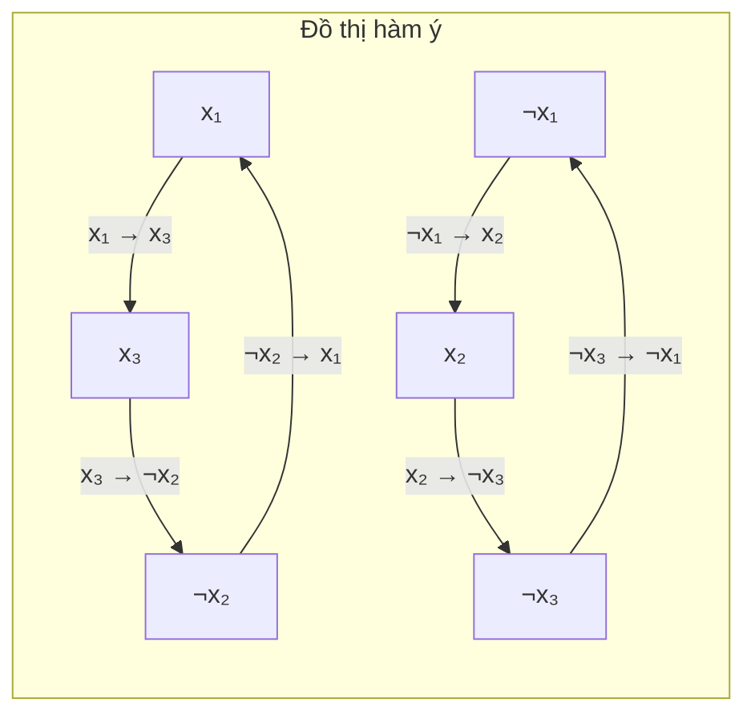
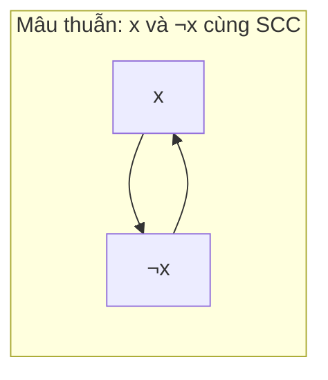

# Bài 43: 2-SAT - Logic & Đồ thị!

> **Tác giả:** FPTOJ Wiki<br>
> **Nội dung tham khảo từ:** CP-Algorithms, USACO Guide

---

## Bạn sẽ học được gì?

- Hiểu bài toán 2-SAT và mối liên hệ với logic mệnh đề
- Xây dựng đồ thị hàm ý (implication graph) từ các mệnh đề 2-SAT
- Sử dụng SCC (Strongly Connected Components) để giải 2-SAT
- Chứng minh tính đúng đắn của thuật toán
- Ứng dụng 2-SAT vào các bài toán thực tế

---

## 1. Giới thiệu

### SAT là gì?

**SAT (Boolean Satisfiability)** là bài toán xác định xem có thể gán giá trị `true`/`false` cho các biến boolean sao cho một biểu thức logic (gồm các mệnh đề nối nhau bằng ∧) đều đúng.

**2-SAT** là dạng đặc biệt của SAT: mỗi mệnh đề (clause) chứa **nhiều nhất 2 biến** (literal).

### Ẩn dụ: Chọn đội bóng

Giả sử bạn đang huấn luyện một đội bóng. Mỗi cầu thủ có thể chơi ở **2 vị trí** (ví dụ: hậu vệ hoặc tiền vệ). Tuy nhiên, có những ràng buộc giữa các cầu thủ:

- *"Nếu cầu thủ A đá hậu vệ, thì cầu thủ B phải đá tiền vệ"*
- *"Cầu thủ C hoặc cầu thủ D phải đá hậu vệ"*

Bài toán: Liệu có cách sắp xếp sao cho tất cả ràng buộc đều được thỏa mãn?

### Biểu diễn toán học

Cho `n` biến boolean `x₁, x₂, ..., xₙ`, mỗi biến nhận giá trị `true` hoặc `false`.

Mỗi mệnh đề có dạng:
- `(a ∨ b)` — ít nhất một trong hai literal `a`, `b` phải đúng
- Trong đó `a`, `b` có thể là `xᵢ` hoặc `¬xᵢ`

Ví dụ: `(x₁ ∨ x₂) ∧ (¬x₁ ∨ x₃) ∧ (¬x₂ ∨ ¬x₃)`

- Mệnh đề 1: `x₁` hoặc `x₂` phải đúng
- Mệnh đề 2: `¬x₁` hoặc `x₃` phải đúng (nghĩa là: nếu `x₁` đúng thì `x₃` phải đúng)
- Mệnh đề 3: `¬x₂` hoặc `¬x₃` phải đúng (nghĩa là: nếu `x₂` đúng thì `x₃` phải sai)

Một lời giải hợp lệ: `x₁ = true, x₂ = false, x₃ = true` ✓

---

## 2. Đồ thị hàm ý (Implication Graph)

### Chuyển đổi then chốt

Đây là insight quan trọng nhất của thuật toán 2-SAT:

$$
(a \lor b) \equiv (\neg a \rightarrow b) \equiv (\neg b \rightarrow a)
$$

Nghĩa là mệnh đề OR tương đương với hai chiều hàm ý!

### Xây dựng đồ thị

Với `n` biến, tạo đồ thị có `2n` đỉnh:
- Đỉnh `2i` biểu diễn `xᵢ = false` (tức là `¬xᵢ`)
- Đỉnh `2i + 1` biểu diễn `xᵢ = true`

Với mỗi mệnh đề `(a ∨ b)`, thêm hai cạnh:
- `¬a → b`
- `¬b → a`

### Ví dụ minh họa

Với biểu thức: `(x₁ ∨ x₂) ∧ (¬x₁ ∨ x₃) ∧ (¬x₂ ∨ ¬x₃)`

Các mệnh đề chuyển thành hàm ý:

| Mệnh đề | Hàm ý 1 | Hàm ý 2 |
|----------|----------|----------|
| `(x₁ ∨ x₂)` | `¬x₁ → x₂` | `¬x₂ → x₁` |
| `(¬x₁ ∨ x₃)` | `x₁ → x₃` | `¬x₃ → ¬x₁` |
| `(¬x₂ ∨ ¬x₃)` | `x₂ → ¬x₃` | `x₃ → ¬x₂` |



### Tính chất quan trọng

Nếu trong đồ thị hàm ý, biến `xᵢ` và `¬xᵢ` nằm trong **cùng một SCC** (Strongly Connected Component), thì bài toán **vô nghiệm**.

Lý do: Nếu `xᵢ` và `¬xᵢ` cùng SCC, ta có đường đi từ `xᵢ → ¬xᵢ` và `¬xᵢ → xᵢ`. Điều này nghĩa là `xᵢ` vừa phải đúng vừa phải sai — mâu thuẫn!



---

## 3. Thuật toán: 2-SAT dựa trên SCC

### Tổng quan thuật toán

1. **Xây dựng đồ thị hàm ý** với `2n` đỉnh
2. **Tìm SCC** sử dụng thuật toán Tarjan (hoặc Kosaraju)
3. **Kiểm tra vô nghiệm**: Nếu `xᵢ` và `¬xᵢ` cùng SCC → trả về "NO"
4. **Gán giá trị**: Dựa trên thứ tự topo của các SCC

### Quy tắc gán giá trị

Sau khi tìm SCC, mỗi SCC được gán một chỉ số theo **thứ tự topo ngược** (SCC được duyệt cuối cùng bởi Tarjan có chỉ số nhỏ nhất).

**Quy tắc:** Nếu `SCC(xᵢ) > SCC(¬xᵢ)`, gán `xᵢ = true`. Ngược lại, `xᵢ = false`.

Hoặc nói cách khác: biến nào có SCC lớn hơn (tức xuất hiện muộn hơn trong thứ tự topo) sẽ được gán `true`.

### Trace chi tiết trên ví dụ

Với `(x₁ ∨ x₂) ∧ (¬x₁ ∨ x₃) ∧ (¬x₂ ∨ ¬x₃)`:

**Bước 1:** Xây đồ thị hàm ý (như trên)

**Bước 2:** Tìm SCC bằng Tarjan

Tarjan duyệt DFS từ ¬x₁, cho ra các SCC:
- SCC 0 = {¬x₁, x₂, ¬x₃} (duyệt đầu tiên)
- SCC 1 = {x₁, x₃, ¬x₂} (duyệt sau)

**Bước 3:** Kiểm tra mâu thuẫn — Không có biến nào cùng SCC với phần bù ✓

**Bước 4:** Gán giá trị:
- `x₁`: comp[x₁] = 1, comp[¬x₁] = 0 → 1 > 0 → `x₁ = true`
- `x₂`: comp[x₂] = 0, comp[¬x₂] = 1 → 0 < 1 → `x₂ = false`
- `x₃`: comp[x₃] = 1, comp[¬x₃] = 0 → 1 > 0 → `x₃ = true`

Kiểm tra: `(true ∨ false) ∧ (¬true ∨ true) ∧ (¬false ∨ ¬true)` = `T ∧ T ∧ T` ✓

### Cài đặt

=== "C++"

    ```cpp
    #include <bits/stdc++.h>
    using namespace std;

    struct TwoSAT {
        int n;
        vector<vector<int>> adj, adj_t;
        vector<int> order, comp;
        vector<bool> used, assignment;

        TwoSAT(int n) : n(n), adj(2 * n), adj_t(2 * n),
                        comp(2 * n, -1), used(2 * n), assignment(n) {}

        // Thêm mệnh đề (a v b)
        // a, b: chỉ số biến (0-indexed)
        // is_neg_a, is_neg_b: true nếu literal bị phủ định
        void add_clause(int a, bool is_neg_a, int b, bool is_neg_b) {
            a = 2 * a + is_neg_a;
            b = 2 * b + is_neg_b;
            // (a v b) <=> (~a -> b) and (~b -> a)
            adj[a ^ 1].push_back(b);
            adj[b ^ 1].push_back(a);
            adj_t[b].push_back(a ^ 1);
            adj_t[a].push_back(b ^ 1);
        }

        void dfs1(int v) {
            used[v] = true;
            for (int u : adj[v])
                if (!used[u])
                    dfs1(u);
            order.push_back(v);
        }

        void dfs2(int v, int cl) {
            comp[v] = cl;
            for (int u : adj_t[v])
                if (comp[u] == -1)
                    dfs2(u, cl);
        }

        bool solve() {
            // Bước 1: Topo sort (Kosaraju - DFS thứ nhất)
            fill(used.begin(), used.end(), false);
            for (int i = 0; i < 2 * n; i++)
                if (!used[i])
                    dfs1(i);

            // Bước 2: Tìm SCC trên đồ thị transpose (DFS thứ hai)
            fill(comp.begin(), comp.end(), -1);
            for (int i = 0, j = 0; i < 2 * n; i++) {
                int v = order[2 * n - 1 - i];
                if (comp[v] == -1)
                    dfs2(v, j++);
            }

            // Bước 3: Kiểm tra vô nghiệm và gán giá trị
            for (int i = 0; i < n; i++) {
                if (comp[2 * i] == comp[2 * i + 1])
                    return false;
                assignment[i] = comp[2 * i] > comp[2 * i + 1];
            }
            return true;
        }
    };

    int main() {
        ios::sync_with_stdio(false);
        cin.tie(nullptr);

        int n, m;
        cin >> n >> m;

        TwoSAT ts(n);
        for (int i = 0; i < m; i++) {
            int a, b;
            char ca, cb;
            cin >> a >> ca >> b >> cb;
            // a, b: 1-indexed, ca/cb: 'T' hoặc 'F'
            a--; b--;
            bool neg_a = (ca == 'F');
            bool neg_b = (cb == 'F');
            ts.add_clause(a, neg_a, b, neg_b);
        }

        if (!ts.solve()) {
            cout << "IMPOSSIBLE\n";
        } else {
            for (int i = 0; i < n; i++)
                cout << (ts.assignment[i] ? 'T' : 'F');
            cout << '\n';
        }

        return 0;
    }
    ```

=== "Python"

    ```python
    import sys
    from sys import stdin

    input = stdin.readline


    class TwoSAT:
        def __init__(self, n):
            self.n = n
            self.adj = [[] for _ in range(2 * n)]
            self.adj_t = [[] for _ in range(2 * n)]
            self.order = []
            self.comp = [-1] * (2 * n)
            self.used = [False] * (2 * n)
            self.assignment = [False] * n

        def add_clause(self, a, is_neg_a, b, is_neg_b):
            """Thêm mệnh đề (a v b)"""
            a = 2 * a + (1 if is_neg_a else 0)
            b = 2 * b + (1 if is_neg_b else 0)
            # (a v b) <=> (~a -> b) and (~b -> a)
            self.adj[a ^ 1].append(b)
            self.adj[b ^ 1].append(a)
            self.adj_t[b].append(a ^ 1)
            self.adj_t[a].append(b ^ 1)

        def _dfs1(self, v):
            self.used[v] = True
            for u in self.adj[v]:
                if not self.used[u]:
                    self._dfs1(u)
            self.order.append(v)

        def _dfs2(self, v, cl):
            self.comp[v] = cl
            for u in self.adj_t[v]:
                if self.comp[u] == -1:
                    self._dfs2(u, cl)

        def solve(self):
            # Bước 1: Topo sort
            for i in range(2 * self.n):
                if not self.used[i]:
                    self._dfs1(i)

            # Bước 2: Tìm SCC
            j = 0
            for i in range(2 * self.n):
                v = self.order[2 * self.n - 1 - i]
                if self.comp[v] == -1:
                    self._dfs2(v, j)
                    j += 1

            # Bước 3: Kiểm tra và gán
            for i in range(self.n):
                if self.comp[2 * i] == self.comp[2 * i + 1]:
                    return False
                self.assignment[i] = self.comp[2 * i] > self.comp[2 * i + 1]
            return True


    def main():
        n, m = map(int, input().split())
        ts = TwoSAT(n)

        for _ in range(m):
            parts = input().split()
            a, ca, b, cb = int(parts[0]), parts[1], int(parts[2]), parts[3]
            a -= 1
            b -= 1
            neg_a = ca == "F"
            neg_b = cb == "F"
            ts.add_clause(a, neg_a, b, neg_b)

        if not ts.solve():
            print("IMPOSSIBLE")
        else:
            print("".join("T" if ts.assignment[i] else "F" for i in range(n)))


    if __name__ == "__main__":
        sys.setrecursionlimit(1 << 25)
        main()
    ```

### Độ phức tạp

- **Thời gian:** `O(N + M)` với `N` là số biến, `M` là số mệnh đề (mỗi mệnh đề tạo 2 cạnh)
- **Bộ nhớ:** `O(N + M)`

---

## 4. Chứng minh tính đúng đắn

### Tại sao quy tắc gán giá trị đúng?

**Giả sử** `comp[x] > comp[¬x]` (tức `x` có chỉ số SCC lớn hơn) và ta gán `x = true`.

Cần chứng minh: Không có mâu thuẫn nào xảy ra.

**Phản chứng:** Giả sử gán `x = true` nhưng tồn tại mệnh đề nào đó bị vi phạm.

Nếu `x = true` bị vi phạm, phải tồn tại đường đi `x → ¬x` trong đồ thị hàm ý.

Nhưng nếu có đường đi `x → ¬x`, thì `x` và `¬x` nằm trong cùng một SCC (vì ta cũng có `¬x → x` từ tính đối xứng của mệnh đề OR).

Điều này mâu thuẫn với giả thiết `comp[x] ≠ comp[¬x]` (đã kiểm tra ở bước 3).

**Tương tự cho `¬x`:** Nếu `comp[¬x] > comp[x]`, ta gán `x = false` (tức `¬x = true`).

### Tóm lại

- Nếu `x` và `¬x` khác SCC → luôn tồn tại cách gán thỏa mãn
- Thứ tự topo đảm bảo rằng ta không bao giờ gán giá trị gây mâu thuẫn

---

## 5. Tìm tất cả nghiệm

Thuật toán SCC-based cho ra **một nghiệm** hợp lệ. Nếu cần **tất cả** nghiệm:

Một cách tiếp cận: Sau khi có đồ thị SCC, mỗi cặp `(xᵢ, ¬xᵢ)` tạo thành một "quyết định". Có `2^k` nghiệm trong đó `k` là số cặp biến mà `xᵢ` và `¬xᵢ` không ràng buộc lẫn nhau.

Tuy nhiên, trong hầu hết bài toán competitive programming, chỉ cần tìm **một nghiệm** là đủ.

Nếu cần đếm số nghiệm, có thể sử dụng kỹ thuật **DP trên DAG** của các SCC:

- Xây DAG từ các SCC (co mỗi SCC thành một đỉnh)
- Đếm số cách gán giá trị không mâu thuẫn bằng DP topo-sort

```
Lưu ý: Số nghiệm có thể rất lớn (2^n), thường chỉ cần trả lời
modulo một số nguyên tố hoặc chỉ cần một nghiệm bất kỳ.
```

---

## 6. Ứng dụng

### Bài toán nhóm người

**Đề bài:** Có `N` người, mỗi người thuộc nhóm A hoặc nhóm B. Cho `M` ràng buộc:
- "Nếu người `i` thuộc nhóm A thì người `j` thuộc nhóm B"

Hỏi có cách chia nhóm thỏa mãn tất cả ràng buộc không?

**Giải:** Biến `xᵢ = true` nghĩa là người `i` thuộc nhóm A.

Ràng buộc "nếu `i` ∈ A thì `j` ∈ B" tương đương:
$$
x_i \rightarrow \neg x_j \equiv (\neg x_i \lor \neg x_j)
$$

Đây chính là mệnh đề 2-SAT!

### De Morgan và chuyển đổi ràng buộc

Các dạng ràng buộc thường gặp và cách chuyển về 2-SAT:

| Ràng buộc | Chuyển đổi | Mệnh đề 2-SAT |
|-----------|-----------|----------------|
| `a ∨ b` | Giữ nguyên | `(a ∨ b)` |
| `¬(a ∧ b)` | De Morgan | `(¬a ∨ ¬b)` |
| `a → b` | Logic suy diễn | `(¬a ∨ b)` |
| `a ↔ b` | Hai mệnh đề | `(¬a ∨ b) ∧ (a ∨ ¬b)` |
| `a XOR b` | Hai mệnh đề | `(a ∨ b) ∧ (¬a ∨ ¬b)` |
| `a` phải đúng | Thêm mệnh đề | `(a ∨ a)` |

### Bài toán "ít nhất một trong hai"

Rất nhiều bài toán có dạng: "Ít nhất một trong hai điều kiện phải thỏa mãn".

Ví dụ: Cho `N` khoảng `[lᵢ, rᵢ]` trên trục số. Chọn một điểm sao cho mỗi khoảng chứa ít nhất một điểm đã chọn.

Nếu mỗi khoảng có 2 điểm ứng viên, mỗi điểm thuộc về nhiều khoảng, ta có thể biểu diễn thành 2-SAT.

### Bài toán liên quan đến đồ thị

2-SAT thường xuất hiện trong các bài toán:
- Tô màu đồ thị 2 màu với ràng buộc bổ sung
- Lập lịch với xung đột
- Lựa chọn với điều kiện "nếu chọn A thì không được chọn B"

---

## 7. Lưu ý / Cạm bẫy

### 1. Nhầm hướng hàm ý

**Sai:** `(a ∨ b)` thêm cạnh `a → b`

**Đúng:** `(a ∨ b)` thêm cạnh `¬a → b` và `¬b → a`

Hãy nhớ: mệnh đề OR chuyển thành hàm ý bằng cách **phủ định** một vế!

### 2. Quên thêm cả hai chiều

Mệnh đề `(a ∨ b)` tạo **hai** cạnh hàm ý, không phải một. Nếu chỉ thêm một cạnh, bài toán sẽ sai.

### 3. Chỉ số đỉnh trong code

Phổ biến nhất là cách đánh số:
- Đỉnh `2i` = `¬xᵢ` (xᵢ = false)
- Đỉnh `2i + 1` = `xᵢ` (xᵢ = true)
- Phép XOR `^ 1` để chuyển giữa `xᵢ` và `¬xᵢ`

Một số code dùng cách khác:
- Đỉnh `i` = `xᵢ`
- Đỉnh `i + n` = `¬xᵢ`

Hãy đọc kỹ code mẫu trước khi sử dụng!

### 4. Thuật toán SCC phải cho đúng thứ tự topo

Khi sử dụng **Kosaraju**, SCC được gán chỉ số theo đúng thứ tự topo (SCC nào được DFS trước trong DFS2 sẽ có chỉ số nhỏ hơn).

Với **Tarjan**, SCC được gán chỉ số theo thứ tự ngược lại (SCC nào được tìm thấy trước sẽ có chỉ số nhỏ hơn, nhưng trong Tarjan, SCC được tìm thấy đầu tiên thực ra là đỉnh có topo order lớn nhất).

Cần điều chỉnh quy tắc gán giá trị cho phù hợp với thuật toán SCC sử dụng.

### 5. Stack overflow trong Python

Đệ quy DFS trong Python có thể bị tràn stack với input lớn. Nên:
- Tăng `sys.setrecursionlimit()`
- Hoặc cài đặt DFS bằng stack duyệt (iterative)

---

## 8. Bài tập luyện tập

| Bài | Nền tảng | Độ khó | Chủ đề |
|-----|----------|--------|--------|
| [CSES - Giant Pizza](https://cses.fi/problemset/task/1684) | CSES | ⭐⭐⭐ | 2-SAT cơ bản |
| [CF 1971H - ±1](https://codeforces.com/problemset/problem/1971/H) | CF | ⭐⭐⭐ | 2-SAT |
| [CF 1215F - Radio Stations](https://codeforces.com/problemset/problem/1215/F) | CF | ⭐⭐⭐⭐ | 2-SAT + intervals |
| [SPOJ - TOUR](https://www.spoj.com/problems/TOUR/) | SPOJ | ⭐⭐⭐ | 2-SAT application |
| [VNOJ - VMRELATE](https://oj.vnoi.info/problem/vmrelate) | VNOJ | ⭐⭐⭐ | 2-SAT |
| [LeetCode - Satisfiability of Equality Equations](https://leetcode.com/problems/satisfiability-of-equality-equations/) | LeetCode | ★★★ | Satisfiability |

### Gợi ý giải một số bài

#### CSES - Giant Pizza

Bài toán kinh điển 2-SAT. Mỗi topping có 2 lựa chọn (+ hoặc -). Mỗi người muốn topping theo cách nhất định. Tìm cách gán thỏa mãn tất cả.

**Ý tưởng:** Mỗi topping là một biến boolean. Ràng buộc của mỗi người là mệnh đề 2-SAT. Áp dụng trực tiếp template.

#### CF 1215F - Radio Stations

Kết hợp 2-SAT với khoảng (intervals). Cần xử lý thêm ràng buộc "nếu chọn tần số trong khoảng [l, r] thì phải chọn thêm ăng-ten phù hợp".

**Ý tưởng:** Biến boolean cho mỗi trạm phát và mỗi tần số. Chuyển đổi ràng buộc khoảng thành mệnh đề 2-SAT.

---

## Tóm tắt

| Khái niệm | Nội dung |
|-----------|---------|
| **2-SAT** | SAT với mỗi mệnh đề ≤ 2 literal |
| **Implication graph** | `(a ∨ b)` → cạnh `¬a → b` và `¬b → a` |
| **Vô nghiệm** | Khi `x` và `¬x` cùng SCC |
| **Gán giá trị** | So sánh chỉ số SCC của `x` và `¬x` |
| **Độ phức tạp** | O(N + M) |

---

> **Bài tiếp theo:** [Bài 44: Euler Tour trên cây](euler-tour-tree.md)
