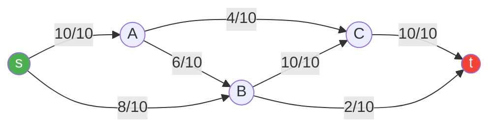
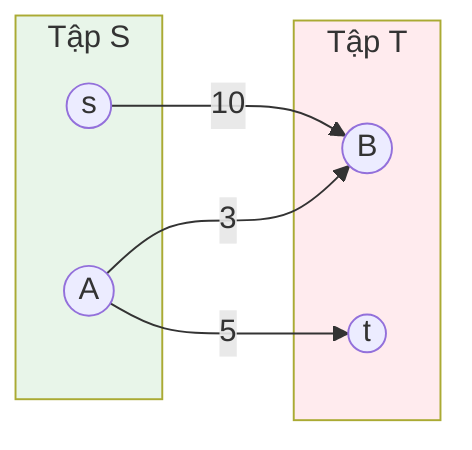
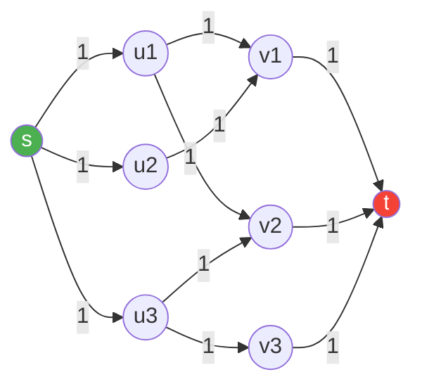

# Bài 41: Network Flow - Luồng cực đại!

> **Tác giả:** FPTOJ Wiki<br>
> **Nội dung tham khảo từ:** VNOI Wiki - Luồng cực đại, CP-Algorithms

---

## Bạn sẽ học được gì?

- Hiểu bài toán luồng cực đại và các khái niệm: nguồn, bể, dung lượng, luồng
- Cài đặt thuật toán Edmonds-Karp (BFS) tìm luồng cực đại
- Cài đặt thuật toán Dinic - thuật toán luồng mạnh mẽ nhất
- Bài toán luồng chi phí nhỏ nhất cực đại (Min-Cost Max-Flow)
- Ứng dụng: khớp đôi đồ thị hai phía, đỉnh bao nhỏ nhất, đường đi cạnh không chung

---

## 1. Giới thiệu - Network Flow là gì?

### Ẩn dụ: Hệ thống ống nước

Hãy tưởng tượng bạn có một **hệ thống ống nước**:

- Có một **nguồn nước** (source) - nơi nước chảy ra
- Có một **bể chứa** (sink) - nơi nước chảy đến
- Các **ống nối** giữa các điểm, mỗi ống có **dung lượng tối đa** (cạnh bao nhiêu nước/giây)
- Hỏi: **Lượng nước tối đa** chảy từ nguồn đến bể là bao nhiêu?

Đây chính là bài toán **luồng cực đại** (Maximum Flow)!

### Định nghĩa formally

Cho đồ thị có hướng `G = (V, E)` với:

- **Nguồn** `s`: đỉnh bắt đầu
- **Bể** `t`: đỉnh kết thúc
- **Dung lượng** `c(u, v)`: lượng tối đa chảy qua cạnh `(u, v)`
- **Luồng** `f(u, v)`: lượng thực tế chảy qua cạnh `(u, v)`

Luồng hợp lệ phải thỏa mãn:

1. **Ràng buộc dung lượng:** `0 <= f(u, v) <= c(u, v)` với mọi cạnh
2. **Bảo toàn luồng:** Với mọi đỉnh (trừ `s` và `t`), tổng luồng vào = tổng luồng ra

**Mục tiêu:** Tìm tổng luồng lớn nhất từ `s` đến `t`.

### Minh họa bằng sơ đồ



> Ghi chú: `x/y` nghĩa là luồng hiện tại `x` trên dung lượng tối đa `y`.

---

## 2. Ford-Fulkerson Method

### Ý tưởng cốt lõi

Ford-Fulkerson là **phương pháp** (framework) chứ không phải thuật toán cụ thể:

1. Bắt đầu với luồng = 0
2. Tìm một **đường tăng luồng** (augmenting path) từ `s` đến `t` trong đồ thị dư
3. Tăng luồng dọc theo đường đó
4. Lặp lại cho đến khi không còn đường tăng luồng nào

### Đồ thị dư (Residual Graph)

Đồ thị dư là chì khóa của Ford-Fulkerson. Với mỗi cạnh `(u, v)` có dung lượng `c` và luồng `f`:

- **Cạnh thuận:** từ `u` đến `v` với dung lượng dư `c - f` (còn bao nhiêu nữa có thể đẩy qua)
- **Cạnh ngược:** từ `v` đến `u` với dung lượng dư `f` (có thể "rút lại" bao nhiêu luồng)

> **Tại sao cần cạnh ngược?** Đây là điều quan trọng nhất! Khi ta đẩy luồng sai đường, cạnh ngược cho phép ta "hủy" luồng đó và đẩy lại theo hướng khác.

### Ví dụ minh họa

```
Đồ thị ban đầu:          Đồ thị dư (luồng = 0):

    s ---10---> A              s ---10---> A
    |           |              |           |
    10          5              10          5
    |           |              |           |
    v           v              v           v
    B ---10---> t              B ---10---> t

Tìm đường tăng: s → A → B → t (bottleneck = 5)
Đẩy luồng 5:

Đồ thị dư (luồng = 5):    Luồng hiện tại:
    s ---5----> A              s ---5----> A
    |     <---5|              |           |
    10          0              5           5
    |     <---5|              |           |
    v           v              v           v
    B ---5----> t              B ---5----> t
    |<----5----+
    5

Tìm đường tăng: s → B → A → ... (dùng cạnh ngược!)
```

### Định lý Max-Flow Min-Cut

> **Định lý (Ford-Fulkerson 1956):** Luồng cực đại = Giá trị cắt nhỏ nhất.

**Cắt** (s-t cut) là cách chia đỉnh thành hai tập `S` và `T` sao cho `s ∈ S`, `t ∈ T`. Giá trị cắt = tổng dung lượng các cạnh đi từ `S` đến `T`.



> Giá trị cắt = 10 + 5 + 3 = 18. Luồng cực đại không thể vượt quá 18.

**Chứng minh (phác thảo):**

- Luồng ≤ cắt: Mọi đơn vị luồng từ `s` đến `t` phải đi qua ít nhất một cạnh trong cắt. Tổng luồng qua cắt ≤ tổng dung lượng cắt.
- Luồng = cắt: Khi thuật toán dừng, tồn tại cắt mà luồng = giá trị cắt. Cạnh cắt đầy (luồng = dung lượng), các cạnh khác cân bằng.

---

## 3. Edmonds-Karp (BFS-based)

### Ý tưởng

Edmonds-Karp là phiên bản Ford-Fulkerson dùng **BFS** để tìm đường tăng luồng ngắn nhất.

- **Độ phức tạp:** `O(V * E²)`
- BFS đảm bảo mỗi bước tìm đường tăng ngắn nhất → số lần tăng luồng bị chặn bởi `O(VE)`

### Ví dụ minh họa từng bước

```
Đồ thị ban đầu (dung_capacity):

        s ---16---> A ---12---> t
        |           ↑           
       13           4           
        |           |           
        v           |           
        B ---14---> C ---7---> t
        ↑           |
        4          14
        |           |
        D ←---9----

Luồng ban đầu = 0
```

**Bước 1:** BFS tìm đường: s → A → t (bottleneck = 12)

```
Luồng = 12
s → A: 12/16 (còn 4)
A → t: 12/12 (hết)
```

**Bước 2:** BFS tìm đường: s → B → C → t (bottleneck = 7)

```
Luồng = 12 + 7 = 19
s → B: 7/13 (còn 6)
B → C: 7/14 (còn 7)
C → t: 7/7 (hết)
```

**Bước 3:** BFS tìm đường: s → B → C → A (dùng cạnh ngược) → ... không đến t được.

BFS tiếp: s → A → C → ... không đến t (C → t đã đầy).

BFS tiếp: s → B → D → ... không có đường đến t.

=> **Dừng! Luồng cực đại = 19.**

### Cài đặt

=== "C++"

    ```cpp
    #include <bits/stdc++.h>
    using namespace std;

    struct Edge {
        int to, rev;
        long long cap, flow;
    };

    class EdmondsKarp {
    public:
        int n;
        vector<vector<Edge>> adj;

        EdmondsKarp(int n) : n(n), adj(n + 1) {}

        void addEdge(int u, int v, long long cap) {
            adj[u].push_back({v, (int)adj[v].size(), cap, 0});
            adj[v].push_back({u, (int)adj[u].size() - 1, 0, 0});
        }

        long long maxFlow(int s, int t) {
            long long total = 0;
            while (true) {
                // BFS tìm đường tăng luồng
                vector<int> parent(n + 1, -1);
                vector<int> parentEdge(n + 1, -1);
                queue<int> q;
                q.push(s);
                parent[s] = s;

                while (!q.empty() && parent[t] == -1) {
                    int u = q.front(); q.pop();
                    for (int i = 0; i < (int)adj[u].size(); i++) {
                        Edge& e = adj[u][i];
                        if (parent[e.to] == -1 && e.cap - e.flow > 0) {
                            parent[e.to] = u;
                            parentEdge[e.to] = i;
                            q.push(e.to);
                        }
                    }
                }

                if (parent[t] == -1) break; // Không còn đường tăng

                // Tìm bottleneck
                long long bottleneck = LLONG_MAX;
                for (int v = t; v != s; v = parent[v]) {
                    int u = parent[v];
                    int idx = parentEdge[v];
                    bottleneck = min(bottleneck, adj[u][idx].cap - adj[u][idx].flow);
                }

                // Cập nhật luồng
                for (int v = t; v != s; v = parent[v]) {
                    int u = parent[v];
                    int idx = parentEdge[v];
                    adj[u][idx].flow += bottleneck;
                    adj[v][adj[u][idx].rev].flow -= bottleneck;
                }

                total += bottleneck;
            }
            return total;
        }
    };

    int main() {
        ios_base::sync_with_stdio(false);
        cin.tie(nullptr);

        int n, m;
        cin >> n >> m;

        EdmondsKarp mf(n);
        for (int i = 0; i < m; i++) {
            int u, v;
            long long cap;
            cin >> u >> v >> cap;
            mf.addEdge(u, v, cap);
        }

        cout << mf.maxFlow(1, n) << "\n";
        return 0;
    }
    ```

=== "Python"

    ```python
    from collections import deque

    class EdmondsKarp:
        def __init__(self, n):
            self.n = n
            self.adj = [[] for _ in range(n + 1)]

        def add_edge(self, u, v, cap):
            # forward: [to, cap, flow, rev_index]
            # backward: [to, 0, flow, rev_index]
            forward = [v, cap, 0, len(self.adj[v])]
            backward = [u, 0, 0, len(self.adj[u])]
            self.adj[u].append(forward)
            self.adj[v].append(backward)

        def max_flow(self, s, t):
            total = 0
            while True:
                # BFS tìm đường tăng luồng
                parent = [-1] * (self.n + 1)
                parent_edge = [-1] * (self.n + 1)
                q = deque([s])
                parent[s] = s

                while q and parent[t] == -1:
                    u = q.popleft()
                    for i, e in enumerate(self.adj[u]):
                        v, cap, flow, rev = e
                        if parent[v] == -1 and cap - flow > 0:
                            parent[v] = u
                            parent_edge[v] = i
                            q.append(v)

                if parent[t] == -1:
                    break

                # Tìm bottleneck
                bottleneck = float('inf')
                v = t
                while v != s:
                    u = parent[v]
                    idx = parent_edge[v]
                    bottleneck = min(bottleneck, self.adj[u][idx][1] - self.adj[u][idx][2])
                    v = u

                # Cập nhật luồng
                v = t
                while v != s:
                    u = parent[v]
                    idx = parent_edge[v]
                    self.adj[u][idx][2] += bottleneck
                    rev_idx = self.adj[u][idx][3]
                    self.adj[v][rev_idx][2] -= bottleneck
                    v = u

                total += bottleneck
            return total

    n, m = map(int, input().split())
    mf = EdmondsKarp(n)
    for _ in range(m):
        u, v, cap = map(int, input().split())
        mf.add_edge(u, v, cap)
    print(mf.max_flow(1, n))
    ```

---

## 4. Dinic's Algorithm (Thuật toán chính)

### Tại sao cần Dinic?

Edmonds-Karp chạy `O(VE²)` - chấp nhận được với đồ thị nhỏ. Nhưng với đồ thị lớn (hàng chục nghìn đỉnh), ta cần thuật toán nhanh hơn. **Dinic** chạy `O(V²E)`, và đặc biệt `O(E√V)` cho khớp đôi đồ thị hai phía.

### Ý tưởng

Dinic cải thiện Edmonds-Karp bằng cách:

1. **Xây đồ thị tầng** (level graph) bằng BFS - đánh số "tầng" cho mỗi đỉnh
2. **Tìm blocking flow** bằng DFS trên đồ thị tầng - đẩy luồng tối đa trong một lần
3. Lặp lại cho đến khi `t` không reachable từ `s`

> **Blocking flow:** Luồng mà không còn đường tăng nào trên đồ thị tầng.

### Tại sao nhanh hơn Edmonds-Karp?

- Edmonds-Karp: Mỗi BFS tìm **một** đường tăng → nhiều lần BFS
- Dinic: Mỗi BFS xây đồ thị tầng, rồi DFS đẩy **nhiều** đường tăng cùng lúc → ít lần BFS hơn

### Ví dụ minh họa từng bước

```
Đồ thị ban đầu:

    s ---3--→ A ---2--→ t
    |         ↑         ↑
    2         1         2
    ↓         |         |
    B ---3--→ C ---1--→ D
```

**Iteration 1:**

BFS xây đồ thị tầng:
```
Tầng 0: s
Tầng 1: A (s→A), B (s→B)
Tầng 2: C (A→C? không, B→C), t (A→t)
Tầng 3: D (C→D)
Tầng 4: t (D→t)
```

DFS tìm blocking flow trên đồ thị tầng:
- Đường 1: s → A → t, bottleneck = min(3, 2) = 2
- Đường 2: s → B → C → D → t, bottleneck = min(2, 3, 1, 2) = 1
- Blocking flow = 2 + 1 = 3

**Iteration 2:**

BFS lại - kiểm tra xem còn đường từ s đến t không.
Nếu còn → tiếp tục tìm blocking flow.
Nếu không → dừng!

### Cài đặt (Code chính)

=== "C++"

    ```cpp
    #include <bits/stdc++.h>
    using namespace std;

    struct Edge {
        int to, rev;
        long long cap, flow;
    };

    class Dinic {
    public:
        int n;
        vector<vector<Edge>> adj;
        vector<int> level;      // Mảng tầng (level)
        vector<int> ptr;        // Mảng con trỏ cho DFS (current edge optimization)

        Dinic(int n) : n(n), adj(n + 1), level(n + 1), ptr(n + 1) {}

        void addEdge(int u, int v, long long cap, bool directed = true) {
            adj[u].push_back({v, (int)adj[v].size(), cap, 0});
            adj[v].push_back({u, (int)adj[u].size() - 1, directed ? 0 : cap, 0});
        }

        // BFS: Xây đồ thị tầng
        bool bfs(int s, int t) {
            fill(level.begin(), level.end(), -1);
            level[s] = 0;
            queue<int> q;
            q.push(s);

            while (!q.empty()) {
                int u = q.front(); q.pop();
                for (auto& e : adj[u]) {
                    if (level[e.to] == -1 && e.cap - e.flow > 0) {
                        level[e.to] = level[u] + 1;
                        q.push(e.to);
                    }
                }
            }
            return level[t] != -1;
        }

        // DFS: Tìm blocking flow
        long long dfs(int u, int t, long long pushed) {
            if (u == t || pushed == 0) return pushed;

            for (int& cid = ptr[u]; cid < (int)adj[u].size(); cid++) {
                Edge& e = adj[u][cid];
                if (level[e.to] != level[u] + 1) continue;
                if (e.cap - e.flow <= 0) continue;

                long long tr = dfs(e.to, t, min(pushed, e.cap - e.flow));
                if (tr == 0) continue;

                e.flow += tr;
                adj[e.to][e.rev].flow -= tr;
                return tr;
            }
            return 0;
        }

        long long maxFlow(int s, int t) {
            long long total = 0;
            while (bfs(s, t)) {
                fill(ptr.begin(), ptr.end(), 0);
                while (long long pushed = dfs(s, t, LLONG_MAX)) {
                    total += pushed;
                }
            }
            return total;
        }

        // Truy vết cắt nhỏ nhất (min cut)
        vector<bool> minCut(int s) {
            vector<bool> visited(n + 1, false);
            queue<int> q;
            q.push(s);
            visited[s] = true;
            while (!q.empty()) {
                int u = q.front(); q.pop();
                for (auto& e : adj[u]) {
                    if (!visited[e.to] && e.cap - e.flow > 0) {
                        visited[e.to] = true;
                        q.push(e.to);
                    }
                }
            }
            return visited;
        }
    };

    int main() {
        ios_base::sync_with_stdio(false);
        cin.tie(nullptr);

        int n, m;
        cin >> n >> m;

        Dinic dinic(n);
        for (int i = 0; i < m; i++) {
            int u, v;
            long long cap;
            cin >> u >> v >> cap;
            dinic.addEdge(u, v, cap);
        }

        cout << dinic.maxFlow(1, n) << "\n";
        return 0;
    }
    ```

=== "Python"

    ```python
    from collections import deque
    import sys
    input = sys.stdin.readline

    class Dinic:
        def __init__(self, n):
            self.n = n
            self.adj = [[] for _ in range(n + 1)]
            self.level = [-1] * (n + 1)
            self.ptr = [0] * (n + 1)

        def add_edge(self, u, v, cap, directed=True):
            forward = [v, cap, 0, len(self.adj[v])]
            backward = [u, 0 if directed else cap, 0, len(self.adj[u])]
            self.adj[u].append(forward)
            self.adj[v].append(backward)

        def bfs(self, s, t):
            self.level = [-1] * (self.n + 1)
            self.level[s] = 0
            q = deque([s])
            while q:
                u = q.popleft()
                for e in self.adj[u]:
                    v, cap, flow, rev = e
                    if self.level[v] == -1 and cap - flow > 0:
                        self.level[v] = self.level[u] + 1
                        q.append(v)
            return self.level[t] != -1

        def dfs(self, u, t, pushed):
            if u == t or pushed == 0:
                return pushed
            while self.ptr[u] < len(self.adj[u]):
                e = self.adj[u][self.ptr[u]]
                v, cap, flow, rev = e
                if self.level[v] != self.level[u] + 1 or cap - flow <= 0:
                    self.ptr[u] += 1
                    continue
                tr = self.dfs(v, t, min(pushed, cap - flow))
                if tr == 0:
                    self.ptr[u] += 1
                    continue
                e[2] += tr
                self.adj[v][rev][2] -= tr
                return tr
            return 0

        def max_flow(self, s, t):
            total = 0
            while self.bfs(s, t):
                self.ptr = [0] * (self.n + 1)
                while True:
                    pushed = self.dfs(s, t, float('inf'))
                    if pushed == 0:
                        break
                    total += pushed
            return total

        def min_cut(self, s):
            visited = [False] * (self.n + 1)
            visited[s] = True
            q = deque([s])
            while q:
                u = q.popleft()
                for e in self.adj[u]:
                    v, cap, flow, rev = e
                    if not visited[v] and cap - flow > 0:
                        visited[v] = True
                        q.append(v)
            return visited

    n, m = map(int, input().split())
    dinic = Dinic(n)
    for _ in range(m):
        u, v, cap = map(int, input().split())
        dinic.add_edge(u, v, cap)
    print(dinic.max_flow(1, n))
    ```

### Phân tích độ phức tạp

| Thuật toán | Độ phức tạp | Ghi chú |
|-----------|-------------|---------|
| Ford-Fulkerson | `O(E * max_flow)` | Có thể chậm nếu dung lượng lớn |
| Edmonds-Karp | `O(VE²)` | Luôn dùng BFS |
| **Dinic** | **`O(V²E)`** | **Nhanh nhất cho hầu hết bài** |
| Dinic (đồ thị hai phía) | `O(E√V)` | Đặc biệt nhanh cho khớp đôi |

### Lưu ý quan trọng khi cài đặt

**Current Edge Optimization (Con trỏ `ptr`):**

Khi DFS tại đỉnh `u` duyệt xong cạnh thứ `i` mà không đẩy được luồng, lần sau không cần duyệt lại cạnh `0..i`. Dùng mảng `ptr[u]` để nhớ vị trí đã duyệt.

**Nếu không dùng `ptr`, Dinic có thể chậm đi rất nhiều!**

---

## 5. Min-Cost Max-Flow (MCMF)

### Bài toán

Giống max-flow, nhưng mỗi cạnh có thêm **chi phí** (cost). Muốn:

1. Đẩy **luồng cực đại** từ `s` đến `t`
2. Trong số các luồng cực đại, chọn luồng có **tổng chi phí nhỏ nhất**

> Chi phí = `sum(flow(u,v) * cost(u,v))` với mọi cạnh.

### Thuật toán: Successive Shortest Path

1. Tìm luồng cực đại trước (dùng Dinic)
2. Trong đồ thị dư, mỗi cạnh có cost:
   - Cạnh thuận `(u, v)`: cost = `cost(u, v)`
   - Cạnh ngược `(v, u)`: cost = `-cost(u, v)` (rút luồng → hoàn tiền)
3. Mỗi bước, tìm đường tăng có **chi phí nhỏ nhất** (dùng SPFA hoặc Dijkstra với potential)
4. Đẩy luồng dọc theo đường đó
5. Lặp cho đến khi không còn đường tăng

### Cài đặt

=== "C++"

    ```cpp
    #include <bits/stdc++.h>
    using namespace std;

    struct MCFFEdge {
        int to, rev;
        long long cap, flow, cost;
    };

    class MinCostMaxFlow {
    public:
        int n;
        vector<vector<MCFFEdge>> adj;
        vector<long long> dist, pot;
        vector<int> parent, parentEdge;
        const long long INF = 1e18;

        MinCostMaxFlow(int n) : n(n), adj(n + 1), dist(n + 1), pot(n + 1),
                                parent(n + 1), parentEdge(n + 1) {}

        void addEdge(int u, int v, long long cap, long long cost) {
            adj[u].push_back({v, (int)adj[v].size(), cap, 0, cost});
            adj[v].push_back({u, (int)adj[u].size() - 1, 0, 0, -cost});
        }

        // SPFA để tìm đường ngắn nhất (hỗ trợ cạnh âm)
        bool spfa(int s, int t, long long& flow, long long& cost, long long maxFlow) {
            fill(dist.begin(), dist.end(), INF);
            vector<bool> inQueue(n + 1, false);
            dist[s] = 0;
            queue<int> q;
            q.push(s);
            inQueue[s] = true;

            while (!q.empty()) {
                int u = q.front(); q.pop();
                inQueue[u] = false;
                for (int i = 0; i < (int)adj[u].size(); i++) {
                    MCFFEdge& e = adj[u][i];
                    if (e.cap - e.flow > 0 && dist[u] + e.cost < dist[e.to]) {
                        dist[e.to] = dist[u] + e.cost;
                        parent[e.to] = u;
                        parentEdge[e.to] = i;
                        if (!inQueue[e.to]) {
                            q.push(e.to);
                            inQueue[e.to] = true;
                        }
                    }
                }
            }

            if (dist[t] == INF) return false;

            long long pushFlow = maxFlow - flow;
            for (int v = t; v != s; v = parent[v]) {
                int u = parent[v];
                int idx = parentEdge[v];
                pushFlow = min(pushFlow, adj[u][idx].cap - adj[u][idx].flow);
            }

            for (int v = t; v != s; v = parent[v]) {
                int u = parent[v];
                int idx = parentEdge[v];
                adj[u][idx].flow += pushFlow;
                adj[v][adj[u][idx].rev].flow -= pushFlow;
            }

            flow += pushFlow;
            cost += pushFlow * dist[t];
            return true;
        }

        pair<long long, long long> mcmf(int s, int t, long long maxFlow = INF) {
            long long flow = 0, cost = 0;
            while (spfa(s, t, flow, cost, maxFlow)) {}
            return {flow, cost};
        }
    };

    int main() {
        ios_base::sync_with_stdio(false);
        cin.tie(nullptr);

        int n, m;
        cin >> n >> m;

        MinCostMaxFlow mcmf(n);
        for (int i = 0; i < m; i++) {
            int u, v;
            long long cap, cost;
            cin >> u >> v >> cap >> cost;
            mcmf.addEdge(u, v, cap, cost);
        }

        auto [flow, cost] = mcmf.mcmf(1, n);
        cout << flow << " " << cost << "\n";
        return 0;
    }
    ```

=== "Python"

    ```python
    from collections import deque
    import sys
    input = sys.stdin.readline

    class MinCostMaxFlow:
        def __init__(self, n):
            self.n = n
            self.adj = [[] for _ in range(n + 1)]
            self.INF = 10**18

        def add_edge(self, u, v, cap, cost):
            forward = [v, cap, 0, cost, len(self.adj[v])]
            backward = [u, 0, 0, -cost, len(self.adj[u])]
            self.adj[u].append(forward)
            self.adj[v].append(backward)

        def spfa(self, s, t, flow, max_flow):
            dist = [self.INF] * (self.n + 1)
            parent = [-1] * (self.n + 1)
            parent_edge = [-1] * (self.n + 1)
            in_queue = [False] * (self.n + 1)
            dist[s] = 0
            q = deque([s])
            in_queue[s] = True

            while q:
                u = q.popleft()
                in_queue[u] = False
                for i, e in enumerate(self.adj[u]):
                    v, cap, fl, cost, rev = e
                    if cap - fl > 0 and dist[u] + cost < dist[v]:
                        dist[v] = dist[u] + cost
                        parent[v] = u
                        parent_edge[v] = i
                        if not in_queue[v]:
                            q.append(v)
                            in_queue[v] = True

            if dist[t] == self.INF:
                return 0, 0

            push = max_flow - flow
            v = t
            while v != s:
                u = parent[v]
                idx = parent_edge[v]
                push = min(push, self.adj[u][idx][1] - self.adj[u][idx][2])
                v = u

            v = t
            while v != s:
                u = parent[v]
                idx = parent_edge[v]
                e = self.adj[u][idx]
                e[2] += push
                rev_idx = e[4]
                self.adj[v][rev_idx][2] -= push
                v = u

            return push, push * dist[t]

        def mcmf(self, s, t, max_flow=10**18):
            total_flow = 0
            total_cost = 0
            while True:
                f, c = self.spfa(s, t, total_flow, max_flow)
                if f == 0:
                    break
                total_flow += f
                total_cost += c
            return total_flow, total_cost

    n, m = map(int, input().split())
    mcmf = MinCostMaxFlow(n)
    for _ in range(m):
        u, v, cap, cost = map(int, input().split())
        mcmf.add_edge(u, v, cap, cost)
    flow, cost = mcmf.mcmf(1, n)
    print(flow, cost)
    ```

### Dijkstra với Potential (Nâng cao)

SPFA chạy chậm trong worst-case `O(VE)`. Để cải thiện, dùng **Dijkstra với hàm tiềm năng** (potential function):

- Dùng Bellman-Ford/SPFA lần đầu để tính potential `h[v]`
- Các lần sau, trọng số cạnh điều chỉnh thành `cost(u,v) + h[u] - h[v]` (luôn ≥ 0)
- Dùng Dijkstra thay SPFA → `O(F * E log V)` thay vì `O(F * VE)`

Phương pháp này phù hợp khi số lần tăng luồng `F` nhỏ và đồ thị lớn.

---

## 6. Ứng dụng

### 6.1. Khớp đôi đồ thị hai phía (Bipartite Matching)

Cho đồ thị hai phía `G = (U, V, E)`. Tìm tập cạnh đối lớn nhất.

**Giả bài toán về max-flow:**

1. Tạo đỉnh nguồn `s`, nối đến mọi đỉnh trong `U` (dung lượng 1)
2. Nối cạnh từ `U` đến `V` theo đồ thị gốc (dung lượng 1)
3. Nối mọi đỉnh trong `V` đến bể `t` (dung lượng 1)
4. Chạy max-flow → kết quả = kích thước khớp đôi lớn nhất



> Max-flow = 3 → Khớp đôi lớn nhất có 3 cặp.

**Độ phức tạp:** `O(E√V)` nhờ tính chất đồ thị hai phía của Dinic.

### 6.2. Định lý König - Đỉnh bao nhỏ nhất

> **Định lý König:** Trong đồ thị hai phía, kích thước đỉnh bao nhỏ nhất = kích thước khớp đôi lớn nhất.

**Tìm đỉnh bao nhỏ nhất từ max-flow:**

1. Chạy max-flow trên đồ thị hai phía
2. Dùng DFS/BFS từ `s` trong đồ thị dư, đánh dấu đỉnh reachable
3. Đỉnh bao = `(U \ reachable) ∪ (V ∩ reachable)`

### 6.3. Tập độc lập lớn nhất trong đồ thị hai phía

> Tập độc lập lớn nhất = `|V|` - đỉnh bao nhỏ nhất = `|V|` - khớp đôi lớn nhất.

### 6.4. Đường đi cạnh không chung (Edge-Disjoint Paths)

Tìm số đường đi từ `s` đến `t` sao cho không cạnh nào được dùng quá một lần.

**Giải:** Cho mỗi cạnh dung lượng 1, chạy max-flow. Kết quả = số đường đi cạnh không chung.

---

## 7. Lưu ý & Cạm bẫy

### 7.1. Quên cạnh ngược trong đồ thị dư

```
Sai: Chỉ tạo cạnh thuận
Đúng: Luôn tạo CẢ cạnh ngược với dung lượng 0

addEdge(u, v, cap) phải tạo:
  - Cạnh u → v (dung lượng cap)
  - Cạnh v → u (dung lượng 0) ← CẠNH NGƯỢC!
```

Nếu quên cạnh ngược, thuật toán sẽ không thể "rút" luồng đã đẩy sai → sai kết quả!

### 7.2. Tràn số nguyên với dung lượng lớn

```
Dung lượng có thể lên đến 10^9, tổng luồng có thể lên đến 10^14
→ PHẢI dùng long long (int64), KHÔNG dùng int!

Sai:  int cap, flow;
Đúng: long long cap, flow;
```

### 7.3. MCMF với chu trình âm

Nếu đồ thị có chu trình âm trong chi phí, SPFA sẽ bị kẹt trong vòng lặp vô hạn.

**Giải pháp:** Đảm bảo đồ thị không có chu trình âm, hoặc dùng Bellman-Ford lần đầu để phát hiện.

### 7.4. Đồ thị có cạnh song song

Nhiều cạnh cùng chiều giữa hai đỉnh → không vấn đề, chỉ cần thêm tất cả vào danh sách cạnh.

### 7.5. Self-loop

Cạnh từ đỉnh về chính nó → có thể bỏ qua, không ảnh hưởng kết quả.

### 7.6. Đồ thị vô hướng

Cạnh vô hướng `(u, v)` với dung lượng `c` = hai cạnh có hướng `(u, v)` và `(v, u)` cùng dung lượng `c`.

```
addEdge(u, v, cap)  →  cạnh u→v (cap), cạnh v→u (0)
addEdge(v, u, cap)  →  cạnh v→u (cap), cạnh u→v (0)
// Tổng: u→v (cap), v→u (cap) ✓
```

---

## 8. Bài tập luyện tập

| Bài | Nền tảng | Độ khó | Chủ đề |
|-----|----------|--------|--------|
| [CSES - Download Speed](https://cses.fi/problemset/task/1694) | CSES | ⭐⭐ | Max flow cơ bản |
| [CSES - Police Chase](https://cses.fi/problemset/task/1695) | CSES | ⭐⭐⭐ | Min cut |
| [CSES - School Dance](https://cses.fi/problemset/task/1696) | CSES | ⭐⭐ | Bipartite matching via flow |
| [SPOJ - FASTFLOW](https://www.spoj.com/problems/FASTFLOW/) | SPOJ | ⭐⭐⭐ | Dinic's với dung lượng lớn |
| [SPOJ - MATCHING](https://www.spoj.com/problems/MATCHING/) | SPOJ | ⭐⭐⭐ | Bipartite matching |
| [CF 277E - Binary Tree on Plane](https://codeforces.com/problemset/problem/277/E) | CF | ⭐⭐⭐⭐ | MCMF |
| [LeetCode - Maximum Students Taking Exam](https://leetcode.com/problems/maximum-students-taking-exam/) | LeetCode | ★★★★ | Max flow / bitmask |
| [LeetCode - Is Graph Bipartite?](https://leetcode.com/problems/is-graph-bipartite/) | LeetCode | ★★★ | Bipartite check |

### Gợi ý giải

- **CSES Download Speed:** Bài mẫu max-flow. Cài Dinic hoặc Edmonds-Karp, chạy trực tiếp.
- **CSES Police Chase:** Chạy max-flow, rồi dùng BFS trên đồ thị dư để tìm cắt nhỏ nhất.
- **CSES School Dance:** Giả bài về bipartite matching → max-flow.
- **SPOJ FASTFLOW:** Dung lượng lớn → bắt buộc dùng Dinic (Edmonds-Karp sẽ TLE).
- **SPOJ MATCHING:** Đồ thị hai phía lớn → Dinic chạy `O(E√V)`.
- **CF 277E:** Xây đồ thị, gán chi phí cho cạnh, chạy MCMF.

---

## Tóm tắt

| Thuật toán | Độ phức tạp | Khi nào dùng |
|-----------|-------------|---------------|
| Edmonds-Karp | `O(VE²)` | Đồ thị nhỏ, dễ cài |
| **Dinic** | **`O(V²E)`** | **Hầu hết bài max-flow** |
| Dinic (bipartite) | `O(E√V)` | Khớp đôi đồ thị hai phía |
| MCMF (SPFA) | `O(F * VE)` | Luồng chi phí nhỏ nhất |

> **Lời khuyên:** Hãy học thuộc cài đặt Dinic. Đây là thuật toán luồng phổ biến nhất trong competitive programming. Khi gặp bài liên quan đến flow, hãy nghĩ đến việc **mô hình hóa** bài toán thành mạng luồng trước!
