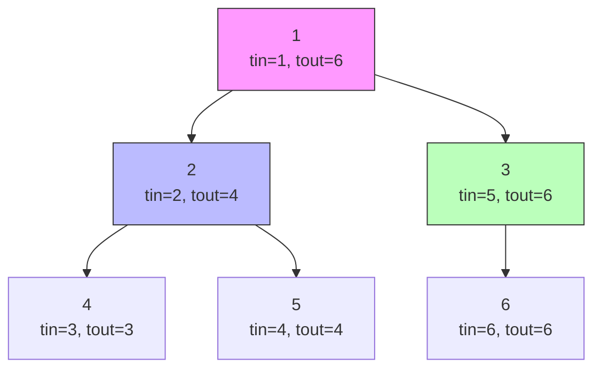

# Bài 44: Euler Tour trên cây - Biến cây thành mảng!

> **Tác giả:** FPTOJ Wiki<br>
> **Nội dung tham khảo từ:** VNOI Wiki, CP-Algorithms

---

## Bạn sẽ học được gì?

- Biến cây thành mảng bằng kỹ thuật Euler Tour
- Truy vấn tổng / min / max trên subtree trong O(log N)
- Cập nhật và truy vấn đường đi từ gốc đến đỉnh bằng mảng hiệu (difference array)
- Tìm LCA trong O(1) bằng Euler Tour + Sparse Table

---

## 1. Giới thiệu: Euler Tour là gì?

### Ẩn dụ: Du lịch tòa nhà

Hãy tưởng tượng bạn là một nhân viên bảo vệ đi kiểm tra một tòa nhà có nhiều phòng.

```
Bạn bắt đầu từ sảnh (phòng 1):
  - Bước vào phòng 2 → kiểm tra → quay về sảnh
  - Bước vào phòng 3 → kiểm tra → quay về sảnh

Mỗi lần "bước vào" một phòng, bạn ghi lại STT lần lượt.
→ Danh sách các phòng theo thứ tự bạn đi qua = Euler Tour!
```

### Định nghĩa chính xác

**Euler Tour trên cây** là cách duyệt cây bằng DFS, ghi lại thời điểm "vào" (`tin`) và "ra" (`tout`) của mỗi đỉnh.

**Ý tưởng cốt lõi:** Biến cấu trúc cây (phức tạp) thành một mảng tuyến tính (đơn giản), sao cho:

- **Subtree** của đỉnh u → một **đoạn liên tục** trong mảng
- **Đường đi từ gốc** → có thể xử lý bằng mảng hiệu

```
Cây:              Euler Tour (mảng):
    1              [1, 2, 4, 5, 3, 6]
   / \              ↑  ↑  ↑  ↑  ↑  ↑
  2   3             1  2  4  5  3  6  (thứ tự vào)
 / \   \
4   5   6
```

### Tại sao Euler Tour quan trọng?

Với cây có N ≤ 10⁵ đỉnh và Q ≤ 10⁵ truy vấn:

| Bài toán | Không có Euler Tour | Có Euler Tour |
|----------|-------------------|---------------|
| Tổng subtree | O(N) mỗi truy vấn | O(log N) |
| Cập nhật + truy vấn subtree | O(N²) | O(Q log N) |
| LCA | O(log N) | O(1) |

---

## 2. Các loại Euler Tour

### Loại 1: Chỉ ghi thời điểm vào (Entry Only)

Mỗi đỉnh xuất hiện **đúng 1 lần** trong mảng. Dùng để xử lý **truy vấn subtree**.

```
DFS từ đỉnh 1:
    1 → 2 → 4 → 5 → 3 → 6

Mảng: [1, 2, 4, 5, 3, 6]
tin:   1  2  3  4  5  6  (1-indexed)
```

→ Subtree của 2 = đoạn [tin[2], tout[2]] = [2, 4] → các đỉnh {2, 4, 5}

### Loại 2: Ghi cả thời điểm vào và ra (Entry + Exit)

Mỗi đỉnh xuất hiện **2 lần** trong mảng. Dùng để xử lý **truy vấn đường đi** bằng mảng hiệu.

```
DFS từ đỉnh 1:
    vào(1) → vào(2) → vào(4) → ra(4) → vào(5) → ra(5) → ra(2) → vào(3) → vào(6) → ra(6) → ra(3) → ra(1)

Mảng: [1, 2, 4, 4, 5, 5, 2, 3, 6, 6, 3, 1]
```

### Loại 3: Duyệt cạnh (Edge Tour)

Mỗi **cạnh** được thăm đúng 2 lần (đi và về). Ít phổ biến hơn.

```
Cạnh (1,2): thăm khi vào 2 và ra 2
Cạnh (1,3): thăm khi vào 3 và ra 3
Cạnh (2,4): thăm khi vào 4 và ra 4
...
```

---

## 3. Euler Tour Loại 1: Truy vấn Subtree

### Ý tưởng

Thực hiện DFS, ghi thời điểm vào `tin[u]` và thời điểm ra `tout[u]` của mỗi đỉnh u.

**Tính chất quan trọng:** Subtree của đỉnh u chính là đoạn liên tục `[tin[u], tout[u]]` trong mảng Euler Tour.

```
Cây:          tin  tout
    1          1    6
   / \        
  2   3       2    4   →  subtree(2) = [2, 4] = {2, 4, 5}
 / \   \              5    6   →  subtree(3) = [5, 6] = {3, 6}
4   5   6     3    3   →  subtree(4) = [3, 3] = {4}
              4    4   →  subtree(5) = [4, 4] = {5}
              5    6   →  subtree(3) = [5, 6] = {3, 6}
```

### Minh họa bằng Mermaid



Mảng Euler Tour (chỉ ghi đỉnh): `[1, 2, 4, 5, 3, 6]`

```
Index:     1  2  3  4  5  6
Đỉnh:      1  2  4  5  3  6
           ↑        ↑
      tin[2]=2  tout[2]=4

Subtree(2) = đoạn [2..4] = {2, 4, 5}  ✓
```

### Code tính tin/tout

=== "C++"

    ```cpp
    #include <bits/stdc++.h>
    using namespace std;

    const int MAXN = 200005;
    vector<int> adj[MAXN];
    int tin[MAXN], tout[MAXN];
    int timer_dfs = 0;

    void dfs(int u, int parent) {
        tin[u] = ++timer_dfs;  // Ghi thời điểm vào
        for (int v : adj[u]) {
            if (v != parent) {
                dfs(v, u);
            }
        }
        tout[u] = timer_dfs;   // Ghi thời điểm ra
    }

    // Kiểm tra xem u có phải tổ tiên của v không
    bool is_ancestor(int u, int v) {
        return tin[u] <= tin[v] && tout[v] <= tout[u];
    }

    int main() {
        ios_base::sync_with_stdio(false);
        cin.tie(nullptr);

        int n, q;
        cin >> n >> q;

        for (int i = 0; i < n - 1; i++) {
            int u, v;
            cin >> u >> v;
            adj[u].push_back(v);
            adj[v].push_back(u);
        }

        dfs(1, 0);

        while (q--) {
            int u;
            cin >> u;
            int subtree_size = tout[u] - tin[u] + 1;
            cout << subtree_size << "\n";
        }
        return 0;
    }
    ```

=== "Python"

    ```python
    import sys
    sys.setrecursionlimit(300000)

    def dfs(u, parent):
        global timer_dfs
        timer_dfs += 1
        tin[u] = timer_dfs
        for v in adj[u]:
            if v != parent:
                dfs(v, u)
        tout[u] = timer_dfs

    def is_ancestor(u, v):
        return tin[u] <= tin[v] and tout[v] <= tout[u]

    n, q = map(int, input().split())
    adj = [[] for _ in range(n + 1)]
    tin = [0] * (n + 1)
    tout = [0] * (n + 1)
    timer_dfs = 0

    for _ in range(n - 1):
        u, v = map(int, input().split())
        adj[u].append(v)
        adj[v].append(u)

    dfs(1, 0)

    for _ in range(q):
        u = int(input())
        subtree_size = tout[u] - tin[u] + 1
        print(subtree_size)
    ```

### Ứng dụng: Truy vấn tổng Subtree bằng BIT/Fenwick

**Bài toán:** Cho cây N đỉnh, mỗi đỉnh có giá trị. Xử lý Q truy vấn:

- `UPDATE u val`: Gán giá trị đỉnh u = val
- `QUERY u`: Tính tổng giá trị các đỉnh trong subtree của u

**Ý tưởng:**

1. Duyệt Euler Tour, lưu giá trị đỉnh u tại vị trí `tin[u]` trong mảng
2. Subtree u = đoạn `[tin[u], tout[u]]`
3. Dùng BIT để cộng điểm + tính tổng đoạn

=== "C++"

    ```cpp
    #include <bits/stdc++.h>
    using namespace std;

    const int MAXN = 200005;
    vector<int> adj[MAXN];
    int tin[MAXN], tout[MAXN];
    long long val[MAXN];
    long long bit[MAXN];
    int timer_dfs = 0;
    int n, q;

    void update(int i, long long delta) {
        for (; i <= n; i += i & (-i))
            bit[i] += delta;
    }

    long long query(int i) {
        long long sum = 0;
        for (; i > 0; i -= i & (-i))
            sum += bit[i];
        return sum;
    }

    long long range_query(int l, int r) {
        return query(r) - query(l - 1);
    }

    void dfs(int u, int parent) {
        tin[u] = ++timer_dfs;
        for (int v : adj[u]) {
            if (v != parent) {
                dfs(v, u);
            }
        }
        tout[u] = timer_dfs;
    }

    int main() {
        ios_base::sync_with_stdio(false);
        cin.tie(nullptr);

        cin >> n >> q;

        for (int i = 1; i <= n; i++) cin >> val[i];

        for (int i = 0; i < n - 1; i++) {
            int u, v;
            cin >> u >> v;
            adj[u].push_back(v);
            adj[v].push_back(u);
        }

        dfs(1, 0);

        // Đưa giá trị vào BIT tại vị trí tin[u]
        for (int i = 1; i <= n; i++) {
            update(tin[i], val[i]);
        }

        while (q--) {
            int type;
            cin >> type;
            if (type == 1) {  // UPDATE
                int u;
                long long new_val;
                cin >> u >> new_val;
                long long delta = new_val - val[u];
                val[u] = new_val;
                update(tin[u], delta);
            } else {  // QUERY subtree sum
                int u;
                cin >> u;
                cout << range_query(tin[u], tout[u]) << "\n";
            }
        }
        return 0;
    }
    ```

=== "Python"

    ```python
    import sys
    sys.setrecursionlimit(300000)

    def update(i, delta):
        while i <= n:
            bit[i] += delta
            i += i & (-i)

    def query(i):
        s = 0
        while i > 0:
            s += bit[i]
            i -= i & (-i)
        return s

    def range_query(l, r):
        return query(r) - query(l - 1)

    def dfs(u, parent):
        global timer_dfs
        timer_dfs += 1
        tin[u] = timer_dfs
        for v in adj[u]:
            if v != parent:
                dfs(v, u)
        tout[u] = timer_dfs

    input_data = sys.stdin.read().split()
    idx = 0
    n = int(input_data[idx]); idx += 1
    q = int(input_data[idx]); idx += 1

    val = [0] * (n + 1)
    for i in range(1, n + 1):
        val[i] = int(input_data[idx]); idx += 1

    adj = [[] for _ in range(n + 1)]
    for _ in range(n - 1):
        u = int(input_data[idx]); idx += 1
        v = int(input_data[idx]); idx += 1
        adj[u].append(v)
        adj[v].append(u)

    tin = [0] * (n + 1)
    tout = [0] * (n + 1)
    timer_dfs = 0

    dfs(1, 0)

    bit = [0] * (n + 1)
    for i in range(1, n + 1):
        update(tin[i], val[i])

    out = []
    for _ in range(q):
        t = int(input_data[idx]); idx += 1
        if t == 1:
            u = int(input_data[idx]); idx += 1
            new_val = int(input_data[idx]); idx += 1
            delta = new_val - val[u]
            val[u] = new_val
            update(tin[u], delta)
        else:
            u = int(input_data[idx]); idx += 1
            out.append(str(range_query(tin[u], tout[u])))

    print("\n".join(out))
    ```

### Bước chạy chi tiết

```
Cây:        1 (val=5)
           / \
          2   3 (val=3, val=7)
         / \
        4   5 (val=2, val=1)

Euler Tour:  dfs(1) → dfs(2) → dfs(4) → dfs(5) → dfs(3)

tin[1]=1, tin[2]=2, tin[4]=3, tin[5]=4, tin[3]=5
tout[4]=3, tout[5]=4, tout[2]=4, tout[3]=5, tout[1]=5

Mảng BIT (theo thứ tự tin):
  Index:  1   2   3   4   5
  Đỉnh:   1   2   4   5   3
  Giá trị: 5   3   2   1   7

QUERY subtree(2):
  → range_query(tin[2], tout[2]) = range_query(2, 4)
  → query(4) - query(1) = (3+2+1) - 5 = 6 - 5 = 1  ← SAI!

  Đúng: query(4) = 5+3+2+1 = 11, query(1) = 5
  → range_query(2, 4) = 11 - 5 = 6  ✓  (3+2+1=6)
```

### Ứng dụng: Truy vấn min/max trên Subtree bằng Segment Tree

Tương tự BIT, nhưng thay vì tính tổng, ta lưu min hoặc max.

=== "C++"

    ```cpp
    #include <bits/stdc++.h>
    using namespace std;

    const int MAXN = 200005;
    const long long INF = 1e18;
    vector<int> adj[MAXN];
    int tin[MAXN], tout[MAXN];
    long long val[MAXN];
    long long tree[4 * MAXN];
    int timer_dfs = 0;
    int n;

    void build(int node, int start, int end) {
        if (start == end) {
            tree[node] = INF;
            return;
        }
        int mid = (start + end) / 2;
        build(2 * node, start, mid);
        build(2 * node + 1, mid + 1, end);
        tree[node] = min(tree[2 * node], tree[2 * node + 1]);
    }

    void update(int node, int start, int end, int pos, long long new_val) {
        if (start == end) {
            tree[node] = new_val;
            return;
        }
        int mid = (start + end) / 2;
        if (pos <= mid)
            update(2 * node, start, mid, pos, new_val);
        else
            update(2 * node + 1, mid + 1, end, pos, new_val);
        tree[node] = min(tree[2 * node], tree[2 * node + 1]);
    }

    long long query(int node, int start, int end, int l, int r) {
        if (r < start || end < l) return INF;
        if (l <= start && end <= r) return tree[node];
        int mid = (start + end) / 2;
        return min(query(2 * node, start, mid, l, r),
                   query(2 * node + 1, mid + 1, end, l, r));
    }

    void dfs(int u, int parent) {
        tin[u] = ++timer_dfs;
        for (int v : adj[u]) {
            if (v != parent) dfs(v, u);
        }
        tout[u] = timer_dfs;
    }

    int main() {
        ios_base::sync_with_stdio(false);
        cin.tie(nullptr);

        cin >> n;
        for (int i = 1; i <= n; i++) cin >> val[i];

        for (int i = 0; i < n - 1; i++) {
            int u, v; cin >> u >> v;
            adj[u].push_back(v);
            adj[v].push_back(u);
        }

        dfs(1, 0);
        build(1, 1, n);

        for (int i = 1; i <= n; i++) {
            update(1, 1, n, tin[i], val[i]);
        }

        int q; cin >> q;
        while (q--) {
            int type; cin >> type;
            if (type == 1) {
                int u; long long new_val;
                cin >> u >> new_val;
                val[u] = new_val;
                update(1, 1, n, tin[u], new_val);
            } else {
                int u; cin >> u;
                cout << query(1, 1, n, tin[u], tout[u]) << "\n";
            }
        }
        return 0;
    }
    ```

=== "Python"

    ```python
    import sys
    sys.setrecursionlimit(300000)

    INF = float('inf')

    def build(node, start, end):
        if start == end:
            tree[node] = INF
        else:
            mid = (start + end) // 2
            build(2 * node, start, mid)
            build(2 * node + 1, mid + 1, end)
            tree[node] = min(tree[2 * node], tree[2 * node + 1])

    def update(node, start, end, pos, new_val):
        if start == end:
            tree[node] = new_val
        else:
            mid = (start + end) // 2
            if pos <= mid:
                update(2 * node, start, mid, pos, new_val)
            else:
                update(2 * node + 1, mid + 1, end, pos, new_val)
            tree[node] = min(tree[2 * node], tree[2 * node + 1])

    def query(node, start, end, l, r):
        if r < start or end < l:
            return INF
        if l <= start and end <= r:
            return tree[node]
        mid = (start + end) // 2
        return min(query(2 * node, start, mid, l, r),
                   query(2 * node + 1, mid + 1, end, l, r))

    def dfs(u, parent):
        global timer_dfs
        timer_dfs += 1
        tin[u] = timer_dfs
        for v in adj[u]:
            if v != parent:
                dfs(v, u)
        tout[u] = timer_dfs

    input_data = sys.stdin.read().split()
    idx = 0
    n = int(input_data[idx]); idx += 1

    val = [0] * (n + 1)
    for i in range(1, n + 1):
        val[i] = int(input_data[idx]); idx += 1

    adj = [[] for _ in range(n + 1)]
    for _ in range(n - 1):
        u = int(input_data[idx]); idx += 1
        v = int(input_data[idx]); idx += 1
        adj[u].append(v)
        adj[v].append(u)

    tin = [0] * (n + 1)
    tout = [0] * (n + 1)
    timer_dfs = 0
    dfs(1, 0)

    tree = [0] * (4 * n + 5)
    build(1, 1, n)
    for i in range(1, n + 1):
        update(1, 1, n, tin[i], val[i])

    q = int(input_data[idx]); idx += 1
    out = []
    for _ in range(q):
        t = int(input_data[idx]); idx += 1
        if t == 1:
            u = int(input_data[idx]); idx += 1
            new_val = int(input_data[idx]); idx += 1
            update(1, 1, n, tin[u], new_val)
        else:
            u = int(input_data[idx]); idx += 1
            out.append(str(query(1, 1, n, tin[u], tout[u])))

    print("\n".join(out))
    ```

---

## 4. Euler Tour Loại 2: Truy vấn Đường đi (Mảng hiệu)

### Ý tưởng

Khi mỗi đỉnh xuất hiện **2 lần** (lúc vào và lúc ra), ta có thể dùng **mảng hiệu (difference array)** để cập nhật đường đi từ gốc.

**Kỹ thuật:**

- Cập nhật đường đi từ gốc đến u: cộng `val` tại `tin[u]`, trừ `val` tại `tout[u] + 1`
- Truy vấn giá trị tại đỉnh u = tổng tiền tố tại `tin[u]`

```
Cập nhật: add val to path(root → u)
  → diff[tin[u]] += val
  → diff[tout[u] + 1] -= val

Truy vấn: giá trị tại đỉnh u
  → prefix_sum(tin[u])
```

### Minh họa

```
Cây:        1
           / \
          2   3
         / \
        4   5

Euler Tour (entry + exit):
  vào(1)=1, vào(2)=2, vào(4)=3, ra(4)=4, vào(5)=5, ra(5)=6, ra(2)=7, vào(3)=8, ra(3)=9, ra(1)=10

Mảng: [1, 2, 4, 4, 5, 5, 2, 3, 3, 1]
Index: 1  2  3  4  5  6  7  8  9  10
```

**Cập nhật: +5 cho đường đi root → 4 (tức là đỉnh 1, 2, 4)**

```
diff[tin[4]] += 5   → diff[3] += 5
diff[tout[4] + 1] -= 5  → diff[5] -= 5

Mảng diff: [0, 0, 5, 0, -5, 0, 0, 0, 0, 0, 0]
Prefix:     [0, 0, 5, 5,  0, 0, 0, 0, 0, 0, 0]

Giá trị tại mỗi đỉnh (lấy prefix_sum tại tin[đỉnh]):
  đỉnh 1: prefix[1] = 0   ← Không nằm trên đường root→4? SAI!

Vấn đề: Kỹ thuật này chỉ đúng khi ta cập nhật từ GỐC đến u.
```

**Cách đúng — Cập nhật từ gốc đến u:**

```
Cây:        1  (gốc)
           / \
          2   3
         / \
        4   5

Euler Tour (Type 2 - entry + exit):
tin[1]=1, tin[2]=2, tin[4]=3, tout[4]=4, tin[5]=5, tout[5]=6,
tout[2]=7, tin[3]=8, tout[3]=9, tout[1]=10

Mảng index:  1  2  3  4  5  6  7  8  9  10
Đỉnh(entry): 1  2  4  -  5  -  -  3  -  -
Đỉnh(exit):  -  -  -  4  -  5  2  -  3  1
```

**Cập nhật +5 cho path(root → 4):**

```
diff[tin[4]] += 5    → diff[3] += 5
diff[tout[4] + 1] -= 5  → diff[5] -= 5

Mảng diff:  [0, 0, 0, 5, 0, -5, 0, 0, 0, 0, 0]
Prefix sum:  [0, 0, 0, 5, 5,  0, 0, 0, 0, 0, 0]

Giá trị đỉnh (prefix tại tin):
  đỉnh 1: prefix[1] = 0    ← Gốc không được cộng? Vẫn sai!

Hmm, để đúng ta cần xét kỹ hơn...
```

### Kỹ thuật đúng: Mảng hiệu trên Euler Tour Type 2

Thực ra kỹ thuật chuẩn là:

```
Khi DUYỆT Euler Tour Type 2:
  - Gặp đỉnh u lần đầu (entry): +val
  - Gặp đỉnh u lần thứ hai (exit): -val

→ Prefix sum tại thời điểm t = tổng giá trị các đỉnh trên đường từ gốc đến đỉnh đang xét tại thời điểm t
```

**Code đúng:**

=== "C++"

    ```cpp
    #include <bits/stdc++.h>
    using namespace std;

    const int MAXN = 200005;
    vector<int> adj[MAXN];
    int tin[MAXN], tout[MAXN];
    long long bit[2 * MAXN];
    int timer_dfs = 0;
    int n, q;

    void update(int i, long long delta) {
        for (; i <= 2 * n; i += i & (-i))
            bit[i] += delta;
    }

    long long query(int i) {
        long long sum = 0;
        for (; i > 0; i -= i & (-i))
            sum += bit[i];
        return sum;
    }

    void dfs(int u, int parent) {
        tin[u] = ++timer_dfs;
        for (int v : adj[u]) {
            if (v != parent) {
                dfs(v, u);
            }
        }
        tout[u] = ++timer_dfs;
    }

    // Cập nhật +val cho toàn bộ subtree của u
    // (Không phải đường đi — đây là cách dùng Type 2 cho subtree update)
    void update_subtree(int u, long long val) {
        update(tin[u], val);
        update(tout[u] + 1, -val);
    }

    // Truy vấn giá trị tại đỉnh u
    long long point_query(int u) {
        return query(tin[u]);
    }

    int main() {
        ios_base::sync_with_stdio(false);
        cin.tie(nullptr);

        cin >> n >> q;

        for (int i = 0; i < n - 1; i++) {
            int u, v;
            cin >> u >> v;
            adj[u].push_back(v);
            adj[v].push_back(u);
        }

        dfs(1, 0);

        // Giá trị ban đầu
        for (int i = 1; i <= n; i++) {
            long long val;
            cin >> val;
            update_subtree(i, val);
        }

        while (q--) {
            int type;
            cin >> type;
            if (type == 1) {  // Cập nhật subtree
                int u; long long val;
                cin >> u >> val;
                update_subtree(u, val);
            } else {  // Truy vấn đỉnh
                int u;
                cin >> u;
                cout << point_query(u) << "\n";
            }
        }
        return 0;
    }
    ```

=== "Python"

    ```python
    import sys
    sys.setrecursionlimit(300000)

    def update(i, delta):
        while i <= 2 * n:
            bit[i] += delta
            i += i & (-i)

    def query(i):
        s = 0
        while i > 0:
            s += bit[i]
            i -= i & (-i)
        return s

    def dfs(u, parent):
        global timer_dfs
        timer_dfs += 1
        tin[u] = timer_dfs
        for v in adj[u]:
            if v != parent:
                dfs(v, u)
        timer_dfs += 1
        tout[u] = timer_dfs

    def update_subtree(u, val):
        update(tin[u], val)
        update(tout[u] + 1, -val)

    def point_query(u):
        return query(tin[u])

    input_data = sys.stdin.read().split()
    idx = 0
    n = int(input_data[idx]); idx += 1
    q = int(input_data[idx]); idx += 1

    adj = [[] for _ in range(n + 1)]
    for _ in range(n - 1):
        u = int(input_data[idx]); idx += 1
        v = int(input_data[idx]); idx += 1
        adj[u].append(v)
        adj[v].append(u)

    tin = [0] * (n + 1)
    tout = [0] * (n + 1)
    bit = [0] * (2 * n + 5)
    timer_dfs = 0
    dfs(1, 0)

    for i in range(1, n + 1):
        val = int(input_data[idx]); idx += 1
        update_subtree(i, val)

    out = []
    for _ in range(q):
        t = int(input_data[idx]); idx += 1
        if t == 1:
            u = int(input_data[idx]); idx += 1
            val = int(input_data[idx]); idx += 1
            update_subtree(u, val)
        else:
            u = int(input_data[idx]); idx += 1
            out.append(str(point_query(u)))

    print("\n".join(out))
    ```

### Tóm tắt: Khi nào dùng Type 1 vs Type 2?

| Loại | Mỗi đỉnh xuất hiện | Dùng cho |
|------|-------------------|----------|
| Type 1 | 1 lần | Subtree query (tổng/min/max đoạn) |
| Type 2 | 2 lần | Subtree update + point query (mảng hiệu) |

---

## 5. LCA qua Euler Tour + RMQ

### Ý tưởng

Thay vì dùng Binary Lifting, ta có thể tìm LCA bằng Euler Tour kết hợp với Sparse Table.

**Bước 1:** Duyệt Euler Tour — mỗi đỉnh có thể xuất hiện nhiều lần.

```
Cây:        1
           / \
          2   3
         / \   \
        4   5   6

Euler Tour (duyệt DFS, ghi đỉnh mỗi lần thăm):
  1 → 2 → 4 → 2 → 5 → 2 → 1 → 3 → 6 → 3 → 1

Mảng E: [1, 2, 4, 2, 5, 2, 1, 3, 6, 3, 1]
Index:   0  1  2  3  4  5  6  7  8  9  10
```

**Bước 2:** Ghi `first[u]` = chỉ số đầu tiên u xuất hiện trong mảng E.

```
first[1] = 0
first[2] = 1
first[4] = 2
first[5] = 4
first[3] = 7
first[6] = 8
```

**Bước 3:** `LCA(u, v)` = đỉnh có **depth nhỏ nhất** trong mảng E từ `first[u]` đến `first[v]`.

```
LCA(4, 5):
  first[4] = 2, first[5] = 4
  E[2..4] = [4, 2, 5]  → depth: [3, 1, 3]
  Min depth = 1 → đỉnh 2 → LCA(4, 5) = 2  ✓

LCA(4, 6):
  first[4] = 2, first[6] = 8
  E[2..8] = [4, 2, 5, 2, 1, 3, 6]
  depth:        [3, 1, 3, 1, 0, 2, 3]
  Min depth = 0 → đỉnh 1 → LCA(4, 6) = 1  ✓
```

### Code đầy đủ

=== "C++"

    ```cpp
    #include <bits/stdc++.h>
    using namespace std;

    const int MAXN = 200005;
    const int LOG = 20;
    vector<int> adj[MAXN];
    int depth[MAXN];
    int euler[2 * MAXN];      // Mảng Euler Tour
    int first[MAXN];          // Vị trí đầu tiên trong euler
    int euler_depth[2 * MAXN]; // Depth tương ứng
    int st[2 * MAXN][LOG];    // Sparse Table
    int log_table[2 * MAXN];
    int n, q, euler_cnt;

    void dfs(int u, int parent, int d) {
        depth[u] = d;
        euler[euler_cnt] = u;
        euler_depth[euler_cnt] = d;
        if (first[u] == -1) first[u] = euler_cnt;
        euler_cnt++;

        for (int v : adj[u]) {
            if (v != parent) {
                dfs(v, u, d + 1);
                euler[euler_cnt] = u;
                euler_depth[euler_cnt] = d;
                euler_cnt++;
            }
        }
    }

    void build_sparse_table() {
        int m = euler_cnt;
        // Tính log
        log_table[1] = 0;
        for (int i = 2; i <= m; i++)
            log_table[i] = log_table[i / 2] + 1;

        // Base case
        for (int i = 0; i < m; i++)
            st[i][0] = i;

        // Build
        for (int j = 1; (1 << j) <= m; j++) {
            for (int i = 0; i + (1 << j) - 1 < m; i++) {
                int left = st[i][j - 1];
                int right = st[i + (1 << (j - 1))][j - 1];
                st[i][j] = (euler_depth[left] < euler_depth[right]) ? left : right;
            }
        }
    }

    int query_rmq(int l, int r) {
        int k = log_table[r - l + 1];
        int left = st[l][k];
        int right = st[r - (1 << k) + 1][k];
        return (euler_depth[left] < euler_depth[right]) ? left : right;
    }

    int lca(int u, int v) {
        int l = first[u], r = first[v];
        if (l > r) swap(l, r);
        int idx = query_rmq(l, r);
        return euler[idx];
    }

    int main() {
        ios_base::sync_with_stdio(false);
        cin.tie(nullptr);

        cin >> n >> q;

        for (int i = 0; i < n - 1; i++) {
            int u, v;
            cin >> u >> v;
            adj[u].push_back(v);
            adj[v].push_back(u);
        }

        memset(first, -1, sizeof(first));
        euler_cnt = 0;
        dfs(1, 0, 0);
        build_sparse_table();

        while (q--) {
            int u, v;
            cin >> u >> v;
            cout << lca(u, v) << "\n";
        }
        return 0;
    }
    ```

=== "Python"

    ```python
    import sys
    sys.setrecursionlimit(300000)

    def dfs(u, parent, d):
        global euler_cnt
        depth[u] = d
        euler[euler_cnt] = u
        euler_depth[euler_cnt] = d
        if first[u] == -1:
            first[u] = euler_cnt
        euler_cnt += 1

        for v in adj[u]:
            if v != parent:
                dfs(v, u, d + 1)
                euler[euler_cnt] = u
                euler_depth[euler_cnt] = d
                euler_cnt += 1

    def build_sparse_table():
        m = euler_cnt
        log_table[1] = 0
        for i in range(2, m + 1):
            log_table[i] = log_table[i // 2] + 1

        for i in range(m):
            st[i][0] = i

        j = 1
        while (1 << j) <= m:
            i = 0
            while i + (1 << j) - 1 < m:
                left = st[i][j - 1]
                right = st[i + (1 << (j - 1))][j - 1]
                st[i][j] = left if euler_depth[left] < euler_depth[right] else right
                i += 1
            j += 1

    def query_rmq(l, r):
        k = log_table[r - l + 1]
        left = st[l][k]
        right = st[r - (1 << k) + 1][k]
        return left if euler_depth[left] < euler_depth[right] else right

    def lca(u, v):
        l, r = first[u], first[v]
        if l > r:
            l, r = r, l
        idx = query_rmq(l, r)
        return euler[idx]

    input_data = sys.stdin.read().split()
    idx = 0
    n = int(input_data[idx]); idx += 1
    q = int(input_data[idx]); idx += 1

    adj = [[] for _ in range(n + 1)]
    for _ in range(n - 1):
        u = int(input_data[idx]); idx += 1
        v = int(input_data[idx]); idx += 1
        adj[u].append(v)
        adj[v].append(u)

    depth = [0] * (n + 1)
    euler = [0] * (2 * n)
    euler_depth = [0] * (2 * n)
    first = [-1] * (n + 1)
    log_table = [0] * (2 * n + 1)
    st = [[0] * 20 for _ in range(2 * n)]
    euler_cnt = 0

    dfs(1, 0, 0)
    build_sparse_table()

    out = []
    for _ in range(q):
        u = int(input_data[idx]); idx += 1
        v = int(input_data[idx]); idx += 1
        out.append(str(lca(u, v)))

    print("\n".join(out))
    ```

### So sánh: LCA bằng Euler Tour vs Binary Lifting

| Tiêu chí | Binary Lifting | Euler Tour + RMQ |
|----------|---------------|-----------------|
| Tiền xử lý | O(N log N) | O(N log N) |
| Truy vấn | O(log N) | **O(1)** |
| Bộ nhớ | O(N log N) | O(N log N) |
| Độ phức tạp code | Trung bình | Phức tạp hơn |
| Linh hoạt | Cao (khoảng cách, nhảy k bước) | Chỉ LCA |

**Lời khuyên:** Dùng Euler Tour + RMQ khi cần truy vấn LCA **rất nhiều lần** (≥ 10⁵). Dùng Binary Lifting khi cần linh hoạt hơn.

---

## 6. Tổng hợp ứng dụng

### Bảng tổng hợp

| Bài toán | Kỹ thuật | Độ phức tạp |
|----------|----------|-------------|
| Tổng subtree | Euler Tour Type 1 + BIT | O(log N) / truy vấn |
| Min/Max subtree | Euler Tour Type 1 + Segment Tree | O(log N) / truy vấn |
| Cập nhật subtree + point query | Euler Tour Type 2 + BIT (mảng hiệu) | O(log N) / truy vấn |
| LCA | Euler Tour + Sparse Table | O(1) / truy vấn |
| Đường đi root → u (cập nhật) | Euler Tour Type 2 + mảng hiệu | O(log N) / truy vấn |

### Bài toán kết hợp: Subtree sum + Path sum

```
Bài toán: Cho cây, mỗi đỉnh có giá trị.
  - UPDATE u val: Gán giá trị đỉnh u = val
  - SUBTREE u: Tổng subtree của u
  - PATH u: Tổng đường đi từ gốc đến u

Giải: Dùng 2 BIT
  - BIT1 (Euler Tour Type 1): Xử lý SUBTREE queries
  - BIT2 (Euler Tour Type 2): Xử lý PATH queries (mảng hiệu)
```

---

## 7. Lưu ý và Cạm bẫy

### Cạm bẫy 1: Nhầm tin/tout trong Type 2

```
SAI:  update(tin[u], val); update(tout[u], -val);
ĐÚNG: update(tin[u], val); update(tout[u] + 1, -val);
                                       ^^^^
                              Phải là tout[u] + 1!
```

### Cạm bẫy 2: 1-indexed vs 0-indexed

```
BIT thường dùng 1-indexed (i > 0 trong vòng lặp)
Euler Tour có thể 0-indexed hoặc 1-indexed

→ Nhất quán: dùng 1-indexed cho cả tin/tout và BIT
```

### Cạm bẫy 3: Quên reset timer

```
Nếu chạy nhiều test case:
  timer_dfs = 0;  // PHẢI reset trước mỗi test case!
```

### Cạm bẫy 4: Stack overflow khi DFS cây sâu

```
Cây dạng dây (chain) có N = 2×10⁵ → độ sâu N → RE!

Giải pháp:
  - C++: Dùng iterative DFS hoặc tăng stack size
  - Python: Tăng sys.setrecursionlimit(300000)
```

### Cạm bẫy 5: Nhầm thứ tự trong Sparse Table

```
Sparse Table cho RMQ: so sánh euler_depth, KHÔNG phải so sánh index!

SAI:  st[i][j] = min(st[i][j-1], st[i+(1<<(j-1))][j-1])
ĐÚNG: Chọn thằng nào có euler_depth nhỏ hơn
```

---

## 8. Bài tập luyện tập

| Bài | Nền tảng | Độ khó | Chủ đề |
|-----|----------|--------|--------|
| [CSES - Subtree Queries](https://cses.fi/problemset/task/1137) | CSES | ⭐⭐ | Subtree sum với BIT |
| [CSES - Path Queries](https://cses.fi/problemset/task/1138) | CSES | ⭐⭐⭐ | Path sum Euler Tour |
| [CSES - Company Queries II](https://cses.fi/problemset/task/1688) | CSES | ⭐⭐ | LCA qua Euler Tour |
| [CF 383C - Propagating tree](https://codeforces.com/problemset/problem/383/C) | CF | ⭐⭐⭐ | Euler Tour + BIT |
| [SPOJ - QTREE](https://www.spoj.com/problems/QTREE/) | SPOJ | ⭐⭐⭐⭐ | Euler Tour + HLD |
| [VNOJ - AtCoder DP V - Subtree](https://oj.vnoi.info/problem/atcoder_dp_v) | VNOJ | ★★★★ | Rerooting + Euler Tour |
| [VNOJ - AtCoder DP U - Grouping](https://oj.vnoi.info/problem/atcoder_dp_u) | VNOJ | ★★★★ | Bitmask + tree |

---

## Tóm tắt

```
Euler Tour = DFS flatten cây → mảng

Type 1 (entry only):
  → subtree(u) = [tin[u], tout[u]]
  → Dùng BIT/SegTree cho subtree sum/min/max

Type 2 (entry + exit):
  → Mảng hiệu cho subtree update + point query
  → diff[tin[u]] += val, diff[tout[u]+1] -= val

LCA:
  → Euler Tour + Sparse Table → O(1) truy vấn
```

**Euler Tour là kỹ thuật "thần thánh" biến cây thành mảng — nắm vững nó sẽ giải được rất nhiều bài toán cây!**
