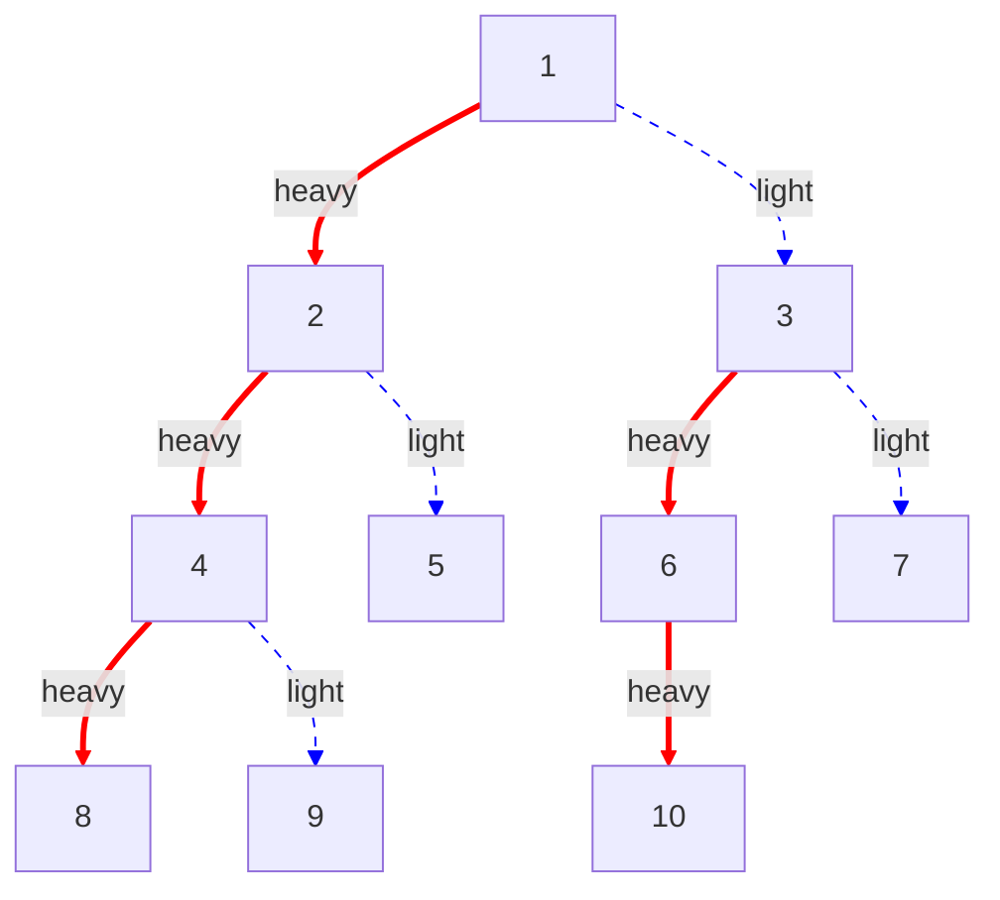
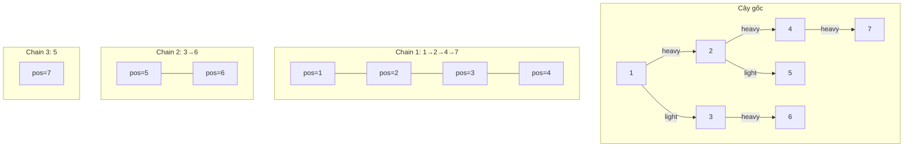

# Bài 46: Heavy-Light Decomposition - Phân rã cây!

> **Tác giả:** FPTOJ Wiki<br>
> **Nội dung tham khảo từ:** VNOI Wiki, CP-Algorithms

---

## Bạn sẽ học được gì?
- Heavy/Light edges là gì
- HLD biến đường đi trên cây thành O(log N) đoạn liên tục
- Truy vấn min/max/sum trên đường đi trong O(log²N)
- Cách áp dụng HLD cho truy vấn subtree, LCA, và cập nhật cạnh

---

## 1. Bài toán

Cho cây **N** đỉnh (N ≤ 10⁵), mỗi đỉnh có một giá trị. Hỗ trợ hai loại truy vấn:

| Loại truy vấn | Mô tả |
|---|---|
| `UPDATE(u, val)` | Gán giá trị `val` cho đỉnh `u` |
| `QUERY(u, v)` | Tìm **tổng / min / max** trên đường đi từ `u` đến `v` |

### Cách tiếp cận naïve

Với mỗi truy vấn `QUERY(u, v)`, duyệt toàn bộ đường đi từ `u` lên LCA rồi xuống `v`:

```
Độ phức tạp: O(N) mỗi truy vấn
→ Q truy vấn: O(N·Q) → TLE với N, Q = 10⁵
```

**Vấn đề:** Đường đi trên cây không phải là một đoạn liên tục trong mảng, nên không thể dùng Segment Tree trực tiếp.

**Giải pháp:** Dùng **Heavy-Light Decomposition (HLD)** để biến đường đi trên cây thành **O(log N) đoạn liên tục** trong mảng, rồi dùng Segment Tree trên mỗi đoạn.

---

## 2. Heavy/Light Edges

### Định nghĩa

Với mỗi đỉnh `u` (không phải lá), gọi `sz[v]` là kích thước cây con gốc `v`.

- **Heavy edge** của `u`: cạnh nối `u` với con `v` mà `sz[v]` **lớn nhất** (nếu nhiều con cùng kích thước, chọn bất kỳ).
- **Light edge** của `u`: tất cả các cạnh còn lại từ `u` đến các con.

```
        1 (sz=10)
       / \
      2    3 (sz=7)   ← heavy edge từ 1
     / \   / \
    4   5 6   7
        |
        8
```

Trong ví dụ trên, cạnh (1→3) là heavy edge vì `sz[3]=7 > sz[2]=4`.

### Tính chất quan trọng

> **Định lý:** Trên đường đi từ gốc đến bất kỳ lá, có **tối đa log N light edges**.

**Chứng minh:** Khi đi qua một light edge từ `u` sang con `v`, ta có `sz[v] ≤ sz[u]/2` (vì `v` không phải heavy child). Vậy kích thước cây con giảm ít nhất một nửa. Sau tối đa `log N` bước, kích thước giảm xuống 1. ∎

### Minh họa Heavy/Light edges



> **Đỏ = Heavy edges**, **Xanh = Light edges**

---

## 3. Chain Decomposition (Phân rã chuỗi)

### Ý tưởng chính

Mỗi **heavy path** (chuỗi các heavy edges liên tiếp) tạo thành một **chain**. Ta gán **DFS order** (thứ tự duyệt) sao cho mỗi chain là một **đoạn liên tục** trong mảng.

Cần lưu trữ:
- `pos[u]`: vị trí của đỉnh `u` trong mảng (theo DFS order)
- `head[u]`: đỉnh đầu tiên trong chain chứa `u`
- `heavy[u]`: con nặng (heavy child) của `u`, -1 nếu là lá
- `parent[u]`: cha của `u`
- `depth[u]`: độ sâu của `u`
- `sz[u]`: kích thước cây con gốc `u`

### Minh họa Chain Decomposition



Mỗi chain ứng với một **đoạn liên tục** trong mảng → có thể dùng **Segment Tree** trên toàn bộ mảng!

### Cài đặt: DFS tìm Heavy Child

=== "C++"

    ```cpp
    #include <bits/stdc++.h>
    using namespace std;
    
    const int MAXN = 100005;
    
    int n;
    vector<int> adj[MAXN];
    int parent[MAXN], depth[MAXN], sz[MAXN], heavy[MAXN];
    
    // DFS 1: Tính parent, depth, sz, heavy
    void dfs(int u, int p) {
        parent[u] = p;
        sz[u] = 1;
        heavy[u] = -1;
        int max_sz = 0;
    
        for (int v : adj[u]) {
            if (v == p) continue;
            depth[v] = depth[u] + 1;
            dfs(v, u);
            sz[u] += sz[v];
            if (sz[v] > max_sz) {
                max_sz = sz[v];
                heavy[u] = v;
            }
        }
    }
    ```

=== "Python"

    ```python
    import sys
    from collections import defaultdict
    
    sys.setrecursionlimit(300000)
    
    n = 0
    adj = defaultdict(list)
    parent = [0] * 200005
    depth = [0] * 200005
    sz = [0] * 200005
    heavy = [-1] * 200005
    
    def dfs(u, p):
        parent[u] = p
        sz[u] = 1
        heavy[u] = -1
        max_sz = 0
    
        for v in adj[u]:
            if v == p:
                continue
            depth[v] = depth[u] + 1
            dfs(v, u)
            sz[u] += sz[v]
            if sz[v] > max_sz:
                max_sz = sz[v]
                heavy[u] = v
    ```

### Cài đặt: Decompose - Gán DFS Order

=== "C++"

    ```cpp
    int cur_pos;
    int head[MAXN], pos[MAXN];
    int val[MAXN], arr[MAXN]; // arr[] là mảng cho Segment Tree
    
    // DFS 2: Phân rã - gán pos và head
    void decompose(int u, int h) {
        head[u] = h;
        pos[u] = cur_pos;
        arr[cur_pos] = val[u]; // Gán giá trị vào mảng theo DFS order
        cur_pos++;
    
        // Đi heavy child trước (để heavy path liên tục)
        if (heavy[u] != -1) {
            decompose(heavy[u], h); // Cùng chain
        }
    
        // Các light children → tạo chain mới
        for (int v : adj[u]) {
            if (v == parent[u] || v == heavy[u]) continue;
            decompose(v, v); // Chain mới bắt đầu từ v
        }
    }
    
    // Gọi trong main:
    // dfs(1, -1);
    // decompose(1, 1);
    ```

=== "Python"

    ```python
    cur_pos = 0
    head = [0] * 200005
    pos_arr = [0] * 200005
    val = [0] * 200005
    seg_arr = [0] * 200005  # Mảng cho Segment Tree
    
    def decompose(u, h):
        global cur_pos
        head[u] = h
        pos_arr[u] = cur_pos
        seg_arr[cur_pos] = val[u]
        cur_pos += 1
    
        # Đi heavy child trước
        if heavy[u] != -1:
            decompose(heavy[u], h)
    
        # Các light children
        for v in adj[u]:
            if v == parent[u] or v == heavy[u]:
                continue
            decompose(v, v)
    
    # Gọi:
    # dfs(1, -1)
    # decompose(1, 1)
    ```

### Giải thích thứ tự DFS

Thứ tự thăm đỉnh rất quan trọng:

```
Gốc → Heavy child → Heavy child của heavy child → ... → Quay lại light children
```

Nhờ vậy, toàn bộ heavy path được gán **liên tục** trong mảng `pos[]`.

---

## 4. Path Queries (Truy vấn đường đi)

### Ý tưởng

Để truy vấn đường đi từ `u` đến `v`:

1. Miễn là `head[u] != head[v]`, nhảy lên chain chứa đỉnh sâu hơn.
2. Khi `head[u] == head[v]`, truy vấn đoạn còn lại giữa `u` và `v`.

Mỗi bước nhảy qua một light edge → tối đa **O(log N) bước**.

### Minh họa Path Query

```
Cây:          1
             / \
            2   3
           / \   \
          4   5   6
         /         \
        7           8

DFS order: 1(pos=1) → 2(pos=2) → 4(pos=3) → 7(pos=4)
           5(pos=5)
           3(pos=6) → 6(pos=7) → 8(pos=8)

Truy vấn QUERY(7, 8):
  head[7]=1, head[8]=3 → khác → depth[head[7]]=0 < depth[head[8]]=2
    → Nhảy: query(pos[3], pos[8]) = query(6, 8), v = parent[head[8]] = parent[3] = 1
  head[7]=1, head[1]=1 → giống
    → query(pos[1], pos[7]) = query(1, 4)

Kết quả: 2 đoạn liên tục [1,4] và [6,8]
```

### Cài đặt Segment Tree

=== "C++"

    ```cpp
    // Segment Tree cho Sum
    struct SegTree {
        int n;
        vector<long long> tree;
    
        void init(int _n) {
            n = _n;
            tree.assign(4 * n, 0);
        }
    
        void build(int node, int tl, int tr, long long a[]) {
            if (tl == tr) {
                tree[node] = a[tl];
                return;
            }
            int tm = (tl + tr) / 2;
            build(2 * node, tl, tm, a);
            build(2 * node + 1, tm + 1, tr, a);
            tree[node] = tree[2 * node] + tree[2 * node + 1];
        }
    
        void update(int node, int tl, int tr, int pos, long long val) {
            if (tl == tr) {
                tree[node] = val;
                return;
            }
            int tm = (tl + tr) / 2;
            if (pos <= tm)
                update(2 * node, tl, tm, pos, val);
            else
                update(2 * node + 1, tm + 1, tr, pos, val);
            tree[node] = tree[2 * node] + tree[2 * node + 1];
        }
    
        long long query(int node, int tl, int tr, int l, int r) {
            if (l > tr || r < tl) return 0;
            if (l <= tl && tr <= r) return tree[node];
            int tm = (tl + tr) / 2;
            return query(2 * node, tl, tm, l, r) +
                   query(2 * node + 1, tm + 1, tr, l, r);
        }
    };
    ```

=== "Python"

    ```python
    class SegTree:
        def __init__(self, n):
            self.n = n
            self.tree = [0] * (4 * n)
    
        def build(self, node, tl, tr, arr):
            if tl == tr:
                self.tree[node] = arr[tl]
                return
            tm = (tl + tr) // 2
            self.build(2 * node, tl, tm, arr)
            self.build(2 * node + 1, tm + 1, tr, arr)
            self.tree[node] = self.tree[2 * node] + self.tree[2 * node + 1]
    
        def update(self, node, tl, tr, pos, val):
            if tl == tr:
                self.tree[node] = val
                return
            tm = (tl + tr) // 2
            if pos <= tm:
                self.update(2 * node, tl, tm, pos, val)
            else:
                self.update(2 * node + 1, tm + 1, tr, pos, val)
            self.tree[node] = self.tree[2 * node] + self.tree[2 * node + 1]
    
        def query(self, node, tl, tr, l, r):
            if l > tr or r < tl:
                return 0
            if l <= tl and tr <= r:
                return self.tree[node]
            tm = (tl + tr) // 2
            return (self.query(2 * node, tl, tm, l, r) +
                    self.query(2 * node + 1, tm + 1, tr, l, r))
    ```

### Cài đặt Path Query

=== "C++"

    ```cpp
    SegTree st;
    
    // Truy vấn đường đi từ u đến v (sum)
    long long path_query(int u, int v) {
        long long res = 0;
        while (head[u] != head[v]) {
            // Nhảy lên chain chứa đỉnh sâu hơn
            if (depth[head[u]] > depth[head[v]]) swap(u, v);
            // Truy vấn đoạn [pos[head[v]], pos[v]]
            res += st.query(1, 0, n - 1, pos[head[v]], pos[v]);
            v = parent[head[v]];
        }
        // head[u] == head[v] → cùng chain
        if (depth[u] > depth[v]) swap(u, v);
        res += st.query(1, 0, n - 1, pos[u], pos[v]);
        return res;
    }
    
    // Cập nhật giá trị đỉnh u
    void update_node(int u, long long val) {
        st.update(1, 0, n - 1, pos[u], val);
    }
    
    // Trong main:
    // st.init(n);
    // st.build(1, 0, n - 1, arr);
    ```

=== "Python"

    ```python
    st = SegTree(n)
    
    def path_query(u, v):
        res = 0
        while head[u] != head[v]:
            if depth[head[u]] > depth[head[v]]:
                u, v = v, u
            res += st.query(1, 0, n - 1, pos_arr[head[v]], pos_arr[v])
            v = parent[head[v]]
        if depth[u] > depth[v]:
            u, v = v, u
        res += st.query(1, 0, n - 1, pos_arr[u], pos_arr[v])
        return res
    
    def update_node(u, val):
        st.update(1, 0, n - 1, pos_arr[u], val)
    
    # Trong main:
    # st.build(1, 0, n - 1, seg_arr)
    ```

### Code đầy đủ (Full Solution)

=== "C++"

    ```cpp
    #include <bits/stdc++.h>
    using namespace std;
    
    const int MAXN = 100005;
    
    int n;
    vector<int> adj[MAXN];
    int parent[MAXN], depth[MAXN], sz[MAXN], heavy[MAXN];
    int head[MAXN], pos[MAXN];
    int cur_pos;
    long long val[MAXN], arr[MAXN];
    
    void dfs(int u, int p) {
        parent[u] = p;
        sz[u] = 1;
        heavy[u] = -1;
        int max_sz = 0;
        for (int v : adj[u]) {
            if (v == p) continue;
            depth[v] = depth[u] + 1;
            dfs(v, u);
            sz[u] += sz[v];
            if (sz[v] > max_sz) {
                max_sz = sz[v];
                heavy[u] = v;
            }
        }
    }
    
    void decompose(int u, int h) {
        head[u] = h;
        pos[u] = cur_pos;
        arr[cur_pos] = val[u];
        cur_pos++;
        if (heavy[u] != -1) {
            decompose(heavy[u], h);
        }
        for (int v : adj[u]) {
            if (v == parent[u] || v == heavy[u]) continue;
            decompose(v, v);
        }
    }
    
    struct SegTree {
        int n;
        vector<long long> tree;
        void init(int _n) { n = _n; tree.assign(4 * n, 0); }
        void build(int nd, int tl, int tr, long long a[]) {
            if (tl == tr) { tree[nd] = a[tl]; return; }
            int tm = (tl + tr) / 2;
            build(2*nd, tl, tm, a); build(2*nd+1, tm+1, tr, a);
            tree[nd] = tree[2*nd] + tree[2*nd+1];
        }
        void update(int nd, int tl, int tr, int p, long long v) {
            if (tl == tr) { tree[nd] = v; return; }
            int tm = (tl + tr) / 2;
            if (p <= tm) update(2*nd, tl, tm, p, v);
            else update(2*nd+1, tm+1, tr, p, v);
            tree[nd] = tree[2*nd] + tree[2*nd+1];
        }
        long long query(int nd, int tl, int tr, int l, int r) {
            if (l > tr || r < tl) return 0;
            if (l <= tl && tr <= r) return tree[nd];
            int tm = (tl + tr) / 2;
            return query(2*nd, tl, tm, l, r) + query(2*nd+1, tm+1, tr, l, r);
        }
    } st;
    
    long long path_query(int u, int v) {
        long long res = 0;
        while (head[u] != head[v]) {
            if (depth[head[u]] > depth[head[v]]) swap(u, v);
            res += st.query(1, 0, n-1, pos[head[v]], pos[v]);
            v = parent[head[v]];
        }
        if (depth[u] > depth[v]) swap(u, v);
        res += st.query(1, 0, n-1, pos[u], pos[v]);
        return res;
    }
    
    void update_node(int u, long long v) {
        st.update(1, 0, n-1, pos[u], v);
    }
    
    int main() {
        ios::sync_with_stdio(false);
        cin.tie(nullptr);
    
        int q;
        cin >> n >> q;
        for (int i = 1; i <= n; i++) cin >> val[i];
        for (int i = 0; i < n - 1; i++) {
            int u, v;
            cin >> u >> v;
            adj[u].push_back(v);
            adj[v].push_back(u);
        }
    
        dfs(1, -1);
        cur_pos = 0;
        decompose(1, 1);
    
        st.init(n);
        st.build(1, 0, n-1, arr);
    
        while (q--) {
            int type;
            cin >> type;
            if (type == 1) {
                int u; long long v;
                cin >> u >> v;
                update_node(u, v);
            } else {
                int u, v;
                cin >> u >> v;
                cout << path_query(u, v) << '\n';
            }
        }
        return 0;
    }
    ```

=== "Python"

    ```python
    import sys
    from collections import defaultdict
    
    sys.setrecursionlimit(300000)
    input = sys.stdin.readline
    
    n = 0
    adj = defaultdict(list)
    parent = [0] * 200005
    depth = [0] * 200005
    sz = [0] * 200005
    heavy = [-1] * 200005
    head = [0] * 200005
    pos_arr = [0] * 200005
    val = [0] * 200005
    seg_arr = [0] * 200005
    cur_pos = 0
    
    def dfs(u, p):
        parent[u] = p
        sz[u] = 1
        heavy[u] = -1
        max_sz = 0
        for v in adj[u]:
            if v == p:
                continue
            depth[v] = depth[u] + 1
            dfs(v, u)
            sz[u] += sz[v]
            if sz[v] > max_sz:
                max_sz = sz[v]
                heavy[u] = v
    
    def decompose(u, h):
        global cur_pos
        head[u] = h
        pos_arr[u] = cur_pos
        seg_arr[cur_pos] = val[u]
        cur_pos += 1
        if heavy[u] != -1:
            decompose(heavy[u], h)
        for v in adj[u]:
            if v == parent[u] or v == heavy[u]:
                continue
            decompose(v, v)
    
    class SegTree:
        def __init__(self, n):
            self.n = n
            self.tree = [0] * (4 * n)
        def build(self, nd, tl, tr, arr):
            if tl == tr:
                self.tree[nd] = arr[tl]
                return
            tm = (tl + tr) // 2
            self.build(2*nd, tl, tm, arr)
            self.build(2*nd+1, tm+1, tr, arr)
            self.tree[nd] = self.tree[2*nd] + self.tree[2*nd+1]
        def update(self, nd, tl, tr, p, v):
            if tl == tr:
                self.tree[nd] = v
                return
            tm = (tl + tr) // 2
            if p <= tm:
                self.update(2*nd, tl, tm, p, v)
            else:
                self.update(2*nd+1, tm+1, tr, p, v)
            self.tree[nd] = self.tree[2*nd] + self.tree[2*nd+1]
        def query(self, nd, tl, tr, l, r):
            if l > tr or r < tl:
                return 0
            if l <= tl and tr <= r:
                return self.tree[nd]
            tm = (tl + tr) // 2
            return (self.query(2*nd, tl, tm, l, r) +
                    self.query(2*nd+1, tm+1, tr, l, r))
    
    def path_query(u, v):
        res = 0
        while head[u] != head[v]:
            if depth[head[u]] > depth[head[v]]:
                u, v = v, u
            res += st.query(1, 0, n-1, pos_arr[head[v]], pos_arr[v])
            v = parent[head[v]]
        if depth[u] > depth[v]:
            u, v = v, u
        res += st.query(1, 0, n-1, pos_arr[u], pos_arr[v])
        return res
    
    def update_node(u, v):
        st.update(1, 0, n-1, pos_arr[u], v)
    
    def main():
        global n, st
        n, q = map(int, input().split())
        vals = list(map(int, input().split()))
        for i in range(n):
            val[i+1] = vals[i]
        for _ in range(n-1):
            u, v = map(int, input().split())
            adj[u].append(v)
            adj[v].append(u)
    
        dfs(1, -1)
        global cur_pos
        cur_pos = 0
        decompose(1, 1)
    
        st = SegTree(n)
        st.build(1, 0, n-1, seg_arr)
    
        out = []
        for _ in range(q):
            parts = list(map(int, input().split()))
            if parts[0] == 1:
                update_node(parts[1], parts[2])
            else:
                out.append(str(path_query(parts[1], parts[2])))
        print('\n'.join(out))
    
    main()
    ```

---

## 5. Bước chạy chi tiết (Step-by-step Trace)

Cho cây sau với giá trị tại mỗi đỉnh:

```
        1 (val=5)
       / \
      2    3 (val=7)
     / \    \
    4   5    6 (val=3)
   (val=2) (val=1) (val=9)
```

### Bước 1: DFS tính sz và heavy

```
DFS(1):  adj[1] = {2, 3}
  DFS(2):  adj[2] = {1, 4, 5}  →  DFS(4): sz[4]=1, heavy[4]=-1
                                  DFS(5): sz[5]=1, heavy[5]=-1
           sz[2] = 1+1+1 = 3,  heavy[2] = 4 (cùng sz, chọn con đầu)
  DFS(3):  adj[3] = {1, 6}     →  DFS(6): sz[6]=1, heavy[6]=-1
           sz[3] = 1+1 = 2,    heavy[3] = 6

  sz[1] = 1 + 3 + 2 = 6,  heavy[1] = 2  (sz[2]=3 > sz[3]=2)
```

| u | sz[u] | heavy[u] | depth[u] | parent[u] |
|---|-------|----------|----------|-----------|
| 1 | 6     | 2        | 0        | -1        |
| 2 | 3     | 4        | 1        | 1         |
| 3 | 2     | 6        | 1        | 1         |
| 4 | 1     | -1       | 2        | 2         |
| 5 | 1     | -1       | 2        | 2         |
| 6 | 1     | -1       | 2        | 3         |

### Bước 2: Decompose - Gán DFS Order

```
decompose(1, 1):
  head[1]=1, pos[1]=0, arr[0]=5    cur_pos=1
  heavy[1]=2 → decompose(2, 1):
    head[2]=1, pos[2]=1, arr[1]=2   cur_pos=2
    heavy[2]=4 → decompose(4, 1):
      head[4]=1, pos[4]=2, arr[2]=2  cur_pos=3
      heavy[4]=-1 → return
    light child 5 → decompose(5, 5):
      head[5]=5, pos[5]=3, arr[3]=1  cur_pos=4
      heavy[5]=-1 → return
  light child 3 → decompose(3, 3):
    head[3]=3, pos[3]=4, arr[4]=7   cur_pos=5
    heavy[3]=6 → decompose(6, 3):
      head[6]=3, pos[6]=5, arr[5]=3  cur_pos=6
      heavy[6]=-1 → return
```

| u | head[u] | pos[u] | Chain |
|---|---------|--------|-------|
| 1 | 1       | 0      | 1→2→4 |
| 2 | 1       | 1      | 1→2→4 |
| 4 | 1       | 2      | 1→2→4 |
| 5 | 5       | 3      | 5     |
| 3 | 3       | 4      | 3→6   |
| 6 | 3       | 5      | 3→6   |

Mảng `arr[]` = `[5, 2, 2, 1, 7, 3]`

### Bước 3: Truy vấn QUERY(4, 6)

Tìm tổng trên đường đi 4→2→1→3→6.

```
head[4]=1, head[6]=3 → khác
  depth[head[4]]=0, depth[head[6]]=1 → 6 sâu hơn
  Query(pos[head[6]], pos[6]) = query(4, 5) = arr[4]+arr[5] = 7+3 = 10
  v = parent[head[6]] = parent[3] = 1
  → res = 10, v = 1

head[4]=1, head[1]=1 → giống
  depth[4]=2 > depth[1]=0 → swap: u=1, v=4
  Query(pos[1], pos[4]) = query(0, 2) = arr[0]+arr[1]+arr[2] = 5+2+2 = 9
  → res = 10 + 9 = 19

Kết quả: 19 = (5+2+2) + (7+3) = 9 + 10 ✓
```

---

## 6. Subtree Queries (Truy vấn cây con)

Một tính chất quan trọng của HLD: **toàn bộ cây con** của đỉnh `u` là một **đoạn liên tục** trong mảng DFS order.

```
Subtree(u) = [pos[u], pos[u] + sz[u] - 1]
```

### Truy vấn / Cập nhật subtree

=== "C++"

    ```cpp
    // Truy vấn tổng cây con gốc u
    long long subtree_query(int u) {
        return st.query(1, 0, n-1, pos[u], pos[u] + sz[u] - 1);
    }
    
    // Cập nhật tất cả giá trị trong cây con gốc u (cần Lazy Propagation)
    // Hoặc nếu chỉ cần update 1 giá trị thì dùng update_node()
    ```

=== "Python"

    ```python
    def subtree_query(u):
        return st.query(1, 0, n-1, pos_arr[u], pos_arr[u] + sz[u] - 1)
    ```

### Tại sao subtree là liên tục?

Vì trong DFS, ta thăm toàn bộ cây con của `u` trước khi quay lại. Tất cả các đỉnh trong cây con `u` sẽ được gán `pos[]` liên tiếp, bắt đầu từ `pos[u]`.

### Độ phức tạp

| Loại truy vấn | Độ phức tạp |
|---|---|
| Path query (u, v) | O(log²N) |
| Subtree query (u) | O(log N) |
| Update node (u) | O(log N) |

Subtree query nhanh hơn vì chỉ cần **1 lần** truy vấn Segment Tree, không cần nhảy chain.

---

## 7. Ứng dụng (Applications)

### 7.1. Tìm LCA bằng HLD

Trên đường đi từ `u` lên `v`, đỉnh cuối cùng trước khi `head[u] == head[v]` chính là LCA.

=== "C++"

    ```cpp
    int lca(int u, int v) {
        while (head[u] != head[v]) {
            if (depth[head[u]] > depth[head[v]])
                u = parent[head[u]];
            else
                v = parent[head[v]];
        }
        if (depth[u] > depth[v]) swap(u, v);
        return u; // u là LCA
    }
    ```

=== "Python"

    ```python
    def lca(u, v):
        while head[u] != head[v]:
            if depth[head[u]] > depth[head[v]]:
                u = parent[head[u]]
            else:
                v = parent[head[v]]
        if depth[u] > depth[v]:
            u, v = v, u
        return u
    ```

**Độ phức tạp:** O(log N) - nhanh hơn Binary Lifting về hằng số!

### 7.2. Cập nhật cạnh (Edge Queries)

Khi cần cập nhật / truy vấn giá trị trên **cạnh** thay vì đỉnh:

**Kỹ thuật:** Gán giá trị của cạnh `(parent[u], u)` vào đỉnh `u` (đỉnh sâu hơn).

```
Cạnh (1,2) → gán vào đỉnh 2
Cạnh (2,4) → gán vào đỉnh 4
Cạnh (1,3) → gán vào đỉnh 3
...
```

Lưu ý: Khi truy vấn đường đi `u→v`, cần **loại trừ** đỉnh LCA vì cạnh `(parent[LCA], LCA)` không thuộc đường đi.

=== "C++"

    ```cpp
    // Path query trên cạnh (loại trừ LCA)
    long long edge_query(int u, int v) {
        long long res = 0;
        int l = lca(u, v);
        // Phần u → LCA (không bao gồm LCA)
        while (head[u] != head[l]) {
            res += st.query(1, 0, n-1, pos[head[u]], pos[u]);
            u = parent[head[u]];
        }
        if (u != l) {
            res += st.query(1, 0, n-1, pos[l]+1, pos[u]);
        }
        // Phần v → LCA (không bao gồm LCA)
        while (head[v] != head[l]) {
            res += st.query(1, 0, n-1, pos[head[v]], pos[v]);
            v = parent[head[v]];
        }
        if (v != l) {
            res += st.query(1, 0, n-1, pos[l]+1, pos[v]);
        }
        return res;
    }
    ```

=== "Python"

    ```python
    def edge_query(u, v):
        res = 0
        l = lca(u, v)
        while head[u] != head[l]:
            res += st.query(1, 0, n-1, pos_arr[head[u]], pos_arr[u])
            u = parent[head[u]]
        if u != l:
            res += st.query(1, 0, n-1, pos_arr[l]+1, pos_arr[u])
        while head[v] != head[l]:
            res += st.query(1, 0, n-1, pos_arr[head[v]], pos_arr[v])
            v = parent[head[v]]
        if v != l:
            res += st.query(1, 0, n-1, pos_arr[l]+1, pos_arr[v])
        return res
    ```

### 7.3. Cập nhật đường đi (Path Update)

Kết hợp HLD với **Lazy Propagation Segment Tree** để hỗ trợ:
- `UPDATE_PATH(u, v, val)`: Thêm `val` vào tất cả đỉnh trên đường đi u→v
- `QUERY_PATH(u, v)`: Tổng trên đường đi u→v

=== "C++"

    ```cpp
    // Lazy SegTree cho Range Update + Range Query
    struct LazySegTree {
        int n;
        vector<long long> tree, lazy;
    
        void init(int _n) {
            n = _n;
            tree.assign(4 * n, 0);
            lazy.assign(4 * n, 0);
        }
    
        void build(int nd, int tl, int tr, long long a[]) {
            if (tl == tr) { tree[nd] = a[tl]; return; }
            int tm = (tl + tr) / 2;
            build(2*nd, tl, tm, a); build(2*nd+1, tm+1, tr, a);
            tree[nd] = tree[2*nd] + tree[2*nd+1];
        }
    
        void push(int nd, int tl, int tr) {
            if (lazy[nd] != 0) {
                tree[nd] += lazy[nd] * (tr - tl + 1);
                if (tl != tr) {
                    lazy[2*nd] += lazy[nd];
                    lazy[2*nd+1] += lazy[nd];
                }
                lazy[nd] = 0;
            }
        }
    
        void update(int nd, int tl, int tr, int l, int r, long long val) {
            push(nd, tl, tr);
            if (l > tr || r < tl) return;
            if (l <= tl && tr <= r) {
                lazy[nd] += val;
                push(nd, tl, tr);
                return;
            }
            int tm = (tl + tr) / 2;
            update(2*nd, tl, tm, l, r, val);
            update(2*nd+1, tm+1, tr, l, r, val);
            tree[nd] = tree[2*nd] + tree[2*nd+1];
        }
    
        long long query(int nd, int tl, int tr, int l, int r) {
            push(nd, tl, tr);
            if (l > tr || r < tl) return 0;
            if (l <= tl && tr <= r) return tree[nd];
            int tm = (tl + tr) / 2;
            return query(2*nd, tl, tm, l, r) + query(2*nd+1, tm+1, tr, l, r);
        }
    } st;
    
    // Cập nhật đường đi u→v
    void path_update(int u, int v, long long val) {
        while (head[u] != head[v]) {
            if (depth[head[u]] > depth[head[v]]) swap(u, v);
            st.update(1, 0, n-1, pos[head[v]], pos[v], val);
            v = parent[head[v]];
        }
        if (depth[u] > depth[v]) swap(u, v);
        st.update(1, 0, n-1, pos[u], pos[v], val);
    }
    ```

### 7.4. Min/Max trên đường đi

Thay Segment Tree sum bằng Segment Tree min/max:

=== "C++"

    ```cpp
    // Min Segment Tree
    struct MinSegTree {
        int n;
        vector<int> tree;
    
        void init(int _n) { n = _n; tree.assign(4 * n, INT_MAX); }
    
        void build(int nd, int tl, int tr, int a[]) {
            if (tl == tr) { tree[nd] = a[tl]; return; }
            int tm = (tl + tr) / 2;
            build(2*nd, tl, tm, a); build(2*nd+1, tm+1, tr, a);
            tree[nd] = min(tree[2*nd], tree[2*nd+1]);
        }
    
        void update(int nd, int tl, int tr, int p, int v) {
            if (tl == tr) { tree[nd] = v; return; }
            int tm = (tl + tr) / 2;
            if (p <= tm) update(2*nd, tl, tm, p, v);
            else update(2*nd+1, tm+1, tr, p, v);
            tree[nd] = min(tree[2*nd], tree[2*nd+1]);
        }
    
        int query(int nd, int tl, int tr, int l, int r) {
            if (l > tr || r < tl) return INT_MAX;
            if (l <= tl && tr <= r) return tree[nd];
            int tm = (tl + tr) / 2;
            return min(query(2*nd, tl, tm, l, r),
                       query(2*nd+1, tm+1, tr, l, r));
        }
    };
    
    int path_min(int u, int v) {
        int res = INT_MAX;
        while (head[u] != head[v]) {
            if (depth[head[u]] > depth[head[v]]) swap(u, v);
            res = min(res, st.query(1, 0, n-1, pos[head[v]], pos[v]));
            v = parent[head[v]];
        }
        if (depth[u] > depth[v]) swap(u, v);
        res = min(res, st.query(1, 0, n-1, pos[u], pos[v]));
        return res;
    }
    ```

---

## 8. Lưu ý / Cạm bẫy

### 8.1. Thứ tự gọi DFS và Decompose

```
Sai: decompose(1, 1) trước dfs(1, -1)  → sz[], heavy[] chưa tính
Đúng: dfs(1, -1) → decompose(1, 1) → st.build()
```

### 8.2. Nhầm pos[] và depth[]

```
pos[u]  → vị trí trong mảng (dùng cho Segment Tree)
depth[u] → độ sâu trong cây (dùng cho so sánh chain)
```

Dùng nhầm sẽ sai kết quả mà không báo lỗi!

### 8.3. Quên cập nhật Segment Tree

Sau khi HLD, mọi cập nhật phải đi qua Segment Tree:

```
Sai:  val[u] = new_val;  (chỉ cập nhật mảng cũ)
Đúng: st.update(1, 0, n-1, pos[u], new_val);
```

### 8.4. Root handling

HLD hoạt động với **bất kỳ đỉnh gốc nào**. Tuy nhiên:
- Chọn đỉnh 1 làm gốc (hoặc đỉnh bất kỳ).
- Đảm bảo `parent[root]` được gán đúng (thường là -1 hoặc 0).

### 8.5. Đồ thị có hướng / không hướng

```
Cây không hướng: adj[u].push_back(v) và adj[v].push_back(u)
DFS chỉ duyệt từ root xuống → không cần visited[] nếu truyền parent đúng
```

### 8.6. Stack overflow với cây sâu

```cpp
// C++: Tăng stack size
// Hoặc dùng iterative DFS

// Python: Tăng recursion limit
sys.setrecursionlimit(300000)
```

### 8.7. Edge cases

| Case | Xử lý |
|---|---|
| u == v | Trả về giá trị của đỉnh u |
| u là ancestor của v | Hoạt động bình thường (while loop xử lý) |
| Cây có 1 đỉnh | Không có cạnh, chỉ có 1 truy vấn |

---

## 9. Bài tập luyện tập

| STT | Bài toán | Nguồn | Độ khó | Ghi chú |
|-----|----------|-------|--------|---------|
| 1 | QTREE | SPOJ | ★★★★☆ | Bài kinh điển - HLD cơ bản |
| 2 | QTREE2 | SPOJ | ★★★★☆ | Path sum + LCA |
| 3 | QTREE3 | SPOJ | ★★★★☆ | Path query với màu sắc |
| 4 | QTREE4 | SPOJ | ★★★★★ | Cực khó - HLD + multiset |
| 5 | Distinct Colors | CSES | ★★★☆☆ | Subtree query |
| 6 | Path Queries | CSES | ★★★☆☆ | Path sum |
| 7 | Path Queries II | CSES | ★★★★☆ | Path max |
| 8 | Company Queries II | CSES | ★★★☆☆ | LCA (có thể dùng HLD) |
| 9 | CF 342E | Codeforces | ★★★★☆ | Centroid + HLD |
| 10 | CF 1254D | Codeforces | ★★★★★ | HLD + Expected Value |
| 11 | Counting Paths | CSES | ★★★ | [Link](https://cses.fi/problemset/task/1136) - Path increment |
| 12 | Subtree Queries | CSES | ★★★ | [Link](https://cses.fi/problemset/task/1137) - Subtree query |
| 13 | Path Queries II | CSES | ★★★★ | [Link](https://cses.fi/problemset/task/2134) - Path max |
| 14 | Lubenica | VNOJ | ★★★ | [Link](https://oj.vnoi.info/problem/lubenica) - Min/max trên đường đi |

### Gợi ý giải QTREE (SPOJ)

Bài QTREE yêu cầu:
- `CHANGE i t`: Cạnh thứ `i` có giá trị mới `t`
- `QUERY u v`: Giá trị lớn nhất trên đường đi u→v

**Cách giải:**
1. Gán giá trị cạnh `(parent[u], u)` vào đỉnh `u`.
2. Dùng HLD + Max Segment Tree.
3. `CHANGE i t`: Cập nhật Segment Tree tại `pos[deeper_node]`.
4. `QUERY u v`: Dùng `path_max(u, v)`.

---

## Tóm tắt

| Khái niệm | Mô tả |
|---|---|
| Heavy edge | Cạnh nối đỉnh với con có cây con lớn nhất |
| Light edge | Các cạnh còn lại, tối đa log N trên đường đi |
| Chain | Chuỗi heavy edges liên tiếp, ứng với đoạn liên tục |
| pos[u] | Vị trí đỉnh u trong mảng DFS order |
| head[u] | Đỉnh đầu chain chứa u |
| Path query | O(log²N) - nhảy chain + Segment Tree |
| Subtree query | O(log N) - 1 lần Segment Tree |
| LCA | O(log N) - nhảy chain |

**Điểm mấu chốt:**
- HLD biến **đường đi trên cây** thành **O(log N) đoạn liên tục**.
- Mỗi đoạn liên tục → truy vấn Segment Tree.
- Tổng: **O(log²N)** mỗi truy vấn đường đi.

> **Lời khuyên:** Hãy hiểu rõ DFS order trên cây trước khi học HLD. HLD chỉ là "DFS order thông minh" - ưu tiên thăm heavy child trước!

---

*Bài tiếp theo: [Bài 47: DP trên cây](./47-dp-on-trees.md)*
