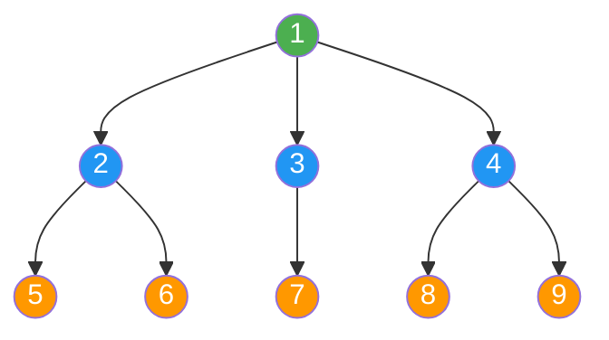
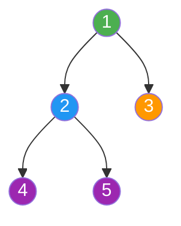
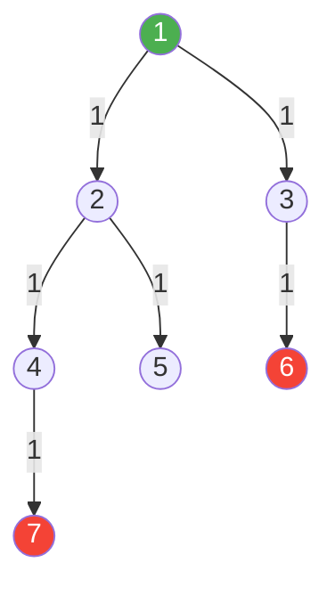
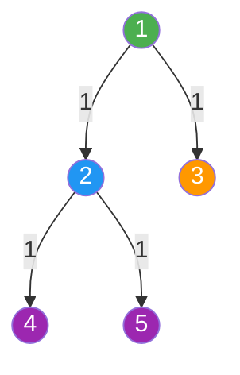
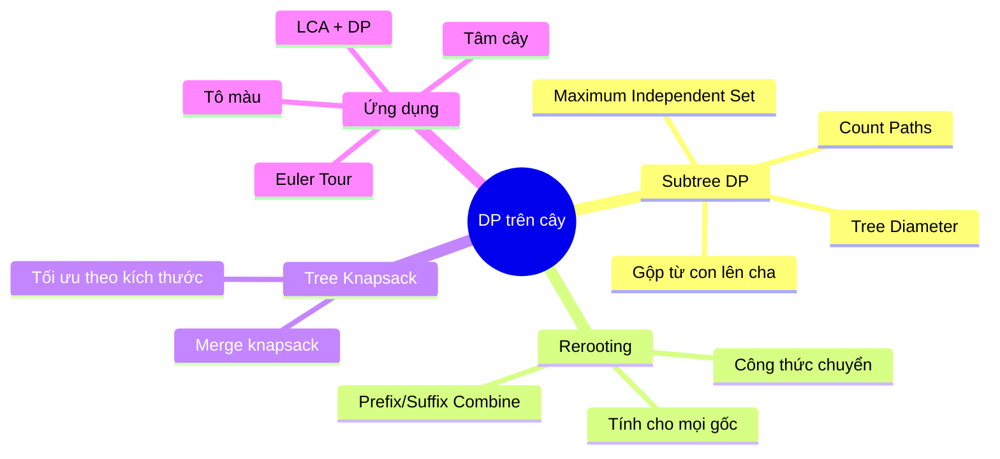

# Bài 47: DP trên cây - Quy hoạch động trên cây!

> **Tác giả:** FPTOJ Wiki<br>
> **Nội dung tham khảo từ:** CP-Algorithms, USACO Guide

---

## Bạn sẽ học được gì?
- Subtree DP (gộp thông tin từ con lên cha)
- Rerooting DP (tính đáp án cho mọi đỉnh làm gốc)
- Các bài toán DP trên cây kinh điển
- Tree Knapsack (cây balo)

---

## 1. Giới thiệu

Nhiều bài toán trên cây có thể giải bằng quy hoạch động. Ý tưởng cốt lõi: **xử lý các đỉnh con trước, sau đó gộp kết quả lên đỉnh cha**.

Trên cây, ta có cấu trúc đệ quy tự nhiên — mỗi đỉnh là gốc của một cây con (subtree). Điều này khiến DP trên cây trở thành mở rộng tự nhiên của DP tuyến tính.

### Hướng tiếp cận cơ bản

```
DFS(u):
    for each child v of u:
        DFS(v)
        combine dp[v] into dp[u]
```

### Minh họa cây



**Thứ tự DFS:** `1 → 2 → 5 → 6 → 3 → 7 → 4 → 8 → 9`

Thông tin được gộp từ lá lên gốc: `5,6 → 2`, `7 → 3`, `8,9 → 4`, rồi `2,3,4 → 1`.

---

## 2. Subtree DP (Bottom-up)

### Mẫu bài toán

Cho cây N đỉnh. Với mỗi đỉnh u, tính `dp[u]` = một giá trị nào đó liên quan đến cây con gốc u.

### Công thức tổng quát

```
dp[u] = combine(dp[v1], dp[v2], ..., dp[vk])    // v1..vk là con của u
```

### Bước thực hiện

1. Khởi tạo `dp[u]` cho đỉnh lá
2. Gọi DFS đệ quy cho mọi con
3. Gộp `dp[con]` vào `dp[u]`

---

### Ví dụ 1: Tập độc lập lớn nhất trên cây (Maximum Independent Set)

**Bài toán:** Chọn tập đỉnh lớn nhất sao cho không có hai đỉnh nào kề nhau.

**Ý tưởng DP:**
- `dp[u][0]` = đáp án lớn nhất trong cây con u, **không chọn** u
- `dp[u][1]` = đáp án lớn nhất trong cây con u, **chọn** u

**Công thức chuyển:**

```
dp[u][0] = sum(max(dp[v][0], dp[v][1]))       // không chọn u → con được chọn hoặc không
dp[u][1] = 1 + sum(dp[v][0])                   // chọn u → con KHÔNG được chọn
```

### Minh họa



**Truy vết trên cây ví dụ:**

| Đỉnh | dp[u][0] (không chọn) | dp[u][1] (chọn) | Ghi chú |
|------|----------------------|-----------------|---------|
| 4 (lá) | 0 | 1 | Giá trị khởi tạo |
| 5 (lá) | 0 | 1 | Giá trị khởi tạo |
| 2 | max(0,1) + max(0,1) = 2 | 1 + 0 + 0 = 1 | Không chọn 2 tốt hơn |
| 3 (lá) | 0 | 1 | Giá trị khởi tạo |
| 1 | max(2,1) + max(0,1) = 3 | 1 + 2 + 0 = 3 | Kết quả = max(3,3) = 3 |

**Đáp án:** Chọn đỉnh {2, 3} hoặc {1, 4, 5}, cả hai đều đạt 3.

=== "C++"

    ```cpp
    #include <bits/stdc++.h>
    using namespace std;

    const int MAXN = 1e5 + 5;
    vector<int> adj[MAXN];
    long long dp[MAXN][2]; // dp[u][0] = không chọn u, dp[u][1] = chọn u

    void dfs(int u, int parent) {
        dp[u][0] = 0;
        dp[u][1] = 1; // chọn u

        for (int v : adj[u]) {
            if (v == parent) continue;
            dfs(v, u);
            dp[u][0] += max(dp[v][0], dp[v][1]);
            dp[u][1] += dp[v][0];
        }
    }

    int main() {
        ios_base::sync_with_stdio(false);
        cin.tie(nullptr);

        int n;
        cin >> n;

        for (int i = 0; i < n - 1; i++) {
            int u, v;
            cin >> u >> v;
            adj[u].push_back(v);
            adj[v].push_back(u);
        }

        dfs(1, 0);
        cout << max(dp[1][0], dp[1][1]) << "\n";

        return 0;
    }
    ```

=== "Python"

    ```python
    import sys
    sys.setrecursionlimit(300000)

    def dfs(u, parent):
        dp[u][0] = 0      # không chọn u
        dp[u][1] = 1       # chọn u

        for v in adj[u]:
            if v == parent:
                continue
            dfs(v, u)
            dp[u][0] += max(dp[v][0], dp[v][1])
            dp[u][1] += dp[v][0]

    n = int(input())
    adj = [[] for _ in range(n + 1)]

    for _ in range(n - 1):
        u, v = map(int, input().split())
        adj[u].append(v)
        adj[v].append(u)

    dp = [[0, 0] for _ in range(n + 1)]
    dfs(1, 0)
    print(max(dp[1][0], dp[1][1]))
    ```

**Độ phức tạp:** O(N)

---

## 3. Ví dụ 2: Đường kính cây (Tree Diameter)

**Bài toán:** Tìm đường đi dài nhất giữa hai đỉnh bất kỳ trong cây (tính bằng số cạnh).

**Ý tưởng DP:**
- `dp[u]` = độ dài đường đi dài nhất bắt đầu từ u và đi xuống trong cây con u
- Tại mỗi đỉnh, kết hợp 2 nhánh dài nhất từ các con

**Công thức:**

```
dp[u] = max(dp[v] + 1) với v là con của u
```

Đường kính qua u = (nhánh dài nhất) + (nhánh dài thứ hai).

### Minh họa



**Truy vết:**

| Đỉnh | dp[u] | Top-2 nhánh | Đường kính qua u |
|------|-------|-------------|-----------------|
| 7 (lá) | 0 | [0, 0] | 0 |
| 6 (lá) | 0 | [0, 0] | 0 |
| 5 (lá) | 0 | [0, 0] | 0 |
| 4 | 1 (từ 7) | [1, 0] | 1 |
| 2 | max(1,0)+1 = 2 | [2, 1] → từ con 4→1, con 5→0 | 2+1 = 3 |
| 3 | 1 (từ 6) | [1, 0] | 1 |
| 1 | max(2,1)+1 = 3 | [3, 2] → từ con 2→2, con 3→1 | 3+2 = 5 |

**Đường kính = 5** (tuyến 6→3→1→2→4→7)

=== "C++"

    ```cpp
    #include <bits/stdc++.h>
    using namespace std;

    const int MAXN = 2e5 + 5;
    vector<int> adj[MAXN];
    int dp[MAXN]; // dp[u] = đường dài nhất từ u đi xuống
    int diameter = 0;

    void dfs(int u, int parent) {
        dp[u] = 0;
        int best1 = 0, best2 = 0; // 2 nhánh dài nhất

        for (int v : adj[u]) {
            if (v == parent) continue;
            dfs(v, u);
            int len = dp[v] + 1;

            // Cập nhật 2 nhánh dài nhất
            if (len >= best1) {
                best2 = best1;
                best1 = len;
            } else if (len > best2) {
                best2 = len;
            }

            dp[u] = max(dp[u], len);
        }

        // Đường kính đi qua u = best1 + best2
        diameter = max(diameter, best1 + best2);
    }

    int main() {
        ios_base::sync_with_stdio(false);
        cin.tie(nullptr);

        int n;
        cin >> n;

        for (int i = 0; i < n - 1; i++) {
            int u, v;
            cin >> u >> v;
            adj[u].push_back(v);
            adj[v].push_back(u);
        }

        dfs(1, 0);
        cout << diameter << "\n";

        return 0;
    }
    ```

=== "Python"

    ```python
    import sys
    sys.setrecursionlimit(300000)

    def dfs(u, parent):
        global diameter
        dp[u] = 0
        best1, best2 = 0, 0

        for v in adj[u]:
            if v == parent:
                continue
            dfs(v, u)
            length = dp[v] + 1

            if length >= best1:
                best2 = best1
                best1 = length
            elif length > best2:
                best2 = length

            dp[u] = max(dp[u], length)

        diameter = max(diameter, best1 + best2)

    n = int(input())
    adj = [[] for _ in range(n + 1)]
    dp = [0] * (n + 1)
    diameter = 0

    for _ in range(n - 1):
        u, v = map(int, input().split())
        adj[u].append(v)
        adj[v].append(u)

    dfs(1, 0)
    print(diameter)
    ```

**Độ phức tạp:** O(N)

---

## 4. Ví dụ 3: Đếm số đường đi trong cây con

**Bài toán:** Với mỗi đỉnh u, đếm số đường đi hoàn toàn nằm trong cây con của u.

**Ý tưởng:**
- `sz[u]` = số đỉnh trong cây con u
- `dp[u]` = số đường đi trong cây con u

**Công thức:**

```
sz[u]  = 1 + sum(sz[v])
dp[u]  = sum(dp[v]) + C(sz[u], 2)
```

Trong đó `C(sz[u], 2) = sz[u] * (sz[u] - 1) / 2` là số cách chọn 2 đỉnh trong cây con u. Thực tế, ta cần trừ đi các cặp không tạo đường đi hoàn toàn trong subtree, nhưng trên cây mọi cặp đỉnh đều tạo đúng 1 đường đi, nên công thức trên đúng nếu tính cả đường đi dài 0.

Tuy nhiên, cách đúng hơn là đếm số cặp đỉnh trong cùng subtree con, rồi cộng thêm đường đi qua u:

```
dp[u] = sum(dp[v]) + sum(sz[v] * (sz[u] - 1 - sz[v])) / 2 + sum(sz[v])
```

Cách đơn giản hơn — đếm số cặp đỉnh `(a, b)` sao cho cả a, b đều nằm trong cây con u:

```
total_pairs = C(sz[u], 2)
dp[u] = sum(dp[v]) + (số cặp đỉnh mà LCA là u)
```

Số cặp có LCA là u = `sum(sz[v] * (tổng_sz_các_con_trước_v + ... ))`.

Để đơn giản, ta chỉ cần tính `dp[u] = sum(dp[v])` cho đường đi hoàn toàn nằm trong subtree con, rồi cộng thêm đường đi có một đầu tại u:

```
Đường đi trong subtree u = sum(dp[v]) + sum(sz[v])
```

Vì mỗi đỉnh v trong subtree con tạo 1 đường đi (u, v), và tổng đường đi hoàn toàn trong subtree con đã tính ở `dp[v]`.

=== "C++"

    ```cpp
    #include <bits/stdc++.h>
    using namespace std;

    const int MAXN = 2e5 + 5;
    vector<int> adj[MAXN];
    long long sz[MAXN];   // kích thước subtree
    long long dp[MAXN];   // số đường đi trong subtree

    void dfs(int u, int parent) {
        sz[u] = 1;
        dp[u] = 0;

        for (int v : adj[u]) {
            if (v == parent) continue;
            dfs(v, u);
            sz[u] += sz[v];
            dp[u] += dp[v];
        }

        // Đường đi có 1 đầu là u: sz[u] - 1 đường
        // Đường đi hoàn toàn trong subtree con: đã tính trong dp[v]
        dp[u] += sz[u] - 1;
    }

    int main() {
        ios_base::sync_with_stdio(false);
        cin.tie(nullptr);

        int n;
        cin >> n;

        for (int i = 0; i < n - 1; i++) {
            int u, v;
            cin >> u >> v;
            adj[u].push_back(v);
            adj[v].push_back(u);
        }

        dfs(1, 0);
        cout << dp[1] << "\n";

        return 0;
    }
    ```

=== "Python"

    ```python
    import sys
    sys.setrecursionlimit(300000)

    def dfs(u, parent):
        sz[u] = 1
        dp[u] = 0

        for v in adj[u]:
            if v == parent:
                continue
            dfs(v, u)
            sz[u] += sz[v]
            dp[u] += dp[v]

        dp[u] += sz[u] - 1

    n = int(input())
    adj = [[] for _ in range(n + 1)]
    sz = [0] * (n + 1)
    dp = [0] * (n + 1)

    for _ in range(n - 1):
        u, v = map(int, input().split())
        adj[u].append(v)
        adj[v].append(u)

    dfs(1, 0)
    print(dp[1])
    ```

**Độ phức tạp:** O(N)

---

## 5. Rerooting DP (Đổi gốc)

### Ý tưởng

Thông thường, ta chỉ tính `dp[u]` cho một gốc cố định. **Rerooting** cho phép tính đáp án cho **mọi đỉnh làm gốc** trong O(N).

### Kỹ thuật

1. Chọn bất kỳ gốc (thường là 1), tính `dp_down[u]` bằng DFS bottom-up
2. Tính `dp_up[u]` bằng DFS top-down — khi "di chuyển gốc" từ cha u sang con v, cập nhật đáp án

### Công thức chuyển gốc

Khi di chuyển gốc từ u sang v:
- Loại bỏ đóng góp của v khỏi u
- Thêm đóng góp của u (không bao gồm v) vào v

```
new_dp[v] = combine(dp[v], remove_contribution(dp[u], dp[v]))
```

### Ví dụ: Tổng khoảng cách từ mọi đỉnh

**Bài toán:** Với mỗi đỉnh u, tính tổng khoảng cách từ u đến tất cả đỉnh khác trong cây.

**Ý tưởng:**
- `subtree_size[v]` = số đỉnh trong cây con v
- `dist_sum[u]` = tổng khoảng cách từ u đến mọi đỉnh

**Bước 1 (down):** Tính `dist_sum[root]` bằng DFS

```
dist_sum[u] = sum(dist_sum[v] + subtree_size[v])   cho mọi con v
```

**Bước 2 (up):** Khi di chuyển gốc từ u sang v:
- Các đỉnh trong subtree v gần hơn 1 đơn vị → trừ `subtree_size[v]`
- Các đỉnh ngoài subtree v xa hơn 1 đơn vị → cộng `n - subtree_size[v]`

```
dist_sum[v] = dist_sum[u] - subtree_size[v] + (n - subtree_size[v])
           = dist_sum[u] + n - 2 * subtree_size[v]
```

### Minh họa



**Bước 1 — Tính subtree_size và dist_sum[1]:**

| Đỉnh | subtree_size | dist_sum (từ gốc 1) |
|------|-------------|---------------------|
| 4 | 1 | - |
| 5 | 1 | - |
| 2 | 3 | (0+1) + (0+1) + (0) = 2 |
| 3 | 1 | 0 |
| 1 | 5 | (2+3) + (0+1) = 6 |

**Bước 2 — Reroot:**

```
dist_sum[2] = dist_sum[1] + n - 2*subtree_size[2]
            = 6 + 5 - 2*3 = 5

dist_sum[3] = dist_sum[1] + n - 2*subtree_size[3]
            = 6 + 5 - 2*1 = 9

dist_sum[4] = dist_sum[2] + n - 2*subtree_size[4]
            = 5 + 5 - 2*1 = 8

dist_sum[5] = dist_sum[2] + n - 2*subtree_size[5]
            = 5 + 5 - 2*1 = 8
```

**Kết quả:** dist_sum = [6, 5, 9, 8, 8] cho đỉnh [1, 2, 3, 4, 5]

=== "C++"

    ```cpp
    #include <bits/stdc++.h>
    using namespace std;

    const int MAXN = 2e5 + 5;
    vector<int> adj[MAXN];
    int subtree_size[MAXN];
    long long dist_sum[MAXN];
    int n;

    // Bước 1: Tính subtree_size và dist_sum[root]
    void dfs1(int u, int parent) {
        subtree_size[u] = 1;
        dist_sum[u] = 0;

        for (int v : adj[u]) {
            if (v == parent) continue;
            dfs1(v, u);
            subtree_size[u] += subtree_size[v];
            dist_sum[u] += dist_sum[v] + subtree_size[v];
        }
    }

    // Bước 2: Reroot — tính dist_sum cho mọi đỉnh
    void dfs2(int u, int parent) {
        for (int v : adj[u]) {
            if (v == parent) continue;

            // Di chuyển gốc từ u sang v
            dist_sum[v] = dist_sum[u] + (n - subtree_size[v]) - subtree_size[v];
            dfs2(v, u);
        }
    }

    int main() {
        ios_base::sync_with_stdio(false);
        cin.tie(nullptr);

        cin >> n;

        for (int i = 0; i < n - 1; i++) {
            int u, v;
            cin >> u >> v;
            adj[u].push_back(v);
            adj[v].push_back(u);
        }

        dfs1(1, 0);
        dfs2(1, 0);

        for (int i = 1; i <= n; i++) {
            cout << dist_sum[i] << " \n"[i == n];
        }

        return 0;
    }
    ```

=== "Python"

    ```python
    import sys
    sys.setrecursionlimit(300000)

    def dfs1(u, parent):
        subtree_size[u] = 1
        dist_sum[u] = 0

        for v in adj[u]:
            if v == parent:
                continue
            dfs1(v, u)
            subtree_size[u] += subtree_size[v]
            dist_sum[u] += dist_sum[v] + subtree_size[v]

    def dfs2(u, parent):
        for v in adj[u]:
            if v == parent:
                continue
            dist_sum[v] = dist_sum[u] + (n - subtree_size[v]) - subtree_size[v]
            dfs2(v, u)

    n = int(input())
    adj = [[] for _ in range(n + 1)]
    subtree_size = [0] * (n + 1)
    dist_sum = [0] * (n + 1)

    for _ in range(n - 1):
        u, v = map(int, input().split())
        adj[u].append(v)
        adj[v].append(u)

    dfs1(1, 0)
    dfs2(1, 0)

    print(*dist_sum[1:])
    ```

**Độ phức tạp:** O(N) — mỗi cạnh được duyệt đúng 2 lần.

### Rerooting tổng quát

Không phải bài nào cũng có công thức đơn giản như trên. Khi hàm combine phức tạp hơn, ta cần lưu thêm thông tin "prefix/suffix" để loại bỏ đóng góp của một con cụ thể:

```cpp
// Tính prefix và suffix combine
prefix[0] = identity;
for (int i = 0; i < children.size(); i++)
    prefix[i+1] = combine(prefix[i], dp[children[i]]);

suffix[children.size()] = identity;
for (int i = children.size()-1; i >= 0; i--)
    suffix[i] = combine(dp[children[i]], suffix[i+1]);

// Khi reroot từ u sang children[i]:
// dp_without_child = combine(prefix[i], suffix[i+1])
// new_dp[child] = combine(dp[child], dp_without_child + contribution_from_parent)
```

---

## 6. DP trên cây với Knapsack (Tree Knapsack)

### Bài toán

Cho cây N đỉnh, mỗi đỉnh có trọng lượng `w[u]` và giá trị `val[u]`. Chọn một tập đỉnh sao cho:
- Không có hai đỉnh kề nhau đều được chọn (tùy bài)
- Tổng trọng lượng ≤ K
- Tổng giá trị lớn nhất

### Công thức

`dp[u][j]` = giá trị lớn nhất trong cây con u với dung lượng j.

Khi gộp con v vào u (knapsack merge):

```
for j = K down to 0:
    for k = 0 to j:
        dp[u][j] = max(dp[u][j], dp[u][j-k] + dp[v][k])
```

**Lưu ý quan trọng:** Duyệt j từ K xuống 0 để tránh dùng một con nhiều lần.

### Độ phức tạp

Merge knapsack giữa u và v: O(K²) nếu làm trực tiếp. Tuy nhiên, nếu gộp theo kích thước subtree (nhỏ vào lớn), tổng độ phức tạp là O(N*K).

=== "C++"

    ```cpp
    #include <bits/stdc++.h>
    using namespace std;

    const int MAXN = 105;
    const int MAXK = 1005;
    vector<int> adj[MAXN];
    int w[MAXN], val[MAXN];
    int dp[MAXN][MAXK]; // dp[u][k] = giá trị lớn nhất, subtree u, dung lượng k
    int n, K;

    void dfs(int u, int parent) {
        // Khởi tạo: chọn u
        for (int j = 0; j <= K; j++) {
            dp[u][j] = (j >= w[u]) ? val[u] : 0;
        }

        for (int v : adj[u]) {
            if (v == parent) continue;
            dfs(v, u);

            // Gộp knapsack: merge dp[v] vào dp[u]
            // Duyệt ngược để không dùng dp[v] nhiều lần
            for (int j = K; j >= 0; j--) {
                for (int k = 0; k <= j; k++) {
                    dp[u][j] = max(dp[u][j], dp[u][j - k] + dp[v][k]);
                }
            }
        }
    }

    int main() {
        ios_base::sync_with_stdio(false);
        cin.tie(nullptr);

        cin >> n >> K;

        for (int i = 1; i <= n; i++) {
            cin >> w[i] >> val[i];
        }

        for (int i = 0; i < n - 1; i++) {
            int u, v;
            cin >> u >> v;
            adj[u].push_back(v);
            adj[v].push_back(u);
        }

        memset(dp, 0, sizeof(dp));
        dfs(1, 0);

        int ans = 0;
        for (int j = 0; j <= K; j++) {
            ans = max(ans, dp[1][j]);
        }
        cout << ans << "\n";

        return 0;
    }
    ```

=== "Python"

    ```python
    import sys
    sys.setrecursionlimit(300000)

    def dfs(u, parent):
        # Khởi tạo: chọn u
        for j in range(K + 1):
            dp[u][j] = val[u] if j >= w[u] else 0

        for v in adj[u]:
            if v == parent:
                continue
            dfs(v, u)

            # Gộp knapsack
            for j in range(K, -1, -1):
                for k in range(j + 1):
                    dp[u][j] = max(dp[u][j], dp[u][j - k] + dp[v][k])

    n, K = map(int, input().split())
    adj = [[] for _ in range(n + 1)]
    w = [0] * (n + 1)
    val = [0] * (n + 1)

    for i in range(1, n + 1):
        w[i], val[i] = map(int, input().split())

    for _ in range(n - 1):
        u, v = map(int, input().split())
        adj[u].append(v)
        adj[v].append(u)

    dp = [[0] * (K + 1) for _ in range(n + 1)]
    dfs(1, 0)
    print(max(dp[1]))
    ```

**Độ phức tạp:** O(N * K²) — có thể tối ưu thành O(N * K) bằng kỹ thuật merge theo kích thước.

### Tối ưu: Merge theo kích thước subtree

```cpp
void dfs(int u, int parent) {
    int sz = 1;
    // Khởi tạo dp[u] chỉ với đỉnh u
    for (int j = 0; j <= K; j++)
        dp[u][j] = (j >= w[u]) ? val[u] : 0;

    for (int v : adj[u]) {
        if (v == parent) continue;
        dfs(v, u);

        // Merge dp[v] vào dp[u], chỉ duyệt đến min(sz + subtree_size[v], K)
        for (int j = min(K, sz + subtree_size[v]); j >= 0; j--) {
            for (int k = max(0, j - sz); k <= min(j, subtree_size[v]); k++) {
                dp[u][j] = max(dp[u][j], dp[u][j - k] + dp[v][k]);
            }
        }
        sz += subtree_size[v];
    }
    subtree_size[u] = sz;
}
```

---

## 7. Ứng dụng thực tế

### 7.1. Tìm tâm cây (Tree Center)

Tâm cây là đỉnh (hoặc 2 đỉnh) có khoảng cách xa nhất đến lá là nhỏ nhất. Có thể tìm bằng cách loại bỏ lá dần dần.

```cpp
// Tìm tâm cây bằng cách loại lá
vector<int> tree_center() {
    vector<int> deg(n + 1);
    queue<int> leaves;
    int remaining = n;

    for (int i = 1; i <= n; i++) {
        deg[i] = adj[i].size();
        if (deg[i] <= 1) {
            leaves.push(i);
        }
    }

    while (remaining > 2) {
        int sz = leaves.size();
        remaining -= sz;
        for (int i = 0; i < sz; i++) {
            int u = leaves.front(); leaves.pop();
            for (int v : adj[u]) {
                if (--deg[v] == 1) {
                    leaves.push(v);
                }
            }
        }
    }

    vector<int> centers;
    while (!leaves.empty()) {
        centers.push_back(leaves.front());
        leaves.pop();
    }
    return centers;
}
```

### 7.2. Tô màu cây (Tree Coloring)

Số cách tô màu cây với K màu sao cho hai đỉnh kề nhau khác màu:

```
dp[u] = (K-1) * product(dp[v]) cho mọi con v    // đỉnh u có K-1 lựa chọn (trừ màu cha)
```

Đặc biệt, gốc có K lựa chọn:

```
answer = K * (K-1)^(n-1)    // cây là đồ thị hai phía
```

### 7.3. LCA + DP (Lowest Common Ancestor)

Kết hợp LCA để trả lời truy vấn khoảng cách giữa 2 đỉnh:

```
dist(u, v) = depth[u] + depth[v] - 2 * depth[LCA(u, v)]
```

### 7.4. Euler Tour + Subtree Queries

Dùng Euler Tour để biến subtree query thành range query trên mảng, kết hợp với Segment Tree hoặc BIT.

```cpp
int timer = 0;
int tin[MAXN], tout[MAXN];

void euler_tour(int u, int parent) {
    tin[u] = ++timer;
    for (int v : adj[u]) {
        if (v == parent) continue;
        euler_tour(v, u);
    }
    tout[u] = timer;
}

// Subtree u nằm trong đoạn [tin[u], tout[u]]
// → dùng Segment Tree / BIT để truy vấn
```

---

## 8. Lưu ý và Cạm bẫy

### ⚠️ Stack Overflow

Với cây sâu (N > 10⁴), đệ quy DFS có thể tràn stack. Giải pháp:

```cpp
// C++: Tăng kích thước stack
// Biên dịch với: g++ -Wl,-stack,268435456 main.cpp

// Hoặc dùng DFS iterative (stack)
void dfs_iterative(int root) {
    stack<pair<int, int>> st;
    st.push({root, 0});

    while (!st.empty()) {
        auto [u, parent] = st.top();
        // Xử lý u...
        st.pop();
        for (int v : adj[u]) {
            if (v == parent) continue;
            st.push({v, u});
        }
    }
}
```

```python
# Python: Tăng giới hạn đệ quy
import sys
sys.setrecursionlimit(300000)
```

### ⚠️ Quên xử lý đỉnh lá

Đỉnh lá là base case. Luôn khởi tạo `dp[u]` trước khi duyệt con:

```cpp
// SAI: quên khởi tạo
void dfs(int u, int p) {
    for (int v : adj[u]) {
        if (v == p) continue;
        dfs(v, u);
        dp[u] += dp[v]; // dp[u] chưa được khởi tạo!
    }
}

// ĐÚNG
void dfs(int u, int p) {
    dp[u] = base_value; // khởi tạo!
    for (int v : adj[u]) {
        if (v == p) continue;
        dfs(v, u);
        dp[u] += dp[v];
    }
}
```

### ⚠️ Rerooting sai hướng chuyển

Khi reroot từ u sang v, phải loại bỏ đóng góp của v khỏi u trước, rồi mới thêm vào v:

```cpp
// SAI: dùng dp[u] cũ (vẫn chứa đóng góp của v)
dp[v] = dp[u] + n - 2 * subtree_size[v];

// ĐÚNG: dp[u] đã được tính mà không chứa reroot từ cha
// (trong ví dụ đơn giản, công thức vẫn đúng vì ta dùng dp[u] đã tính ở bước 1)
// Nhưng với hàm combine phức tạp, cần tính lại dp[u]_without_v
```

### ⚠️ Merge Knapsack sai thứ tự

```cpp
// SAI: duyệt xuôi → dùng dp[v] nhiều lần
for (int j = 0; j <= K; j++)
    for (int k = 0; k <= j; k++)
        dp[u][j] = max(dp[u][j], dp[u][j-k] + dp[v][k]);

// ĐÚNG: duyệt ngược
for (int j = K; j >= 0; j--)
    for (int k = 0; k <= j; k++)
        dp[u][j] = max(dp[u][j], dp[u][j-k] + dp[v][k]);
```

### ⚠️ Đồ thị có hướng vs vô hướng

Trên cây, cạnh là vô hướng. Luôn truyền `parent` để không duyệt ngược lại:

```cpp
dfs(v, u);  // u là parent của v
```

---

## 9. Bài tập luyện tập

| STT | Bài toán | Nguồn | Độ khó | Chủ đề |
|-----|----------|-------|--------|--------|
| 1 | [Tree Diameter](https://cses.fi/problemset/task/1131) | CSES | ★★☆ | Đường kính cây |
| 2 | [Tree Distances I](https://cses.fi/problemset/task/1132) | CSES | ★★★ | Rerooting |
| 3 | [Tree Distances II](https://cses.fi/problemset/task/1133) | CSES | ★★★ | Rerooting (tổng khoảng cách) |
| 4 | [Company Queries I](https://cses.fi/problemset/task/1687) | CSES | ★★☆ | Binary Lifting |
| 5 | [Company Queries II](https://cses.fi/problemset/task/1688) | CSES | ★★★ | LCA |
| 6 | [Tree Matching](https://cses.fi/problemset/task/1130) | CSES | ★★★ | DP trên cây |
| 7 | [Counting Paths](https://cses.fi/problemset/task/1136) | CSES | ★★★ | Tree DP + LCA |
| 8 | [Tree Isomorphism](https://cses.fi/problemset/task/1700) | CSES | ★★★ | Tree DP + Hash |
| 9 | [Tree Cutting](https://codeforces.com/problemset/problem/1118/F2) | CF | ★★★★ | DP trên cây |
| 10 | [Sonya and Problem Without a Legend](https://codeforces.com/problemset/problem/713/C) | CF | ★★★★ | DP + cây |
| 11 | [Apple Tree](https://codeforces.com/problemset/problem/1843/E) | CF | ★★★ | Subtree DP |
| 12 | [Tree Painting](https://codeforces.com/problemset/problem/1187/E) | CF | ★★★★ | Rerooting |
| 13 | [Digit Tree](https://codeforces.com/problemset/problem/716/E) | CF | ★★★★★ | Rerooting + Hash |

### Gợi ý tiếp cận

- **Bài 1-3 (CSES):** Bắt đầu với rerooting cơ bản. Bài 2 và 3 là ví dụ kinh điển.
- **Bài 6-7 (CSES):** Thực hành subtree DP.
- **Bài 9, 12 (CF):** Rerooting với hàm combine phức tạp hơn.
- **Bài 13 (CF):** Rerooting kết hợp modular inverse và hash.

---

## Tóm tắt



| Kỹ thuật | Độ phức tạp | Khi nào dùng |
|----------|-------------|---------------|
| Subtree DP | O(N) | Cần thông tin từ cây con |
| Rerooting | O(N) | Cần đáp án cho mọi đỉnh làm gốc |
| Tree Knapsack | O(N·K²) / O(N·K) | Chọn đỉnh với ràng buộc trọng lượng |

**Chìa khóa:** Luôn xác định rõ `dp[u]` biểu diễn gì, cách gộp từ con, và base case ở đỉnh lá. Rerooting là kỹ thuật mạnh khi cần đáp án cho mọi gốc — hãy luyện tập nhiều bài để nắm vững.
