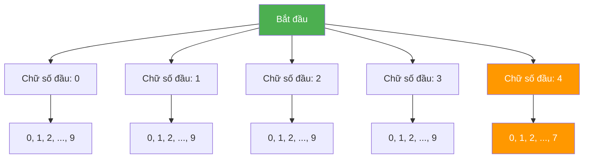

# Bài 48: Digit DP - Đếm số theo chữ số!

> **Tác giả:** FPTOJ Wiki<br>
> **Nội dung tham khảo từ:** CP-Algorithms, USACO Guide

---

## Bạn sẽ học được gì?
- Digit DP là gì và khi nào dùng
- Template Digit DP cơ bản
- Các dạng bài thường gặp: đếm số có tổng chữ số = K, đếm số không chứa digit nào, etc.

---

## 1. Giới thiệu

### Bài toán kinh điển

> **Cho số N. Đếm xem có bao nhiêu số từ 0 đến N thỏa mãn một điều kiện nào đó.**

Ví dụ: Cho N = 47, đếm bao nhiêu số trong [0, 47] có **tổng chữ số chẵn**.

**Cách naïve:** Duyệt từng số từ 0 đến N, kiểm tra điều kiện → **O(N)**.

Khi N = 10^18, O(N) quá chậm (10^18 phép tính → không thể chạy trong 1 giây).

**Digit DP:** Xây dựng số từng chữ số một, từ trái sang phải → **O(log₁₀(N) × states)**.

Khi N = 10^18, log₁₀(N) ≈ 18 chữ số, rất nhỏ!

### Ẩn dụ: Cây lựa chọn chữ số

Mỗi số có thể biểu diễn như một đường đi từ gốc đến lá trong cây:



**Nhận xét:** Khi N = 47, chữ số đầu tiên chỉ được chọn từ 0–4. Nếu chọn 4, chữ số thứ hai chỉ được 0–7. Nếu chọn < 4, chữ số thứ hai được 0–9 thoải mái.

Đây chính là ý tưởng của **tight constraint** (ràng buộc chặt).

---

## 2. Core Idea - Ý tưởng cốt lõi

### State của Digit DP

Khi xây dựng số từ trái sang phải, ta cần theo dõi:

| State | Ý nghĩa |
|-------|----------|
| `pos` | Vị trí chữ số hiện tại (0 = chữ số quan trọng nhất) |
| `tight` | Chữ số đã chọn có bằng đúng prefix của N không? |
| `leading_zero` | Có đang ở phần leading zeros không? |
| `...` | Các state khác tùy bài (tổng, chữ số trước, bitmask, ...) |

### Giải thích `tight`

- `tight = 1` (true): Các chữ số đã chọn **bằng đúng** prefix của N. Chữ số tiếp theo **bị giới hạn** bởi chữ số tương ứng của N.
- `tight = 0` (false): Các chữ số đã chọn **nhỏ hơn** prefix của N. Chữ số tiếp theo được chọn **tự do** (0–9).

### Quá trình chuyển state

```
Gọi hàm solve(pos, tight, ...):
  Nếu pos == len(N): return 1 (tìm được 1 số hợp lệ)

  limit = tight ? digits[pos] : 9
  result = 0
  Cho d từ 0 đến limit:
    new_tight = tight && (d == limit)
    result += solve(pos + 1, new_tight, ...)

  return result
```

### Ví dụ minh họa với N = 47

Xây dựng 2 chữ số: pos = 0 (chục), pos = 1 (đơn vị).

```
solve(0, tight=1)
├── d = 0: tight=0, solve(1, tight=0) → d2: 0..9 → 10 số
├── d = 1: tight=0, solve(1, tight=0) → d2: 0..9 → 10 số
├── d = 2: tight=0, solve(1, tight=0) → d2: 0..9 → 10 số
├── d = 3: tight=0, solve(1, tight=0) → d2: 0..9 → 10 số
└── d = 4: tight=1, solve(1, tight=1)
    ├── d2 = 0: 1 số (40)
    ├── d2 = 1: 1 số (41)
    ├── ...
    └── d2 = 7: 1 số (47)
    → 8 số

Tổng = 10 + 10 + 10 + 10 + 8 = 48 số (từ 0 đến 47)
```

### Khi nào dùng Digit DP?

- Đếm số trong [0, N] hoặc [L, R] thỏa mãn điều kiện liên quan đến **chữ số**
- N rất lớn (10^18), không thể duyệt
- Điều kiện có thể biểu diễn qua state nhỏ

---

## 3. Template: Đếm số trong khoảng [0, N] thỏa mãn điều kiện

### Template chung (C++)

```cpp
#include <bits/stdc++.h>
using namespace std;

using ll = long long;

string s;           // N dưới dạng string
int n;              // số chữ số
ll dp[20][2][...];  // memoization, thêm dimensions tùy bài

ll solve(int pos, bool tight, ...) {
    if (pos == n) {
        // Kiểm tra điều kiện cuối cùng
        return 1;  // hoặc 0 tùy bài
    }

    ll &res = dp[pos][tight][...];
    if (res != -1 && !tight) return res;  // chỉ memoize khi tight=0

    int limit = tight ? (s[pos] - '0') : 9;
    ll ans = 0;

    for (int d = 0; d <= limit; d++) {
        bool new_tight = tight && (d == limit);
        // Cập nhật state khác tùy bài
        ans += solve(pos + 1, new_tight, ...);
    }

    if (!tight) res = ans;
    return ans;
}

int main() {
    ll N;
    cin >> N;
    s = to_string(N);
    n = s.size();
    memset(dp, -1, sizeof(dp));
    cout << solve(0, true, ...) << endl;
    return 0;
}
```

### Template chung (Python)

```python
import sys
from functools import lru_cache

sys.setrecursionlimit(10000)

def digit_dp(N, ...):
    s = str(N)
    n = len(s)

    @lru_cache(maxsize=None)
    def solve(pos, tight, ...):
        if pos == n:
            # Kiểm tra điều kiện cuối cùng
            return 1  # hoặc 0 tùy bài

        limit = int(s[pos]) if tight else 9
        ans = 0

        for d in range(0, limit + 1):
            new_tight = tight and (d == limit)
            # Cập nhật state khác tùy bài
            ans += solve(pos + 1, new_tight, ...)

        return ans

    return solve(0, True, ...)
```

> **Lưu ý quan trọng:** Trong C++, chỉ memoize kết quả khi `tight = false`. Khi `tight = true`, mỗi nhánh là duy nhất và không lặp lại.

### Trace chi tiết: Đếm số có tổng chữ số chẵn từ 0 đến 47

Bài toán: Đếm số x ∈ [0, 47] sao cho tổng các chữ số của x chẵn.

**State:** `dp[pos][tight][sum % 2]`

```
solve(0, tight=1, sum=0)
├── d=0: sum=0, tight=0 → solve(1, tight=0, sum=0)
│   ├── d2=0: sum=0→even → +1 (số 00=0)
│   ├── d2=1: sum=1→odd  → +0
│   ├── d2=2: sum=2→even → +1 (số 02=2)
│   ├── d2=3: sum=3→odd  → +0
│   ├── d2=4: sum=4→even → +1 (số 04=4)
│   ├── d2=5: sum=5→odd  → +0
│   ├── d2=6: sum=6→even → +1 (số 06=6)
│   ├── d2=7: sum=7→odd  → +0
│   ├── d2=8: sum=8→even → +1 (số 08=8)
│   └── d2=9: sum=9→odd  → +0
│   → trả về 5
├── d=1: sum=1, tight=0 → solve(1, tight=0, sum=1)
│   ├── d2=0: sum=1→odd  → +0
│   ├── d2=1: sum=2→even → +1 (số 11)
│   ├── d2=2: sum=3→odd  → +0
│   ├── d2=3: sum=4→even → +1 (số 13)
│   ├── d2=4: sum=5→odd  → +0
│   ├── d2=5: sum=6→even → +1 (số 15)
│   ├── d2=6: sum=7→odd  → +0
│   ├── d2=7: sum=8→even → +1 (số 17)
│   ├── d2=8: sum=9→odd  → +0
│   └── d2=9: sum=10→even → +1 (số 19)
│   → trả về 5
├── d=2: sum=0, tight=0 → solve(1, tight=0, sum=0) → 5 (memoized)
├── d=3: sum=1, tight=0 → solve(1, tight=0, sum=1) → 5 (memoized)
├── d=4: sum=0, tight=1 → solve(1, tight=1, sum=0)
│   ├── d2=0: sum=0→even → +1 (số 40)
│   ├── d2=1: sum=1→odd  → +0
│   ├── d2=2: sum=2→even → +1 (số 42)
│   ├── d2=3: sum=3→odd  → +0
│   ├── d2=4: sum=4→even → +1 (số 44)
│   ├── d2=5: sum=5→odd  → +0
│   ├── d2=6: sum=6→even → +1 (số 46)
│   └── d2=7: sum=7→odd  → +0
│   → trả về 4

Tổng = 5 + 5 + 5 + 5 + 4 = 24
```

Kiểm tra: Trong [0, 47], có 24 số có tổng chữ số chẵn. ✓

---

## 4. Ví dụ 1: Đếm số có tổng chữ số = K

> **Bài toán:** Cho N và K. Đếm xem có bao nhiêu số trong [0, N] có tổng các chữ số đúng bằng K.

**State:** `dp[pos][tight][sum]` — sum là tổng chữ số đã chọn.

### C++

```cpp
#include <bits/stdc++.h>
using namespace std;

using ll = long long;

string s;
int n, K;
ll dp[20][2][200];  // pos, tight, sum (max sum = 9*18 = 162)

ll solve(int pos, bool tight, int sum) {
    if (sum > K) return 0;  // Cắt nhánh: tổng đã vượt K
    if (pos == n) {
        return (sum == K) ? 1 : 0;
    }

    ll &res = dp[pos][tight][sum];
    if (res != -1 && !tight) return res;

    int limit = tight ? (s[pos] - '0') : 9;
    ll ans = 0;

    for (int d = 0; d <= limit; d++) {
        bool new_tight = tight && (d == limit);
        ans += solve(pos + 1, new_tight, sum + d);
    }

    if (!tight) res = ans;
    return ans;
}

int main() {
    ll N;
    cin >> N >> K;
    s = to_string(N);
    n = s.size();
    memset(dp, -1, sizeof(dp));
    cout << solve(0, true, 0) << endl;
    return 0;
}
```

### Python

```python
import sys
from functools import lru_cache

def count_digit_sum(N, K):
    s = str(N)
    n = len(s)

    @lru_cache(maxsize=None)
    def solve(pos, tight, total):
        if total > K:
            return 0
        if pos == n:
            return 1 if total == K else 0

        limit = int(s[pos]) if tight else 9
        ans = 0

        for d in range(0, limit + 1):
            new_tight = tight and (d == limit)
            ans += solve(pos + 1, new_tight, total + d)

        return ans

    return solve(0, True, 0)

N, K = map(int, input().split())
print(count_digit_sum(N, K))
```

**Độ phức tạp:** O(log₁₀(N) × 2 × 9×log₁₀(N)) ≈ O(324 × log N)

---

## 5. Ví dụ 2: Đếm số không chứa digit 4

> **Bài toán:** Cho N. Đếm xem có bao nhiêu số trong [0, N] không chứa chữ số 4.

**State:** `dp[pos][tight]` — Không cần state bổ sung vì điều kiện chỉ phụ thuộc vào chữ số hiện tại.

### C++

```cpp
#include <bits/stdc++.h>
using namespace std;

using ll = long long;

string s;
int n;
ll dp[20][2];

ll solve(int pos, bool tight) {
    if (pos == n) return 1;

    ll &res = dp[pos][tight];
    if (res != -1 && !tight) return res;

    int limit = tight ? (s[pos] - '0') : 9;
    ll ans = 0;

    for (int d = 0; d <= limit; d++) {
        if (d == 4) continue;  // Bỏ qua digit 4
        bool new_tight = tight && (d == limit);
        ans += solve(pos + 1, new_tight);
    }

    if (!tight) res = ans;
    return ans;
}

int main() {
    ll N;
    cin >> N;
    s = to_string(N);
    n = s.size();
    memset(dp, -1, sizeof(dp));
    cout << solve(0, true) << endl;
    return 0;
}
```

### Python

```python
import sys
from functools import lru_cache

def count_without_four(N):
    s = str(N)
    n = len(s)

    @lru_cache(maxsize=None)
    def solve(pos, tight):
        if pos == n:
            return 1

        limit = int(s[pos]) if tight else 9
        ans = 0

        for d in range(0, limit + 1):
            if d == 4:
                continue
            new_tight = tight and (d == limit)
            ans += solve(pos + 1, new_tight)

        return ans

    return solve(0, True)

N = int(input())
print(count_without_four(N))
```

**Giải thích:** Khi gặp `d == 4`, ta bỏ qua luôn → không đếm số nào chứa digit 4.

---

## 6. Ví dụ 3: Đếm số có chữ số không giảm

> **Bài toán:** Cho N. Đếm xem có bao nhiêu số trong [0, N] mà các chữ số từ trái sang phải **không giảm** (ví dụ: 1123, 4559, 7).

**State:** `dp[pos][tight][last_digit]` — `last_digit` là chữ số trước đó đã chọn.

### C++

```cpp
#include <bits/stdc++.h>
using namespace std;

using ll = long long;

string s;
int n;
ll dp[20][2][11];  // last_digit: 0-9, dùng 10 cho "chưa chọn chữ số nào"

ll solve(int pos, bool tight, int last_digit) {
    if (pos == n) return 1;

    ll &res = dp[pos][tight][last_digit];
    if (res != -1 && !tight) return res;

    int limit = tight ? (s[pos] - '0') : 9;
    ll ans = 0;

    for (int d = 0; d <= limit; d++) {
        if (d < last_digit) continue;  // Chữ số phải >= chữ số trước
        bool new_tight = tight && (d == limit);
        // Nếu đang leading zero (last_digit=10) và d=0, giữ last_digit=10
        int new_last = (last_digit == 10 && d == 0) ? 10 : d;
        ans += solve(pos + 1, new_tight, new_last);
    }

    if (!tight) res = ans;
    return ans;
}

int main() {
    ll N;
    cin >> N;
    s = to_string(N);
    n = s.size();
    memset(dp, -1, sizeof(dp));
    cout << solve(0, true, 10) << endl;  // 10 = chưa chọn chữ số nào
    return 0;
}
```

### Python

```python
import sys
from functools import lru_cache

def count_non_decreasing(N):
    s = str(N)
    n = len(s)

    @lru_cache(maxsize=None)
    def solve(pos, tight, last_digit):
        if pos == n:
            return 1

        limit = int(s[pos]) if tight else 9
        ans = 0

        for d in range(0, limit + 1):
            if d < last_digit:
                continue
            new_tight = tight and (d == limit)
            new_last = 10 if (last_digit == 10 and d == 0) else d
            ans += solve(pos + 1, new_tight, new_last)

        return ans

    return solve(0, True, 10)

N = int(input())
print(count_non_decreasing(N))
```

**Lưu ý:** Dùng `last_digit = 10` để biểu thị "chưa chọn chữ số nào" (toàn bộ là leading zeros). Khi đó, mọi chữ số d >= 0 đều hợp lệ.

---

## 7. Đếm số trong khoảng [L, R]

### Công thức

Đếm số thỏa mãn điều kiện trong [L, R]:

```
count(L, R) = count(0, R) - count(0, L - 1)
```

### C++

```cpp
ll count_range(ll L, ll R, ...) {
    if (L > R) return 0;
    return count_up_to(R, ...) - count_up_to(L - 1, ...);
}
```

### Python

```python
def count_range(L, R, ...):
    if L > R:
        return 0
    return count_up_to(R, ...) - count_up_to(L - 1, ...)
```

### Ví dụ đầy đủ: Đếm số có tổng chữ số chẵn trong [L, R]

```cpp
#include <bits/stdc++.h>
using namespace std;

using ll = long long;

string s;
int n;
ll dp[20][2][2];

ll solve(int pos, bool tight, int sum_mod) {
    if (pos == n) {
        return (sum_mod == 0) ? 1 : 0;
    }

    ll &res = dp[pos][tight][sum_mod];
    if (res != -1 && !tight) return res;

    int limit = tight ? (s[pos] - '0') : 9;
    ll ans = 0;

    for (int d = 0; d <= limit; d++) {
        bool new_tight = tight && (d == limit);
        ans += solve(pos + 1, new_tight, (sum_mod + d) % 2);
    }

    if (!tight) res = ans;
    return ans;
}

ll count_up_to(ll N) {
    if (N < 0) return 0;
    s = to_string(N);
    n = s.size();
    memset(dp, -1, sizeof(dp));
    return solve(0, true, 0);
}

int main() {
    ll L, R;
    cin >> L >> R;
    cout << count_up_to(R) - count_up_to(L - 1) << endl;
    return 0;
}
```

---

## 8. Nâng cao: Các state bổ sung

### 8.1 Tích các chữ số = 0

> **Bài toán:** Đếm số trong [0, N] mà tích các chữ số bằng 0 (tức có ít nhất 1 chữ số 0).

**State:** `dp[pos][tight][has_zero]` — `has_zero` = đã gặp chữ số 0 chưa (trừ leading zeros).

```cpp
ll solve(int pos, bool tight, bool has_zero) {
    if (pos == n) return has_zero ? 1 : 0;

    int limit = tight ? (s[pos] - '0') : 9;
    ll ans = 0;

    for (int d = 0; d <= limit; d++) {
        bool new_tight = tight && (d == limit);
        // Chỉ cập nhật has_zero khi đã có ít nhất 1 chữ số khác 0
        // (không tính leading zeros)
        ans += solve(pos + 1, new_tight, has_zero || (d == 0 && pos > 0));
    }

    return ans;
}
```

### 8.2 Bitmask các chữ số đã dùng

> **Bài toán:** Đếm số trong [0, N] mà sử dụng đúng K chữ số khác nhau.

**State:** `dp[pos][tight][mask]` — `mask` là bitmask 10 bit, bit i = 1 nếu chữ số i đã xuất hiện.

```cpp
ll solve(int pos, bool tight, int mask) {
    if (pos == n) {
        return (__builtin_popcount(mask) == K) ? 1 : 0;
    }

    ll &res = dp[pos][tight][mask];
    if (res != -1 && !tight) return res;

    int limit = tight ? (s[pos] - '0') : 9;
    ll ans = 0;

    for (int d = 0; d <= limit; d++) {
        bool new_tight = tight && (d == limit);
        int new_mask = mask | (1 << d);
        ans += solve(pos + 1, new_tight, new_mask);
    }

    if (!tight) res = ans;
    return ans;
}
```

### 8.3 GCD các chữ số > 1

> **Bài toán:** Đếm số trong [0, N] mà GCD tất cả các chữ số > 1.

**State:** `dp[pos][tight][gcd_so_far]`

```cpp
ll solve(int pos, bool tight, int g) {
    if (pos == n) return (g > 1) ? 1 : 0;

    int limit = tight ? (s[pos] - '0') : 9;
    ll ans = 0;

    for (int d = 0; d <= limit; d++) {
        bool new_tight = tight && (d == limit);
        int new_g = (g == 0) ? d : __gcd(g, d);  // g=0 khi chưa chọn gì
        ans += solve(pos + 1, new_tight, new_g);
    }

    return ans;
}
```

### 8.4 Đếm số có chữ số xuất hiện đúng 1 lần

> **Bài toán:** Đếm số trong [0, N] mà không có chữ số nào lặp lại.

**State:** `dp[pos][tight][mask]` — nếu bit d đã bật mà chọn d nữa → bỏ qua.

```cpp
ll solve(int pos, bool tight, int mask) {
    if (pos == n) return 1;

    int limit = tight ? (s[pos] - '0') : 9;
    ll ans = 0;

    for (int d = 0; d <= limit; d++) {
        if (mask & (1 << d)) continue;  // Chữ số d đã dùng
        bool new_tight = tight && (d == limit);
        int new_mask = mask | (1 << d);
        // Bỏ qua leading zeros trong mask
        if (d == 0 && mask == 0) new_mask = 0;
        ans += solve(pos + 1, new_tight, new_mask);
    }

    return ans;
}
```

---

## 9. Lưu ý / Cạm bẫy

### 9.1 Leading Zeros

**Vấn đề:** Khi xây dựng số 007, chữ số 0 ở đầu không phải là "chữ số 0 thực sự".

**Giải pháp:** Thêm state `started` (hoặc dùng `last_digit = 10`) để phân biệt:
- `started = false`: Đang ở leading zeros, chưa bắt đầu số thực sự
- `started = true`: Đã chọn ít nhất 1 chữ số khác 0

```cpp
ll solve(int pos, bool tight, bool started, ...) {
    if (pos == n) {
        if (!started) return 0;  // Số 0, không đếm (hoặc đếm tùy bài)
        return check_condition(...);
    }

    for (int d = 0; d <= limit; d++) {
        bool new_started = started || (d != 0);
        // Chỉ cập nhật state khi new_started = true
        ...
    }
}
```

### 9.2 Off-by-one trong khoảng [L, R]

```cpp
// SAI: Thiếu số L
ll result = count_up_to(R) - count_up_to(L);

// ĐÚNG: Đếm cả L
ll result = count_up_to(R) - count_up_to(L - 1);
```

**Lưu ý:** Khi L = 0, `count_up_to(L - 1) = count_up_to(-1)` phải trả về 0.

### 9.3 State explosion

Nếu có quá nhiều dimensions trong dp → TLE hoặc MLE.

**Giới thiệu state:**
- `pos`: Tối đa 20 (cho số 10^18)
- `tight`: 2
- `sum`: Tối đa 9 × 18 = 162
- `mask`: Tối đa 2^10 = 1024
- `last_digit`: 10

**Tổng states tối đa:** 20 × 2 × 162 × 1024 × 10 ≈ 66 triệu → có thể MLE.

**Giải pháp:**
- Chỉ memoize khi `tight = false` (giảm 1 nửa)
- Dùng map/unordered_map thay vì array nếu nhiều state rỗng
- Giảm dimensions: dùng modulo thay vì giá trị tuyệt đối

### 9.4 Quên reset dp giữa các test cases

```cpp
// SAI: dp cũ vẫn còn
memset(dp, -1, sizeof(dp));  // Chỉ gọi 1 lần

// ĐÚNG: Reset dp cho mỗi test case
while (T--) {
    cin >> N >> K;
    s = to_string(N);
    n = s.size();
    memset(dp, -1, sizeof(dp));
    cout << solve(0, true, 0) << endl;
}
```

### 9.5 `tight` trong memoization

```cpp
// SAI: Memoize cả tight=1
ll &res = dp[pos][tight][...];
if (res != -1) return res;

// ĐÚNG: Chỉ memoize khi tight=0
ll &res = dp[pos][tight][...];
if (res != -1 && !tight) return res;
```

Khi `tight = 1`, mỗi đường đi là duy nhất (bị ràng buộc bởi N), không có gì để memoize.

---

## 10. Bài tập

| # | Tên bài | Nguồn | Độ khó | Ghi chú |
|---|---------|-------|--------|---------|
| 1 | [Digit Sum](https://atcoder.jp/contests/dp/tasks/dp_s) | AtCoder DP | ★★☆ | Tổng chữ số chia hết cho D |
| 2 | [LIDS](https://codeforces.com/problemset/problem/1245/F) | CF | ★★★ | Dãy con tăng dài nhất theo chữ số |
| 3 | [Palindromic Numbers](https://codeforces.com/problemset/problem/401/D) | CF | ★★☆ | Đếm số palindrome |
| 4 | [Magic Numbers](https://codeforces.com/problemset/problem/628/D) | CF | ★★☆ | Số "magic" với digit m |
| 5 | [Classy Numbers](https://codeforces.com/problemset/problem/1036/C) | CF | ★★☆ | Tối đa 3 chữ số khác 0 |
| 6 | [XOR Palindrome](https://codeforces.com/problemset/problem/1731/D) | CF | ★★★ | Palindrome XOR |
| 7 | [Investigation](https://open.kattis.com/problems/investigation) | Kattis | ★★☆ | Chia hết cho K, tổng chữ số |
| 8 | [Digit Count](https://www.spoj.com/problems/CPCRC1C/) | SPOJ | ★★☆ | Tổng chữ số từ A đến B |
| 9 | [Sum of Digits](https://codeforces.com/problemset/problem/165/C) | CF | ★★☆ | Đếm substring có tổng chữ số = K |
| 10 | [Number of Numbers](https://www.codechef.com/problems/DIGITDP) | CodeChef | ★★★ | Nhiều query, Digit DP |
| 11 | [Counting Numbers](https://cses.fi/problemset/task/2220) | CSES | ★★☆ | Đếm số không có chữ số liền kề giống nhau |
| 12 | [Digit Sum (AtCoder DP S)](https://oj.vnoi.info/problem/atcoder_dp_s) | VNOJ | ★★☆ | Tổng chữ số modulo |

### Bài tập luyện tập thêm

**Bài dễ (làm quen):**
- Đếm số trong [0, N] mà tổng chữ số chia hết cho 3
- Đếm số trong [0, N] không chứa chữ số 9
- Đếm số trong [0, N] mà chữ số đầu tiên là số lẻ

**Bài trung bình:**
- Đếm số trong [0, N] mà hiệu lớn nhất và nhỏ nhất các chữ số ≤ K
- Đếm số trong [0, N] mà tổng chữ số là số nguyên tố
- Đếm số trong [L, R] mà tích các chữ số > 0

**Bài khó:**
- Đếm số trong [0, N] mà là palindrome
- Đếm số trong [0, N] mà không có 3 chữ số liên tiếp giống nhau
- Đếm số trong [0, N] mà mỗi chữ số xuất hiện tối đa K lần

---

## Tóm tắt

| Khái niệm | Mô tả |
|-----------|--------|
| State cơ bản | `pos`, `tight` |
| `tight = 1` | Chữ số bị giới hạn bởi N |
| `tight = 0` | Chữ số tự do (0-9) |
| Memoize | Chỉ khi `tight = 0` |
| Khoảng [L, R] | `f(R) - f(L-1)` |
| Leading zeros | Dùng state `started` hoặc `last_digit = sentinel` |
| Độ phức tạp | O(log N × states × 10) |

**Công thức chung:**
```
solve(pos, tight, ...) =
    if pos == len(N): return base_case
    limit = tight ? N[pos] : 9
    sum = 0
    for d = 0 to limit:
        sum += solve(pos+1, tight && d==limit, updated_state)
    return sum
```

---

> **Bài tiếp theo:** [Bài 49: Interval DP](49-interval-dp.md)
