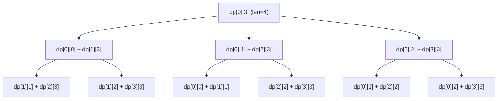
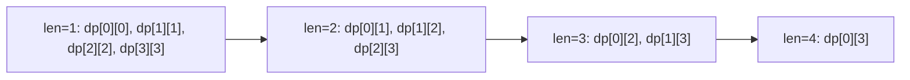

# Bài 49: Interval DP - Quy hoạch động trên đoạn!

> **Tác giả:** FPTOJ Wiki<br>
> **Nội dung tham khảo từ:** CP-Algorithms, USACO Guide

---

## Bạn sẽ học được gì?

- Interval DP là gì và khi nào sử dụng
- Matrix Chain Multiplication - Bài toán kinh điển
- Merge Stones / Boolean Parenthesization
- Palindrome Partitioning và Optimal BST
- Cách xác định thứ tự duyệt và tối ưu hóa

---

## 1. Giới thiệu

### Bài toán gộp đá

Bạn có **N** đống đá xếp thành hàng. Đống thứ `i` có trọng lượng `a[i]`. Mỗi lần bạn được phép **gộp hai đống đá liên tiếp** thành một đống mới, chi phí bằng **tổng trọng lượng** của hai đống đó. Hỏi **chi phí nhỏ nhất** để gộp tất cả thành một đống?

**Ví dụ:** `a = [4, 1, 3, 2]`

```
Cách 1: Gộp (4,1)=5 → (5,3)=8 → (8,2)=10  → Tổng chi phí = 5+8+10 = 23
Cách 2: Gộp (1,3)=4 → (4,2)=6 → (4,6)=10   → Tổng chi phí = 4+6+10 = 20
Cách 3: Gộp (3,2)=5 → (4,1)=5 → (5,5)=10   → Tổng chi phí = 5+5+10 = 20
Cách 4: Gộp (4,1)=5 → (3,2)=5 → (5,5)=10   → Tổng chi phí = 5+5+10 = 20
```

Đáp án: **20**

### Ý tưởng chính

Thay vì gộp từ đầu, ta **chia bài toán thành các đoạn con**:

- `dp[l][r]` = chi phí nhỏ nhất để gộp các đống từ `l` đến `r` thành **một đống duy nhất**.
- Để tính `dp[l][r]`, ta thử mọi vị trí chia `k` (l ≤ k < r):
  - Gộp đoạn `[l, k]` thành 1 đống → chi phí `dp[l][k]`
  - Gộp đoạn `[k+1, r]` thành 1 đống → chi phí `dp[k+1][r]`
  - Gộp 2 đống lại → chi phí `sum(l, r)`
  - `dp[l][r] = min(dp[l][k] + dp[k+1][r] + sum(l, r))` với mọi `k`

### Tại sao Interval DP hoạt động?

Interval DP khai thác tính chất **optimal substructure**: nghiệm tối ưu của đoạn lớn chứa đựng nghiệm tối ưu của các đoạn con. Đồng thời có **overlapping subproblems**: cùng một đoạn `[l, r]` được tính nhiều lần trong quá trình đệ quy.

---

## 2. Template chung

### Cấu trúc cơ bản

```
Khởi tạo: dp[l][r] = giá trị cơ sở khi l == r
Duyệt độ dài len từ 2 đến N:
    Duyệt l từ 0 đến N - len:
        r = l + len - 1
        Duyệt k từ l đến r - 1:
            dp[l][r] = min/max(dp[l][r], dp[l][k] + dp[k+1][r] + cost(l, k, r))
```

**Độ phức tạp:** O(N³) thời gian, O(N²) bộ nhớ.

### Tại sao phải duyệt theo độ dài?

Nếu duyệt `l` từ lớn đến nhỏ và `r` từ nhỏ đến lớn, khi tính `dp[l][r]` ta cần `dp[l][k]` và `dp[k+1][r]` — những đoạn này có độ dài **nhỏ hơn** `[l, r]`. Vậy ta phải đảm bảo các đoạn ngắn hơn đã được tính trước → duyệt theo **tăng dần độ dài**.



### Thứ tự điền bảng DP



### Template code

=== "C++"

    ```cpp
    #include <bits/stdc++.h>
    using namespace std;

    const int MAXN = 505;
    const long long INF = 1e18;

    int n;
    long long a[MAXN];
    long long dp[MAXN][MAXN];

    long long solve() {
        // Khởi tạo: đoạn độ dài 1
        for (int i = 0; i < n; i++)
            dp[i][i] = 0; // Chi phí gộp 1 đống = 0

        // Duyệt theo độ dài tăng dần
        for (int len = 2; len <= n; len++) {
            for (int l = 0; l + len - 1 < n; l++) {
                int r = l + len - 1;
                dp[l][r] = INF;

                for (int k = l; k < r; k++) {
                    dp[l][r] = min(dp[l][r],
                        dp[l][k] + dp[k+1][r] + cost(l, k, r));
                }
            }
        }
        return dp[0][n-1];
    }
    ```

=== "Python"

    ```python
    INF = float('inf')

    def solve(n, a):
        dp = [[0 if i == j else INF for j in range(n)] for i in range(n)]

        # Duyệt theo độ dài tăng dần
        for length in range(2, n + 1):
            for l in range(n - length + 1):
                r = l + length - 1
                for k in range(l, r):
                    dp[l][r] = min(dp[l][r],
                        dp[l][k] + dp[k+1][r] + cost(l, k, r))

        return dp[0][n-1]
    ```

---

## 3. Ví dụ 1: Matrix Chain Multiplication

### Đề bài

Cho **N** ma trận liên tiếp, ma trận thứ `i` có kích thước `d[i] × d[i+1]`. Tìm số phép nhân **ít nhất** cần thực hiện để nhân tất cả các ma trận.

**Ví dụ:** 4 ma trận có kích thước:
- A₁: 10×30, A₂: 30×5, A₃: 5×60, A₄: 60×10
- Dimensions: `d = [10, 30, 5, 60, 10]`

### Phân tích

- `dp[l][r]` = số phép nhân ít nhất để nhân các ma trận từ `l` đến `r`
- Khi chia tại `k`: `(A_l × ... × A_k) × (A_{k+1} × ... × A_r)`
- Ma trận trái có kích thước `d[l] × d[k+1]`, ma trận phải `d[k+1] × d[r+1]`
- Chi phí nhân 2 ma trận: `d[l] × d[k+1] × d[r+1]`

**Công thức:**

```
dp[l][r] = min(dp[l][k] + dp[k+1][r] + d[l] * d[k+1] * d[r+1])
           với l ≤ k < r
```

### Trace chi tiết cho 4 ma trận

`d = [10, 30, 5, 60, 10]`

| Độ dài | [l,r] | Kết quả | Giải thích |
|--------|-------|---------|------------|
| 1 | [0,0],[1,1],[2,2],[3,3] | 0 | Ma trận đơn, không cần nhân |
| 2 | [0,1] | 1500 | 10×30×5 = 1500 |
| 2 | [1,2] | 9000 | 30×5×60 = 9000 |
| 2 | [2,3] | 3000 | 5×60×10 = 3000 |
| 3 | [0,2] | min(k=0: 0+9000+10×30×60=27000, k=1: 1500+0+10×5×60=4500) = **4500** | |
| 3 | [1,3] | min(k=1: 0+3000+30×5×10=4500, k=2: 9000+0+30×60×10=27000) = **4500** | |
| 4 | [0,3] | min(k=0: 0+4500+10×30×10=7500, k=1: 1500+3000+10×5×10=5000, k=2: 4500+0+10×60×10=10500) = **5000** | |

Đáp án: **5000**

### Code

=== "C++"

    ```cpp
    #include <bits/stdc++.h>
    using namespace std;

    const long long INF = 1e18;

    int main() {
        ios_base::sync_with_stdio(false);
        cin.tie(NULL);

        int n;
        cin >> n;
        vector<int> d(n + 1);
        for (int i = 0; i <= n; i++) cin >> d[i];

        // dp[l][r] = min multiplications for matrices l..r (0-indexed)
        vector<vector<long long>> dp(n, vector<long long>(n, 0));

        for (int len = 2; len <= n; len++) {
            for (int l = 0; l + len - 1 < n; l++) {
                int r = l + len - 1;
                dp[l][r] = INF;

                for (int k = l; k < r; k++) {
                    long long cost = dp[l][k] + dp[k+1][r]
                                   + 1LL * d[l] * d[k+1] * d[r+1];
                    dp[l][r] = min(dp[l][r], cost);
                }
            }
        }

        cout << dp[0][n-1] << "\n";
        return 0;
    }
    ```

=== "Python"

    ```python
    import sys
    input = sys.stdin.readline

    def matrix_chain(n, d):
        dp = [[0] * n for _ in range(n)]

        for length in range(2, n + 1):
            for l in range(n - length + 1):
                r = l + length - 1
                dp[l][r] = float('inf')
                for k in range(l, r):
                    cost = dp[l][k] + dp[k+1][r] + d[l] * d[k+1] * d[r+1]
                    dp[l][r] = min(dp[l][r], cost)

        return dp[0][n-1]

    n = int(input())
    d = list(map(int, input().split()))
    print(matrix_chain(n, d))
    ```

---

## 4. Ví dụ 2: Merge Stones (Gộp đá)

### Đề bài

Có **N** đống đá, đống thứ `i` có trọng lượng `a[i]`. Mỗi lần chọn **2 đống liên tiếp** và gộp lại, chi phí bằng tổng trọng lượng. Gộp cho đến khi còn 1 đống. Tìm **chi phí nhỏ nhất**.

**Lưu ý:** Bài này tương tự Matrix Chain Multiplication, nhưng chi phí phụ thuộc vào tổng đoạn `[l, r]`.

### Code

=== "C++"

    ```cpp
    #include <bits/stdc++.h>
    using namespace std;

    const long long INF = 1e18;

    int main() {
        ios_base::sync_with_stdio(false);
        cin.tie(NULL);

        int n;
        cin >> n;
        vector<int> a(n);
        for (int i = 0; i < n; i++) cin >> a[i];

        // Prefix sum để tính tổng đoạn
        vector<long long> pref(n + 1, 0);
        for (int i = 0; i < n; i++)
            pref[i+1] = pref[i] + a[i];

        auto sum = [&](int l, int r) {
            return pref[r+1] - pref[l];
        };

        vector<vector<long long>> dp(n, vector<long long>(n, INF));
        for (int i = 0; i < n; i++)
            dp[i][i] = 0;

        for (int len = 2; len <= n; len++) {
            for (int l = 0; l + len - 1 < n; l++) {
                int r = l + len - 1;
                for (int k = l; k < r; k++) {
                    dp[l][r] = min(dp[l][r],
                        dp[l][k] + dp[k+1][r] + sum(l, r));
                }
            }
        }

        cout << dp[0][n-1] << "\n";
        return 0;
    }
    ```

=== "Python"

    ```python
    import sys
    input = sys.stdin.readline

    def merge_stones(n, a):
        pref = [0] * (n + 1)
        for i in range(n):
            pref[i+1] = pref[i] + a[i]

        def total(l, r):
            return pref[r+1] - pref[l]

        INF = float('inf')
        dp = [[0 if i == j else INF for j in range(n)] for i in range(n)]

        for length in range(2, n + 1):
            for l in range(n - length + 1):
                r = l + length - 1
                for k in range(l, r):
                    dp[l][r] = min(dp[l][r],
                        dp[l][k] + dp[k+1][r] + total(l, r))

        return dp[0][n-1]

    n = int(input())
    a = list(map(int, input().split()))
    print(merge_stones(n, a))
    ```

### Biến thể: Merge Stones với K đống

Một số bài yêu cầu mỗi lần gộp **chính xác K đống liên tiếp** (thường K=3). Khi đó:

- Chỉ có thể gộp thành 1 đống khi `(r - l) % (K - 1) == 0`
- Công thức: `dp[l][r] = min(dp[l][k] + dp[k+1][r]) + sum(l, r)` với `k` thỏa mãn điều kiện

---

## 5. Ví dụ 3: Boolean Parenthesization

### Đề bài

Cho biểu thức boolean dạng chuỗi, ví dụ: `T|F&T^T`. Ký tự là `T` (true), `F` (false), và toán tử `|` (or), `&` (and), `^` (xor). Đếm **số cách đặt dấu ngoặc** để biểu thức có giá trị **True**.

### Phân tích

- `dp[l][r][1]` = số cách đặt ngoặc đoạn `[l, r]` để kết quả = True
- `dp[l][r][0]` = số cách đặt ngoặc đoạn `[l, r]` để kết quả = False
- Chỉ số lẻ là giá trị, chỉ số chẵn là toán tử (hoặc ngược lại tùy cài đặt)

Khi chia tại toán tử thứ `k`:

| Toán tử | Kết quả True | Kết quả False |
|---------|-------------|---------------|
| `&` | T×T | T×F + F×T + F×F |
| `\|` | T×T + T×F + F×T | F×F |
| `^` | T×F + F×T | T×T + F×F |

### Code

=== "C++"

    ```cpp
    #include <bits/stdc++.h>
    using namespace std;

    int main() {
        ios_base::sync_with_stdio(false);
        cin.tie(NULL);

        string s;
        cin >> s;
        int n = s.size();

        // dp[l][r][0] = ways to get False, dp[l][r][1] = ways to get True
        vector<vector<vector<long long>>> dp(
            n, vector<vector<long long>>(n, vector<long long>(2, 0)));

        // Độ dài 1: chỉ có T hoặc F
        for (int i = 0; i < n; i += 2) {
            if (s[i] == 'T') dp[i][i][1] = 1;
            else dp[i][i][0] = 1;
        }

        for (int len = 3; len <= n; len += 2) {
            for (int l = 0; l + len - 1 < n; l += 2) {
                int r = l + len - 1;
                for (int k = l + 1; k < r; k += 2) {
                    long long lt = dp[l][k-1][1], lf = dp[l][k-1][0];
                    long long rt = dp[k+1][r][1], rf = dp[k+1][r][0];

                    if (s[k] == '&') {
                        dp[l][r][1] += lt * rt;
                        dp[l][r][0] += lt * rf + lf * rt + lf * rf;
                    } else if (s[k] == '|') {
                        dp[l][r][1] += lt * rt + lt * rf + lf * rt;
                        dp[l][r][0] += lf * rf;
                    } else { // '^'
                        dp[l][r][1] += lt * rf + lf * rt;
                        dp[l][r][0] += lt * rt + lf * rf;
                    }
                }
            }
        }

        cout << dp[0][n-1][1] << "\n";
        return 0;
    }
    ```

=== "Python"

    ```python
    def count_true(s):
        n = len(s)
        dp = [[[0, 0] for _ in range(n)] for _ in range(n)]

        for i in range(0, n, 2):
            dp[i][i][1] = 1 if s[i] == 'T' else 0
            dp[i][i][0] = 1 if s[i] == 'F' else 0

        for length in range(3, n + 1, 2):
            for l in range(0, n - length + 1, 2):
                r = l + length - 1
                for k in range(l + 1, r, 2):
                    lt, lf = dp[l][k-1][1], dp[l][k-1][0]
                    rt, rf = dp[k+1][r][1], dp[k+1][r][0]

                    if s[k] == '&':
                        dp[l][r][1] += lt * rt
                        dp[l][r][0] += lt * rf + lf * rt + lf * rf
                    elif s[k] == '|':
                        dp[l][r][1] += lt * rt + lt * rf + lf * rt
                        dp[l][r][0] += lf * rf
                    else:  # '^'
                        dp[l][r][1] += lt * rf + lf * rt
                        dp[l][r][0] += lt * rt + lf * rf

        return dp[0][n-1][1]

    s = input().strip()
    print(count_true(s))
    ```

---

## 6. Ví dụ 4: Palindrome Partitioning

### Đề bài

Cho chuỗi `s`. Tìm **số lần cắt ít nhất** để chia `s` thành các đoạn con, mỗi đoạn đều là **palindrome**.

**Ví dụ:** `s = "aab"` → cắt thành `"aa" | "b"` → **1 lần cắt**

### Phân tích

Bài này có thể giải bằng Interval DP, nhưng cách hiệu quả hơn là dùng **1D DP**:

- `dp[i]` = số lần cắt ít nhất cho prefix `s[0..i]`
- `dp[i] = min(dp[j-1] + 1)` với mọi `j ≤ i` mà `s[j..i]` là palindrome

Để kiểm tra palindrome nhanh, ta precompute `isPalin[l][r]` bằng Interval DP.

### Code

=== "C++"

    ```cpp
    #include <bits/stdc++.h>
    using namespace std;

    int main() {
        ios_base::sync_with_stdio(false);
        cin.tie(NULL);

        string s;
        cin >> s;
        int n = s.size();

        // Precompute palindrome
        vector<vector<bool>> isPalin(n, vector<bool>(n, false));
        for (int i = 0; i < n; i++) isPalin[i][i] = true;
        for (int i = 0; i + 1 < n; i++)
            isPalin[i][i+1] = (s[i] == s[i+1]);
        for (int len = 3; len <= n; len++) {
            for (int l = 0; l + len - 1 < n; l++) {
                int r = l + len - 1;
                isPalin[l][r] = (s[l] == s[r]) && isPalin[l+1][r-1];
            }
        }

        // dp[i] = min cuts for s[0..i]
        vector<int> dp(n, INT_MAX);
        for (int i = 0; i < n; i++) {
            if (isPalin[0][i]) {
                dp[i] = 0;
                continue;
            }
            for (int j = 1; j <= i; j++) {
                if (isPalin[j][i]) {
                    dp[i] = min(dp[i], dp[j-1] + 1);
                }
            }
        }

        cout << dp[n-1] << "\n";
        return 0;
    }
    ```

=== "Python"

    ```python
    def min_cut(s):
        n = len(s)

        isPalin = [[False] * n for _ in range(n)]
        for i in range(n):
            isPalin[i][i] = True
        for i in range(n - 1):
            isPalin[i][i+1] = (s[i] == s[i+1])
        for length in range(3, n + 1):
            for l in range(n - length + 1):
                r = l + length - 1
                isPalin[l][r] = (s[l] == s[r]) and isPalin[l+1][r-1]

        dp = [float('inf')] * n
        for i in range(n):
            if isPalin[0][i]:
                dp[i] = 0
                continue
            for j in range(1, i + 1):
                if isPalin[j][i]:
                    dp[i] = min(dp[i], dp[j-1] + 1)

        return dp[n-1]

    s = input().strip()
    print(min_cut(s))
    ```

---

## 7. Ví dụ 5: Optimal Binary Search Tree

### Đề bài

Cho **N** khóa `key[0..N-1]` đã sắp xếp và tần suất truy cập `freq[0..N-1]`. Xây dựng **BST** sao cho **tổng chi phí tìm kiếm** là nhỏ nhất, trong đó chi phí tìm khóa `i` = `freq[i] × depth(i)`.

### Phân tích

- `dp[l][r]` = chi phí nhỏ nhất cho cây BST chứa các khóa từ `l` đến `r`
- Chọn `k` làm gốc: `dp[l][r] = min(dp[l][k-1] + dp[k+1][r] + sum(freq[l..r]))`
  - `sum(freq[l..r])` vì mỗi node trong cây con tăng độ sâu 1

### Code

=== "C++"

    ```cpp
    #include <bits/stdc++.h>
    using namespace std;

    const long long INF = 1e18;

    int main() {
        ios_base::sync_with_stdio(false);
        cin.tie(NULL);

        int n;
        cin >> n;
        vector<int> freq(n);
        for (int i = 0; i < n; i++) cin >> freq[i];

        vector<long long> pref(n + 1, 0);
        for (int i = 0; i < n; i++)
            pref[i+1] = pref[i] + freq[i];

        auto sum = [&](int l, int r) {
            return pref[r+1] - pref[l];
        };

        vector<vector<long long>> dp(n, vector<long long>(n, INF));
        for (int i = 0; i < n; i++)
            dp[i][i] = freq[i];

        for (int len = 2; len <= n; len++) {
            for (int l = 0; l + len - 1 < n; l++) {
                int r = l + len - 1;
                for (int k = l; k <= r; k++) {
                    long long left = (k > l) ? dp[l][k-1] : 0;
                    long long right = (k < r) ? dp[k+1][r] : 0;
                    dp[l][r] = min(dp[l][r],
                        left + right + sum(l, r));
                }
            }
        }

        cout << dp[0][n-1] << "\n";
        return 0;
    }
    ```

=== "Python"

    ```python
    def optimal_bst(n, freq):
        pref = [0] * (n + 1)
        for i in range(n):
            pref[i+1] = pref[i] + freq[i]

        def total(l, r):
            return pref[r+1] - pref[l]

        INF = float('inf')
        dp = [[0 if i == j else INF for j in range(n)] for i in range(n)]

        for length in range(2, n + 1):
            for l in range(n - length + 1):
                r = l + length - 1
                for k in range(l, r + 1):
                    left = dp[l][k-1] if k > l else 0
                    right = dp[k+1][r] if k < r else 0
                    dp[l][r] = min(dp[l][r], left + right + total(l, r))

        return dp[0][n-1]

    n = int(input())
    freq = list(map(int, input().split()))
    print(optimal_bst(n, freq))
    ```

---

## 8. Tối ưu hóa: Knuth's Optimization

### Điều kiện áp dụng

Khi hàm chi phí thỏa mãn **quadrangle inequality**, ta có thể giảm độ phức tạp từ **O(N³)** xuống **O(N²)**:

```
cost(a, c) + cost(b, d) ≤ cost(a, d) + cost(b, c)
với a ≤ b ≤ c ≤ d
```

Và hàm `cost` là **monotone** (đơn điệu).

### Ý tưởng

Với mỗi `dp[l][r]`, vị trí chia tối ưu `k` không nằm lung tung mà nằm trong khoảng `[optK[l][r-1], optK[l+1][r]]`. Ta lưu lại `optK` và chỉ duyệt `k` trong khoảng này.

### Code (Knuth's Optimization)

=== "C++"

    ```cpp
    #include <bits/stdc++.h>
    using namespace std;

    const long long INF = 1e18;

    int main() {
        ios_base::sync_with_stdio(false);
        cin.tie(NULL);

        int n;
        cin >> n;
        vector<int> a(n);
        for (int i = 0; i < n; i++) cin >> a[i];

        vector<long long> pref(n + 1, 0);
        for (int i = 0; i < n; i++)
            pref[i+1] = pref[i] + a[i];

        auto cost = [&](int l, int r) {
            return pref[r+1] - pref[l];
        };

        vector<vector<long long>> dp(n, vector<long long>(n, INF));
        vector<vector<int>> opt(n, vector<int>(n));

        for (int i = 0; i < n; i++) {
            dp[i][i] = 0;
            opt[i][i] = i;
        }

        for (int len = 2; len <= n; len++) {
            for (int l = 0; l + len - 1 < n; l++) {
                int r = l + len - 1;
                dp[l][r] = INF;

                int start = opt[l][r-1];
                int end = opt[l+1][r];
                if (len == 2) { start = l; end = l; }

                for (int k = start; k <= min(end, r - 1); k++) {
                    long long val = dp[l][k] + dp[k+1][r] + cost(l, r);
                    if (val < dp[l][r]) {
                        dp[l][r] = val;
                        opt[l][r] = k;
                    }
                }
            }
        }

        cout << dp[0][n-1] << "\n";
        return 0;
    }
    ```

> **Xem thêm:** Bài 50 sẽ trình bày chi tiết hơn về Knuth's Optimization và các điều kiện áp dụng.

---

## 9. Lưu ý và Cạm bẫy

### Thứ tự duyệt

| Sai | Đúng |
|-----|------|
| Duyệt `l` từ N-1 về 0, `r` từ 0 đến N-1 | Duyệt theo **tăng dần độ dài** `len` |
| `for l in range(n): for r in range(l, n):` | `for len in range(1, n+1): for l in range(n-len+1):` |

**Lý do:** Khi tính `dp[l][r]`, ta cần `dp[l][k]` và `dp[k+1][r]` — cả hai đều có độ dài nhỏ hơn. Nếu duyệt sai thứ tự, các giá trị này chưa được tính.

### Off-by-one

```cpp
// SAU: k chạy từ l đến r-1 (vì phải chia thành 2 đoạn)
for (int k = l; k < r; k++) {
    dp[l][r] = min(dp[l][r], dp[l][k] + dp[k+1][r] + cost(l, k, r));
}

// SAI: k chạy đến r → dp[k+1][r] = dp[r+1][r] → truy cập ngoài mảng
for (int k = l; k <= r; k++) { ... }
```

### Độ phức tạp

| N | O(N³) | Thực tế |
|---|-------|---------|
| 100 | 10⁶ | Chạy OK |
| 300 | 2.7×10⁷ | Chạy OK (~0.3s) |
| 500 | 1.25×10⁸ | Giới hạn (~1.5s) |
| 1000 | 10⁹ | TLE! Cần Knuth's O(N²) |

### Khởi tạo đúng

```cpp
// Với bài min: khởi tạo INF
vector<vector<long long>> dp(n, vector<long long>(n, INF));
for (int i = 0; i < n; i++) dp[i][i] = 0;

// Với bài max: khởi tạo 0 hoặc -INF
vector<vector<long long>> dp(n, vector<long long>(n, 0));
```

### Bộ nhớ

Với N ≤ 1000, bảng DP cần 10⁶ phần tử × 8 bytes = ~8 MB → OK.

Với N ≤ 5000, cần 25×10⁶ × 8 = ~200 MB → có thể MLE. Cân nhắc dùng `short` hoặc tối ưu.

---

## 10. Bài tập

| # | Tên bài | Nguồn | Độ khó | Ghi chú |
|---|---------|-------|--------|---------|
| 1 | [Matrix Chain Multiplication](https://cses.fi/problemset/task/1080/) | CSES | ★★★ | Bài kinh điển |
| 2 | [Palindrome Partitioning](https://cses.fi/problemset/task/1081/) | CSES | ★★★ | DP + palindrome |
| 3 | [Brackets](https://codeforces.com/problemset/problem/5/C) | CF | ★★☆ | Parentheses matching |
| 4 | [Zuma](https://codeforces.com/problemset/problem/607/B) | CF | ★★★ | Interval DP + bắn bóng |
| 5 | [Folding](https://codeforces.com/problemset/problem/189/A) | CF | ★★☆ | String compression |
| 6 | [Polygon](https://codeforces.com/problemset/problem/1099/F) | CF | ★★★★ | Interval game theory |
| 7 | [Yet Another Yet Another Task](https://codeforces.com/problemset/task/1556/E) | CF | ★★★★ | Interval + prefix sum |
| 8 | [Cutting Sticks](https://www.spoj.com/problems/STICKS/) | SPOJ | ★★★ | Knuth's optimization |
| 9 | [Optimal BST](https://www.geeksforgeeks.org/optimal-binary-search-tree-dp-24/) | GFG | ★★★ | OBST kinh điển |
| 10 | [Stone Game](https://codeforces.com/problemset/problem/1538/G) | CF | ★★★★ | Game + interval |
| 11 | [LeetCode - Burst Balloons](https://leetcode.com/problems/burst-balloons/) | LeetCode | ★★★★ | Interval DP kinh điển |
| 12 | [LeetCode - Minimum Score Triangulation](https://leetcode.com/problems/minimum-score-triangulation-of-polygon/) | LeetCode | ★★★ | Interval DP |
| 13 | [LeetCode - Minimum Cost to Cut a Stick](https://leetcode.com/problems/minimum-cost-to-cut-a-stick/) | LeetCode | ★★★★ | Interval DP |

### Gợi ý tiếp theo

- **Bài 50:** Knuth's Optimization — Chi tiết hơn về điều kiện và ứng dụng
- **Bài 51:** Divide and Conquer DP — Tối ưu hóa DP với tính chất tương tự
- **Bài 52:** Bitmask DP — Khi interval DP không áp dụng được

---

## Tóm tắt

| Khái niệm | Mô tả |
|-----------|-------|
| **Định nghĩa** | `dp[l][r]` = nghiệm tối ưu cho đoạn `[l, r]` |
| **Công thức** | `dp[l][r] = min/max(dp[l][k] + dp[k+1][r] + cost)` |
| **Thứ tự duyệt** | Tăng dần độ dài `len` từ 1 đến N |
| **Độ phức tạp** | O(N³) thời gian, O(N²) bộ nhớ |
| **Tối ưu hóa** | Knuth's O(N²) khi thỏa quadrangle inequality |
| **Ứng dụng** | Matrix chain, merge stones, parenthesization, palindrome, OBST |

> **Lưu ý:** Interval DP là kỹ thuật nền tảng cho nhiều bài toán tối ưu trên dãy/đoạn. Hãy luyện tập nhiều để nhận biết pattern nhanh chóng!
