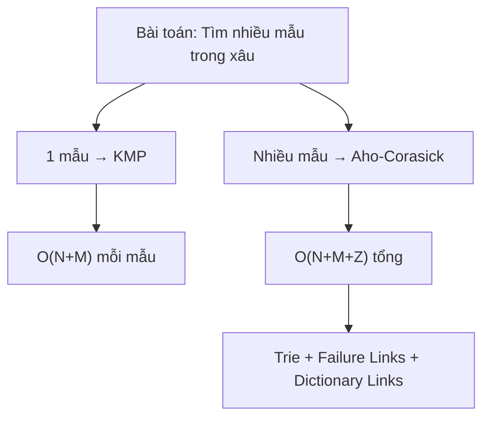
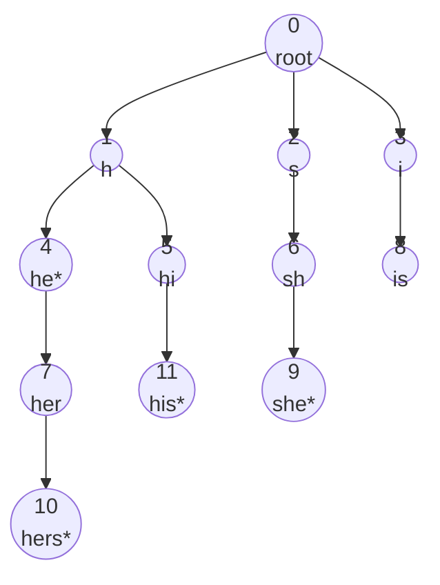
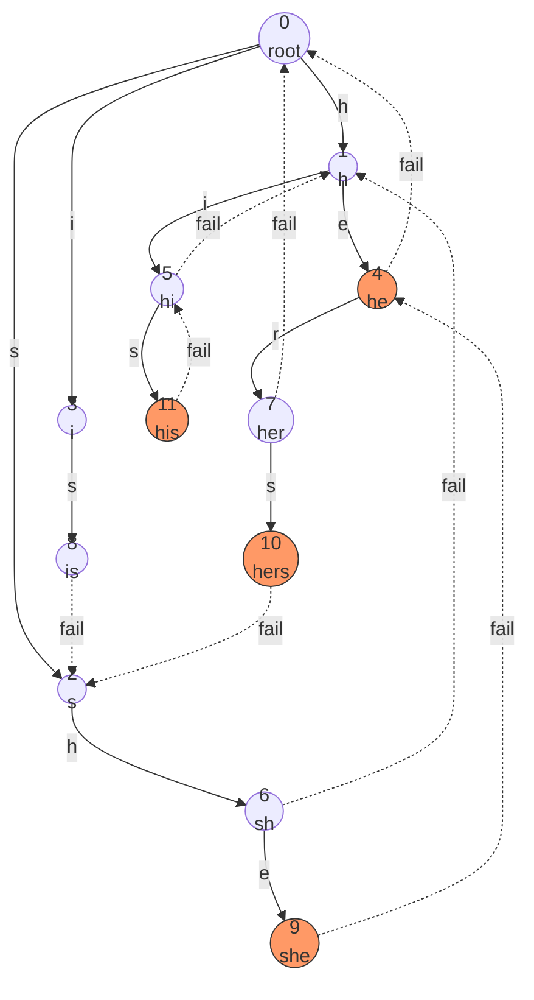

# Bài 51: Aho-Corasick - Tìm nhiều mẫu cùng lúc!

> **Tác giả:** FPTOJ Wiki<br>
> **Nội dung tham khảo từ:** CP-Algorithms, e-maxx

---

## Bạn sẽ học được gì?

- Aho-Corasick kết hợp KMP + Trie để tìm nhiều mẫu trong xâu
- Xây dựng trie, failure links, dictionary links
- Tìm tất cả các mẫu trong xâu O(N + M + Z) trong 1 lần duyệt
- Ứng dụng: multi-pattern matching, filter từ nhạy cảm, sinh học phân tử

---

## 1. Bài toán

Cho một xâu văn bản `T` độ dài `N` và `K` mẫu `P₁, P₂, ..., Pₖ`, tìm **tất cả các vị trí** mà bất kỳ mẫu nào xuất hiện trong `T`.

**Ví dụ:**
- `T = "ushersher"`
- Patterns: `["he", "she", "his", "hers"]`
- Kết quả: `she` tại vị trí 2, `he` tại vị trí 3, `hers` tại vị trí 5, `he` tại vị trí 7

**So sánh các thuật toán:**

| Thuật toán | Số mẫu | Độ phức tạp |
|---|---|---|
| KMP | 1 mẫu | O(N + M) cho mỗi mẫu |
| Tìm lần lượt K mẫu bằng KMP | K mẫu | O(K × (N + M)) |
| **Aho-Corasick** | **K mẫu** | **O(N + M + Z)** |

Trong đó:
- `N` = độ dài xâu `T`
- `M` = tổng độ dài tất cả các mẫu
- `Z` = tổng số lần xuất hiện của tất cả các mẫu

**Ý tưởng cốt lõi:** Kết hợp **Trie** (lưu trữ nhiều mẫu) với **Failure Links** (mở rộng KMP cho trie).



---

## 2. Xây dựng Trie

### Ý tưởng

Trie là cấu trúc cây lưu trữ các xâu. Mỗi nút đại diện cho một **tiền tố** (prefix) của một hoặc nhiều mẫu.

- Gốc là xâu rỗng
- Mỗi cạnh ứng với một ký tự
- Nút lá (hoặc nút được đánh dấu) là kết thúc của một mẫu

**Ví dụ:** Với patterns `["he", "she", "his", "hers"]`:



Trong đó `*` đánh dấu nút kết thúc của một mẫu.

### Cài đặt

=== "C++"

    ```cpp
    #include <bits/stdc++.h>
    using namespace std;

    const int ALPHABET = 26; // 'a' to 'z'

    struct TrieNode {
        int next[ALPHABET]; // cạnh trie
        int fail;           // failure link
        int dict;           // dictionary link
        vector<int> output; // các mẫu kết thúc tại nút này
        int cnt;            // số mẫu kết thúc tại nút này

        TrieNode() {
            fill(next, next + ALPHABET, -1);
            fail = 0;
            dict = -1;
            cnt = 0;
        }
    };

    vector<TrieNode> trie;

    void initTrie() {
        trie.clear();
        trie.emplace_back(); // root = 0
    }

    // Chèn mẫu vào trie
    void insert(const string& pattern, int id) {
        int node = 0;
        for (char ch : pattern) {
            int c = ch - 'a';
            if (trie[node].next[c] == -1) {
                trie[node].next[c] = trie.size();
                trie.emplace_back();
            }
            node = trie[node].next[c];
        }
        trie[node].output.push_back(id);
        trie[node].cnt++;
    }
    ```

=== "Python"

    ```python
    ALPHABET = 26  # 'a' to 'z'

    class TrieNode:
        def __init__(self):
            self.next = [-1] * ALPHABET  # cạnh trie
            self.fail = 0                # failure link
            self.dict_link = -1          # dictionary link
            self.output = []             # các mẫu kết thúc tại nút này
            self.cnt = 0                 # số mẫu kết thúc

    trie = []

    def init_trie():
        global trie
        trie = [TrieNode()]  # root = 0

    def insert(pattern, pattern_id):
        node = 0
        for ch in pattern:
            c = ord(ch) - ord('a')
            if trie[node].next[c] == -1:
                trie[node].next[c] = len(trie)
                trie.append(TrieNode())
            node = trie[node].next[c]
        trie[node].output.append(pattern_id)
        trie[node].cnt += 1
    ```

---

## 3. Failure Links (Liên kết suy giảm)

### Ý tưởng

Đây là phần cốt lõi của Aho-Corasick, tương tự hàm failure trong KMP.

**Định nghĩa:** Failure link của nút `v` là nút đại diện cho **tiền tố đúng dài nhất** (longest proper suffix) của xâu tại `v` mà cũng là tiền tố của một mẫu nào đó.

**Ví dụ:** Tại nút `"she"`, tiền tố đúng dài nhất là `"he"` → failure link trỏ đến nút `"he"`.

Tại nút `"hers"`, tiền tố đúng dài nhất là `"ers"` không phải prefix, thử `"ers"[1:]` = `"rs"` không phải, ..., thử `"s"` không phải → failure link trỏ về root.

### Xây dựng bằng BFS

Tương tự KMP nhưng mở rộng cho trie:

1. **Khởi tạo:** Tất cả con của root có failure link = root
2. **BFS:** Duyệt theo tầng. Với mỗi nút `u` có cạnh ký tự `c` trỏ đến `v`:
   - `fail[v]` = đi từ `fail[u]` theo cạnh `c` (nếu có), nếu không thì quay lại root
   - Tương tự cách KMP tính `pi[i]` từ `pi[i-1]`



### Trace từng bước

**Bước 1 - Khởi tạo con của root:**

| Nút | Ký tự | cha | fail[cha] | fail[nút] |
|---|---|---|---|---|
| 1 (`h`) | `h` | 0 (root) | 0 | 0 |
| 2 (`s`) | `s` | 0 (root) | 0 | 0 |
| 3 (`i`) | `i` | 0 (root) | 0 | 0 |

**Bước 2 - Tầng 2:**

| Nút | Ký tự | cha | fail[cha] | go(fail[cha], c) | fail[nút] |
|---|---|---|---|---|---|
| 4 (`he`) | `e` | 1 (`h`) | 0 | go(0, `e`) = -1 → 0 | 0 (root) |
| 5 (`hi`) | `i` | 1 (`h`) | 0 | go(0, `i`) = 3 | 3 (`i`) |
| 6 (`sh`) | `h` | 2 (`s`) | 0 | go(0, `h`) = 1 | 1 (`h`) |
| 8 (`is`) | `s` | 3 (`i`) | 0 | go(0, `s`) = 2 | 2 (`s`) |

**Bước 3 - Tầng 3:**

| Nút | Ký tự | cha | fail[cha] | go(fail[cha], c) | fail[nút] |
|---|---|---|---|---|---|
| 9 (`she`) | `e` | 6 (`sh`) | 1 (`h`) | go(1, `e`) = 4 | 4 (`he`) |
| 7 (`her`) | `r` | 4 (`he`) | 0 | go(0, `r`) = -1 → 0 | 0 (root) |
| 11 (`his`) | `s` | 5 (`hi`) | 3 (`i`) | go(3, `s`) = 8 | 8 (`is`) |

**Bước 4 - Tầng 4:**

| Nút | Ký tự | cha | fail[cha] | go(fail[cha], c) | fail[nút] |
|---|---|---|---|---|---|
| 10 (`hers`) | `s` | 7 (`her`) | 0 | go(0, `s`) = 2 | 2 (`s`) |

### Cài đặt

=== "C++"

    ```cpp
    // Tính hàm go: từ nút u theo ký tự c, có edge thì đi, không thì quay fail
    int go(int u, int c);

    void buildFailureLinks() {
        queue<int> q;

        // Khởi tạo: con trực tiếp của root có fail = root
        for (int c = 0; c < ALPHABET; c++) {
            int v = trie[0].next[c];
            if (v != -1) {
                trie[v].fail = 0;
                q.push(v);
            } else {
                trie[0].next[c] = 0; // optimization: go(0, c) luôn trả về 0
            }
        }

        // BFS
        while (!q.empty()) {
            int u = q.front(); q.pop();

            for (int c = 0; c < ALPHABET; c++) {
                int v = trie[u].next[c];
                if (v != -1) {
                    trie[v].fail = trie[trie[u].fail].next[c];
                    q.push(v);
                } else {
                    trie[u].next[c] = trie[trie[u].fail].next[c];
                }
            }
        }
    }
    ```

=== "Python"

    ```python
    from collections import deque

    def build_failure_links():
        q = deque()

        # Khởi tạo: con trực tiếp của root có fail = root
        for c in range(ALPHABET):
            v = trie[0].next[c]
            if v != -1:
                trie[v].fail = 0
                q.append(v)
            else:
                trie[0].next[c] = 0  # optimization

        # BFS
        while q:
            u = q.popleft()
            for c in range(ALPHABET):
                v = trie[u].next[c]
                if v != -1:
                    trie[v].fail = trie[trie[u].fail].next[c]
                    q.append(v)
                else:
                    trie[u].next[c] = trie[trie[u].fail].next[c]
    ```

**Lưu ý quan trọng:** Dòng `trie[0].next[c] = 0` khi con root chưa tồn tại là một **optimization** giúp hàm `go` luôn trả về kết quả hợp lệ mà không cần đệ quy. Sau khi chạy BFS, `trie[u].next[c]` trở thành hàm `go(u, c)` hoàn chỉnh.

---

## 4. Dictionary Links (Liên kết từ điển)

### Ý tưởng

Khi đang ở nút `v`, ngoài mẫu kết thúc ngay tại `v`, ta còn có thể tìm thấy mẫu kết thúc tại các nút trên đường failure link chain.

**Dictionary link** của nút `v` là nút **gần nhất** trên đường failure chain từ `v` mà có `cnt > 0` (tức là kết thúc của ít nhất một mẫu).

Điều này giúp khi tìm thấy một mẫu, ta có thể **tập hợp tất cả** các mẫu matching bằng cách đi theo dictionary links.

### Ví dụ

Tại nút 9 (`she`):
- `she` kết thúc tại đây (cnt > 0)
- fail[9] = 4 (`he`) → cũng kết thúc một mẫu!
- fail[4] = 0 (root) → không có mẫu

→ Dictionary link chain: `she` → `he`

### Cài đặt

=== "C++"

    ```cpp
    void buildDictionaryLinks() {
        queue<int> q;
        for (int c = 0; c < ALPHABET; c++) {
            if (trie[0].next[c] != 0) {
                q.push(trie[0].next[c]);
            }
        }

        while (!q.empty()) {
            int u = q.front(); q.pop();

            // Dictionary link: nếu fail[u] kết thúc mẫu thì dict = fail[u]
            //Nếu không lấy dict của fail[u]
            if (trie[trie[u].fail].cnt > 0) {
                trie[u].dict = trie[u].fail;
            } else {
                trie[u].dict = trie[trie[u].fail].dict;
            }

            for (int c = 0; c < ALPHABET; c++) {
                if (trie[u].next[c] != trie[trie[u].fail].next[c]) {
                    q.push(trie[u].next[c]);
                }
            }
        }
    }
    ```

=== "Python"

    ```python
    from collections import deque

    def build_dictionary_links():
        q = deque()
        for c in range(ALPHABET):
            if trie[0].next[c] != 0:
                q.append(trie[0].next[c])

        while q:
            u = q.popleft()

            if trie[trie[u].fail].cnt > 0:
                trie[u].dict_link = trie[u].fail
            else:
                trie[u].dict_link = trie[trie[u].fail].dict_link

            for c in range(ALPHABET):
                if trie[u].next[c] != trie[trie[u].fail].next[c]:
                    q.append(trie[u].next[c])
    ```

---

## 5. Thuật toán tìm kiếm

### Ý tưởng

Duyệt xâu `T` từ trái sang phải. Giữ nút hiện tại `node` trong trie:

1. Đọc ký tự `T[i]`, cập nhật `node = go(node, T[i])`
2. Kiểm tra nút `node`: nếu `cnt > 0` → tìm thấy mẫu
3. Đi theo dictionary links từ `node` để tìm **tất cả** mẫu matching

### Bước chi tiết với ví dụ

`T = "ushersher"`, patterns = `["he", "she", "his", "hers"]`

| i | T[i] | node trước | go(node, T[i]) | node sau | Mẫu tìm thấy |
|---|---|---|---|---|---|
| 0 | `u` | 0 | go(0, `u`) = 0 | 0 | — |
| 1 | `s` | 0 | go(0, `s`) = 2 | 2 (`s`) | — |
| 2 | `h` | 2 | go(2, `h`) = 6 | 6 (`sh`) | — |
| 3 | `e` | 6 | go(6, `e`) = 9 | 9 (`she`) | **she** @i=3, **he** @i=3 (dict link → 4) |
| 4 | `r` | 9 | go(9, `r`) = 7 | 7 (`her`) | — |
| 5 | `s` | 7 | go(7, `s`) = 10 | 10 (`hers`) | **hers** @i=5 |
| 6 | `h` | 10 | go(10, `h`) = 6 | 6 (`sh`) | — |
| 7 | `e` | 6 | go(6, `e`) = 9 | 9 (`she`) | **she** @i=7, **he** @i=7 |
| 8 | `r` | 9 | go(9, `r`) = 7 | 7 (`her`) | — |

**Kết quả tìm được:**
- `she` tại vị trí [1, 3]
- `he` tại vị trí [2, 3], [6, 7]
- `hers` tại vị trí [2, 5]

### Cài đặt

=== "C++"

    ```cpp
    // patterns: vector các mẫu, text: xâu văn bản
    vector<pair<int,int>> search(const string& text, const vector<string>& patterns) {
        vector<pair<int,int>> matches; // {vị trí kết thúc, id mẫu}
        int node = 0;

        for (int i = 0; i < (int)text.size(); i++) {
            int c = text[i] - 'a';
            node = trie[node].next[c]; // hàm go đã được optimize

            // Kiểm tra mẫu kết thúc tại node
            for (int id : trie[node].output) {
                matches.push_back({i, id});
            }

            // Đi theo dictionary links
            int temp = trie[node].dict;
            while (temp != -1) {
                for (int id : trie[temp].output) {
                    matches.push_back({i, id});
                }
                temp = trie[temp].dict;
            }
        }

        return matches;
    }
    ```

=== "Python"

    ```python
    def search(text, patterns):
        """Trả về list (vi_tri_ket_thuc, id_mau)"""
        matches = []
        node = 0

        for i, ch in enumerate(text):
            c = ord(ch) - ord('a')
            node = trie[node].next[c]  # hàm go đã optimize

            # Kiểm tra mẫu kết thúc tại node
            for pid in trie[node].output:
                matches.append((i, pid))

            # Đi theo dictionary links
            temp = trie[node].dict_link
            while temp != -1:
                for pid in trie[temp].output:
                    matches.append((i, pid))
                temp = trie[temp].dict_link

        return matches
    ```

### Độ phức tạp

- **Xây dựng trie:** O(M) — M là tổng độ dài các mẫu
- **Xây dựng failure links:** O(M × ALPHABET)
- **Tìm kiếm:** O(N + Z) — N là độ dài text, Z là tổng số lần khớp

**Tổng:** O(N + M × ALPHABET + Z)

Nếu dùng hash map thay vì mảng: O(N + M + Z) nhưng hằng số lớn hơn.

---

## 6. Ví dụ đầy đủ

=== "C++"

    ```cpp
    #include <bits/stdc++.h>
    using namespace std;

    const int ALPHABET = 26;

    struct AhoCorasick {
        struct Node {
            int next[ALPHABET];
            int fail, dict;
            vector<int> output;

            Node() {
                fill(next, next + ALPHABET, -1);
                fail = 0;
                dict = -1;
            }
        };

        vector<Node> trie;

        AhoCorasick() {
            trie.emplace_back();
        }

        void insert(const string& s, int id) {
            int node = 0;
            for (char ch : s) {
                int c = ch - 'a';
                if (trie[node].next[c] == -1) {
                    trie[node].next[c] = trie.size();
                    trie.emplace_back();
                }
                node = trie[node].next[c];
            }
            trie[node].output.push_back(id);
        }

        void build() {
            queue<int> q;
            for (int c = 0; c < ALPHABET; c++) {
                if (trie[0].next[c] != -1) {
                    trie[trie[0].next[c]].fail = 0;
                    q.push(trie[0].next[c]);
                } else {
                    trie[0].next[c] = 0;
                }
            }

            while (!q.empty()) {
                int u = q.front(); q.pop();

                if (!trie[trie[u].fail].output.empty()) {
                    trie[u].dict = trie[u].fail;
                } else {
                    trie[u].dict = trie[trie[u].fail].dict;
                }

                for (int c = 0; c < ALPHABET; c++) {
                    if (trie[u].next[c] != -1) {
                        trie[trie[u].next[c]].fail = trie[trie[u].fail].next[c];
                        q.push(trie[u].next[c]);
                    } else {
                        trie[u].next[c] = trie[trie[u].fail].next[c];
                    }
                }
            }
        }

        // Tìm tất cả (vi_tri_ket_thuc, mau_id)
        vector<pair<int,int>> search(const string& text) {
            vector<pair<int,int>> res;
            int node = 0;

            for (int i = 0; i < (int)text.size(); i++) {
                int c = text[i] - 'a';
                node = trie[node].next[c];

                for (int id : trie[node].output) {
                    res.push_back({i, id});
                }

                int temp = trie[node].dict;
                while (temp != -1) {
                    for (int id : trie[temp].output) {
                        res.push_back({i, id});
                    }
                    temp = trie[temp].dict;
                }
            }
            return res;
        }
    };

    int main() {
        ios_base::sync_with_stdio(false);
        cin.tie(nullptr);

        string text = "ushersher";
        vector<string> patterns = {"he", "she", "his", "hers"};

        AhoCorasick aho;
        for (int i = 0; i < (int)patterns.size(); i++) {
            aho.insert(patterns[i], i);
        }
        aho.build();

        auto matches = aho.search(text);

        cout << "Found " << matches.size() << " matches:\n";
        for (auto [pos, id] : matches) {
            int len = patterns[id].size();
            cout << "  \"" << patterns[id] << "\" at position ["
                 << pos - len + 1 << ", " << pos << "]\n";
        }

        return 0;
    }
    ```

=== "Python"

    ```python
    from collections import deque

    ALPHABET = 26

    class AhoCorasick:
        class Node:
            def __init__(self):
                self.next = [-1] * ALPHABET
                self.fail = 0
                self.dict_link = -1
                self.output = []

        def __init__(self):
            self.trie = [self.Node()]

        def insert(self, s, idx):
            node = 0
            for ch in s:
                c = ord(ch) - ord('a')
                if self.trie[node].next[c] == -1:
                    self.trie[node].next[c] = len(self.trie)
                    self.trie.append(self.Node())
                node = self.trie[node].next[c]
            self.trie[node].output.append(idx)

        def build(self):
            q = deque()
            for c in range(ALPHABET):
                if self.trie[0].next[c] != -1:
                    self.trie[self.trie[0].next[c]].fail = 0
                    q.append(self.trie[0].next[c])
                else:
                    self.trie[0].next[c] = 0

            while q:
                u = q.popleft()
                if self.trie[self.trie[u].fail].output:
                    self.trie[u].dict_link = self.trie[u].fail
                else:
                    self.trie[u].dict_link = self.trie[self.trie[u].fail].dict_link

                for c in range(ALPHABET):
                    if self.trie[u].next[c] != -1:
                        self.trie[self.trie[u].next[c]].fail = self.trie[self.trie[u].fail].next[c]
                        q.append(self.trie[u].next[c])
                    else:
                        self.trie[u].next[c] = self.trie[self.trie[u].fail].next[c]

        def search(self, text):
            res = []
            node = 0
            for i, ch in enumerate(text):
                c = ord(ch) - ord('a')
                node = self.trie[node].next[c]

                for pid in self.trie[node].output:
                    res.append((i, pid))

                temp = self.trie[node].dict_link
                while temp != -1:
                    for pid in self.trie[temp].output:
                        res.append((i, pid))
                    temp = self.trie[temp].dict_link

            return res

    text = "ushersher"
    patterns = ["he", "she", "his", "hers"]

    aho = AhoCorasick()
    for i, p in enumerate(patterns):
        aho.insert(p, i)
    aho.build()

    matches = aho.search(text)
    print(f"Found {len(matches)} matches:")
    for pos, pid in matches:
        l = len(patterns[pid])
        print(f'  "{patterns[pid]}" at [{pos-l+1}, {pos}]')
    ```

**Output:**
```
Found 5 matches:
  "she" at position [1, 3]
  "he" at position [2, 3]
  "hers" at position [2, 5]
  "she" at position [5, 7]
  "he" at position [6, 7]
```

---

## 7. Ứng dụng với DP

### Bài toán: Đếm số mẫu xuất hiện trong xâu

Cho `K` mẫu, mỗi mẫu có trọng số. Tính tổng trọng số của tất cả mẫu xuất hiện trong `T`.

=== "C++"

    ```cpp
    // Đếm số lần xuất hiện của mỗi mẫu
    vector<int> countOccurrences(const string& text, int numPatterns) {
        vector<int> cnt(numPatterns, 0);
        int node = 0;

        for (int i = 0; i < (int)text.size(); i++) {
            int c = text[i] - 'a';
            node = trie[node].next[c];

            // Đếm trực tiếp
            for (int id : trie[node].output) {
                cnt[id]++;
            }

            // Dictionary links
            int temp = trie[node].dict;
            while (temp != -1) {
                for (int id : trie[temp].output) {
                    cnt[id]++;
                }
                temp = trie[temp].dict;
            }
        }
        return cnt;
    }
    ```

### Bài toán: Duyệt DAG trên trie

Sau khi xây dựng failure links, trie trở thành một **DAG**. Ta có thể dùng DP trên DAG:

```cpp
// dp[u] = số cách để đi từ nút u đến một nút kết thúc mẫu
// Hoặc dp[u] = số mẫu match khi bắt đầu từ nút u
vector<int> dp;

int solve(int u) {
    if (dp[u] != -1) return dp[u];
    dp[u] = trie[u].output.size(); // mẫu kết thúc trực tiếp
    if (u != 0) {
        dp[u] += solve(trie[u].fail); // mẫu qua failure link
    }
    return dp[u];
}
```

---

## 8. Ứng dụng thực tế

### 8.1. Tìm nhiều mẫu trong xâu

Bài toán cơ bản nhất — đã trình bày ở trên.

### 8.2. Lọc từ nhạy cảm (Word Filter)

Thay thế tất cả từ nhạy cảm trong văn bản bằng ký tự `*`:

```cpp
string filterText(const string& text, const vector<string>& badWords) {
    AhoCorasick aho;
    for (int i = 0; i < (int)badWords.size(); i++) {
        aho.insert(badWords[i], i);
    }
    aho.build();

    string result = text;
    auto matches = aho.search(text);

    for (auto [pos, id] : matches) {
        int len = badWords[id].size();
        int start = pos - len + 1;
        for (int j = start; j <= pos; j++) {
            result[j] = '*';
        }
    }
    return result;
}
```

### 8.3. Bài toán đếm số lần xuất hiện (SPOJ - FIND)

Cho `K` mẫu và xâu `T`, với mỗi mẫu đếm số lần xuất hiện trong `T`.

**Ý tưởng:** Đánh dấu `cnt[u]` = số mẫu kết thúc tại nút `u`. Sau khi xây dựng failure links, tính prefix sum trên failure tree.

### 8.4. Sinh học phân tử (DNA Pattern Search)

Tìm tất cả các motif DNA trong chuỗi genome. Alphabet chỉ gồm `{A, C, G, T}` nên trie rất nhỏ.

### 8.5. Bài toán nhiều xâu (CF 963D)

Cho `K` xâu và `Q` truy vấn: với mỗi truy vấn `(k, s)`, tìm khoảng cách ngắn nhất giữa 2 lần xuất hiện liên tiếp của xâu thứ `k` trong `s`.

---

## 9. Lưu ý và Cạm bẫy

### 9.1. Quên khởi tạo failure links cho con root

**Sai:**
```cpp
// Chỉ push con root vào queue, nhưng không set fail
for (int c = 0; c < ALPHABET; c++) {
    if (trie[0].next[c] != -1) {
        q.push(trie[0].next[c]);
        // Thiếu: trie[trie[0].next[c]].fail = 0;
    }
}
```

**Đúng:** Luôn set `fail = 0` cho con trực tiếp của root.

### 9.2. Quên optimization cho root

Dòng `trie[0].next[c] = 0` khi chưa có cạnh là **rất quan trọng**. Nếu bỏ qua, hàm `go` sẽ trả về `-1` và gây lỗi.

### 9.3. Patterns trùng nhau

Nếu hai mẫu giống hệt nhau, cần lưu tất cả ID vào `output` vector, không ghi đè.

### 9.4. Patterns là suffix của nhau

Với patterns `["a", "aa", "aaa"]`, khi match `"aaa"` tại vị trí 2, cần tìm cả `"a"`, `"aa"`, `"aaa"`. Dictionary links xử lý chính xác trường hợp này.

### 9.5. Alphabet lớn

Nếu alphabet lớn (ví dụ Unicode), dùng `map<int,int>` thay vì mảng:

```cpp
struct Node {
    map<int,int> next; // thay vì int next[ALPHABET]
    int fail, dict;
    vector<int> output;
};
```

Độ phức tạp trở thành O(N + M + Z) với hằng số log(ALPHABET).

### 9.6. Bộ nhớ

Với `ALPHABET = 26` và `M = 10^6`, trie có thể có tới `10^6` nút, mỗi nút tốn `26 × 4 + ... ≈ 150 bytes`. Tổng khoảng 150MB. Cần cân nhắc khi `M` lớn.

---

## 10. Bài tập luyện tập

| STT | Bài | Nguồn | Độ khó | Ghi chú |
|---|---|---|---|---|
| 1 | [Keyword Search](https://www.spoj.com/problems/NAJPF/) | SPOJ | ★★★ | Tìm vị trí mẫu trong xâu |
| 2 | [A Needle in the Haystack](https://www.spoj.com/problems/NHAY/) | SPOJ | ★★★ | Tìm mẫu trong xâu (1 mẫu) |
| 3 | [Text Editor](https://codeforces.com/contest/633/problem/C) | CF | ★★★★ | Aho-Corasick + DP |
| 4 | [Lucky Common Subsequence](https://codeforces.com/contest/346/problem/B) | CF | ★★★★ | Aho-Corasick + DP |
| 5 | [MUH and Cube Walls](https://codeforces.com/contest/471/problem/D) | CF | ★★★★ | Pattern matching biến thể |
| 6 | [String Set Queries](https://codeforces.com/contest/710/problem/F) | CF | ★★★★★ | AC với online updates |
| 7 | [Substring Problem](https://www.spoj.com/problems/SUB_PROB/) | SPOJ | ★★★ | Tìm nhiều mẫu trong xâu |
| 8 | [DNA Sequence](https://onlinejudge.org/index.php?option=onlinejudge&page=show_problem&problem=1620) | UVA | ★★★★ | Ứng dụng sinh học |
| 9 | [String Matching](https://open.kattis.com/problems/stringmatching) | Kattis | ★★★ | Multi-pattern |
| 10 | [CF 963D - Frequency of String](https://codeforces.com/contest/963/problem/D) | CF | ★★★★★ | Khoảng cách lần xuất hiện |
| 11 | [Finding Patterns](https://cses.fi/problemset/task/2102) | CSES | ★★★ | Tìm nhiều mẫu trong 1 xâu |
| 12 | [Counting Patterns](https://cses.fi/problemset/task/2103) | CSES | ★★★ | Đếm số lần xuất hiện |
| 13 | [Pattern Positions](https://cses.fi/problemset/task/2104) | CSES | ★★★ | Tìm vị trí đầu tiên |
| 14 | [SUBSTR](https://oj.vnoi.info/problem/substr) | VNOJ | ★★☆ | Tìm xâu con |

---

## Tóm tắt

```mermaid
graph LR
    A[Trie] --> B[Failure Links]
    B --> C[Dictionary Links]
    C --> D[Search O(N+M+Z)]

    E[KMP 1 mẫu] -->|mở rộng| A
    A -->|duyệt BFS| B
    B -->|tìm mẫu gần nhất| C
```

| Thành phần | Ý nghĩa | Độ phức tạp xây dựng |
|---|---|---|
| Trie | Lưu trữ tất cả mẫu | O(M) |
| Failure Links | Tiền tố đúng dài nhất | O(M × ALPHABET) |
| Dictionary Links | Mẫu kết thúc gần nhất | O(M × ALPHABET) |
| Search | Duyệt text, thu thập kết quả | O(N + Z) |

**Điểm mấu chốt:**
- Aho-Corasick = Trie + KMP
- Failure link = hàm `pi[]` trong KMP nhưng cho trie
- Dictionary link giúp thu thập **tất cả** mẫu matching
- Optimization: `trie[u].next[c] = trie[fail[u]].next[c]` biến trie thành DFA
