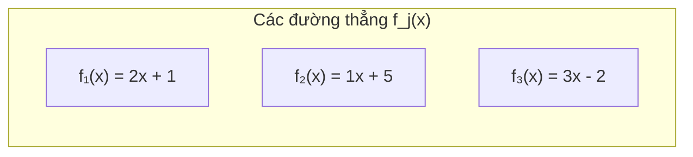
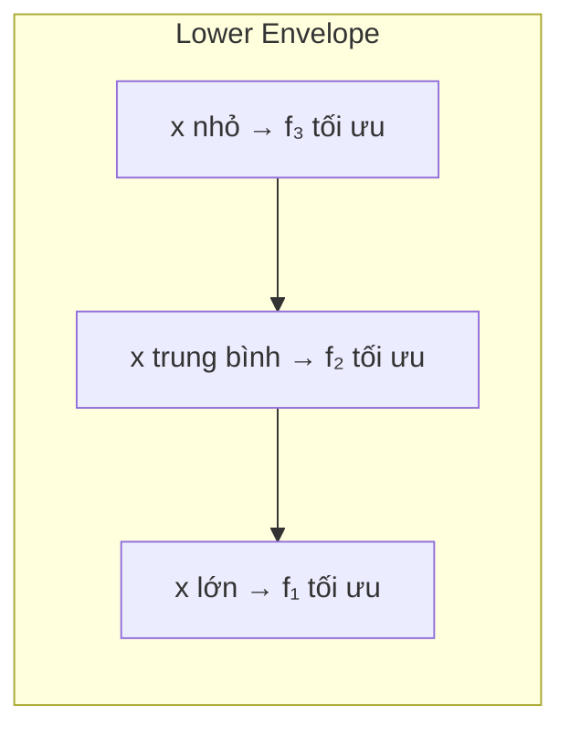
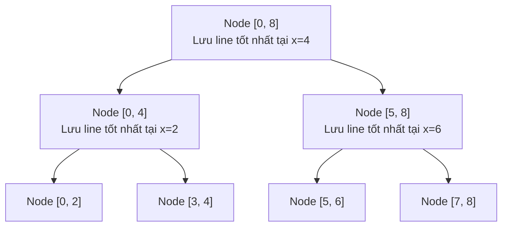

# Bài 54: Convex Hull Trick & Li Chao Tree!

> **Tác giả:** FPTOJ Wiki<br>
> **Nội dung tham khảo từ:** VNOI Wiki, CP-Algorithms

---

## Bạn sẽ học được gì?
- Convex Hull Trick: tối ưu `dp[i] = min/max(dp[j] + b[j]*a[i])`
- Li Chao Tree: CHT động khi thêm đường thẳng theo thứ tự bất kỳ
- Ứng dụng trong competitive programming

---

## 1. Bài toán

Xét bài toán tối ưu hóa dạng:

$$dp[i] = \min_{0 \le j < i} \{ dp[j] + b[j] \cdot a[i] \}$$

Với $a[i], b[j]$ là các hằng số cho trước. Nếu tính trực tiếp, độ phức tạp là $O(N^2)$ — quá chậm khi $N \le 10^5$.

**Nhận xét quan trọng:** Mỗi giá trị $j$ tương ứng với một **hàm số tuyến tính**:

$$f_j(x) = b[j] \cdot x + dp[j]$$

Khi đó $dp[i] = \min_j f_j(a[i])$. Ta cần tìm **giá trị nhỏ nhất** của tập các đường thẳng tại điểm $x = a[i]$.

**Lower envelope** (bì dưới) của tập đường thẳng là đường đi qua các đoạn nhỏ nhất tại mỗi điểm $x$.





Hình minh họa lower envelope (nhìn từ dưới lên):

```
  y
  │      ╱ f₁
  │    ╱
  │   ╱   ╱ f₃
  │  ╱ ╱
  │ ╱╱    __╱ f₂
  │╱  __╱
  └──────────────── x
     ╲_╱_╱
     phần dưới cùng là lower envelope
```

**Ý tưởng:** Nếu ta duy trì được các đường thẳng tạo thành lower envelope, ta có thể tìm min tại bất kỳ điểm $x$ nào bằng **tìm kiếm nhị phân**.

---

## 2. Static CHT — Đường thẳng thêm theo thứ tự slope

### 2.1 Ý tưởng

Giả sử các đường thẳng được thêm vào với **slope tăng dần** (hoặc giảm dần). Khi thêm đường thẳng mới, ta kiểm tra xem đường thẳng cuối cùng trong deque có còn cần thiết hay không.

**Điều kiện loại bỏ đường thẳng cuối:**

Xét 3 đường thẳng $l_1, l_2, l_3$ (theo thứ tự thêm vào, slope tăng dần). Gọi $x(l_1, l_2)$ là hoành độ giao điểm của $l_1$ và $l_2$.

Nếu $x(l_1, l_2) \ge x(l_2, l_3)$ thì $l_2$ **không bao giờ tối ưu** → loại bỏ $l_2$.

**Với slope tăng dần**, ta duy trì **upper hull** cho **min** query (hoặc lower hull cho max query). Các đường thẳng trong deque có hoành độ giao điểm **tăng dần**.

### 2.2 Query

Khi query tại điểm $x$ (cũng tăng dần), ta dùng **con trỏ** di chuyển tuyến tính.

Nếu $x$ không tăng, dùng **tìm kiếm nhị phân** trên deque.

### 2.3 Code C++

```cpp
    #include <bits/stdc++.h>
    using namespace std;

    struct Line {
        long long a, b; // y = a*x + b
        long long eval(long long x) const { return a * x + b; }
        // Giao điểm với line other
        // x = (other.b - b) / (a - other.a)
    };

    struct CHT {
        deque<Line> dq;

        // Kiểm tra xem l2 có vô dụng không (khi thêm l3)
        bool bad(Line l1, Line l2, Line l3) {
            // x(l1,l2) >= x(l2,l3) → l2 vô dụng
            // (l2.b - l1.b)/(l1.a - l2.a) >= (l3.b - l2.b)/(l2.a - l3.a)
            // Chéo nhân (chú ý dấu vì slope tăng dần → a giảm)
            return (__int128)(l3.b - l2.b) * (l1.a - l2.a)
                 <= (__int128)(l2.b - l1.b) * (l2.a - l3.a);
        }

        void addLine(long long a, long long b) {
            Line nw = {a, b};
            while ((int)dq.size() >= 2 && bad(dq[dq.size()-2], dq.back(), nw))
                dq.pop_back();
            dq.push_back(nw);
        }

        // Query tại x, giả sử x tăng dần
        long long query(long long x) {
            while ((int)dq.size() >= 2 && dq[1].eval(x) <= dq[0].eval(x))
                dq.pop_front();
            return dq[0].eval(x);
        }

        // Query tại x, x có thể không tăng (binary search)
        long long queryBS(long long x) {
            int lo = 0, hi = (int)dq.size() - 1;
            while (lo < hi) {
                int mid = (lo + hi) / 2;
                if (dq[mid].eval(x) <= dq[mid+1].eval(x))
                    hi = mid;
                else
                    lo = mid + 1;
            }
            return dq[lo].eval(x);
        }
    };
    ```

### 2.4 Code Python

    ```python
    class CHT:
        def __init__(self):
            self.dq = []  # [(a, b)] representing y = a*x + b

        def eval(self, line, x):
            a, b = line
            return a * x + b

        def bad(self, l1, l2, l3):
            # l1, l2, l3: tuples (a, b)
            # Kiểm tra xem l2 có vô dụng không
            a1, b1 = l1
            a2, b2 = l2
            a3, b3 = l3
            return (b3 - b2) * (a1 - a2) <= (b2 - b1) * (a2 - a3)

        def add_line(self, a, b):
            nw = (a, b)
            while len(self.dq) >= 2 and self.bad(self.dq[-2], self.dq[-1], nw):
                self.dq.pop()
            self.dq.append(nw)

        def query(self, x):
            # x tăng dần
            while len(self.dq) >= 2 and self.eval(self.dq[1], x) <= self.eval(self.dq[0], x):
                self.dq.pop(0)
            return self.eval(self.dq[0], x)

        def query_bs(self, x):
            # Binary search, x bất kỳ
            lo, hi = 0, len(self.dq) - 1
            while lo < hi:
                mid = (lo + hi) // 2
                if self.eval(self.dq[mid], x) <= self.eval(self.dq[mid + 1], x):
                    hi = mid
                else:
                    lo = mid + 1
            return self.eval(self.dq[lo], x)
    ```

---

## 3. Truy vết từng bước

Giả sử ta có các đường thẳng (slope tăng dần):

| j | b[j] | dp[j] | Đường thẳng f_j(x) |
|---|------|-------|---------------------|
| 0 | 3    | 0     | 3x + 0              |
| 1 | 2    | 4     | 2x + 4              |
| 2 | 1    | 7     | 1x + 7              |
| 3 | 0    | 12    | 0x + 12             |

**Bước 1:** Thêm $f_0(x) = 3x$
```
Deque: [f₀]
```

**Bước 2:** Thêm $f_1(x) = 2x + 4$
```
Deque có ≥ 2 phần tử, kiểm tra bad(f₀, f₁):
Giao(f₀, f₁): 3x = 2x + 4 → x = 4
Deque: [f₀, f₁]
```

**Bước 3:** Thêm $f_2(x) = x + 7$
```
Kiểm tra bad(f₀, f₁, f₂):
  Giao(f₀, f₁) = 4
  Giao(f₁, f₂): 2x + 4 = x + 7 → x = 3
  4 >= 3 → f₁ VÔ DỤNG → loại f₁

Deque: [f₀]
Thêm f₂: Deque: [f₀, f₂]
  Giao(f₀, f₂): 3x = x + 7 → x = 3.5
```

**Bước 4:** Thêm $f_3(x) = 12$
```
Kiểm tra bad(f₀, f₂, f₃):
  Giao(f₀, f₂) = 3.5
  Giao(f₂, f₃): x + 7 = 12 → x = 5
  3.5 < 5 → f₂ CÒN DÙNG

Deque: [f₀, f₂, f₃]
```

**Query tại x = 2:**
```
f₀(2) = 6,  f₂(2) = 9,  f₃(2) = 12
→ min = 6 (từ f₀)
```

**Query tại x = 6:**
```
f₀(6) = 18, f₂(6) = 13, f₃(6) = 12
→ min = 12 (từ f₃)
```

---

## 4. Dynamic CHT — Li Chao Tree

### 4.1 Vấn đề

Khi các đường thẳng **không được thêm theo thứ tự slope tăng/giảm dần**, deque CHT không hoạt động. Ta cần một cấu trúc dữ liệu linh hoạt hơn.

### 4.2 Ý tưởng Li Chao Tree

Dùng **segment tree** trên miền giá trị $x$. Mỗi node đại diện cho một đoạn $[L, R]$ và lưu **một đường thẳng** tốt nhất tại điểm giữa (midpoint) của đoạn đó.

**Khi thêm đường thẳng mới `nw` vào node $[L, R]$:**

1. So sánh `nw` và `cur` (đường thẳng hiện tại) tại `mid = (L+R)/2`.
2. Đường thẳng nào tốt hơn tại `mid` → giữ lại ở node này.
3. Đường thẳng còn lại (kém hơn tại `mid`) → đẩy xuống **một trong hai** con:
   - Nếu `nw` tốt hơn `cur` tại `L` → đẩy `cur` sang con trái.
   - Ngược lại → đẩy `cur` sang con phải.
4. Thực hiện đệ quy.

**Độ phức tạp:** $O(N \log X)$ với $X$ là miền giá trị $x$.



### 4.3 Code C++

```cpp
    #include <bits/stdc++.h>
    using namespace std;

    struct LiChaoTree {
        struct Line {
            long long a, b; // y = a*x + b
            long long eval(long long x) const { return a * x + b; }
        };

        int n;
        vector<Line> tree;
        long long L, R; // miền giá trị x

        LiChaoTree(long long lo, long long hi) {
            L = lo; R = hi;
            n = 1;
            while (n < (hi - lo + 1)) n <<= 1;
            tree.assign(2 * n, {0, (long long)1e18});
        }

        void addLine(Line nw) { addLine(1, L, R, nw); }

        void addLine(int node, long long lo, long long hi, Line nw) {
            long long mid = (lo + hi) / 2;
            Line& cur = tree[node];

            // So sánh tại mid
            bool leftBetter = nw.eval(lo) < cur.eval(lo);
            bool midBetter = nw.eval(mid) < cur.eval(mid);

            if (midBetter) swap(cur, nw);

            if (lo == hi) return;

            if (leftBetter != midBetter)
                addLine(2 * node, lo, mid, nw);
            else
                addLine(2 * node + 1, mid + 1, hi, nw);
        }

        long long query(long long x) { return query(1, L, R, x); }

        long long query(int node, long long lo, long long hi, long long x) {
            long long res = tree[node].eval(x);
            if (lo == hi) return res;
            long long mid = (lo + hi) / 2;
            if (x <= mid)
                return min(res, query(2 * node, lo, mid, x));
            else
                return min(res, query(2 * node + 1, mid + 1, hi, x));
        }
    };
    ```

### 4.4 Code Python

    ```python
    class LiChaoTree:
        class Line:
            def __init__(self, a=0, b=float('inf')):
                self.a = a
                self.b = b
            def eval(self, x):
                return self.a * x + self.b

        def __init__(self, lo, hi):
            self.L = lo
            self.R = hi
            self.tree = [self.Line() for _ in range(4 * (hi - lo + 1))]

        def _add(self, node, lo, hi, nw):
            mid = (lo + hi) // 2
            cur = self.tree[node]

            left_better = nw.eval(lo) < cur.eval(lo)
            mid_better = nw.eval(mid) < cur.eval(mid)

            if mid_better:
                self.tree[node], nw = nw, cur
                cur = self.tree[node]

            if lo == hi:
                return

            if left_better != mid_better:
                self._add(2 * node, lo, mid, nw)
            else:
                self._add(2 * node + 1, mid + 1, hi, nw)

        def add_line(self, a, b):
            self._add(1, self.L, self.R, self.Line(a, b))

        def _query(self, node, lo, hi, x):
            res = self.tree[node].eval(x)
            if lo == hi:
                return res
            mid = (lo + hi) // 2
            if x <= mid:
                return min(res, self._query(2 * node, lo, mid, x))
            else:
                return min(res, self._query(2 * node + 1, mid + 1, hi, x))

        def query(self, x):
            return self._query(1, self.L, self.R, x)
    ```

---

## 5. Li Chao Tree với Coordinate Compression

Khi miền giá trị $x$ rất lớn (ví dụ $10^9$) nhưng số điểm query ít, ta có thể **nén tọa độ**.

### 5.1 Ý tưởng

1. Thu thập tất cả các điểm $x$ sẽ query.
2. Sắp xếp và loại bỏ trùng lặp → mảng `coords[]`.
3. Dùng Li Chao Tree trên chỉ số `0..len(coords)-1`.
4. Khi query tại $x$, tìm chỉ số của $x$ trong `coords` bằng `lower_bound`.

### 5.2 Code C++

```cpp
    #include <bits/stdc++.h>
    using namespace std;

    struct LiChaoCompressed {
        struct Line {
            long long a, b;
            long long eval(long long x) const { return a * x + b; }
        };

        vector<Line> tree;
        vector<long long> coords;
        int n;

        LiChaoCompressed(vector<long long> xs) {
            sort(xs.begin(), xs.end());
            xs.erase(unique(xs.begin(), xs.end()), xs.end());
            coords = xs;
            n = coords.size();
            tree.assign(4 * n, {0, (long long)1e18});
        }

        void addLine(long long a, long long b) {
            _add(1, 0, n - 1, {a, b});
        }

        void _add(int node, int lo, int hi, Line nw) {
            int mid = (lo + hi) / 2;
            long long x_lo = coords[lo], x_mid = coords[mid], x_hi = coords[hi];
            Line& cur = tree[node];

            bool leftBetter = nw.eval(x_lo) < cur.eval(x_lo);
            bool midBetter = nw.eval(x_mid) < cur.eval(x_mid);

            if (midBetter) swap(cur, nw);

            if (lo == hi) return;

            if (leftBetter != midBetter)
                _add(2 * node, lo, mid, nw);
            else
                _add(2 * node + 1, mid + 1, hi, nw);
        }

        long long query(long long x) {
            int idx = lower_bound(coords.begin(), coords.end(), x) - coords.begin();
            return _query(1, 0, n - 1, idx);
        }

        long long _query(int node, int lo, int hi, int idx) {
            long long res = tree[node].eval(coords[idx]);
            if (lo == hi) return res;
            int mid = (lo + hi) / 2;
            if (idx <= mid)
                return min(res, _query(2 * node, lo, mid, idx));
            else
                return min(res, _query(2 * node + 1, mid + 1, hi, idx));
        }
    };
    ```

---

## 6. Ví dụ: Batch Scheduling (IOI 2002)

### 6.1 Đề bài tóm tắt

Có $N$ công việc. Công việc $i$ có thời gian thực hiện $t[i]$ và hệ số phạt $f[i]$. Ta cần chia thành các batch liên tiếp. Nếu batch kết thúc tại thời điểm $S$, phạt của batch là $S \cdot \sum f[i]$ trong batch. Tìm cách chia batch để **tổng phạt nhỏ nhất**.

### 6.2 Công thức DP

Định nghĩa $T[i] = \sum_{k=1}^{i} t[k]$, $F[i] = \sum_{k=1}^{i} f[k]$.

$$dp[i] = \min_{0 \le j < i} \{ dp[j] + T[i] \cdot (F[N] - F[j]) \}$$

$$dp[i] = \min_j \{ dp[j] - T[i] \cdot F[j] \} + T[i] \cdot F[N]$$

Đặt $x = T[i]$, mỗi $j$ cho đường thẳng: $f_j(x) = (-F[j]) \cdot x + dp[j]$.

Slope $= -F[j]$ **giảm dần** (vì $F[j]$ tăng dần) → thêm đường thẳng theo thứ tự slope giảm.

### 6.3 Code C++

```cpp
    #include <bits/stdc++.h>
    using namespace std;

    int main() {
        int n;
        cin >> n;

        vector<long long> t(n + 1), f(n + 1);
        for (int i = 1; i <= n; i++)
            cin >> t[i] >> f[i];

        vector<long long> T(n + 1, 0), F(n + 1, 0);
        for (int i = 1; i <= n; i++) {
            T[i] = T[i - 1] + t[i];
            F[i] = F[i - 1] + f[i];
        }

        // CHT: slope = -F[j], intercept = dp[j]
        // Slope giảm dần → dùng deque, query x = T[i] tăng dần
        deque<pair<long long, long long>> dq; // {a, b} = {-F[j], dp[j]}

        auto eval = [](pair<long long, long long> line, long long x) {
            return line.first * x + line.second;
        };

        auto bad = [](pair<long long, long long> l1,
                      pair<long long, long long> l2,
                      pair<long long, long long> l3) {
            // (l3.b - l2.b)*(l1.a - l2.a) <= (l2.b - l1.b)*(l2.a - l3.a)
            return (__int128)(l3.second - l2.second) * (l1.first - l2.first)
                 <= (__int128)(l2.second - l1.second) * (l2.first - l3.first);
        };

        // dp[0] = 0, đường thẳng: -F[0]*x + dp[0] = 0
        dq.push_back({0, 0});

        vector<long long> dp(n + 1, 0);

        for (int i = 1; i <= n; i++) {
            long long x = T[i];
            // Query
            while ((int)dq.size() >= 2 && eval(dq[1], x) <= eval(dq[0], x))
                dq.pop_front();
            dp[i] = eval(dq[0], x) + T[i] * F[n];

            // Thêm đường thẳng mới: a = -F[i], b = dp[i]
            pair<long long, long long> nw = {-F[i], dp[i]};
            while ((int)dq.size() >= 2 && bad(dq[dq.size()-2], dq.back(), nw))
                dq.pop_back();
            dq.push_back(nw);
        }

        cout << dp[n] << endl;
        return 0;
    }
    ```

### 6.4 Code Python

    ```python
    from collections import deque
    import sys
    input = sys.stdin.readline

    def main():
        n = int(input())
        t = [0] * (n + 1)
        f = [0] * (n + 1)
        for i in range(1, n + 1):
            t[i], f[i] = map(int, input().split())

        T = [0] * (n + 1)
        F = [0] * (n + 1)
        for i in range(1, n + 1):
            T[i] = T[i - 1] + t[i]
            F[i] = F[i - 1] + f[i]

        def eval_line(line, x):
            return line[0] * x + line[1]

        def bad(l1, l2, l3):
            return (l3[1] - l2[1]) * (l1[0] - l2[0]) <= (l2[1] - l1[1]) * (l2[0] - l3[0])

        dq = deque()
        dq.append((0, 0))  # (-F[0], dp[0])

        dp = [0] * (n + 1)

        for i in range(1, n + 1):
            x = T[i]
            while len(dq) >= 2 and eval_line(dq[1], x) <= eval_line(dq[0], x):
                dq.popleft()
            dp[i] = eval_line(dq[0], x) + T[i] * F[n]

            nw = (-F[i], dp[i])
            while len(dq) >= 2 and bad(dq[-2], dq[-1], nw):
                dq.pop()
            dq.append(nw)

        print(dp[n])

    main()
    ```

---

## 7. Ví dụ: ACQUIRE (USACO)

### 7.1 Đề bài tóm tắt

Có $N$ mảnh đất hình chữ nhật. Ta cần chọn một số mảnh đất để bao phủ tất cả (mảnh đất có thể bao phủ mảnh khác nếu width và height đều lớn hơn hoặc bằng). Chi phí = tổng diện tích các mảnh đất được chọn. Tìm chi phí nhỏ nhất.

### 7.2 Phân tích

1. Loại bỏ các mảnh đất bị bao phủ hoàn toàn bởi mảnh khác (sau khi sắp xếp).
2. Sau khi lọc, width tăng, height giảm.
3. Gom nhóm các mảnh đất liên tiếp có cùng width → mỗi nhóm là một hình chữ nhật.
4. DP: $dp[i] = \min_{j < i} \{ dp[j] + h[j+1] \cdot w[i] \}$

Đây là dạng CHT: $f_j(x) = h[j+1] \cdot x + dp[j]$, query tại $x = w[i]$.

### 7.3 Code C++

```cpp
    #include <bits/stdc++.h>
    using namespace std;

    int main() {
        int n;
        cin >> n;

        vector<pair<long long, long long>> rects(n);
        for (int i = 0; i < n; i++)
            cin >> rects[i].first >> rects[i].second;

        // Sắp xếp width giảm, height tăng
        sort(rects.begin(), rects.end(), [](auto& a, auto& b) {
            if (a.first != b.first) return a.first > b.first;
            return a.second < b.second;
        });

        // Lọc: chỉ giữ các mảnh có height tăng dần (width giảm dần)
        vector<pair<long long, long long>> filtered;
        long long maxH = 0;
        for (auto& [w, h] : rects) {
            if (h > maxH) {
                filtered.push_back({w, h});
                maxH = h;
            }
        }

        // Gom nhóm theo width
        vector<long long> W, H;
        for (auto& [w, h] : filtered) {
            if (!W.empty() && W.back() == w) {
                H.back() = max(H.back(), h);
            } else {
                W.push_back(w);
                H.push_back(h);
            }
        }

        int m = W.size();
        // dp[i] = min cost để bao phủ mảnh đầu tiên (width lớn nhất) đến mảnh i
        // dp[i] = min_{j < i} { dp[j] + H[j+1] * W[i] }
        // slope = H[j+1], intercept = dp[j]
        // H giảm dần → slope giảm dần → CHT deque

        deque<pair<long long, long long>> dq; // {a=slope, b=intercept}

        auto eval = [](pair<long long, long long> line, long long x) {
            return line.first * x + line.second;
        };

        auto bad = [](pair<long long, long long> l1,
                      pair<long long, long long> l2,
                      pair<long long, long long> l3) {
            return (__int128)(l3.second - l2.second) * (l1.first - l2.first)
                 <= (__int128)(l2.second - l1.second) * (l2.first - l3.first);
        };

        dq.push_back({H[0], 0}); // j=-1, dp[-1]=0, slope=H[0]
        long long dp_val;

        for (int i = 0; i < m; i++) {
            long long x = W[i];
            while ((int)dq.size() >= 2 && eval(dq[1], x) <= eval(dq[0], x))
                dq.pop_front();
            dp_val = eval(dq[0], x);

            if (i + 1 < m) {
                pair<long long, long long> nw = {H[i + 1], dp_val};
                while ((int)dq.size() >= 2 && bad(dq[dq.size()-2], dq.back(), nw))
                    dq.pop_back();
                dq.push_back(nw);
            }
        }

        cout << dp_val << endl;
        return 0;
    }
    ```

---

## 8. Phiên bản Max — Upper Envelope

Tất cả các kỹ thuật trên đều áp dụng cho **max** bằng cách:
- Đổi dấu: thay vì `max`, tính `min` của `-f_j(x)`.
- Hoặc đảo điều kiện: thay vì `<`, dùng `>` trong hàm `bad`.
- Hoặc duy trì **upper envelope** thay vì lower envelope.

### Code C++ cho Max CHT

```cpp
    struct MaxCHT {
        deque<Line> dq;

        bool bad(Line l1, Line l2, Line l3) {
            // Ngược lại với min version
            return (__int128)(l3.b - l2.b) * (l1.a - l2.a)
                 >= (__int128)(l2.b - l1.b) * (l2.a - l3.a);
        }

        void addLine(long long a, long long b) {
            Line nw = {a, b};
            while ((int)dq.size() >= 2 && bad(dq[dq.size()-2], dq.back(), nw))
                dq.pop_back();
            dq.push_back(nw);
        }

        long long query(long long x) {
            while ((int)dq.size() >= 2 && dq[1].eval(x) >= dq[0].eval(x))
                dq.pop_front();
            return dq[0].eval(x);
        }
    };
    ```

---

## 9. Lưu ý & Cạm bẫy

### 9.1 Tràn số khi tính giao điểm

Khi tính `(l3.b - l2.b) * (l1.a - l2.a)`, tích có thể vượt quá `long long`. Dùng `__int128` hoặc chia trước.

### 9.2 Đường thẳng trùng slope

Nếu hai đường thẳng có cùng slope, chỉ giữ đường thẳng có intercept tốt hơn.

```cpp
void addLine(long long a, long long b) {
    if (!dq.empty() && dq.back().a == a) {
        if (b >= dq.back().b) return; // đường mới kém hơn
        dq.pop_back();
    }
    // ... tiếp tục như bình thường
}
```

### 9.3 miền query phải biết trước cho Li Chao Tree

Li Chao Tree cần biết miền $x$ trước. Nếu miền quá lớn, dùng coordinate compression.

### 9.4 Integer vs Floating Point

Nên dùng **số nguyên** và so sánh chéo nhân. Dùng `double` có thể bị sai lệch khi giá trị lớn.

### 9.5 Thứ tự thêm đường thẳng

- **Deque CHT:** Slope phải tăng (hoặc giảm) dần.
- **Li Chao Tree:** Thứ tự bất kỳ, nhưng cần biết miền $x$.

### 9.6 Độ phức tạp tổng hợp

| Phương pháp | Thêm | Query | Điều kiện |
|-------------|------|-------|-----------|
| Deque CHT | $O(1)$ amortized | $O(1)$ amortized | Slope đơn điệu |
| Deque CHT + BS | $O(1)$ amortized | $O(\log N)$ | Slope đơn điệu |
| Li Chao Tree | $O(\log X)$ | $O(\log X)$ | Biết miền $x$ |
| Li Chao Compressed | $O(\log N)$ | $O(\log N)$ | Biết tập $x$ query |

---

## 10. Bài tập

| STT | Bài toán | Nguồn | Độ khó | Ghi chú |
|-----|----------|-------|--------|---------|
| 1 | [Kalila and Dimna in the Logging Industry](https://codeforces.com/problemset/problem/319/C) | CF | ★★★ | CHT cơ bản |
| 2 | [Batch Scheduling](https://www.spoj.com/problems/BATCH/) | SPOJ | ★★★ | CHT + DP |
| 3 | [CEOI 2004 - Two sawmills](https://oj.uz/problem/view/CEOI04_two) | oj.uz | ★★★ | CHT + prefix sum |
| 4 | [ACQUIRE](http://www.usaco.org/index.php?page=viewproblem2&cpid=293) | USACO | ★★★★ | CHT + gom nhóm |
| 5 | [APIO 2010 - Commando](https://dmoj.ca/problem/apio10p1) | DMOJ | ★★★ | Li Chao Tree |
| 6 | [OTOCI](https://codeforces.com/gym/102156/problem/E) | CF Gym | ★★★★ | CHT + LCA |
| 7 | [Line Container](https://judge.yosupo.jp/problem/line_add_get_min) | Yosupo | ★★★ | Li Chao Tree cơ bản |
| 8 | [DP Optimization - CHT](https://codeforces.com/blog/entry/63823) | CF Blog | ★★ | Tổng hợp bài tập |
| 9 | [IOI 2002 Batch Scheduling](https://oj.uz/problem/view/IOI02_batch) | oj.uz | ★★★ | CHT classic |
| 10 | [Kalila and Dimna in the Logging Industry](https://codeforces.com/contest/319/problem/C) | CF | ★★★★ | CHT kinh điển |
| 11 | [Houses and Schools](https://cses.fi/problemset/task/2087) | CSES | ★★★★ | CHT application |
| 12 | [Frog 3 (AtCoder DP Z)](https://oj.vnoi.info/problem/atcoder_dp_z) | VNOJ | ★★★ | CHT kinh điển |

---

## Tổng kết

| Kỹ thuật | Khi nào dùng |
|----------|---------------|
| **Deque CHT** | Slope thêm vào đơn điệu, query đơn điệu |
| **CHT + Binary Search** | Slope đơn điệu, query bất kỳ |
| **Li Chao Tree** | Slope bất kỳ, biết miền $x$ |
| **Li Chao Compressed** | Slope bất kỳ, miền $x$ lớn, query ít |

**Bước tiếp theo:**
- Thử giải các bài tập trong bảng trên.
- Đọc thêm về [Divide and Conquer DP](https://cp-algorithms.com/divide-and-conquer-dp.html) — kỹ thuật tối ưu DP liên quan.
- Tìm hiểu về **Lagrange Multiplier** và **Knuth Optimization** cho các dạng DP khác.
