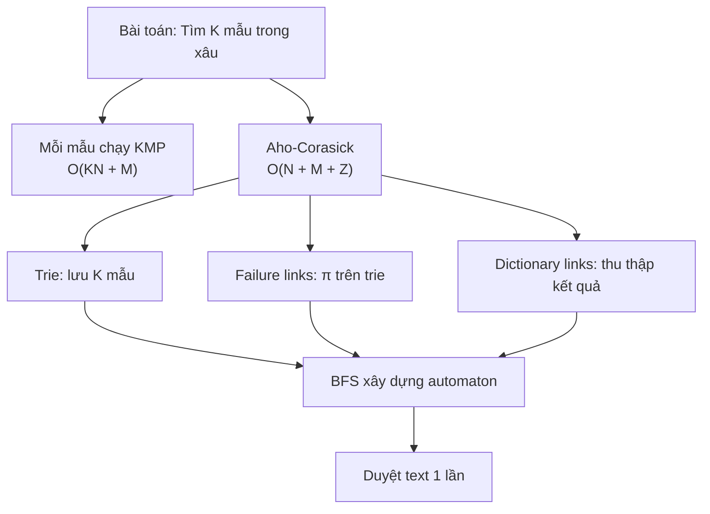
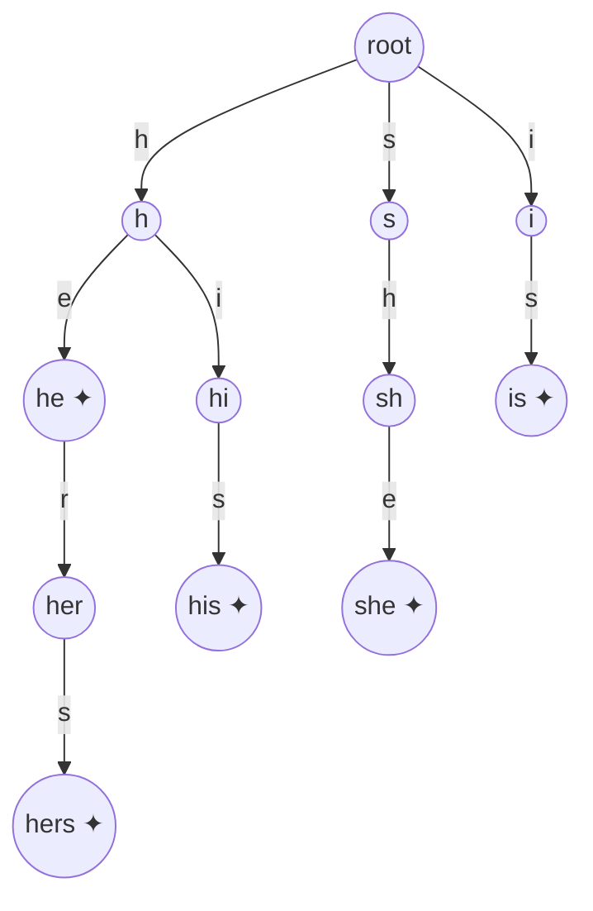
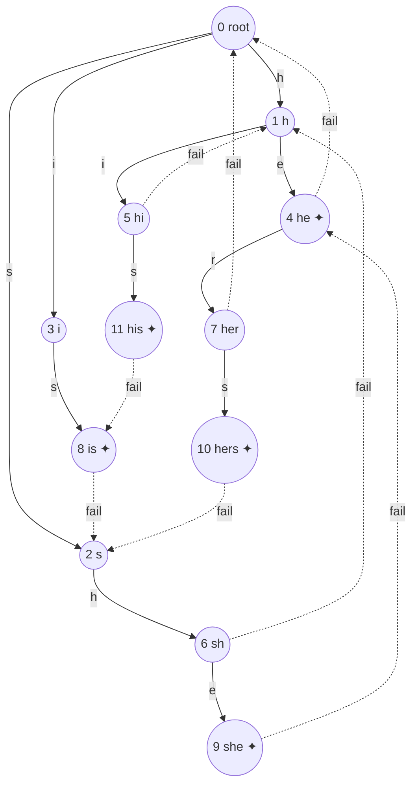
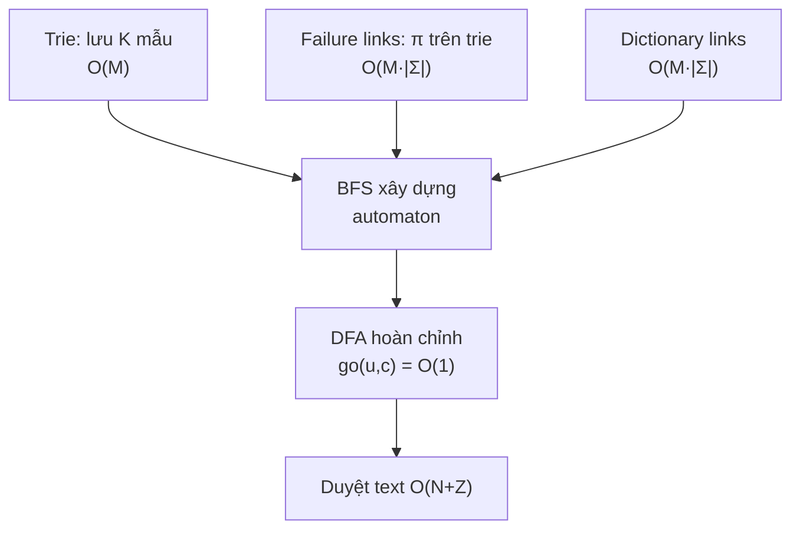

# Bài 51: Aho-Corasick — Tìm Nhiều Mẫu Cùng Lúc

> **Tác giả:** FPTOJ Wiki<br>
> **Nội dung tham khảo từ:** CP-Algorithms, e-maxx

---

## Bạn sẽ học được gì?

- Tại sao KMP chạy riêng lẻ cho từng mẫu **không đủ** khi số mẫu lớn
- Ý tưởng kết hợp **Trie** với **Failure Links** để mở rộng KMP cho nhiều mẫu
- Xây dựng automaton hoàn chỉnh: Trie + Failure Links + Dictionary Links
- Cài đặt Aho-Corasick và áp dụng vào các bài toán thực tế
- Phân tích đúng đắn và đánh giá độ phức tạp $O(N + M + Z)$

---

## 1. Bản chất vấn đề

### Bài toán

Cho văn bản $T$ độ dài $N$ và $K$ mẫu $P_1, P_2, \ldots, P_K$ với tổng độ dài $M = \sum |P_i|$. Tìm **tất cả vị trí** trong $T$ mà bất kỳ mẫu nào xuất hiện.

**Ví dụ:** $T = \text{"ushersher"}$, mẫu $= \{\texttt{"he"}, \texttt{"she"}, \texttt{"his"}, \texttt{"hers"}\}$.

| Mẫu | Vị trí xuất hiện trong $T$ |
|-----|---------------------------|
| `"she"` | $[1, 3]$ |
| `"he"` | $[2, 3]$, $[6, 7]$ |
| `"hers"` | $[2, 5]$ |

### Tại sao KMP chạy riêng lẻ chưa đủ?

KMP tìm 1 mẫu trong $O(N + L)$ với $L$ là độ dài mẫu. Nếu chạy KMP riêng cho từng mẫu:

$$T_{\text{KMP\_total}} = O\!\left(\sum_{i=1}^{K}(N + |P_i|)\right) = O(KN + M)$$

Khi $K = 10^5$, $N = 10^6$ → $KN = 10^{11}$ → **TLE!**

So sánh các phương pháp:

| Phương pháp | Số mẫu | Độ phức tạp | Hạn chế |
|-------------|--------|-------------|---------|
| Brute-force | 1 | $O(NL)$ | Chậm khi $L$ lớn |
| KMP | 1 | $O(N + L)$ | Chỉ 1 mẫu |
| Chạy KMP $K$ lần | $K$ | $O(KN + M)$ | $K$ lớn → TLE |
| **Aho-Corasick** | $K$ | $O(N + M + Z)$ | Tối ưu |

Trong đó $Z$ là tổng số lần khớp (tổng số mẫu được tìm thấy).

---

## 2. Tư duy cốt lõi

KMP xử lý 1 mẫu bằng cách tính **hàm tiền tố** $\pi$: khi mismatch tại vị trí $j$, nhảy $j = \pi[j-1]$ thay vì quay lại đầu. Điều này giúp **không bao giờ lùi con trỏ trên text**.

Aho-Corasick mở rộng ý tưởng này cho **nhiều mẫu** bằng cách:

1. **Trie** lưu trữ tất cả mẫu — mỗi nút là một tiền tố
2. **Failure link** $fail[v]$ = phiên bản hàm $\pi$ trên trie — trỏ đến tiền tố đúng dài nhất
3. **Dictionary link** $dict[v]$ = nút gần nhất trên failure chain kết thúc một mẫu

Khi duyệt text, automaton di chuyển **chỉ tiến** trên text, mỗi bước cập nhật nút hiện tại bằng hàm $go$ — tương tự cách KMP không lùi con trỏ.



---

## 3. Xây dựng Trie

### Cấu trúc

Trie là cây trong đó mỗi nút đại diện cho một **tiền tố** của một hoặc nhiều mẫu. Gốc là xâu rỗng, mỗi cạnh mang một ký tự, nút được đánh dấu là kết thúc của mẫu.

**Ví dụ** với mẫu $= \{\texttt{"he"}, \texttt{"she"}, \texttt{"his"}, \texttt{"hers"}\}$:



Các nút có ✦ là kết thúc của ít nhất một mẫu. Mỗi nút lưu danh sách `output` chứa ID các mẫu kết thúc tại đó.

### Cài đặt

=== "C++"

    ```cpp
    #include <bits/stdc++.h>
    using namespace std;

    const int ALPHABET = 26;

    struct Node {
        int next[ALPHABET];
        int fail, dict;
        vector<int> output;

        Node() {
            fill(next, next + ALPHABET, -1);
            fail = 0;
            dict = -1;
        }
    };

    vector<Node> trie;

    void initTrie() {
        trie.clear();
        trie.emplace_back();
    }

    void insert(const string& s, int id) {
        int node = 0;
        for (char ch : s) {
            int c = ch - 'a';
            if (trie[node].next[c] == -1) {
                trie[node].next[c] = trie.size();
                trie.emplace_back();
            }
            node = trie[node].next[c];
        }
        trie[node].output.push_back(id);
    }
    ```

=== "Python"

    ```python
    ALPHABET = 26

    class Node:
        def __init__(self):
            self.next = [-1] * ALPHABET
            self.fail = 0
            self.dict_link = -1
            self.output = []

    trie = []

    def init_trie():
        global trie
        trie = [Node()]

    def insert(s, pattern_id):
        node = 0
        for ch in s:
            c = ord(ch) - ord('a')
            if trie[node].next[c] == -1:
                trie[node].next[c] = len(trie)
                trie.append(Node())
            node = trie[node].next[c]
        trie[node].output.append(pattern_id)
    ```

---

## 4. Failure Links

### Định nghĩa

**Failure link** $fail[v]$ của nút $v$ là nút đại diện cho **tiền tố đúng dài nhất** (longest proper suffix) của xâu tại $v$ mà cũng là tiền tố của một mẫu nào đó trong trie.

Đây chính là hàm $\pi$ trong KMP, nhưng mở rộng cho trie thay vì xâu tuyến tính.

**Ví dụ:** Tại nút `"she"`:

- Xâu tại nút: `"she"`
- Các proper suffix: `"he"`, `"e"`, `""`
- `"he"` là prefix của mẫu `"he"` và `"hers"` → đây là longest proper suffix hợp lệ
- $\Rightarrow fail[\text{"she"}] = \text{"he"}$

### Xây dựng bằng BFS

Tương tự KMP tính $\pi$ từ trái sang phải, failure links được xây dựng BFS theo tầng:

**Bước 1 — Con trực tiếp của root:** $fail[v] = 0$ (root).

**Bước 2 — Các tầng tiếp:** Với nút $u$ có cạnh ký tự $c$ trỏ đến $v$:

$$fail[v] = go(fail[u], c)$$

Nghĩa là: đi từ $fail[u]$ theo cạnh $c$. Nếu không có cạnh $c$ từ $fail[u]$, quay lại root.

**Optimization:** Dòng `trie[0].next[c] = 0` khi con root chưa tồn tại đảm bảo hàm $go(u, c)$ **luôn trả về kết quả hợp lệ** mà không cần đệ quy. Sau BFS, mảng `next` trở thành hàm $go$ hoàn chỉnh — trie biến thành **DFA**.

### Trace chi tiết

Mẫu $= \{$`"he"`, `"she"`, `"his"`, `"hers"`$\}$.



**Bước 1 — Con của root** (tầng 1):

| Nút | Ký tự | $fail$ |
|-----|--------|--------|
| 1 (`h`) | `h` | 0 (root) |
| 2 (`s`) | `s` | 0 (root) |
| 3 (`i`) | `i` | 0 (root) |

**Bước 2 — Tầng 2:**

| Nút | Ký tự | Cha | $fail[\text{cha}]$ | $go(fail[\text{cha}], c)$ | $fail[\text{nút}]$ |
|-----|--------|-----|---------------------|---------------------------|---------------------|
| 4 (`he`) | `e` | 1 | 0 | $go(0, e) = -1 \to 0$ | 0 |
| 5 (`hi`) | `i` | 1 | 0 | $go(0, i) = 3$ | 3 (`i`) |
| 6 (`sh`) | `h` | 2 | 0 | $go(0, h) = 1$ | 1 (`h`) |
| 8 (`is`) | `s` | 3 | 0 | $go(0, s) = 2$ | 2 (`s`) |

**Bước 3 — Tầng 3:**

| Nút | Ký tự | Cha | $fail[\text{cha}]$ | $go(fail[\text{cha}], c)$ | $fail[\text{nút}]$ |
|-----|--------|-----|---------------------|---------------------------|---------------------|
| 9 (`she`) | `e` | 6 | 1 (`h`) | $go(1, e) = 4$ | 4 (`he`) |
| 7 (`her`) | `r` | 4 | 0 | $go(0, r) = -1 \to 0$ | 0 |
| 11 (`his`) | `s` | 5 | 3 (`i`) | $go(3, s) = 8$ | 8 (`is`) |

**Bước 4 — Tầng 4:**

| Nút | Ký tự | Cha | $fail[\text{cha}]$ | $go(fail[\text{cha}], c)$ | $fail[\text{nút}]$ |
|-----|--------|-----|---------------------|---------------------------|---------------------|
| 10 (`hers`) | `s` | 7 | 0 | $go(0, s) = 2$ | 2 (`s`) |

### Cài đặt

=== "C++"

    ```cpp
    void buildFailureLinks() {
        queue<int> q;

        for (int c = 0; c < ALPHABET; c++) {
            int v = trie[0].next[c];
            if (v != -1) {
                trie[v].fail = 0;
                q.push(v);
            } else {
                trie[0].next[c] = 0;
            }
        }

        while (!q.empty()) {
            int u = q.front(); q.pop();
            for (int c = 0; c < ALPHABET; c++) {
                int v = trie[u].next[c];
                if (v != -1) {
                    trie[v].fail = trie[trie[u].fail].next[c];
                    q.push(v);
                } else {
                    trie[u].next[c] = trie[trie[u].fail].next[c];
                }
            }
        }
    }
    ```

=== "Python"

    ```python
    from collections import deque

    def build_failure_links():
        q = deque()
        for c in range(ALPHABET):
            v = trie[0].next[c]
            if v != -1:
                trie[v].fail = 0
                q.append(v)
            else:
                trie[0].next[c] = 0

        while q:
            u = q.popleft()
            for c in range(ALPHABET):
                v = trie[u].next[c]
                if v != -1:
                    trie[v].fail = trie[trie[u].fail].next[c]
                    q.append(v)
                else:
                    trie[u].next[c] = trie[trie[u].fail].next[c]
    ```

---

## 5. Dictionary Links

### Định nghĩa

Khi đang duyệt tại nút $v$, ngoài mẫu kết thúc ngay tại $v$, còn có thể có mẫu kết thúc tại các nút trên đường failure chain. **Dictionary link** $dict[v]$ trỏ đến nút **gần nhất** trên failure chain từ $v$ mà kết thúc ít nhất một mẫu.

$$dict[v] = \begin{cases} fail[v] & \text{nếu } fail[v] \text{ kết thúc mẫu} \\ dict[fail[v]] & \text{ngược lại} \end{cases}$$

**Ví dụ** tại nút 9 (`she`):

- `she` kết thúc tại đây → mẫu `"she"`
- $fail[9] = 4$ (`he`) → kết thúc mẫu `"he"` $\Rightarrow dict[9] = 4$
- $fail[4] = 0$ (root) → không kết thúc mẫu $\Rightarrow dict[4] = -1$

Dictionary link chain tại nút 9: `she` → `he` → kết thúc.

### Cài đặt

=== "C++"

    ```cpp
    void buildDictionaryLinks() {
        queue<int> q;
        for (int c = 0; c < ALPHABET; c++) {
            if (trie[0].next[c] != 0)
                q.push(trie[0].next[c]);
        }

        while (!q.empty()) {
            int u = q.front(); q.pop();
            if (!trie[trie[u].fail].output.empty())
                trie[u].dict = trie[u].fail;
            else
                trie[u].dict = trie[trie[u].fail].dict;

            for (int c = 0; c < ALPHABET; c++) {
                if (trie[u].next[c] != trie[trie[u].fail].next[c])
                    q.push(trie[u].next[c]);
            }
        }
    }
    ```

=== "Python"

    ```python
    from collections import deque

    def build_dictionary_links():
        q = deque()
        for c in range(ALPHABET):
            if trie[0].next[c] != 0:
                q.append(trie[0].next[c])

        while q:
            u = q.popleft()
            if trie[trie[u].fail].output:
                trie[u].dict_link = trie[u].fail
            else:
                trie[u].dict_link = trie[trie[u].fail].dict_link

            for c in range(ALPHABET):
                if trie[u].next[c] != trie[trie[u].fail].next[c]:
                    q.append(trie[u].next[c])
    ```

---

## 6. Thuật toán tìm kiếm

### Nguyên lý

Duyệt text $T$ từ trái sang phải. Giữ nút hiện tại $node$ trong automaton:

1. Đọc ký tự $T[i]$, cập nhật $node = go(node, T[i])$ — $O(1)$ vì automaton đã là DFA
2. Kiểm tra $node$: nếu có mẫu kết thúc tại đây → báo cáo
3. Đi theo dictionary links từ $node$ để thu thập **tất cả** mẫu matching

### Trace chi tiết

$T = \text{"ushersher"}$, mẫu $= \{$`"he"`, `"she"`, `"his"`, `"hers"`$\}$.

| $i$ | $T[i]$ | $node$ trước | $go(node, T[i])$ | $node$ sau | Mẫu tìm thấy |
|-----|--------|--------------|-------------------|------------|---------------|
| 0 | `u` | 0 | $go(0, u) = 0$ | 0 | — |
| 1 | `s` | 0 | $go(0, s) = 2$ | 2 (`s`) | — |
| 2 | `h` | 2 | $go(2, h) = 6$ | 6 (`sh`) | — |
| 3 | `e` | 6 | $go(6, e) = 9$ | 9 (`she`) | **she**, **he** (dict → 4) |
| 4 | `r` | 9 | $go(9, r) = 7$ | 7 (`her`) | — |
| 5 | `s` | 7 | $go(7, s) = 10$ | 10 (`hers`) | **hers** |
| 6 | `h` | 10 | $go(10, h) = 6$ | 6 (`sh`) | — |
| 7 | `e` | 6 | $go(6, e) = 9$ | 9 (`she`) | **she**, **he** (dict → 4) |
| 8 | `r` | 9 | $go(9, r) = 7$ | 7 (`her`) | — |

### Cài đặt

=== "C++"

    ```cpp
    vector<pair<int,int>> search(const string& text) {
        vector<pair<int,int>> matches;
        int node = 0;

        for (int i = 0; i < (int)text.size(); i++) {
            int c = text[i] - 'a';
            node = trie[node].next[c];

            for (int id : trie[node].output)
                matches.push_back({i, id});

            int temp = trie[node].dict;
            while (temp != -1) {
                for (int id : trie[temp].output)
                    matches.push_back({i, id});
                temp = trie[temp].dict;
            }
        }
        return matches;
    }
    ```

=== "Python"

    ```python
    def search(text):
        matches = []
        node = 0

        for i, ch in enumerate(text):
            c = ord(ch) - ord('a')
            node = trie[node].next[c]

            for pid in trie[node].output:
                matches.append((i, pid))

            temp = trie[node].dict_link
            while temp != -1:
                for pid in trie[temp].output:
                    matches.append((i, pid))
                temp = trie[temp].dict_link

        return matches
    ```

---

## 7. Phân tích tính đúng đắn

### Trie lưu đúng tất cả mẫu

**Bệnh đề 1:** Sau bước insert, mỗi mẫu $P_i$ tương ứng chính xác với đường đi từ root đến nút $v$ trong trie, và $v$ nằm trong danh sách $output$ của nút kết thúc.

**Chứng minh:** Mỗi ký tự trong $P_i$ tạo đúng một cạnh trong trie. Nút cuối được đánh dấu bằng ID của $P_i$. $\square$

### Failure link là longest valid suffix

**Bệnh đề 2:** $fail[v]$ trỏ đến nút có độ dài lớn nhất mà xâu tại đó là proper suffix của xâu tại $v$ và cũng là prefix của một mẫu.

**Chứng minh:** BFS duyệt theo tầng tăng dần độ dài. Giữ giả thiết đúng cho tất cả nút tầng $< d$. Xét nút $v$ tầng $d$ với cạnh ký tự $c$ từ cha $u$:

- Xâu tại $v$ = xâu tại $u$ + ký tự $c$
- $fail[u]$ đã được tính đúng → xâu tại $fail[u]$ là longest valid suffix của xâu tại $u$
- $go(fail[u], c)$ tìm nút tương ứng với (xâu tại $fail[u]$) + $c$
- Nếu tồn tại → đó là longest valid suffix của xâu tại $v$ kết thúc bằng $c$
- Nếu không → thử shorter suffix, cuối cùng quay về root

Vì BFS đảm bảo $fail[u]$ đã đúng, nên $fail[v]$ cũng đúng. $\square$

### Dictionary link thu thập đủ mẫu

**Bệnh đề 3:** Tại vị trí $i$ trong text, nếu automaton ở nút $v$, thì **tất cả** mẫu kết thúc tại vị trí $i$ đều nằm trong tập $\{output(v)\} \cup \{output(dict[v])\} \cup \{output(dict[dict[v]])\} \cup \ldots$

**Chứng minh:** Mẫu $P$ kết thúc tại $i$ khi và chỉ khi suffix của text đến $i$ khớp với $P$. Nút $v$ ứng với suffix dài nhất. Nếu $P$ ngắn hơn, nó ứng với một nút trên failure chain từ $v$. Dictionary link nhảy đúng đến nút gần nhất có $output \neq \emptyset$, nên duyệt dictionary chain sẽ thu thập hết. $\square$

### Search không bỏ sót

**Bệnh đề 4:** Thuật toán search báo cáo đúng và đủ tất cả $(i, id)$ sao cho mẫu $P_{id}$ kết thúc tại vị trí $i$ trong text.

**Chứng minh:** Tại mỗi vị trí $i$:

1. $node = go(node, T[i])$ trỏ đến nút ứng với suffix dài nhất — đúng vì automaton là DFA
2. Kiểm tra $output(node)$ → mẫu kết thúc trực tiếp tại $i$
3. Duyệt dictionary chain → mẫu kết thúc tại $i$ nhưng ngắn hơn suffix tại $node$

Mọi mẫu kết thúc tại $i$ đều ứng với một nút trên failure chain từ $node$ (chứng minh tương tự Bệnh đề 3). Dictionary chain đảm bảo không bỏ sót. $\square$

---

## 8. Đánh giá độ phức tạp

### Phân tích từng bước

| Bước | Độ phức tạp | Giải thích |
|------|-------------|------------|
| Xây dựng trie | $O(M)$ | Mỗi ký tự mẫu tạo 1 nút, mỗi nút $O(1)$ |
| Failure links | $O(M \cdot |\Sigma|)$ | BFS qua $M$ nút, mỗi nút xét $|\Sigma|$ ký tự |
| Dictionary links | $O(M \cdot |\Sigma|)$ | Tương tự |
| Tìm kiếm | $O(N + Z)$ | Duyệt text $O(N)$, dictionary chain tổng $O(Z)$ |

**Tổng:** $O(M \cdot |\Sigma| + N + Z)$.

Với alphabet cố định $|\Sigma| = 26$, đây là $O(N + M + Z)$.

### Chứng minh tìm kiếm $O(N + Z)$

- Mỗi ký tự text xử lý đúng 1 lần → $O(N)$
- Mỗi lần báo cáo mẫu, biến `temp` đi theo dictionary link 1 bước → mỗi mẫu khớp tốn $O(1)$
- Tổng số lần khớp = $Z$ → dictionary chain tổng $O(Z)$
- $\Rightarrow O(N + Z)$

### Bảng tổng hợp

| Thành phần | Vai trò | Độ phức tạp xây dựng |
|------------|---------|----------------------|
| Trie | Lưu trữ $K$ mẫu, chia sẻ prefix | $O(M)$ |
| Failure links | Tiền tố đúng dài nhất (π trên trie) | $O(M \cdot |\Sigma|)$ |
| Dictionary links | Nhảy đến mẫu kết thúc gần nhất | $O(M \cdot |\Sigma|)$ |
| Hàm $go$ (DFA) | Chuyển trạng thái $O(1)$ | $O(M \cdot |\Sigma|)$ |

### So sánh với phương pháp khác

| Phương pháp | Thời gian | Không gian | Khi nào dùng |
|-------------|-----------|------------|---------------|
| KMP × $K$ lần | $O(KN + M)$ | $O(M + N)$ | $K$ nhỏ ($\leq 10$) |
| Aho-Corasick | $O(N + M + Z)$ | $O(M \cdot |\Sigma|)$ | $K$ lớn, alphabet nhỏ |
| Hash + Rolling | $O(N \sqrt{M})$ | $O(N + M)$ | Không cần vị trí chính xác |

---

## 9. Ví dụ đầy đủ

=== "C++"

    ```cpp
    #include <bits/stdc++.h>
    using namespace std;

    const int ALPHABET = 26;

    struct AhoCorasick {
        struct Node {
            int next[ALPHABET];
            int fail, dict;
            vector<int> output;

            Node() {
                fill(next, next + ALPHABET, -1);
                fail = 0;
                dict = -1;
            }
        };

        vector<Node> trie;

        AhoCorasick() {
            trie.emplace_back();
        }

        void insert(const string& s, int id) {
            int node = 0;
            for (char ch : s) {
                int c = ch - 'a';
                if (trie[node].next[c] == -1) {
                    trie[node].next[c] = trie.size();
                    trie.emplace_back();
                }
                node = trie[node].next[c];
            }
            trie[node].output.push_back(id);
        }

        void build() {
            queue<int> q;
            for (int c = 0; c < ALPHABET; c++) {
                if (trie[0].next[c] != -1) {
                    trie[trie[0].next[c]].fail = 0;
                    q.push(trie[0].next[c]);
                } else {
                    trie[0].next[c] = 0;
                }
            }

            while (!q.empty()) {
                int u = q.front(); q.pop();

                if (!trie[trie[u].fail].output.empty())
                    trie[u].dict = trie[u].fail;
                else
                    trie[u].dict = trie[trie[u].fail].dict;

                for (int c = 0; c < ALPHABET; c++) {
                    if (trie[u].next[c] != -1) {
                        trie[trie[u].next[c]].fail = trie[trie[u].fail].next[c];
                        q.push(trie[u].next[c]);
                    } else {
                        trie[u].next[c] = trie[trie[u].fail].next[c];
                    }
                }
            }
        }

        vector<pair<int,int>> search(const string& text) {
            vector<pair<int,int>> res;
            int node = 0;

            for (int i = 0; i < (int)text.size(); i++) {
                int c = text[i] - 'a';
                node = trie[node].next[c];

                for (int id : trie[node].output)
                    res.push_back({i, id});

                int temp = trie[node].dict;
                while (temp != -1) {
                    for (int id : trie[temp].output)
                        res.push_back({i, id});
                    temp = trie[temp].dict;
                }
            }
            return res;
        }
    };

    int main() {
        ios_base::sync_with_stdio(false);
        cin.tie(nullptr);

        string text = "ushersher";
        vector<string> patterns = {"he", "she", "his", "hers"};

        AhoCorasick aho;
        for (int i = 0; i < (int)patterns.size(); i++)
            aho.insert(patterns[i], i);
        aho.build();

        auto matches = aho.search(text);

        cout << "Found " << matches.size() << " matches:\n";
        for (auto [pos, id] : matches) {
            int len = patterns[id].size();
            cout << "  \"" << patterns[id] << "\" at ["
                 << pos - len + 1 << ", " << pos << "]\n";
        }
        return 0;
    }
    ```

=== "Python"

    ```python
    from collections import deque

    ALPHABET = 26

    class AhoCorasick:
        class Node:
            def __init__(self):
                self.next = [-1] * ALPHABET
                self.fail = 0
                self.dict_link = -1
                self.output = []

        def __init__(self):
            self.trie = [self.Node()]

        def insert(self, s, idx):
            node = 0
            for ch in s:
                c = ord(ch) - ord('a')
                if self.trie[node].next[c] == -1:
                    self.trie[node].next[c] = len(self.trie)
                    self.trie.append(self.Node())
                node = self.trie[node].next[c]
            self.trie[node].output.append(idx)

        def build(self):
            q = deque()
            for c in range(ALPHABET):
                if self.trie[0].next[c] != -1:
                    self.trie[self.trie[0].next[c]].fail = 0
                    q.append(self.trie[0].next[c])
                else:
                    self.trie[0].next[c] = 0

            while q:
                u = q.popleft()
                if self.trie[self.trie[u].fail].output:
                    self.trie[u].dict_link = self.trie[u].fail
                else:
                    self.trie[u].dict_link = self.trie[self.trie[u].fail].dict_link

                for c in range(ALPHABET):
                    if self.trie[u].next[c] != -1:
                        self.trie[self.trie[u].next[c]].fail = self.trie[self.trie[u].fail].next[c]
                        q.append(self.trie[u].next[c])
                    else:
                        self.trie[u].next[c] = self.trie[self.trie[u].fail].next[c]

        def search(self, text):
            res = []
            node = 0
            for i, ch in enumerate(text):
                c = ord(ch) - ord('a')
                node = self.trie[node].next[c]

                for pid in self.trie[node].output:
                    res.append((i, pid))

                temp = self.trie[node].dict_link
                while temp != -1:
                    for pid in self.trie[temp].output:
                        res.append((i, pid))
                    temp = self.trie[temp].dict_link

            return res

    text = "ushersher"
    patterns = ["he", "she", "his", "hers"]

    aho = AhoCorasick()
    for i, p in enumerate(patterns):
        aho.insert(p, i)
    aho.build()

    matches = aho.search(text)
    print(f"Found {len(matches)} matches:")
    for pos, pid in matches:
        l = len(patterns[pid])
        print(f'  "{patterns[pid]}" at [{pos - l + 1}, {pos}]')
    ```

**Output:**
```
Found 5 matches:
  "she" at [1, 3]
  "he" at [2, 3]
  "hers" at [2, 5]
  "she" at [5, 7]
  "he" at [6, 7]
```

---

## 10. Ứng dụng

### 10.1. Đếm số lần xuất hiện của mỗi mẫu

=== "C++"

    ```cpp
    vector<int> countOccurrences(const string& text, int numPatterns) {
        vector<int> cnt(numPatterns, 0);
        int node = 0;

        for (int i = 0; i < (int)text.size(); i++) {
            int c = text[i] - 'a';
            node = trie[node].next[c];

            for (int id : trie[node].output)
                cnt[id]++;

            int temp = trie[node].dict;
            while (temp != -1) {
                for (int id : trie[temp].output)
                    cnt[id]++;
                temp = trie[temp].dict;
            }
        }
        return cnt;
    }
    ```

=== "Python"

    ```python
    def count_occurrences(text, num_patterns):
        cnt = [0] * num_patterns
        node = 0

        for ch in text:
            c = ord(ch) - ord('a')
            node = trie[node].next[c]

            for pid in trie[node].output:
                cnt[pid] += 1

            temp = trie[node].dict_link
            while temp != -1:
                for pid in trie[temp].output:
                    cnt[pid] += 1
                temp = trie[temp].dict_link

        return cnt
    ```

### 10.2. Lọc từ nhạy cảm

Thay thế tất cả từ nhạy cảm trong văn bản bằng ký tự `*`:

=== "C++"

    ```cpp
    string filterText(const string& text, const vector<string>& badWords) {
        AhoCorasick aho;
        for (int i = 0; i < (int)badWords.size(); i++)
            aho.insert(badWords[i], i);
        aho.build();

        string result = text;
        auto matches = aho.search(text);

        for (auto [pos, id] : matches) {
            int len = badWords[id].size();
            int start = pos - len + 1;
            for (int j = start; j <= pos; j++)
                result[j] = '*';
        }
        return result;
    }
    ```

=== "Python"

    ```python
    def filter_text(text, bad_words):
        aho = AhoCorasick()
        for i, w in enumerate(bad_words):
            aho.insert(w, i)
        aho.build()

        result = list(text)
        matches = aho.search(text)

        for pos, pid in matches:
            l = len(bad_words[pid])
            for j in range(pos - l + 1, pos + 1):
                result[j] = '*'

        return ''.join(result)
    ```

### 10.3. DP trên automaton

Sau khi xây dựng failure links, trie trở thành DAG. Có thể dùng DP trên automaton cho các bài toán như: đếm số cách phân tích text thành các mẫu, tìm mẫu nào xuất hiện, v.v.

=== "C++"

    ```cpp
    vector<int> dp;
    vector<bool> visited;

    int solve(int u) {
        if (visited[u]) return dp[u];
        visited[u] = true;
        dp[u] = trie[u].output.size();
        if (u != 0)
            dp[u] += solve(trie[u].fail);
        return dp[u];
    }
    ```

=== "Python"

    ```python
    def solve(u, trie, dp, visited):
        if visited[u]:
            return dp[u]
        visited[u] = True
        dp[u] = len(trie[u].output)
        if u != 0:
            dp[u] += solve(trie[u].fail, trie, dp, visited)
        return dp[u]
    ```

### 10.4. Sinh học phân tử

Tìm tất cả motif DNA trong chuỗi genome. Alphabet chỉ gồm $\{A, C, G, T\}$ ($|\Sigma| = 4$) nên trie rất nhỏ và nhanh.

### 10.5. Bài toán CF 963D — Frequency of String

Cho $K$ xâu và $Q$ truy vấn: với mỗi truy vấn $(k, s)$, tìm khoảng cách ngắn nhất giữa 2 lần xuất hiện liên tiếp của xâu thứ $k$ trong $s$.

---

## 11. Cạm bẫy thường gặp

### Quên set $fail = 0$ cho con root

**Sai:**
```cpp
for (int c = 0; c < ALPHABET; c++) {
    if (trie[0].next[c] != -1) {
        q.push(trie[0].next[c]);
        // Thiếu: trie[trie[0].next[c]].fail = 0;
    }
}
```

**Đúng:** Luôn set `fail = 0` cho con trực tiếp của root.

### Quên optimization cho root

Dòng `trie[0].next[c] = 0` khi chưa có cạnh là **bắt buộc**. Nếu bỏ qua, hàm $go$ trả về $-1$ và gây lỗi truy cập mảng.

### Patterns trùng nhau

Nếu hai mẫu giống hệt, cần lưu **tất cả** ID vào vector `output`, không ghi đè.

### Patterns là suffix của nhau

Với mẫu $\{$`"a"`, `"aa"`, `"aaa"`$\}$, khi match `"aaa"` tại vị trí 2, cần báo cả 3 mẫu. Dictionary links xử lý chính xác trường hợp này.

### Alphabet lớn

Nếu alphabet lớn (Unicode), dùng `unordered_map<int,int>` thay vì mảng:

=== "C++"

    ```cpp
    struct Node {
        unordered_map<int,int> next;
        int fail, dict;
        vector<int> output;
    };
    ```

Độ phức tạp trở thành $O(N + M + Z)$ với hằng số lớn hơn do hash map.

### Bộ nhớ

Với $|\Sigma| = 26$ và $M = 10^6$, trie có tới $10^6$ nút, mỗi nút tốn $26 \times 4 + 12 \approx 120$ bytes. Tổng khoảng 120 MB. Cần cân nhắc khi $M$ lớn.

---

## 12. Bài tập luyện tập

| STT | Bài | Nguồn | Độ khó | Ghi chú |
|-----|-----|-------|--------|---------|
| 1 | [Finding Patterns](https://cses.fi/problemset/task/2102) | CSES | ★★★ | Tìm nhiều mẫu trong 1 xâu |
| 2 | [Counting Patterns](https://cses.fi/problemset/task/2103) | CSES | ★★★ | Đếm số lần xuất hiện |
| 3 | [Pattern Positions](https://cses.fi/problemset/task/2104) | CSES | ★★★ | Tìm vị trí đầu tiên |
| 4 | [Substring Problem](https://www.spoj.com/problems/SUB_PROB/) | SPOJ | ★★★ | Tìm nhiều mẫu trong xâu |
| 5 | [Text Editor](https://codeforces.com/contest/633/problem/C) | CF | ★★★★ | Aho-Corasick + DP |
| 6 | [Lucky Common Subsequence](https://codeforces.com/contest/346/problem/B) | CF | ★★★★ | Aho-Corasick + DP |
| 7 | [MUH and Cube Walls](https://codeforces.com/contest/471/problem/D) | CF | ★★★★ | Pattern matching biến thể |
| 8 | [String Set Queries](https://codeforces.com/contest/710/problem/F) | CF | ★★★★★ | AC với online updates |
| 9 | [CF 963D - Frequency of String](https://codeforces.com/contest/963/problem/D) | CF | ★★★★★ | Khoảng cách lần xuất hiện |
| 10 | [SUBSTR](https://oj.vnoi.info/problem/substr) | VNOJ | ★★☆ | Tìm xâu con |
| 11 | [DNA Sequence](https://onlinejudge.org/index.php?option=onlinejudge&page=show_problem&problem=1620) | UVA | ★★★★ | Ứng dụng sinh học |

---

## Tóm tắt



| Thành phần | Vai trò | Độ phức tạp |
|------------|---------|-------------|
| Trie | Lưu trữ $K$ mẫu, chia sẻ prefix | $O(M)$ |
| Failure links | Longest valid suffix (π trên trie) | $O(M \cdot |\Sigma|)$ |
| Dictionary links | Nhảy đến mẫu kết thúc gần nhất | $O(M \cdot |\Sigma|)$ |
| Hàm $go$ (DFA) | Chuyển trạng thái mỗi ký tự text | $O(M \cdot |\Sigma|)$ |
| Search | Duyệt text, thu thập kết quả | $O(N + Z)$ |

**Điểm mấu chốt:**

- Aho-Corasick = **Trie** + **KMP** — mở rộng hàm $\pi$ từ xâu sang trie
- Failure link giúp automaton **không bao giờ lùi** trên text
- Dictionary link thu thập **tất cả** mẫu matching tại mỗi vị trí
- Optimization `trie[u].next[c] = trie[fail[u]].next[c]` biến trie thành **DFA** — mỗi bước duyệt text chỉ tốn $O(1)$
