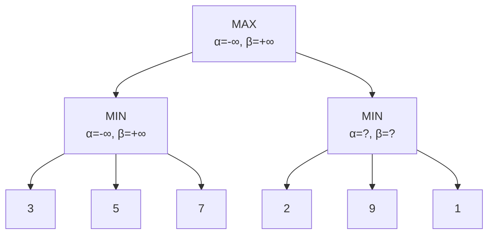

# Giải Thuật Cắt Tỉa Alpha-Beta

> **Tác giả:** FPTOJ Team<br>
> **Nội dung tham khảo từ:** CP-Algorithms - Alpha-Beta Pruning

---

## 1. Bản chất vấn đề

### Bài toán: Tối ưu hoá cây trò chơi

Trong trò chơi 2 người (Minimax), cây trò chơi có độ sâu $d$ và hệ số phân nhánh $b$. Thuật toán Minimax thường duyệt $O(b^d)$ nút.

**Alpha-Beta Pruning:** Cắt tỉa các nhánh không ảnh hưởng kết quả $\Rightarrow$ giảm xuống $O(b^{d/2})$ trong trường hợp tốt nhất.

### So sánh

| Thuật toán | Worst case | Best case |
|------------|-----------|-----------|
| Minimax | $O(b^d)$ | $O(b^d)$ |
| **Alpha-Beta** | $O(b^d)$ | $O(b^{d/2})$ |

---

## 2. Tư duy cốt lõi

### Ý tưởng: Cắt tỉa bằng khoảng $[\alpha, \beta]$

- $\alpha$: giá trị tốt nhất mà **MAX** player có thể đảm bảo (khởi tạo $-\infty$).
- $\beta$: giá trị tốt nhất mà **MIN** player có thể đảm bảo (khởi tạo $+\infty$).

**Cắt tỉa:** Nếu $\alpha \ge \beta$, nhánh hiện tại không thể ảnh hưởng kết quả → bỏ qua.

### Trace chi tiết

Cây trò chơi (MAX đi trước):



**Chạy Alpha-Beta:**

| Bước | Nút | Loại | $\alpha$ | $\beta$ | Giá trị | Cắt tỉa? |
|------|-----|------|----------|---------|---------|----------|
| 1 | D | Lá | — | — | 3 | |
| 2 | E | Lá | — | — | 5 | |
| 3 | F | Lá | — | — | 7 | |
| 4 | B (MIN) | MIN | — | — | $\min(3,5,7) = 3$ | |
| 5 | A (MAX) | MAX | $\alpha = 3$ | — | 3 | |
| 6 | G | Lá | — | — | 2 | $2 < \alpha = 3$ → **Cắt!** |
| 7 | C (MIN) | MIN | — | — | $\min(2, \ldots) = 2$ | |
| 8 | A (MAX) | MAX | — | — | $\max(3, 2) = 3$ | |

Kết quả: MAX chọn giá trị 3. Nhánh $H$ và $I$ bị cắt vì $G$ đã cho giá trị 2 < $\alpha = 3$.

---

## 3. Phân tích tính đúng đắn

### Tại sao cắt tỉa đúng?

Nếu tại nút MIN, giá trị hiện tại $v \le \alpha$ (giá trị tốt nhất của MAX ở nút tổ tiên), thì MAX đã có cách đạt $\alpha$. Nút MIN sẽ không chọn giá trị $> v$ (vì MIN muốn minimize). Do đó, MAX không bao giờ chọn nhánh này → cắt an toàn.

---

## 4. Đánh giá độ phức tạp

| Trường hợp | Thời gian |
|------------|-----------|
| Best case (tối ưu thứ tự) | $O(b^{d/2})$ |
| Worst case | $O(b^d)$ |

---

## Code minh họa

=== "C++"

    ```cpp
    #include <bits/stdc++.h>
    using namespace std;

    vector<vector<int>> tree;
    vector<int> values; // giá trị nút lá

    int alphaBeta(int node, int depth, int alpha, int beta, bool maximizing) {
        if (tree[node].empty()) {
            return values[node]; // giá trị lá
        }

        if (maximizing) {
            int val = INT_MIN;
            for (int child : tree[node]) {
                val = max(val, alphaBeta(child, depth + 1, alpha, beta, false));
                alpha = max(alpha, val);
                if (alpha >= beta) break; // Cắt tỉa Beta
            }
            return val;
        } else {
            int val = INT_MAX;
            for (int child : tree[node]) {
                val = min(val, alphaBeta(child, depth + 1, alpha, beta, true));
                beta = min(beta, val);
                if (alpha >= beta) break; // Cắt tỉa Alpha
            }
            return val;
        }
    }

    int main() {
        // Ví dụ đơn giản: cây 3 nút
        // Nút 0: MAX, con 1, 2
        // Nút 1: MIN, con 3, 4, 5 (lá: 3, 5, 7)
        // Nút 2: MIN, con 6, 7, 8 (lá: 2, 9, 1)

        tree.resize(9);
        values.resize(9, 0);

        tree[0] = {1, 2};
        tree[1] = {3, 4, 5};
        tree[2] = {6, 7, 8};
        // Giá trị lá
        values[3] = 3; values[4] = 5; values[5] = 7;
        values[6] = 2; values[7] = 9; values[8] = 1;

        cout << alphaBeta(0, 0, INT_MIN, INT_MAX, true) << "\n";
        return 0;
    }
    ```

=== "Python"

    ```python
    import sys
    sys.setrecursionlimit(10000)

    def alpha_beta(node, depth, alpha, beta, maximizing, tree, values):
        if not tree[node]:
            return values[node]

        if maximizing:
            val = float('-inf')
            for child in tree[node]:
                val = max(val, alpha_beta(child, depth + 1, alpha, beta, False, tree, values))
                alpha = max(alpha, val)
                if alpha >= beta:
                    break
            return val
        else:
            val = float('inf')
            for child in tree[node]:
                val = min(val, alpha_beta(child, depth + 1, alpha, beta, True, tree, values))
                beta = min(beta, val)
                if alpha >= beta:
                    break
            return val

    # Ví dụ: cây trò chơi
    tree = {
        0: [1, 2],
        1: [3, 4, 5],
        2: [6, 7, 8],
        3: [], 4: [], 5: [], 6: [], 7: [], 8: []
    }
    values = {3: 3, 4: 5, 5: 7, 6: 2, 7: 9, 8: 1}

    print(alpha_beta(0, 0, float('-inf'), float('inf'), True, tree, values))
    ```
