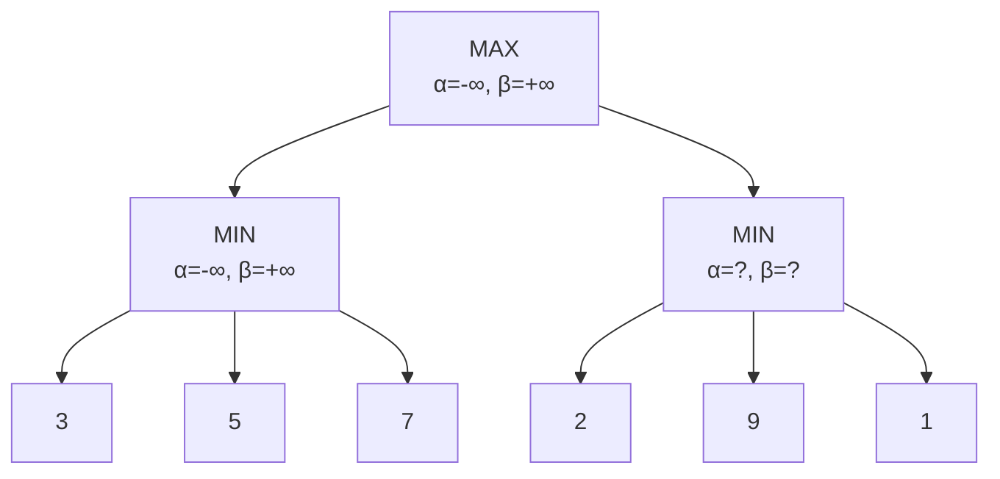
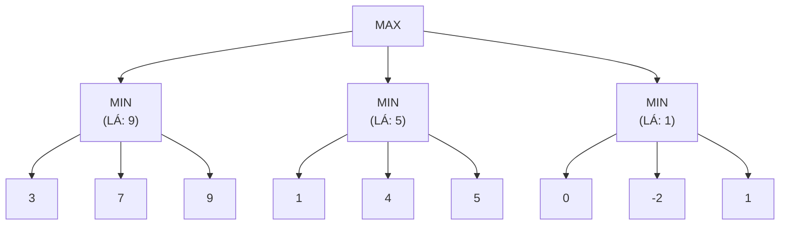

# Giải Thuật Cắt Tỉa Alpha-Beta

> **Tác giả:** FPTOJ Team<br>
> **Nội dung tham khảo từ:** CP-Algorithms - Alpha-Beta Pruning

---

## 1. Bản chất vấn đề

### Bài toán: Tối ưu hoá cây trò chơi

Trong trò chơi 2 người (Minimax), cây trò chơi có độ sâu $d$ và hệ số phân nhánh $b$. Thuật toán Minimax thường duyệt $O(b^d)$ nút.

**Alpha-Beta Pruning:** Cắt tỉa các nhánh không ảnh hưởng kết quả $\Rightarrow$ giảm xuống $O(b^{d/2})$ trong trường hợp tốt nhất.

### So sánh

| Thuật toán | Worst case | Best case |
|------------|-----------|-----------|
| Minimax | $O(b^d)$ | $O(b^d)$ |
| **Alpha-Beta** | $O(b^d)$ | $O(b^{d/2})$ |

---

## 2. Tư duy cốt lõi

### Ý tưởng: Cắt tỉa bằng khoảng $[\alpha, \beta]$

- $\alpha$: giá trị tốt nhất mà **MAX** player có thể đảm bảo (khởi tạo $-\infty$).
- $\beta$: giá trị tốt nhất mà **MIN** player có thể đảm bảo (khởi tạo $+\infty$).

**Cắt tỉa:** Nếu $\alpha \ge \beta$, nhánh hiện tại không thể ảnh hưởng kết quả → bỏ qua.

### Trace chi tiết

Cây trò chơi (MAX đi trước):


```mermaid
graph TD
    A["MAX\nα=-∞, β=+∞"] --> B["MIN\nα=-∞, β=+∞"]
    A --> C["MIN\nα=?, β=?"]
    B --> D["3"]
    B --> E["5"]
    B --> F["7"]
    C --> G["2"]
    C --> H["9"]
    C --> I["1"]
```

**Chạy Alpha-Beta:**

| Bước | Nút | Loại | $\alpha$ | $\beta$ | Giá trị | Cắt tỉa? |
|------|-----|------|----------|---------|---------|----------|
| 1 | D | Lá | — | — | 3 | |
| 2 | E | Lá | — | — | 5 | |
| 3 | F | Lá | — | — | 7 | |
| 4 | B (MIN) | MIN | — | — | $\min(3,5,7) = 3$ | |
| 5 | A (MAX) | MAX | $\alpha = 3$ | — | 3 | |
| 6 | G | Lá | — | — | 2 | $2 < \alpha = 3$ → **Cắt!** |
| 7 | C (MIN) | MIN | — | — | $\min(2, \ldots) = 2$ | |
| 8 | A (MAX) | MAX | — | — | $\max(3, 2) = 3$ | |

Kết quả: MAX chọn giá trị 3. Nhánh $H$ và $I$ bị cắt vì $G$ đã cho giá trị 2 < $\alpha = 3$.

---

## 3. Phân tích tính đúng đắn

### Tại sao cắt tỉa đúng?

Nếu tại nút MIN, giá trị hiện tại $v \le \alpha$ (giá trị tốt nhất của MAX ở nút tổ tiên), thì MAX đã có cách đạt $\alpha$. Nút MIN sẽ không chọn giá trị $> v$ (vì MIN muốn minimize). Do đó, MAX không bao giờ chọn nhánh này → cắt an toàn.

---

## 4. Đánh giá độ phức tạp

| Trường hợp | Thời gian |
|------------|-----------|
| Best case (tối ưu thứ tự) | $O(b^{d/2})$ |
| Worst case | $O(b^d)$ |

---

## Code minh họa

=== "C++"

    ```cpp
    #include <bits/stdc++.h>
    using namespace std;

    vector<vector<int>> tree;   // Cây trò chơi: danh sách kề cha → con
    vector<int> values;         // Giá trị của các nút lá

    // Hàm Alpha-Beta: duyệt cây trò chơi, trả về giá trị tối ưu
    // node: nút hiện tại, depth: độ sâu, alpha/beta: cửa sổ cắt tỉa
    // maximizing: true nếu lượt MAX, false nếu lượt MIN
    int alphaBeta(int node, int depth, int alpha, int beta, bool maximizing) {
        if (tree[node].empty()) {               // Nút lá: trả về giá trị cố định
            return values[node];
        }

        if (maximizing) {                       // Lượt của MAX player
            int val = INT_MIN;                  // Khởi tạo giá trị thấp nhất có thể
            for (int child : tree[node]) {      // Duyệt tất cả con
                val = max(val, alphaBeta(child, depth + 1, alpha, beta, false));
                alpha = max(alpha, val);         // Cập nhật alpha = giá trị tốt nhất của MAX
                if (alpha >= beta) break;        // Cắt tỉa Beta: nhánh này vô ích cho MAX
            }
            return val;
        } else {                                // Lượt của MIN player
            int val = INT_MAX;                  // Khởi tạo giá trị cao nhất có thể
            for (int child : tree[node]) {      // Duyệt tất cả con
                val = min(val, alphaBeta(child, depth + 1, alpha, beta, true));
                beta = min(beta, val);           // Cập nhật beta = giá trị tốt nhất của MIN
                if (alpha >= beta) break;        // Cắt tỉa Alpha: nhánh này vô ích cho MIN
            }
            return val;
        }
    }

    int main() {
        // Ví dụ đơn giản: cây 3 nút
        // Nút 0: MAX, con 1, 2
        // Nút 1: MIN, con 3, 4, 5 (lá: 3, 5, 7)
        // Nút 2: MIN, con 6, 7, 8 (lá: 2, 9, 1)

        tree.resize(9);
        values.resize(9, 0);

        tree[0] = {1, 2};       // MAX có 2 lựa chọn
        tree[1] = {3, 4, 5};    // MIN có 3 lựa chọn nhánh trái
        tree[2] = {6, 7, 8};    // MIN có 3 lựa chọn nhánh phải
        // Giá trị các nút lá
        values[3] = 3; values[4] = 5; values[5] = 7;
        values[6] = 2; values[7] = 9; values[8] = 1;

        cout << alphaBeta(0, 0, INT_MIN, INT_MAX, true) << "\n"; // Kết quả = 3
        return 0;
    }
    ```

=== "Python"

    ```python
    import sys
    sys.setrecursionlimit(10000)   # Tăng giới hạn đệ quy cho cây lớn

    # Hàm Alpha-Beta: duyệt cây trò chơi, trả về giá trị tối ưu
    # node: nút hiện tại, depth: độ sâu, alpha/beta: cửa sổ cắt tỉa
    # maximizing: True nếu MAX, False nếu MIN
    def alpha_beta(node, depth, alpha, beta, maximizing, tree, values):
        if not tree[node]:          # Nút lá: trả về giá trị
            return values[node]

        if maximizing:              # Lượt MAX
            val = float('-inf')     # Khởi tạo giá trị thấp nhất
            for child in tree[node]:
                # Đệ quy xuống nút MIN con
                val = max(val, alpha_beta(child, depth + 1, alpha, beta, False, tree, values))
                alpha = max(alpha, val)   # Cập nhật alpha
                if alpha >= beta:         # Cắt tỉa Beta
                    break
            return val
        else:                       # Lượt MIN
            val = float('inf')      # Khởi tạo giá trị cao nhất
            for child in tree[node]:
                # Đệ quy xuống nút MAX con
                val = min(val, alpha_beta(child, depth + 1, alpha, beta, True, tree, values))
                beta = min(beta, val)     # Cập nhật beta
                if alpha >= beta:         # Cắt tỉa Alpha
                    break
            return val

    # Ví dụ cây trò chơi 9 nút (3 tầng)
    tree = {
        0: [1, 2],          # MAX: 2 lựa chọn → MIN, MIN
        1: [3, 4, 5],       # MIN trái: 3 lựa chọn
        2: [6, 7, 8],       # MIN phải: 3 lựa chọn
        3: [], 4: [], 5: [], 6: [], 7: [], 8: []
    }
    values = {3: 3, 4: 5, 5: 7, 6: 2, 7: 9, 8: 1}

    print(alpha_beta(0, 0, float('-inf'), float('inf'), True, tree, values))
    ```

### Ví dụ nâng cao: Cây 4 tầng với thứ tự tối ưu

Xét cây trò chơi có độ sâu 4, hệ số phân nhánh 3 (81 nút lá). Nếu sắp xếp con theo thứ tự giảm dần (tốt nhất cho MAX trước), Alpha-Beta chỉ duyệt ~15 nút lá thay vì 81.


```mermaid
graph TD
    A["MAX"] --> B1["MIN\n(LÁ: 9)"]
    A --> B2["MIN\n(LÁ: 5)"]
    A --> B3["MIN\n(LÁ: 1)"]
    B1 --> C1["3"]
    B1 --> C2["7"]
    B1 --> C3["9"]
    B2 --> C4["1"]
    B2 --> C5["4"]
    B2 --> C6["5"]
    B3 --> C7["0"]
    B3 --> C8["-2"]
    B3 --> C9["1"]
```

Khi quét từ trái sang phải: nút $B1$ trả về 9 → $\alpha = 9$. Nút $B2$: lá đầu là 1 < 9 → cắt toàn bộ nhánh $B2$. Tương tự $B3$: lá đầu là 0 < 9 → cắt. Chỉ cần đánh giá 1/3 số nút.

---

## Bài tập luyện tập

| Mã bài | Tên bài tập | Độ khó | Kiểu bài tập (Bản chất) | Bài học lý thuyết |
| :--- | :--- | :---: | :--- | :--- |
| `ab-win-game` | [Trò chơi thắng](https://fptoj.com/problem/ab-win-game) | ⭐ | Alpha-Beta - Trò chơi thắng cơ bản | [Alpha-Beta Pruning](alpha-beta.md) |
| `ab-minimax-basic` | [Cây game](https://fptoj.com/problem/ab-minimax-basic) | ⭐⭐ | Alpha-Beta - Minimax cơ bản | [Alpha-Beta Pruning](alpha-beta.md) |
| `ab-coin-pick` | [Nhặt xu](https://fptoj.com/problem/ab-coin-pick) | ⭐⭐ | Alpha-Beta - Nhặt xu 2 đầu | [Alpha-Beta Pruning](alpha-beta.md) |
| `ab-stone-div` | [Chia đá](https://fptoj.com/problem/ab-stone-div) | ⭐⭐⭐ | Alpha-Beta - Chia đá | [Alpha-Beta Pruning](alpha-beta.md) |
| `ab-subtract` | [Trừ số](https://fptoj.com/problem/ab-subtract) | ⭐⭐⭐ | Alpha-Beta - Trừ số | [Alpha-Beta Pruning](alpha-beta.md) |
| `ab-prime-game` | [Số nguyên tố](https://fptoj.com/problem/ab-prime-game) | ⭐⭐⭐ | Alpha-Beta - Xóa ước nguyên tố | [Alpha-Beta Pruning](alpha-beta.md) |
| `ab-tree-game` | [Game trên cây](https://fptoj.com/problem/ab-tree-game) | ⭐⭐⭐⭐ | Alpha-Beta - Game trên cây | [Alpha-Beta Pruning](alpha-beta.md) |
| `ab-coloring` | [Tô màu](https://fptoj.com/problem/ab-coloring) | ⭐⭐⭐⭐ | Alpha-Beta - Tô màu đồ thị | [Alpha-Beta Pruning](alpha-beta.md) |
| `ab-divisor` | [Ước số](https://fptoj.com/problem/ab-divisor) | ⭐⭐⭐⭐ | Alpha-Beta - Chia ước số | [Alpha-Beta Pruning](alpha-beta.md) |
