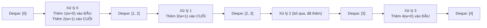

# BFS 0-1 - Tìm Đường Đi Ngắn Nhất Với Trọng Số 0/1

> **Tác giả:** FPTOJ Team<br>
> **Nội dung tham khảo từ:** VNOI Wiki, CP-Algorithms - 0-1 BFS

---

## 1. Bản chất vấn đề

### Bài toán: Tìm đường đi ngắn nhất trên đồ thị trọng số 0/1

Cho đồ thị $N$ đỉnh, $M$ cạnh, mỗi cạnh có trọng số **0 hoặc 1**. Tìm đường đi ngắn nhất từ đỉnh $S$ đến tất cả các đỉnh.

**Dijkstra:** $O(M \log N)$ — chấp nhận được.

**BFS 0-1:** $O(N + M)$ — nhanh hơn! Không cần priority queue.

### Khi nào dùng BFS 0-1?

| Tình huống | Mô tả |
|------------|-------|
| Trọng số cạnh chỉ là 0 hoặc 1 | Ví dụ: đảo bit, bật/tắt công tắc |
| Bài toán "chi phí đổi trạng thái" | Mỗi bước có chi phí 0 (giữ nguyên) hoặc 1 (đổi) |
| Grid với ô đi được / không đi được | Đi qua ô trống = 0, phá tường = 1 |

---

## 2. Tư duy cốt lõi

### Ý tưởng: Deque thay vì Priority Queue

BFS thường dùng queue (tất cả cạnh trọng số 1). BFS 0-1 dùng **deque**:

- Cạnh trọng số 0: **đẩy vào đầu** deque (giống BFS thường — ưu tiên).
- Cạnh trọng số 1: **đẩy vào cuối** deque (chậm hơn 1 bước).

Điều này đảm bảo: đỉnh được xử lý theo thứ tự khoảng cách tăng dần (tương tự Dijkstra).

### Trace chi tiết

**Đồ thị:** 5 đỉnh, cạnh có trọng số 0/1.

| Cạnh | Trọng số |
|------|----------|
| $0 \to 1$ | 0 |
| $0 \to 2$ | 1 |
| $1 \to 3$ | 1 |
| $2 \to 3$ | 0 |
| $3 \to 4$ | 0 |

**Tìm đường ngắn nhất từ đỉnh 0:**

| Bước | Deque (trái → phải) | Xử lý đỉnh | Cập nhật | dist[] |
|------|---------------------|-------------|----------|--------|
| 0 | $[0]$ | 0 | $dist[0] = 0$, thêm 1 vào đầu (w=0), thêm 2 vào cuối (w=1) | $[0, \infty, \infty, \infty, \infty]$ |
| 1 | $[1, 2]$ → pop 1 | 1 | $dist[1] = 0$, thêm 3 vào cuối (w=1) | $[0, 0, \infty, \infty, \infty]$ |
| 2 | $[2, 3]$ → pop 2 | 2 | $dist[2] = 1$, không thêm gì mới | $[0, 0, 1, \infty, \infty]$ |
| 3 | $[3]$ → pop 3 | 3 | $dist[3] = 1$, thêm 4 vào đầu (w=0) | $[0, 0, 1, 1, \infty]$ |
| 4 | $[4]$ → pop 4 | 4 | $dist[4] = 1$ | $[0, 0, 1, 1, 1]$ |

**Kết quả:** $dist = [0, 0, 1, 1, 1]$

### Minh họa deque



---

## 3. Phân tích tính đúng đắn

### Tại sao Deque đảm bảo đúng?

**Bất biến:** Khi xử lý đỉnh $u$, $dist[u]$ đã là khoảng cách ngắn nhất.

**Chứng minh:** Các đỉnh trong deque được sắp xếp theo khoảng cách không giảm:

- Cạnh w=0: đỉnh mới có cùng khoảng cách → đẩy vào đầu (trước các đỉnh có khoảng cách lớn hơn).
- Cạnh w=1: đỉnh mới có khoảng cách +1 → đẩy vào cuối (sau các đỉnh có khoảng cách hiện tại).

Tương tự Dijkstra với priority queue, nhưng khai thác trọng số 0/1 để dùng deque thay vì heap.

---

## 4. Đánh giá độ phức tạp

| Thuật toán | Thời gian | Không gian |
|------------|-----------|------------|
| Dijkstra | $O(M \log N)$ | $O(N + M)$ |
| **BFS 0-1** | $O(N + M)$ | $O(N + M)$ |
| Bellman-Ford | $O(NM)$ | $O(N + M)$ |

---

## Code minh họa

=== "C++"

    ```cpp
    #include <bits/stdc++.h>
    using namespace std;

    int main() {
        ios_base::sync_with_stdio(false);
        cin.tie(NULL);

        int n, m;
        cin >> n >> m;

        vector<vector<pair<int,int>>> adj(n);
        for (int i = 0; i < m; i++) {
            int u, v, w;
            cin >> u >> v >> w;
            adj[u].push_back({v, w});
            adj[v].push_back({u, w}); // nếu đồ thị vô hướng
        }

        int s;
        cin >> s;

        vector<int> dist(n, INT_MAX);
        dist[s] = 0;
        deque<int> dq;
        dq.push_front(s);

        while (!dq.empty()) {
            int u = dq.front();
            dq.pop_front();

            for (auto [v, w] : adj[u]) {
                if (dist[u] + w < dist[v]) {
                    dist[v] = dist[u] + w;
                    if (w == 0)
                        dq.push_front(v);
                    else
                        dq.push_back(v);
                }
            }
        }

        for (int i = 0; i < n; i++) {
            cout << (dist[i] == INT_MAX ? -1 : dist[i]) << " ";
        }
        cout << "\n";
        return 0;
    }
    ```

=== "Python"

    ```python
    from collections import deque
    import sys
    input = sys.stdin.readline

    n, m = map(int, input().split())
    adj = [[] for _ in range(n)]
    for _ in range(m):
        u, v, w = map(int, input().split())
        adj[u].append((v, w))
        adj[v].append((u, w))

    s = int(input())
    dist = [float('inf')] * n
    dist[s] = 0
    dq = deque([s])

    while dq:
        u = dq.popleft()
        for v, w in adj[u]:
            if dist[u] + w < dist[v]:
                dist[v] = dist[u] + w
                if w == 0:
                    dq.appendleft(v)
                else:
                    dq.append(v)

    print(' '.join(str(d if d != float('inf') else -1) for d in dist))
    ```
