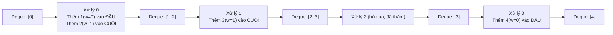

# BFS 0-1 - Tìm Đường Đi Ngắn Nhất Với Trọng Số 0/1

> **Tác giả:** FPTOJ Team<br>
> **Nội dung tham khảo từ:** VNOI Wiki, CP-Algorithms - 0-1 BFS

---

## 1. Bản chất vấn đề

### Bài toán: Tìm đường đi ngắn nhất trên đồ thị trọng số 0/1

Cho đồ thị $N$ đỉnh, $M$ cạnh, mỗi cạnh có trọng số **0 hoặc 1**. Tìm đường đi ngắn nhất từ đỉnh $S$ đến tất cả các đỉnh.

**Dijkstra:** $O(M \log N)$ — chấp nhận được.

**BFS 0-1:** $O(N + M)$ — nhanh hơn! Không cần priority queue.

### Khi nào dùng BFS 0-1?

| Tình huống | Mô tả |
|------------|-------|
| Trọng số cạnh chỉ là 0 hoặc 1 | Ví dụ: đảo bit, bật/tắt công tắc |
| Bài toán "chi phí đổi trạng thái" | Mỗi bước có chi phí 0 (giữ nguyên) hoặc 1 (đổi) |
| Grid với ô đi được / không đi được | Đi qua ô trống = 0, phá tường = 1 |

---

## 2. Tư duy cốt lõi

### Ý tưởng: Deque thay vì Priority Queue

BFS thường dùng queue (tất cả cạnh trọng số 1). BFS 0-1 dùng **deque**:

- Cạnh trọng số 0: **đẩy vào đầu** deque (giống BFS thường — ưu tiên).
- Cạnh trọng số 1: **đẩy vào cuối** deque (chậm hơn 1 bước).

Điều này đảm bảo: đỉnh được xử lý theo thứ tự khoảng cách tăng dần (tương tự Dijkstra).

### Trace chi tiết

**Đồ thị:** 5 đỉnh, cạnh có trọng số 0/1.

| Cạnh | Trọng số |
|------|----------|
| $0 \to 1$ | 0 |
| $0 \to 2$ | 1 |
| $1 \to 3$ | 1 |
| $2 \to 3$ | 0 |
| $3 \to 4$ | 0 |

**Tìm đường ngắn nhất từ đỉnh 0:**

| Bước | Deque (trái → phải) | Xử lý đỉnh | Cập nhật | dist[] |
|------|---------------------|-------------|----------|--------|
| 0 | $[0]$ | 0 | $dist[0] = 0$, thêm 1 vào đầu (w=0), thêm 2 vào cuối (w=1) | $[0, \infty, \infty, \infty, \infty]$ |
| 1 | $[1, 2]$ → pop 1 | 1 | $dist[1] = 0$, thêm 3 vào cuối (w=1) | $[0, 0, \infty, \infty, \infty]$ |
| 2 | $[2, 3]$ → pop 2 | 2 | $dist[2] = 1$, không thêm gì mới | $[0, 0, 1, \infty, \infty]$ |
| 3 | $[3]$ → pop 3 | 3 | $dist[3] = 1$, thêm 4 vào đầu (w=0) | $[0, 0, 1, 1, \infty]$ |
| 4 | $[4]$ → pop 4 | 4 | $dist[4] = 1$ | $[0, 0, 1, 1, 1]$ |

**Kết quả:** $dist = [0, 0, 1, 1, 1]$

### Minh họa deque


```mermaid
flowchart LR
    A["Deque: [0]"] --> B["Xử lý 0\nThêm 1(w=0) vào ĐẦU\nThêm 2(w=1) vào CUỐI"]
    B --> C["Deque: [1, 2]"]
    C --> D["Xử lý 1\nThêm 3(w=1) vào CUỐI"]
    D --> E["Deque: [2, 3]"]
    E --> F["Xử lý 2 (bỏ qua, đã thăm)"]
    F --> G["Deque: [3]"]
    G --> H["Xử lý 3\nThêm 4(w=0) vào ĐẦU"]
    H --> I["Deque: [4]"]
```

---

## 3. Phân tích tính đúng đắn

### Tại sao Deque đảm bảo đúng?

**Bất biến:** Khi xử lý đỉnh $u$, $dist[u]$ đã là khoảng cách ngắn nhất.

**Chứng minh:** Các đỉnh trong deque được sắp xếp theo khoảng cách không giảm:

- Cạnh w=0: đỉnh mới có cùng khoảng cách → đẩy vào đầu (trước các đỉnh có khoảng cách lớn hơn).
- Cạnh w=1: đỉnh mới có khoảng cách +1 → đẩy vào cuối (sau các đỉnh có khoảng cách hiện tại).

Tương tự Dijkstra với priority queue, nhưng khai thác trọng số 0/1 để dùng deque thay vì heap.

---

## 4. Đánh giá độ phức tạp

| Thuật toán | Thời gian | Không gian |
|------------|-----------|------------|
| Dijkstra | $O(M \log N)$ | $O(N + M)$ |
| **BFS 0-1** | $O(N + M)$ | $O(N + M)$ |
| Bellman-Ford | $O(NM)$ | $O(N + M)$ |

---

## Code minh họa

=== "C++"

    ```cpp
    #include <bits/stdc++.h>
    using namespace std;

    int main() {
        ios_base::sync_with_stdio(false);   // Tăng tốc I/O
        cin.tie(NULL);

        int n, m;
        cin >> n >> m;

        // Danh sách kề: adj[u] = vector các cặp (v, w)
        vector<vector<pair<int,int>>> adj(n);
        for (int i = 0; i < m; i++) {
            int u, v, w;
            cin >> u >> v >> w;
            adj[u].push_back({v, w});        // Cạnh u → v với trọng số w
            adj[v].push_back({u, w});        // Cạnh ngược lại (đồ thị vô hướng)
        }

        int s;
        cin >> s;                            // Đỉnh xuất phát

        vector<int> dist(n, INT_MAX);        // dist[v] = khoảng cách ngắn nhất từ s đến v
        dist[s] = 0;                         // Khoảng cách từ s đến chính nó = 0
        deque<int> dq;                       // Deque thay thế priority queue
        dq.push_front(s);                    // Khởi tạo deque với đỉnh xuất phát

        while (!dq.empty()) {
            int u = dq.front();              // Lấy đỉnh ở đầu deque (ưu tiên khoảng cách nhỏ)
            dq.pop_front();

            for (auto [v, w] : adj[u]) {     // Duyệt tất cả đỉnh kề của u
                if (dist[u] + w < dist[v]) { // Nếu tìm được đường đi ngắn hơn đến v
                    dist[v] = dist[u] + w;   // Cập nhật khoảng cách
                    if (w == 0)
                        dq.push_front(v);    // Cạnh trọng số 0: đẩy vào ĐẦU deque
                    else
                        dq.push_back(v);     // Cạnh trọng số 1: đẩy vào CUỐI deque
                }
            }
        }

        // In kết quả: -1 nếu không thể đến được
        for (int i = 0; i < n; i++) {
            cout << (dist[i] == INT_MAX ? -1 : dist[i]) << " ";
        }
        cout << "\n";
        return 0;
    }
    ```

=== "Python"

    ```python
    from collections import deque
    import sys
    input = sys.stdin.readline                        # Tăng tốc I/O

    n, m = map(int, input().split())
    adj = [[] for _ in range(n)]                      # Danh sách kề: adj[u] = [(v, w), ...]
    for _ in range(m):
        u, v, w = map(int, input().split())
        adj[u].append((v, w))                         # Cạnh u → v với trọng số w
        adj[v].append((u, w))                         # Cạnh ngược lại (đồ thị vô hướng)

    s = int(input())                                  # Đỉnh xuất phát
    dist = [float('inf')] * n                         # dist[v] = khoảng cách ngắn nhất từ s đến v
    dist[s] = 0                                       # Khoảng cách từ s đến chính nó = 0
    dq = deque([s])                                   # Deque thay thế priority queue

    while dq:
        u = dq.popleft()                              # Lấy đỉnh ở đầu deque (ưu tiên khoảng cách nhỏ)
        for v, w in adj[u]:                           # Duyệt tất cả đỉnh kề của u
            if dist[u] + w < dist[v]:                 # Nếu tìm được đường đi ngắn hơn đến v
                dist[v] = dist[u] + w                 # Cập nhật khoảng cách
                if w == 0:
                    dq.appendleft(v)                  # Cạnh trọng số 0: đẩy vào ĐẦU deque
                else:
                    dq.append(v)                      # Cạnh trọng số 1: đẩy vào CUỐI deque

    # In kết quả: -1 nếu không thể đến được
    print(' '.join(str(d if d != float('inf') else -1) for d in dist))
    ```

---

### Ví dụ thực tế: Tìm đường trong mê cung có cửa khóa

Xét lưới $3 \times 4$ với các ô trống (`.`) và tường (`#`). Đi qua ô trống tốn $0$, phá tường tốn $1$. Tìm chi phí nhỏ nhất từ $(0,0)$ đến $(2,3)$.

??? info "Mở rộng: Minh họa trên lưới"
    ```
    Lưới:               Chi phí tối ưu (dist):
    S . # G            [0]  [0]  [1]  [2]
    . # . .            [0]  [1]  [1]  [2]
    . . . #            [0]  [0]  [1]  [3]
    ```
    **Giải thích:** Đi từ `(0,0)` xuống $(1,0)$ rồi xuống $(2,0)$ (chi phí $0$). Từ $(2,0)$ qua $(2,1)$ (chi phí $0$), phá tường ở $(1,1)$ (chi phí $1$). Tuy nhiên đường đi tối ưu là: $(0,0) \rightarrow (0,1)$ (0), $\rightarrow$ phá tường $(0,2)$ (1), $\rightarrow (0,3)$ (0). Tổng $= 1$! Cần chạy BFS 0-1 để kiểm tra chính xác.

    **Quy ước trên lưới:**
    - Ô trống `.`: trọng số $0$ khi di chuyển từ ô lân cận sang
    - Tường `#`: trọng số $1$ khi đi qua (phá tường)
    - 4 hướng di chuyển: lên, xuống, trái, phải

    **Cài đặt trên lưới:**
    
    === "C++"
        ```cpp
        int dx[] = {0, 0, 1, -1};                  // 4 hướng: phải, trái, xuống, lên
        int dy[] = {1, -1, 0, 0};

        vector<vector<int>> dist(row, vector<int>(col, INT_MAX));
        dist[startX][startY] = 0;
        deque<pair<int,int>> dq;
        dq.push_front({startX, startY});           // Bắt đầu từ ô xuất phát
        while (!dq.empty()) {
            auto [x, y] = dq.front();
            dq.pop_front();
            for (int d = 0; d < 4; d++) {
                int nx = x + dx[d], ny = y + dy[d];
                if (nx < 0 || nx >= row || ny < 0 || ny >= col) continue;
                int w = (grid[nx][ny] == '#') ? 1 : 0; // Phá tường = 1, ô trống = 0
                if (dist[x][y] + w < dist[nx][ny]) {
                    dist[nx][ny] = dist[x][y] + w;
                    if (w == 0) dq.push_front({nx, ny}); // Ô trống: đẩy đầu
                    else        dq.push_back({nx, ny});  // Tường: đẩy cuối
                }
            }
        }
        ```
    
    === "Python"
        ```python
        dx = [0, 0, 1, -1]                         # 4 hướng: phải, trái, xuống, lên
        dy = [1, -1, 0, 0]

        dist = [[float('inf')] * col for _ in range(row)]
        dist[startX][startY] = 0
        dq = deque([(startX, startY)])             # Bắt đầu từ ô xuất phát
        while dq:
            x, y = dq.popleft()
            for d in range(4):
                nx, ny = x + dx[d], y + dy[d]
                if not (0 <= nx < row and 0 <= ny < col):
                    continue
                w = 1 if grid[nx][ny] == '#' else 0  # Phá tường = 1, ô trống = 0
                if dist[x][y] + w < dist[nx][ny]:
                    dist[nx][ny] = dist[x][y] + w
                    if w == 0:
                        dq.appendleft((nx, ny))    # Ô trống: đẩy đầu
                    else:
                        dq.append((nx, ny))        # Tường: đẩy cuối
        ```

---

## 5. Mẹo và lưu ý

### 5.1 Khi nào dùng BFS 0-1 thay vì Dijkstra?

| Tiêu chí | BFS 0-1 | Dijkstra |
|:---|:---|:---|
| Trọng số chỉ có $\{0, 1\}$ | ✅ Chọn BFS 0-1 | Dùng được nhưng chậm hơn |
| Trọng số có giá trị $> 1$ | ❌ Không dùng được | ✅ Bắt buộc dùng |
| Có trọng số âm | ❌ Không dùng được | ❌ Không dùng được (cần Bellman-Ford) |
| Tốc độ | $O(V+E)$ | $O((V+E)\log V)$ |
| Cài đặt | Đơn giản (deque) | Cần priority queue |

### 5.2 Cạm bẫy thường gặp

- **Quên đẩy vào đúng đầu/cuối:** Cạnh $w=0$ phải đẩy `push_front`, cạnh $w=1$ phải đẩy `push_back`. Nếu đảo ngược, thuật toán sẽ sai vì mất thứ tự ưu tiên khoảng cách.
- **Không kiểm tra `dist[u] + w < dist[v]`:** Một đỉnh có thể bị đẩy vào deque nhiều lần. Luôn kiểm tra điều kiện cập nhật trước khi đẩy vào deque để tránh vòng lặp vô hạn.
- **Nhầm với BFS thường:** BFS thường dùng queue và chỉ hoạt động đúng khi mọi cạnh có trọng số bằng nhau. Với trọng số $0/1$, BFS thường sẽ cho kết quả sai.
- **Đồ thị không liên thông:** Luôn khởi tạo `dist` với giá trị vô cùng và in `-1` cho các đỉnh không đến được.
- **Trọng số cạnh âm:** BFS 0-1 KHÔNG hoạt động với cạnh trọng số âm (kể cả $-1$). Thuật toán dựa trên tính chất khoảng cách không giảm của deque.

### 5.3 Mẹo tối ưu

- Dùng `deque` từ `<deque>` trong C++ hoặc `collections.deque` trong Python.
- Với bài toán trên lưới, mã hóa vị trí $(r,c)$ thành một số nguyên $r \times C + c$ để dùng deque 1 chiều thay vì deque chứa `pair`.
- Khi cần truy vết đường đi, lưu thêm mảng `parent[v]` và cập nhật mỗi khi `dist[v]` được cập nhật.
- Với đồ thị có hướng, bỏ dòng `adj[v].push_back({u, w})` trong code C++ và Python ở trên.

---

## 6. Bài tập luyện tập trên FPTOJ

Dưới đây là danh sách các bài tập thực hành về BFS ~0\text{-}1~ trên hệ thống [FPTOJ](https://fptoj.com) được thiết kế đồng bộ với bài học lý thuyết này:

| Mã bài | Tên bài tập | Độ khó | Kiểu bài tập (Bản chất) | Lời giải chi tiết (Editorial) |
| :--- | :--- | :---: | :--- | :--- |
| `bfs01-switch` | [Công tắc cửa ngầm](https://fptoj.com/problem/bfs01-switch) | ⭐⭐ | BFS ~0\text{-}1~ trên đồ thị có hướng | [Xem hướng dẫn](https://fptoj.com/problem/bfs01-switch/solution) |
| `bfs01-gridwall` | [Bình vượt mê cung](https://fptoj.com/problem/bfs01-gridwall) | ⭐⭐ | BFS ~0\text{-}1~ trên lưới ~2D~ | [Xem hướng dẫn](https://fptoj.com/problem/bfs01-gridwall/solution) |
| `bfs01-parity` | [Tuyến đường chẵn lẻ](https://fptoj.com/problem/bfs01-parity) | ⭐⭐ | BFS ~0\text{-}1~ trên đồ thị vô hướng | [Xem hướng dẫn](https://fptoj.com/problem/bfs01-parity/solution) |
| `bfs01-toll` | [Trạm thu phí xa lộ](https://fptoj.com/problem/bfs01-toll) | ⭐⭐ | BFS ~0\text{-}1~ trên đồ thị vô hướng | [Xem hướng dẫn](https://fptoj.com/problem/bfs01-toll/solution) |
| `bfs01-revedge` | [Tý đảo hướng đường](https://fptoj.com/problem/bfs01-revedge) | ⭐⭐⭐ | BFS ~0\text{-}1~ đảo chiều cạnh đồ thị | [Xem hướng dẫn](https://fptoj.com/problem/bfs01-revedge/solution) |
| `bfs01-stepup` | [Leo núi nhân tạo](https://fptoj.com/problem/bfs01-stepup) | ⭐⭐⭐ | BFS ~0\text{-}1~ trên lưới có cao độ | [Xem hướng dẫn](https://fptoj.com/problem/bfs01-stepup/solution) |
| `bfs01-teleport` | [Mạng lưới dịch chuyển](https://fptoj.com/problem/bfs01-teleport) | ⭐⭐⭐ | BFS ~0\text{-}1~ trên trục lộ ~1D~ và portal | [Xem hướng dẫn](https://fptoj.com/problem/bfs01-teleport/solution) |
| `bfs01-traffic` | [Ngã tư luồng ưu tiên](https://fptoj.com/problem/bfs01-traffic) | ⭐⭐⭐ | BFS ~0\text{-}1~ lưới với hướng ưu tiên | [Xem hướng dẫn](https://fptoj.com/problem/bfs01-traffic/solution) |
| `bfs01-turn` | [Lái xe ít rẽ nhất](https://fptoj.com/problem/bfs01-turn) | ⭐⭐⭐⭐ | BFS ~0\text{-}1~ lưới với 4 trạng thái hướng | [Xem hướng dẫn](https://fptoj.com/problem/bfs01-turn/solution) |
| `bfs01-subway` | [Đổi tàu điện ngầm](https://fptoj.com/problem/bfs01-subway) | ⭐⭐⭐⭐ | BFS ~0\text{-}1~ đồ thị ảo phân cấp | [Xem hướng dẫn](https://fptoj.com/problem/bfs01-subway/solution) |

