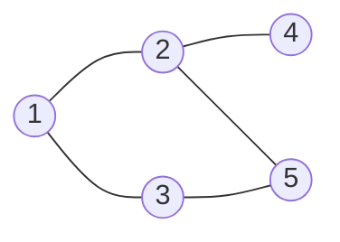

# Bài 10: BFS & DFS - Duyệt Đồ Thị

> **Tác giả:** FPTOJ Team<br>
> **Nội dung tham khảo từ:** VNOI Wiki - BFS, Cây DFS và ứng dụng, CP-Algorithms

## 1. Đồ thị là gì?

### Bản chất vấn đề

Thành phố có $N$ ngã tư (đỉnh), $M$ con đường (cạnh) nối các ngã tư. Muốn đi từ đỉnh $A$ đến đỉnh $B$ — cần thuật toán tìm đường.

**Đồ thị** là một cặp $G = (V, E)$ trong đó $V$ là tập đỉnh, $E$ là tập cạnh nối giữa các đỉnh.

### Các loại đồ thị

| Loại | Mô tả | Ví dụ thực tế |
|------|-------|---------------|
| **Vô hướng** | Cạnh không có chiều | Bạn bè trên Facebook |
| **Có hướng** | Cạnh có chiều | Theo dõi trên Twitter |
| **Có trọng số** | Cạnh có giá trị | Bản đồ (khoảng cách) |
| **Liên thông** | Đi được từ mọi đỉnh đến mọi đỉnh khác | Mạng internet |
| **Nhị phân** | Chia đỉnh thành 2 tập, cạnh chỉ nối 2 tập khác nhau | Phân công công việc |

### Biểu diễn đồ thị

**Cách 1: Danh sách kề** — phổ biến nhất, bộ nhớ $O(V + E)$.

=== "C++"

    ```cpp
    vector<int> adj[MAXN];
    adj[1].push_back(2);  // đỉnh 1 nối với đỉnh 2
    adj[2].push_back(1);  // đồ thị vô hướng → thêm cả chiều ngược

    // Duyệt đỉnh kề của u
    for (int v : adj[u]) {
        // xử lý v
    }
    ```

=== "Python"

    ```python
    from collections import defaultdict

    adj = defaultdict(list)
    adj[1].append(2)
    adj[2].append(1)

    for v in adj[u]:
        # xử lý v
        pass
    ```

**Cách 2: Ma trận kề** — dùng khi cần kiểm tra cạnh $O(1)$, bộ nhớ $O(V^2)$.

=== "C++"

    ```cpp
    int adj[MAXN][MAXN];
    adj[1][2] = 1;
    adj[2][1] = 1;

    if (adj[u][v]) { /* có cạnh */ }
    ```

=== "Python"

    ```python
    n = 100
    adj = [[0] * n for _ in range(n)]
    adj[1][2] = 1
    adj[2][1] = 1

    if adj[u][v]:
        pass
    ```

### So sánh hai cách biểu diễn

| Tiêu chí | Danh sách kề | Ma trận kề |
|----------|---------------|------------|
| Bộ nhớ | $O(V + E)$ | $O(V^2)$ |
| Kiểm tra cạnh | $O(\text{degree})$ | $O(1)$ |
| Duyệt đỉnh kề | $O(\text{degree})$ | $O(V)$ |
| Phổ biến | **Rất phổ biến** | Ít dùng |

**Quy tắc:** Luôn dùng danh sách kề trừ khi cần kiểm tra cạnh nhanh $O(1)$.

---

## 2. BFS — Duyệt theo chiều rộng

### Bản chất vấn đề

Cho đồ thị $G = (V, E)$ và đỉnh xuất phát $s$. Muốn thăm **tất cả đỉnh** reachable từ $s$, đồng thời tính **khoảng cách ngắn nhất** (theo số cạnh) từ $s$ đến mọi đỉnh.



### Tư duy cốt lõi

BFS sử dụng **hàng đợi (queue)** — cấu trúc dữ liệu FIFO (vào trước, ra trước).

**Ẩn dụ:** Thả hòn đá xuống hồ — sóng lan đồng đều. BFS cũng vậy: duyệt đỉnh cách 1 bước trước, rồi 2 bước, 3 bước...

**Các bước thực hiện:**

1. Cho đỉnh nguồn $s$ vào hàng đợi, đánh dấu đã thăm
2. Lấy đỉnh đầu hàng đợi ra → duyệt tất cả đỉnh kề **chưa thăm**
3. Đánh dấu đã thăm, tính khoảng cách, cho vào hàng đợi
4. Lặp lại cho đến khi hàng đợi rỗng

**Đặc điểm:** BFS luôn thăm đỉnh theo thứ tự **tầng** (level) — đỉnh cách 1 bước trước, rồi 2 bước, 3 bước...

### Cài đặt

=== "C++"

    ```cpp
    vector<int> adj[MAXN];
    bool visited[MAXN];
    int dist[MAXN];
    int parent[MAXN];

    void bfs(int start) {
        queue<int> q;
        q.push(start);
        visited[start] = true;
        dist[start] = 0;
        parent[start] = -1;

        while (!q.empty()) {
            int u = q.front();
            q.pop();

            for (int v : adj[u]) {
                if (!visited[v]) {
                    visited[v] = true;
                    dist[v] = dist[u] + 1;
                    parent[v] = u;
                    q.push(v);
                }
            }
        }
    }

    vector<int> getPath(int target) {
        vector<int> path;
        for (int v = target; v != -1; v = parent[v])
            path.push_back(v);
        reverse(path.begin(), path.end());
        return path;
    }
    ```

=== "Python"

    ```python
    from collections import deque

    def bfs(adj, start):
        n = len(adj)
        visited = [False] * n
        dist = [-1] * n
        parent = [-1] * n

        q = deque([start])
        visited[start] = True
        dist[start] = 0

        while q:
            u = q.popleft()
            for v in adj[u]:
                if not visited[v]:
                    visited[v] = True
                    dist[v] = dist[u] + 1
                    parent[v] = u
                    q.append(v)
        return dist, parent

    def get_path(parent, target):
        path = []
        v = target
        while v != -1:
            path.append(v)
            v = parent[v]
        path.reverse()
        return path
    ```

### Phân tích tính đúng đắn

**Tại sao BFS cho khoảng cách ngắn nhất trên đồ thị không trọng số?**

Gọi $d(v)$ là khoảng cách ngắn nhất từ $s$ đến $v$ (theo số cạnh).

**Bất biến quan trọng:** Khi đỉnh $v$ được lấy ra khỏi hàng đợi, $d(v)$ đã được xác định đúng.

**Chứng minh bằng induction:**

- **Base:** $d(s) = 0$ — đúng vì $s$ là đỉnh xuất phát.
- **Inductive step:** Giả sử mọi đỉnh có khoảng cách $\leq k$ đã được xác định đúng. Xét đỉnh $v$ có $d(v) = k + 1$. Khi đó tồn tại đỉnh $u$ với $d(u) = k$ sao cho $(u, v) \in E$. Theo giả thuyết induction, $u$ đã được xác định đúng. Khi $u$ được duyệt, $v$ sẽ được thăm và $d(v) = d(u) + 1 = k + 1$.

Vì BFS duyệt theo tầng (tất cả đỉnh cách $k$ bước trước đỉnh cách $k + 1$ bước), nên không có đỉnh cách ngắn hơn bị bỏ qua.

### Đánh giá độ phức tạp

- **Thời gian:** $O(V + E)$ — mỗi đỉnh được lấy ra khỏi hàng đợi đúng 1 lần, mỗi cạnh được xét đúng 2 lần (với đồ thị vô hướng).
- **Bộ nhớ:** $O(V)$ — hàng đợi chứa tối đa $V$ đỉnh, mảng `visited`, `dist`, `parent` mỗi mảng $O(V)$.

### Minh họa từng bước


| Bước | Hành động | Hàng đợi | Khoảng cách |
|------|-----------|----------|--------------|
| 1 | Lấy 1, thêm kề 2, 3 | $[2, 3]$ | $d[1]=0$ |
| 2 | Lấy 2, thêm kề 4, 5 | $[3, 4, 5]$ | $d[2]=1$ |
| 3 | Lấy 3, kề 5 đã thăm | $[4, 5]$ | $d[3]=1$ |
| 4 | Lấy 4, không kề mới | $[5]$ | $d[4]=2$ |
| 5 | Lấy 5, không kề mới | $[]$ | $d[5]=2$ |

Thứ tự thăm: $1 \to 2 \to 3 \to 4 \to 5$.

---

## 3. DFS — Duyệt theo chiều sâu

### Bản chất vấn đề

Cho đồ thị $G = (V, E)$ và đỉnh xuất phát $s$. Muốn thăm **tất cả đỉnh** reachable từ $s$ bằng cách đi **sâu** hết mức có thể trước khi quay lui.

### Tư duy cốt lõi

DFS sử dụng **ngăn xếp (stack)** — có thể cài đặt trực tiếp bằng đệ quy.

**Ẩn dụ:** Khám phá hang động — tại mỗi ngã rẽ, chọn 1 đường đi sâu hết mức. Đến đường cụt → quay lui → thử đường khác.

**Các bước thực hiện:**

1. Đánh dấu đỉnh hiện tại $u$ đã thăm
2. Duyệt tất cả đỉnh kề $v$ **chưa thăm**
3. Gọi đệ quy $\text{DFS}(v)$
4. Khi không còn đỉnh kề nào chưa thăm → quay lui

**Đặc điểm:** DFS đi **sâu** hết mức có thể trước khi quay lại. Không đảm bảo tìm đường ngắn nhất.

### Cài đặt

=== "C++"

    ```cpp
    vector<int> adj[MAXN];
    bool visited[MAXN];

    // Cách 1: Đệ quy (đơn giản)
    void dfs(int u) {
        visited[u] = true;
        for (int v : adj[u])
            if (!visited[v])
                dfs(v);
    }

    // Cách 2: Stack (không đệ quy, tránh tràn stack)
    void dfsIterative(int start) {
        stack<int> st;
        st.push(start);
        while (!st.empty()) {
            int u = st.top();
            st.pop();
            if (visited[u]) continue;
            visited[u] = true;
            for (int v : adj[u])
                if (!visited[v])
                    st.push(v);
        }
    }
    ```

=== "Python"

    ```python
    # Cách 1: Đệ quy (đơn giản)
    def dfs(adj, u, visited):
        visited[u] = True
        for v in adj[u]:
            if not visited[v]:
                dfs(adj, v, visited)

    # Cách 2: Stack (không đệ quy)
    def dfs_iterative(adj, start):
        n = len(adj)
        visited = [False] * n
        stack = [start]
        while stack:
            u = stack.pop()
            if visited[u]:
                continue
            visited[u] = True
            for v in adj[u]:
                if not visited[v]:
                    stack.append(v)
    ```

### Phân tích tính đúng đắn

**Tại sao DFS thăm đúng tất cả đỉnh reachable từ $s$?**

DFS thực hiện duyệt trên **cây DFS** (DFS Tree) — một cây spanning của thành phần liên thông chứa $s$.

**Chứng minh:**

1. **Mọi đỉnh reachable đều được thăm:** Giả sử tồn tại đỉnh $v$ reachable từ $s$ mà không được thăm. Khi đó tồn tại đường đi $s = v_0, v_1, \ldots, v_k = v$. Vì $v_0 = s$ được thăm, và nếu $v_i$ được thăm thì $v_{i+1}$ cũng sẽ được thăm (vì $v_{i+1}$ là đỉnh kề của $v_i$ chưa thăm). Theo induction, $v$ phải được thăm — mâu thuẫn.

2. **Mỗi đỉnh thăm đúng 1 lần:** Nhờ đánh dấu `visited` trước khi duyệt kề.

3. **Cây DFS không có chu trình:** Vì chỉ đi đến đỉnh chưa thăm, mỗi đỉnh có đúng 1 cha trong cây DFS.

### Đánh giá độ phức tạp

- **Thời gian:** $O(V + E)$ — mỗi đỉnh được thăm đúng 1 lần, mỗi cạnh được xét đúng 2 lần (vô hướng) hoặc 1 lần (có hướng).
- **Bộ nhớ:** $O(V)$ — stack đệ quy tối đa $V$ tầng, mảng `visited` $O(V)$.

### Minh họa từng bước


| Bước | Hành động | Đệ quy stack | Ghi chú |
|------|-----------|---------------|---------|
| 1 | Thăm 1 → gọi DFS(2) | $[1]$ | Đi sâu |
| 2 | Thăm 2 → gọi DFS(4) | $[1, 2]$ | Đi sâu |
| 3 | Thăm 4 → quay lui | $[1, 2, 4]$ | Đỉnh lá |
| 4 | Quay 2 → gọi DFS(5) | $[1, 2]$ | Thử nhánh khác |
| 5 | Thăm 5 → gọi DFS(3) | $[1, 2, 5]$ | Đi sâu |
| 6 | Thăm 3 → quay lui | $[1, 2, 5, 3]$ | Kề 1, 5 đã thăm |
| 7 | Quay hết → xong | $[]$ | Hoàn thành |

Thứ tự thăm: $1 \to 2 \to 4 \to 5 \to 3$.

---

## 4. So sánh BFS vs DFS

| Tiêu chí | BFS | DFS |
|----------|-----|-----|
| Cấu trúc dữ liệu | **Queue** (FIFO) | **Stack** / Đệ quy |
| Thứ tự duyệt | Lan rộng theo "tầng" | Đi sâu rồi quay lui |
| Đường ngắn nhất | **Có** (không trọng số) | Không đảm bảo |
| Bộ nhớ | $O(V)$ | $O(V)$ |
| Thời gian | $O(V + E)$ | $O(V + E)$ |

### Khi nào dùng BFS?

- Cần tìm **đường ngắn nhất** trong đồ thị không trọng số
- Duyệt theo **tầng** (level-order)
- Bài toán trên **lưới 2D** (tìm đường, flood fill)

### Khi nào dùng DFS?

- Kiểm tra **chu trình**
- **Sắp xếp tô-pô**
- Tìm **thành phần liên thông**
- Bài toán cần **quay lui** (backtracking)
- Đồ thị rất **sâu** (ít tốn bộ nhớ hơn BFS)

```matplotlib
V = np.linspace(10, 10000, 100)
E_sparse = V * 2
E_dense = V**2 / 4

bfs_sparse = V + E_sparse
dfs_sparse = V + E_sparse
bfs_dense = V + E_dense
dfs_dense = V + E_dense

fig, (ax1, ax2) = plt.subplots(1, 2, figsize=(12, 5))

ax1.plot(V, bfs_sparse, label='BFS (thưa, E≈2V)', color='#3498db', linewidth=2)
ax1.plot(V, dfs_sparse, label='DFS (thưa, E≈2V)', color='#e74c3c', linewidth=2, linestyle='--')
ax1.set_xlabel('Số đỉnh V')
ax1.set_ylabel('Thời gian O(V+E)')
ax1.set_title('BFS vs DFS trên đồ thị thưa')
ax1.legend(fontsize=9)
ax1.grid(True, alpha=0.3)

ax2.plot(V, bfs_dense, label='BFS (dày, E≈V²/4)', color='#3498db', linewidth=2)
ax2.plot(V, dfs_dense, label='DFS (dày, E≈V²/4)', color='#e74c3c', linewidth=2, linestyle='--')
ax2.set_xlabel('Số đỉnh V')
ax2.set_ylabel('Thời gian O(V+E)')
ax2.set_title('BFS vs DFS trên đồ thị dày')
ax2.legend(fontsize=9)
ax2.grid(True, alpha=0.3)

plt.tight_layout()
```

---

## 5. Ứng dụng thực tế

### 5.1. Tìm đường ngắn nhất trong lưới (BFS)

**Bài toán:** Cho lưới $N \times M$, tìm đường đi ngắn nhất từ $A$ đến $B$ (tránh vật cản).

=== "C++"

    ```cpp
    int dx[] = {-1, 1, 0, 0};
    int dy[] = {0, 0, -1, 1};

    int bfsGrid(vector<vector<int>>& grid, int sx, int sy, int ex, int ey) {
        int n = grid.size(), m = grid[0].size();
        queue<pair<int,int>> q;
        vector<vector<int>> dist(n, vector<int>(m, -1));

        q.push({sx, sy});
        dist[sx][sy] = 0;

        while (!q.empty()) {
            auto [x, y] = q.front();
            q.pop();

            if (x == ex && y == ey) return dist[x][y];

            for (int d = 0; d < 4; d++) {
                int nx = x + dx[d], ny = y + dy[d];
                if (nx >= 0 && nx < n && ny >= 0 && ny < m
                    && grid[nx][ny] != 1 && dist[nx][ny] == -1) {
                    dist[nx][ny] = dist[x][y] + 1;
                    q.push({nx, ny});
                }
            }
        }
        return -1;
    }
    ```

=== "Python"

    ```python
    from collections import deque

    def bfs_grid(grid, sx, sy, ex, ey):
        n, m = len(grid), len(grid[0])
        dx = [-1, 1, 0, 0]
        dy = [0, 0, -1, 1]
        dist = [[-1] * m for _ in range(n)]
        q = deque([(sx, sy)])
        dist[sx][sy] = 0

        while q:
            x, y = q.popleft()
            if x == ex and y == ey:
                return dist[x][y]
            for d in range(4):
                nx, ny = x + dx[d], y + dy[d]
                if 0 <= nx < n and 0 <= ny < m and grid[nx][ny] != 1 and dist[nx][ny] == -1:
                    dist[nx][ny] = dist[x][y] + 1
                    q.append((nx, ny))
        return -1
    ```

**Đánh giá độ phức tạp:** Thời gian $O(N \times M)$, bộ nhớ $O(N \times M)$.

**Ứng dụng:** Game tìm đường (Pacman, RPG), robot di chuyển, GPS.

### 5.2. Đếm thành phần liên thông (DFS/BFS)

**Bài toán:** Cho đồ thị có $N$ đỉnh, đếm số nhóm liên thông.

=== "C++"

    ```cpp
    int countComponents(int n) {
        int count = 0;
        for (int i = 1; i <= n; i++) {
            if (!visited[i]) {
                dfs(i);
                count++;
            }
        }
        return count;
    }
    ```

=== "Python"

    ```python
    def count_components(n, adj):
        visited = [False] * n
        count = 0
        for i in range(n):
            if not visited[i]:
                dfs(adj, i, visited)
                count += 1
        return count
    ```

**Đánh giá độ phức tạp:** Thời gian $O(V + E)$, bộ nhớ $O(V)$.

### 5.3. Kiểm tra đồ thị nhị phân (BFS/DFS)

**Bài toán:** Kiểm tra đồ thị có thể chia thành 2 tập sao cho cạnh chỉ nối 2 tập khác nhau không.

**Tư duy:** Tô màu 2 màu xen kẽ. Nếu đỉnh kề cùng màu → không nhị phân.

=== "C++"

    ```cpp
    bool isBipartite(int n, vector<vector<int>>& adj) {
        vector<int> color(n, -1);
        queue<int> q;

        for (int start = 0; start < n; start++) {
            if (color[start] != -1) continue;

            color[start] = 0;
            q.push(start);

            while (!q.empty()) {
                int u = q.front(); q.pop();
                for (int v : adj[u]) {
                    if (color[v] == -1) {
                        color[v] = color[u] ^ 1;
                        q.push(v);
                    } else if (color[v] == color[u]) {
                        return false;
                    }
                }
            }
        }
        return true;
    }
    ```

=== "Python"

    ```python
    from collections import deque

    def is_bipartite(n, adj):
        color = [-1] * n

        for start in range(n):
            if color[start] != -1:
                continue
            color[start] = 0
            q = deque([start])

            while q:
                u = q.popleft()
                for v in adj[u]:
                    if color[v] == -1:
                        color[v] = color[u] ^ 1
                        q.append(v)
                    elif color[v] == color[u]:
                        return False
        return True
    ```

**Đánh giá độ phức tạp:** Thời gian $O(V + E)$, bộ nhớ $O(V)$.

### 5.4. Phát hiện chu trình (DFS)

**Bài toán:** Kiểm tra đồ thị có chứa chu trình không.

**Đồ thị vô hướng:** Khi DFS gặp đỉnh đã thăm mà không phải cha → có chu trình.

=== "C++"

    ```cpp
    bool hasCycleUndirected(int u, int parent) {
        visited[u] = true;
        for (int v : adj[u]) {
            if (!visited[v]) {
                if (hasCycleUndirected(v, u)) return true;
            } else if (v != parent) {
                return true;
            }
        }
        return false;
    }
    ```

=== "Python"

    ```python
    def has_cycle_undirected(adj, u, parent, visited):
        visited[u] = True
        for v in adj[u]:
            if not visited[v]:
                if has_cycle_undirected(adj, v, u, visited):
                    return True
            elif v != parent:
                return True
        return False
    ```

**Đồ thị có hướng:** Dùng 3 trạng thái — 0: chưa thăm, 1: đang thăm, 2: đã xong.

=== "C++"

    ```cpp
    int state[MAXN];

    bool hasCycleDirected(int u) {
        state[u] = 1;
        for (int v : adj[u]) {
            if (state[v] == 1) return true;
            if (state[v] == 0 && hasCycleDirected(v)) return true;
        }
        state[u] = 2;
        return false;
    }
    ```

=== "Python"

    ```python
    def has_cycle_directed(adj, u, state):
        state[u] = 1
        for v in adj[u]:
            if state[v] == 1:
                return True
            if state[v] == 0 and has_cycle_directed(adj, v, state):
                return True
        state[u] = 2
        return False
    ```

**Đánh giá độ phức tạp:** Thời gian $O(V + E)$, bộ nhớ $O(V)$.

### 5.5. Sắp xếp tô-pô (DFS)

**Bài toán:** Với DAG (đồ thị có hướng không chu trình), tìm thứ tự tuyến tính sao cho nếu có cạnh $u \to v$ thì $u$ đứng trước $v$.

=== "C++"

    ```cpp
    vector<int> topoOrder;
    bool visited[MAXN];

    void topoSort(int u) {
        visited[u] = true;
        for (int v : adj[u])
            if (!visited[v])
                topoSort(v);
        topoOrder.push_back(u);
    }
    ```

=== "Python"

    ```python
    def topo_sort(adj, n):
        visited = [False] * n
        order = []

        def dfs(u):
            visited[u] = True
            for v in adj[u]:
                if not visited[v]:
                    dfs(v)
            order.append(u)

        for i in range(n):
            if not visited[i]:
                dfs(i)
        order.reverse()
        return order
    ```

**Đánh giá độ phức tạp:** Thời gian $O(V + E)$, bộ nhớ $O(V)$.

**Ứng dụng:** Sắp xếp thứ tự học môn (môn tiên quyết), build hệ thống, xử lý dependency.

### 5.6. Flood Fill (BFS/DFS)

**Bài toán:** Cho lưới 2D, tô màu tất cả ô liên thông cùng màu với ô xuất phát.

=== "C++"

    ```cpp
    void floodFill(vector<vector<int>>& grid, int x, int y, int newColor) {
        int n = grid.size(), m = grid[0].size();
        int oldColor = grid[x][y];
        if (oldColor == newColor) return;

        queue<pair<int,int>> q;
        q.push({x, y});
        grid[x][y] = newColor;

        int dx[] = {-1, 1, 0, 0};
        int dy[] = {0, 0, -1, 1};

        while (!q.empty()) {
            auto [cx, cy] = q.front(); q.pop();
            for (int d = 0; d < 4; d++) {
                int nx = cx + dx[d], ny = cy + dy[d];
                if (nx >= 0 && nx < n && ny >= 0 && ny < m && grid[nx][ny] == oldColor) {
                    grid[nx][ny] = newColor;
                    q.push({nx, ny});
                }
            }
        }
    }
    ```

=== "Python"

    ```python
    from collections import deque

    def flood_fill(grid, x, y, new_color):
        n, m = len(grid), len(grid[0])
        old_color = grid[x][y]
        if old_color == new_color:
            return
        q = deque([(x, y)])
        grid[x][y] = new_color
        dx = [-1, 1, 0, 0]
        dy = [0, 0, -1, 1]
        while q:
            cx, cy = q.popleft()
            for d in range(4):
                nx, ny = cx + dx[d], cy + dy[d]
                if 0 <= nx < n and 0 <= ny < m and grid[nx][ny] == old_color:
                    grid[nx][ny] = new_color
                    q.append((nx, ny))
    ```

**Đánh giá độ phức tạp:** Thời gian $O(N \times M)$, bộ nhớ $O(N \times M)$.

**Ứng dụng:** Paint bucket tool, đếm số vùng trong ảnh, game Minesweeper.

---

## 6. Cạm bẫy hay gặp

### Bẫy 1: Quên đánh dấu đã thăm

=== "C++"

    ```cpp
    // SAI: quên visited[v] = true trước khi push
    q.push(v);
    visited[v] = true;  // Quá trễ! Có thể push trùng!

    // ĐÚNG: đánh dấu NGAY KHI push
    visited[v] = true;
    q.push(v);
    ```

=== "Python"

    ```python
    # SAI
    q.append(v)
    visited[v] = True  # Quá trễ!

    # ĐÚNG
    visited[v] = True
    q.append(v)
    ```

### Bẫy 2: Đệ quy quá sâu → Stack Overflow

DFS đệ quy với $N = 100.000$ có thể tràn stack.

**Khắc phục:** Dùng DFS iterative (stack) hoặc tăng giới hạn đệ quy.

```python
import sys
sys.setrecursionlimit(300000)
```

### Bẫy 3: BFS trên đồ thị có trọng số

BFS chỉ cho đường ngắn nhất trên đồ thị **không trọng số**. Nếu có trọng số → dùng Dijkstra (xem Bài 13).

### Bẫy 4: Quên duyệt tất cả thành phần liên thông

=== "C++"

    ```cpp
    // SAI: chỉ gọi BFS/DFS từ đỉnh 1
    bfs(1);

    // ĐÚNG: gọi từ mọi đỉnh chưa thăm
    for (int i = 1; i <= n; i++)
        if (!visited[i])
            bfs(i);
    ```

=== "Python"

    ```python
    # SAI
    bfs(adj, 1)

    # ĐÚNG
    for i in range(n):
        if not visited[i]:
            bfs(adj, i)
    ```

### Mẹo thi cử

| Bài toán | Thuật toán |
|----------|-----------|
| Đường ngắn nhất (không trọng số) | BFS |
| Thành phần liên thông | DFS / BFS |
| Kiểm tra chu trình | DFS |
| Sắp xếp tô-pô | DFS |
| Kiểm tra nhị phân | BFS / DFS |
| Flood Fill | BFS / DFS |
| Đồ thị có trọng số | Dijkstra (Bài 13) |

---

## 7. Bài tập luyện tập

| Bài | Nền tảng | Độ khó | Chủ đề |
|-----|----------|--------|--------|
| [CSES - Building Roads](https://cses.fi/problemset/task/1666) | CSES | ⭐ | Thành phần liên thông |
| [CSES - Message Route](https://cses.fi/problemset/task/1667) | CSES | ⭐⭐ | BFS đường ngắn nhất |
| [CSES - Labyrinth](https://cses.fi/problemset/task/1193) | CSES | ⭐⭐ | BFS trên lưới |
| [CSES - Building Teams](https://cses.fi/problemset/task/1668) | CSES | ⭐⭐ | Kiểm tra nhị phân |
| [CSES - Round Trip](https://cses.fi/problemset/task/1669) | CSES | ⭐⭐ | Phát hiện chu trình |
| [CSES - Course Schedule](https://cses.fi/problemset/task/1679) | CSES | ⭐⭐ | Sắp xếp tô-pô |
| [SPOJ - BUGLIFE](https://www.spoj.com/problems/BUGLIFE/) | SPOJ | ⭐⭐ | Kiểm tra nhị phân |
| [LeetCode - Number of Islands](https://leetcode.com/problems/number-of-islands/) | LeetCode | ⭐⭐ | DFS/BFS trên lưới |
| [LeetCode - Flood Fill](https://leetcode.com/problems/flood-fill/) | LeetCode | ⭐ | BFS/DFS cơ bản |
| [LeetCode - Course Schedule](https://leetcode.com/problems/course-schedule/) | LeetCode | ⭐⭐ | Topo sort + DFS |
| [LeetCode - Max Area of Island](https://leetcode.com/problems/max-area-of-island/) | LeetCode | ⭐⭐ | DFS đếm vùng |
| [VNOJ - Gặm cỏ](https://oj.vnoi.info/problem/vmunch) | VNOJ | ⭐⭐ | BFS trên lưới |

## Tài liệu tham khảo

- [CP-Algorithms - BFS](https://cp-algorithms.com/graph/breadth-first-search.html)
- [CP-Algorithms - DFS](https://cp-algorithms.com/graph/depth-first-search.html)
- [CP-Algorithms - Bipartite Check](https://cp-algorithms.com/graph/bipartite-check.html)
- [VNOI Wiki - BFS](https://wiki.vnoi.info/algo/graph-theory/breadth-first-search)
- [VNOI Wiki - Cây DFS và ứng dụng](https://wiki.vnoi.info/algo/graph-theory/Depth-First-Search-Tree)
- [USACO Guide - Graph Traversal](https://usaco.guide/silver/graph-traversal)
- [VisuAlgo - Graph Traversal](https://visualgo.net/en/dfsbfs)
