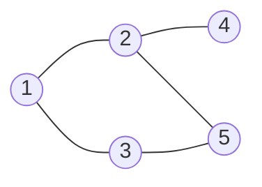

# Bài 10: BFS & DFS - Duyệt Đồ Thị

> **Tác giả:** FPTOJ Team<br>
> **Nội dung tham khảo từ:** VNOI Wiki - BFS, Cây DFS và ứng dụng, CP-Algorithms

## 1. Đồ thị là gì?

### Bản chất vấn đề

Thành phố có $N$ ngã tư (đỉnh), $M$ con đường (cạnh) nối các ngã tư. Muốn đi từ đỉnh $A$ đến đỉnh $B$ — cần thuật toán tìm đường.

**Đồ thị** là một cặp $G = (V, E)$ trong đó $V$ là tập đỉnh, $E$ là tập cạnh nối giữa các đỉnh.

### Các loại đồ thị

| Loại | Mô tả | Ví dụ thực tế |
|------|-------|---------------|
| **Vô hướng** | Cạnh không có chiều | Bạn bè trên Facebook |
| **Có hướng** | Cạnh có chiều | Theo dõi trên Twitter |
| **Có trọng số** | Cạnh có giá trị | Bản đồ (khoảng cách) |
| **Liên thông** | Đi được từ mọi đỉnh đến mọi đỉnh khác | Mạng internet |
| **Nhị phân** | Chia đỉnh thành 2 tập, cạnh chỉ nối 2 tập khác nhau | Phân công công việc |

### Biểu diễn đồ thị

**Cách 1: Danh sách kề** — phổ biến nhất, bộ nhớ $O(V + E)$.

=== "C++"

    ```cpp
    vector<int> adj[MAXN];
    adj[1].push_back(2);  // đỉnh 1 nối với đỉnh 2
    adj[2].push_back(1);  // đồ thị vô hướng → thêm cả chiều ngược

    // Duyệt đỉnh kề của u
    for (int v : adj[u]) {
        // xử lý v
    }
    ```

=== "Python"

    ```python
    from collections import defaultdict

    adj = defaultdict(list)
    adj[1].append(2)
    adj[2].append(1)

    for v in adj[u]:
        # xử lý v
        pass
    ```

**Cách 2: Ma trận kề** — dùng khi cần kiểm tra cạnh $O(1)$, bộ nhớ $O(V^2)$.

=== "C++"

    ```cpp
    int adj[MAXN][MAXN];
    adj[1][2] = 1;
    adj[2][1] = 1;

    if (adj[u][v]) { /* có cạnh */ }
    ```

=== "Python"

    ```python
    n = 100
    adj = [[0] * n for _ in range(n)]
    adj[1][2] = 1
    adj[2][1] = 1

    if adj[u][v]:
        pass
    ```

### So sánh hai cách biểu diễn

| Tiêu chí | Danh sách kề | Ma trận kề |
|----------|---------------|------------|
| Bộ nhớ | $O(V + E)$ | $O(V^2)$ |
| Kiểm tra cạnh | $O(\text{degree})$ | $O(1)$ |
| Duyệt đỉnh kề | $O(\text{degree})$ | $O(V)$ |
| Phổ biến | **Rất phổ biến** | Ít dùng |

**Quy tắc:** Luôn dùng danh sách kề trừ khi cần kiểm tra cạnh nhanh $O(1)$.

---

## 2. BFS — Duyệt theo chiều rộng

### Bản chất vấn đề

Cho đồ thị $G = (V, E)$ và đỉnh xuất phát $s$. Muốn thăm **tất cả đỉnh** reachable từ $s$, đồng thời tính **khoảng cách ngắn nhất** (theo số cạnh) từ $s$ đến mọi đỉnh.


```mermaid
graph LR
    n1(("1")) --- n2(("2"))
    n1(("1")) --- n3(("3"))
    n2(("2")) --- n4(("4"))
    n2(("2")) --- n5(("5"))
    n3(("3")) --- n5(("5"))
```

### Tư duy cốt lõi

BFS sử dụng **hàng đợi (queue)** — cấu trúc dữ liệu FIFO (vào trước, ra trước).

**Ẩn dụ:** Thả hòn đá xuống hồ — sóng lan đồng đều. BFS cũng vậy: duyệt đỉnh cách 1 bước trước, rồi 2 bước, 3 bước...

**Các bước thực hiện:**

1. Cho đỉnh nguồn $s$ vào hàng đợi, đánh dấu đã thăm
2. Lấy đỉnh đầu hàng đợi ra → duyệt tất cả đỉnh kề **chưa thăm**
3. Đánh dấu đã thăm, tính khoảng cách, cho vào hàng đợi
4. Lặp lại cho đến khi hàng đợi rỗng

**Đặc điểm:** BFS luôn thăm đỉnh theo thứ tự **tầng** (level) — đỉnh cách 1 bước trước, rồi 2 bước, 3 bước...

### Cài đặt

=== "C++"

    ```cpp
    vector<int> adj[MAXN];
    bool visited[MAXN];
    int dist[MAXN];
    int parent[MAXN];

    void bfs(int start) {
        queue<int> q;
        q.push(start);
        visited[start] = true;
        dist[start] = 0;
        parent[start] = -1;

        while (!q.empty()) {
            int u = q.front();
            q.pop();

            for (int v : adj[u]) {
                if (!visited[v]) {
                    visited[v] = true;
                    dist[v] = dist[u] + 1;
                    parent[v] = u;
                    q.push(v);
                }
            }
        }
    }

    vector<int> getPath(int target) {
        vector<int> path;
        for (int v = target; v != -1; v = parent[v])
            path.push_back(v);
        reverse(path.begin(), path.end());
        return path;
    }
    ```

=== "Python"

    ```python
    from collections import deque

    def bfs(adj, start):
        n = len(adj)
        visited = [False] * n
        dist = [-1] * n
        parent = [-1] * n

        q = deque([start])
        visited[start] = True
        dist[start] = 0

        while q:
            u = q.popleft()
            for v in adj[u]:
                if not visited[v]:
                    visited[v] = True
                    dist[v] = dist[u] + 1
                    parent[v] = u
                    q.append(v)
        return dist, parent

    def get_path(parent, target):
        path = []
        v = target
        while v != -1:
            path.append(v)
            v = parent[v]
        path.reverse()
        return path
    ```

### Phân tích tính đúng đắn

**Tại sao BFS cho khoảng cách ngắn nhất trên đồ thị không trọng số?**

Gọi $d(v)$ là khoảng cách ngắn nhất từ $s$ đến $v$ (theo số cạnh).

**Bất biến quan trọng:** Khi đỉnh $v$ được lấy ra khỏi hàng đợi, $d(v)$ đã được xác định đúng.

**Chứng minh bằng induction:**

- **Base:** $d(s) = 0$ — đúng vì $s$ là đỉnh xuất phát.
- **Inductive step:** Giả sử mọi đỉnh có khoảng cách $\leq k$ đã được xác định đúng. Xét đỉnh $v$ có $d(v) = k + 1$. Khi đó tồn tại đỉnh $u$ với $d(u) = k$ sao cho $(u, v) \in E$. Theo giả thuyết induction, $u$ đã được xác định đúng. Khi $u$ được duyệt, $v$ sẽ được thăm và $d(v) = d(u) + 1 = k + 1$.

Vì BFS duyệt theo tầng (tất cả đỉnh cách $k$ bước trước đỉnh cách $k + 1$ bước), nên không có đỉnh cách ngắn hơn bị bỏ qua.

### Đánh giá độ phức tạp

- **Thời gian:** $O(V + E)$ — mỗi đỉnh được lấy ra khỏi hàng đợi đúng 1 lần, mỗi cạnh được xét đúng 2 lần (với đồ thị vô hướng).
- **Bộ nhớ:** $O(V)$ — hàng đợi chứa tối đa $V$ đỉnh, mảng `visited`, `dist`, `parent` mỗi mảng $O(V)$.

### Minh họa từng bước


```mermaid
graph LR
    n1(("1")) --- n2(("2"))
    n1(("1")) --- n3(("3"))
    n2(("2")) --- n4(("4"))
    n2(("2")) --- n5(("5"))
    n3(("3")) --- n5(("5"))
```

| Bước | Hành động | Hàng đợi | Khoảng cách |
|------|-----------|----------|--------------|
| 1 | Lấy 1, thêm kề 2, 3 | $[2, 3]$ | $d[1]=0$ |
| 2 | Lấy 2, thêm kề 4, 5 | $[3, 4, 5]$ | $d[2]=1$ |
| 3 | Lấy 3, kề 5 đã thăm | $[4, 5]$ | $d[3]=1$ |
| 4 | Lấy 4, không kề mới | $[5]$ | $d[4]=2$ |
| 5 | Lấy 5, không kề mới | $[]$ | $d[5]=2$ |

Thứ tự thăm: $1 \to 2 \to 3 \to 4 \to 5$.

---

## 3. DFS — Duyệt theo chiều sâu

### Bản chất vấn đề

Cho đồ thị $G = (V, E)$ và đỉnh xuất phát $s$. Muốn thăm **tất cả đỉnh** reachable từ $s$ bằng cách đi **sâu** hết mức có thể trước khi quay lui.

### Tư duy cốt lõi

DFS sử dụng **ngăn xếp (stack)** — có thể cài đặt trực tiếp bằng đệ quy.

**Ẩn dụ:** Khám phá hang động — tại mỗi ngã rẽ, chọn 1 đường đi sâu hết mức. Đến đường cụt → quay lui → thử đường khác.

**Các bước thực hiện:**

1. Đánh dấu đỉnh hiện tại $u$ đã thăm
2. Duyệt tất cả đỉnh kề $v$ **chưa thăm**
3. Gọi đệ quy $\text{DFS}(v)$
4. Khi không còn đỉnh kề nào chưa thăm → quay lui

**Đặc điểm:** DFS đi **sâu** hết mức có thể trước khi quay lại. Không đảm bảo tìm đường ngắn nhất.

### Cài đặt

=== "C++"

    ```cpp
    vector<int> adj[MAXN];
    bool visited[MAXN];

    // Cách 1: Đệ quy (đơn giản)
    void dfs(int u) {
        visited[u] = true;
        for (int v : adj[u])
            if (!visited[v])
                dfs(v);
    }

    // Cách 2: Stack (không đệ quy, tránh tràn stack)
    void dfsIterative(int start) {
        stack<int> st;
        st.push(start);
        while (!st.empty()) {
            int u = st.top();
            st.pop();
            if (visited[u]) continue;
            visited[u] = true;
            for (int v : adj[u])
                if (!visited[v])
                    st.push(v);
        }
    }
    ```

=== "Python"

    ```python
    # Cách 1: Đệ quy (đơn giản)
    def dfs(adj, u, visited):
        visited[u] = True
        for v in adj[u]:
            if not visited[v]:
                dfs(adj, v, visited)

    # Cách 2: Stack (không đệ quy)
    def dfs_iterative(adj, start):
        n = len(adj)
        visited = [False] * n
        stack = [start]
        while stack:
            u = stack.pop()
            if visited[u]:
                continue
            visited[u] = True
            for v in adj[u]:
                if not visited[v]:
                    stack.append(v)
    ```

### Phân tích tính đúng đắn

**Tại sao DFS thăm đúng tất cả đỉnh reachable từ $s$?**

DFS thực hiện duyệt trên **cây DFS** (DFS Tree) — một cây spanning của thành phần liên thông chứa $s$.

**Chứng minh:**

1. **Mọi đỉnh reachable đều được thăm:** Giả sử tồn tại đỉnh $v$ reachable từ $s$ mà không được thăm. Khi đó tồn tại đường đi $s = v_0, v_1, \ldots, v_k = v$. Vì $v_0 = s$ được thăm, và nếu $v_i$ được thăm thì $v_{i+1}$ cũng sẽ được thăm (vì $v_{i+1}$ là đỉnh kề của $v_i$ chưa thăm). Theo induction, $v$ phải được thăm — mâu thuẫn.

2. **Mỗi đỉnh thăm đúng 1 lần:** Nhờ đánh dấu `visited` trước khi duyệt kề.

3. **Cây DFS không có chu trình:** Vì chỉ đi đến đỉnh chưa thăm, mỗi đỉnh có đúng 1 cha trong cây DFS.

### Đánh giá độ phức tạp

- **Thời gian:** $O(V + E)$ — mỗi đỉnh được thăm đúng 1 lần, mỗi cạnh được xét đúng 2 lần (vô hướng) hoặc 1 lần (có hướng).
- **Bộ nhớ:** $O(V)$ — stack đệ quy tối đa $V$ tầng, mảng `visited` $O(V)$.

### Minh họa từng bước


```mermaid
graph LR
    n1(("1")) --- n2(("2"))
    n1(("1")) --- n3(("3"))
    n2(("2")) --- n4(("4"))
    n2(("2")) --- n5(("5"))
    n3(("3")) --- n5(("5"))
```

| Bước | Hành động | Đệ quy stack | Ghi chú |
|------|-----------|---------------|---------|
| 1 | Thăm 1 → gọi DFS(2) | $[1]$ | Đi sâu |
| 2 | Thăm 2 → gọi DFS(4) | $[1, 2]$ | Đi sâu |
| 3 | Thăm 4 → quay lui | $[1, 2, 4]$ | Đỉnh lá |
| 4 | Quay 2 → gọi DFS(5) | $[1, 2]$ | Thử nhánh khác |
| 5 | Thăm 5 → gọi DFS(3) | $[1, 2, 5]$ | Đi sâu |
| 6 | Thăm 3 → quay lui | $[1, 2, 5, 3]$ | Kề 1, 5 đã thăm |
| 7 | Quay hết → xong | $[]$ | Hoàn thành |

Thứ tự thăm: $1 \to 2 \to 4 \to 5 \to 3$.

---

## 4. So sánh BFS vs DFS

| Tiêu chí | BFS | DFS |
|----------|-----|-----|
| Cấu trúc dữ liệu | **Queue** (FIFO) | **Stack** / Đệ quy |
| Thứ tự duyệt | Lan rộng theo "tầng" | Đi sâu rồi quay lui |
| Đường ngắn nhất | **Có** (không trọng số) | Không đảm bảo |
| Bộ nhớ | $O(V)$ | $O(V)$ |
| Thời gian | $O(V + E)$ | $O(V + E)$ |

### Khi nào dùng BFS?

- Cần tìm **đường ngắn nhất** trong đồ thị không trọng số
- Duyệt theo **tầng** (level-order)
- Bài toán trên **lưới 2D** (tìm đường, flood fill)

### Khi nào dùng DFS?

- Kiểm tra **chu trình**
- **Sắp xếp tô-pô**
- Tìm **thành phần liên thông**
- Bài toán cần **quay lui** (backtracking)
- Đồ thị rất **sâu** (ít tốn bộ nhớ hơn BFS)

```matplotlib
V = np.linspace(10, 10000, 100)
E_sparse = V * 2
E_dense = V**2 / 4

bfs_sparse = V + E_sparse
dfs_sparse = V + E_sparse
bfs_dense = V + E_dense
dfs_dense = V + E_dense

fig, (ax1, ax2) = plt.subplots(1, 2, figsize=(12, 5))

ax1.plot(V, bfs_sparse, label='BFS (thưa, E≈2V)', color='#3498db', linewidth=2)
ax1.plot(V, dfs_sparse, label='DFS (thưa, E≈2V)', color='#e74c3c', linewidth=2, linestyle='--')
ax1.set_xlabel('Số đỉnh V')
ax1.set_ylabel('Thời gian O(V+E)')
ax1.set_title('BFS vs DFS trên đồ thị thưa')
ax1.legend(fontsize=9)
ax1.grid(True, alpha=0.3)

ax2.plot(V, bfs_dense, label='BFS (dày, E≈V²/4)', color='#3498db', linewidth=2)
ax2.plot(V, dfs_dense, label='DFS (dày, E≈V²/4)', color='#e74c3c', linewidth=2, linestyle='--')
ax2.set_xlabel('Số đỉnh V')
ax2.set_ylabel('Thời gian O(V+E)')
ax2.set_title('BFS vs DFS trên đồ thị dày')
ax2.legend(fontsize=9)
ax2.grid(True, alpha=0.3)

plt.tight_layout()
```

---

## 5. Ứng dụng thực tế

### 5.1. Tìm đường ngắn nhất trong lưới (BFS)

**Bài toán:** Cho lưới $N \times M$, tìm đường đi ngắn nhất từ $A$ đến $B$ (tránh vật cản).

=== "C++"

    ```cpp
    int dx[] = {-1, 1, 0, 0};
    int dy[] = {0, 0, -1, 1};

    int bfsGrid(vector<vector<int>>& grid, int sx, int sy, int ex, int ey) {
        int n = grid.size(), m = grid[0].size();
        queue<pair<int,int>> q;
        vector<vector<int>> dist(n, vector<int>(m, -1));

        q.push({sx, sy});
        dist[sx][sy] = 0;

        while (!q.empty()) {
            auto [x, y] = q.front();
            q.pop();

            if (x == ex && y == ey) return dist[x][y];

            for (int d = 0; d < 4; d++) {
                int nx = x + dx[d], ny = y + dy[d];
                if (nx >= 0 && nx < n && ny >= 0 && ny < m
                    && grid[nx][ny] != 1 && dist[nx][ny] == -1) {
                    dist[nx][ny] = dist[x][y] + 1;
                    q.push({nx, ny});
                }
            }
        }
        return -1;
    }
    ```

=== "Python"

    ```python
    from collections import deque

    def bfs_grid(grid, sx, sy, ex, ey):
        n, m = len(grid), len(grid[0])
        dx = [-1, 1, 0, 0]
        dy = [0, 0, -1, 1]
        dist = [[-1] * m for _ in range(n)]
        q = deque([(sx, sy)])
        dist[sx][sy] = 0

        while q:
            x, y = q.popleft()
            if x == ex and y == ey:
                return dist[x][y]
            for d in range(4):
                nx, ny = x + dx[d], y + dy[d]
                if 0 <= nx < n and 0 <= ny < m and grid[nx][ny] != 1 and dist[nx][ny] == -1:
                    dist[nx][ny] = dist[x][y] + 1
                    q.append((nx, ny))
        return -1
    ```

**Đánh giá độ phức tạp:** Thời gian $O(N \times M)$, bộ nhớ $O(N \times M)$.

**Ứng dụng:** Game tìm đường (Pacman, RPG), robot di chuyển, GPS.

### 5.2. Đếm thành phần liên thông (DFS/BFS)

**Bài toán:** Cho đồ thị có $N$ đỉnh, đếm số nhóm liên thông.

=== "C++"

    ```cpp
    int countComponents(int n) {
        int count = 0;
        for (int i = 1; i <= n; i++) {
            if (!visited[i]) {
                dfs(i);
                count++;
            }
        }
        return count;
    }
    ```

=== "Python"

    ```python
    def count_components(n, adj):
        visited = [False] * n
        count = 0
        for i in range(n):
            if not visited[i]:
                dfs(adj, i, visited)
                count += 1
        return count
    ```

**Đánh giá độ phức tạp:** Thời gian $O(V + E)$, bộ nhớ $O(V)$.

### 5.3. Kiểm tra đồ thị nhị phân (BFS/DFS)

**Bài toán:** Kiểm tra đồ thị có thể chia thành 2 tập sao cho cạnh chỉ nối 2 tập khác nhau không.

**Tư duy:** Tô màu 2 màu xen kẽ. Nếu đỉnh kề cùng màu → không nhị phân.

=== "C++"

    ```cpp
    bool isBipartite(int n, vector<vector<int>>& adj) {
        vector<int> color(n, -1);
        queue<int> q;

        for (int start = 0; start < n; start++) {
            if (color[start] != -1) continue;

            color[start] = 0;
            q.push(start);

            while (!q.empty()) {
                int u = q.front(); q.pop();
                for (int v : adj[u]) {
                    if (color[v] == -1) {
                        color[v] = color[u] ^ 1;
                        q.push(v);
                    } else if (color[v] == color[u]) {
                        return false;
                    }
                }
            }
        }
        return true;
    }
    ```

=== "Python"

    ```python
    from collections import deque

    def is_bipartite(n, adj):
        color = [-1] * n

        for start in range(n):
            if color[start] != -1:
                continue
            color[start] = 0
            q = deque([start])

            while q:
                u = q.popleft()
                for v in adj[u]:
                    if color[v] == -1:
                        color[v] = color[u] ^ 1
                        q.append(v)
                    elif color[v] == color[u]:
                        return False
        return True
    ```

**Đánh giá độ phức tạp:** Thời gian $O(V + E)$, bộ nhớ $O(V)$.

### 5.4. Phát hiện chu trình (DFS)

**Bài toán:** Kiểm tra đồ thị có chứa chu trình không.

**Đồ thị vô hướng:** Khi DFS gặp đỉnh đã thăm mà không phải cha → có chu trình.

=== "C++"

    ```cpp
    bool hasCycleUndirected(int u, int parent) {
        visited[u] = true;
        for (int v : adj[u]) {
            if (!visited[v]) {
                if (hasCycleUndirected(v, u)) return true;
            } else if (v != parent) {
                return true;
            }
        }
        return false;
    }
    ```

=== "Python"

    ```python
    def has_cycle_undirected(adj, u, parent, visited):
        visited[u] = True
        for v in adj[u]:
            if not visited[v]:
                if has_cycle_undirected(adj, v, u, visited):
                    return True
            elif v != parent:
                return True
        return False
    ```

**Đồ thị có hướng:** Dùng 3 trạng thái — 0: chưa thăm, 1: đang thăm, 2: đã xong.

=== "C++"

    ```cpp
    int state[MAXN];

    bool hasCycleDirected(int u) {
        state[u] = 1;
        for (int v : adj[u]) {
            if (state[v] == 1) return true;
            if (state[v] == 0 && hasCycleDirected(v)) return true;
        }
        state[u] = 2;
        return false;
    }
    ```

=== "Python"

    ```python
    def has_cycle_directed(adj, u, state):
        state[u] = 1
        for v in adj[u]:
            if state[v] == 1:
                return True
            if state[v] == 0 and has_cycle_directed(adj, v, state):
                return True
        state[u] = 2
        return False
    ```

**Đánh giá độ phức tạp:** Thời gian $O(V + E)$, bộ nhớ $O(V)$.

### 5.5. Sắp xếp tô-pô (DFS)

**Bài toán:** Với DAG (đồ thị có hướng không chu trình), tìm thứ tự tuyến tính sao cho nếu có cạnh $u \to v$ thì $u$ đứng trước $v$.

=== "C++"

    ```cpp
    vector<int> topoOrder;
    bool visited[MAXN];

    void topoSort(int u) {
        visited[u] = true;
        for (int v : adj[u])
            if (!visited[v])
                topoSort(v);
        topoOrder.push_back(u);
    }
    ```

=== "Python"

    ```python
    def topo_sort(adj, n):
        visited = [False] * n
        order = []

        def dfs(u):
            visited[u] = True
            for v in adj[u]:
                if not visited[v]:
                    dfs(v)
            order.append(u)

        for i in range(n):
            if not visited[i]:
                dfs(i)
        order.reverse()
        return order
    ```

**Đánh giá độ phức tạp:** Thời gian $O(V + E)$, bộ nhớ $O(V)$.

**Ứng dụng:** Sắp xếp thứ tự học môn (môn tiên quyết), build hệ thống, xử lý dependency.

### 5.6. Flood Fill (BFS/DFS)

**Bài toán:** Cho lưới 2D, tô màu tất cả ô liên thông cùng màu với ô xuất phát.

=== "C++"

    ```cpp
    void floodFill(vector<vector<int>>& grid, int x, int y, int newColor) {
        int n = grid.size(), m = grid[0].size();
        int oldColor = grid[x][y];
        if (oldColor == newColor) return;

        queue<pair<int,int>> q;
        q.push({x, y});
        grid[x][y] = newColor;

        int dx[] = {-1, 1, 0, 0};
        int dy[] = {0, 0, -1, 1};

        while (!q.empty()) {
            auto [cx, cy] = q.front(); q.pop();
            for (int d = 0; d < 4; d++) {
                int nx = cx + dx[d], ny = cy + dy[d];
                if (nx >= 0 && nx < n && ny >= 0 && ny < m && grid[nx][ny] == oldColor) {
                    grid[nx][ny] = newColor;
                    q.push({nx, ny});
                }
            }
        }
    }
    ```

=== "Python"

    ```python
    from collections import deque

    def flood_fill(grid, x, y, new_color):
        n, m = len(grid), len(grid[0])
        old_color = grid[x][y]
        if old_color == new_color:
            return
        q = deque([(x, y)])
        grid[x][y] = new_color
        dx = [-1, 1, 0, 0]
        dy = [0, 0, -1, 1]
        while q:
            cx, cy = q.popleft()
            for d in range(4):
                nx, ny = cx + dx[d], cy + dy[d]
                if 0 <= nx < n and 0 <= ny < m and grid[nx][ny] == old_color:
                    grid[nx][ny] = new_color
                    q.append((nx, ny))
    ```

**Đánh giá độ phức tạp:** Thời gian $O(N \times M)$, bộ nhớ $O(N \times M)$.

**Ứng dụng:** Paint bucket tool, đếm số vùng trong ảnh, game Minesweeper.

---

## 6. Cạm bẫy hay gặp

### Bẫy 1: Quên đánh dấu đã thăm

=== "C++"

    ```cpp
    // SAI: quên visited[v] = true trước khi push
    q.push(v);
    visited[v] = true;  // Quá trễ! Có thể push trùng!

    // ĐÚNG: đánh dấu NGAY KHI push
    visited[v] = true;
    q.push(v);
    ```

=== "Python"

    ```python
    # SAI
    q.append(v)
    visited[v] = True  # Quá trễ!

    # ĐÚNG
    visited[v] = True
    q.append(v)
    ```

### Bẫy 2: Đệ quy quá sâu → Stack Overflow

DFS đệ quy với $N = 100.000$ có thể tràn stack.

**Khắc phục:** Dùng DFS iterative (stack) hoặc tăng giới hạn đệ quy.

```python
import sys
sys.setrecursionlimit(300000)
```

### Bẫy 3: BFS trên đồ thị có trọng số

BFS chỉ cho đường ngắn nhất trên đồ thị **không trọng số**. Nếu có trọng số → dùng Dijkstra (xem Bài 13).

### Bẫy 4: Quên duyệt tất cả thành phần liên thông

=== "C++"

    ```cpp
    // SAI: chỉ gọi BFS/DFS từ đỉnh 1
    bfs(1);

    // ĐÚNG: gọi từ mọi đỉnh chưa thăm
    for (int i = 1; i <= n; i++)
        if (!visited[i])
            bfs(i);
    ```

=== "Python"

    ```python
    # SAI
    bfs(adj, 1)

    # ĐÚNG
    for i in range(n):
        if not visited[i]:
            bfs(adj, i)
    ```

### Mẹo thi cử

| Bài toán | Thuật toán |
|----------|-----------|
| Đường ngắn nhất (không trọng số) | BFS |
| Thành phần liên thông | DFS / BFS |
| Kiểm tra chu trình | DFS |
| Sắp xếp tô-pô | DFS |
| Kiểm tra nhị phân | BFS / DFS |
| Flood Fill | BFS / DFS |
| Đồ thị có trọng số | Dijkstra (Bài 13) |

---

## 7. Bài tập luyện tập

### 7.1 Bài tập trên các nền tảng khác

| Bài | Nền tảng | Độ khó | Chủ đề |
|-----|----------|--------|--------|
| [CSES - Building Roads](https://cses.fi/problemset/task/1666) | CSES | ⭐ | Thành phần liên thông |
| [CSES - Message Route](https://cses.fi/problemset/task/1667) | CSES | ⭐⭐ | BFS đường ngắn nhất |
| [CSES - Labyrinth](https://cses.fi/problemset/task/1193) | CSES | ⭐⭐ | BFS trên lưới |
| [CSES - Building Teams](https://cses.fi/problemset/task/1668) | CSES | ⭐⭐ | Kiểm tra nhị phân |
| [CSES - Round Trip](https://cses.fi/problemset/task/1669) | CSES | ⭐⭐ | Phát hiện chu trình |
| [CSES - Course Schedule](https://cses.fi/problemset/task/1679) | CSES | ⭐⭐ | Sắp xếp tô-pô |
| [SPOJ - BUGLIFE](https://www.spoj.com/problems/BUGLIFE/) | SPOJ | ⭐⭐ | Kiểm tra nhị phân |
| [LeetCode - Number of Islands](https://leetcode.com/problems/number-of-islands/) | LeetCode | ⭐⭐ | DFS/BFS trên lưới |
| [LeetCode - Flood Fill](https://leetcode.com/problems/flood-fill/) | LeetCode | ⭐ | BFS/DFS cơ bản |
| [LeetCode - Course Schedule](https://leetcode.com/problems/course-schedule/) | LeetCode | ⭐⭐ | Topo sort + DFS |
| [LeetCode - Max Area of Island](https://leetcode.com/problems/max-area-of-island/) | LeetCode | ⭐⭐ | DFS đếm vùng |
| [VNOJ - Gặm cỏ](https://oj.vnoi.info/problem/vmunch) | VNOJ | ⭐⭐ | BFS trên lưới |

### 7.2 Bài tập thực hành trên FPTOJ

Toàn bộ 30 bài tập BFS/DFS dưới đây được thiết kế riêng, từ cơ bản đến nâng cao:

#### 🟢 Cơ bản (⭐, 10 điểm)

| Mã bài | Tên bài | Độ khó | Chủ đề |
|--------|---------|--------|--------|
| [graph-bfs-basic](https://fptoj.com/problem/graph-bfs-basic) | Duyệt BFS Cơ Bản | ⭐ | BFS từ đỉnh nguồn, in thứ tự duyệt |
| [graph-dfs-basic](https://fptoj.com/problem/graph-dfs-basic) | Duyệt DFS Cơ Bản | ⭐ | DFS từ đỉnh nguồn, in thứ tự duyệt |
| [graph-num-provinces](https://fptoj.com/problem/graph-num-provinces) | Số Lượng Tỉnh Thành | ⭐ | Đếm số thành phần liên thông |
| [graph-keys-rooms](https://fptoj.com/problem/graph-keys-rooms) | Chìa Khóa Và Phòng Khóa | ⭐ | DFS/BFS kiểm tra truy cập được tất cả |
| [graph-flood-fill](https://fptoj.com/problem/graph-flood-fill) | Thuật Toán Tô Màu Lưới | ⭐ | BFS/DFS tô màu lưới |
| [graph-clone](https://fptoj.com/problem/graph-clone) | Sao Chép Đồ Thị | ⭐ | Deep clone đồ thị bằng BFS |

#### Trung bình (⭐⭐–⭐⭐⭐, 20 điểm)

| Mã bài | Tên bài | Độ khó | Chủ đề |
|--------|---------|--------|--------|
| [graph-shortest-path](https://fptoj.com/problem/graph-shortest-path) | Đường Đi Ngắn Nhất | ⭐⭐ | BFS đường ngắn nhất trên đồ thị không trọng số |
| [graph-maze-shortest](https://fptoj.com/problem/graph-maze-shortest) | Tìm Đường Trong Mê Cung | ⭐⭐ | BFS trên lưới 2D |
| [graph-cycle-undir](https://fptoj.com/problem/graph-cycle-undir) | Chu Trình Vô Hướng | ⭐⭐ | Phát hiện chu trình bằng DFS |
| [graph-cycle-dir](https://fptoj.com/problem/graph-cycle-dir) | Chu Trình Có Hướng | ⭐⭐ | Phát hiện chu trình trên đồ thị có hướng |
| [graph-bipartite](https://fptoj.com/problem/graph-bipartite) | Đồ Thị Hai Phía | ⭐⭐ | Kiểm tra đồ thị nhị phân bằng BFS |
| [graph-topo-sort](https://fptoj.com/problem/graph-topo-sort) | Sắp Xếp Tô-pô | ⭐⭐ | Kahn's algorithm / DFS topo sort |
| [graph-all-paths](https://fptoj.com/problem/graph-all-paths) | Số Lượng Đường Đi | ⭐⭐ | Đếm đường đi trên DAG bằng DFS |
| [graph-safe-states](https://fptoj.com/problem/graph-safe-states) | Tìm Đỉnh An Toàn | ⭐⭐⭐ | Đỉnh không thuộc chu trình bằng DFS ngược |
| [graph-redundant-conn](https://fptoj.com/problem/graph-redundant-conn) | Cạnh Dư Thừa | ⭐⭐⭐ | DSU hoặc phát hiện cạnh tạo chu trình |
| [graph-rotting](https://fptoj.com/problem/graph-rotting) | Cam Lây Thối | ⭐⭐⭐ | Multi-source BFS |
| [graph-water-flow](https://fptoj.com/problem/graph-water-flow) | Nước Chảy Hai Đại Dương | ⭐⭐⭐ | DFS/BFS từ hai bờ ngược chiều |
| [graph-longest-dag](https://fptoj.com/problem/graph-longest-dag) | Đường Dài Nhất Trên DAG | ⭐⭐⭐ | DP trên DAG theo topo sort |
| [graph-evaluate-div](https://fptoj.com/problem/graph-evaluate-div) | Tính Giá Trị Biểu Thức Chia | ⭐⭐⭐ | Đồ thị có trọng số + DFS |
| [graph-tree-diameter](https://fptoj.com/problem/graph-tree-diameter) | Đường Kính Của Cây | ⭐⭐⭐ | Hai lần BFS trên cây |
| [graph-tree-center](https://fptoj.com/problem/graph-tree-center) | Tâm Của Cây | ⭐⭐⭐ | Cắt lá lần lượt |
| [graph-mht](https://fptoj.com/problem/graph-mht) | Cây Chiều Cao Tối Thiểu | ⭐⭐⭐ | Tâm cây = gốc chiều cao tối thiểu |

#### 🔴 Nâng cao (⭐⭐⭐⭐, 30 điểm)

| Mã bài | Tên bài | Độ khó | Chủ đề |
|--------|---------|--------|--------|
| [graph-word-ladder](https://fptoj.com/problem/graph-word-ladder) | Chuỗi Biến Đổi Từ Vựng | ⭐⭐⭐⭐ | BFS trên không gian trạng thái từ |
| [graph-snakes-ladders](https://fptoj.com/problem/graph-snakes-ladders) | Rắn Và Thang Máy | ⭐⭐⭐⭐ | BFS tối thiểu bước trên bảng Rắn Thang |
| [graph-alien-dict](https://fptoj.com/problem/graph-alien-dict) | Bảng Chữ Cái Ngôn Ngữ Lạ | ⭐⭐⭐⭐ | Topo sort từ thứ tự từ vựng |
| [graph-euler-path](https://fptoj.com/problem/graph-euler-path) | Hành Trình Bay Hợp Lệ | ⭐⭐⭐⭐ | Đường đi Eulerian - Hierholzer |
| [graph-scc-tarjan](https://fptoj.com/problem/graph-scc-tarjan) | Thành Phần Liên Thông Mạnh | ⭐⭐⭐⭐ | Thuật toán Tarjan (SCC) |
| [graph-cut-vertices](https://fptoj.com/problem/graph-cut-vertices) | Tìm Khớp Của Đồ Thị | ⭐⭐⭐⭐ | Articulation Points trên cây DFS |
| [graph-cut-bridges](https://fptoj.com/problem/graph-cut-bridges) | Tìm Cầu Của Đồ Thị | ⭐⭐⭐⭐ | Bridge-finding trên cây DFS |
| [graph-biconnected](https://fptoj.com/problem/graph-biconnected) | Thành Phần Liên Thông Đôi | ⭐⭐⭐⭐ | BCC - đếm thành phần song liên thông |

---

## 8. Gợi ý giải các bài FPTOJ

### 🟢 Cơ bản

??? tip "graph-bfs-basic — Duyệt BFS Cơ Bản"
    **Ý tưởng:** Thực hiện thuật toán BFS bắt đầu từ đỉnh nguồn 1. Ta cần sắp xếp các đỉnh kề tăng dần trước để ưu tiên thăm đỉnh nhỏ hơn. Kết quả in ra thứ tự duyệt và đường đi ngắn nhất đến đỉnh $N$ thông qua mảng truy vết `parent`.

    ```cpp
    #include <bits/stdc++.h>
    using namespace std;

    int main() {
        ios_base::sync_with_stdio(false);
        cin.tie(NULL);
        int n, m;
        if (!(cin >> n >> m)) return 0;
        vector<vector<int>> adj(n + 1);
        for (int i = 0; i < m; i++) {
            int u, v;
            cin >> u >> v;
            adj[u].push_back(v);
            adj[v].push_back(u);
        }
        for (int i = 1; i <= n; i++) {
            sort(adj[i].begin(), adj[i].end());
        }

        vector<int> bfs_order;
        vector<int> dist(n + 1, -1);
        vector<int> parent(n + 1, -1);
        queue<int> q;

        q.push(1);
        dist[1] = 0;
        
        while (!q.empty()) {
            int u = q.front();
            q.pop();
            bfs_order.push_back(u);
            for (int v : adj[u]) {
                if (dist[v] == -1) {
                    dist[v] = dist[u] + 1;
                    parent[v] = u;
                    q.push(v);
                }
            }
        }

        for (int i = 0; i < bfs_order.size(); i++) {
            cout << bfs_order[i] << (i == bfs_order.size() - 1 ? "" : " ");
        }
        cout << "\n";

        if (dist[n] == -1) {
            cout << -1 << "\n";
        } else {
            vector<int> path;
            for (int v = n; v != -1; v = parent[v]) {
                path.push_back(v);
            }
            reverse(path.begin(), path.end());
            for (int i = 0; i < path.size(); i++) {
                cout << path[i] << (i == path.size() - 1 ? "" : " ");
            }
            cout << "\n";
        }
        return 0;
    }
    ```
??? tip "graph-dfs-basic — Duyệt DFS Cơ Bản"
    **Ý tưởng:** Thực hiện duyệt theo chiều sâu (DFS) bắt đầu từ đỉnh 1 bằng đệ quy. Để đảm bảo tính duy nhất, ta sắp xếp danh sách đỉnh kề của mỗi đỉnh theo thứ tự tăng dần trước khi bắt đầu DFS. Dùng mảng `parent_map` để truy vết đường đi từ 1 đến $N$.

    ```cpp
    #include <bits/stdc++.h>
    using namespace std;

    vector<vector<int>> adj;
    vector<bool> visited;
    vector<int> dfs_order;
    vector<int> parent_map;

    void dfs(int u) {
        visited[u] = true;
        dfs_order.push_back(u);
        for (int v : adj[u]) {
            if (!visited[v]) {
                parent_map[v] = u;
                dfs(v);
            }
        }
    }

    int main() {
        ios_base::sync_with_stdio(false);
        cin.tie(NULL);
        int n, m;
        if (!(cin >> n >> m)) return 0;
        adj.resize(n + 1);
        visited.assign(n + 1, false);
        parent_map.assign(n + 1, -1);
        for (int i = 0; i < m; i++) {
            int u, v;
            cin >> u >> v;
            adj[u].push_back(v);
            adj[v].push_back(u);
        }
        for (int i = 1; i <= n; i++) {
            sort(adj[i].begin(), adj[i].end());
        }

        dfs(1);

        for (int i = 0; i < dfs_order.size(); i++) {
            cout << dfs_order[i] << (i == dfs_order.size() - 1 ? "" : " ");
        }
        cout << "\n";

        if (!visited[n]) {
            cout << -1 << "\n";
        } else {
            vector<int> path;
            for (int v = n; v != -1; v = parent_map[v]) {
                path.push_back(v);
            }
            reverse(path.begin(), path.end());
            for (int i = 0; i < path.size(); i++) {
                cout << path[i] << (i == path.size() - 1 ? "" : " ");
            }
            cout << "\n";
        }
        return 0;
    }
    ```
??? tip "graph-num-provinces — Số Lượng Tỉnh Thành"
    **Ý tưởng:** Đếm số thành phần liên thông trên đồ thị vô hướng. Ta duyệt qua tất cả các đỉnh từ 1 đến N. Nếu đỉnh chưa được duyệt qua (`!visited[i]`), ta tăng đếm số lượng phân vùng lên 1 và bắt đầu một hàm DFS/BFS để đánh dấu toàn bộ các đỉnh cùng thuộc phân vùng liên thông này.

    ```cpp
    #include <bits/stdc++.h>
    using namespace std;

    vector<vector<int>> adj;
    vector<bool> visited;

    void dfs(int u) {
        visited[u] = true;
        for (int v : adj[u]) {
            if (!visited[v]) {
                dfs(v);
            }
        }
    }

    int main() {
        ios_base::sync_with_stdio(false);
        cin.tie(NULL);
        int n, m;
        if (!(cin >> n >> m)) return 0;
        adj.resize(n + 1);
        visited.assign(n + 1, false);
        for (int i = 0; i < m; i++) {
            int u, v;
            cin >> u >> v;
            adj[u].push_back(v);
            adj[v].push_back(u);
        }
        int cnt = 0;
        for (int i = 1; i <= n; i++) {
            if (!visited[i]) {
                cnt++;
                dfs(i);
            }
        }
        cout << cnt << "\n";
        return 0;
    }
    ```
??? tip "graph-keys-rooms — Chìa Khóa Và Phòng Khóa"
    **Ý tưởng:** Duyệt đồ thị bằng BFS hoặc DFS xuất phát từ phòng 1. Dùng mảng `visited` để đánh dấu các phòng đã thăm. Mỗi khi đến một phòng, ta lấy được toàn bộ chìa khóa trong đó và cho vào hàng đợi (queue) để đi mở các phòng tiếp theo. Cuối cùng, kiểm tra xem toàn bộ các phòng từ 1 đến N đã được thăm hết hay chưa.

    ```cpp
    #include <bits/stdc++.h>
    using namespace std;

    int main() {
        ios_base::sync_with_stdio(false);
        cin.tie(NULL);
        int n, m;
        if (!(cin >> n >> m)) return 0;
        vector<vector<int>> adj(n + 1);
        for (int i = 0; i < m; i++) {
            int u, k; cin >> u >> k;
            adj[u].push_back(k);
        }
        vector<bool> visited(n + 1, false);
        queue<int> q;
        q.push(1);
        visited[1] = true;
        while (!q.empty()) {
            int u = q.front(); q.pop();
            for (int v : adj[u]) {
                if (!visited[v]) {
                    visited[v] = true;
                    q.push(v);
                }
            }
        }
        bool all_visited = true;
        for (int i = 1; i <= n; i++) {
            if (!visited[i]) {
                all_visited = false;
                break;
            }
        }
        cout << (all_visited ? "YES" : "NO") << "\n";
        return 0;
    }
    ```
??? tip "graph-flood-fill — Thuật Toán Tô Màu Lưới"
    **Ý tưởng:** Thực hiện thuật toán BFS/DFS trên lưới ô vuông từ vị trí xuất phát $(sr, sc)$. Sử dụng mảng hướng `dr` và `dc` để di chuyển sang 4 hướng kề cạnh. Chỉ tô màu các ô có màu ban đầu trùng với $oldColor$. Cần lưu ý trường hợp đặc biệt: nếu màu mới trùng với màu cũ ($newColor == oldColor$) thì không cần thay đổi gì để tránh vòng lặp vô hạn.

    ```cpp
    #include <bits/stdc++.h>
    using namespace std;

    int main() {
        ios_base::sync_with_stdio(false);
        cin.tie(NULL);
        int n, m;
        if (!(cin >> n >> m)) return 0;
        int sr, sc, newColor;
        cin >> sr >> sc >> newColor;
        vector<vector<int>> grid(n, vector<int>(m));
        for (int i = 0; i < n; i++) {
            for (int j = 0; j < m; j++) {
                cin >> grid[i][j];
            }
        }
        int oldColor = grid[sr][sc];
        if (oldColor != newColor) {
            queue<pair<int, int>> q;
            q.push({sr, sc});
            grid[sr][sc] = newColor;
            int dr[] = {-1, 1, 0, 0};
            int dc[] = {0, 0, -1, 1};
            while (!q.empty()) {
                auto [r, c] = q.front(); q.pop();
                for (int d = 0; d < 4; d++) {
                    int nr = r + dr[d], nc = c + dc[d];
                    if (nr >= 0 && nr < n && nc >= 0 && nc < m && grid[nr][nc] == oldColor) {
                        grid[nr][nc] = newColor;
                        q.push({nr, nc});
                    }
                }
            }
        }
        for (int i = 0; i < n; i++) {
            for (int j = 0; j < m; j++) {
                cout << grid[i][j] << (j == m - 1 ? "" : " ");
            }
            cout << "\n";
        }
        return 0;
    }
    ```
??? tip "graph-clone — Sao Chép Đồ Thị"
    **Ý tưởng:** Duyệt qua toàn bộ đồ thị gốc sử dụng BFS. Chúng ta khởi tạo một cấu trúc đồ thị mới và sử dụng một mảng ánh xạ để sao chép danh sách kề tương ứng của các đỉnh sang đồ thị clone độc lập về bộ nhớ. Bài toán này trên DMOJ kiểm tra cấu trúc sau khi clone bằng cách yêu cầu in ra danh sách kề của các đỉnh được sắp xếp tăng dần.

    ```cpp
    #include <bits/stdc++.h>
    using namespace std;

    int main() {
        ios_base::sync_with_stdio(false);
        cin.tie(NULL);
        int n, m;
        if (!(cin >> n >> m)) return 0;
        vector<vector<int>> adj(n + 1);
        for (int i = 0; i < m; i++) {
            int u, v; cin >> u >> v;
            adj[u].push_back(v);
            adj[v].push_back(u);
        }
        vector<vector<int>> cloned(n + 1);
        for (int i = 1; i <= n; i++) {
            cloned[i] = adj[i];
            sort(cloned[i].begin(), cloned[i].end());
        }
        for (int i = 1; i <= n; i++) {
            for (int j = 0; j < (int)cloned[i].size(); j++) {
                cout << cloned[i][j] << (j + 1 == (int)cloned[i].size() ? "" : " ");
            }
            cout << "\n";
        }
        return 0;
    }
    ```
---

### 🟡 Trung bình

??? tip "graph-shortest-path — Đường Đi Ngắn Nhất"
    **Ý tưởng:** Thuật toán BFS tìm đường đi ngắn nhất trên đồ thị không trọng số giữa hai đỉnh nguồn $S$ và đích $T$. Do đồ thị không trọng số, BFS đảm bảo khi lấy đỉnh $T$ ra khỏi hàng đợi thì khoảng cách `dist[T]` tìm được là ngắn nhất. Nếu không thể đi tới $T$, ta in ra `-1`.

    ```cpp
    #include <bits/stdc++.h>
    using namespace std;

    int main() {
        ios_base::sync_with_stdio(false);
        cin.tie(NULL);
        int n, m;
        if (!(cin >> n >> m)) return 0;
        int s, t;
        cin >> s >> t;
        vector<vector<int>> adj(n + 1);
        for (int i = 0; i < m; i++) {
            int u, v;
            cin >> u >> v;
            adj[u].push_back(v);
            adj[v].push_back(u);
        }
        vector<int> dist(n + 1, -1);
        queue<int> q;
        q.push(s);
        dist[s] = 0;
        while (!q.empty()) {
            int u = q.front();
            q.pop();
            if (u == t) {
                cout << dist[u] << "\n";
                return 0;
            }
            for (int v : adj[u]) {
                if (dist[v] == -1) {
                    dist[v] = dist[u] + 1;
                    q.push(v);
                }
            }
        }
        cout << -1 << "\n";
        return 0;
    }
    ```
??? tip "graph-maze-shortest — Tìm Đường Trong Mê Cung"
    **Ý tưởng:** Thực hiện thuật toán BFS trên lưới bắt đầu từ ô xuất phát $(0, 0)$. Sử dụng mảng khoảng cách `dist[r][c]` để lưu số bước đi ngắn nhất từ ô $(0, 0)$ và một mảng cha `parent[r][c]` để truy vết ngược lộ trình đi từ đích về nguồn. Sau đó lật ngược (reverse) danh sách các ô truy vết để có lộ trình hoàn chỉnh.

    ```cpp
    #include <bits/stdc++.h>
    using namespace std;

    int main() {
        ios_base::sync_with_stdio(false);
        cin.tie(NULL);
        int n, m;
        if (!(cin >> n >> m)) return 0;
        vector<string> grid(n);
        for (int i = 0; i < n; i++) cin >> grid[i];
        vector<vector<int>> dist(n, vector<int>(m, -1));
        vector<vector<pair<int, int>>> parent(n, vector<pair<int, int>>(m, {-1, -1}));
        queue<pair<int, int>> q;
        q.push({0, 0});
        dist[0][0] = 0;
        int dr[] = {-1, 1, 0, 0};
        int dc[] = {0, 0, -1, 1};
        while (!q.empty()) {
            auto [r, c] = q.front(); q.pop();
            for (int d = 0; d < 4; d++) {
                int nr = r + dr[d], nc = c + dc[d];
                if (nr >= 0 && nr < n && nc >= 0 && nc < m && grid[nr][nc] == '.' && dist[nr][nc] == -1) {
                    dist[nr][nc] = dist[r][c] + 1;
                    parent[nr][nc] = {r, c};
                    q.push({nr, nc});
                }
            }
        }
        cout << dist[n - 1][m - 1] << "\n";
        if (dist[n - 1][m - 1] != -1) {
            vector<pair<int, int>> path;
            for (auto curr = make_pair(n - 1, m - 1); curr.first != -1; curr = parent[curr.first][curr.second]) {
                path.push_back(curr);
            }
            reverse(path.begin(), path.end());
            for (int i = 0; i < (int)path.size(); i++) {
                cout << "(" << path[i].first << "," << path[i].second << ")" << (i + 1 == (int)path.size() ? "" : " ");
            }
            cout << "\n";
        }
        return 0;
    }
    ```
??? tip "graph-cycle-undir — Chu Trình Vô Hướng"
    **Ý tưởng:** Duyệt đồ thị vô hướng bằng DFS. Khi duyệt từ đỉnh hiện tại $u$, nếu ta phát hiện đỉnh kề $v$ đã được thăm (`visited[v] == true`) và đỉnh $v$ không phải là đỉnh cha của $u$ ($v \neq \text{parent}$), điều này nghĩa là đồ thị chứa một cạnh ngược (back-edge), tức là tồn tại chu trình vô hướng.

    ```cpp
    #include <bits/stdc++.h>
    using namespace std;

    vector<vector<int>> adj;
    vector<bool> visited;

    bool has_cycle(int u, int parent) {
        visited[u] = true;
        for (int v : adj[u]) {
            if (!visited[v]) {
                if (has_cycle(v, u)) return true;
            } else if (v != parent) {
                return true;
            }
        }
        return false;
    }

    int main() {
        ios_base::sync_with_stdio(false);
        cin.tie(NULL);
        int n, m;
        if (!(cin >> n >> m)) return 0;
        adj.resize(n + 1);
        visited.assign(n + 1, false);
        for (int i = 0; i < m; i++) {
            int u, v;
            cin >> u >> v;
            adj[u].push_back(v);
            adj[v].push_back(u);
        }
        for (int i = 1; i <= n; i++) {
            if (!visited[i]) {
                if (has_cycle(i, -1)) {
                    cout << "YES\n";
                    return 0;
                }
            }
        }
        cout << "NO\n";
        return 0;
    }
    ```
??? tip "graph-cycle-dir — Chu Trình Có Hướng"
    **Ý tưởng:** Sử dụng thuật toán DFS kết hợp tô màu các đỉnh để phát hiện chu trình có hướng.
    - Màu 0 (Trắng): Chưa được thăm.
    - Màu 1 (Xám): Đang được thăm (nằm trong ngăn xếp đệ quy hiện tại).
    - Màu 2 (Đen): Đã hoàn thành thăm và kết thúc đệ quy cho đỉnh này.
    Nếu trong quá trình đi tiếp, DFS gặp một đỉnh kề có màu 1 (Xám), điều đó nghĩa là đỉnh đó là tổ tiên của nó trong cây đệ quy hiện tại, tức là đồ thị chứa chu trình có hướng.

    ```cpp
    #include <bits/stdc++.h>
    using namespace std;

    vector<vector<int>> adj;
    vector<int> color;

    bool dfs(int u) {
        color[u] = 1;
        for (int v : adj[u]) {
            if (color[v] == 1) return true;
            if (color[v] == 0 && dfs(v)) return true;
        }
        color[u] = 2;
        return false;
    }

    int main() {
        ios_base::sync_with_stdio(false);
        cin.tie(NULL);
        int n, m;
        if (!(cin >> n >> m)) return 0;
        adj.resize(n + 1);
        color.assign(n + 1, 0);
        for (int i = 0; i < m; i++) {
            int u, v; cin >> u >> v;
            adj[u].push_back(v);
        }
        bool has_cycle = false;
        for (int i = 1; i <= n; i++) {
            if (color[i] == 0 && dfs(i)) {
                has_cycle = true;
                break;
            }
        }
        cout << (has_cycle ? "YES" : "NO") << "\n";
        return 0;
    }
    ```
??? tip "graph-bipartite — Đồ Thị Hai Phía"
    **Ý tưởng:** Đồ thị hai phía (Bipartite Graph) là đồ thị có thể tô màu các đỉnh bằng 2 màu sao cho không có 2 đỉnh kề nhau nào cùng màu. Ta thực hiện BFS hoặc DFS. Khi đi từ đỉnh $u$ sang đỉnh kề $v$:
    - Nếu $v$ chưa tô màu: ta tô màu $v$ ngược màu với $u$.
    - Nếu $v$ đã tô màu: ta so sánh màu của $v$ và $u$. Nếu chúng trùng màu thì đồ thị không phải đồ thị hai phía.

    ```cpp
    #include <bits/stdc++.h>
    using namespace std;

    int main() {
        ios_base::sync_with_stdio(false);
        cin.tie(NULL);
        int n, m;
        if (!(cin >> n >> m)) return 0;
        vector<vector<int>> adj(n + 1);
        for (int i = 0; i < m; i++) {
            int u, v;
            cin >> u >> v;
            adj[u].push_back(v);
            adj[v].push_back(u);
        }
        vector<int> color(n + 1, -1);
        for (int start = 1; start <= n; start++) {
            if (color[start] != -1) continue;
            color[start] = 0;
            queue<int> q;
            q.push(start);
            while (!q.empty()) {
                int u = q.front();
                q.pop();
                for (int v : adj[u]) {
                    if (color[v] == -1) {
                        color[v] = color[u] ^ 1;
                        q.push(v);
                    } else if (color[v] == color[u]) {
                        cout << "NO\n";
                        return 0;
                    }
                }
            }
        }
        cout << "YES\n";
        return 0;
    }
    ```
??? tip "graph-topo-sort — Sắp Xếp Tô-pô"
    **Ý tưởng:** Sử dụng thuật toán Kahn để tìm thứ tự sắp xếp tô-pô của đồ thị có hướng không chu trình (DAG). Để đảm bảo thứ tự từ điển nhỏ nhất khi có nhiều phương án, ta thay thế `queue` bằng hàng đợi ưu tiên nhỏ nhất (`priority_queue<int, vector<int>, greater<int>>`). Đỉnh có bán bậc vào (in-degree) bằng 0 sẽ được đưa vào hàng đợi ưu tiên.

    ```cpp
    #include <bits/stdc++.h>
    using namespace std;

    int main() {
        ios_base::sync_with_stdio(false);
        cin.tie(NULL);
        int n, m;
        if (!(cin >> n >> m)) return 0;
        vector<vector<int>> adj(n + 1);
        vector<int> in_degree(n + 1, 0);
        for (int i = 0; i < m; i++) {
            int u, v;
            cin >> u >> v;
            adj[u].push_back(v);
            in_degree[v]++;
        }
        priority_queue<int, vector<int>, greater<int>> pq;
        for (int i = 1; i <= n; i++) {
            if (in_degree[i] == 0) {
                pq.push(i);
            }
        }
        vector<int> order;
        while (!pq.empty()) {
            int u = pq.top();
            pq.pop();
            order.push_back(u);
            for (int v : adj[u]) {
                in_degree[v]--;
                if (in_degree[v] == 0) {
                    pq.push(v);
                }
            }
        }
        for (int i = 0; i < order.size(); i++) {
            cout << order[i] << (i == order.size() - 1 ? "" : " ");
        }
        cout << "\n";
        return 0;
    }
    ```
??? tip "graph-all-paths — Số Lượng Đường Đi"
    **Ý tưởng:** Đếm số đường đi từ đỉnh 1 đến đỉnh N trên một đồ thị có hướng không chu trình (DAG). Ta dùng Quy hoạch động (DP) kết hợp thuật toán Kahn. Gọi `dp[u]` là số đường đi từ đỉnh 1 tới đỉnh $u$. Khởi tạo `dp[1] = 1`, các ô còn lại bằng 0. Mỗi khi rút một đỉnh $u$ có in-degree = 0 ra để duyệt, với mỗi đỉnh kề $v$: ta cập nhật `dp[v] = (dp[v] + dp[u]) % MOD`.

    ```cpp
    #include <bits/stdc++.h>
    using namespace std;

    const int MOD = 1e9 + 7;

    int main() {
        ios_base::sync_with_stdio(false);
        cin.tie(NULL);
        int n, m;
        if (!(cin >> n >> m)) return 0;
        vector<vector<int>> adj(n + 1);
        vector<int> in_degree(n + 1, 0);
        for (int i = 0; i < m; i++) {
            int u, v;
            cin >> u >> v;
            adj[u].push_back(v);
            in_degree[v]++;
        }
        queue<int> q;
        for (int i = 1; i <= n; i++) {
            if (in_degree[i] == 0) {
                q.push(i);
            }
        }
        vector<long long> dp(n + 1, 0);
        dp[1] = 1;
        while (!q.empty()) {
            int u = q.front();
            q.pop();
            for (int v : adj[u]) {
                dp[v] = (dp[v] + dp[u]) % MOD;
                in_degree[v]--;
                if (in_degree[v] == 0) {
                    q.push(v);
                }
            }
        }
        cout << dp[n] << "\n";
        return 0;
    }
    ```
??? tip "graph-safe-states — Tìm Đỉnh An Toàn"
    **Ý tưởng:** Đỉnh an toàn là đỉnh không nằm trong chu trình có hướng và không thể đi tới chu trình.
    Nếu ta đảo ngược tất cả các cạnh của đồ thị (từ $u \to v$ thành $v \to u$) và tính bán bậc ra (out-degree) của đồ thị ban đầu. Các đỉnh cụt (out-degree = 0) là an toàn. Ta dùng thuật toán tương tự Kahn: bắt đầu từ các đỉnh có out-degree = 0, đẩy vào hàng đợi, rồi duyệt ngược để giảm out-degree các đỉnh dẫn tới nó. Đỉnh nào giảm out-degree về 0 sẽ là đỉnh an toàn tiếp theo.

    ```cpp
    #include <bits/stdc++.h>
    using namespace std;

    int main() {
        ios_base::sync_with_stdio(false);
        cin.tie(NULL);
        int n, m;
        if (!(cin >> n >> m)) return 0;
        vector<vector<int>> rev_adj(n + 1);
        vector<int> out_degree(n + 1, 0);
        for (int i = 0; i < m; i++) {
            int u, v; cin >> u >> v;
            rev_adj[v].push_back(u);
            out_degree[u]++;
        }
        queue<int> q;
        for (int i = 1; i <= n; i++) {
            if (out_degree[i] == 0) q.push(i);
        }
        vector<bool> safe(n + 1, false);
        while (!q.empty()) {
            int u = q.front(); q.pop();
            safe[u] = true;
            for (int v : rev_adj[u]) {
                if (--out_degree[v] == 0) {
                    q.push(v);
                }
            }
        }
        vector<int> ans;
        for (int i = 1; i <= n; i++) {
            if (safe[i]) ans.push_back(i);
        }
        for (int i = 0; i < (int)ans.size(); i++) {
            cout << ans[i] << (i + 1 == (int)ans.size() ? "" : " ");
        }
        cout << "\n";
        return 0;
    }
    ```
??? tip "graph-redundant-conn — Cạnh Dư Thừa"
    **Ý tưởng:** Dùng DSU. Duyệt từng cạnh, nếu hai đầu đã cùng tập → cạnh đó là dư thừa.

    ```cpp
    for (auto [u,v] : edges)
        if (find(u) == find(v)) return {u,v}; // redundant
        else unite(u, v);
    ```

??? tip "graph-rotting — Cam Lây Thối"
    **Ý tưởng:** Dùng thuật toán **Multi-source BFS**. Ban đầu, tìm tất cả các cam thối (giá trị 2) và đẩy tất cả chúng vào hàng đợi `queue` cùng lúc, đồng thời đếm số lượng cam tươi ban đầu. Tại mỗi bước lan truyền của BFS, ta lấy cam thối ra và làm thối các cam tươi xung quanh (ô có giá trị 1), giảm đếm cam tươi và thêm vào hàng đợi. Mỗi đợt lan truyền tương ứng với 1 phút trôi qua.

    ```cpp
    #include <bits/stdc++.h>
    using namespace std;

    int main() {
        ios_base::sync_with_stdio(false);
        cin.tie(NULL);
        int n, m;
        if (!(cin >> n >> m)) return 0;
        vector<vector<int>> grid(n, vector<int>(m));
        queue<pair<int, int>> q;
        int fresh = 0;
        for (int i = 0; i < n; i++) {
            for (int j = 0; j < m; j++) {
                cin >> grid[i][j];
                if (grid[i][j] == 2) q.push({i, j});
                else if (grid[i][j] == 1) fresh++;
            }
        }
        int minutes = 0;
        int dr[] = {-1, 1, 0, 0};
        int dc[] = {0, 0, -1, 1};
        while (!q.empty() && fresh > 0) {
            int sz = q.size();
            for (int i = 0; i < sz; i++) {
                auto [r, c] = q.front(); q.pop();
                for (int d = 0; d < 4; d++) {
                    int nr = r + dr[d], nc = c + dc[d];
                    if (nr >= 0 && nr < n && nc >= 0 && nc < m && grid[nr][nc] == 1) {
                        grid[nr][nc] = 2;
                        fresh--;
                        q.push({nr, nc});
                    }
                }
            }
            minutes++;
        }
        cout << (fresh == 0 ? minutes : -1) << "\n";
        return 0;
    }
    ```
??? tip "graph-water-flow — Nước Chảy Hai Đại Dương"
    **Ý tưởng:** Tránh sử dụng DFS đệ quy sâu để loại bỏ nguy cơ tràn stack. Ta sử dụng thuật toán **BFS đa nguồn (Multi-source BFS)** xuất phát từ hai bờ đại dương ngược vào đất liền:
    - Bờ Pacific (biên bắc và biên tây) là tập nguồn thứ nhất.
    - Bờ Atlantic (biên nam và biên đông) là tập nguồn thứ hai.
    Duyệt ngược chiều cao: nước chỉ chảy từ ô thấp lên ô cao hơn hoặc bằng ($heights[nr][nc] >= heights[r][c]$). Kết quả cuối cùng là số lượng ô đất được đánh dấu là có thể chạm tới bởi cả hai lượt BFS.

    ```cpp
    #include <bits/stdc++.h>
    using namespace std;

    int n, m;
    vector<vector<int>> heights;

    void bfs(const vector<pair<int, int>>& sources, vector<vector<bool>>& visited) {
        queue<pair<int, int>> q;
        for (auto p : sources) {
            visited[p.first][p.second] = true;
            q.push(p);
        }
        int dr[] = {-1, 1, 0, 0};
        int dc[] = {0, 0, -1, 1};
        while (!q.empty()) {
            auto [r, c] = q.front(); q.pop();
            for (int d = 0; d < 4; d++) {
                int nr = r + dr[d], nc = c + dc[d];
                if (nr >= 0 && nr < n && nc >= 0 && nc < m && !visited[nr][nc] && heights[nr][nc] >= heights[r][c]) {
                    visited[nr][nc] = true;
                    q.push({nr, nc});
                }
            }
        }
    }

    int main() {
        ios_base::sync_with_stdio(false);
        cin.tie(NULL);
        if (!(cin >> n >> m)) return 0;
        heights.assign(n, vector<int>(m));
        for (int i = 0; i < n; i++) {
            for (int j = 0; j < m; j++) {
                cin >> heights[i][j];
            }
        }
        vector<vector<bool>> pacific(n, vector<bool>(m, false));
        vector<vector<bool>> atlantic(n, vector<bool>(m, false));
        vector<pair<int, int>> pac_sources, atl_sources;
        for (int i = 0; i < n; i++) {
            pac_sources.push_back({i, 0});
            atl_sources.push_back({i, m - 1});
        }
        for (int j = 0; j < m; j++) {
            pac_sources.push_back({0, j});
            atl_sources.push_back({n - 1, j});
        }
        bfs(pac_sources, pacific);
        bfs(atl_sources, atlantic);
        int cnt = 0;
        for (int i = 0; i < n; i++) {
            for (int j = 0; j < m; j++) {
                if (pacific[i][j] && atlantic[i][j]) cnt++;
            }
        }
        cout << cnt << "\n";
        return 0;
    }
    ```
??? tip "graph-longest-dag — Đường Dài Nhất Trên DAG"
    **Ý tưởng:** Dùng thuật toán Quy hoạch động kết hợp Sắp xếp tô-pô (Topo sort) trên đồ thị có hướng không chu trình (DAG). Gọi `dp[u]` là độ dài đường đi dài nhất kết thúc tại đỉnh `u`. Duyệt qua các đỉnh theo trình tự sắp xếp tô-pô, với mỗi cạnh $u \to v$, ta tối ưu giá trị: `dp[v] = max(dp[v], dp[u] + 1)`.

    ```cpp
    #include <bits/stdc++.h>
    using namespace std;

    int main() {
        ios_base::sync_with_stdio(false);
        cin.tie(NULL);
        int n, m;
        if (!(cin >> n >> m)) return 0;
        vector<vector<int>> adj(n + 1);
        vector<int> in_degree(n + 1, 0);
        for (int i = 0; i < m; i++) {
            int u, v; cin >> u >> v;
            adj[u].push_back(v);
            in_degree[v]++;
        }
        queue<int> q;
        vector<int> dp(n + 1, 0);
        for (int i = 1; i <= n; i++) {
            if (in_degree[i] == 0) q.push(i);
        }
        int max_len = 0;
        while (!q.empty()) {
            int u = q.front(); q.pop();
            max_len = max(max_len, dp[u]);
            for (int v : adj[u]) {
                dp[v] = max(dp[v], dp[u] + 1);
                if (--in_degree[v] == 0) q.push(v);
            }
        }
        cout << max_len << "\n";
        return 0;
    }
    ```
??? tip "graph-evaluate-div — Tính Giá Trị Biểu Thức Chia"
    **Ý tưởng:** Biểu diễn các biến và mối quan hệ chia dưới dạng đồ thị có trọng số. Nếu biết tỷ lệ $A / B = V$, ta xây dựng cạnh có hướng từ $A \to B$ với trọng số $V$, và cạnh ngược từ $B \to A$ với trọng số $1.0 / V$. Với mỗi truy vấn tính $C / D$, ta thực hiện thuật toán tìm đường đi (DFS hoặc BFS) từ $C$ đến $D$. Trọng số của cả đường đi bằng tích các trọng số của các cạnh đi qua.

    ```cpp
    #include <bits/stdc++.h>
    using namespace std;

    map<string, vector<pair<string, double>>> adj;

    double dfs(const string& src, const string& dst, set<string>& visited) {
        if (src == dst) return 1.0;
        visited.insert(src);
        for (auto& edge : adj[src]) {
            string next = edge.first;
            double val = edge.second;
            if (visited.find(next) == visited.end()) {
                double res = dfs(next, dst, visited);
                if (res > 0) return val * res;
            }
        }
        return -1.0;
    }

    int main() {
        ios_base::sync_with_stdio(false);
        cin.tie(NULL);
        int n, q;
        if (!(cin >> n >> q)) return 0;
        set<string> vars;
        for (int i = 0; i < n; i++) {
            string u, v; double val;
            cin >> u >> v >> val;
            adj[u].push_back({v, val});
            adj[v].push_back({u, 1.0 / val});
            vars.insert(u); vars.insert(v);
        }
        for (int i = 0; i < q; i++) {
            string c, d; cin >> c >> d;
            if (vars.find(c) == vars.end() || vars.find(d) == vars.end()) {
                cout << "-1.00000\n";
            } else {
                set<string> visited;
                double res = dfs(c, d, visited);
                cout << fixed << setprecision(5) << res << "\n";
            }
        }
        return 0;
    }
    ```
??? tip "graph-tree-diameter — Đường Kính Của Cây"
    **Ý tưởng:** **Hai lần BFS:**
    1. BFS từ bất kỳ → tìm đỉnh xa nhất `A`
    2. BFS từ `A` → tìm đỉnh xa nhất `B` và khoảng cách = đường kính

    ```cpp
    auto [a, _] = bfs(1);
    auto [b, diam] = bfs(a);
    // diam là đường kính cây
    ```

??? tip "graph-tree-center — Tâm Của Cây"
    **Ý tưởng:** Dùng thuật toán cắt tỉa lá lần lượt (Leaf Clipping). Trong một cây gồm $N$ đỉnh, tâm cây là các đỉnh có khoảng cách lớn nhất đến các đỉnh khác là nhỏ nhất. Ta tìm tất cả các đỉnh lá (đỉnh có bán bậc degree = 1), đẩy vào hàng đợi và bắt đầu cắt lá. Mỗi lần ta giảm bậc của các đỉnh kề với lá bị cắt. Lặp lại quá trình cho tới khi số đỉnh còn lại trên cây $\le 2$. Các đỉnh còn lại đó chính là tâm của cây.

    ```cpp
    #include <bits/stdc++.h>
    using namespace std;

    int main() {
        ios_base::sync_with_stdio(false);
        cin.tie(NULL);
        int n;
        if (!(cin >> n)) return 0;
        if (n == 1) { cout << 1 << "\n"; return 0; }
        vector<set<int>> adj(n + 1);
        vector<int> degree(n + 1, 0);
        for (int i = 0; i < n - 1; i++) {
            int u, v; cin >> u >> v;
            adj[u].insert(v); adj[v].insert(u);
            degree[u]++; degree[v]++;
        }
        queue<int> leaves;
        for (int i = 1; i <= n; i++) {
            if (degree[i] == 1) leaves.push(i);
        }
        int remaining = n;
        while (remaining > 2) {
            int sz = leaves.size();
            remaining -= sz;
            for (int i = 0; i < sz; i++) {
                int u = leaves.front(); leaves.pop();
                int v = *adj[u].begin();
                adj[v].erase(u);
                if (--degree[v] == 1) leaves.push(v);
            }
        }
        vector<int> centers;
        while (!leaves.empty()) {
            centers.push_back(leaves.front());
            leaves.pop();
        }
        sort(centers.begin(), centers.end());
        for (int i = 0; i < (int)centers.size(); i++) {
            cout << centers[i] << (i + 1 == (int)centers.size() ? "" : " ");
        }
        cout << "\n";
        return 0;
    }
    ```
??? tip "graph-mht — Cây Chiều Cao Tối Thiểu"
    **Ý tưởng:** Tìm gốc để chiều cao cây nhỏ nhất thực chất tương đương với bài toán tìm **tâm của cây** (Tree Center). Ta dùng thuật toán cắt tỉa lá lần lượt đến khi còn tối đa 2 đỉnh. Đỉnh nào là tâm cây thì khi chọn làm gốc sẽ tối thiểu hóa chiều cao tối đa của cây đó.

    ```cpp
    #include <bits/stdc++.h>
    using namespace std;

    int main() {
        ios_base::sync_with_stdio(false);
        cin.tie(NULL);
        int n;
        if (!(cin >> n)) return 0;
        if (n == 1) { cout << 1 << "\n"; return 0; }
        vector<set<int>> adj(n + 1);
        vector<int> degree(n + 1, 0);
        for (int i = 0; i < n - 1; i++) {
            int u, v; cin >> u >> v;
            adj[u].insert(v); adj[v].insert(u);
            degree[u]++; degree[v]++;
        }
        queue<int> leaves;
        for (int i = 1; i <= n; i++) {
            if (degree[i] == 1) leaves.push(i);
        }
        int remaining = n;
        while (remaining > 2) {
            int sz = leaves.size();
            remaining -= sz;
            for (int i = 0; i < sz; i++) {
                int u = leaves.front(); leaves.pop();
                int v = *adj[u].begin();
                adj[v].erase(u);
                if (--degree[v] == 1) leaves.push(v);
            }
        }
        vector<int> mhts;
        while (!leaves.empty()) {
            mhts.push_back(leaves.front());
            leaves.pop();
        }
        sort(mhts.begin(), mhts.end());
        for (int i = 0; i < (int)mhts.size(); i++) {
            cout << mhts[i] << (i + 1 == (int)mhts.size() ? "" : " ");
        }
        cout << "\n";
        return 0;
    }
    ```
---

### 🔴 Nâng cao

??? tip "graph-word-ladder — Chuỗi Biến Đổi Từ Vựng"
    **Ý tưởng:** Coi mỗi từ là một đỉnh trên đồ thị, hai đỉnh có cạnh nối nếu chúng khác nhau đúng 1 ký tự. Ta dùng thuật toán BFS để tìm đường đi ngắn nhất từ `beginWord` đến `endWord`. Để tối ưu hóa việc tìm từ kề cạnh của từ hiện tại, ta thử thay thế từng vị trí ký tự từ 'a' đến 'z' và kiểm tra xem từ mới có nằm trong tập từ hợp lệ (`wordList`) hay không.

    ```cpp
    #include <bits/stdc++.h>
    using namespace std;

    int main() {
        ios_base::sync_with_stdio(false);
        cin.tie(NULL);
        string beginWord, endWord;
        if (!(cin >> beginWord >> endWord)) return 0;
        int n; cin >> n;
        set<string> wordList;
        for (int i = 0; i < n; i++) {
            string s; cin >> s; wordList.insert(s);
        }
        if (wordList.find(endWord) == wordList.end()) { cout << 0 << "\n"; return 0; }
        queue<pair<string, int>> q;
        q.push({beginWord, 1});
        set<string> visited;
        visited.insert(beginWord);
        while (!q.empty()) {
            auto [word, len] = q.front(); q.pop();
            if (word == endWord) { cout << len << "\n"; return 0; }
            for (int i = 0; i < (int)word.size(); i++) {
                char orig = word[i];
                for (char c = 'a'; c <= 'z'; c++) {
                    word[i] = c;
                    if (wordList.find(word) != wordList.end() && visited.find(word) == visited.end()) {
                        visited.insert(word);
                        q.push({word, len + 1});
                    }
                }
                word[i] = orig;
            }
        }
        cout << 0 << "\n";
        return 0;
    }
    ```
??? tip "graph-snakes-ladders — Rắn Và Thang Máy"
    **Ý tưởng:** Đầu tiên, làm phẳng bảng chơi kích thước $N \times N$ thành một mảng 1D độ dài $N^2 + 1$ để dễ quản lý các chỉ số ô. Chú ý hướng đi ziczac của dòng bảng. Thực hiện thuật toán BFS bắt đầu từ ô 1. Từ mỗi ô hiện tại `u`, ta mô phỏng gieo xúc xắc từ 1 đến 6. Nếu ô tiếp cận tiếp theo `v` có máng trượt hoặc ròng rọc kéo ($flattened[v] != -1$) thì điểm đến thực tế sẽ là giá trị được mô tả tại ô đó.

    ```cpp
    #include <bits/stdc++.h>
    using namespace std;

    int main() {
        ios_base::sync_with_stdio(false);
        cin.tie(NULL);
        int n;
        if (!(cin >> n)) return 0;
        vector<vector<int>> board(n, vector<int>(n));
        for (int i = 0; i < n; i++) {
            for (int j = 0; j < n; j++) cin >> board[i][j];
        }
        vector<int> flattened(n * n + 1);
        int curr = 1;
        bool left_to_right = true;
        for (int i = n - 1; i >= 0; i--) {
            if (left_to_right) {
                for (int j = 0; j < n; j++) flattened[curr++] = board[i][j];
            } else {
                for (int j = n - 1; j >= 0; j--) flattened[curr++] = board[i][j];
            }
            left_to_right = !left_to_right;
        }
        vector<int> dist(n * n + 1, -1);
        queue<int> q;
        q.push(1);
        dist[1] = 0;
        while (!q.empty()) {
            int u = q.front(); q.pop();
            if (u == n * n) { cout << dist[u] << "\n"; return 0; }
            for (int d = 1; d <= 6; d++) {
                int v = u + d;
                if (v > n * n) break;
                if (flattened[v] != -1) v = flattened[v];
                if (dist[v] == -1) {
                    dist[v] = dist[u] + 1;
                    q.push(v);
                }
            }
        }
        cout << -1 << "\n";
        return 0;
    }
    ```
??? tip "graph-alien-dict — Bảng Chữ Cái Ngôn Ngữ Lạ"
    **Ý tưởng:** So sánh từng cặp từ liên tiếp trong danh sách từ vựng đã được sắp xếp để tìm ra chữ cái đầu tiên khác nhau giữa chúng. Nếu chữ cái $c1$ đứng trước $c2$ trong từ đầu tiên khác biệt, ta tạo một cạnh có hướng từ $c1 \to c2$ và tăng bán bậc vào (in-degree) của $c2$. Cuối cùng thực hiện thuật toán Sắp xếp tô-pô (Topo sort) kết hợp với hàng đợi ưu tiên (Priority Queue) để đảm bảo kết quả ra có thứ tự từ điển nhỏ nhất.

    ```cpp
    #include <bits/stdc++.h>
    using namespace std;

    int main() {
        ios_base::sync_with_stdio(false);
        cin.tie(NULL);
        int n;
        if (!(cin >> n)) return 0;
        vector<string> words(n);
        set<char> chars;
        for (int i = 0; i < n; i++) {
            cin >> words[i];
            for (char c : words[i]) chars.insert(c);
        }
        map<char, set<char>> adj;
        map<char, int> in_degree;
        for (char c : chars) in_degree[c] = 0;
        bool possible = true;
        for (int i = 0; i < n - 1; i++) {
            string w1 = words[i], w2 = words[i + 1];
            int len = min(w1.size(), w2.size());
            if (w1.size() > w2.size() && w1.substr(0, len) == w2.substr(0, len)) {
                possible = false;
                break;
            }
            for (int j = 0; j < len; j++) {
                if (w1[j] != w2[j]) {
                    if (adj[w1[j]].find(w2[j]) == adj[w1[j]].end()) {
                        adj[w1[j]].insert(w2[j]);
                        in_degree[w2[j]]++;
                    }
                    break;
                }
            }
        }
        if (!possible) { cout << "INVALID\n"; return 0; }
        priority_queue<char, vector<char>, greater<char>> pq;
        for (auto pair : in_degree) {
            if (pair.second == 0) pq.push(pair.first);
        }
        string order = "";
        while (!pq.empty()) {
            char u = pq.top(); pq.pop();
            order += u;
            for (char v : adj[u]) {
                if (--in_degree[v] == 0) pq.push(v);
            }
        }
        if (order.size() < chars.size()) cout << "INVALID\n";
        else cout << order << "\n";
        return 0;
    }
    ```
??? tip "graph-euler-path — Hành Trình Bay Hợp Lệ"
    **Ý tưởng:** Thuật toán **Hierholzer** tìm đường Eulerian. Dùng multiset adjacency để luôn chọn đỉnh nhỏ nhất. DFS + push vào path khi không còn cạnh.

    ```cpp
    void dfs(string u) {
        while (!adj[u].empty()) {
            string v = *adj[u].begin();
            adj[u].erase(adj[u].begin());
            dfs(v);
        }
        path.push_back(u); // push khi đường cụt
    }
    // reverse(path) là kết quả
    ```

??? tip "graph-scc-tarjan — Thành Phần Liên Thông Mạnh"
    **Ý tưởng:** **Thuật toán Tarjan.** DFS có stack, `dfn[u]` = thời điểm thăm, `low[u]` = dfn nhỏ nhất có thể đi tới. Khi `low[u] == dfn[u]` → u là root của một SCC, pop stack.

    ```
    Tarjan: O(V + E)
    SCC = tập đỉnh cùng low và dfn root
    ```

??? tip "graph-cut-vertices — Tìm Khớp Của Đồ Thị"
    **Ý tưởng:** Đỉnh $u$ là khớp (articulation point) của đồ thị vô hướng liên thông khi ta xây dựng cây DFS xuất phát từ một đỉnh bất kỳ và:
    1. Đỉnh $u$ là gốc của cây DFS và có từ 2 con trở lên trong cây đệ quy DFS.
    2. Đỉnh $u$ không phải là gốc và tồn tại đỉnh con $v$ trực tiếp của $u$ thỏa mãn: $low[v] \ge dfn[u]$. Nghĩa là không có cạnh ngược nào đi từ cây con của $v$ lên phía trên tổ tiên của $u$.

    ```cpp
    #include <bits/stdc++.h>
    using namespace std;

    int n, m;
    vector<vector<int>> adj;
    vector<int> dfn, low;
    vector<bool> is_cut;
    int timer = 0;

    void dfs(int u, int p = -1) {
        dfn[u] = low[u] = ++timer;
        int children = 0;
        for (int v : adj[u]) {
            if (v == p) continue;
            if (dfn[v]) {
                low[u] = min(low[u], dfn[v]);
            } else {
                dfs(v, u);
                low[u] = min(low[u], low[v]);
                if (low[v] >= dfn[u] && p != -1) {
                    is_cut[u] = true;
                }
                children++;
            }
        }
        if (p == -1 && children > 1) {
            is_cut[u] = true;
        }
    }

    int main() {
        ios_base::sync_with_stdio(false);
        cin.tie(NULL);
        if (!(cin >> n >> m)) return 0;
        adj.resize(n + 1);
        dfn.assign(n + 1, 0);
        low.assign(n + 1, 0);
        is_cut.assign(n + 1, false);
        for (int i = 0; i < m; i++) {
            int u, v; cin >> u >> v;
            adj[u].push_back(v); adj[v].push_back(u);
        }
        for (int i = 1; i <= n; i++) {
            if (!dfn[i]) dfs(i);
        }
        vector<int> cuts;
        for (int i = 1; i <= n; i++) {
            if (is_cut[i]) cuts.push_back(i);
        }
        for (int i = 0; i < (int)cuts.size(); i++) {
            cout << cuts[i] << (i + 1 == (int)cuts.size() ? "" : " ");
        }
        cout << "\n";
        return 0;
    }
    ```
??? tip "graph-cut-bridges — Tìm Cầu Của Đồ Thị"
    **Ý tưởng:** Một cạnh vô hướng $(u, v)$ trong đồ thị là cầu (bridge) khi và chỉ khi trong cây DFS, $v$ là con của $u$ và $low[v] > dfn[u]$. Điều này chứng minh rằng nhánh con của cây DFS xuất phát từ $v$ hoàn toàn bị cô lập và không có bất kỳ con đường tắt (back-edge) nào nối ngược lại các đỉnh tổ tiên của $u$.

    ```cpp
    #include <bits/stdc++.h>
    using namespace std;

    int n, m;
    vector<vector<int>> adj;
    vector<int> dfn, low;
    int timer = 0;
    int bridges = 0;

    void dfs(int u, int p = -1) {
        dfn[u] = low[u] = ++timer;
        for (int v : adj[u]) {
            if (v == p) continue;
            if (dfn[v]) {
                low[u] = min(low[u], dfn[v]);
            } else {
                dfs(v, u);
                low[u] = min(low[u], low[v]);
                if (low[v] > dfn[u]) {
                    bridges++;
                }
            }
        }
    }

    int main() {
        ios_base::sync_with_stdio(false);
        cin.tie(NULL);
        if (!(cin >> n >> m)) return 0;
        adj.resize(n + 1);
        dfn.assign(n + 1, 0);
        low.assign(n + 1, 0);
        for (int i = 0; i < m; i++) {
            int u, v; cin >> u >> v;
            adj[u].push_back(v); adj[v].push_back(u);
        }
        for (int i = 1; i <= n; i++) {
            if (!dfn[i]) dfs(i);
        }
        cout << bridges << "\n";
        return 0;
    }
    ```
??? tip "graph-biconnected — Thành Phần Liên Thông Đôi"
    **Ý tưởng:** Dùng thuật toán DFS kết hợp một ngăn xếp (`stack`) chứa các cạnh đi qua. Trong quá trình duyệt cây DFS, khi phát hiện điều kiện khớp $low[v] \ge dfn[u]$, ta lấy các cạnh từ ngăn xếp ra cho đến khi lấy được cạnh $(u, v)$ vừa duyệt qua. Tất cả các cạnh được pop ra tạo thành một thành phần liên thông đôi (BCC - Biconnected Component).

    ```cpp
    #include <bits/stdc++.h>
    using namespace std;

    const int MAXN = 100005;
    vector<pair<int, int>> adj[MAXN];
    int dfn[MAXN], low_[MAXN], tmr = 0, bcc = 0;
    stack<pair<int, int>> stk;

    void dfs(int u, int pe) {
        dfn[u] = low_[u] = ++tmr;
        for (auto [v, eid] : adj[u]) {
            if (!dfn[v]) {
                stk.push({u, v});
                dfs(v, eid);
                low_[u] = min(low_[u], low_[v]);
                if (low_[v] >= dfn[u]) {
                    bcc++;
                    while (true) {
                        auto e = stk.top(); stk.pop();
                        if (e.first == u && e.second == v) break;
                    }
                }
            } else if (eid != pe) {
                if (dfn[v] < dfn[u]) stk.push({u, v});
                low_[u] = min(low_[u], dfn[v]);
            }
        }
    }

    int main() {
        ios_base::sync_with_stdio(false);
        cin.tie(NULL);
        int n, m;
        if (!(cin >> n >> m)) return 0;
        for (int i = 0; i < m; i++) {
            int u, v; cin >> u >> v;
            adj[u].push_back({v, i}); adj[v].push_back({u, i});
        }
        for (int i = 1; i <= n; i++) {
            if (!dfn[i]) dfs(i, -1);
        }
        cout << bcc << "\n";
        return 0;
    }
    ```
