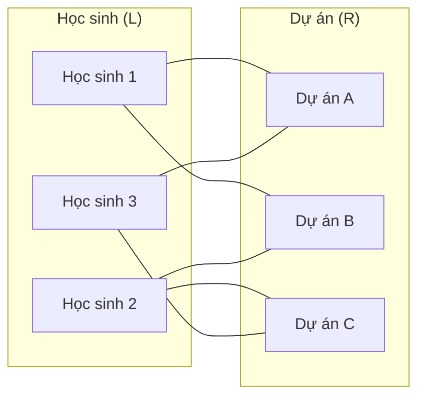
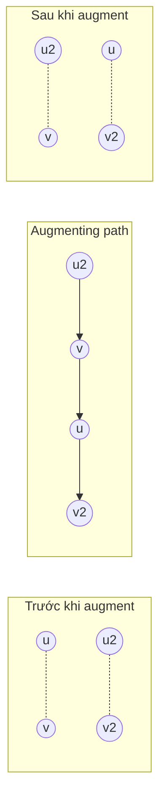
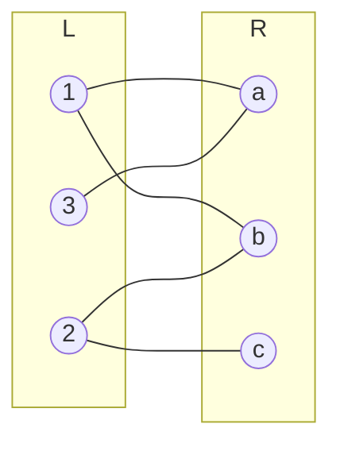
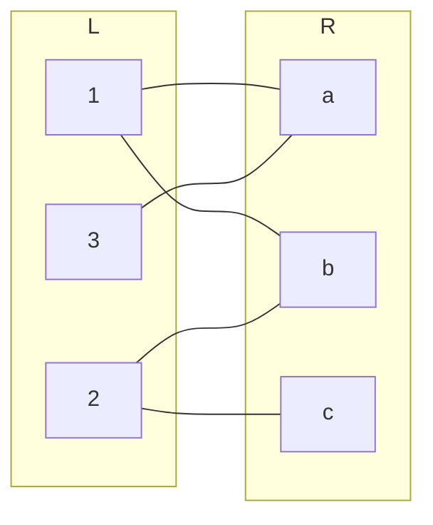
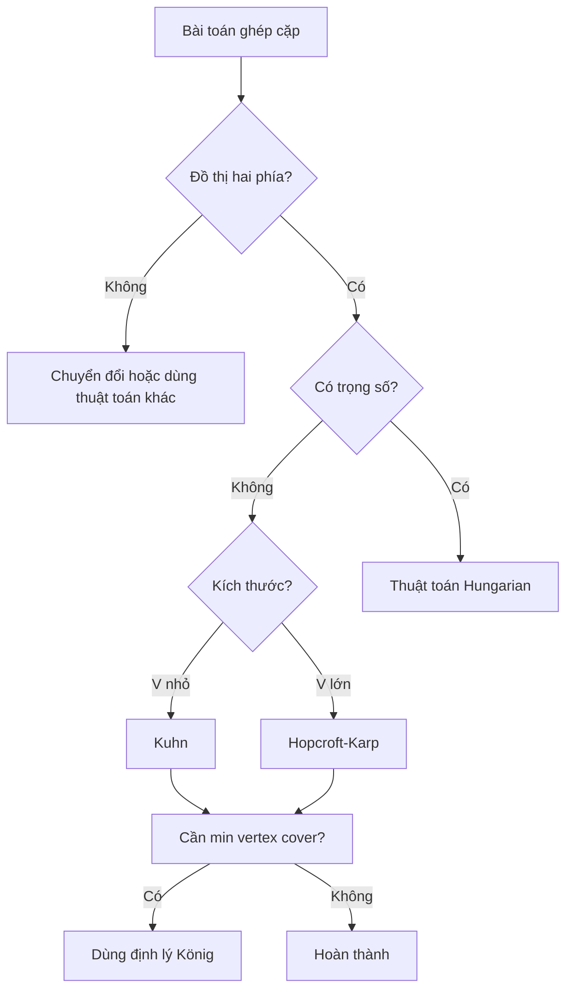

# Bài 42: Bipartite Matching - Ghép cặp trên đồ thị hai phía

> **Tác giả:** FPTOJ Team<br>
> **Nội dung tham khảo từ:** CP-Algorithms, USACO Guide

---

## Bạn sẽ học được gì?

- Hiểu bài toán ghép cặp trên đồ thị hai phía (bipartite matching)
- Triển khai thuật toán Kuhn (Augmenting Path) với độ phức tạp $O(VE)$
- Triển khai thuật toán Hopcroft-Karp với độ phức tạp $O(E\sqrt{V})$
- Áp dụng định lý König để tìm tập đỉnh bao nhỏ nhất
- Giải bài toán phân công (Assignment Problem) với thuật toán Hungarian
- Nhận diện và giải các bài toán thực tế quy về bipartite matching

---

## 1. Bản chất vấn đề

### Đồ thị hai phía (Bipartite Graph)

Đồ thị hai phía là đồ thị mà tập đỉnh có thể chia thành hai tập $L$ và $R$ sao cho mọi cạnh đều nối một đỉnh trong $L$ với một đỉnh trong $R$. Không có cạnh nào nối hai đỉnh cùng bên.

### Ghép cặp (Matching)

**Matching** là một tập các cạnh sao cho không hai cạnh nào chia sẻ đỉnh chung (tức là mỗi đỉnh chỉ được ghép tối đa một lần).

**Maximum Matching** là matching có số cạnh lớn nhất.

**Perfect Matching** là matching mà mọi đỉnh đều thuộc đúng một cạnh trong matching.

### Ẩn dụ: Ghép cặp học sinh với dự án

Giả sử có $N$ học sinh và $M$ dự án. Mỗi học sinh chỉ quan tâm đến một số dự án nhất định. Ta muốn gán mỗi học sinh vào đúng một dự án (mỗi dự án chỉ do một nhóm thực hiện) sao cho số học sinh được gán là lớn nhất.

Đây chính là bài toán **Maximum Bipartite Matching**: bên trái là học sinh, bên phải là dự án, cạnh thể hiện sự quan tâm.



Một maximum matching có thể là: Học sinh 1 ghép Dự án B, Học sinh 2 ghép Dự án C, Học sinh 3 ghép Dự án A (ghép được 3 cặp).

### Các thuật ngữ quan trọng

| Thuật ngữ | Ý nghĩa |
|-----------|---------|
| **Matching** | Tập cạnh không chia sẻ đỉnh |
| **Maximum Matching** | Matching có nhiều cạnh nhất |
| **Perfect Matching** | Mọi đỉnh đều thuộc đúng một cạnh trong matching |
| **Alternating Path** | Đường đi xen kẽ cạnh trong và ngoài matching |
| **Augmenting Path** | Alternating path mà hai đầu đều là đỉnh chưa ghép |

---

## 2. Thuật toán Kuhn (Augmenting Path)

### Bản chất vấn đề

Cho đồ thị hai phía có $|L|$ đỉnh bên trái và $|R|$ đỉnh bên phải, tìm maximum matching — tập cạnh kề đôi lớn nhất.

### Tư duy cốt lõi

**Định lý Berge:** Một matching là maximum nếu và chỉ nếu không tồn tại augmenting path.

Vậy thuật toán rất đơn giản: lặp lại tìm augmenting path, nếu tìm được thì "đảo" trạng thái (cạnh trong matching ra ngoài, cạnh ngoài vào trong), tăng kích thước matching lên 1.

Trên đồ thị hai phía với matching $M$:

- **Alternating path**: đường đi xen kẽ giữa cạnh thuộc $M$ và cạnh không thuộc $M$.
- **Augmenting path**: alternating path mà hai đầu đều là đỉnh **chưa được ghép**.

Khi tìm được augmenting path, ta "lật" trạng thái: tất cả cạnh trên path đổi từ trong matching ra ngoài và ngược lại. Kết quả là matching tăng kích thước đúng 1.



### Pseudocode

Thuật toán Kuhn hoạt động như sau:

1. Khởi tạo matching rỗng.
2. Với mỗi đỉnh $u$ bên trái (chưa ghép), chạy DFS tìm augmenting path bắt đầu từ $u$.
3. Hàm DFS($u$): duyệt qua các đỉnh $v$ kề $u$. Nếu $v$ chưa ghép hoặc DFS từ đỉnh đang ghép với $v$ thành công thì ghép $u$ với $v$.
4. Lặp lại cho đến khi duyệt hết đỉnh bên trái.

### Trace từng bước

Ví dụ: 3 đỉnh bên trái $\{1, 2, 3\}$, 3 đỉnh bên phải $\{a, b, c\}$.

Cạnh: $1$-$a$, $1$-$b$, $2$-$b$, $2$-$c$, $3$-$a$.



**Bước 1:** DFS(1) — thử ghép đỉnh 1.

- Thử $a$: $a$ chưa ghép → ghép $1$-$a$. Matching = $\{1\text{-}a\}$.

**Bước 2:** DFS(2) — thử ghép đỉnh 2.

- Thử $b$: $b$ chưa ghép → ghép $2$-$b$. Matching = $\{1\text{-}a, 2\text{-}b\}$.

**Bước 3:** DFS(3) — thử ghép đỉnh 3.

- Thử $a$: $a$ đã ghép với $1$ → thử DFS(1).
    - DFS(1): thử $b$: $b$ đã ghép với $2$ → thử DFS(2).
        - DFS(2): thử $c$: $c$ chưa ghép → ghép $2$-$c$. Return true.
    - Ghép $1$-$b$. Return true.
- Ghép $3$-$a$. Return true. Matching = $\{3\text{-}a, 1\text{-}b, 2\text{-}c\}$.

Kết quả: maximum matching = 3 (perfect matching).

### Phân tích tính đúng đắn

**Bảo toàn tính hợp lệ:** Mỗi bước augment chỉ đảo trạng thái các cạnh trên augmenting path. Vì augmenting path bắt đầu và kết thúc ở đỉnh chưa ghép, việc đảo không vi phạm tính chất mỗi đỉnh chỉ thuộc tối đa một cạnh.

**Tính tối ưu:** Theo định lý Berge, matching là maximum khi không còn augmenting path. Thuật toán dừng đúng khi DFS từ mọi đỉnh bên trái đều thất bại — tức là không còn augmenting path.

**Tính dừng:** Mỗi lần augment tăng kích thước matching đúng 1. Matching tối đa có $|L|$ cạnh nên thuật toán dừng sau tối đa $|L|$ lần augment.

### Đánh giá độ phức tạp

- **Thời gian:** $O(VE)$ — mỗi đỉnh bên trái gọi DFS một lần, mỗi DFS tối đa duyệt qua $O(E)$ cạnh.
- **Bộ nhớ:** $O(V + E)$ — lưu đồ thị và mảng visited.

### Code

=== "C++"

    ```cpp
    #include <bits/stdc++.h>
    using namespace std;

    const int MAXN = 10005;

    int n, m;
    vector<int> adj[MAXN];
    int matchR[MAXN];
    bool visited[MAXN];

    bool dfs(int u) {
        for (int v : adj[u]) {
            if (visited[v]) continue;
            visited[v] = true;
            if (matchR[v] == -1 || dfs(matchR[v])) {
                matchR[v] = u;
                return true;
            }
        }
        return false;
    }

    int maxMatching() {
        memset(matchR, -1, sizeof(matchR));
        int result = 0;

        vector<int> order(n);
        iota(order.begin(), order.end(), 0);
        shuffle(order.begin(), order.end(), mt19937(random_device()()));

        for (int u : order) {
            memset(visited, false, sizeof(visited));
            if (dfs(u)) result++;
        }
        return result;
    }

    int main() {
        ios_base::sync_with_stdio(false);
        cin.tie(nullptr);

        cin >> n >> m;
        int e;
        cin >> e;
        for (int i = 0; i < e; i++) {
            int u, v;
            cin >> u >> v;
            u--; v--;
            adj[u].push_back(v);
        }

        cout << maxMatching() << "\n";

        for (int v = 0; v < m; v++) {
            if (matchR[v] != -1) {
                cout << matchR[v] + 1 << " " << v + 1 << "\n";
            }
        }

        return 0;
    }
    ```

=== "Python"

    ```python
    import sys
    from collections import defaultdict
    import random

    input = sys.stdin.readline

    def solve():
        n, m = map(int, input().split())
        e = int(input())
        adj = defaultdict(list)
        for _ in range(e):
            u, v = map(int, input().split())
            u -= 1; v -= 1
            adj[u].append(v)

        matchR = [-1] * m

        def dfs(u, visited):
            for v in adj[u]:
                if visited[v]:
                    continue
                visited[v] = True
                if matchR[v] == -1 or dfs(matchR[v], visited):
                    matchR[v] = u
                    return True
            return False

        result = 0
        order = list(range(n))
        random.shuffle(order)

        for u in order:
            visited = [False] * m
            if dfs(u, visited):
                result += 1

        print(result)
        for v in range(m):
            if matchR[v] != -1:
                print(matchR[v] + 1, v + 1)

    solve()
    ```

### Heuristic tăng tốc cho Kuhn

1. **Xáo trộn thứ tự đỉnh:** Tránh worst-case khi đỉnh được cho theo thứ tự xấu.
2. **Khởi tạo tham lam (Greedy init):** Trước khi chạy Kuhn, duyệt qua tất cả cạnh và ghép ngay nếu có thể. Điều này giúp matching ban đầu gần maximum, giảm số lần DFS.
3. **Thứ tự ưu tiên đỉnh bậc nhỏ trước:** Đỉnh bậc nhỏ khó tìm augmenting path hơn, nên xử lý trước.

=== "C++"

    ```cpp
    int greedyInit() {
        int cnt = 0;
        for (int u = 0; u < n; u++) {
            for (int v : adj[u]) {
                if (matchR[v] == -1) {
                    matchR[v] = u;
                    cnt++;
                    break;
                }
            }
        }
        return cnt;
    }
    ```

=== "Python"

    ```python
    def greedy_init(n, adj, matchR):
        cnt = 0
        for u in range(n):
            for v in adj[u]:
                if matchR[v] == -1:
                    matchR[v] = u
                    cnt += 1
                    break
        return cnt
    ```

---

## 3. Thuật toán Hopcroft-Karp

### Bản chất vấn đề

Giống thuật toán Kuhn: tìm maximum bipartite matching, nhưng với độ phức tạp tốt hơn khi đồ thị lớn.

### Tư duy cốt lõi

Kuhn tìm **một** augmenting path mỗi lần → $O(VE)$. Hopcroft-Karp tìm **đồng thời tất cả** các augmenting path ngắn nhất bằng BFS, sau đó augment tất cả bằng DFS → chỉ cần $O(\sqrt{V})$ phases.

**Cấu trúc mỗi phase:**

1. **BFS:** Tính khoảng cách từ tất cả đỉnh chưa ghép bên trái. Chỉ đi theo alternating paths. Dừng khi gặp đỉnh chưa ghép bên phải. Mục đích: tìm **tất cả** augmenting paths có độ dài ngắn nhất.
2. **DFS:** Từ mỗi đỉnh chưa ghép bên trái, chạy DFS chỉ đi qua các cạnh thỏa mãn khoảng cách BFS ($dist[u] + 1 = dist[v]$). Mỗi DFS tìm được một augmenting path và augment.
3. Lặp lại cho đến khi không còn augmenting path.

### Phân tích tính đúng đắn

**Tính đúng của BFS:** BFS xây dựng lớp khoảng cách sao cho mọi augmenting path ngắn nhất đều đi qua các cạnh thỏa mãn $dist[u] + 1 = dist[v]$. Điều này đảm bảo DFS chỉ tìm đúng các augmenting path ngắn nhất.

**Tối ưu theo phase:** Sau mỗi phase, tất cả augmenting paths ngắn nhất đều được augment. Điều này đảm bảo độ dài augmenting path tăng dần qua các phase.

**Số phase tối đa:** Có tối đa $2\sqrt{V} + 1$ phases. Bởi vì:
- Sau $\sqrt{V}$ phases, độ dài augmenting path tăng lên ít nhất $\sqrt{V}$.
- Đường đi ngắn nhất từ đỉnh chưa ghép bên trái sang đỉnh chưa ghép bên phải có độ dài tối đa $2\sqrt{V} + 1$ (vì mỗi augmenting path tăng matching lên 1).

### Đánh giá độ phức tạp

- **Thời gian:** $O(E\sqrt{V})$ — mỗi phase BFS + DFS chạy $O(E)$, có tối đa $O(\sqrt{V})$ phases.
- **Bộ nhớ:** $O(V + E)$ — lưu đồ thị, mảng matching, mảng khoảng cách.

### Code

=== "C++"

    ```cpp
    #include <bits/stdc++.h>
    using namespace std;

    const int MAXN = 100005;
    const int INF = 1e9;

    int n, m;
    vector<int> adj[MAXN];
    int matchL[MAXN], matchR[MAXN];
    int dist[MAXN];

    bool bfs() {
        queue<int> q;
        for (int u = 0; u < n; u++) {
            if (matchL[u] == -1) {
                dist[u] = 0;
                q.push(u);
            } else {
                dist[u] = INF;
            }
        }

        bool found = false;
        while (!q.empty()) {
            int u = q.front(); q.pop();
            for (int v : adj[u]) {
                int pu = matchR[v];
                if (pu == -1) {
                    found = true;
                } else if (dist[pu] == INF) {
                    dist[pu] = dist[u] + 1;
                    q.push(pu);
                }
            }
        }
        return found;
    }

    bool dfs(int u) {
        for (int v : adj[u]) {
            int pu = matchR[v];
            if (pu == -1 || (dist[pu] == dist[u] + 1 && dfs(pu))) {
                matchL[u] = v;
                matchR[v] = u;
                return true;
            }
        }
        dist[u] = INF;
        return false;
    }

    int hopcroftKarp() {
        memset(matchL, -1, sizeof(matchL));
        memset(matchR, -1, sizeof(matchR));

        int result = 0;
        while (bfs()) {
            for (int u = 0; u < n; u++) {
                if (matchL[u] == -1 && dfs(u)) {
                    result++;
                }
            }
        }
        return result;
    }

    int main() {
        ios_base::sync_with_stdio(false);
        cin.tie(nullptr);

        cin >> n >> m;
        int e;
        cin >> e;
        for (int i = 0; i < e; i++) {
            int u, v;
            cin >> u >> v;
            u--; v--;
            adj[u].push_back(v);
        }

        cout << hopcroftKarp() << "\n";

        for (int u = 0; u < n; u++) {
            if (matchL[u] != -1) {
                cout << u + 1 << " " << matchL[u] + 1 << "\n";
            }
        }

        return 0;
    }
    ```

=== "Python"

    ```python
    import sys
    from collections import deque, defaultdict

    input = sys.stdin.readline
    INF = float('inf')

    def solve():
        n, m = map(int, input().split())
        e = int(input())
        adj = defaultdict(list)
        for _ in range(e):
            u, v = map(int, input().split())
            adj[u - 1].append(v - 1)

        matchL = [-1] * n
        matchR = [-1] * m
        dist = [0] * n

        def bfs():
            q = deque()
            for u in range(n):
                if matchL[u] == -1:
                    dist[u] = 0
                    q.append(u)
                else:
                    dist[u] = INF

            found = False
            while q:
                u = q.popleft()
                for v in adj[u]:
                    pu = matchR[v]
                    if pu == -1:
                        found = True
                    elif dist[pu] == INF:
                        dist[pu] = dist[u] + 1
                        q.append(pu)
            return found

        def dfs(u):
            for v in adj[u]:
                pu = matchR[v]
                if pu == -1 or (dist[pu] == dist[u] + 1 and dfs(pu)):
                    matchL[u] = v
                    matchR[v] = u
                    return True
            dist[u] = INF
            return False

        result = 0
        while bfs():
            for u in range(n):
                if matchL[u] == -1 and dfs(u):
                    result += 1

        print(result)
        for u in range(n):
            if matchL[u] != -1:
                print(u + 1, matchL[u] + 1)

    solve()
    ```

### So sánh Kuhn và Hopcroft-Karp

| Tiêu chí | Kuhn | Hopcroft-Karp |
|-----------|------|---------------|
| Độ phức tạp | $O(VE)$ | $O(E\sqrt{V})$ |
| Độ khó code | Rất dễ | Trung bình |
| Khi nào dùng | $V \leq 1000$, $E \leq 10^4$ | $V$ lớn, $E$ lớn |
| Thực tế | Thường đủ cho contest | Cần khi $V > 10^4$ |

!!! tip "Mẹo thi đấu"
    Trong contest, hãy ưu tiên Kuhn trước vì code ngắn, dễ debug. Chỉ chuyển sang Hopcroft-Karp khi Kuhn bị TLE.

---

## 4. Định lý König (Min Vertex Cover)

### Bản chất vấn đề

**Vertex cover** là tập đỉnh sao cho mỗi cạnh đều có ít nhất một đầu mút nằm trong tập đó. Bài toán: tìm minimum vertex cover — tập đỉnh bao nhỏ nhất.

### Tư duy cốt lõi

> **Định lý König:** Trong đồ thị hai phía, kích thước maximum matching = kích thước minimum vertex cover.

Đây là kết quả lý thuyết mạnh mẽ: hai bài toán tưởng chừng khác nhau lại có lời giải liên hệ trực tiếp.

### Phân tích tính đúng đắn

Sau khi chạy thuật toán matching, ta tìm min vertex cover bằng BFS trên alternating paths:

1. Đánh dấu tất cả đỉnh **chưa ghép** bên trái.
2. Chạy BFS từ các đỉnh đã đánh dấu theo alternating paths:
    - Từ đỉnh bên trái: đi theo cạnh **không** trong matching sang bên phải.
    - Từ đỉnh bên phải: đi theo cạnh **trong** matching sang bên trái.
3. Min vertex cover = (đỉnh bên trái **KHÔNG** bị đánh dấu) $\cup$ (đỉnh bên phải **BỊ** đánh dấu).



Trong ví dụ trên, đỉnh xanh lá nằm trong vertex cover, đỉnh đỏ không nằm trong.

### Đánh giá độ phức tạp

- **Thời gian:** $O(V + E)$ — BFS trên đồ thị đã có matching.
- **Bộ nhớ:** $O(V + E)$.

### Code

=== "C++"

    ```cpp
    vector<int> minVertexCover(int n, int m, vector<int> adj[],
                                vector<int>& matchL, vector<int>& matchR) {
        vector<bool> visitedL(n, false), visitedR(m, false);
        queue<int> q;

        for (int u = 0; u < n; u++) {
            if (matchL[u] == -1) {
                visitedL[u] = true;
                q.push(u);
            }
        }

        while (!q.empty()) {
            int u = q.front(); q.pop();
            for (int v : adj[u]) {
                if (!visitedR[v] && matchL[u] != v) {
                    visitedR[v] = true;
                    if (matchR[v] != -1 && !visitedL[matchR[v]]) {
                        visitedL[matchR[v]] = true;
                        q.push(matchR[v]);
                    }
                }
            }
        }

        vector<int> cover;
        for (int u = 0; u < n; u++)
            if (!visitedL[u]) cover.push_back(u);
        for (int v = 0; v < m; v++)
            if (visitedR[v]) cover.push_back(n + v);
        return cover;
    }
    ```

=== "Python"

    ```python
    from collections import deque

    def min_vertex_cover(n, m, adj, matchL, matchR):
        visitedL = [False] * n
        visitedR = [False] * m
        q = deque()

        for u in range(n):
            if matchL[u] == -1:
                visitedL[u] = True
                q.append(u)

        while q:
            u = q.popleft()
            for v in adj[u]:
                if not visitedR[v] and matchL[u] != v:
                    visitedR[v] = True
                    if matchR[v] != -1 and not visitedL[matchR[v]]:
                        visitedL[matchR[v]] = True
                        q.append(matchR[v])

        cover = []
        for u in range(n):
            if not visitedL[u]:
                cover.append(u)
        for v in range(m):
            if visitedR[v]:
                cover.append(n + v)
        return cover
    ```

### Ứng dụng: Maximum Independent Set

> Trong đồ thị hai phía: Maximum Independent Set = Tổng số đỉnh $-$ Maximum Matching.

Independent set là tập đỉnh sao cho không hai đỉnh nào kề nhau. Đây là bổ sung của vertex cover.

---

## 5. Thuật toán Hungarian (Bài toán phân công)

### Bản chất vấn đề

Cho $N$ người và $N$ việc. Chi phí để người $i$ làm việc $j$ là $cost[i][j]$. Tìm cách phân công mỗi người đúng một việc sao cho **tổng chi phí nhỏ nhất**.

Đây là bài toán **Minimum Weight Perfect Matching** trên đồ thị hai phía đầy đủ.

### Tư duy cốt lõi

Thuật toán Hungarian (Kuhn-Munkres) hoạt động trên nguyên lý đối ngẫu:

1. Duy trì nhãn (label) cho mỗi đỉnh: $lx[u]$ cho bên trái, $ly[v]$ cho bên phải.
2. Biên $(u,v)$ là **tight** nếu $lx[u] + ly[v] = cost[u][v]$.
3. Chỉ xem xét đồ thị con gồm các cạnh tight. Nếu tìm được perfect matching trên đồ thị con này → đó là lời giải tối ưu.
4. Nếu chưa có perfect matching, điều chỉnh nhãn để thêm cạnh tight mới.

### Phân tích tính đúng đắn

**Invariant:** Luôn duy trì $lx[u] + ly[v] \leq cost[u][v]$ cho mọi cạnh $(u,v)$. Mọi cạnh tight đều thỏa mãn đẳng thức.

**Tối ưu:** Khi tìm được perfect matching trên đồ thị con tight, tổng chi phí bằng $\sum lx[u] + \sum ly[v]$. Vì mọi cạnh trong matching đều tight, đây là nghiệm tối ưu theo nguyên lý đối ngẫu tuyến tính.

**Hội tụ:** Mỗi lần điều chỉnh nhãn,至少 một cạnh mới trở thành tight, mở rộng đồ thị con. Sau tối đa $N^2$ lần điều chỉnh, đồ thị con chứa perfect matching.

### Đánh giá độ phức tạp

- **Thời gian:** $O(N^3)$.
- **Bộ nhớ:** $O(N^2)$.

### Code

=== "C++"

    ```cpp
    #include <bits/stdc++.h>
    using namespace std;

    const int MAXN = 505;
    const int INF = 1e9;

    int n;
    int cost[MAXN][MAXN];
    int lx[MAXN], ly[MAXN];
    int matchX[MAXN], matchY[MAXN];
    int slack[MAXN], slackX[MAXN];
    bool visitedX[MAXN], visitedY[MAXN];

    void hungarian() {
        for (int i = 0; i < n; i++) {
            lx[i] = -INF;
            ly[i] = 0;
            matchX[i] = matchY[i] = -1;
            for (int j = 0; j < n; j++) {
                lx[i] = max(lx[i], cost[i][j]);
            }
        }

        for (int u = 0; u < n; u++) {
            for (int v = 0; v < n; v++) {
                slack[v] = INF;
                slackX[v] = -1;
            }
            memset(visitedX, false, sizeof(visitedX));
            memset(visitedY, false, sizeof(visitedY));

            int x, y = -1;
            matchX[u] = -1;

            queue<int> q;
            visitedX[u] = true;
            q.push(u);

            while (y == -1) {
                while (!q.empty() && y == -1) {
                    x = q.front(); q.pop();
                    for (int v = 0; v < n; v++) {
                        if (visitedY[v]) continue;
                        int gap = lx[x] + ly[v] - cost[x][v];
                        if (gap == 0) {
                            visitedY[v] = true;
                            if (matchY[v] == -1) {
                                y = v;
                            } else {
                                visitedX[matchY[v]] = true;
                                q.push(matchY[v]);
                            }
                        } else if (slack[v] > gap) {
                            slack[v] = gap;
                            slackX[v] = x;
                        }
                    }
                }

                if (y != -1) break;

                int delta = INF;
                for (int v = 0; v < n; v++) {
                    if (!visitedY[v]) delta = min(delta, slack[v]);
                }
                for (int i = 0; i < n; i++) {
                    if (visitedX[i]) lx[i] -= delta;
                    if (visitedY[i]) ly[i] += delta;
                }
                for (int v = 0; v < n; v++) {
                    if (!visitedY[v]) slack[v] -= delta;
                }

                for (int v = 0; v < n; v++) {
                    if (!visitedY[v] && slack[v] == 0) {
                        visitedY[v] = true;
                        if (matchY[v] == -1) {
                            y = v;
                        } else {
                            visitedX[matchY[v]] = true;
                            q.push(matchY[v]);
                        }
                    }
                }
            }

            while (y != -1) {
                int py = matchX[slackX[y]];
                matchX[slackX[y]] = y;
                matchY[y] = slackX[y];
                y = py;
            }
        }
    }

    int main() {
        ios_base::sync_with_stdio(false);
        cin.tie(nullptr);

        cin >> n;
        for (int i = 0; i < n; i++) {
            for (int j = 0; j < n; j++) {
                cin >> cost[i][j];
            }
        }

        hungarian();

        int totalCost = 0;
        for (int i = 0; i < n; i++) {
            totalCost += cost[i][matchX[i]];
        }
        cout << totalCost << "\n";
        for (int i = 0; i < n; i++) {
            cout << i + 1 << " " << matchX[i] + 1 << "\n";
        }

        return 0;
    }
    ```

=== "Python"

    ```python
    import sys
    from collections import deque

    input = sys.stdin.readline
    INF = float('inf')

    def hungarian(cost):
        n = len(cost)
        lx = [max(row) for row in cost]
        ly = [0] * n
        matchX = [-1] * n
        matchY = [-1] * n

        for u in range(n):
            slack = [INF] * n
            slackX = [-1] * n
            visitedX = [False] * n
            visitedY = [False] * n

            matchX[u] = -1
            visitedX[u] = True
            q = deque([u])
            y = -1

            while y == -1:
                while q and y == -1:
                    x = q.popleft()
                    for v in range(n):
                        if visitedY[v]:
                            continue
                        gap = lx[x] + ly[v] - cost[x][v]
                        if gap == 0:
                            visitedY[v] = True
                            if matchY[v] == -1:
                                y = v
                            else:
                                visitedX[matchY[v]] = True
                                q.append(matchY[v])
                        elif slack[v] > gap:
                            slack[v] = gap
                            slackX[v] = x

                if y != -1:
                    break

                delta = min(slack[v] for v in range(n) if not visitedY[v])
                for i in range(n):
                    if visitedX[i]:
                        lx[i] -= delta
                    if visitedY[i]:
                        ly[i] += delta
                    if not visitedY[i]:
                        slack[i] -= delta

                for v in range(n):
                    if not visitedY[v] and slack[v] == 0:
                        visitedY[v] = True
                        if matchY[v] == -1:
                            y = v
                        else:
                            visitedX[matchY[v]] = True
                            q.append(matchY[v])

            while y != -1:
                py = matchX[slackX[y]]
                matchX[slackX[y]] = y
                matchY[y] = slackX[y]
                y = py

        total = sum(cost[i][matchX[i]] for i in range(n))
        return total, matchX

    n = int(input())
    cost = [list(map(int, input().split())) for _ in range(n)]
    total, assignment = hungarian(cost)
    print(total)
    for i in range(n):
        print(i + 1, assignment[i] + 1)
    ```

---

## 6. Ứng dụng

### 6.1. Phân công công việc (Job Assignment)

Bài toán cổ điển: $N$ người, $M$ việc ($N \leq M$), mỗi người có thể làm một số việc. Tìm maximum number of việc được gán.

Giải pháp: Chạy trực tiếp maximum bipartite matching.

### 6.2. Maximum Independent Set trên đồ thị hai phía

> Maximum Independent Set = Tổng số đỉnh $-$ Maximum Matching.

Áp dụng: chọn nhiều khóa học nhất sao cho không có hai khóa học nào trùng lịch thi.

### 6.3. Minimum Path Cover trong DAG

Cho DAG có $N$ đỉnh. Tìm số đường đi ít nhất sao cho mỗi đỉnh thuộc đúng một đường đi.

> **Định lý Dilworth:** Min path cover = $N$ $-$ Maximum matching trên đồ thị liên kết.

Biến đổi: Mỗi đỉnh $u$ trong DAG tách thành $u_{out}$ và $u_{in}$. Nếu có cạnh $u \rightarrow v$ trong DAG, thêm cạnh $u_{out} \rightarrow v_{in}$. Chạy maximum bipartite matching.

=== "C++"

    ```cpp
    int minPathCover(int n, vector<pair<int,int>>& edges) {
        vector<vector<int>> adj(n);
        for (auto [u, v] : edges) {
            adj[u].push_back(v);
        }
        int matching = kuhnOrHopcroftKarp(adj, n, n);
        return n - matching;
    }
    ```

=== "Python"

    ```python
    def min_path_cover(n, edges):
        adj = [[] for _ in range(n)]
        for u, v in edges:
            adj[u].append(v)
        matching = kuhn_or_hopcroft_karp(adj, n, n)
        return n - matching
    ```

### 6.4. Ghép cặp ổn định (Stable Marriage)

Bài toán: $N$ người nam và $N$ người nữ, mỗi người có danh sách ưu tiên về bên kia. Tìm perfect matching sao cho không tồn tại cặp $(m, w)$ mà $m$ thích $w$ hơn vợ hiện tại VÀ $w$ thích $m$ hơn chồng hiện tại.

Giải pháp: Thuật toán Gale-Shapley, $O(N^2)$. Đây là biến thể khác của matching, không phải bipartite matching thông thường.

### 6.5. Bài toán liên quan đến số nguyên tố

Nhiều bài toán yêu cầu: cho mảng, tìm maximum matching trên đồ thị mà hai phần tử kề nhau nếu tổng của chúng là số nguyên tố.

Giải pháp: Tách mảng thành hai tập (chẵn/lẻ), xây đồ thị hai phía, chạy matching.

---

## 7. Lưu ý và Cạm bẫy

### Phải reset visited mỗi lần gọi DFS trong Kuhn

=== "C++"

    ```cpp
    // SAI: quên reset visited
    for (int u = 0; u < n; u++) {
        if (dfs(u)) result++;
    }

    // ĐÚNG:
    for (int u = 0; u < n; u++) {
        memset(visited, false, sizeof(visited));
        if (dfs(u)) result++;
    }
    ```

=== "Python"

    ```python
    # SAI: quên reset visited
    for u in range(n):
        if dfs(u, visited):
            result += 1

    # ĐÚNG:
    for u in range(n):
        visited = [False] * m
        if dfs(u, visited):
            result += 1
    ```

### Kuhn có thể rất chậm nếu không dùng heuristic

Ví dụ worst-case: đồ thị "ladder" → Kuhn chạy $O(VE)$ chậm. Hãy dùng:

- Greedy initialization trước khi chạy Kuhn.
- Xáo trộn thứ tự đỉnh.
- Thứ tự đỉnh theo bậc tăng dần.

### Không phải mọi đồ thị đều là bipartite

Đồ thị hai phía **KHÔNG** có chu trình lẻ. Trước khi áp dụng, cần kiểm tra:

=== "C++"

    ```cpp
    bool isBipartite(int n, vector<vector<int>>& adj) {
        vector<int> color(n, -1);
        for (int i = 0; i < n; i++) {
            if (color[i] != -1) continue;
            queue<int> q;
            color[i] = 0;
            q.push(i);
            while (!q.empty()) {
                int u = q.front(); q.pop();
                for (int v : adj[u]) {
                    if (color[v] == -1) {
                        color[v] = 1 - color[u];
                        q.push(v);
                    } else if (color[v] == color[u]) {
                        return false;
                    }
                }
            }
        }
        return true;
    }
    ```

=== "Python"

    ```python
    from collections import deque

    def is_bipartite(n, adj):
        color = [-1] * n
        for i in range(n):
            if color[i] != -1:
                continue
            q = deque([i])
            color[i] = 0
            while q:
                u = q.popleft()
                for v in adj[u]:
                    if color[v] == -1:
                        color[v] = 1 - color[u]
                        q.append(v)
                    elif color[v] == color[u]:
                        return False
        return True
    ```

### Chỉ số đỉnh (0-indexed vs 1-indexed)

Luôn ghi nhớ chuyển về 0-indexed trước khi xử lý. Nhiều bài trên SPOJ/CF dùng 1-indexed.

### Hopcroft-Karp cần hai mảng matchL và matchR

Khác với Kuhn chỉ cần $matchR$, Hopcroft-Karp cần cả $matchL$ và $matchR$ để tra cứu nhanh trong BFS.

### Bài toán Maximum Weight Bipartite Matching

Nếu mỗi cạnh có trọng số và cần maximize tổng trọng số → dùng thuật toán Hungarian (Kuhn-Munkres) hoặc min-cost max-flow. Không thể dùng Kuhn/Hopcroft-Karp trực tiếp.

---

## 8. Bài tập luyện tập

| Bài | Nền tảng | Độ khó | Chủ đề |
|-----|----------|--------|--------|
| [CSES - Building Teams](https://cses.fi/problemset/task/1668) | CSES | Trung bình | Kiểm tra đồ thị hai phía |
| [CSES - School Dance](https://cses.fi/problemset/task/1696) | CSES | Trung bình | Matching cơ bản |
| [CSES - Distinct Routes II](https://cses.fi/problemset/task/2130) | CSES | Khó | Matching + đường đi |
| [SPOJ - MATCHING](https://www.spoj.com/problems/MATCHING/) | SPOJ | Khó | Hopcroft-Karp bắt buộc |
| [SPOJ - ADABLOOM](https://www.spoj.com/problems/ADABLOOM/) | SPOJ | Khó | Matching nâng cao |
| [CF 498C - Array and Operations](https://codeforces.com/problemset/problem/498/C) | CF | Khó | Matching + số học |
| [CF 1045I - Palindrome Pairs](https://codeforces.com/problemset/problem/1045/I) | CF | Trung bình | Bitmask + matching |
| [CF 1139E - Maximize Mex](https://codeforces.com/problemset/problem/1139/E) | CF | Khó | Matching online |
| [UVa 10080 - Gopher II](https://onlinejudge.org/external/100/10080.pdf) | UVA | Trung bình | Matching cơ bản |
| [UVa 11159 - Factors and Multiples](https://onlinejudge.org/external/111/11159.pdf) | UVA | Trung bình | Bipartite check + matching |

---

## Tóm tắt thuật toán



---

## Tham khảo

- [CP-Algorithms - Bipartite Matching](https://cp-algorithms.com/graph/bipartite_matching.html)
- [USACO Guide - Bipartite Matching](https://usaco.guide/adv/max-flow?lang=cpp)
- [CP-Algorithms - Hungarian Algorithm](https://cp-algorithms.com/graph/hungarian-algorithm.html)
- [KACTL - Hopcroft-Karp](https://github.com/kth-competitive-programming/kactl/blob/main/content/graph/HopcroftKarp.h)
