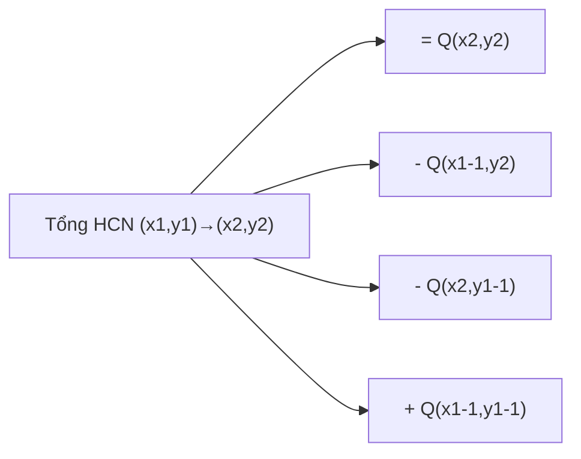

# BIT 2D (Fenwick Tree 2D) - Truy Vấn Tổng Hình Chữ Nhật

> **Tác giả:** FPTOJ Team<br>
> **Nội dung tham khảo từ:** VNOI Wiki - Fenwick Tree, CP-Algorithms

---

## 1. Bản chất vấn đề

### Bài toán: Truy vấn tổng hình chữ nhật

Cho ma trận $A$ kích thước $N \times M$, thực hiện $Q$ truy vấn:

- **Update:** `update(x, y, val)` — Cộng $val$ vào $A[x][y]$.
- **Query:** `query(x1, y1, x2, y2)` — Tính tổng các phần tử trong hình chữ nhật từ $(x1, y1)$ đến $(x2, y2)$.

**Fenwick Tree 1D** giải quyết trên mảng 1D. Mở rộng lên 2D để xử lý ma trận.

### So sánh

| Cấu trúc | Update | Query | Không gian |
|----------|--------|-------|------------|
| Duyệt thường | $O(1)$ | $O(N \cdot M)$ | $O(NM)$ |
| Prefix Sum 2D | $O(1)$ sau $O(NM)$ build | $O(1)$ | $O(NM)$ |
| **BIT 2D** | $O(\log N \cdot \log M)$ | $O(\log N \cdot \log M)$ | $O(NM)$ |

Prefix Sum 2D không hỗ trợ update. BIT 2D hỗ trợ cả update và query.

---

## 2. Tư duy cốt lõi

### Từ BIT 1D sang BIT 2D

**BIT 1D:** `query(i)` = tổng từ $1$ đến $i$. Dùng `i & (-i)` để nhảy.

**BIT 2D:** Mở rộng — `query(x, y)` = tổng hình chữ nhật từ $(1,1)$ đến $(x,y)$.

Mỗi ô `(x, y)` trong BIT 2D quản lý một hình chữ nhật con.

### Công thức update BIT 2D

Với mỗi cập nhật `update(x, y, val)`, duyệt tất cả nút cha theo cả 2 chiều:

- Vòng ngoài: `x` nhảy theo `x += x & (-x)` (tương tự BIT 1D).
- Vòng trong: với mỗi `x`, duyệt `y` theo `y += y & (-y)`.
- Cộng `val` vào `bit[x][y]` tại mỗi nút.

### Công thức query BIT 2D

Với mỗi truy vấn `query(x, y)` (tổng từ $(1,1)$ đến $(x,y)$):

- Vòng ngoài: `x` giảm theo `x -= x & (-x)`.
- Vòng trong: với mỗi `x`, duyệt `y` giảm theo `y -= y & (-y)`.
- Cộng dồn `bit[x][y]` vào kết quả.

### Truy vấn hình chữ nhật bằng nguyên lý bao hàm - loại trừ

$$\text{sum}(x1, y1, x2, y2) = Q(x2, y2) - Q(x1-1, y2) - Q(x2, y1-1) + Q(x1-1, y1-1)$$



### Trace chi tiết

**Ma trận $3 \times 3$:**

| | $y=1$ | $y=2$ | $y=3$ |
|---|---|---|---|
| $x=1$ | $2$ | $3$ | $1$ |
| $x=2$ | $4$ | $1$ | $5$ |
| $x=3$ | $3$ | $2$ | $6$ |

**Truy vấn:** Tổng HCN $(1,2)$ đến $(2,3)$.

**Kỳ vọng:** $A[1][2] + A[1][3] + A[2][2] + A[2][3] = 3 + 1 + 1 + 5 = 10$

**Tính bằng BIT:**

| Bước | Gọi | Kết quả |
|------|-----|---------|
| 1 | $Q(2, 3)$ | Tổng $(1,1) \to (2,3)$ = $2+3+1+4+1+5 = 16$ |
| 2 | $Q(0, 3)$ | $0$ (vì $x=0$) |
| 3 | $Q(2, 1)$ | Tổng $(1,1) \to (2,1)$ = $2+4 = 6$ |
| 4 | $Q(0, 1)$ | $0$ (vì $x=0$) |

$\text{Kết quả} = 16 - 0 - 6 + 0 = 10$ ✓

---

## 3. Phân tích tính đúng đắn

### BIT 2D dựa trên nguyên lý nào?

BIT 2D mở rộng BIT 1D: thay vì `bit[i]` quản lý đoạn 1D, `bit[i][j]` quản lý hình chữ nhật 2D.

Phép `i += i & (-i)` trong BIT 1D nhảy đến nút cha quản lý đoạn lớn hơn. Trong BIT 2D, lồng 2 vòng lặp `x` và `y` để nhảy theo cả 2 chiều.

### Công thức bao hàm - loại trừ 2D

Tương tự nguyên lý inclusion-exclusion cho diện tích:

$$\text{Area}(A \cup B) = \text{Area}(A) + \text{Area}(B) - \text{Area}(A \cap B)$$

Áp dụng cho tổng hình chữ nhật:

$$S(x1,y1,x2,y2) = S(1,1,x2,y2) - S(1,1,x1-1,y2) - S(1,1,x2,y1-1) + S(1,1,x1-1,y1-1)$$

---

## 4. Đánh giá độ phức tạp

| Thao tác | Thời gian | Không gian |
|----------|-----------|------------|
| Khởi tạo | $O(NM \log N \log M)$ | $O(NM)$ |
| Update 1 ô | $O(\log N \cdot \log M)$ | $O(1)$ |
| Query tổng HCN | $O(\log N \cdot \log M)$ | $O(1)$ |

---

## Code minh họa

=== "C++"

    ```cpp
    #include <bits/stdc++.h>
    using namespace std;

    int n, m;
    vector<vector<long long>> bit;

    void update(int x, int y, long long val) {
        for (int i = x; i <= n; i += i & (-i))
            for (int j = y; j <= m; j += j & (-j))
                bit[i][j] += val;
    }

    long long query(int x, int y) {
        long long res = 0;
        for (int i = x; i > 0; i -= i & (-i))
            for (int j = y; j > 0; j -= j & (-j))
                res += bit[i][j];
        return res;
    }

    long long queryRect(int x1, int y1, int x2, int y2) {
        return query(x2, y2) - query(x1 - 1, y2) - query(x2, y1 - 1) + query(x1 - 1, y1 - 1);
    }

    int main() {
        ios_base::sync_with_stdio(false);
        cin.tie(NULL);

        cin >> n >> m;
        bit.assign(n + 1, vector<long long>(m + 1, 0));

        // Đọc ma trận và cập nhật BIT
        for (int i = 1; i <= n; i++) {
            for (int j = 1; j <= m; j++) {
                long long val;
                cin >> val;
                update(i, j, val);
            }
        }

        int q;
        cin >> q;
        while (q--) {
            int type;
            cin >> type;
            if (type == 1) {
                int x, y;
                long long val;
                cin >> x >> y >> val;
                update(x, y, val);
            } else {
                int x1, y1, x2, y2;
                cin >> x1 >> y1 >> x2 >> y2;
                cout << queryRect(x1, y1, x2, y2) << "\n";
            }
        }
        return 0;
    }
    ```

=== "Python"

    ```python
    import sys
    input = sys.stdin.readline

    n, m = map(int, input().split())
    bit = [[0] * (m + 1) for _ in range(n + 1)]

    def update(x, y, val):
        i = x
        while i <= n:
            j = y
            while j <= m:
                bit[i][j] += val
                j += j & (-j)
            i += i & (-i)

    def query(x, y):
        res = 0
        i = x
        while i > 0:
            j = y
            while j > 0:
                res += bit[i][j]
                j -= j & (-j)
            i -= i & (-i)
        return res

    def query_rect(x1, y1, x2, y2):
        return query(x2, y2) - query(x1 - 1, y2) - query(x2, y1 - 1) + query(x1 - 1, y1 - 1)

    for i in range(1, n + 1):
        row = list(map(int, input().split()))
        for j in range(1, m + 1):
            update(i, j, row[j - 1])

    q = int(input())
    for _ in range(q):
        parts = list(map(int, input().split()))
        if parts[0] == 1:
            x, y, val = parts[1], parts[2], parts[3]
            update(x, y, val)
        else:
            x1, y1, x2, y2 = parts[1], parts[2], parts[3], parts[4]
            print(query_rect(x1, y1, x2, y2))
    ```
