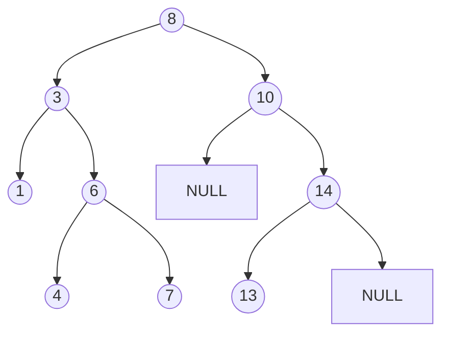
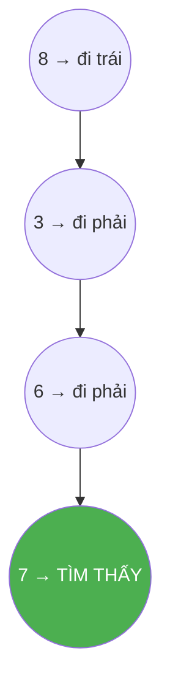
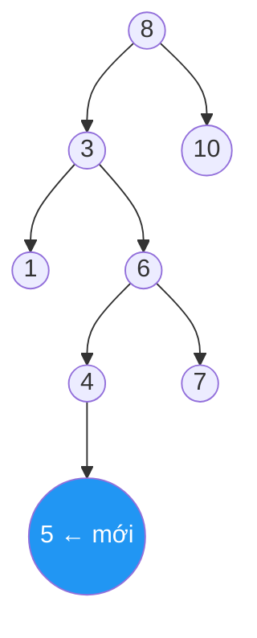
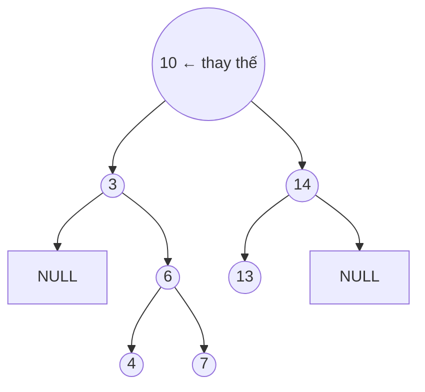
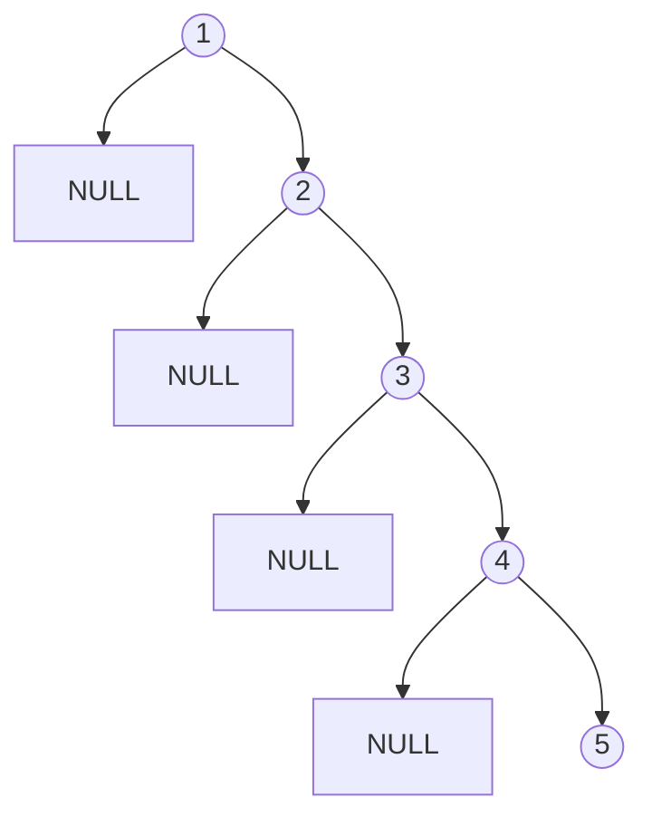

# Bài 30: Binary Search Tree (BST) - Cây Tìm Kiếm Nhị Phân

> **Tác giả:** Hà Trí Kiên<br>
> **Nội dung tham khảo từ:** CP-Algorithms, GeeksforGeeks - BST

---

## Bản chất vấn đề

Cho một tập hợp số, cần hỗ trợ các thao tác: thêm, tìm kiếm, xóa, tìm min/max, tìm cận dưới (lower_bound).

**Cách 1: Mảng** — thêm `$O(1)$`, tìm `$O(N)$`. Chậm khi tập lớn.

**Cách 2: `set` / `map` (Red-Black Tree)** — tất cả `$O(\log N)$`. Tốt, nhưng là "hộp đen", không hiểu cấu trúc bên trong.

**Cách 3: BST** — tất cả `$O(\log N)$` trung bình, và bạn hiểu rõ tại sao.

Binary Search Tree là cây nhị phân mà tại mỗi nút, mọi giá trị ở cây con trái đều nhỏ hơn nút đó, mọi giá trị ở cây con phải đều lớn hơn. Tính chất này cho phép tìm kiếm theo kiểu "chia đôi" y hệt tìm kiếm nhị phân trên mảng.



Với cây trên, tìm số 7 chỉ mất 4 bước: tại 8 (7 nhỏ hơn, đi trái) → tại 3 (7 lớn hơn, đi phải) → tại 6 (7 lớn hơn, đi phải) → tại 7 (tìm thấy). So với duyệt mảng mất 8 bước, BST khai thác triệt để tính chất thứ tự để loại bỏ một nửa ứng viên mỗi bước.

---

## Tư duy cốt lõi

### Thao tác 1: Tìm kiếm (Search)

Tại mỗi nút, so sánh giá trị cần tìm `$v$` với `$node \to val$`:

- `$v < node \to val$` → đi trái
- `$v > node \to val$` → đi phải
- `$v = node \to val$` → tìm thấy

Nếu đi đến `NULL` thì giá trị không tồn tại trong cây.



### Thao tác 2: Chèn (Insert)

Đi từ gốc, so sánh `$v$` với từng nút để tìm vị trí lá thích hợp. Khi đến `NULL`, tạo nút mới tại đó.



Quy trình: tại 8 (5 nhỏ hơn, trái) → tại 3 (5 lớn hơn, phải) → tại 6 (5 nhỏ hơn, trái) → tại 4 (5 lớn hơn, phải) → tạo nút 5.

### Thao tác 3: Xóa (Delete)

Xóa phức tạp hơn vì phải đảm bảo tính chất BST sau khi xóa. Có 3 trường hợp:

**Trường hợp 1: Nút lá (0 con)** — xóa trực tiếp, trả về `NULL`.

**Trường hợp 2: Có 1 con** — thay nút bằng con duy nhất.

**Trường hợp 3: Có 2 con** — tìm nút kế nhiệm (min bên phải) hoặc tiền nhiệm (max bên trái), sao chép giá trị vào nút cần xóa, rồi xóa nút kế nhiệm/tiền nhiệm ở vị trí cũ.

Minh họa xóa nút gốc 8 (có 2 con): tìm min bên phải là 10, thay 8 bằng 10, rồi xóa 10 ở cây con phải.



### Thao tác 4: Tìm Min / Max

- **Min:** đi liên tục sang trái từ gốc
- **Max:** đi liên tục sang phải từ gốc

Với cây ở trên: min là 1 (8→3→1), max là 14 (8→10→14).

### Duyệt Inorder

Duyệt theo thứ tự Trái → Gốc → Phải trên BST luôn cho ra dãy tăng dần. Đây là tính chất quan trọng nhất của BST, xuất phát trực tiếp từ tính chất "trái < gốc < phải".

---

## Phân tích tính đúng đắn

### Tại sao BST cho phép tìm kiếm nhị phân?

Mọi nút `$u$` trong BST đều thoả mãn: tất cả giá trị trong cây con trái của `$u$` nhỏ hơn `$u \to val$`, tất cả giá trị trong cây con phải lớn hơn `$u \to val$$. Khi so sánh `$v$` với `$u \to val$`:

- Nếu `$v < u \to val$`, ta loại bỏ toàn bộ cây con phải (tất cả đều lớn hơn `$u \to val$`, do đó lớn hơn `$v$`).
- Nếu `$v > u \to val$`, ta loại bỏ toàn bộ cây con trái.

Mỗi bước loại bỏ ít nhất một nửa số nút còn lại, nên số bước tối đa là chiều cao `$h$` của cây.

### Tại sao xóa đúng khi dùng kế nhiệm?

Nút kế nhiệm (min bên phải) là nút nhỏ nhất trong cây con phải, thoả mãn:

- Lớn hơn mọi nút ở cây con trái (đảm bảo tính chất BST khi thay thế)
- Là nút lá hoặc chỉ có con phải (dễ xóa, thuộc trường hợp 1 hoặc 2)

Sao chép giá trị kế nhiệm vào nút cần xóa không vi phạm tính chất BST. Sau đó xoá nút kế nhiệm ở vị trí cũ — thao tác này quy về trường hợp 0 hoặc 1 con, luôn đúng đệ quy.

### Tại sao inorder cho dãy tăng dần?

Chứng minh bằng quy nạp: giả sử cây con trái cho dãy tăng dần `$L$`, cây con phải cho dãy tăng dần `$R$`. Theo tính chất BST, mọi phần tử trong `$L$` nhỏ hơn gốc, mọi phần tử trong `$R$` lớn hơn gốc. Duyệt Trái → Gốc → Phải tạo dãy `$L$`, gốc, `$R$` — đúng thứ tự tăng dần.

---

## Đánh giá độ phức tạp

### Độ phức tạp thời gian

Gọi `$h$` là chiều cao cây, `$N$` là số nút.

| Thao tác | Trung bình | Worst case |
|----------|-----------|------------|
| Tìm kiếm | `$O(h) = O(\log N)$` | `$O(N)$` |
| Chèn | `$O(h) = O(\log N)$` | `$O(N)$` |
| Xóa | `$O(h) = O(\log N)$` | `$O(N)$` |
| Min/Max | `$O(h) = O(\log N)$` | `$O(N)$` |
| Duyệt inorder | `$O(N)$` | `$O(N)$` |

Worst case xảy ra khi BST bị méo (chèn dãy tăng/giảm dần), cây trở thành linked list, `$h = N$`.



Chèn 1, 2, 3, 4, 5 vào BST rỗng tạo cây nghiêng hoàn toàn — chiều cao `$N = 5$`, mọi thao tác đều `$O(N)$`.

### Độ phức tạp bộ nhớ

- Cấu trúc: `$O(N)$` cho `$N$` nút
- Đệ quy: `$O(h)$` stack frame (worst case `$O(N)$`)

### BST tự cân bằng

Các biến thể giữ `$h = O(\log N)$` luôn đúng:

| Cây | Chiều cao đảm bảo | Cơ chế |
|-----|-------------------|--------|
| AVL Tree | `$h \leq 1.44 \log_2 N$` | Chênh lệch chiều cao 2 con `$\leq 1$` |
| Red-Black Tree | `$h \leq 2 \log_2(N+1)$` | Tô màu đỏ-đen, đảm bảo cân bằng |
| B-Tree | `$O(\log N)$` | Mỗi nút nhiều khoá, dùng trong database |

---

## Code hoàn chỉnh

=== "C++"

    ```cpp
    #include <bits/stdc++.h>
    using namespace std;

    struct Node {
        int val;
        Node *left, *right;
        Node(int v) : val(v), left(nullptr), right(nullptr) {}
    };

    struct BST {
        Node* root = nullptr;

        Node* insert(Node* node, int val) {
            if (node == nullptr) return new Node(val);
            if (val < node->val)
                node->left = insert(node->left, val);
            else if (val > node->val)
                node->right = insert(node->right, val);
            return node;
        }

        void insert(int val) { root = insert(root, val); }

        bool search(Node* node, int val) {
            if (node == nullptr) return false;
            if (val == node->val) return true;
            if (val < node->val) return search(node->left, val);
            return search(node->right, val);
        }

        bool search(int val) { return search(root, val); }

        Node* findMin(Node* node) {
            while (node->left != nullptr)
                node = node->left;
            return node;
        }

        Node* erase(Node* node, int val) {
            if (node == nullptr) return nullptr;
            if (val < node->val)
                node->left = erase(node->left, val);
            else if (val > node->val)
                node->right = erase(node->right, val);
            else {
                if (node->left == nullptr) {
                    Node* temp = node->right;
                    delete node;
                    return temp;
                }
                if (node->right == nullptr) {
                    Node* temp = node->left;
                    delete node;
                    return temp;
                }
                Node* successor = findMin(node->right);
                node->val = successor->val;
                node->right = erase(node->right, successor->val);
            }
            return node;
        }

        void erase(int val) { root = erase(root, val); }

        void inorder(Node* node) {
            if (node == nullptr) return;
            inorder(node->left);
            cout << node->val << " ";
            inorder(node->right);
        }

        void print() { inorder(root); cout << endl; }
    };

    int main() {
        BST tree;
        tree.insert(8);
        tree.insert(3);
        tree.insert(10);
        tree.insert(1);
        tree.insert(6);
        tree.insert(14);
        tree.insert(4);
        tree.insert(7);
        tree.insert(13);

        tree.print();             // 1 3 4 6 7 8 10 13 14
        cout << tree.search(6);   // 1
        cout << tree.search(5);   // 0

        tree.erase(8);
        tree.print();             // 1 3 4 6 7 10 13 14
    }
    ```

=== "Python"

    ```python
    class Node:
        def __init__(self, val):
            self.val = val
            self.left = None
            self.right = None

    class BST:
        def __init__(self):
            self.root = None

        def insert(self, val):
            self.root = self._insert(self.root, val)

        def _insert(self, node, val):
            if node is None:
                return Node(val)
            if val < node.val:
                node.left = self._insert(node.left, val)
            elif val > node.val:
                node.right = self._insert(node.right, val)
            return node

        def search(self, val):
            return self._search(self.root, val)

        def _search(self, node, val):
            if node is None:
                return False
            if val == node.val:
                return True
            if val < node.val:
                return self._search(node.left, val)
            return self._search(node.right, val)

        def find_min(self, node):
            while node.left:
                node = node.left
            return node

        def erase(self, val):
            self.root = self._erase(self.root, val)

        def _erase(self, node, val):
            if node is None:
                return None
            if val < node.val:
                node.left = self._erase(node.left, val)
            elif val > node.val:
                node.right = self._erase(node.right, val)
            else:
                if node.left is None:
                    return node.right
                if node.right is None:
                    return node.left
                successor = self.find_min(node.right)
                node.val = successor.val
                node.right = self._erase(node.right, successor.val)
            return node

        def inorder(self, node=None, result=None):
            if result is None:
                result = []
            if node is None:
                return result
            self.inorder(node.left, result)
            result.append(node.val)
            self.inorder(node.right, result)
            return result

    tree = BST()
    for v in [8, 3, 10, 1, 6, 14, 4, 7, 13]:
        tree.insert(v)

    print(tree.inorder())    # [1, 3, 4, 6, 7, 8, 10, 13, 14]
    print(tree.search(6))    # True
    print(tree.search(5))    # False

    tree.erase(8)
    print(tree.inorder())    # [1, 3, 4, 6, 7, 10, 13, 14]
    ```

---

## Ứng dụng

### Duyệt khoảng (Range Query)

Tìm tất cả phần tử trong khoảng `$[L, R]$` trên BST, khai thác tính chất thứ tự để bỏ qua nhánh không cần thiết.

```cpp
void rangeQuery(Node* node, int L, int R) {
    if (node == nullptr) return;
    if (L < node->val) rangeQuery(node->left, L, R);
    if (L <= node->val && node->val <= R)
        cout << node->val << " ";
    if (R > node->val) rangeQuery(node->right, L, R);
}
```

Độ phức tạp: `$O(k + h)$` với `$k$` là số phần tử trong khoảng, `$h$` là chiều cao cây.

### Kiểm tra cây có phải BST

Dùng kỹ thuật truyền khoảng hợp lệ `$[minVal, maxVal]$` khi duyệt đệ quy.

```cpp
bool isBST(Node* node, long long minVal, long long maxVal) {
    if (node == nullptr) return true;
    if (node->val <= minVal || node->val >= maxVal) return false;
    return isBST(node->left, minVal, node->val) &&
           isBST(node->right, node->val, maxVal);
}

// Gọi: isBST(root, LLONG_MIN, LLONG_MAX)
```

---

## BST so với Heap

| Tiêu chí | BST | Heap |
|----------|-----|------|
| Tính chất | trái < gốc < phải | gốc `$\geq$` con (max-heap) |
| Tìm kiếm | `$O(\log N)$` | `$O(N)$` |
| Duyệt inorder | Tăng dần | Không có ý nghĩa |
| Ứng dụng | `set`, `map` | Priority Queue |

---

## Lưu ý và cạm bẫy

1. **BST bị méo:** Chèn dãy tăng/giảm dần → cây nghiêng, thoái hoá thành linked list `$O(N)$`. Trong thi đấu, dùng `set` / `map` (C++) đã cài Red-Black Tree sẵn thay vì tự cài BST thường.

2. **Không lưu trùng:** BST cơ bản bỏ qua phần tử trùng. Nếu cần đếm số lần xuất hiện, thêm trường `cnt` vào nút.

3. **Đệ quy sâu:** BST không cân bằng có thể sâu `$O(N)$`, gây tràn stack đệ quy. Chuyển sang cài đặt iterative nếu cần.

---

## Bài tập luyện tập

| Bài | Nền tảng | Độ khó | Chủ đề |
|-----|----------|--------|--------|
| [LeetCode - Validate BST](https://leetcode.com/problems/validate-binary-search-tree/) | LC | ⭐⭐ | Kiểm tra BST |
| [LeetCode - Lowest Common Ancestor of BST](https://leetcode.com/problems/lowest-common-ancestor-of-a-binary-search-tree/) | LC | ⭐⭐ | LCA trên BST |
| [LeetCode - Kth Smallest Element in BST](https://leetcode.com/problems/kth-smallest-element-in-a-bst/) | LC | ⭐⭐ | Duyệt inorder |
| [LeetCode - Insert into BST](https://leetcode.com/problems/insert-into-a-binary-search-tree/) | LC | ⭐ | Chèn BST |
| [LeetCode - Delete Node in BST](https://leetcode.com/problems/delete-node-in-a-bst/) | LC | ⭐⭐⭐ | Xóa BST |
| [CSES - Tree Traversals](https://cses.fi/problemset/task/1702) | CSES | ⭐⭐ | BST traversal |
| [CSES - Distinct Colors](https://cses.fi/problemset/task/1139) | CSES | ⭐⭐⭐ | Subtree query |

---

## Tài liệu tham khảo

- [CP-Algorithms - BST](https://cp-algorithms.com/data_structures/bst.html)
- [GeeksforGeeks - BST](https://www.geeksforgeeks.org/dsa/binary-search-tree-data-structure/)
- [VNOI Wiki - Cấu trúc dữ liệu tổng quan](https://wiki.vnoi.info/algo/data-structures/overview-data-structures)
- [YouTube - BST (takeuforward)](https://www.youtube.com/watch?v=pYT9F8_LFTM)

**Bài trước:** [Sparse Table ←](sparse-table.md) | **Bài tiếp theo:** [Bao lồi →](bao-loi.md)
