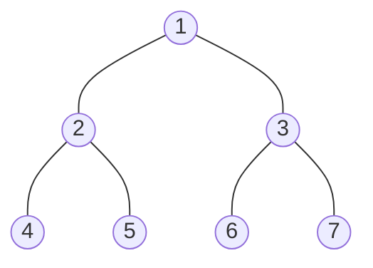
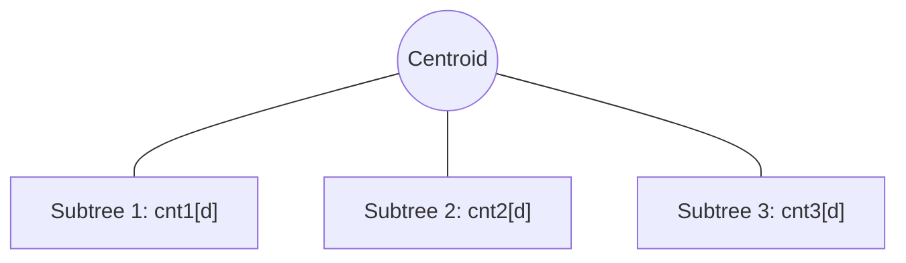

# Bài 45: Centroid Decomposition - Phân tách trọng tâm!

> **Tác giả:** FPTOJ Team<br>
> **Nội dung tham khảo từ:** VNOI Wiki, CP-Algorithms

---

## Bạn sẽ học được gì?
- Centroid là gì và cách tìm
- Centroid Decomposition algorithm
- Xây dựng centroid tree và các tính chất
- Ứng dụng: đếm đường đi trên cây
- Ứng dụng: QTREE5

---

## 1. Centroid là gì?

**Định nghĩa:** Cho cây có $N$ đỉnh. **Centroid** (trọng tâm) là đỉnh mà khi loại bỏ nó, mỗi thành phần liên thông còn lại có kích thước $\leq \lfloor N/2 \rfloor$.

**Tồn tại và duy nhất:** Mọi cây có $\geq 1$ đỉnh đều có **đúng một hoặc hai** centroid. Nếu có hai centroid thì chúng kề nhau.

### Minh họa



Cây 7 đỉnh. Đỉnh **1** là centroid vì khi loại bỏ nó:
- Thành phần bên trái (gốc 2): 3 đỉnh $\leq \lfloor 7/2 \rfloor = 3$ ✓
- Thành phần bên phải (gốc 3): 3 đỉnh $\leq 3$ ✓

### Tìm centroid - Thuật toán $O(N)$

**Ý tưởng:** Bắt đầu từ đỉnh bất kỳ, đi xuống "phía nặng nhất". Nếu đỉnh hiện tại có con với subsize $> N/2$, đi vào con đó. Khi dừng lại → đó là centroid.

=== "C++"

    ```cpp
    #include <bits/stdc++.h>
    using namespace std;
    
    const int MAXN = 100005;
    vector<int> adj[MAXN];
    int subsize[MAXN];
    bool removed[MAXN];
    int n;
    
    void dfs_size(int u, int parent) {
        subsize[u] = 1;
        for (int v : adj[u]) {
            if (v != parent && !removed[v]) {
                dfs_size(v, u);
                subsize[u] += subsize[v];
            }
        }
    }
    
    int find_centroid(int u, int parent, int total) {
        for (int v : adj[u]) {
            if (v != parent && !removed[v] && subsize[v] > total / 2) {
                return find_centroid(v, u, total);
            }
        }
        return u;
    }
    
    int main() {
        ios_base::sync_with_stdio(false);
        cin.tie(NULL);
        cin >> n;
        for (int i = 0; i < n - 1; i++) {
            int u, v; cin >> u >> v;
            adj[u].push_back(v);
            adj[v].push_back(u);
        }
        dfs_size(1, 0);
        cout << find_centroid(1, 0, subsize[1]) << "\n";
        return 0;
    }
    ```

=== "Python"

    ```python
    import sys
    from collections import defaultdict
    sys.setrecursionlimit(200000)
    
    def solve():
        n = int(input())
        adj = defaultdict(list)
        for _ in range(n - 1):
            u, v = map(int, input().split())
            adj[u].append(v); adj[v].append(u)
    
        subsize = [0] * (n + 1)
        removed = [False] * (n + 1)
    
        def dfs_size(u, parent):
            subsize[u] = 1
            for v in adj[u]:
                if v != parent and not removed[v]:
                    dfs_size(v, u); subsize[u] += subsize[v]
    
        def find_centroid(u, parent, total):
            for v in adj[u]:
                if v != parent and not removed[v] and subsize[v] > total // 2:
                    return find_centroid(v, u, total)
            return u
    
        dfs_size(1, 0)
        print(find_centroid(1, 0, subsize[1]))
    
    solve()
    ```

---

## 2. Centroid Decomposition Algorithm

### Quy trình đệ quy

1. **Tìm centroid** $C$ của cây hiện tại.
2. **Loại bỏ** centroid $C$ (đánh dấu `removed`).
3. **Đệ quy** trên mỗi thành phần liên thông còn lại.
4. **Xây dựng centroid tree:** $C$ trở thành cha của các centroid con.

### Trace trên cây 7 đỉnh


| Bước | Cây hiện tại | Centroid | Thành phần còn lại |
|------|-------------|----------|---------------------|
| 1 | {1,2,3,4,5,6,7} | **1** | {2,4,5}, {3,6,7} |
| 2 | {2,4,5} | **2** | {4}, {5} |
| 3 | {3,6,7} | **3** | {6}, {7} |
| 4-7 | {4}, {5}, {6}, {7} | **4,5,6,7** | (rỗng) |

### Centroid Tree kết quả


### Code đầy đủ

=== "C++"

    ```cpp
    #include <bits/stdc++.h>
    using namespace std;
    
    const int MAXN = 100005;
    vector<int> adj[MAXN];
    int subsize[MAXN];
    bool removed[MAXN];
    int centroid_parent[MAXN];
    int n;
    
    void dfs_size(int u, int parent) {
        subsize[u] = 1;
        for (int v : adj[u])
            if (v != parent && !removed[v]) {
                dfs_size(v, u);
                subsize[u] += subsize[v];
            }
    }
    
    int find_centroid(int u, int parent, int total) {
        for (int v : adj[u])
            if (v != parent && !removed[v] && subsize[v] > total / 2)
                return find_centroid(v, u, total);
        return u;
    }
    
    void decompose(int u, int parent_centroid) {
        dfs_size(u, -1);
        int c = find_centroid(u, -1, subsize[u]);
        centroid_parent[c] = parent_centroid;
        removed[c] = true;
        for (int v : adj[c])
            if (!removed[v])
                decompose(v, c);
    }
    
    int main() {
        ios_base::sync_with_stdio(false);
        cin.tie(NULL);
        cin >> n;
        for (int i = 0; i < n - 1; i++) {
            int u, v; cin >> u >> v;
            adj[u].push_back(v); adj[v].push_back(u);
        }
        decompose(1, -1);
        for (int i = 1; i <= n; i++)
            cout << i << ": parent = " << centroid_parent[i] << "\n";
        return 0;
    }
    ```

=== "Python"

    ```python
    import sys
    from collections import defaultdict
    sys.setrecursionlimit(200000)
    
    def solve():
        n = int(input())
        adj = defaultdict(list)
        for _ in range(n - 1):
            u, v = map(int, input().split())
            adj[u].append(v); adj[v].append(u)
    
        subsize = [0] * (n + 1)
        removed = [False] * (n + 1)
        centroid_parent = [-1] * (n + 1)
    
        def dfs_size(u, parent):
            subsize[u] = 1
            for v in adj[u]:
                if v != parent and not removed[v]:
                    dfs_size(v, u); subsize[u] += subsize[v]
    
        def find_centroid(u, parent, total):
            for v in adj[u]:
                if v != parent and not removed[v] and subsize[v] > total // 2:
                    return find_centroid(v, u, total)
            return u
    
        def decompose(u, parent_centroid):
            dfs_size(u, -1)
            c = find_centroid(u, -1, subsize[u])
            centroid_parent[c] = parent_centroid
            removed[c] = True
            for v in adj[c]:
                if not removed[v]:
                    decompose(v, c)
    
        decompose(1, -1)
        for i in range(1, n + 1):
            print(f"{i}: parent = {centroid_parent[i]}")
    
    solve()
    ```

### Phân tích độ phức tạp

Mỗi đỉnh được thăm $O(\log N)$ lần (kích thước giảm ít nhất một nửa sau mỗi cạnh đi qua).

$$T(N) = T(N_1) + T(N_2) + \dots + O(N) = O(N \log N)$$

```matplotlib
N_values = np.array([10, 50, 100, 500, 1000, 5000, 10000, 50000, 100000])
centroid_depth = np.log2(N_values)
naive_depth = N_values

fig, (ax1, ax2) = plt.subplots(1, 2, figsize=(12, 5))

ax1.bar(range(len(N_values)), centroid_depth, color='#2ecc71', alpha=0.8)
ax1.set_xticks(range(len(N_values)))
ax1.set_xticklabels([str(n) for n in N_values], rotation=45)
ax1.set_xlabel('N (số đỉnh)')
ax1.set_ylabel('Chiều cao centroid tree')
ax1.set_title('Chiều cao Centroid Tree = $O(\\log N)$')
ax1.grid(True, alpha=0.3, axis='y')
for i, v in enumerate(centroid_depth):
    ax1.text(i, v + 0.2, f'{v:.1f}', ha='center', fontsize=8)

levels = np.arange(1, 8)
size_at_level = 100 / (2**levels)

ax2.bar(levels, size_at_level, color='#3498db', alpha=0.8)
ax2.set_xlabel('Level trong centroid tree')
ax2.set_ylabel('Kích thước subtree tối đa (%)')
ax2.set_title('Mỗi level: kích thước giảm một nửa\n(Bắt đầu từ N=100)')
ax2.set_xticks(levels)
ax2.grid(True, alpha=0.3, axis='y')
for i, v in enumerate(size_at_level):
    ax2.text(i, v + 1, f'{v:.1f}%', ha='center', fontsize=8)

plt.tight_layout()
```

---

## 3. Centroid Tree và các tính chất

| Tính chất | Mô tả |
|-----------|-------|
| Chiều cao | $O(\log N)$ |
| Số nút | Đúng $N$ nút |
| LCA | LCA trên centroid tree cho biết centroid chung gần nhất |

**Tính chất then chốt:** Đường đi giữa $u$ và $v$ trên cây gốc **luôn đi qua** $\text{LCA}(u, v)$ trên centroid tree.

Ví dụ: đường đi $4 \to 2 \to 1 \to 3 \to 6$ đi qua centroid $\text{LCA}(4,6) = 1$.

### Tính khoảng cách qua LCA

```cpp
// Preprocessing LCA trên cây gốc (xem bài LCA)
int dist(int u, int v) {
    int l = lca(u, v);
    return depth[u] + depth[v] - 2 * depth[l];
}
```

---

## 4. Ứng dụng: Đếm đường đi có độ dài K

### Bài toán

Cho cây $N$ đỉnh và số $K$. Đếm số cặp $(u,v)$ sao cho $\text{dist}(u,v) = K$.

### Ý tưởng

Tại mỗi centroid $C$:
- Đếm đường đi **qua $C$** giữa các subtree khác nhau.
- Đệ quy đếm đường đi **trong cùng subtree**.

Kỹ thuật: duyệt từng subtree, dùng mảng đếm `cnt[d]` = số đỉnh cách $C$ đúng $d$ cạnh.



Đường đi qua $C$ giữa subtree $i$ và $j$: $\sum cnt_i[d] \times cnt_j[K-d]$.

=== "C++"

    ```cpp
    #include <bits/stdc++.h>
    using namespace std;
    
    const int MAXN = 100005;
    vector<int> adj[MAXN];
    int subsize[MAXN];
    bool removed[MAXN];
    int n, k;
    long long ans = 0;
    
    void dfs_size(int u, int p) {
        subsize[u] = 1;
        for (int v : adj[u])
            if (v != p && !removed[v]) { dfs_size(v, u); subsize[u] += subsize[v]; }
    }
    
    int find_centroid(int u, int p, int total) {
        for (int v : adj[u])
            if (v != p && !removed[v] && subsize[v] > total / 2)
                return find_centroid(v, u, total);
        return u;
    }
    
    void get_dists(int u, int p, int d, vector<int>& out) {
        out.push_back(d);
        for (int v : adj[u])
            if (v != p && !removed[v]) get_dists(v, u, d + 1, out);
    }
    
    void count_paths(int u) {
        vector<int> total(n + 1, 0);
        total[0] = 1;
        for (int v : adj[u]) {
            if (removed[v]) continue;
            vector<int> dists;
            get_dists(v, u, 1, dists);
            for (int d : dists)
                if (k - d >= 0) ans += total[k - d];
            for (int d : dists) total[d]++;
        }
    }
    
    void decompose(int u) {
        dfs_size(u, -1);
        int c = find_centroid(u, -1, subsize[u]);
        count_paths(c);
        removed[c] = true;
        for (int v : adj[c])
            if (!removed[v]) decompose(v);
    }
    
    int main() {
        ios_base::sync_with_stdio(false); cin.tie(NULL);
        cin >> n >> k;
        for (int i = 0; i < n - 1; i++) {
            int u, v; cin >> u >> v;
            adj[u].push_back(v); adj[v].push_back(u);
        }
        decompose(1);
        cout << ans << "\n";
        return 0;
    }
    ```

=== "Python"

    ```python
    import sys
    from collections import defaultdict
    sys.setrecursionlimit(200000)
    
    def solve():
        n, k = map(int, input().split())
        adj = defaultdict(list)
        for _ in range(n - 1):
            u, v = map(int, input().split())
            adj[u].append(v); adj[v].append(u)
    
        subsize = [0] * (n + 1)
        removed = [False] * (n + 1)
        ans = 0
    
        def dfs_size(u, p):
            subsize[u] = 1
            for v in adj[u]:
                if v != p and not removed[v]:
                    dfs_size(v, u); subsize[u] += subsize[v]
    
        def find_centroid(u, p, total):
            for v in adj[u]:
                if v != p and not removed[v] and subsize[v] > total // 2:
                    return find_centroid(v, u, total)
            return u
    
        def get_dists(u, p, d, out):
            out.append(d)
            for v in adj[u]:
                if v != p and not removed[v]: get_dists(v, u, d + 1, out)
    
        def count_paths(u):
            nonlocal ans
            total = [0] * (n + 1)
            total[0] = 1
            for v in adj[u]:
                if removed[v]: continue
                dists = []
                get_dists(v, u, 1, dists)
                for d in dists:
                    if 0 <= k - d <= n: ans += total[k - d]
                for d in dists: total[d] += 1
    
        def decompose(u):
            dfs_size(u, -1)
            c = find_centroid(u, -1, subsize[u])
            count_paths(c)
            removed[c] = True
            for v in adj[c]:
                if not removed[v]: decompose(v)
    
        decompose(1)
        print(ans)
    
    solve()
    ```

**Giải thích:** Tại mỗi centroid, `total[d]` đếm số đỉnh cách centroid $d$ cạnh từ các subtree đã duyệt. Khi xét subtree mới, ta chỉ đếm đường đi giữa subtree mới và các subtree cũ → tránh đếm trùng.

---

## 5. Ứng dụng: QTREE5

### Bài toán

Cho cây $N$ đỉnh, ban đầu không đỉnh nào được tô màu. $Q$ truy vấn:

- **Type 1:** Đổi màu đỉnh $u$ (tô ↔ xóa).
- **Type 2:** Tìm khoảng cách ngắn nhất từ $u$ đến đỉnh đã tô màu, hoặc $-1$ nếu không có.

### Ý tưởng

Với mỗi centroid, lưu **multiset** khoảng cách đến các đỉnh đã tô màu trong subtree của nó.

**Query:** Duyệt từ $u$ lên centroid tree, tại mỗi ancestor $c$ tính $\text{dist}(u,c) + \min(\text{multiset}[c])$.

=== "C++"

    ```cpp
    #include <bits/stdc++.h>
    using namespace std;
    
    const int MAXN = 100005, LOG = 17;
    vector<int> adj[MAXN];
    int subsize[MAXN], depth[MAXN], up[MAXN][LOG], centroid_parent[MAXN];
    bool removed[MAXN], colored[MAXN];
    multiset<int> color_dist[MAXN];
    int n;
    
    void dfs_lca(int u, int p) {
        up[u][0] = p;
        for (int i = 1; i < LOG; i++)
            up[u][i] = up[u][i-1] == -1 ? -1 : up[up[u][i-1]][i-1];
        for (int v : adj[u])
            if (v != p) { depth[v] = depth[u] + 1; dfs_lca(v, u); }
    }
    
    int lca(int u, int v) {
        if (depth[u] < depth[v]) swap(u, v);
        for (int i = LOG-1; i >= 0; i--)
            if (up[u][i] != -1 && depth[up[u][i]] >= depth[v]) u = up[u][i];
        if (u == v) return u;
        for (int i = LOG-1; i >= 0; i--)
            if (up[u][i] != up[v][i]) { u = up[u][i]; v = up[v][i]; }
        return up[u][0];
    }
    
    int dist(int u, int v) { return depth[u] + depth[v] - 2*depth[lca(u,v)]; }
    
    void dfs_size(int u, int p) {
        subsize[u] = 1;
        for (int v : adj[u]) if (v != p && !removed[v]) { dfs_size(v,u); subsize[u]+=subsize[v]; }
    }
    
    int find_centroid(int u, int p, int tot) {
        for (int v : adj[u]) if (v!=p && !removed[v] && subsize[v]>tot/2) return find_centroid(v,u,tot);
        return u;
    }
    
    void decompose(int u, int pc) {
        dfs_size(u,-1);
        int c = find_centroid(u,-1,subsize[u]);
        centroid_parent[c] = pc;
        removed[c] = true;
        for (int v : adj[c]) if (!removed[v]) decompose(v, c);
    }
    
    void toggle(int u) {
        int cur = u;
        while (cur != -1) {
            int d = dist(u, cur);
            if (colored[u]) color_dist[cur].erase(color_dist[cur].find(d));
            else color_dist[cur].insert(d);
            cur = centroid_parent[cur];
        }
        colored[u] = !colored[u];
    }
    
    int query(int u) {
        int ans = INT_MAX, cur = u;
        while (cur != -1) {
            if (!color_dist[cur].empty())
                ans = min(ans, dist(u,cur) + *color_dist[cur].begin());
            cur = centroid_parent[cur];
        }
        return ans == INT_MAX ? -1 : ans;
    }
    
    int main() {
        ios_base::sync_with_stdio(false); cin.tie(NULL);
        cin >> n;
        for (int i = 0; i < n-1; i++) { int u,v; cin>>u>>v; adj[u].push_back(v); adj[v].push_back(u); }
        depth[1] = 0; memset(up,-1,sizeof(up)); dfs_lca(1,-1);
        decompose(1,-1);
        int q; cin >> q;
        while (q--) { int t,u; cin>>t>>u; if(t==1) toggle(u); else cout<<query(u)<<"\n"; }
        return 0;
    }
    ```

=== "Python"

    ```python
    import sys, bisect
    from collections import defaultdict
    sys.setrecursionlimit(200000)
    
    def solve():
        n = int(input())
        adj = defaultdict(list)
        for _ in range(n-1):
            u,v = map(int,input().split())
            adj[u].append(v); adj[v].append(u)
    
        LOG = 17
        depth = [0]*(n+1)
        up = [[-1]*LOG for _ in range(n+1)]
    
        def dfs_lca(u,p):
            up[u][0] = p
            for i in range(1,LOG): up[u][i] = -1 if up[u][i-1]==-1 else up[up[u][i-1]][i-1]
            for v in adj[u]:
                if v!=p: depth[v]=depth[u]+1; dfs_lca(v,u)
    
        def lca(u,v):
            if depth[u]<depth[v]: u,v=v,u
            for i in range(LOG-1,-1,-1):
                if up[u][i]!=-1 and depth[up[u][i]]>=depth[v]: u=up[u][i]
            if u==v: return u
            for i in range(LOG-1,-1,-1):
                if up[u][i]!=up[v][i]: u,v=up[u][i],up[v][i]
            return up[u][0]
    
        def get_dist(u,v): return depth[u]+depth[v]-2*depth[lca(u,v)]
    
        dfs_lca(1,-1)
    
        subsize=[0]*(n+1); removed=[False]*(n+1); centroid_parent=[-1]*(n+1)
        colored=[False]*(n+1); color_dist=defaultdict(list)
    
        def dfs_size(u,p):
            subsize[u]=1
            for v in adj[u]:
                if v!=p and not removed[v]: dfs_size(v,u); subsize[u]+=subsize[v]
    
        def find_centroid(u,p,tot):
            for v in adj[u]:
                if v!=p and not removed[v] and subsize[v]>tot//2: return find_centroid(v,u,tot)
            return u
    
        def decompose(u,pc):
            dfs_size(u,-1); c=find_centroid(u,-1,subsize[u])
            centroid_parent[c]=pc; removed[c]=True
            for v in adj[c]:
                if not removed[v]: decompose(v,c)
    
        decompose(1,-1)
    
        def toggle(u):
            cur=u
            while cur!=-1:
                d=get_dist(u,cur)
                if colored[u]:
                    idx=bisect.bisect_left(color_dist[cur],d)
                    if idx<len(color_dist[cur]) and color_dist[cur][idx]==d: color_dist[cur].pop(idx)
                else: bisect.insort(color_dist[cur],d)
                cur=centroid_parent[cur]
            colored[u]=not colored[u]
    
        def query(u):
            ans=float('inf'); cur=u
            while cur!=-1:
                if color_dist[cur]: ans=min(ans,get_dist(u,cur)+color_dist[cur][0])
                cur=centroid_parent[cur]
            return -1 if ans==float('inf') else ans
    
        q=int(input())
        for _ in range(q):
            t,*rest=map(int,input().split())
            if t==1: toggle(rest[0])
            else: print(query(rest[0]))
    
    solve()
    ```

**Độ phức tạp:** Mỗi truy vấn $O(\log^2 N)$ — duyệt $O(\log N)$ centroid ancestor, mỗi lần tính khoảng cách $O(\log N)$.

---

## 6. Lưu ý và Cạm bẫy

| Lỗi | Hậu quả | Cách sửa |
|-----|---------|----------|
| Quên `removed[centroid] = true` | Lặp vô hạn, TLE | Đánh dấu ngay sau khi tìm centroid |
| Tính `subsize` trên cây đã loại bỏ | Sai kết quả | Kiểm tra `!removed[v]` trong DFS |
| Đệ quy quá sâu ($N = 2 \times 10^5$) | Stack overflow | Tăng `sys.setrecursionlimit` (Python) hoặc dùng iterative |
| Không reset mảng đếm giữa các centroid | Sai kết quả | Dùng map hoặc reset sau mỗi centroid |

### Mẹo

- **Luôn vẽ centroid tree** khi debug.
- **Test cây thẳng:** centroid tree sẽ balanced.
- **Test cây sao:** centroid là trung tâm.
- **Edge case:** $N = 1$, $N = 2$.

---

## 7. Bài tập

| STT | Bài toán | Nguồn | Độ khó | Gợi ý |
|-----|----------|-------|--------|-------|
| 1 | [Fixed-Length Paths I](https://cses.fi/problemset/task/2080) | CSES | ★★★☆☆ | Đếm đường đi độ dài K, kỹ thuật đếm ở mỗi centroid |
| 2 | [Fixed-Length Paths II](https://cses.fi/problemset/task/2081) | CSES | ★★★★☆ | Đường đi $\leq K$, dùng Fenwick tree |
| 3 | [Ciel and Commander](https://codeforces.com/problemset/problem/321/C) | CF | ★★★☆☆ | Centroid Decomposition cơ bản |
| 4 | [Xenia and Tree](https://codeforces.com/problemset/problem/342/E) | CF | ★★★★☆ | Tương tự QTREE5 |
| 5 | [IOI 2011: Race](https://oj.uz/problem/view/IOI11_race) | IOI | ★★★★★ | Đường đi tổng trọng số = K |

---

## 8. Bài viết liên quan

- [Bài 46: Heavy-Light Decomposition](hld.md) — Phân tách heavy path
- [Bài 44: Euler Tour trên cây](euler-tour-tree.md) — Duyệt Euler
- [Bài 43: 2-SAT](2sat.md) — Bài toán 2-SAT

---

## Tài liệu tham khảo

- [CP-Algorithms: Centroid Decomposition](https://cp-algorithms.com/graph/centroid.html)
- [VNOI Wiki: Centroid Decomposition](https://vnoi.info/wiki/algo/graph-theory/centroid-decomposition.md)
- [USACO Guide: Centroid Decomposition](https://usaco.guide/plat/centroid?lang=cpp)
- [CF Blog: Centroid Decomposition tutorial](https://codeforces.com/blog/entry/58746)
- [Errichto: Centroid Decomposition (YouTube)](https://www.youtube.com/watch?v=nLh2JfB6w1k)

---

> **Bài tiếp theo:** [Bài 46: Heavy-Light Decomposition](hld.md)
