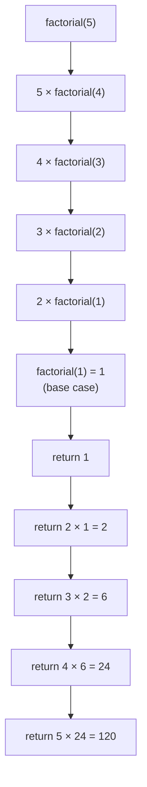
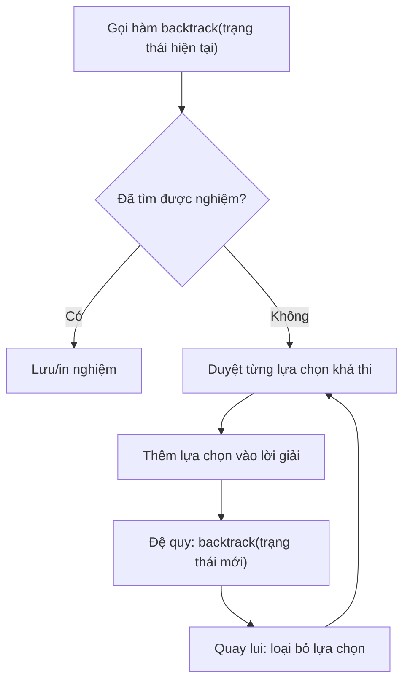
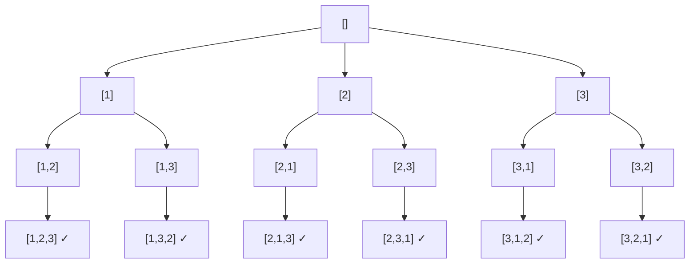

# Bài 6: Đệ Quy Và Quay Lui

> **Tác giả:** FPTOJ Team<br>
> **Nội dung tham khảo từ:** VNOI Wiki - Đệ quy và thuật toán quay lui

---

## Bản chất vấn đề

### Đệ quy là gì?

**Đệ quy** (Recursion) là kỹ thuật một hàm tự gọi chính nó để giải quyết bài toán. Bài toán lớn được chia thành các bài toán con nhỏ hơn có cùng cấu trúc, cho đến khi gặp **trường hợp cơ sở** (base case) — điểm dừng đệ quy.

Ví dụ kinh điển: tính giai thừa $n!$

$$n! = n \times (n-1)! \quad \text{với} \quad 0! = 1$$

Để tính $5!$, ta cần $4!$, để tính $4!$ ta cần $3!$, và cứ tiếp tục cho đến $0! = 1$.

### Quay lui là gì?

**Quay lui** (Backtracking) là kỹ thuật **thử tất cả các khả năng** tại mỗi bước, đánh dấu lựa chọn, đệ quy sang bước tiếp, sau đó **khôi phục trạng thái** (quay lui) để thử lựa chọn khác.

Quay lui thường được sử dụng để:

- Liệt kê tất cả hoán vị, tổ hợp, tập con
- Giải bài toán tìm kiếm mê cung
- Giải các bài toán ràng buộc (constraint satisfaction) như N-Queens, Sudoku

### Khi nào sử dụng?

| Tình huống | Phương pháp |
|---|---|
| Bài toán có thể chia thành bài toán con cùng dạng | Đệ quy |
| Cần liệt kê tất cả nghiệm thỏa mãn | Quay lui |
| $N \leq 15$ và cần duyệt toàn bộ | Quay lui hoặc bitmask |
| Cần tìm nghiệm tốt nhất với nhánh cận | Quay lui + cắt tỉa |

---

## Tư duy cốt lõi

### Nguyên tắc của đệ quy

Mọi hàm đệ quy phải tuân thủ hai nguyên tắc:

1. **Phải có base case** — điều kiện dừng đệ quy, nếu không sẽ tràn stack
2. **Phần đệ quy phải gọi bài toán nhỏ hơn** — đảm bảo tiến dần về base case

Cây đệ quy cho $5!$ được minh họa như sau:



### Template quay lui

Mọi bài toán quay lui đều tuân theo một khuôn mẫu chung:



Ba bước cốt lõi lặp lại tại mỗi node trên cây tìm kiếm:

1. **Chọn** (Choose) — thử một lựa chọn khả thi
2. **Khám phá** (Explore) — đệ quy sang trạng thái tiếp
3. **Bỏ chọn** (Unchoose) — khôi phục trạng thái cũ (đây chính là "quay lui")

### Ví dụ minh họa: Sinh hoán vị $\{1, 2, 3\}$

Cây tìm kiếm khi sinh tất cả hoán vị của tập $\{1, 2, 3\}$:



Tổng cộng $3! = 6$ hoán vị. Mỗi lá trên cây là một nghiệm hoàn chỉnh.

### Bài toán N-Queens

Xếp $N$ quân hậu lên bàn cờ $N \times N$ sao cho không hai quân hậu nào ăn nhau (không cùng hàng, cột, đường chéo).

**Ý tưởng:** Xếp hậu theo từng hàng. Hàng $i$: thử từng cột $j$, kiểm tra tính hợp lệ bằng 3 mảng đánh dấu:

- `col[j]` — cột $j$ đã có hậu chưa
- `diag1[i + j]` — đường chéo chính (tổng $i+j$ cố định trên mỗi đường chéo)
- `diag2[i - j + N]` — đường chéo phụ (hiệu $i-j$ cố định, cộng $N$ để tránh chỉ số âm)

---

## Phân tích tính đúng đắn

### Tại sao đệ quy đúng?

Đệ quy đúng khi thỏa mãn hai điều kiện:

1. **Base case đúng:** Giá trị trả về ở trường hợp cơ sở là chính xác. Ví dụ: $0! = 1$ là đúng theo định nghĩa.

2. **Bước đệ quy đúng:** Giả sử hàm đúng cho input nhỏ hơn (giả thuyết đệ quy), thì công thức đệ quy cho ra kết quả đúng cho input hiện tại.

Với giai thừa: Giả sử `factorial(n-1)` trả về đúng $(n-1)!$, thì `factorial(n) = n × factorial(n-1) = n × (n-1)! = n!` đúng.

### Tại sao quay lui đúng?

Quay lui đúng vì nó **duyệt toàn bộ không gian tìm kiếm** mà không bỏ sót:

- Tại mỗi bước, **tất cả** lựa chọn khả thi đều được thử
- Sau mỗi lần thử, trạng thái được **khôi phục hoàn toàn** (bước quay lui)
- Do đó, lựa chọn tiếp theo không bị ảnh hưởng bởi lựa chọn trước

**Ví dụ:** Trong sinh hoán vị, nếu quên `used[num] = false` sau khi đệ quy, số `num` sẽ bị đánh dấu "đã dùng" vĩnh viễn, khiến các nhánh sau không thể chọn `num` lại — kết quả bị thiếu.

### Kiểm tra correctness bằng ví dụ

Với bài toán tổ hợp có lặp (subset sum), sử dụng `startIdx` đảm bảo mỗi tổ hợp chỉ được sinh một lần (không sinh trùng hoán vị khác thứ tự). Nếu dùng `i = 0` thay vì `i = startIdx`, ta sẽ sinh ra các tổ hợp trùng lặp.

---

## Đánh giá độ phức tạp

### Đệ quy đơn giản

| Bài toán | Độ phức tạp thời gian | Độ phức tạp không gian |
|---|---|---|
| Giai thừa $n!$ | $O(n)$ | $O(n)$ (stack) |
| Fibonacci không nhớ | $O(2^n)$ | $O(n)$ (stack) |
| Fibonacci có nhớ (memoization) | $O(n)$ | $O(n)$ |

Fibonacci không nhớ có độ phức tạp $O(2^n)$ vì mỗi hàm gọi đệ quy 2 lần, tạo thành cây nhị phân với số node tăng theo cấp số nhân.

### Quay lui

Giả sử tại mỗi bước có $k$ lựa chọn, độ sâu cây tìm kiếm là $d$:

- **Trường hợp tổng quát:** $O(k^d)$ — duyệt toàn bộ cây tìm kiếm
- **Với nhánh cận (pruning):** Có thể giảm đáng kể tùy bài toán

Độ phức tạp cụ thể cho các bài toán kinh điển:

| Bài toán | Thời gian | Không gian |
|---|---|---|
| Sinh hoán vị $n$ phần tử | $O(n!)$ | $O(n)$ |
| Sinh tổ hợp $C(n, k)$ | $O\left(\binom{n}{k}\right)$ | $O(k)$ |
| N-Queens | $O(n!)$ (với nhánh cận) | $O(n)$ |

### Tại sao N-Queens là $O(n!)$?

Ở hàng đầu tiên có $n$ lựa chọn, hàng thứ hai tối đa $n-1$ (bị loại bỏ cột và đường chéo), hàng thứ ba tối đa $n-2$, và cứ tiếp tục. Tổng: $n \times (n-1) \times \ldots \times 1 = n!$. Nhánh cận (cắt bỏ các vị trí không hợp lệ) giúp thực tế chạy nhanh hơn nhiều so với cận trên này.

### So sánh: Đệ quy vs. Quay lui vs. Quy hoạch động

| Tiêu chí | Đệ quy | Quay lui | Quy hoạch động |
|---|---|---|---|
| Mục đích | Chia bài toán con | Liệt kê/tìm nghiệm | Tối ưu hóa |
| Có nhớ (memo)? | Có thể | Không | Có |
| Không gian | $O(\text{độ sâu})$ | $O(\text{độ sâu})$ | $O(\text{số trạng thái})$ |
| Thời gian | Tùy bài toán | $O(k^d)$ | $O(\text{số trạng thái} \times \text{transition})$ |

---

## Code minh họa

### Bài toán 1: Tính giai thừa

Đệ quy cơ bản nhất. Công thức: $n! = n \times (n-1)!$ với $0! = 1$.

=== "C++"

    ```cpp
    #include <bits/stdc++.h>
    using namespace std;

    long long factorial(int n) {
        if (n == 0) return 1;
        return factorial(n - 1) * n;
    }

    int main() {
        cout << factorial(5) << "\n"; // 120
        return 0;
    }
    ```

=== "Python"

    ```python
    def factorial(n):
        if n == 0:
            return 1
        return factorial(n - 1) * n

    print(factorial(5))  # 120
    ```

### Bài toán 2: Số Fibonacci

Công thức: $F(n) = F(n-1) + F(n-2)$ với $F(0) = 0$, $F(1) = 1$.

Đệ quy trực tiếp có độ phức tạp $O(2^n)$ vì tính lại cùng một giá trị nhiều lần. Dùng memoization để giảm xuống $O(n)$.

=== "C++"

    ```cpp
    #include <bits/stdc++.h>
    using namespace std;

    // Đệ quy thuần: O(2^n) - chậm!
    long long fibo_slow(int n) {
        if (n <= 1) return n;
        return fibo_slow(n - 1) + fibo_slow(n - 2);
    }

    // Memoization: O(n)
    long long memo[100];
    long long fibo(int n) {
        if (n <= 1) return n;
        if (memo[n] != -1) return memo[n];
        memo[n] = fibo(n - 1) + fibo(n - 2);
        return memo[n];
    }

    int main() {
        memset(memo, -1, sizeof(memo));
        cout << fibo(10) << "\n"; // 55
        return 0;
    }
    ```

=== "Python"

    ```python
    from functools import lru_cache

    @lru_cache(maxsize=None)
    def fibo(n):
        if n <= 1:
            return n
        return fibo(n - 1) + fibo(n - 2)

    print(fibo(10))  # 55
    ```

### Bài toán 3: Sinh tất cả hoán vị

Template quay lui cơ bản. Dùng mảng `used` đánh dấu số đã chọn, sau mỗi lần đệ quy phải bỏ đánh dấu (quay lui).

=== "C++"

    ```cpp
    #include <bits/stdc++.h>
    using namespace std;

    int n;
    int perm[20];
    bool used[20];

    void generate(int pos) {
        if (pos > n) {
            for (int i = 1; i <= n; i++)
                cout << perm[i] << " ";
            cout << "\n";
            return;
        }
        for (int num = 1; num <= n; num++) {
            if (!used[num]) {
                perm[pos] = num;
                used[num] = true;
                generate(pos + 1);
                used[num] = false;
            }
        }
    }

    int main() {
        n = 3;
        generate(1);
        // Output: 123, 132, 213, 231, 312, 321
        return 0;
    }
    ```

=== "Python"

    ```python
    def generate_permutation(n):
        used = [False] * (n + 1)
        perm = []

        def backtrack():
            if len(perm) == n:
                print(*perm)
                return
            for num in range(1, n + 1):
                if not used[num]:
                    perm.append(num)
                    used[num] = True
                    backtrack()
                    perm.pop()
                    used[num] = False

        backtrack()

    generate_permutation(3)
    # Output: 1 2 3, 1 3 2, 2 1 3, 2 3 1, 3 1 2, 3 2 1
    ```

### Bài toán 4: N-Queens

Xếp $N$ hậu lên bàn cờ $N \times N$. Dùng 3 mảng boolean kiểm tra cột, đường chéo chính, đường chéo phụ.

=== "C++"

    ```cpp
    #include <bits/stdc++.h>
    using namespace std;

    int n;
    bool col[20], diag1[40], diag2[40];
    int queenPos[20];

    void solve(int row) {
        if (row > n) {
            for (int i = 1; i <= n; i++)
                cout << queenPos[i] << " ";
            cout << "\n";
            return;
        }
        for (int col_idx = 1; col_idx <= n; col_idx++) {
            int d1 = row + col_idx;
            int d2 = row - col_idx + 20;
            if (col[col_idx] || diag1[d1] || diag2[d2])
                continue;
            queenPos[row] = col_idx;
            col[col_idx] = diag1[d1] = diag2[d2] = true;
            solve(row + 1);
            col[col_idx] = diag1[d1] = diag2[d2] = false;
        }
    }

    int main() {
        n = 8;
        solve(1);
        return 0;
    }
    ```

=== "Python"

    ```python
    def solve_n_queens(n):
        col_used = [False] * n
        diag1 = [False] * (2 * n)
        diag2 = [False] * (2 * n)
        queens = []

        def backtrack(row):
            if row == n:
                print(queens)
                return
            for c in range(n):
                d1 = row + c
                d2 = row - c + n
                if col_used[c] or diag1[d1] or diag2[d2]:
                    continue
                queens.append(c)
                col_used[c] = diag1[d1] = diag2[d2] = True
                backtrack(row + 1)
                queens.pop()
                col_used[c] = diag1[d1] = diag2[d2] = False

        backtrack()

    solve_n_queens(4)
    ```

### Bài toán 5: Tổ hợp có lặp (Subset Sum)

Tìm tất cả cách chọn số từ mảng sao cho tổng bằng `target`. Dùng `startIdx` để tránh sinh trùng tổ hợp.

=== "C++"

    ```cpp
    #include <bits/stdc++.h>
    using namespace std;

    int coins[15], coinCount;
    long long target;
    vector<int> cur;

    void findWays(int startIdx, long long curSum) {
        if (curSum == target) {
            for (int x : cur) cout << x << " ";
            cout << "\n";
            return;
        }
        for (int i = startIdx; i < coinCount; i++) {
            if (curSum + coins[i] <= target) {
                cur.push_back(coins[i]);
                findWays(i, curSum + coins[i]);
                cur.pop_back();
            }
        }
    }

    int main() {
        coinCount = 4;
        coins[0] = 2; coins[1] = 3; coins[2] = 5; coins[3] = 7;
        target = 10;
        findWays(0, 0);
        return 0;
    }
    ```

=== "Python"

    ```python
    def find_ways(coins, target):
        cur = []

        def backtrack(start, cur_sum):
            if cur_sum == target:
                print(cur)
                return
            for i in range(start, len(coins)):
                if cur_sum + coins[i] <= target:
                    cur.append(coins[i])
                    backtrack(i, cur_sum + coins[i])
                    cur.pop()

        backtrack(0, 0)

    find_ways([2, 3, 5, 7], 10)
    ```

---

## Cạm bẫy thường gặp

### Bẫy 1: Quên base case

Không có base case dẫn đến đệ quy vô hạn và tràn stack.

=== "C++"

    ```cpp
    // SAI: không có base case
    int factorial(int n) {
        return factorial(n - 1) * n;
    }

    // ĐÚNG: phải có base case
    int factorial(int n) {
        if (n == 0) return 1;
        return factorial(n - 1) * n;
    }
    ```

=== "Python"

    ```python
    # SAI: không có base case
    def factorial(n):
        return factorial(n - 1) * n

    # ĐÚNG: phải có base case
    def factorial(n):
        if n == 0:
            return 1
        return factorial(n - 1) * n
    ```

### Bẫy 2: Quên bước quay lui

Sau khi đệ quy, phải khôi phục trạng thái. Nếu quên, các nhánh sau sẽ bị ảnh hưởng.

=== "C++"

    ```cpp
    // SAI: quên khôi phục used[num]
    used[num] = true;
    backtrack(pos + 1);
    // used[num] vẫn = true → nhánh khác không dùng được num!

    // ĐÚNG: phải khôi phục
    used[num] = true;
    backtrack(pos + 1);
    used[num] = false;
    ```

=== "Python"

    ```python
    # SAI: quên khôi phục used[num]
    used[num] = True
    backtrack(pos + 1)
    # used[num] vẫn = True → nhánh khác không dùng được num!

    # ĐÚNG: phải khôi phục
    used[num] = True
    backtrack(pos + 1)
    used[num] = False
    ```

### Bẫy 3: Tràn stack khi đệ quy sâu

Mỗi lần gọi hàm đệ quy, một frame mới được đẩy vào stack. Với $N$ lớn (ví dụ $N = 100000$), stack sẽ tràn.

**Giải pháp:** Dùng memoization, chuyển sang đệ quy đuôi (tail recursion), hoặc viết lại bằng vòng lặp.

### Bẫy 4: Đệ quy Fibonacci không nhớ — $O(2^n)$

Đây là lỗi phổ biến nhất. Hàm `fibo(n)` gọi cả `fibo(n-1)` và `fibo(n-2)`, dẫn đến tính lại cùng một giá trị nhiều lần.

=== "C++"

    ```cpp
    // SAI: O(2^n) - rất chậm với n lớn
    long long fibo(int n) {
        if (n <= 1) return n;
        return fibo(n - 1) + fibo(n - 2);
    }

    // ĐÚNG: dùng memoization - O(n)
    long long memo[100];
    long long fibo(int n) {
        if (n <= 1) return n;
        if (memo[n] != -1) return memo[n];
        memo[n] = fibo(n - 1) + fibo(n - 2);
        return memo[n];
    }
    ```

=== "Python"

    ```python
    from functools import lru_cache

    @lru_cache(maxsize=None)
    def fibo(n):
        if n <= 1:
            return n
        return fibo(n - 1) + fibo(n - 2)
    ```

---

## Bài tập luyện tập

| Bài | Nền tảng | Độ khó | Chủ đề |
|---|---|---|---|
| [CSES - Creating Strings](https://cses.fi/problemset/task/1622) | CSES | ⭐⭐ | Sinh hoán vị |
| [CSES - Apple Division](https://cses.fi/problemset/task/1623) | CSES | ⭐⭐ | Quay lui chia tập |
| [LeetCode - Permutations](https://leetcode.com/problems/permutations/) | LC | ⭐⭐ | Sinh hoán vị |
| [LeetCode - N-Queens](https://leetcode.com/problems/n-queens/) | LC | ⭐⭐⭐ | Xếp hậu |
| [LeetCode - Sudoku Solver](https://leetcode.com/problems/sudoku-solver/) | LC | ⭐⭐⭐ | Quay lui giải Sudoku |
| [VNOJ - Đi dạo (Backtrack A)](https://oj.vnoi.info/problem/backtrack_a) | VNOJ | ⭐ | Backtracking cơ bản |
| [VNOJ - Tháp Hà Nội 2 (Backtrack B)](https://oj.vnoi.info/problem/backtrack_b) | VNOJ | ⭐ | Đệ quy |
| [VNOJ - Bể chứa nước (Backtrack C)](https://oj.vnoi.info/problem/backtrack_c) | VNOJ | ⭐⭐ | Backtracking |

---

## Bài viết liên quan

- [Bài 5: Phép toán bit](phep-toan-bit.md)
- [Bài 12: Quy hoạch động](quy-hoach-dong.md)

---

## Tài liệu tham khảo

- [VNOI Wiki - Đệ quy và thuật toán quay lui](https://wiki.vnoi.info/algo/basic/backtracking)
- [GeeksforGeeks - Backtracking Algorithms](https://www.geeksforgeeks.org/dsa/backtracking-algorithms/)
- [USACO Guide - Backtracking](https://usaco.guide/bronze/intro-complete)

**Bài tiếp theo:** [Mảng, Stack, Prefix Sum →](mang-stack-prefix-sum.md)
