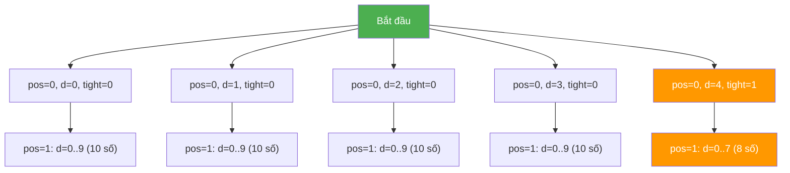

# Bài 48: Digit DP

> **Tác giả:** FPTOJ Wiki
> **Tham khảo:** CP-Algorithms, USACO Guide

---

## Bản chất vấn đề

### Bài toán kinh điển

Cho số nguyên dương $N$. Đếm số lượng số nguyên $x$ trong khoảng $[0, N]$ thỏa mãn một điều kiện nào đó liên quan đến **chữ số**.

**Ví dụ:** Cho $N = 47$, đếm số lượng số trong $[0, 47]$ có tổng chữ số chẵn.

### Phương pháp naïve

Duyệt từng số từ $0$ đến $N$, kiểm tra điều kiện cho mỗi số.

- **Độ phức tạp:** $O(N)$
- Khi $N = 10^{18}$, phương pháp naïve cần $10^{18}$ phép tính — không thể chạy trong thời gian cho phép.

### Tại sao cần Digit DP?

Mọi số nguyên đều có thể biểu diễn dưới dạng chuỗi chữ số. Thay vì duyệt từng số, ta **xây dựng số từ trái sang phải**, chữ số này qua chữ số khác. Số chữ số của $N$ chỉ là $O(\log_{10} N)$ — rất nhỏ (khoảng 18 chữ số khi $N = 10^{18}$).

### Khi nào sử dụng Digit DP?

| Tiêu chí | Mô tả |
|-----------|--------|
| Khoảng giá trị | $N$ rất lớn ($10^{18}$), không thể duyệt |
| Điều kiện | Liên quan đến **chữ số** (tổng, tích, bitmask, ...) |
| State | Có thể biểu diễn qua state có kích thước nhỏ |

---

## Tư duy cốt lõi

### Xây dựng số từng chữ số

Cho $N$ có $n$ chữ số, ký hiệu $d_0 d_1 \ldots d_{n-1}$ (từ trái sang phải). Ta duyệt từng vị trí $pos$ từ $0$ đến $n-1$, tại mỗi vị trí chọn chữ số $d$ sao cho số tạo thành không vượt quá $N$.

### Ràng buộc chặt (Tight Constraint)

Khi chọn chữ số tại vị trí $pos$, ta cần biết các chữ số đã chọn trước đó có **bằng đúng** prefix của $N$ hay không:

| Giá trị $tight$ | Ý nghĩa | Chữ số được chọn |
|------------------|----------|-------------------|
| $1$ (true) | Các chữ số đã chọn **bằng đúng** prefix của $N$ | $0$ đến $d_{pos}$ (chữ số thứ $pos$ của $N$) |
| $0$ (false) | Các chữ số đã chọn **nhỏ hơn** prefix của $N$ | $0$ đến $9$ (tự do) |

### Minh họa với $N = 47$

$N = 47$ có 2 chữ số: $d_0 = 4$, $d_1 = 7$.



Khi $d_0 = 4$ (bằng đúng chữ số đầu của $N$), ta vẫn bị ràng buộc: $d_1$ chỉ được chọn từ $0$ đến $7$. Khi $d_0 < 4$, $d_1$ được chọn tự do từ $0$ đến $9$.

Tổng số: $10 + 10 + 10 + 10 + 8 = 48$ số (từ $0$ đến $47$).

### State của Digit DP

State tổng quát có dạng $dp[pos][tight][\ldots]$, trong đó:

| Thành phần | Ý nghĩa | Kích thước |
|------------|----------|------------|
| $pos$ | Vị trí chữ số hiện tại | $0$ đến $n-1$, tối đa $20$ |
| $tight$ | Có bị ràng buộc bởi $N$ không | $0$ hoặc $1$ |
| $\ldots$ | Các state bổ sung tùy bài | Tùy bài toán |

Các state bổ sung thường gặp:

| State bổ sung | Ý nghĩa | Kích thước tối đa |
|---------------|----------|-------------------|
| $sum$ | Tổng chữ số đã chọn | $9 \times 18 = 162$ |
| $mask$ | Bitmask chữ số đã dùng | $2^{10} = 1024$ |
| $last\_digit$ | Chữ số trước đó | $10$ |
| $has\_zero$ | Đã gặp chữ số $0$ chưa | $2$ |
| $started$ | Đã bắt đầu số chưa | $2$ |

### Quá trình chuyển state

Tại mỗi trạng thái $(pos, tight, \ldots)$:

1. Nếu $pos = n$ (đã xét hết chữ số): kiểm tra điều kiện, trả về $0$ hoặc $1$.
2. Xác định giới hạn: $limit = tight ? d_{pos} : 9$.
3. Duyệt $d$ từ $0$ đến $limit$, gọi đệ quy với state mới.
4. Cộng dồn kết quả.

### Bảng theo dõi quá trình với $N = 47$, đếm số có tổng chữ số chẵn

State: $dp[pos][tight][sum \bmod 2]$

| $pos$ | $tight$ | Chữ số chọn ($d$) | $sum \bmod 2$ mới | $tight$ mới | Kết quả |
|-------|---------|---------------------|--------------------|-------------|---------|
| $0$ | $1$ | $0$ | $0$ | $0$ | $5$ |
| $0$ | $1$ | $1$ | $1$ | $0$ | $5$ |
| $0$ | $1$ | $2$ | $0$ | $0$ | $5$ (memoized) |
| $0$ | $1$ | $3$ | $1$ | $0$ | $5$ (memoized) |
| $0$ | $1$ | $4$ | $0$ | $1$ | $4$ |

Tổng: $5 + 5 + 5 + 5 + 4 = 24$ số có tổng chữ số chẵn trong $[0, 47]$.

### Đếm số trong khoảng $[L, R]$

Sử dụng tính chất:

$$count(L, R) = count(0, R) - count(0, L - 1)$$

Lưu ý: Khi $L = 0$, $count(0, -1) = 0$.

---

## Phân tích tính đúng đắn

### Tại sao chỉ memoize khi $tight = 0$?

Khi $tight = 1$, state $(pos, tight=1, \ldots)$ bị ràng buộc bởi $N$. Mỗi đường đi từ gốc đến lá trong cây đệ quy là **duy nhất** — không có hai nhánh nào có cùng state với $tight = 1$ mà cho kết quả giống nhau (vì chúng đều đi theo đúng prefix của $N$).

Ngược lại, khi $tight = 0$, các chữ số đã chọn nhỏ hơn prefix của $N$. Mọi chữ số tiếp theo đều được chọn tự do ($0$ đến $9$). Do đó, state $(pos, tight=0, \ldots)$ có thể xuất hiện nhiều lần và kết quả là **giống nhau** — đủ điều kiện để memoize.

### Tại sao cần phân biệt leading zeros?

Khi xây dựng số $007$, chữ số $0$ ở vị trí đầu tiên không phải là "chữ số thực sự" của số $7$. Nếu không phân biệt, ta sẽ đếm sai các state liên quan đến chữ số $0$.

**Giải pháp:** Sử dụng state $started$ hoặc $last\_digit$ với giá trị đặc biệt:

| State | Giá trị | Ý nghĩa |
|-------|---------|----------|
| $started = 0$ | false | Đang ở phần leading zeros |
| $started = 1$ | true | Đã chọn ít nhất 1 chữ số khác $0$ |

Hoặc dùng $last\_digit = 10$ (giá trị sentinel) để biểu thị "chưa chọn chữ số nào".

### Tại sao $new\_tight = tight \land (d == limit)$?

- Nếu trước đó đã $tight = 0$ (đã nhỏ hơn prefix): $new\_tight = 0$ (vẫn tự do).
- Nếu trước đó $tight = 1$ và $d < limit$: $new\_tight = 0$ (đã nhỏ hơn tại vị trí này).
- Nếu trước đó $tight = 1$ và $d = limit$: $new\_tight = 1$ (vẫn bằng đúng prefix).

Đây là phép AND logic — chỉ duy trì ràng buộc khi **tất cả** các chữ số trước đó đều bằng đúng prefix của $N$ **và** chữ số hiện tại cũng bằng đúng giới hạn.

### Kiểm tra correctness với ví dụ nhỏ

Cho $N = 47$, đếm số có tổng chữ số chẵn trong $[0, 47]$:

| Số | Tổng chữ số | Chẵn? |
|----|-------------|-------|
| $0$ | $0$ | Yes |
| $1$ | $1$ | No |
| $2$ | $2$ | Yes |
| $3$ | $3$ | No |
| $4$ | $4$ | Yes |
| $5$ | $5$ | No |
| $6$ | $6$ | Yes |
| $7$ | $7$ | No |
| $8$ | $8$ | Yes |
| $9$ | $9$ | No |
| $10$ | $1$ | No |
| $11$ | $2$ | Yes |
| $12$ | $3$ | No |
| $13$ | $4$ | Yes |
| $14$ | $5$ | No |
| $15$ | $6$ | Yes |
| $16$ | $7$ | No |
| $17$ | $8$ | Yes |
| $18$ | $9$ | No |
| $19$ | $10$ | Yes |
| $20$ | $2$ | Yes |
| $21$ | $3$ | No |
| $22$ | $4$ | Yes |
| $23$ | $5$ | No |
| $24$ | $6$ | Yes |
| $25$ | $7$ | No |
| $26$ | $8$ | Yes |
| $27$ | $9$ | No |
| $28$ | $10$ | Yes |
| $29$ | $11$ | No |
| $30$ | $3$ | No |
| $31$ | $4$ | Yes |
| $32$ | $5$ | No |
| $33$ | $6$ | Yes |
| $34$ | $7$ | No |
| $35$ | $8$ | Yes |
| $36$ | $9$ | No |
| $37$ | $10$ | Yes |
| $38$ | $11$ | No |
| $39$ | $12$ | Yes |
| $40$ | $4$ | Yes |
| $41$ | $5$ | No |
| $42$ | $6$ | Yes |
| $43$ | $7$ | No |
| $44$ | $8$ | Yes |
| $45$ | $9$ | No |
| $46$ | $10$ | Yes |
| $47$ | $11$ | No |

Liệt kê: $0, 2, 4, 6, 8, 11, 13, 15, 17, 19, 20, 22, 24, 26, 28, 31, 33, 35, 37, 39, 40, 42, 44, 46$ — tổng cộng $24$ số. Kết quả từ Digit DP: $24$. ✓

---

## Đánh giá độ phức tạp

### Độ phức tạp tổng quát

- **Thời gian:** $O(n \times 2 \times S \times 10)$, trong đó $n = \lfloor \log_{10} N \rfloor + 1$, $S$ là kích thước state bổ sung.
- **Bộ nhớ:** $O(n \times 2 \times S)$ (chỉ memoize khi $tight = 0$ nên thực tế giảm một nửa).

| State bổ sung | $S$ | Thời gian | Bộ nhớ |
|---------------|-----|-----------|--------|
| Không có | $1$ | $O(n)$ | $O(n)$ |
| $sum \bmod 2$ | $2$ | $O(40n)$ | $O(4n)$ |
| $sum$ (tổng chữ số) | $162$ | $O(3240n)$ | $O(324n)$ |
| $mask$ (bitmask $10$ bit) | $1024$ | $O(20480n)$ | $O(2048n)$ |
| $mask + last\_digit$ | $10240$ | $O(204800n)$ | $O(20480n)$ |

Với $n \leq 18$ (khi $N \leq 10^{18}$), ngay cả trường hợp $S = 1024$, thời gian chỉ khoảng $18 \times 2 \times 1024 \times 10 \approx 3.7 \times 10^5$ phép tính.

### Giới hạn state

Khi kết hợp nhiều state bổ sung, tổng số state có thể bùng nổ:

$$\text{Tổng states} = n \times 2 \times S_1 \times S_2 \times \ldots$$

Nếu tổng states quá lớn ($> 10^7$), có thể bị MLE. Giải pháp:

- Chỉ memoize khi $tight = 0$ (giảm một nửa số states cần lưu).
- Dùng $map$ / $unordered\_map$ thay vì mảng nếu nhiều state rỗng.
- Giảm dimensions: dùng modulo thay vì giá trị tuyệt đối.

---

## Template

### Template Digit DP

=== "C++"

    ```cpp
    #include <bits/stdc++.h>
    using namespace std;
    using ll = long long;

    string s;
    int n;
    ll dp[20][2];

    ll solve(int pos, bool tight) {
        if (pos == n) {
            return 1;
        }

        ll &res = dp[pos][tight];
        if (res != -1 && !tight) return res;

        int limit = tight ? (s[pos] - '0') : 9;
        ll ans = 0;

        for (int d = 0; d <= limit; d++) {
            bool new_tight = tight && (d == limit);
            ans += solve(pos + 1, new_tight);
        }

        if (!tight) res = ans;
        return ans;
    }

    int main() {
        ll N;
        cin >> N;
        s = to_string(N);
        n = s.size();
        memset(dp, -1, sizeof(dp));
        cout << solve(0, true) << endl;
        return 0;
    }
    ```

=== "Python"

    ```python
    from functools import lru_cache

    def digit_dp(N):
        s = str(N)
        n = len(s)

        @lru_cache(maxsize=None)
        def solve(pos, tight):
            if pos == n:
                return 1

            limit = int(s[pos]) if tight else 9
            ans = 0

            for d in range(0, limit + 1):
                new_tight = tight and (d == limit)
                ans += solve(pos + 1, new_tight)

            return ans

        return solve(0, True)
    ```

---

## Ví dụ 1: Đếm số có tổng chữ số bằng $K$

> **Bài toán:** Cho $N$ và $K$. Đếm số lượng số trong $[0, N]$ có tổng các chữ số đúng bằng $K$.

**State:** $dp[pos][tight][sum]$, trong đó $sum$ là tổng chữ số đã chọn.

**Điều kiện cắt nhánh:** Nếu $sum > K$, trả về $0$.

=== "C++"

    ```cpp
    #include <bits/stdc++.h>
    using namespace std;
    using ll = long long;

    string s;
    int n, K;
    ll dp[20][2][200];

    ll solve(int pos, bool tight, int sum) {
        if (sum > K) return 0;
        if (pos == n) return (sum == K) ? 1 : 0;

        ll &res = dp[pos][tight][sum];
        if (res != -1 && !tight) return res;

        int limit = tight ? (s[pos] - '0') : 9;
        ll ans = 0;

        for (int d = 0; d <= limit; d++) {
            bool new_tight = tight && (d == limit);
            ans += solve(pos + 1, new_tight, sum + d);
        }

        if (!tight) res = ans;
        return ans;
    }

    int main() {
        ll N;
        cin >> N >> K;
        s = to_string(N);
        n = s.size();
        memset(dp, -1, sizeof(dp));
        cout << solve(0, true, 0) << endl;
        return 0;
    }
    ```

=== "Python"

    ```python
    from functools import lru_cache

    def count_digit_sum(N, K):
        s = str(N)
        n = len(s)

        @lru_cache(maxsize=None)
        def solve(pos, tight, total):
            if total > K:
                return 0
            if pos == n:
                return 1 if total == K else 0

            limit = int(s[pos]) if tight else 9
            ans = 0

            for d in range(0, limit + 1):
                new_tight = tight and (d == limit)
                ans += solve(pos + 1, new_tight, total + d)

            return ans

        return solve(0, True, 0)

    N, K = map(int, input().split())
    print(count_digit_sum(N, K))
    ```

---

## Ví dụ 2: Đếm số không chứa chữ số $4$

> **Bài toán:** Cho $N$. Đếm số lượng số trong $[0, N]$ không chứa chữ số $4$.

**State:** $dp[pos][tight]$ — không cần state bổ sung vì điều kiện chỉ phụ thuộc vào chữ số hiện tại.

=== "C++"

    ```cpp
    #include <bits/stdc++.h>
    using namespace std;
    using ll = long long;

    string s;
    int n;
    ll dp[20][2];

    ll solve(int pos, bool tight) {
        if (pos == n) return 1;

        ll &res = dp[pos][tight];
        if (res != -1 && !tight) return res;

        int limit = tight ? (s[pos] - '0') : 9;
        ll ans = 0;

        for (int d = 0; d <= limit; d++) {
            if (d == 4) continue;
            bool new_tight = tight && (d == limit);
            ans += solve(pos + 1, new_tight);
        }

        if (!tight) res = ans;
        return ans;
    }

    int main() {
        ll N;
        cin >> N;
        s = to_string(N);
        n = s.size();
        memset(dp, -1, sizeof(dp));
        cout << solve(0, true) << endl;
        return 0;
    }
    ```

=== "Python"

    ```python
    from functools import lru_cache

    def count_without_four(N):
        s = str(N)
        n = len(s)

        @lru_cache(maxsize=None)
        def solve(pos, tight):
            if pos == n:
                return 1

            limit = int(s[pos]) if tight else 9
            ans = 0

            for d in range(0, limit + 1):
                if d == 4:
                    continue
                new_tight = tight and (d == limit)
                ans += solve(pos + 1, new_tight)

            return ans

        return solve(0, True)

    N = int(input())
    print(count_without_four(N))
    ```

---

## Ví dụ 3: Đếm số có chữ số không giảm

> **Bài toán:** Cho $N$. Đếm số lượng số trong $[0, N]$ mà các chữ số từ trái sang phải không giảm (ví dụ: $1123$, $4559$, $7$).

**State:** $dp[pos][tight][last\_digit]$, trong đó $last\_digit$ là chữ số trước đó đã chọn. Dùng $last\_digit = 10$ để biểu thị "chưa chọn chữ số nào" (leading zeros).

=== "C++"

    ```cpp
    #include <bits/stdc++.h>
    using namespace std;
    using ll = long long;

    string s;
    int n;
    ll dp[20][2][11];

    ll solve(int pos, bool tight, int last_digit) {
        if (pos == n) return 1;

        ll &res = dp[pos][tight][last_digit];
        if (res != -1 && !tight) return res;

        int limit = tight ? (s[pos] - '0') : 9;
        ll ans = 0;

        for (int d = 0; d <= limit; d++) {
            if (d < last_digit) continue;
            bool new_tight = tight && (d == limit);
            int new_last = (last_digit == 10 && d == 0) ? 10 : d;
            ans += solve(pos + 1, new_tight, new_last);
        }

        if (!tight) res = ans;
        return ans;
    }

    int main() {
        ll N;
        cin >> N;
        s = to_string(N);
        n = s.size();
        memset(dp, -1, sizeof(dp));
        cout << solve(0, true, 10) << endl;
        return 0;
    }
    ```

=== "Python"

    ```python
    from functools import lru_cache

    def count_non_decreasing(N):
        s = str(N)
        n = len(s)

        @lru_cache(maxsize=None)
        def solve(pos, tight, last_digit):
            if pos == n:
                return 1

            limit = int(s[pos]) if tight else 9
            ans = 0

            for d in range(0, limit + 1):
                if d < last_digit:
                    continue
                new_tight = tight and (d == limit)
                new_last = 10 if (last_digit == 10 and d == 0) else d
                ans += solve(pos + 1, new_tight, new_last)

            return ans

        return solve(0, True, 10)

    N = int(input())
    print(count_non_decreasing(N))
    ```

---

## Ví dụ 4: Đếm số trong khoảng $[L, R]$ có tổng chữ số chẵn

=== "C++"

    ```cpp
    #include <bits/stdc++.h>
    using namespace std;
    using ll = long long;

    string s;
    int n;
    ll dp[20][2][2];

    ll solve(int pos, bool tight, int sum_mod) {
        if (pos == n) return (sum_mod == 0) ? 1 : 0;

        ll &res = dp[pos][tight][sum_mod];
        if (res != -1 && !tight) return res;

        int limit = tight ? (s[pos] - '0') : 9;
        ll ans = 0;

        for (int d = 0; d <= limit; d++) {
            bool new_tight = tight && (d == limit);
            ans += solve(pos + 1, new_tight, (sum_mod + d) % 2);
        }

        if (!tight) res = ans;
        return ans;
    }

    ll count_up_to(ll N) {
        if (N < 0) return 0;
        s = to_string(N);
        n = s.size();
        memset(dp, -1, sizeof(dp));
        return solve(0, true, 0);
    }

    int main() {
        ll L, R;
        cin >> L >> R;
        cout << count_up_to(R) - count_up_to(L - 1) << endl;
        return 0;
    }
    ```

=== "Python"

    ```python
    from functools import lru_cache

    def count_even_digit_sum(N):
        if N < 0:
            return 0
        s = str(N)
        n = len(s)

        @lru_cache(maxsize=None)
        def solve(pos, tight, sum_mod):
            if pos == n:
                return 1 if sum_mod == 0 else 0

            limit = int(s[pos]) if tight else 9
            ans = 0

            for d in range(0, limit + 1):
                new_tight = tight and (d == limit)
                ans += solve(pos + 1, new_tight, (sum_mod + d) % 2)

            return ans

        return solve(0, True, 0)

    L, R = map(int, input().split())
    print(count_even_digit_sum(R) - count_even_digit_sum(L - 1))
    ```

---

## Các state bổ sung thường gặp

### Bitmask chữ số đã dùng

Đếm số trong $[0, N]$ sử dụng đúng $K$ chữ số khác nhau.

**State:** $dp[pos][tight][mask]$, trong đó $mask$ là bitmask $10$ bit, bit $i = 1$ nếu chữ số $i$ đã xuất hiện.

=== "C++"

    ```cpp
    #include <bits/stdc++.h>
    using namespace std;
    using ll = long long;

    string s;
    int n, K;
    ll dp[20][2][1024];

    ll solve(int pos, bool tight, int mask) {
        if (pos == n) return (__builtin_popcount(mask) == K) ? 1 : 0;

        ll &res = dp[pos][tight][mask];
        if (res != -1 && !tight) return res;

        int limit = tight ? (s[pos] - '0') : 9;
        ll ans = 0;

        for (int d = 0; d <= limit; d++) {
            bool new_tight = tight && (d == limit);
            int new_mask = mask | (1 << d);
            ans += solve(pos + 1, new_tight, new_mask);
        }

        if (!tight) res = ans;
        return ans;
    }

    int main() {
        ll N;
        cin >> N >> K;
        s = to_string(N);
        n = s.size();
        memset(dp, -1, sizeof(dp));
        cout << solve(0, true, 0) << endl;
        return 0;
    }
    ```

=== "Python"

    ```python
    from functools import lru_cache

    def count_distinct_digits(N, K):
        s = str(N)
        n = len(s)

        @lru_cache(maxsize=None)
        def solve(pos, tight, mask):
            if pos == n:
                return 1 if bin(mask).count('1') == K else 0

            limit = int(s[pos]) if tight else 9
            ans = 0

            for d in range(0, limit + 1):
                new_tight = tight and (d == limit)
                new_mask = mask | (1 << d)
                ans += solve(pos + 1, new_tight, new_mask)

            return ans

        return solve(0, True, 0)

    N, K = map(int, input().split())
    print(count_distinct_digits(N, K))
    ```

### Không có chữ số nào lặp lại

Đếm số trong $[0, N]$ mà không có chữ số nào xuất hiện quá một lần.

**State:** $dp[pos][tight][mask]$. Nếu bit $d$ đã bật trong $mask$ mà chọn $d$ nữa — bỏ qua.

=== "C++"

    ```cpp
    #include <bits/stdc++.h>
    using namespace std;
    using ll = long long;

    string s;
    int n;
    ll dp[20][2][1024];

    ll solve(int pos, bool tight, int mask) {
        if (pos == n) return 1;

        ll &res = dp[pos][tight][mask];
        if (res != -1 && !tight) return res;

        int limit = tight ? (s[pos] - '0') : 9;
        ll ans = 0;

        for (int d = 0; d <= limit; d++) {
            if (mask & (1 << d)) continue;
            bool new_tight = tight && (d == limit);
            int new_mask = mask | (1 << d);
            if (d == 0 && mask == 0) new_mask = 0;
            ans += solve(pos + 1, new_tight, new_mask);
        }

        if (!tight) res = ans;
        return ans;
    }

    int main() {
        ll N;
        cin >> N;
        s = to_string(N);
        n = s.size();
        memset(dp, -1, sizeof(dp));
        cout << solve(0, true, 0) << endl;
        return 0;
    }
    ```

=== "Python"

    ```python
    from functools import lru_cache

    def count_no_repeating(N):
        s = str(N)
        n = len(s)

        @lru_cache(maxsize=None)
        def solve(pos, tight, mask):
            if pos == n:
                return 1

            limit = int(s[pos]) if tight else 9
            ans = 0

            for d in range(0, limit + 1):
                if mask & (1 << d):
                    continue
                new_tight = tight and (d == limit)
                new_mask = mask | (1 << d)
                if d == 0 and mask == 0:
                    new_mask = 0
                ans += solve(pos + 1, new_tight, new_mask)

            return ans

        return solve(0, True, 0)

    N = int(input())
    print(count_no_repeating(N))
    ```

### Tích các chữ số bằng $0$

Đếm số trong $[0, N]$ mà tích các chữ số bằng $0$ (tức có ít nhất $1$ chữ số $0$ thực sự, không tính leading zeros).

**State:** $dp[pos][tight][has\_zero]$, trong đó $has\_zero = 1$ nếu đã gặp chữ số $0$ thực sự.

=== "C++"

    ```cpp
    #include <bits/stdc++.h>
    using namespace std;
    using ll = long long;

    string s;
    int n;
    ll dp[20][2][2];

    ll solve(int pos, bool tight, bool has_zero) {
        if (pos == n) return has_zero ? 1 : 0;

        ll &res = dp[pos][tight][has_zero];
        if (res != -1 && !tight) return res;

        int limit = tight ? (s[pos] - '0') : 9;
        ll ans = 0;

        for (int d = 0; d <= limit; d++) {
            bool new_tight = tight && (d == limit);
            bool new_zero = has_zero || (d == 0 && pos > 0);
            ans += solve(pos + 1, new_tight, new_zero);
        }

        if (!tight) res = ans;
        return ans;
    }

    int main() {
        ll N;
        cin >> N;
        s = to_string(N);
        n = s.size();
        memset(dp, -1, sizeof(dp));
        cout << solve(0, true, false) << endl;
        return 0;
    }
    ```

=== "Python"

    ```python
    from functools import lru_cache

    def count_product_zero(N):
        s = str(N)
        n = len(s)

        @lru_cache(maxsize=None)
        def solve(pos, tight, has_zero):
            if pos == n:
                return 1 if has_zero else 0

            limit = int(s[pos]) if tight else 9
            ans = 0

            for d in range(0, limit + 1):
                new_tight = tight and (d == limit)
                new_zero = has_zero or (d == 0 and pos > 0)
                ans += solve(pos + 1, new_tight, new_zero)

            return ans

        return solve(0, True, False)

    N = int(input())
    print(count_product_zero(N))
    ```

### GCD các chữ số lớn hơn $1$

Đếm số trong $[0, N]$ mà GCD tất cả các chữ số lớn hơn $1$.

**State:** $dp[pos][tight][gcd\_sofar]$. Khi chưa chọn chữ số nào, $gcd = 0$.

=== "C++"

    ```cpp
    #include <bits/stdc++.h>
    using namespace std;
    using ll = long long;

    string s;
    int n;
    ll dp[20][2][10];

    ll solve(int pos, bool tight, int g) {
        if (pos == n) return (g > 1) ? 1 : 0;

        ll &res = dp[pos][tight][g];
        if (res != -1 && !tight) return res;

        int limit = tight ? (s[pos] - '0') : 9;
        ll ans = 0;

        for (int d = 0; d <= limit; d++) {
            bool new_tight = tight && (d == limit);
            int new_g = (g == 0) ? d : __gcd(g, d);
            ans += solve(pos + 1, new_tight, new_g);
        }

        if (!tight) res = ans;
        return ans;
    }

    int main() {
        ll N;
        cin >> N;
        s = to_string(N);
        n = s.size();
        memset(dp, -1, sizeof(dp));
        cout << solve(0, true, 0) << endl;
        return 0;
    }
    ```

=== "Python"

    ```python
    from functools import lru_cache
    from math import gcd

    def count_gcd_gt_one(N):
        s = str(N)
        n = len(s)

        @lru_cache(maxsize=None)
        def solve(pos, tight, g):
            if pos == n:
                return 1 if g > 1 else 0

            limit = int(s[pos]) if tight else 9
            ans = 0

            for d in range(0, limit + 1):
                new_tight = tight and (d == limit)
                new_g = d if g == 0 else gcd(g, d)
                ans += solve(pos + 1, new_tight, new_g)

            return ans

        return solve(0, True, 0)

    N = int(input())
    print(count_gcd_gt_one(N))
    ```

---

## Cạm bẫy thường gặp

### Off-by-one trong khoảng $[L, R]$

Công thức đúng: $count(L, R) = count(0, R) - count(0, L - 1)$.

Nếu dùng $count(0, R) - count(0, L)$, ta sẽ thiếu số $L$. Đặc biệt, khi $L = 0$, hàm $count(0, -1)$ phải trả về $0$.

### Quên reset dp giữa các test case

Khi chạy nhiều test case, phải gọi `memset(dp, -1, sizeof(dp))` cho mỗi test case vì $N$ khác nhau dẫn đến $s$ và $n$ khác nhau.

### State explosion

Khi kết hợp quá nhiều state bổ sung, tổng số state có thể vượt quá giới hạn bộ nhớ. Cần tính toán trước kích thước state:

$$\text{Tổng states} = n \times 2 \times S_1 \times S_2 \times \ldots \leq 10^7$$

Nếu vượt quá, cân nhắc giảm dimensions hoặc dùng $map$ thay vì mảng.

---

## Bài tập

| # | Tên bài | Nguồn | Độ khó | Ghi chú |
|---|---------|-------|--------|---------|
| 1 | [Digit Sum](https://atcoder.jp/contests/dp/tasks/dp_s) | AtCoder DP | ★★☆ | Tổng chữ số chia hết cho $D$ |
| 2 | [LIDS](https://codeforces.com/problemset/problem/1245/F) | CF | ★★★ | Dãy con tăng dài nhất theo chữ số |
| 3 | [Palindromic Numbers](https://codeforces.com/problemset/problem/401/D) | CF | ★★☆ | Đếm số palindrome |
| 4 | [Magic Numbers](https://codeforces.com/problemset/problem/628/D) | CF | ★★☆ | Số "magic" với digit $m$ |
| 5 | [Classy Numbers](https://codeforces.com/problemset/problem/1036/C) | CF | ★★☆ | Tối đa $3$ chữ số khác $0$ |
| 6 | [XOR Palindrome](https://codeforces.com/problemset/problem/1731/D) | CF | ★★★ | Palindrome XOR |
| 7 | [Investigation](https://open.kattis.com/problems/investigation) | Kattis | ★★☆ | Chia hết cho $K$, tổng chữ số |
| 8 | [Digit Count](https://www.spoj.com/problems/CPCRC1C/) | SPOJ | ★★☆ | Tổng chữ số từ $A$ đến $B$ |
| 9 | [Sum of Digits](https://codeforces.com/problemset/problem/165/C) | CF | ★★☆ | Đếm substring có tổng chữ số $= K$ |
| 10 | [Number of Numbers](https://www.codechef.com/problems/DIGITDP) | CodeChef | ★★★ | Nhiều query, Digit DP |
| 11 | [Counting Numbers](https://cses.fi/problemset/task/2220) | CSES | ★★☆ | Đếm số không có chữ số liền kề giống nhau |

### Bài tập luyện tập

**Dễ (làm quen):**

- Đếm số trong $[0, N]$ mà tổng chữ số chia hết cho $3$.
- Đếm số trong $[0, N]$ không chứa chữ số $9$.
- Đếm số trong $[0, N]$ mà chữ số đầu tiên là số lẻ.

**Trung bình:**

- Đếm số trong $[0, N]$ mà hiệu lớn nhất và nhỏ nhất các chữ số $\leq K$.
- Đếm số trong $[0, N]$ mà tổng chữ số là số nguyên tố.
- Đếm số trong $[L, R]$ mà tích các chữ số $> 0$.

**Khó:**

- Đếm số trong $[0, N]$ mà là palindrome.
- Đếm số trong $[0, N]$ mà không có $3$ chữ số liên tiếp giống nhau.
- Đếm số trong $[0, N]$ mà mỗi chữ số xuất hiện tối đa $K$ lần.

---

> **Bài tiếp theo:** [Bài 49: Interval DP](interval-dp.md)
