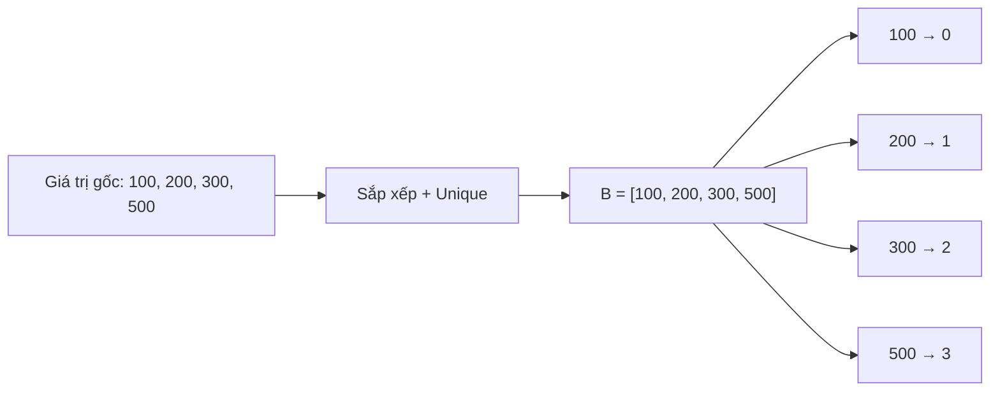

# Rời Rạc Hoá (Nén Số) - Thu Nhỏ Miền Giá Trị

> **Tác giả:** FPTOJ Team<br>
> **Nội dung tham khảo từ:** VNOI Wiki - Rời rạc hoá, CP-Algorithms

---

## 1. Bản chất vấn đề

### Bài toán: Đếm số phần tử phân biệt trong đoạn

Cho mảng $A$ gồm $N$ phần tử ($A_i \le 10^9$), thực hiện $Q$ truy vấn: đếm số phần tử phân biệt trong đoạn $[l, r]$.

**Vấn đề:** Nếu dùng mảng đếm (counting array), cần mảng kích thước $10^9$ $\Rightarrow$ **tràn bộ nhớ!**

**Giải pháp:** Rời rạc hoá — thay $A_i$ bằng **thứ hạng** của nó. Giá trị lớn nhất chỉ cần bằng $N$.

Ví dụ: $A = [100, 5000, 100, 99999, 5000]$

| Giá trị gốc | Thứ hạng (rời rạc hoá) |
|-------------|----------------------|
| $100$ | $0$ |
| $5000$ | $1$ |
| $99999$ | $2$ |

$\Rightarrow$ Mảng rời rạc: $[0, 1, 0, 2, 1]$ — chỉ cần mảng kích thước 3!

### Khi nào cần rời rạc hoá?

| Tình huống | Mô tả |
|------------|-------|
| Giá trị rất lớn ($10^9$, $10^{18}$) | Không thể dùng mảng trực tiếp |
| Cần dùng Segment Tree / BIT | Chỉ số mảng phải từ $0$ đến $N-1$ |
| Coordinate Compression | Toạ độ lớn, cần nén lại cho Sweep Line |
| Bài toán đếm / cập nhật trên giá trị | Cần ánh xạ giá trị $\to$ chỉ số |

---

## 2. Tư duy cốt lõi

### Thuật toán cơ bản

**Input:** Mảng $A$ gồm $N$ phần tử.

**Bước 1:** Tạo mảng $B$ là bản sao đã sắp xếp của $A$, loại bỏ phần tử trùng.

**Bước 2:** Với mỗi $A_i$, tìm vị trí của nó trong $B$ bằng binary search. Vị trí đó chính là giá trị rời rạc hoá.

### Trace chi tiết

**Input:** $A = [300, 100, 500, 100, 200, 500]$

**Bước 1 — Sắp xếp và loại trùng:**

| Bước | Mảng $B$ (đang xây) | Thao tác |
|------|---------------------|----------|
| Sao chép | $[300, 100, 500, 100, 200, 500]$ | Copy $A$ |
| Sắp xếp | $[100, 100, 200, 300, 500, 500]$ | `sort` |
| Loại trùng | $[100, 200, 300, 500]$ | `unique` |

**Bước 2 — Ánh xạ giá trị $\to$ chỉ số:**

| Giá trị gốc $A_i$ | $A_i = 300$ | $A_i = 100$ | $A_i = 500$ | $A_i = 100$ | $A_i = 200$ | $A_i = 500$ |
|-------------------|-------------|-------------|-------------|-------------|-------------|-------------|
| Vị trí trong $B$ | $2$ | $0$ | $3$ | $0$ | $1$ | $3$ |

Kết quả: $A' = [2, 0, 3, 0, 1, 3]$

### Minh họa ánh xạ



### Rời rạc hoá cho Coordinate Compression (Sweep Line)

Khi cần xử lý các đoạn $[l_i, r_i]$ với toạ độ lớn:

**Bước 1:** Thu thập tất cả toạ độ xuất hiện: $\{l_1, r_1, l_2, r_2, \ldots\}$

**Bước 2:** Sắp xếp và loại trùng.

**Bước 3:** Thay mỗi toạ độ bằng chỉ số trong mảng đã sắp xếp.

**Ví dụ:** Các đoạn $[10, 100]$, $[50, 200]$, $[150, 300]$

Toạ độ xuất hiện: $\{10, 50, 100, 150, 200, 300\}$

| Toạ độ gốc | $10$ | $50$ | $100$ | $150$ | $200$ | $300$ |
|------------|------|------|-------|-------|-------|-------|
| Chỉ số mới | $0$ | $1$ | $2$ | $3$ | $4$ | $5$ |

Đoạn $[10, 100]$ $\to$ $[0, 2]$, đoạn $[50, 200]$ $\to$ $[1, 4]$, đoạn $[150, 300]$ $\to$ $[3, 5]$.

---

## 3. Phân tích tính đúng đắn

### Tính chất bảo toàn thứ tự

Rời rạc hoá sử dụng **thứ hạng** (rank) trong mảng đã sắp xếp. Vì `sort` bảo toàn thứ tự tương đối:

$$A_i < A_j \iff \text{rank}(A_i) < \text{rank}(A_j)$$

Do đó, mọi phép so sánh tương đối giữa các phần tử vẫn đúng sau khi rời rạc hoá.

### Tính chất bảo toàn kết quả

Với các bài toán mà kết quả chỉ phụ thuộc vào **thứ tự tương đối** giữa các phần tử (không phụ thuộc giá trị tuyệt đối), rời rạc hoá cho kết quả chính xác:

- Đếm phần tử phân biệt trong đoạn
- Segment Tree / BIT trên giá trị
- Sweep Line
- Coordinate compression cho hình học

---

## 4. Đánh giá độ phức tạp

| Bước | Độ phức tạp thời gian | Độ phức tạp không gian |
|------|----------------------|------------------------|
| Sắp xếp | $O(N \log N)$ | $O(N)$ |
| Loại trùng | $O(N)$ | $O(N)$ |
| Binary search cho mỗi phần tử | $O(N \log N)$ | $O(1)$ |
| **Tổng** | $O(N \log N)$ | $O(N)$ |

---

## Code minh họa

### Rời rạc hoá cơ bản

=== "C++"

    ```cpp
    #include <bits/stdc++.h>
    using namespace std;

    vector<int> discretize(vector<int>& a) {
        vector<int> b = a;
        sort(b.begin(), b.end());
        b.erase(unique(b.begin(), b.end()), b.end());

        vector<int> res(a.size());
        for (int i = 0; i < (int)a.size(); i++) {
            res[i] = lower_bound(b.begin(), b.end(), a[i]) - b.begin();
        }
        return res;
    }

    int main() {
        int n;
        cin >> n;
        vector<int> a(n);
        for (int i = 0; i < n; i++) cin >> a[i];

        vector<int> compressed = discretize(a);

        for (int x : compressed) cout << x << " ";
        cout << endl;
        return 0;
    }
    ```

=== "Python"

    ```python
    from bisect import bisect_left

    def discretize(a):
        b = sorted(set(a))
        return [bisect_left(b, x) for x in a]

    n = int(input())
    a = list(map(int, input().split()))

    compressed = discretize(a)
    print(*compressed)
    ```

### Ứng dụng: Đếm số phần tử phân biệt trong đoạn

Dùng mảng đếm trên miền giá trị đã rời rạc hoá:

=== "C++"

    ```cpp
    #include <bits/stdc++.h>
    using namespace std;

    int main() {
        int n;
        cin >> n;
        vector<int> a(n);
        for (int i = 0; i < n; i++) cin >> a[i];

        // Rời rạc hoá
        vector<int> b = a;
        sort(b.begin(), b.end());
        b.erase(unique(b.begin(), b.end()), b.end());

        int m = b.size(); // số giá trị phân biệt
        vector<int> cnt(m, 0);
        int distinct = 0;

        // Ví dụ: đếm số phân biệt trong toàn mảng
        for (int i = 0; i < n; i++) {
            int val = lower_bound(b.begin(), b.end(), a[i]) - b.begin();
            if (cnt[val] == 0) distinct++;
            cnt[val]++;
        }

        cout << "So phan tu phan biet: " << distinct << endl;
        return 0;
    }
    ```

=== "Python"

    ```python
    from bisect import bisect_left

    n = int(input())
    a = list(map(int, input().split()))

    b = sorted(set(a))
    m = len(b)
    cnt = [0] * m
    distinct = 0

    for val in a:
        idx = bisect_left(b, val)
        if cnt[idx] == 0:
            distinct += 1
        cnt[idx] += 1

    print(f"So phan tu phan biet: {distinct}")
    ```
