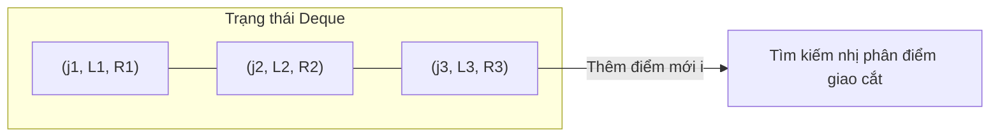
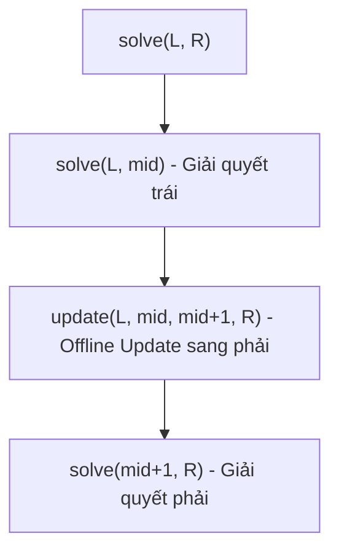

# Bài 51: Tối ưu Quy Hoạch Động 1 Chiều (1D/1D DP Optimization)

> **Tác giả:** FPTOJ Team<br>
> **Nội dung tham khảo từ:** VNOI Wiki, CP-Algorithms - 1D1D DP Optimization

---

## Bạn sẽ học được gì?

- **Bản chất của 1D/1D DP:** Định nghĩa và nhận diện bài toán.
- **Sự khác biệt giữa Online và Offline DP:** Tại sao thuật toán Chia để trị (D&C) thông thường sẽ thất bại khi giá trị của trạng thái hiện tại phụ thuộc trực tiếp vào các trạng thái liền trước đó.
- **Kỹ thuật Đệ quy Chia để trị Online-to-Offline:** CDQ Phân trị giải quyết sự phụ thuộc tuần tự trong $O(N \log^2 N)$.
- **Kỹ thuật Deque kết hợp Tìm kiếm nhị phân (Binary Search on Deque):** Thuật toán tối ưu trong $O(N \log N)$ dựa trên tính đơn điệu của điểm cắt.

---

## 1. Bản chất vấn đề và Sự phân loại

### 1.1 Công thức tổng quát

Hệ thức quy hoạch động được gọi là dạng $1D/1D$ khi nó có dạng:
$$dp[i] = \min_{0 \le j < i} \{ dp[j] + C(j, i) \}$$
Trong đó $C(j, i)$ là hàm chi phí chuyển trạng thái từ $j$ sang $i$. 
Tên gọi **$1D/1D$** xuất phát từ việc bảng quy hoạch động là mảng $1$ chiều gồm $N$ phần tử, và mỗi phần tử cần duyệt qua tối đa $N$ trạng thái trước đó để chuyển đổi.

**Độ phức tạp ngây thơ:** Duyệt qua mọi trạng thái $j$ mất thời gian $O(N^2)$.

---

### 1.2 Điều kiện tối ưu: Bất đẳng thức Tứ giác (Quadrangle Inequality)
Nếu hàm chi phí $C(j, i)$ thỏa mãn bất đẳng thức tứ giác:
$$C(a, c) + C(b, d) \le C(a, d) + C(b, c), \quad \forall a \le b \le c \le d$$
Thì ta có tính chất **đơn điệu của điểm cắt tối ưu** (monotonicity): Gọi $opt[i]$ là chỉ số $j$ tối ưu nhất cho $dp[i]$, ta luôn có:
$$opt[i] \le opt[i+1]$$

---

### 1.3 Phân loại bài toán: Online vs Offline DP

Để áp dụng các kỹ thuật tối ưu hóa, ta cần phân loại bài toán thành hai dạng dựa trên tính độc lập dữ liệu:

1. **Offline 1D/1D DP:**
   Khi ta tính toán trạng thái dòng $i$ dựa hoàn toàn vào một dòng quy hoạch động trước đó đã được tính toán hoàn chỉnh (ví dụ phân chia dãy thành $K$ nhóm liên tiếp).
   $$dp[k][i] = \min_{j < i} \{ dp[k-1][j] + C(j, i) \}$$
   Lúc này, toàn bộ mảng nguồn $dp[k-1]$ đã biết trước. Ta áp dụng trực tiếp thuật toán **Chia để trị (Divide & Conquer DP)** để đạt độ phức tạp $O(K \cdot N \log N)$.

2. **Online 1D/1D DP:**
   Khi ta chỉ có một mảng $dp$ duy nhất và giá trị $dp[i]$ phụ thuộc trực tiếp vào các giá trị $dp[j]$ ($j < i$) vừa được tính toán ở các bước trước đó trong cùng một vòng lặp:
   $$dp[i] = \min_{0 \le j < i} \{ dp[j] + C(j, i) \}$$
   Tại đây, ta **không thể** chia đôi đoạn $[1, N]$ và tính $mid = \lfloor (lo + hi)/2 \rfloor$ ngay lập tức như Offline DP, vì để tính được $dp[mid]$ ta bắt buộc phải tính xong toàn bộ các giá trị từ $dp[0]$ tới $dp[mid-1]$ trước.

Dưới đây là hai phương pháp chính để tối ưu hóa bài toán **Online 1D/1D DP**.

---

## 2. Phương pháp 1: Sử dụng Deque và Tìm kiếm nhị phân ($O(N \log N)$)

### 2.1 Tư duy cốt lõi

Do tính chất đơn điệu $opt[i] \le opt[i+1]$, tại một thời điểm bất kỳ, mỗi điểm chuyển trạng thái $j$ đã biết sẽ chịu trách nhiệm tối ưu cho một **đoạn liên tục** $[L_j, R_j]$ của các trạng thái tương lai.
Ta duy trì một hàng đợi hai đầu (Deque) quản lý các bộ ba thông tin:
$$\text{Element} = (j, L, R)$$
Ý nghĩa: Điểm chuyển $j$ là tối ưu nhất cho mọi trạng thái $i \in [L, R]$. 

Các đoạn này phủ kín miền giá trị tương lai:
$$[L_{j_1}, R_{j_1}] \cup [L_{j_2}, R_{j_2}] \cup \dots = [i, N]$$



### 2.2 Các bước xử lý tại mỗi bước $i$

1. **Loại bỏ các phần tử lỗi thời ở đầu Deque:**
   Nếu phần tử ở đầu Deque $(j, L, R)$ có $R < i$, điều này có nghĩa đoạn chịu trách nhiệm của $j$ đã nằm hoàn toàn ở quá khứ. Ta pop nó ra khỏi đầu Deque.
2. **Tính toán giá trị $dp[i]$:**
   Lúc này, phần tử ở đầu Deque chắc chắn chứa chỉ số $i$ trong đoạn $[L, R]$ của nó. Điểm chuyển tối ưu cho $i$ chính là $j$ ở đầu Deque. Ta thực hiện tính:
   $$dp[i] = dp[j] + C(j, i)$$
3. **Thêm điểm chuyển mới $i$ vào cuối Deque làm ứng cử viên cho tương lai:**
   Ta cần cập nhật bao lồi bằng cách chèn điểm chuyển $i$ vào cuối Deque. Vì $opt[x]$ đơn điệu tăng, điểm chuyển $i$ chỉ có thể tối ưu hơn điểm chuyển cũ ở một đoạn hậu tố nào đó của tương lai.
   - Ta so sánh điểm chuyển $i$ với điểm chuyển cuối Deque $last = (j_{last}, L_{last}, R_{last})$:
     - Nếu tại điểm bắt đầu $L_{last}$, điểm chuyển $i$ tốt hơn $j_{last}$ (tức là $dp[i] + C(i, L_{last}) < dp[j_{last}] + C(j_{last}, L_{last})$), nghĩa là $j_{last}$ hoàn toàn bị $i$ áp đảo trên cả đoạn chịu trách nhiệm của nó. Ta pop phần tử cuối ra khỏi Deque và tiếp tục so sánh với phần tử kế cuối.
     - Nếu $i$ chỉ tốt hơn ở một phần phía sau của đoạn $[L_{last}, R_{last}]$, ta thực hiện **Tìm kiếm nhị phân** trên đoạn $[L_{last}, R_{last}]$ để tìm vị trí biên $pos$ nhỏ nhất mà tại đó $i$ bắt đầu tốt hơn $j_{last}$. Sau đó:
       - Cập nhật lại biên phải của phần tử cuối Deque: $R_{last} = pos - 1$.
       - Đẩy phần tử mới $(i, pos, N)$ vào cuối Deque.

=== "C++"

    ```cpp
    #include <bits/stdc++.h>
    using namespace std;

    const long long INF = 1e18;

    struct Decision {
        int j; // Điểm chuyển trạng thái nguồn
        int l; // Biên trái chịu trách nhiệm
        int r; // Biên phải chịu trách nhiệm
    };

    int n;
    vector<long long> dp;
    vector<long long> prefix;

    // Định nghĩa hàm chi phí cụ thể (Ví dụ: chi phí bằng bình phương tổng đoạn)
    long long cost(int j, int i) {
        long long sum = prefix[i] - prefix[j];
        return sum * sum;
    }

    void solve_1d1d_deque() {
        dp.assign(n + 1, INF);
        dp[0] = 0;

        deque<Decision> dq;
        dq.push_back({0, 1, n});

        for (int i = 1; i <= n; i++) {
            // 1. Loại bỏ các đoạn đã qua ở đầu Deque
            while (!dq.empty() && dq.front().r < i) {
                dq.pop_front();
            }

            // 2. Tính dp[i] từ điểm chuyển tối ưu nhất ở đầu Deque
            int best_j = dq.front().j;
            dp[i] = dp[best_j] + cost(best_j, i);

            // 3. Chèn điểm chuyển mới i vào cuối Deque
            while (!dq.empty()) {
                Decision last = dq.back();
                // Nếu i tốt hơn last.j tại điểm bắt đầu last.l, last.j trở nên vô dụng
                if (dp[i] + cost(i, last.l) < dp[last.j] + cost(last.j, last.l)) {
                    dq.pop_back();
                } else {
                    break;
                }
            }

            if (dq.empty()) {
                dq.push_back({i, i + 1, n});
            } else {
                Decision last = dq.back();
                // Tìm kiếm nhị phân điểm giao cắt trên đoạn [last.l, last.r]
                int lo = last.l, hi = last.r, pos = last.r + 1;
                while (lo <= hi) {
                    int mid = (lo + hi) / 2;
                    if (dp[i] + cost(i, mid) < dp[last.j] + cost(last.j, mid)) {
                        pos = mid;
                        hi = mid - 1;
                    } else {
                        lo = mid + 1;
                    }
                }

                if (pos <= n) {
                    // Cập nhật lại biên phải của phần tử cuối cũ
                    dq.back().r = pos - 1;
                    // Thêm phần tử mới
                    dq.push_back({i, pos, n});
                }
            }
        }
    }
    ```

=== "Python"

    ```python
    class Decision:
        def __init__(self, j, l, r):
            self.j = j
            self.l = l
            self.r = r

    def solve_1d1d_deque(n, prefix):
        # Hàm chi phí
        def cost(j, i):
            val = prefix[i] - prefix[j]
            return val * val

        dp = [float('inf')] * (n + 1)
        dp[0] = 0

        dq = [Decision(0, 1, n)]

        for i in range(1, n + 1):
            # 1. Loại bỏ các phần tử đầu lỗi thời
            while dq and dq[0].r < i:
                dq.pop(0)

            # 2. Tính dp[i]
            best_j = dq[0].j
            dp[i] = dp[best_j] + cost(best_j, i)

            # 3. Thêm điểm chuyển mới i vào Deque
            while dq:
                last = dq[-1]
                if dp[i] + cost(i, last.l) < dp[last.j] + cost(last.j, last.l):
                    dq.pop()
                else:
                    break

            if not dq:
                dq.append(Decision(i, i + 1, n))
            else:
                last = dq[-1]
                lo, hi = last.l, last.r
                pos = last.r + 1
                while lo <= hi:
                    mid = (lo + hi) // 2
                    if dp[i] + cost(i, mid) < dp[last.j] + cost(last.j, mid):
                        pos = mid
                        hi = mid - 1
                    else:
                        lo = mid + 1
                
                if pos <= n:
                    dq[-1].r = pos - 1
                    dq.append(Decision(i, pos, n))

        return dp[n]
    ```

---

## 3. Phương pháp 2: Đệ quy Chia để trị Online-to-Offline (CDQ Phân trị) ($O(N \log^2 N)$)

### 3.1 Tư duy cốt lõi

Nếu việc cài đặt Deque phức tạp và dễ gặp lỗi biên, ta có thể sử dụng phương pháp **CDQ Phân trị** (Online-to-Offline). Ý tưởng là chia việc tính toán đoạn $[L, R]$ thành các bước:
1. Đệ quy giải quyết hoàn toàn nửa bên trái $[L, mid]$ để thu được các giá trị $dp$ đúng.
2. Dùng các giá trị $dp$ đã biết ở nửa trái $[L, mid]$ để cập nhật (bắn thông tin) sang nửa bên phải $[mid+1, R]$. Việc cập nhật này hoàn toàn là một bài toán **Offline**, do đó ta có thể sử dụng hàm chia để trị thông thường.
3. Đệ quy giải quyết nửa bên phải $[mid+1, R]$ (nơi đã được tích lũy đầy đủ thông tin chuyển trạng thái từ nửa trái).



=== "C++"

    ```cpp
    #include <bits/stdc++.h>
    using namespace std;

    const long long INF = 1e18;

    int n;
    vector<long long> dp;
    vector<long long> prefix;

    long long cost(int j, int i) {
        long long sum = prefix[i] - prefix[j];
        return sum * sum;
    }

    // Hàm cập nhật Offline từ các điểm nguồn trong [optL, optR] tới các đích trong [lo, hi]
    void update_offline(int lo, int hi, int optL, int optR) {
        if (lo > hi) return;
        int mid = (lo + hi) / 2;
        int best_j = optL;
        long long best_val = INF;

        for (int j = optL; j <= min(mid - 1, optR); j++) {
            long long val = dp[j] + cost(j, mid);
            if (val < best_val) {
                best_val = val;
                best_j = j;
            }
        }

        dp[mid] = min(dp[mid], best_val);

        update_offline(lo, mid - 1, optL, best_j);
        update_offline(mid + 1, hi, best_j, optR);
    }

    // Hàm phân trị chính CDQ
    void solve_cdq(int l, int r) {
        if (l == r) return;
        int mid = (l + r) / 2;

        // 1. Giải quyết nửa bên trái
        solve_cdq(l, mid);

        // 2. Cập nhật Offline từ nửa trái sang nửa phải
        update_offline(mid + 1, r, l, mid);

        // 3. Giải quyết nửa bên phải
        solve_cdq(mid + 1, r);
    }

    int main() {
        ios_base::sync_with_stdio(false);
        cin.tie(NULL);

        // Đọc n, prefix...
        dp.assign(n + 1, INF);
        dp[0] = 0;

        solve_cdq(0, n);

        cout << dp[n] << "\n";
        return 0;
    }
    ```

=== "Python"

    ```python
    import sys

    # Tránh tràn giới hạn đệ quy trong Python
    sys.setrecursionlimit(300000)

    def solve_online_dp(n, prefix):
        def cost(j, i):
            s = prefix[i] - prefix[j]
            return s * s

        dp = [float('inf')] * (n + 1)
        dp[0] = 0

        def update_offline(lo, hi, opt_l, opt_r):
            if lo > hi:
                return
            mid = (lo + hi) // 2
            best_j = opt_l
            best_val = float('inf')

            for j in range(opt_l, min(mid, opt_r + 1)):
                val = dp[j] + cost(j, mid)
                if val < best_val:
                    best_val = val
                    best_j = j

            dp[mid] = min(dp[mid], best_val)

            update_offline(lo, mid - 1, opt_l, best_j)
            update_offline(mid + 1, hi, best_j, opt_r)

        def solve_cdq(l, r):
            if l == r:
                return
            mid = (l + r) // 2
            solve_cdq(l, mid)
            update_offline(mid + 1, r, l, mid)
            solve_cdq(mid + 1, r)

        solve_cdq(0, n)
        return dp[n]
    ```

---

## 4. Tóm tắt so sánh hai phương pháp

| Tiêu chí so sánh | Deque + Binary Search | CDQ Phân trị (Online-to-Offline) |
| :--- | :--- | :--- |
| **Độ phức tạp thời gian** | $O(N \log N)$ | $O(N \log^2 N)$ |
| **Độ phức tạp bộ nhớ** | $O(N)$ | $O(N)$ |
| **Tính chất đặc trưng** | Đòi hỏi hàm chuyển trạng thái phải dễ dàng tính $C(j, i)$ trong $O(1)$. | Cho phép tính hàm chi phí chậm hơn hoặc cần cấu trúc phụ trợ (như con trỏ hai đầu). |
| **Mức độ phức tạp cài đặt**| Khó debug hơn do xử lý nhiều điều kiện biên trên Deque. | Rất dễ cài đặt và cấu trúc sạch sẽ. |

---

## 5. Bài tập áp dụng

1. **[CSES - Subarray Squares](https://cses.fi/problemset/task/2086)**: Phân chia dãy số thành $K$ đoạn con liên tiếp sao cho tổng bình phương tổng các đoạn nhỏ nhất.
2. **[SPOJ - LARMY](https://www.spoj.com/problems/LARMY/)**: Bài toán sắp xếp đội ngũ quân lính với chi phí nghịch thế (inversions).
3. **[Codeforces - 319C (Kalila and Dimna)](https://codeforces.com/problemset/problem/319/C)**: Cực tiểu hóa chi phí cưa cây (sử dụng CHT hoặc 1D1D Deque).
