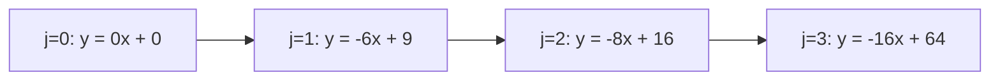

# Kĩ Thuật Bao Lồi Trong Quy Hoạch Động

> **Tác giả:** FPTOJ Team<br>
> **Nội dung tham khảo từ:** VNOI Wiki

---

## 1. Bản chất vấn đề

### Bài toán: Tối ưu hoá với hàm chi phí lồi

Cho công thức DP:

$$dp[i] = \min_{0 \le j < i} \{ dp[j] + C(j, i) \}$$

Trong đó $C(j, i)$ là hàm **lồi** theo $i$ (ví dụ: $(S[i] - S[j])^2$).

**Convex Hull Trick (CHT):** Duy trì tập các đường thẳng, tìm đường thẳng cho giá trị nhỏ nhất tại $x = i$.

### So sánh

| Phương pháp | Thời gian |
|-------------|-----------|
| Duyệt thường | $O(N^2)$ |
| **Convex Hull Trick** | $O(N \log N)$ hoặc $O(N)$ |
| Divide & Conquer | $O(N \log N)$ |

---

## 2. Tư duy cốt lõi

### Ý tưởng: Mỗi $j$ tương ứng 1 đường thẳng

Viết lại: $dp[i] = \min_j \{ m_j \cdot x_i + b_j \}$

Trong đó $m_j$ và $b_j$ phụ thuộc vào $j$, $x_i$ phụ thuộc vào $i$.

**CHT duy trì:** Tập đường thẳng, truy vấn đường thẳng cho giá trị nhỏ nhất tại $x = x_i$.

### Li Chao Tree

Mỗi nút quản lý 1 đoạn $[lo, hi]$, lưu 1 đường thẳng. Khi thêm đường thẳng mới:

- So sánh tại mid: đường thẳng nào tốt hơn tại mid → giữ lại.
- Đường thẳng tệ hơn tại mid → đệ quy sang 1 trong 2 con.

---

## 3. Đánh giá độ phức tạp

| Phương pháp | Thời gian | Không gian |
|-------------|-----------|------------|
| CHT (sắp xếp) | $O(N \log N)$ | $O(N)$ |
| Li Chao Tree | $O(N \log N)$ | $O(N)$ |
| CHT (đơn điệu) | $O(N)$ | $O(N)$ |

---

## 4. Ví dụ minh họa chi tiết

### Bài toán: Chia nhóm tối ưu với chi phí bình phương

Cho dãy $a_1, a_2, \ldots, a_N$. Cần chia dãy thành các nhóm liên tiếp. Chi phí mỗi nhóm là **bình phương tổng nhóm**. Tìm tổng chi phí nhỏ nhất.

$$dp[i] = \min_{0 \le j < i} \{ dp[j] + (S[i] - S[j])^2 \}$$

Khai triển:

$$dp[i] = \min_{0 \le j < i} \{ dp[j] + S[i]^2 - 2 S[j] S[i] + S[j]^2 \}$$

$$dp[i] = S[i]^2 + \min_{0 \le j < i} \{ \underbrace{(-2 S[j])}_{m_j} \cdot \underbrace{S[i]}_{x} + \underbrace{(dp[j] + S[j]^2)}_{b_j} \}$$

Vậy tại mỗi $i$, ta cần tìm đường thẳng $y = m_j \cdot x + b_j$ cho giá trị **nhỏ nhất** tại $x = S[i]$.

### Trace từng bước

Ví dụ: `a = [3, 1, 4, 1]`, $S = [0, 3, 4, 8, 9]$

| Bước $i$ | $S[i]$ | Đường thẳng thêm ($m, b$) | CHT đang giữ | $\min y$ tại $x=S[i]$ | $dp[i]$ |
|:---:|:---:|:---:|:---|:---:|:---:|
| 0 | 0 | $(0, 0)$ | $(0, 0)$ | 0 | 0 |
| 1 | 3 | $m=-6, b=9$ | $(0,0), (-6,9)$ | $\min(0, -18+9)=\min(0,-9)=-9$ | $9+(-9)=0$ |
| 2 | 4 | $m=-8, b=16$ | $(0,0), (-6,9), (-8,16)$ | $\min(0, -24+9, -32+16) = -16$ | $16+(-16)=0$ |
| 3 | 8 | $m=-16, b=64$ | $(0,0), (-6,9), (-8,16), (-16,64)$ | $\min(0, -48+9, -64+16, -128+64) = -64$ | $64+(-64)=0$ |
| 4 | 9 | — | ... | $\min(...)$ | ... |

### Biểu diễn hình học

Mỗi $j$ là một đường thẳng $y = m_j \cdot x + b_j$. Tập các đường thẳng này tạo thành **bao lồi dưới** (lower convex hull). Khi $x$ tăng dần (tức $S[i]$ tăng), đường thẳng tối ưu cũng dịch chuyển về bên phải → ta có thể dùng deque thay vì tìm kiếm nhị phân.



- Tại $x = 3$: đường $j=1$ ($y=-9$) tốt hơn $j=0$ ($y=0$).
- Tại $x = 8$: đường $j=3$ ($y=-64$) tốt nhất.

---

## 5. Các biến thể và cạm bẫy

### CHT tìm MAX thay vì MIN

Nếu cần $\max$ thay vì $\min$:
- Đường thẳng phải tạo thành **bao lồi trên** (upper convex hull)
- Dấu bất đẳng thức trong hàm `bad` bị đảo ngược
- Hệ số góc $m$ phải giảm dần (thay vì tăng dần)

### Khi hệ số góc không đơn điệu

Nếu $m$ không tăng/giảm đều → không thể pop từ deque:
- **Cách 1:** Dùng Li Chao Tree ($O(\log X)$ mỗi truy vấn)
- **Cách 2:** Dùng Dynamic CHT với tìm kiếm nhị phân trên deque

### Khi $x$ truy vấn không đơn điệu

Nếu $S[i]$ không tăng dần → không thể pop_front:
- **Cách:** Dùng tìm kiếm nhị phân trên deque thay vì pop_front (CHT `query` $O(\log N)$)
- Hoặc dùng Li Chao Tree

### Lỗi tràn số

Trong CHT, phép nhân chéo (`(b.b - a.b) * (a.m - c.m)`) có thể vượt quá `long long`:
- Dùng `__int128` trong C++ hoặc `Decimal` trong Python
- Trong Python, số nguyên không giới hạn nên ít gặp vấn đề hơn

---

## Code minh họa

### Convex Hull Trick — Đường thẳng thêm đơn điệu, $x$ truy vấn tăng

=== "C++"

    ```cpp
    #include <bits/stdc++.h>
    using namespace std;

    // Cấu trúc biểu diễn đường thẳng y = m*x + b
    struct Line {
        long long m, b;                     // hệ số góc m, tung độ gốc b
        long long eval(long long x) { return m * x + b; }  // tính giá trị y tại x
    };

    struct CHT {
        deque<Line> lines;                  // tập đường thẳng, lưu trong deque

        // Kiểm tra: đường c có làm đường b "vô dụng" không?
        // a, b, c theo thứ tự thêm vào. Trả về true nếu giao(a,b) >= giao(a,c)
        bool bad(Line a, Line b, Line c) {
            // Dùng __int128 để tránh tràn số khi nhân
            // giao(a,b) = (b.b - a.b) / (a.m - b.m)
            // So sánh: giao(a,b) >= giao(a,c) → b bị c "che"
            return (__int128)(b.b - a.b) * (a.m - c.m)
                >= (__int128)(c.b - a.b) * (a.m - b.m);
        }

        // Thêm đường thẳng mới với hệ số góc m và tung độ gốc b
        void add(long long m, long long b) {
            Line l = {m, b};
            // Xóa các đường thẳng bị đường mới "che" — giữ bao lồi dưới
            while (lines.size() >= 2 && bad(lines[lines.size()-2], lines[lines.size()-1], l))
                lines.pop_back();          // đường giữa bị vô hiệu → xóa
            lines.push_back(l);            // thêm đường mới vào cuối
        }

        // Truy vấn giá trị nhỏ nhất tại x (x đơn điệu tăng)
        long long query(long long x) {
            // Xóa các đường ở đầu deque nếu chúng không còn tối ưu
            while (lines.size() >= 2 && lines[0].eval(x) >= lines[1].eval(x))
                lines.pop_front();         // đường đầu không còn tốt nhất → xóa
            return lines[0].eval(x);       // trả về giá trị của đường tối ưu
        }
    };

    int main() {
        int n;
        cin >> n;

        // Nhập dãy a và tính mảng cộng dồn s
        vector<long long> a(n + 1), s(n + 1, 0);
        for (int i = 1; i <= n; i++) {
            cin >> a[i];
            s[i] = s[i-1] + a[i];          // s[i] = a[1] + ... + a[i]
        }

        // dp[i] = min(dp[j] + (s[i] - s[j])^2)
        // = s[i]^2 + min(dp[j] + s[j]^2 - 2*s[j]*s[i])
        // Đặt m = -2*s[j], b = dp[j] + s[j]^2, x = s[i]
        // → dp[i] = x^2 + min_j(m * x + b)

        vector<long long> dp(n + 1, LLONG_MAX);
        dp[0] = 0;                         // chi phí 0 phần tử = 0

        CHT cht;
        cht.add(0, 0);                     // j=0: m=-2*0=0, b=dp[0]+0^2=0

        for (int i = 1; i <= n; i++) {
            dp[i] = s[i] * s[i] + cht.query(s[i]);  // s[i]^2 + min(m*s[i]+b)
            cht.add(-2 * s[i], dp[i] + s[i] * s[i]); // thêm đường thẳng cho j=i
        }

        cout << dp[n] << "\n";             // kết quả: chi phí nhỏ nhất cho N phần tử
        return 0;
    }
    ```

=== "Python"

    ```python
    from collections import deque
    import sys
    input = sys.stdin.readline

    n = int(input())
    # Nhập dãy a, thêm 0 ở đầu để đánh chỉ số từ 1
    a = [0] + list(map(int, input().split()))
    # Mảng cộng dồn s: s[i] = a[1] + ... + a[i]
    s = [0] * (n + 1)
    for i in range(1, n + 1):
        s[i] = s[i-1] + a[i]

    class CHT:
        def __init__(self):
            self.lines = deque()           # tập đường thẳng, lưu trong deque

        # Kiểm tra: đường c có làm đường b "vô dụng" không?
        def _bad(self, a, b, c):
            # So sánh giao điểm: giao(a,b) >= giao(a,c) → b bị c "che"
            return (b[1] - a[1]) * (a[0] - c[0]) >= (c[1] - a[1]) * (a[0] - b[0])

        def add(self, m, b):
            l = (m, b)                     # mỗi đường thẳng là tuple (m, b)
            # Xóa các đường bị đường mới "che"
            while len(self.lines) >= 2 and self._bad(self.lines[-2], self.lines[-1], l):
                self.lines.pop()           # đường giữa vô dụng → xóa
            self.lines.append(l)           # thêm đường mới

        def query(self, x):
            # Xóa các đường đầu nếu không còn tối ưu tại x
            while len(self.lines) >= 2 and \
                    self.lines[0][0]*x + self.lines[0][1] >= self.lines[1][0]*x + self.lines[1][1]:
                self.lines.popleft()       # đường đầu tệ hơn đường thứ 2 → xóa
            return self.lines[0][0] * x + self.lines[0][1]  # giá trị đường tối ưu

    # dp[i] = chi phí nhỏ nhất cho i phần tử đầu tiên
    dp = [float('inf')] * (n + 1)
    dp[0] = 0                              # chi phí 0 phần tử = 0

    cht = CHT()
    cht.add(0, 0)                          # j=0: m=0, b=0

    for i in range(1, n + 1):
        # dp[i] = s[i]^2 + min_{j<i}( -2*s[j]*s[i] + dp[j] + s[j]^2 )
        dp[i] = s[i] * s[i] + cht.query(s[i])
        cht.add(-2 * s[i], dp[i] + s[i] * s[i])  # thêm đường thẳng cho j=i

    print(dp[n])                           # kết quả cuối cùng
    ```

### Li Chao Tree — Dùng khi $m$ và $x$ không đơn điệu

=== "C++"

    ```cpp
    #include <bits/stdc++.h>
    using namespace std;
    typedef long long ll;

    // Mỗi đường thẳng: y = m*x + b
    struct Line {
        ll m, b;
        ll eval(ll x) { return m * x + b; }
    };

    struct LiChao {
        static const ll MAX_X = 1e9;       // phạm vi x cần truy vấn
        struct Node {
            Line line = {0, LLONG_MAX};    // mặc định: đường "vô cực"
            Node *l = nullptr, *r = nullptr; // con trái, con phải
        };
        Node *root = new Node();           // nút gốc

        // Thêm đường thẳng line vào nút u quản lý đoạn [lo, hi]
        void insert(Node *&u, ll lo, ll hi, Line line) {
            if (!u) u = new Node();
            ll mid = (lo + hi) / 2;

            // Nếu đường mới tốt hơn tại mid → đổi chỗ
            bool left  = line.eval(lo) < u->line.eval(lo);
            bool m_better = line.eval(mid) < u->line.eval(mid);

            if (m_better) swap(u->line, line);  // giữ đường tốt nhất ở nút

            if (lo == hi) return;              // đoạn 1 điểm → dừng

            // Đệ quy sang 1 trong 2 con
            if (left != m_better)
                insert(u->l, lo, mid, line);   // đường mới tốt hơn bên trái
            else
                insert(u->r, mid + 1, hi, line); // hoặc tốt hơn bên phải
        }

        // Truy vấn giá trị nhỏ nhất tại x
        ll query(Node *u, ll lo, ll hi, ll x) {
            if (!u) return LLONG_MAX;
            ll res = u->line.eval(x);          // giá trị đường ở nút hiện tại
            ll mid = (lo + hi) / 2;
            if (x <= mid)
                res = min(res, query(u->l, lo, mid, x));  // tìm tiếp bên trái
            else
                res = min(res, query(u->r, mid + 1, hi, x)); // tìm tiếp bên phải
            return res;
        }

        // Wrapper tiện lợi
        void add(ll m, ll b) { insert(root, -MAX_X, MAX_X, {m, b}); }
        ll get(ll x) { return query(root, -MAX_X, MAX_X, x); }
    };

    int main() {
        int n;
        cin >> n;

        vector<ll> a(n + 1), s(n + 1, 0);
        for (int i = 1; i <= n; i++) {
            cin >> a[i];
            s[i] = s[i-1] + a[i];          // mảng cộng dồn
        }

        vector<ll> dp(n + 1, LLONG_MAX);
        dp[0] = 0;

        LiChao lc;
        lc.add(0, 0);                      // j=0

        for (int i = 1; i <= n; i++) {
            dp[i] = s[i] * s[i] + lc.get(s[i]);  // truy vấn Li Chao Tree
            lc.add(-2 * s[i], dp[i] + s[i] * s[i]); // thêm đường thẳng mới
        }

        cout << dp[n] << "\n";
        return 0;
    }
    ```

=== "Python"

    ```python
    import sys
    input = sys.stdin.readline

    n = int(input())
    a = [0] + list(map(int, input().split()))
    s = [0] * (n + 1)
    for i in range(1, n + 1):
        s[i] = s[i-1] + a[i]

    MAX_X = 10**9                         # phạm vi x

    class LiChao:
        class Node:
            __slots__ = ('m', 'b', 'l', 'r')  # tiết kiệm bộ nhớ
            def __init__(self):
                self.m = 0
                self.b = float('inf')      # đường mặc định: vô cực
                self.l = None              # con trái
                self.r = None              # con phải

        def __init__(self):
            self.root = self.Node()

        # Thêm đường thẳng y = m*x + b vào cây
        def add(self, m, b):
            self._insert(self.root, -MAX_X, MAX_X, m, b)

        def _insert(self, u, lo, hi, m, b):
            mid = (lo + hi) // 2

            # Nếu đường mới tốt hơn tại mid → đổi chỗ
            def ev(m, b, x):
                return m * x + b

            left_better = ev(m, b, lo) < ev(u.m, u.b, lo)   # tốt hơn bên trái?
            mid_better  = ev(m, b, mid) < ev(u.m, u.b, mid) # tốt hơn ở mid?

            if mid_better:
                u.m, m = m, u.m             # đổi chỗ: giữ tốt nhất ở u
                u.b, b = b, u.b

            if lo == hi:
                return                       # đoạn 1 điểm → dừng

            if left_better != mid_better:    # chéo → đệ quy trái
                if not u.l:
                    u.l = self.Node()
                self._insert(u.l, lo, mid, m, b)
            else:                            # cùng phía → đệ quy phải
                if not u.r:
                    u.r = self.Node()
                self._insert(u.r, mid + 1, hi, m, b)

        # Truy vấn giá trị nhỏ nhất tại x
        def get(self, x):
            return self._query(self.root, -MAX_X, MAX_X, x)

        def _query(self, u, lo, hi, x):
            if not u:
                return float('inf')
            res = u.m * x + u.b             # giá trị đường ở nút hiện tại
            mid = (lo + hi) // 2
            if x <= mid:
                res = min(res, self._query(u.l, lo, mid, x))
            else:
                res = min(res, self._query(u.r, mid + 1, hi, x))
            return res

    dp = [float('inf')] * (n + 1)
    dp[0] = 0

    lc = LiChao()
    lc.add(0, 0)                           # j=0

    for i in range(1, n + 1):
        dp[i] = s[i] * s[i] + lc.get(s[i])
        lc.add(-2 * s[i], dp[i] + s[i] * s[i])

    print(dp[n])
    ```

---

## Bài tập luyện tập

| Mã bài | Tên bài tập | Độ khó | Kiểu bài tập (Bản chất) | Bài học lý thuyết |
| :--- | :--- | :---: | :--- | :--- |
| `ch-line-intro` | [Giới Thiệu CHT](https://fptoj.com/problem/ch-line-intro) | ⭐⭐⭐ | Làm quen với Convex Hull Trick | [DP Convex Hull](dp-convex-hull.md) |
| `ch-land-acq` | [Mua Đất](https://fptoj.com/problem/ch-land-acq) | ⭐⭐⭐ | Mua đất với chi phí tối thiểu | [DP Convex Hull](dp-convex-hull.md) |
| `ch-fence-paint` | [Sơn Hàng Rào](https://fptoj.com/problem/ch-fence-paint) | ⭐⭐⭐ | Sơn hàng rào với chi phí tối ưu | [DP Convex Hull](dp-convex-hull.md) |
| `ch-sawmill` | [Nhà Máy Cưa](https://fptoj.com/problem/ch-sawmill) | ⭐⭐⭐⭐ | Xây nhà máy cưa | [DP Convex Hull](dp-convex-hull.md) |
| `ch-circles` | [Hình Tròn](https://fptoj.com/problem/ch-circles) | ⭐⭐⭐ | Sắp xếp hình tròn | [DP Convex Hull](dp-convex-hull.md) |
| `ch-arrange` | [Sắp Xếp](https://fptoj.com/problem/ch-arrange) | ⭐⭐⭐ | Sắp xếp dãy số | [DP Convex Hull](dp-convex-hull.md) |
| `ch-cemetery` | [Nghĩa Trang](https://fptoj.com/problem/ch-cemetery) | ⭐⭐⭐⭐ | Xây nghĩa trang | [DP Convex Hull](dp-convex-hull.md) |
