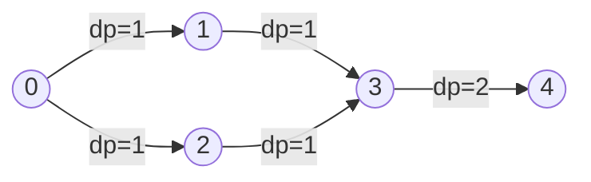

# Quy Hoạch Động Trên DAG

> **Tác giả:** FPTOJ Team<br>
> **Nội dung tham khảo từ:** VNOI Wiki, CP-Algorithms - DP on DAG

---

## 1. Bản chất vấn đề

### Bài toán: Đếm đường đi trên DAG

Cho đồ thị có hướng không chu trình (DAG) $N$ đỉnh, $M$ cạnh. Cần đếm số lượng đường đi khác nhau từ đỉnh xuất phát $S$ đến đỉnh kết thúc $T$.

> **Tại sao DFS thông thường hoặc duyệt thô dễ gặp lỗi?**
> Nếu đồ thị có chu trình, DFS duyệt thô sẽ rơi vào vòng lặp vô hạn. Dù đồ thị không chu trình (DAG) giúp DFS tránh được lặp vô hạn, nhưng số lượng đường đi có thể bùng nổ theo hàm mũ, khiến DFS bị quá thời gian (TLE). 
> Quy hoạch động (DP) giải quyết bài toán này trong thời gian tuyến tính $O(N + M)$ bằng cách tính toán và lưu lại số đường đi đến mỗi đỉnh.

### Ý tưởng cốt lõi

1. **Sắp xếp tô-pô (Topological Sort):** Trực quan hóa đồ thị sao cho mọi cạnh đi từ trái sang phải. Điều này đảm bảo khi ta tính số đường đi tới đỉnh $v$, mọi đỉnh $u$ có đường đi tới $v$ đều đã được tính toán xong.
2. **Duyệt theo thứ tự tô-pô:** Cập nhật số lượng đường đi của đỉnh sau bằng tổng số lượng đường đi của các đỉnh trước đó hướng tới nó.

---

## 2. Tư duy cốt lõi & Minh họa trực quan

### Công thức quy hoạch động

*   **Trạng thái:** Gọi $dp[v]$ là số lượng đường đi khác nhau từ đỉnh xuất phát $S$ tới đỉnh $v$.
*   **Hệ thức truy hồi:**
    $$dp[v] = \sum_{(u, v) \in E} dp[u]$$
    *(Tổng tất cả $dp[u]$ với $u$ là các đỉnh có cạnh nối trực tiếp đi vào $v$).*
*   **Khởi tạo:** $dp[S] = 1$ (có đúng 1 cách đứng tại chỗ từ $S$), tất cả các $dp[v]$ khác khởi tạo bằng $0$.
*   **Kết quả:** $dp[T]$ (số đường đi đến đích $T$).

### Minh họa đồ thị và Trace chi tiết

Xét đồ thị có 5 đỉnh với các cạnh: $0 \to 1$, $0 \to 2$, $1 \to 3$, $2 \to 3$, $3 \to 4$. Ta muốn đếm số đường đi từ $S = 0$ đến $T = 4$.

**Đồ thị DAG và dòng truyền giá trị DP:**


Thứ tự tô-pô hợp lệ: $0, 1, 2, 3, 4$

**Bảng mô phỏng từng bước (Trace table):**

| Đỉnh hiện tại $v$ | Các đỉnh kề trước $u$ | Công thức tính | Kết quả $dp[v]$ | Giải thích ý nghĩa |
| :---: | :--- | :--- | :---: | :--- |
| **0** | — | Khởi tạo cơ sở | **1** | Bắt đầu từ nguồn $0$ |
| **1** | $0$ | $dp[1] = dp[0]$ | **1** | Đường đi: $\{0 \to 1\}$ |
| **2** | $0$ | $dp[2] = dp[0]$ | **1** | Đường đi: $\{0 \to 2\}$ |
| **3** | $1$, $2$ | $dp[3] = dp[1] + dp[2]$ | **2** | Đường đi: $\{0 \to 1 \to 3\}$ và $\{0 \to 2 \to 3\}$ |
| **4** | $3$ | $dp[4] = dp[3]$ | **2** | Đường đi: $\{0 \to 1 \to 3 \to 4\}$ và $\{0 \to 2 \to 3 \to 4\}$ |

---

## 3. Ứng dụng nâng cao: Tìm đường đi dài nhất trên DAG (Longest Path)

Bên cạnh bài toán đếm đường đi, một ứng dụng rất phổ biến của quy hoạch động trên DAG là **tìm đường đi dài nhất** (hoặc ngắn nhất) trên đồ thị có trọng số cạnh.

### Ý nghĩa thực tế
Bài toán này dùng để lập lịch dự án (Phương pháp Đường găng - Critical Path Method), xác định công việc nào tốn thời gian nhất và bắt buộc phải hoàn thành tuần tự để không làm trễ toàn bộ hệ thống.

### Công thức quy hoạch động
*   **Trạng thái:** Gọi $dp[v]$ là độ dài đường đi dài nhất từ đỉnh nguồn $S$ tới đỉnh $v$.
*   **Hệ thức truy hồi:**
    $$dp[v] = \max_{(u, v) \in E} \left( dp[u] + \text{weight}(u, v) \right)$$
*   **Khởi tạo:** $dp[S] = 0$, tất cả các đỉnh khác khởi tạo bằng $-\infty$ (chưa thể đến được).
*   **Kết quả:** $\max_{v} dp[v]$ hoặc $dp[T]$ tùy theo yêu cầu đề bài.

---

## 3. Phân tích tính đúng đắn

### Tại sao DP trên topo sort đúng?

**Bất biến:** Khi xử lý đỉnh $u$ theo thứ tự tô-pô, tất cả đỉnh có cạnh đến $u$ đã được xử lý trước đó. Do đó $dp[u]$ đã chứa tổng số đường đi từ $S$ đến $u$.

**Chứng minh bằng quy nạp:**

- **Cơ sở:** $dp[S] = 1$ — đúng vì chỉ có 1 đường đi "không đi đâu" từ $S$ đến $S$.
- **Bước quy nạp:** Giả sử $dp[u]$ đúng với mọi $u$ đã xử lý. Khi xử lý đỉnh $v$, mọi đường đi từ $S$ đến $v$ phải đi qua đúng 1 đỉnh $u$ là "đỉnh cuối trước $v$" (vì DAG, không có chu trình). Do đó:

$$dp[v] = \sum_{(u,v) \in E} dp[u]$$

đếm đúng tất cả đường đi.

### Tại sao phải là DAG?

Nếu có chu trình, thứ tự tô-pô không tồn tại → không xác định được đỉnh nào xử lý trước. Đường đi trên đồ thị có chu trình có thể vô hạn → bài toán "đếm đường đi" không xác định.

---

## 4. Đánh giá độ phức tạp

| Thao tác | Thời gian | Không gian |
|----------|-----------|------------|
| Sắp xếp tô-pô | $O(N + M)$ | $O(N + M)$ |
| DP | $O(N + M)$ | $O(N)$ |

---

## Code minh họa

=== "C++"

    ```cpp
    #include <bits/stdc++.h>
    using namespace std;

    int main() {
        ios_base::sync_with_stdio(false);
        cin.tie(NULL);

        int n, m;
        cin >> n >> m;

        vector<vector<int>> adj(n);
        vector<int> in_deg(n, 0);

        for (int i = 0; i < m; i++) {
            int u, v;
            cin >> u >> v;
            adj[u].push_back(v);
            in_deg[v]++;
        }

        int s, t;
        cin >> s >> t;

        // Sắp xếp tô-pô (Kahn)
        queue<int> q;
        for (int i = 0; i < n; i++)
            if (in_deg[i] == 0) q.push(i);

        vector<int> topo;
        while (!q.empty()) {
            int u = q.front(); q.pop();
            topo.push_back(u);
            for (int v : adj[u]) {
                if (--in_deg[v] == 0) q.push(v);
            }
        }

        // DP
        vector<long long> dp(n, 0);
        dp[s] = 1;

        for (int u : topo) {
            for (int v : adj[u]) {
                dp[v] += dp[u];
            }
        }

        cout << dp[t] << "\n";
        return 0;
    }
    ```

=== "Python"

    ```python
    from collections import deque
    import sys
    input = sys.stdin.readline

    n, m = map(int, input().split())
    adj = [[] for _ in range(n)]
    in_deg = [0] * n

    for _ in range(m):
        u, v = map(int, input().split())
        adj[u].append(v)
        in_deg[v] += 1

    s, t = map(int, input().split())

    q = deque(i for i in range(n) if in_deg[i] == 0)
    topo = []
    while q:
        u = q.popleft()
        topo.append(u)
        for v in adj[u]:
            in_deg[v] -= 1
            if in_deg[v] == 0:
                q.append(v)

    dp = [0] * n
    dp[s] = 1

    for u in topo:
        for v in adj[u]:
            dp[v] += dp[u]

    print(dp[t])
    ```
