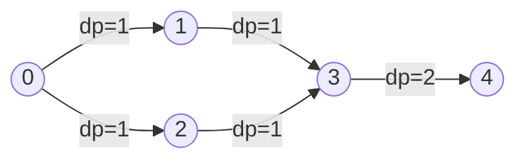
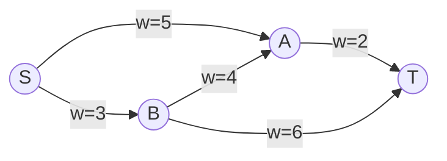

# Quy Hoạch Động Trên DAG

> **Tác giả:** FPTOJ Team<br>
> **Nội dung tham khảo từ:** VNOI Wiki, CP-Algorithms - DP on DAG

---

## 1. Bản chất vấn đề

### Bài toán: Đếm đường đi trên DAG

Cho đồ thị có hướng không chu trình (DAG) $N$ đỉnh, $M$ cạnh. Cần đếm số lượng đường đi khác nhau từ đỉnh xuất phát $S$ đến đỉnh kết thúc $T$.

> **Tại sao DFS thông thường hoặc duyệt thô dễ gặp lỗi?**
> Nếu đồ thị có chu trình, DFS duyệt thô sẽ rơi vào vòng lặp vô hạn. Dù đồ thị không chu trình (DAG) giúp DFS tránh được lặp vô hạn, nhưng số lượng đường đi có thể bùng nổ theo hàm mũ, khiến DFS bị quá thời gian (TLE). 
> Quy hoạch động (DP) giải quyết bài toán này trong thời gian tuyến tính $O(N + M)$ bằng cách tính toán và lưu lại số đường đi đến mỗi đỉnh.

### Ý tưởng cốt lõi

1. **Sắp xếp tô-pô (Topological Sort):** Trực quan hóa đồ thị sao cho mọi cạnh đi từ trái sang phải. Điều này đảm bảo khi ta tính số đường đi tới đỉnh $v$, mọi đỉnh $u$ có đường đi tới $v$ đều đã được tính toán xong.
2. **Duyệt theo thứ tự tô-pô:** Cập nhật số lượng đường đi của đỉnh sau bằng tổng số lượng đường đi của các đỉnh trước đó hướng tới nó.

---

## 2. Tư duy cốt lõi & Minh họa trực quan

### Công thức quy hoạch động

*   **Trạng thái:** Gọi $dp[v]$ là số lượng đường đi khác nhau từ đỉnh xuất phát $S$ tới đỉnh $v$.
*   **Hệ thức truy hồi:**
    $$dp[v] = \sum_{(u, v) \in E} dp[u]$$
    *(Tổng tất cả $dp[u]$ với $u$ là các đỉnh có cạnh nối trực tiếp đi vào $v$).*
*   **Khởi tạo:** $dp[S] = 1$ (có đúng 1 cách đứng tại chỗ từ $S$), tất cả các $dp[v]$ khác khởi tạo bằng $0$.
*   **Kết quả:** $dp[T]$ (số đường đi đến đích $T$).

### Minh họa đồ thị và Trace chi tiết

Xét đồ thị có 5 đỉnh với các cạnh: $0 \to 1$, $0 \to 2$, $1 \to 3$, $2 \to 3$, $3 \to 4$. Ta muốn đếm số đường đi từ $S = 0$ đến $T = 4$.

**Đồ thị DAG và dòng truyền giá trị DP:**

```mermaid
graph LR
    0((0)) -->|dp=1| 1((1))
    0 -->|dp=1| 2((2))
    1 -->|dp=1| 3((3))
    2 -->|dp=1| 3
    3 -->|dp=2| 4((4))
    

```

Thứ tự tô-pô hợp lệ: $0, 1, 2, 3, 4$

**Bảng mô phỏng từng bước (Trace table):**

| Đỉnh hiện tại $v$ | Các đỉnh kề trước $u$ | Công thức tính | Kết quả $dp[v]$ | Giải thích ý nghĩa |
| :---: | :--- | :--- | :---: | :--- |
| **0** | — | Khởi tạo cơ sở | **1** | Bắt đầu từ nguồn $0$ |
| **1** | $0$ | $dp[1] = dp[0]$ | **1** | Đường đi: $\{0 \to 1\}$ |
| **2** | $0$ | $dp[2] = dp[0]$ | **1** | Đường đi: $\{0 \to 2\}$ |
| **3** | $1$, $2$ | $dp[3] = dp[1] + dp[2]$ | **2** | Đường đi: $\{0 \to 1 \to 3\}$ và $\{0 \to 2 \to 3\}$ |
| **4** | $3$ | $dp[4] = dp[3]$ | **2** | Đường đi: $\{0 \to 1 \to 3 \to 4\}$ và $\{0 \to 2 \to 3 \to 4\}$ |

---

## 3. Ứng dụng nâng cao: Tìm đường đi dài nhất trên DAG (Longest Path)

Bên cạnh bài toán đếm đường đi, một ứng dụng rất phổ biến của quy hoạch động trên DAG là **tìm đường đi dài nhất** (hoặc ngắn nhất) trên đồ thị có trọng số cạnh.

### Ý nghĩa thực tế
Bài toán này dùng để lập lịch dự án (Phương pháp Đường găng - Critical Path Method), xác định công việc nào tốn thời gian nhất và bắt buộc phải hoàn thành tuần tự để không làm trễ toàn bộ hệ thống.

### Công thức quy hoạch động
*   **Trạng thái:** Gọi $dp[v]$ là độ dài đường đi dài nhất từ đỉnh nguồn $S$ tới đỉnh $v$.
*   **Hệ thức truy hồi:**
    $$dp[v] = \max_{(u, v) \in E} \left( dp[u] + \text{weight}(u, v) \right)$$
*   **Khởi tạo:** $dp[S] = 0$, tất cả các đỉnh khác khởi tạo bằng $-\infty$ (chưa thể đến được).
*   **Kết quả:** $\max_{v} dp[v]$ hoặc $dp[T]$ tùy theo yêu cầu đề bài.

### Trace chi tiết: Đường đi dài nhất

Xét đồ thị có 5 đỉnh với trọng số cạnh:


```mermaid
graph LR
    S((S)) -->|"w=5"| A((A))
    S -->|"w=3"| B((B))
    A -->|"w=2"| T((T))
    B -->|"w=4"| A
    B -->|"w=6"| T
    
```

| Đỉnh $v$ | Đỉnh vào $u$ | Cạnh $(u,v)$ | $dp[u] + w$ | $dp[v] = \max$ | Ý nghĩa |
|:---:|:---|:---:|:---:|:---:|:---|
| **S** | — | — | — | **0** | Khởi tạo nguồn |
| **A** | S<br>B | $0 + 5 = 5$<br>$3 + 4 = 7$ | $5 \to 7$ | **7** | Qua B dài hơn qua S |
| **B** | S | $0 + 3 = 3$ | $3$ | **3** | Chỉ có 1 đường |
| **T** | A<br>B | $7 + 2 = 9$<br>$3 + 6 = 9$ | $9 \to 9$ | **9** | 2 đường bằng nhau: S→B→A→T và S→B→T |

**Code minh họa cho đường đi dài nhất:**

=== "C++"
    ```cpp
    // Sử dụng cùng cấu trúc topo sort như trên
    vector<long long> dp(n, LLONG_MIN);    // dp[v] = đường dài nhất từ s đến v
    dp[s] = 0;                             // Bắt đầu từ s, độ dài = 0

    for (int u : topo) {                   // Duyệt đỉnh theo thứ tự tô-pô
        if (dp[u] == LLONG_MIN) continue;  // Bỏ qua đỉnh chưa đến được
        for (auto [v, w] : adj[u]) {       // Mỗi cạnh u -> v trọng số w
            dp[v] = max(dp[v], dp[u] + w); // Cập nhật đường dài nhất
        }
    }
    ```

=== "Python"
    ```python
    dp = [float('-inf')] * n               # dp[v] = đường dài nhất từ s đến v
    dp[s] = 0                              # Bắt đầu từ s, độ dài = 0

    for u in topo:                         # Duyệt đỉnh theo thứ tự tô-pô
        if dp[u] == float('-inf'):
            continue                       # Bỏ qua đỉnh chưa đến được
        for v, w in adj[u]:                # Mỗi cạnh u -> v trọng số w
            dp[v] = max(dp[v], dp[u] + w)  # Cập nhật đường dài nhất
    ```

---

## 4. Phân tích tính đúng đắn

### Tại sao DP trên topo sort đúng?

**Bất biến:** Khi xử lý đỉnh $u$ theo thứ tự tô-pô, tất cả đỉnh có cạnh đến $u$ đã được xử lý trước đó. Do đó $dp[u]$ đã chứa tổng số đường đi từ $S$ đến $u$.

**Chứng minh bằng quy nạp:**

- **Cơ sở:** $dp[S] = 1$ — đúng vì chỉ có 1 đường đi "không đi đâu" từ $S$ đến $S$.
- **Bước quy nạp:** Giả sử $dp[u]$ đúng với mọi $u$ đã xử lý. Khi xử lý đỉnh $v$, mọi đường đi từ $S$ đến $v$ phải đi qua đúng 1 đỉnh $u$ là "đỉnh cuối trước $v$" (vì DAG, không có chu trình). Do đó:

$$dp[v] = \sum_{(u,v) \in E} dp[u]$$

đếm đúng tất cả đường đi.

### Tại sao phải là DAG?

Nếu có chu trình, thứ tự tô-pô không tồn tại → không xác định được đỉnh nào xử lý trước. Đường đi trên đồ thị có chu trình có thể vô hạn → bài toán "đếm đường đi" không xác định.

---

## 5. Đánh giá độ phức tạp

| Thao tác | Thời gian | Không gian |
|----------|-----------|------------|
| Sắp xếp tô-pô | $O(N + M)$ | $O(N + M)$ |
| DP | $O(N + M)$ | $O(N)$ |

---

## Code minh họa

=== "C++"

    ```cpp
    #include <bits/stdc++.h>
    using namespace std;

    int main() {
        ios_base::sync_with_stdio(false);
        cin.tie(NULL);

        int n, m;
        cin >> n >> m;

        // Danh sách kề và mảng bậc vào
        vector<vector<int>> adj(n);
        vector<int> in_deg(n, 0);          // in_deg[v] = số cạnh đi vào đỉnh v

        for (int i = 0; i < m; i++) {
            int u, v;
            cin >> u >> v;
            adj[u].push_back(v);           // Cạnh u -> v
            in_deg[v]++;                   // Tăng bậc vào của v
        }

        int s, t;
        cin >> s >> t;                     // Đỉnh nguồn và đỉnh đích

        // Bước 1: Sắp xếp tô-pô bằng thuật toán Kahn
        queue<int> q;
        for (int i = 0; i < n; i++)
            if (in_deg[i] == 0) q.push(i); // Đưa đỉnh có bậc vào = 0 vào queue

        vector<int> topo;                  // Lưu thứ tự tô-pô
        while (!q.empty()) {
            int u = q.front();
            q.pop();
            topo.push_back(u);             // Thêm u vào thứ tự tô-pô
            for (int v : adj[u]) {         // Duyệt đỉnh kề của u
                if (--in_deg[v] == 0)      // Giảm bậc vào của v, nếu = 0
                    q.push(v);             // thì đưa v vào queue
            }
        }

        // Bước 2: DP trên thứ tự tô-pô
        vector<long long> dp(n, 0);        // dp[v] = số đường đi từ s đến v
        dp[s] = 1;                         // Có 1 cách đứng tại s

        for (int u : topo) {               // Duyệt đỉnh theo thứ tự tô-pô
            for (int v : adj[u]) {         // Mọi cạnh u -> v
                dp[v] += dp[u];            // Cộng dồn số đường đi từ u sang v
            }
        }

        cout << dp[t] << "\n";             // Kết quả: số đường đi s -> t
        return 0;
    }
    ```

=== "Python"

    ```python
    from collections import deque
    import sys
    input = sys.stdin.readline

    n, m = map(int, input().split())
    # Danh sách kề và mảng bậc vào
    adj = [[] for _ in range(n)]
    in_deg = [0] * n                   # in_deg[v] = số cạnh đi vào đỉnh v

    for _ in range(m):
        u, v = map(int, input().split())
        adj[u].append(v)               # Cạnh u -> v
        in_deg[v] += 1                 # Tăng bậc vào của v

    s, t = map(int, input().split())   # Đỉnh nguồn và đỉnh đích

    # Bước 1: Sắp xếp tô-pô bằng thuật toán Kahn
    q = deque(i for i in range(n) if in_deg[i] == 0) # Đỉnh bậc vào = 0
    topo = []                          # Lưu thứ tự tô-pô
    while q:
        u = q.popleft()
        topo.append(u)                 # Thêm u vào thứ tự tô-pô
        for v in adj[u]:               # Duyệt đỉnh kề của u
            in_deg[v] -= 1             # Giảm bậc vào của v
            if in_deg[v] == 0:         # Nếu bậc vào = 0
                q.append(v)            # Đưa v vào queue

    # Bước 2: DP trên thứ tự tô-pô
    dp = [0] * n                       # dp[v] = số đường đi từ s đến v
    dp[s] = 1                          # Có 1 cách đứng tại s

    for u in topo:                     # Duyệt đỉnh theo thứ tự tô-pô
        for v in adj[u]:               # Mọi cạnh u -> v
            dp[v] += dp[u]             # Cộng dồn số đường đi từ u sang v

    print(dp[t])                       # Kết quả: số đường đi s -> t
    ```

---

## 6. Cạm bẫy & Mở rộng

### Bẫy 1: Đỉnh nguồn không nằm ở đầu thứ tự tô-pô

Trong code trên, $dp[s] = 1$ được gán trước khi duyệt topo. Dù $s$ có vị trí nào trong mảng `topo`, các cạnh từ $s$ vẫn được xử lý khi đến lượt $s$ — không phụ thuộc vào vị trí của $s$ trong `topo`.

### Bẫy 2: Tràn số với $dp$

Kết quả $dp[v]$ có thể rất lớn (đường đi có thể bùng nổ hàm mũ). Dùng `long long` trong C++ hoặc cài modulo nếu đề yêu cầu.

```cpp
dp[v] = (dp[v] + dp[u]) % MOD;  // Nếu đề yêu cầu modulo 10^9+7
```

### Bẫy 3: Đồ thị không liên thông

Nếu tồn tại thành phần liên thông không chứa $S$ hoặc $T$, topo sort vẫn chạy bình thường, nhưng $dp[v] = 0$ với các đỉnh không đến được từ $S$.

### Mở rộng: Đếm đường đi có modulo lớn

Nếu $M$ quá lớn không thể khai báo mảng (VD: $N, M \le 10^5$, modulo $10^9+7$), vẫn dùng DP trên DAG bình thường với modulo.

### Mở rộng: DP trên DAG với trọng số cạnh nhỏ nhất

Thay vì tổng/cực đại, ta có thể tính:
- **Đường đi có ít cạnh nhất:** $dp[v] = \min(dp[v], dp[u] + 1)$
- **Đường đi có tích trọng số:** $dp[v] = dp[v] + dp[u] \times w(u,v)$

Miễn là DAG, công thức DP luôn hoạt động.

---

## Bài tập luyện tập trên FPTOJ

| # | Bài | Điểm | Độ khó |
|:-:|------|:----:|:------:|
| 1 | [dpg-01 - Đếm Đường Đi Trên Bản Đồ Một Chiều](https://fptoj.com/problem/dpg-01) | 15 | ⭐⭐ |
| 2 | [dpg-02 - Tuyến Giao Hàng Rẻ Nhất](https://fptoj.com/problem/dpg-02) | 15 | ⭐⭐ |
| 3 | [dpg-03 - Chuyến Phượt Qua Nhiều Điểm Dừng Nhất](https://fptoj.com/problem/dpg-03) | 20 | ⭐⭐ |
| 4 | [dpg-04 - Thời Gian Sớm Nhất Hoàn Thành Công Đoạn](https://fptoj.com/problem/dpg-04) | 20 | ⭐⭐⭐ |
| 5 | [dpg-05 - Xếp Lịch Học Các Môn Có Tiên Quyết](https://fptoj.com/problem/dpg-05) | 25 | ⭐⭐⭐ |
| 6 | [dpg-06 - Hoạt Động Lợi Nhuận Lớn Nhất](https://fptoj.com/problem/dpg-06) | 25 | ⭐⭐⭐ |
| 7 | [dpg-07 - Đi Đúng $K$ Bước Qua Bản Đồ](https://fptoj.com/problem/dpg-07) | 30 | ⭐⭐⭐⭐ |
| 8 | [dpg-08 - Số Tuyến Đường Giữa Hai Thành Phố](https://fptoj.com/problem/dpg-08) | 30 | ⭐⭐⭐⭐ |

## Bài viết liên quan

- [Quy hoạch động cơ bản](quy-hoach-dong.md)
- [Quy hoạch động Bitmask](bitmask-dp.md)
- [Quy hoạch động trên cây](dp-on-trees.md)
