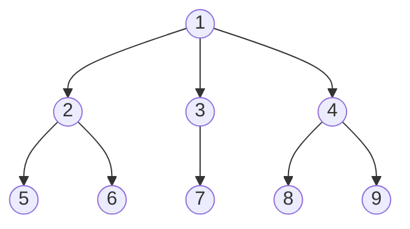
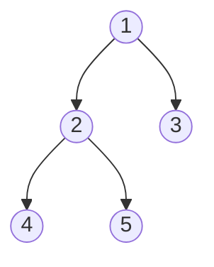
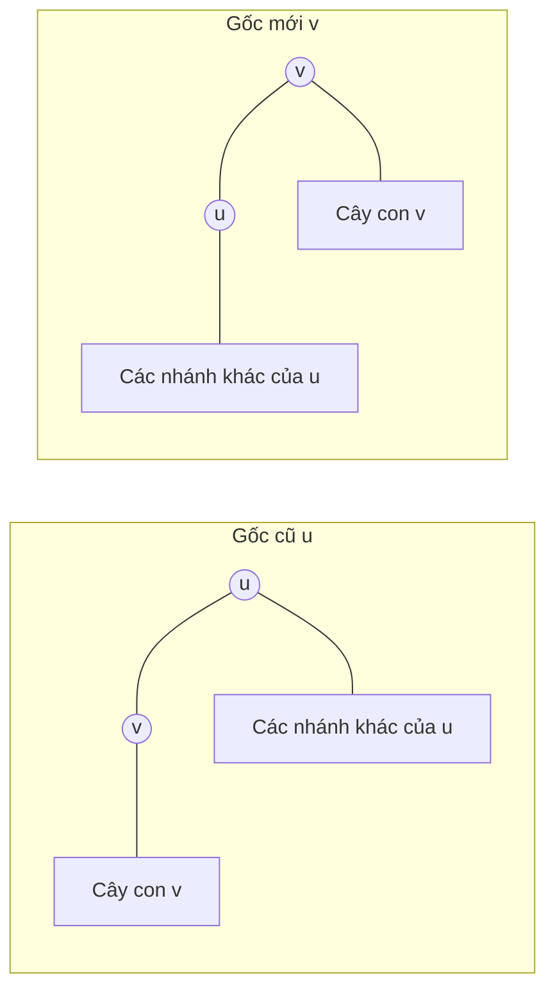
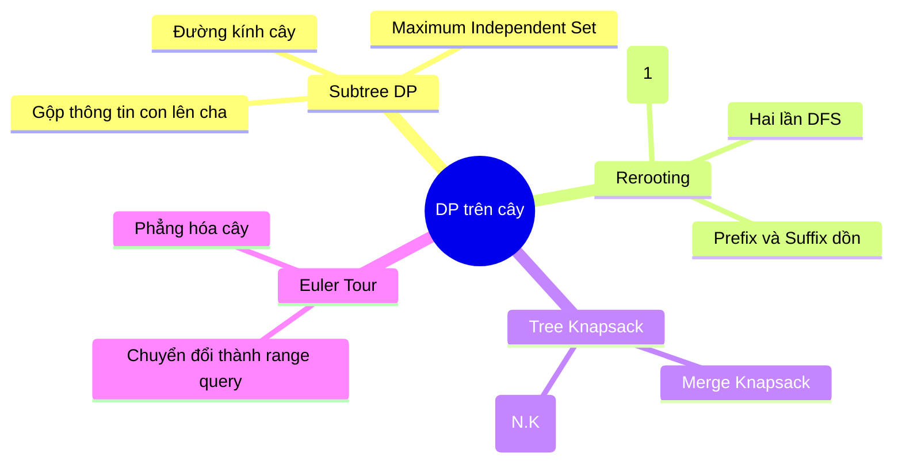

# Bài 47: DP trên cây - Quy hoạch động trên cây

> **Tác giả:** FPTOJ Team<br>
> **Nội dung tham khảo từ:** CP-Algorithms, USACO Guide

---

## Bạn sẽ học được gì?
- **Subtree DP:** Kỹ thuật quy hoạch động gộp thông tin từ các cây con lên cha.
- **Rerooting DP:** Kỹ thuật đổi gốc để tính toán kết quả cho mọi đỉnh làm gốc trong thời gian tối ưu.
- **Tree Knapsack:** Quy hoạch động cái túi trên cây và cách tối ưu độ phức tạp từ $O(N \cdot K^2)$ về $O(N \cdot K)$.
- Các bài toán ứng dụng thực tế và cách phòng tránh các cạm bẫy thường gặp.

---

## 1. Giới thiệu

Nhiều bài toán trên cấu trúc cây có thể được giải quyết hiệu quả bằng quy hoạch động (Dynamic Programming - DP). Ý tưởng cốt lõi của quy hoạch động trên cây là tận dụng tính chất đệ quy tự nhiên của cây: **Mỗi đỉnh bất kỳ trên cây đều có thể đóng vai trò là gốc của một cây con (subtree)**. Do đó, ta có thể giải quyết bài toán trên các cây con nhỏ trước, rồi gộp kết quả từ các con để tìm ra đáp án cho cây con lớn hơn.

### Hướng tiếp cận cơ bản

Ta thường thực hiện một chuyến duyệt theo chiều sâu (DFS) từ gốc của cây. Khi DFS đi xuống các lá, ta tính trước kết quả tại các lá (trường hợp cơ sở), sau đó khi quá trình đệ quy quay lui (backtrack), ta gộp thông tin của các đỉnh con lên đỉnh cha.

Thuật toán tổng quát có dạng giả mã như sau:

```
Hàm DFS(u, parent):
    Khởi tạo dp[u] với trường hợp cơ sở
    Với mỗi đỉnh v kề với u:
        Nếu v khác parent:
            DFS(v, u)
            Gộp thông tin từ dp[v] vào dp[u]
```

### Minh họa thứ tự duyệt cây

Xét cây dưới đây với gốc là đỉnh $1$:



**Thứ tự DFS duyệt và hoàn thành các đỉnh:**
Thông tin được gộp từ các lá (màu cam) lên các đỉnh trung gian (màu xanh dương) rồi về gốc (màu xanh lá):
- Cây con gốc $2$: nhận thông tin từ các lá $5$ và $6$.
- Cây con gốc $3$: nhận thông tin từ lá $7$.
- Cây con gốc $4$: nhận thông tin từ các lá $8$ và $9$.
- Cuối cùng, gốc $1$ gộp thông tin từ các đỉnh con trực tiếp là $2, 3, 4$.

---

## 2. Subtree DP (Quy hoạch động trên cây con)

### Mô hình bài toán tổng quát

Cho cây $T$ gồm $N$ đỉnh. Với mỗi đỉnh $u$, ta cần tính một đại lượng $dp[u]$ đại diện cho trạng thái tối ưu của cây con gốc $u$ (ký hiệu là $T_u$).

Công thức chuyển trạng thái tổng quát có dạng:
$$dp[u] = \bigoplus_{v \in \text{children}(u)} dp[v]$$
Trong đó $\bigoplus$ là toán tử gộp thông tin (ví dụ: tổng, giá trị lớn nhất, giá trị nhỏ nhất, hoặc một hàm kết hợp phức tạp hơn).

---

### Ví dụ 1: Tập độc lập lớn nhất trên cây (Maximum Independent Set)

**Bài toán:** Cho một cây $T$ gồm $N$ đỉnh. Ta cần chọn ra một tập các đỉnh có kích thước lớn nhất sao cho không có hai đỉnh nào trong tập đã chọn kề nhau (có cạnh nối trực tiếp).

#### Phân tích và Thiết kế Trạng thái DP
Với mỗi đỉnh $u$, quyết định chọn hay không chọn $u$ sẽ ảnh hưởng trực tiếp đến việc chọn các đỉnh con của nó. Do đó, ta định nghĩa hai trạng thái quy hoạch động tại đỉnh $u$:
- $dp[u][0]$: Số lượng đỉnh lớn nhất chọn được trong cây con gốc $u$ sao cho **không chọn** đỉnh $u$.
- $dp[u][1]$: Số lượng đỉnh lớn nhất chọn được trong cây con gốc $u$ sao cho **có chọn** đỉnh $u$.

#### Công thức chuyển trạng thái
- **Trường hợp không chọn $u$ ($dp[u][0]$):** Vì đỉnh $u$ không được chọn, ta không gặp ràng buộc kề cạnh với các đỉnh con $v$ của nó. Do đó, với mỗi đỉnh con $v$, ta có thể chọn hoặc không chọn $v$. Ta lấy giá trị lớn nhất của hai lựa chọn này:
  $$dp[u][0] = \sum_{v \in \text{children}(u)} \max(dp[v][0], dp[v][1])$$
- **Trường hợp có chọn $u$ ($dp[u][1]$):** Vì đỉnh $u$ được chọn, tất cả các đỉnh con trực tiếp $v$ của $u$ **bắt buộc không được chọn** để đảm bảo tính độc lập. Do đó, ta phải lấy giá trị $dp[v][0]$ của tất cả các con $v$, đồng thời cộng thêm $1$ (đại diện cho việc chọn đỉnh $u$):
  $$dp[u][1] = 1 + \sum_{v \in \text{children}(u)} dp[v][0]$$

#### Chứng minh tính đúng đắn
- **Trường hợp cơ sở (Đỉnh lá $u$):** Đỉnh lá không có con. Theo công thức:
  - $dp[u][0] = 0$ (hợp lý vì không chọn đỉnh nào).
  - $dp[u][1] = 1$ (hợp lý vì chỉ chọn duy nhất đỉnh $u$).
- **Bước quy nạp:** Giả sử công thức đúng với mọi cây con gốc $v$ (con của $u$). Mọi tập độc lập trên cây con $T_u$ có thể được phân loại thành hai nhóm: nhóm chứa $u$ và nhóm không chứa $u$. 
  - Nếu không chứa $u$, ta có thể tự do tối ưu độc lập trên từng cây con $T_v$, dẫn đến tổng của các giá trị tối ưu $\max(dp[v][0], dp[v][1])$.
  - Nếu chứa $u$, ta không được chứa bất kỳ đỉnh con $v$ nào của $u$, do đó ta bắt buộc phải lấy các tập độc lập tối ưu trên $T_v$ mà không chứa $v$, tức là lấy $dp[v][0]$.
  Công thức bao phủ toàn bộ không gian trạng thái một cách tối ưu.

#### Bảng minh họa trạng thái trên cây ví dụ
Xét cây có cấu trúc: $1 \to 2, 1 \to 3$ và $2 \to 4, 2 \to 5$.



| Đỉnh $u$ | $dp[u][0]$ (Không chọn) | $dp[u][1]$ (Chọn) | Giải thích chi tiết |
| :--- | :--- | :--- | :--- |
| **$4$ (lá)** | $0$ | $1$ | Lá: $dp[4][0]=0$, $dp[4][1]=1$ |
| **$5$ (lá)** | $0$ | $1$ | Lá: $dp[5][0]=0$, $dp[5][1]=1$ |
| **$2$** | $\max(0,1) + \max(0,1) = 2$ | $1 + 0 + 0 = 1$ | $dp[2][0] = dp[4][1] + dp[5][1] = 2$; $dp[2][1] = 1 + dp[4][0] + dp[5][0] = 1$ |
| **$3$ (lá)** | $0$ | $1$ | Lá: $dp[3][0]=0$, $dp[3][1]=1$ |
| **$1$** | $\max(2,1) + \max(0,1) = 3$ | $1 + 2 + 0 = 3$ | $dp[1][0] = \max(dp[2]) + \max(dp[3]) = 2+1=3$; $dp[1][1] = 1 + dp[2][0] + dp[3][0] = 1+2+0=3$ |

**Kết quả:** Tập độc lập lớn nhất có kích thước là $\max(dp[1][0], dp[1][1]) = 3$. Một cấu hình tối ưu là chọn các đỉnh $\{1, 4, 5\}$ hoặc $\{2, 3\}$.

```matplotlib
nodes = ['4 (lá)', '5 (lá)', '2', '3 (lá)', '1']
dp0 = [0, 0, 2, 0, 3]
dp1 = [1, 1, 1, 1, 3]

x = np.arange(len(nodes))
width = 0.35

fig, ax = plt.subplots(figsize=(8, 5))
bars1 = ax.bar(x - width/2, dp0, width, label='dp[u][0] (Không chọn u)', color='#3498db')
bars2 = ax.bar(x + width/2, dp1, width, label='dp[u][1] (Chọn u)', color='#e74c3c')

ax.set_xlabel('Đỉnh')
ax.set_ylabel('Giá trị DP')
ax.set_title('Tập độc lập lớn nhất trên cây — Trạng thái DP tại mỗi đỉnh')
ax.set_xticks(x)
ax.set_xticklabels(nodes)
ax.legend(fontsize=10)
ax.grid(True, alpha=0.3, axis='y')

for bar in bars1:
    ax.text(bar.get_x() + bar.get_width()/2, bar.get_height() + 0.05,
            str(int(bar.get_height())), ha='center', va='bottom', fontsize=9)
for bar in bars2:
    ax.text(bar.get_x() + bar.get_width()/2, bar.get_height() + 0.05,
            str(int(bar.get_height())), ha='center', va='bottom', fontsize=9)

plt.tight_layout()
```

=== "C++"

    ```cpp
    #include <bits/stdc++.h>
    using namespace std;

    const int MAXN = 100005;
    vector<int> adj[MAXN];
    long long dp[MAXN][2]; 

    // u: đỉnh hiện tại, parent: đỉnh cha của u để tránh duyệt ngược lại
    void dfs(int u, int parent) {
        dp[u][0] = 0;
        dp[u][1] = 1; 

        for (int v : adj[u]) {
            if (v == parent) continue;
            dfs(v, u);
            dp[u][0] += max(dp[v][0], dp[v][1]);
            dp[u][1] += dp[v][0];
        }
    }

    int main() {
        ios_base::sync_with_stdio(false);
        cin.tie(nullptr);

        int n;
        if (!(cin >> n)) return 0;

        for (int i = 0; i < n - 1; i++) {
            int u, v;
            cin >> u >> v;
            adj[u].push_back(v);
            adj[v].push_back(u);
        }

        // Bắt đầu duyệt từ gốc là đỉnh 1
        dfs(1, 0);
        cout << max(dp[1][0], dp[1][1]) << "\n";

        return 0;
    }
    ```

=== "Python"

    ```python
    import sys

    # Tăng giới hạn đệ quy để tránh Stack Overflow trên cây sâu
    sys.setrecursionlimit(300000)

    def dfs(u, parent):
        dp[u][0] = 0      # Không chọn u
        dp[u][1] = 1      # Chọn u

        for v in adj[u]:
            if v == parent:
                continue
            dfs(v, u)
            dp[u][0] += max(dp[v][0], dp[v][1])
            dp[u][1] += dp[v][0]

    def main():
        input = sys.stdin.read
        data = input().split()
        if not data:
            return
        
        n = int(data[0])
        global adj, dp
        adj = [[] for _ in range(n + 1)]
        
        idx = 1
        for _ in range(n - 1):
            u = int(data[idx])
            v = int(data[idx+1])
            adj[u].append(v)
            adj[v].append(u)
            idx += 2
            
        dp = [[0, 0] for _ in range(n + 1)]
        dfs(1, 0)
        print(max(dp[1][0], dp[1][1]))

    if __name__ == '__main__':
        main()
    ```

**Độ phức tạp:**
- **Thời gian:** $O(N)$ vì mỗi đỉnh và mỗi cạnh được duyệt qua đúng một lần trong DFS.
- **Không gian:** $O(N)$ để lưu trữ danh sách kề và mảng quy hoạch động $dp$.

---

## 3. Đường kính cây (Tree Diameter)

**Bài toán:** Cho một cây $T$ không trọng số gồm $N$ đỉnh. Đường kính của cây là khoảng cách lớn nhất giữa hai đỉnh bất kỳ trên cây (được tính bằng số cạnh trên đường đi ngắn nhất giữa chúng).

### Phân tích quy hoạch động
Xét một đỉnh $u$ bất kỳ làm gốc tạm thời của cây con $T_u$. Đường đi dài nhất nằm hoàn toàn trong $T_u$ sẽ rơi vào một trong hai trường hợp:
1. Đường đi dài nhất đi qua đỉnh $u$. Đường đi này sẽ nối từ một lá trong cây con của con thứ nhất của $u$, qua đỉnh $u$, tới một lá trong cây con của con thứ hai của $u$.
2. Đường đi dài nhất không đi qua $u$ mà nằm trọn vẹn trong một cây con $T_v$ của một đỉnh con $v$ nào đó của $u$.

Ta định nghĩa:
- $dp[u]$: Độ dài đường đi dài nhất bắt đầu từ $u$ và đi xuống các lá thuộc cây con $T_u$.

### Công thức quy hoạch động
- Với đỉnh lá $u$, ta có $dp[u] = 0$.
- Với đỉnh nội bộ $u$:
  $$dp[u] = 1 + \max_{v \in \text{children}(u)} dp[v]$$
- Để tìm đường kính đi qua $u$, ta lấy tổng của hai giá trị $dp[v] + 1$ lớn nhất từ các đỉnh con của $u$. Gọi hai giá trị lớn nhất này là $best_1$ và $best_2$ (nếu $u$ chỉ có một con, ta coi $best_2 = 0$). Đường kính cục bộ đi qua $u$ là:
  $$\text{local\_diameter}(u) = best_1 + best_2$$
- Đường kính của toàn bộ cây sẽ là giá trị lớn nhất của đường kính cục bộ qua mọi đỉnh $u$:
  $$\text{Diameter} = \max_{u \in V} \text{local\_diameter}(u)$$

### Chứng minh tính đúng đắn
Bất kỳ đường đi đơn nào trên cây cũng đều có một đỉnh có độ sâu nhỏ nhất trên đường đi đó, gọi là đỉnh tổ tiên chung thấp nhất (LCA) của hai đầu mút đường đi. 
- Giả sử đường đi dài nhất trên cây có LCA là $u$. Khi đó, hai nhánh của đường đi này đi xuống hai cây con khác nhau của $u$ (hoặc một nhánh bắt đầu từ $u$ nếu $u$ là một đầu mút).
- Độ dài của hai nhánh này lần lượt là độ dài đường đi dài nhất đi xuống từ $u$ qua hai con khác nhau, chính là hai giá trị $dp[v] + 1$ lớn nhất. Do đó, việc duyệt qua mọi đỉnh $u$ và tính $best_1 + best_2$ đảm bảo ta không bỏ sót bất kỳ đường đi ứng viên nào.

=== "C++"

    ```cpp
    #include <bits/stdc++.h>
    using namespace std;

    const int MAXN = 200005;
    vector<int> adj[MAXN];
    int dp[MAXN]; 
    int diameter = 0;

    void dfs(int u, int parent) {
        dp[u] = 0;
        int best1 = 0; // Nhánh dài thứ nhất
        int best2 = 0; // Nhánh dài thứ hai

        for (int v : adj[u]) {
            if (v == parent) continue;
            dfs(v, u);
            int len = dp[v] + 1;

            if (len >= best1) {
                best2 = best1;
                best1 = len;
            } else if (len > best2) {
                best2 = len;
            }
            dp[u] = max(dp[u], len);
        }
        diameter = max(diameter, best1 + best2);
    }

    int main() {
        ios_base::sync_with_stdio(false);
        cin.tie(nullptr);

        int n;
        if (!(cin >> n)) return 0;

        for (int i = 0; i < n - 1; i++) {
            int u, v;
            cin >> u >> v;
            adj[u].push_back(v);
            adj[v].push_back(u);
        }

        dfs(1, 0);
        cout << diameter << "\n";

        return 0;
    }
    ```

=== "Python"

    ```python
    import sys

    sys.setrecursionlimit(300000)

    def dfs(u, parent):
        global diameter
        dp[u] = 0
        best1 = 0
        best2 = 0

        for v in adj[u]:
            if v == parent:
                continue
            dfs(v, u)
            length = dp[v] + 1

            if length >= best1:
                best2 = best1
                best1 = length
            elif length > best2:
                best2 = length

            dp[u] = max(dp[u], length)

        diameter = max(diameter, best1 + best2)

    def main():
        input = sys.stdin.read
        data = input().split()
        if not data:
            return

        n = int(data[0])
        global adj, dp, diameter
        adj = [[] for _ in range(n + 1)]
        dp = [0] * (n + 1)
        diameter = 0

        idx = 1
        for _ in range(n - 1):
            u = int(data[idx])
            v = int(data[idx+1])
            adj[u].append(v)
            adj[v].append(u)
            idx += 2

        dfs(1, 0)
        print(diameter)

    if __name__ == '__main__':
        main()
    ```

**Độ phức tạp:**
- **Thời gian:** $O(N)$
- **Không gian:** $O(N)$

---

## 4. Ví dụ 3: Đếm số cặp đỉnh có đường đi đi qua cây con

**Bài toán:** Cho một cây $T$ gồm $N$ đỉnh. Với mỗi đỉnh $u$, ta cần đếm số lượng cặp đỉnh vô hướng $(x, y)$ (với $x < y$) sao cho đường đi đơn duy nhất giữa $x$ và $y$ nằm hoàn toàn trong cây con gốc $u$.

### Phân tích toán học
Một đường đi giữa $x$ và $y$ nằm hoàn toàn trong cây con gốc $u$ khi và chỉ khi cả $x$ và $y$ đều thuộc cây con gốc $u$.
Do đó, số lượng cặp đỉnh thỏa mãn chính là số cách chọn ra $2$ đỉnh phân biệt từ tập hợp các đỉnh thuộc cây con gốc $u$.
Gọi $sz[u]$ là kích thước (số lượng đỉnh) của cây con gốc $u$. Số cách chọn $2$ đỉnh bất kỳ từ cây con gốc $u$ là:
$$\text{Pairs}(u) = \binom{sz[u]}{2} = \frac{sz[u] \cdot (sz[u] - 1)}{2}$$

Ta định nghĩa quy hoạch động:
- $sz[u]$: Số lượng đỉnh trong cây con gốc $u$.
- $dp[u]$: Số lượng cặp đỉnh có đường đi nằm hoàn toàn trong cây con gốc $u$.

### Công thức quy hoạch động
- Với đỉnh lá $u$:
  $$sz[u] = 1, \quad dp[u] = 0$$
- Với đỉnh $u$ bất kỳ:
  $$sz[u] = 1 + \sum_{v \in \text{children}(u)} sz[v]$$
  $$dp[u] = \frac{sz[u] \cdot (sz[u] - 1)}{2}$$

Công thức trên tính toán trực tiếp kết quả cho mỗi đỉnh trong $O(1)$ sau khi đã biết kích thước cây con của các con.

=== "C++"

    ```cpp
    #include <bits/stdc++.h>
    using namespace std;

    const int MAXN = 200005;
    vector<int> adj[MAXN];
    long long sz[MAXN]; 
    long long dp[MAXN]; 

    void dfs(int u, int parent) {
        sz[u] = 1;
        for (int v : adj[u]) {
            if (v == parent) continue;
            dfs(v, u);
            sz[u] += sz[v];
        }
        dp[u] = sz[u] * (sz[u] - 1) / 2;
    }

    int main() {
        ios_base::sync_with_stdio(false);
        cin.tie(nullptr);

        int n;
        if (!(cin >> n)) return 0;

        for (int i = 0; i < n - 1; i++) {
            int u, v;
            cin >> u >> v;
            adj[u].push_back(v);
            adj[v].push_back(u);
        }

        dfs(1, 0);
        cout << dp[1] << "\n";

        return 0;
    }
    ```

=== "Python"

    ```python
    import sys

    sys.setrecursionlimit(300000)

    def dfs(u, parent):
        sz[u] = 1
        for v in adj[u]:
            if v == parent:
                continue
            dfs(v, u)
            sz[u] += sz[v]
        dp[u] = sz[u] * (sz[u] - 1) // 2

    def main():
        input = sys.stdin.read
        data = input().split()
        if not data:
            return

        n = int(data[0])
        global adj, sz, dp
        adj = [[] for _ in range(n + 1)]
        sz = [0] * (n + 1)
        dp = [0] * (n + 1)

        idx = 1
        for _ in range(n - 1):
            u = int(data[idx])
            v = int(data[idx+1])
            adj[u].append(v)
            adj[v].append(u)
            idx += 2

        dfs(1, 0)
        print(dp[1])

    if __name__ == '__main__':
        main()
    ```

---

## 5. Rerooting DP (Quy hoạch động đổi gốc)

### Bản chất của kỹ thuật Đổi gốc
Thông thường, khi chạy DFS với gốc cố định (ví dụ đỉnh $1$), ta chỉ thu được kết quả quy hoạch động tương ứng với góc nhìn từ gốc đó. Tuy nhiên, nếu đề bài yêu cầu tìm câu trả lời khi **mỗi đỉnh lần lượt làm gốc** của toàn cây, việc chạy lại DFS từ mỗi đỉnh sẽ tốn $O(N^2)$ thời gian, không khả thi với $N \ge 10^5$.

Kỹ thuật **Rerooting DP** cho phép chuyển đổi gốc của cây từ đỉnh $u$ sang đỉnh con kề cận $v$ trong $O(1)$. Nhờ đó, bằng một lần DFS thứ hai đi từ trên xuống dưới (Top-down DFS), ta có thể cập nhật kết quả cho mọi đỉnh làm gốc trong tổng thời gian $O(N)$.

---

### Ví dụ: Tổng khoảng cách từ mọi đỉnh

**Bài toán:** Cho một cây $T$ gồm $N$ đỉnh. Với mỗi đỉnh $u$, ta cần tính:
$$dist\_sum[u] = \sum_{x \in V} \text{dist}(u, x)$$
Trong đó $\text{dist}(u, x)$ là số cạnh trên đường đi ngắn nhất giữa $u$ và $x$.

#### Giai đoạn 1: Duyệt Bottom-up ( DFS lần 1 )
Ta cố định gốc là đỉnh $1$. Tính kích thước cây con $sz[u]$ và tổng khoảng cách từ $u$ tới các đỉnh trong cây con của nó, gọi là $dp\_down[u]$:
$$sz[u] = 1 + \sum_{v \in \text{children}(u)} sz[v]$$
$$dp\_down[u] = \sum_{v \in \text{children}(u)} (dp\_down[v] + sz[v])$$

*Chứng minh công thức $dp\_down$:* Khi đi từ $u$ qua đỉnh con $v$, khoảng cách tới mọi đỉnh trong cây con $T_v$ đều tăng thêm $1$ cạnh. Do đó, tổng khoảng cách tăng thêm một lượng đúng bằng số đỉnh trong $T_v$, tức là $sz[v]$.

#### Giai đoạn 2: Đổi gốc Top-down ( DFS lần 2 )
Giả sử ta đã biết tổng khoảng cách khi đỉnh $u$ làm gốc là $dist\_sum[u]$. Bây giờ ta di chuyển gốc từ $u$ sang đỉnh con $v$.



**Phân tích sự thay đổi khoảng cách khi chuyển gốc từ $u$ sang $v$:**
- Đối với tất cả các đỉnh nằm trong cây con $T_v$ của $v$: Khoảng cách tới gốc mới $v$ giảm đi $1$ so với gốc cũ $u$. Số lượng đỉnh này là $sz[v]$.
- Đối với tất cả các đỉnh nằm ngoài cây con $T_v$: Khoảng cách tới gốc mới $v$ tăng thêm $1$ so với gốc cũ $u$. Số lượng đỉnh này là $N - sz[v]$.

Từ đó, ta thiết lập mối quan hệ toán học:
$$dist\_sum[v] = dist\_sum[u] - sz[v] + (N - sz[v])$$
$$dist\_sum[v] = dist\_sum[u] + N - 2 \cdot sz[v]$$

Công thức chuyển đổi này cho phép ta tính $dist\_sum[v]$ từ $dist\_sum[u]$ trong độ phức tạp $O(1)$. Ta chỉ cần thực hiện DFS lần 2 để lan truyền kết quả từ cha xuống con.

=== "C++"

    ```cpp
    #include <bits/stdc++.h>
    using namespace std;

    const int MAXN = 200005;
    vector<int> adj[MAXN];
    long long sz[MAXN];
    long long dist_sum[MAXN];
    int n;

    // Lần DFS thứ nhất: Tính sz[u] và dist_sum[1] (gốc cố định là 1)
    void dfs1(int u, int parent) {
        sz[u] = 1;
        dist_sum[u] = 0;

        for (int v : adj[u]) {
            if (v == parent) continue;
            dfs1(v, u);
            sz[u] += sz[v];
            dist_sum[u] += dist_sum[v] + sz[v];
        }
    }

    // Lần DFS thứ hai: Lan truyền công thức đổi gốc
    void dfs2(int u, int parent) {
        for (int v : adj[u]) {
            if (v == parent) continue;
            dist_sum[v] = dist_sum[u] + n - 2 * sz[v];
            dfs2(v, u);
        }
    }

    int main() {
        ios_base::sync_with_stdio(false);
        cin.tie(nullptr);

        if (!(cin >> n)) return 0;

        for (int i = 0; i < n - 1; i++) {
            int u, v;
            cin >> u >> v;
            adj[u].push_back(v);
            adj[v].push_back(u);
        }

        dfs1(1, 0);
        dfs2(1, 0);

        for (int i = 1; i <= n; i++) {
            cout << dist_sum[i] << (i == n ? "" : " ");
        }
        cout << "\n";

        return 0;
    }
    ```

=== "Python"

    ```python
    import sys

    sys.setrecursionlimit(300000)

    # Lần DFS thứ nhất: Tính kích thước cây con và tổng khoảng cách từ gốc 1
    def dfs1(u, parent):
        sz[u] = 1
        dist_sum[u] = 0

        for v in adj[u]:
            if v == parent:
                continue
            dfs1(v, u)
            sz[u] += sz[v]
            dist_sum[u] += dist_sum[v] + sz[v]

    # Lần DFS thứ hai: Đổi gốc
    def dfs2(u, parent):
        for v in adj[u]:
            if v == parent:
                continue
            dist_sum[v] = dist_sum[u] + n - 2 * sz[v]
            dfs2(v, u)

    def main():
        input = sys.stdin.read
        data = input().split()
        if not data:
            return

        global n, adj, sz, dist_sum
        n = int(data[0])
        adj = [[] for _ in range(n + 1)]
        sz = [0] * (n + 1)
        dist_sum = [0] * (n + 1)

        idx = 1
        for _ in range(n - 1):
            u = int(data[idx])
            v = int(data[idx+1])
            adj[u].append(v)
            adj[v].append(u)
            idx += 2

        dfs1(1, 0)
        dfs2(1, 0)

        print(*(dist_sum[1:]))

    if __name__ == '__main__':
        main()
    ```

---

### Rerooting tổng quát (Sử dụng Prefix và Suffix)
Khi hàm gộp trạng thái của các con không có phép toán nghịch đảo (như phép nhân modulo không nguyên tố cùng nhau, phép lấy lớn nhất $\max$), ta không thể dễ dàng "trừ đi" phần đóng góp của con $v$ khỏi cha $u$ như bài toán tổng khoảng cách.

Để giải quyết, ta sử dụng mảng dồn tiền tố (prefix) và hậu tố (suffix) của các đỉnh con:
1. Với đỉnh $u$ có danh sách các đỉnh con là $v_1, v_2, \dots, v_k$.
2. Ta tính mảng tiền tố $pref[i]$ đại diện cho phép gộp kết quả của $v_1, \dots, v_i$.
3. Ta tính mảng hậu tố $suff[i]$ đại diện cho phép gộp kết quả của $v_i, \dots, v_k$.
4. Khi muốn tính giá trị quy hoạch động của $u$ mà **loại bỏ** đỉnh con $v_i$, ta chỉ cần gộp $pref[i-1]$ với $suff[i+1]$ trong $O(1)$.

---

## 6. Quy hoạch động cái túi trên cây (Tree Knapsack)

### Mô tả bài toán
Cho một cây $T$ gồm $N$ đỉnh. Mỗi đỉnh $u$ có trọng lượng $w[u]$ và giá trị $val[u]$. Ta cần chọn ra một tập hợp các đỉnh có tổng trọng lượng không vượt quá $K$ sao cho tổng giá trị lớn nhất, với ràng buộc: **Nếu chọn đỉnh $u$ thì bắt buộc phải chọn đỉnh cha của nó** (hoặc một số ràng buộc cấu trúc tương tự).

### Thiết lập trạng thái DP
Ta định nghĩa:
- $dp[u][j]$: Giá trị lớn nhất chọn được trong cây con gốc $u$ với tổng trọng lượng sử dụng không vượt quá $j$.

### Công thức chuyển trạng thái và thuật toán gộp túi
Khi khởi tạo tại $u$, nếu ta chọn $u$, ta tiêu tốn $w[u]$ trọng lượng và nhận về $val[u]$ giá trị:
- Với $j \ge w[u]$: $dp[u][j] = val[u]$.
- Với $j < w[u]$: $dp[u][j] = -\infty$ (không hợp lệ vì bắt buộc phải chọn $u$).

Khi gộp thông tin từ đỉnh con $v$ vào cha $u$:
$$dp[u][j] = \max_{0 \le k \le j} (dp[u][j - k] + dp[v][k])$$
*Chú ý quan trọng:* Ta phải duyệt ngược $j$ từ $K$ xuống $0$ để tránh việc thông tin của $dp[v]$ được nhân bản và sử dụng nhiều lần trong quá trình cập nhật trạng thái của $u$.

---

### Chứng minh độ phức tạp và Tối ưu hóa kích thước subtree
Một cách tiếp cận ngây thơ cho hai vòng lặp $j$ (từ $0$ tới $K$) và $k$ (từ $0$ tới $j$) sẽ dẫn đến độ phức tạp tại mỗi bước gộp là $O(K^2)$. Tổng độ phức tạp trên cả cây sẽ là $O(N \cdot K^2)$.

Ta có thể tối ưu hóa độ phức tạp về $O(N \cdot K)$ bằng cách giới hạn vòng lặp theo kích thước hiện tại của các cây con đã được gộp.

#### Thuật toán tối ưu
Khi gộp cây con $v$ vào $u$, ta chỉ duyệt giá trị $j$ lên tới giới hạn tối đa có thể đạt được của cây con tích lũy cho đến lúc đó:
- Gọi $sz[u]$ là số đỉnh đã duyệt qua trong cây con gốc $u$.
- Khi merge con $v$:
  - Vòng lặp $j$ chạy từ $\min(K, sz[u] + sz[v])$ xuống $0$.
  - Vòng lặp $k$ chạy từ $\max(0, j - sz[u])$ tới $\min(j, sz[v])$.

#### Chứng minh toán học độ phức tạp $O(N \cdot K)$
Với thuật toán tối ưu hóa trên, số lượng phép tính tại mỗi bước gộp hai cây con gốc $u$ và $v$ tỉ lệ thuận với số cặp đỉnh $(x, y)$ sao cho $x$ thuộc subtree đã duyệt của $u$ và $y$ thuộc subtree của $v$.
- Mỗi cặp đỉnh $(x, y)$ bất kỳ trên cây có tổ tiên chung thấp nhất duy nhất là đỉnh $LCA(x, y)$.
- Cặp đỉnh này chỉ được xét đúng một lần duy nhất tại bước gộp hai nhánh con kề cận của $LCA(x, y)$.
- Do đó, nếu không có giới hạn dung lượng $K$, tổng số bước lặp trên toàn bộ thuật toán là số cách chọn $2$ đỉnh từ $N$ đỉnh, tức là $O(N^2)$.
- Khi có giới hạn $K$, kích thước mỗi thành phần gộp hiệu dụng bị chặn bởi $K$. Mỗi đỉnh chỉ có thể kết hợp với tối đa $K$ đỉnh khác trước khi kích thước vượt quá giới hạn. Do đó, tổng số cặp đỉnh được xét bị chặn trên bởi $O(N \cdot K)$.

=== "C++"

    ```cpp
    #include <bits/stdc++.h>
    using namespace std;

    const int MAXN = 105;
    const int MAXK = 1005;
    vector<int> adj[MAXN];
    int w[MAXN], val[MAXN];
    int dp[MAXN][MAXK]; 
    int sz[MAXN];
    int n, K;

    void dfs(int u, int parent) {
        sz[u] = 1;
        // Khởi tạo trạng thái ban đầu khi chỉ có đỉnh u
        for (int j = 0; j <= K; j++) {
            if (j >= w[u]) dp[u][j] = val[u];
            else dp[u][j] = -1e9; // Không thể chọn nếu dung lượng nhỏ hơn w[u]
        }

        for (int v : adj[u]) {
            if (v == parent) continue;
            dfs(v, u);

            // Tạo mảng tạm thời để lưu giá trị mới trong quá trình merge
            vector<int> next_dp(K + 1, -1e9);

            // Tối ưu hóa giới hạn vòng lặp theo kích thước subtree
            int limit_u = min(K, sz[u]);
            int limit_v = min(K, sz[v]);

            for (int j = 0; j <= limit_u; j++) {
                if (dp[u][j] < 0) continue;
                for (int k = 0; k <= limit_v && j + k <= K; k++) {
                    if (dp[v][k] < 0) continue;
                    next_dp[j + k] = max(next_dp[j + k], dp[u][j] + dp[v][k]);
                }
            }

            sz[u] += sz[v];
            for (int j = 0; j <= K; j++) {
                dp[u][j] = max(dp[u][j], next_dp[j]);
            }
        }
    }

    int main() {
        ios_base::sync_with_stdio(false);
        cin.tie(nullptr);

        if (!(cin >> n >> K)) return 0;

        for (int i = 1; i <= n; i++) {
            cin >> w[i] >> val[i];
        }

        for (int i = 0; i < n - 1; i++) {
            int u, v;
            cin >> u >> v;
            adj[u].push_back(v);
            adj[v].push_back(u);
        }

        dfs(1, 0);

        int ans = 0;
        for (int j = 0; j <= K; j++) {
            ans = max(ans, dp[1][j]);
        }
        cout << ans << "\n";

        return 0;
    }
    ```

=== "Python"

    ```python
    import sys

    sys.setrecursionlimit(300000)

    def dfs(u, parent):
        sz[u] = 1
        # Khởi tạo trạng thái tại u
        for j in range(K + 1):
            if j >= w[u]:
                dp[u][j] = val[u]
            else:
                dp[u][j] = -10**9

        for v in adj[u]:
            if v == parent:
                continue
            dfs(v, u)

            next_dp = [-10**9] * (K + 1)
            limit_u = min(K, sz[u])
            limit_v = min(K, sz[v])

            for j in range(limit_u + 1):
                if dp[u][j] < 0:
                    continue
                for k in range(limit_v + 1):
                    if j + k > K:
                        break
                    if dp[v][k] < 0:
                        continue
                    if dp[u][j] + dp[v][k] > next_dp[j + k]:
                        next_dp[j + k] = dp[u][j] + dp[v][k]

            sz[u] += sz[v]
            for j in range(K + 1):
                dp[u][j] = max(dp[u][j], next_dp[j])

    def main():
        input = sys.stdin.read
        data = input().split()
        if not data:
            return

        global n, K, adj, w, val, dp, sz
        n = int(data[0])
        K = int(data[1])

        w = [0] * (n + 1)
        val = [0] * (n + 1)
        idx = 2
        for i in range(1, n + 1):
            w[i] = int(data[idx])
            val[i] = int(data[idx+1])
            idx += 2

        adj = [[] for _ in range(n + 1)]
        for _ in range(n - 1):
            u = int(data[idx])
            v = int(data[idx+1])
            adj[u].append(v)
            adj[v].append(u)
            idx += 2

        dp = [[-10**9] * (K + 1) for _ in range(n + 1)]
        sz = [0] * (n + 1)

        dfs(1, 0)
        print(max(0, max(dp[1])))

    if __name__ == '__main__':
        main()
    ```

---

## 7. Ứng dụng thực tế

### 7.1. Tìm tâm cây (Tree Center)
Tâm cây là tập hợp các đỉnh (tối đa là $2$ đỉnh trên bất kỳ cây nào) mà từ đó khoảng cách lớn nhất đến bất kỳ lá nào khác là nhỏ nhất.
- Một cách giải quyết là dùng quy hoạch động đổi gốc để tìm bán kính lớn nhất đi xuống từ mọi gốc.
- Một cách tiếp cận thực tế khác là liên tục loại bỏ các đỉnh lá (đỉnh có bậc $\le 1$) bằng cấu trúc dữ liệu hàng đợi (Queue), tương tự như sắp xếp topo.

=== "C++"

    ```cpp
    #include <bits/stdc++.h>
    using namespace std;

    int n;
    vector<vector<int>> adj;

    vector<int> find_tree_centers() {
        vector<int> degree(n + 1, 0);
        queue<int> leaves;
        int remaining_nodes = n;

        for (int i = 1; i <= n; i++) {
            degree[i] = adj[i].size();
            if (degree[i] <= 1) {
                leaves.push(i);
            }
        }

        while (remaining_nodes > 2) {
            int leaf_count = leaves.size();
            remaining_nodes -= leaf_count;
            for (int i = 0; i < leaf_count; i++) {
                int u = leaves.front();
                leaves.pop();
                for (int v : adj[u]) {
                    degree[v]--;
                    if (degree[v] == 1) {
                        leaves.push(v);
                    }
                }
            }
        }

        vector<int> centers;
        while (!leaves.empty()) {
            centers.push_back(leaves.front());
            leaves.pop();
        }
        return centers;
    }
    ```

=== "Python"

    ```python
    from collections import deque

    def find_tree_centers(n, adj):
        degree = [0] * (n + 1)
        leaves = deque()
        remaining_nodes = n

        for i in range(1, n + 1):
            degree[i] = len(adj[i])
            if degree[i] <= 1:
                leaves.append(i)

        while remaining_nodes > 2:
            leaf_count = len(leaves)
            remaining_nodes -= leaf_count
            for _ in range(leaf_count):
                u = leaves.popleft()
                for v in adj[u]:
                    degree[v] -= 1
                    if degree[v] == 1:
                        leaves.append(v)

        return list(leaves)
    ```

---

### 7.2. Euler Tour và Ánh xạ cây lên mảng (Subtree Queries)
Bằng cách sử dụng thứ tự duyệt DFS, ta có thể đánh số lại các đỉnh của cây sao cho toàn bộ các đỉnh thuộc cây con gốc $u$ sẽ nằm trên một đoạn liên tục của một mảng. Kỹ thuật này gọi là **Euler Tour** (hay Flatting Tree).

- Ta định nghĩa hai mảng $tin[u]$ và $tout[u]$ là thời điểm bắt đầu và kết thúc chuyến thăm đỉnh $u$.
- Khi đó, cây con gốc $u$ sẽ tương ứng chính xác với đoạn chỉ số $[tin[u], tout[u]]$ trên mảng.
- Rất nhiều bài toán quy hoạch động trên cây có thể chuyển thành bài toán truy vấn và cập nhật trên mảng bằng Segment Tree hoặc Binary Indexed Tree (BIT) trong độ phức tạp $O(\log N)$ mỗi truy vấn.

=== "C++"

    ```cpp
    #include <bits/stdc++.h>
    using namespace std;

    const int MAXN = 200005;
    vector<int> adj[MAXN];
    int tin[MAXN], tout[MAXN];
    int timer = 0;

    void euler_tour(int u, int parent) {
        tin[u] = ++timer;
        for (int v : adj[u]) {
            if (v == parent) continue;
            euler_tour(v, u);
        }
        tout[u] = timer;
    }
    ```

=== "Python"

    ```python
    import sys
    sys.setrecursionlimit(300000)

    timer = 0
    tin = []
    tout = []

    def euler_tour(u, parent, adj):
        global timer
        timer += 1
        tin[u] = timer
        for v in adj[u]:
            if v == parent:
                continue
            euler_tour(v, u, adj)
        tout[u] = timer
    ```

---

## 8. Lưu ý và Cạm bẫy thường gặp

> [!WARNING]
> ### 1. Tràn ngăn xếp (Stack Overflow)
> Với cấu trúc cây có dạng đường thẳng (degenerate tree), chiều cao của cây có thể lên tới $N$. Khi chạy DFS đệ quy sâu, hệ điều hành sẽ gặp lỗi Stack Overflow nếu $N \ge 10^4$.
> - **C++**: Khắc phục bằng cách yêu cầu hệ điều hành tăng kích thước stack trong quá trình biên dịch hoặc sử dụng DFS thủ công bằng cấu trúc dữ liệu `std::stack`.
> - **Python**: Bắt buộc phải khai báo `sys.setrecursionlimit(300000)` trước khi chạy đệ quy.

> [!IMPORTANT]
> ### 2. Thứ tự duyệt trong Quy hoạch động cái túi (Knapsack Merge Order)
> Khi thực hiện gộp trạng thái cái túi từ con $v$ vào cha $u$, nếu ta duyệt chiều rộng chiếc túi $j$ theo thứ tự từ bé đến lớn ($0 \to K$), thông tin của cùng một đỉnh con $v$ sẽ được cộng dồn nhiều lần vào trạng thái của $u$, vi phạm tính chất mỗi con chỉ được xét một lần. Luôn luôn duyệt ngược $j$ từ $K$ xuống $0$ (hoặc sử dụng mảng phụ tạm thời như được mô tả trong mã nguồn ví dụ ở phần 6).

> [!CAUTION]
> ### 3. Cạnh vô hướng và Đỉnh cha (Tree Adjacency)
> Danh sách kề của cây thường được lưu trữ dưới dạng đồ thị vô hướng hai chiều. Nếu bạn không truyền biến `parent` trong hàm đệ quy để bỏ qua bước đi ngược lại đỉnh cha, DFS sẽ lặp vô hạn và dẫn đến lỗi bộ nhớ.

---

## 9. Bài tập luyện tập

| STT | Bài toán | Nguồn | Độ khó | Chủ đề |
| :--- | :--- | :--- | :--- | :--- |
| 1 | [Tree Diameter](https://cses.fi/problemset/task/1131) | CSES | ★★☆ | Đường kính cây |
| 2 | [Tree Distances I](https://cses.fi/problemset/task/1132) | CSES | ★★★ | Đổi gốc (Rerooting) |
| 3 | [Tree Distances II](https://cses.fi/problemset/task/1133) | CSES | ★★★ | Đổi gốc (Rerooting) |
| 4 | [Tree Matching](https://cses.fi/problemset/task/1130) | CSES | ★★★ | Quy hoạch động trên cây cơ bản |
| 5 | [Subtree Queries](https://cses.fi/problemset/task/1137) | CSES | ★★★ | Euler Tour + Cấu trúc dữ liệu |
| 6 | [Tree Painting](https://codeforces.com/problemset/problem/1187/E) | Codeforces | ★★★★ | Quy hoạch động đổi gốc nâng cao |
| 7 | [Apple Tree](https://codeforces.com/problemset/problem/1843/E) | Codeforces | ★★☆ | Đếm số lượng lá trong subtree |

---

## Tóm tắt



Khi giải quyết các bài toán trên cây, hãy luôn xác định rõ ý nghĩa của các trạng thái $dp[u]$, cách thức kết hợp thông tin giữa cha và con, đồng thời lưu ý các trường hợp cơ sở tại đỉnh lá. Rerooting và Euler Tour là các công cụ đặc biệt mạnh mẽ để tối ưu hóa hiệu năng từ các lời giải ngây thơ.
