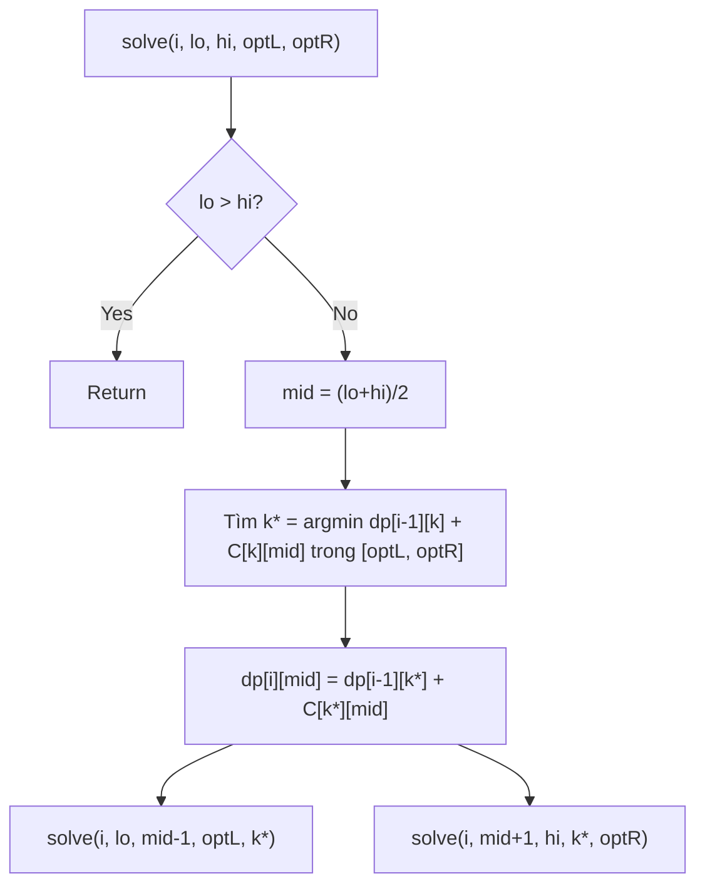
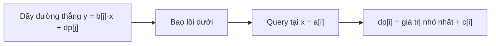
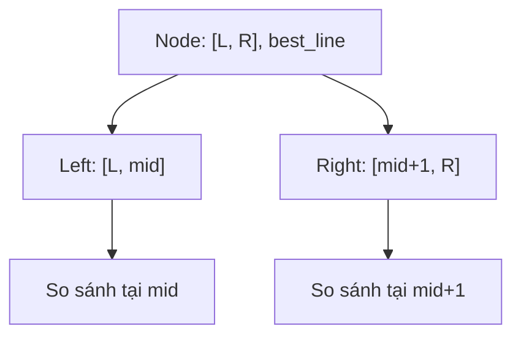
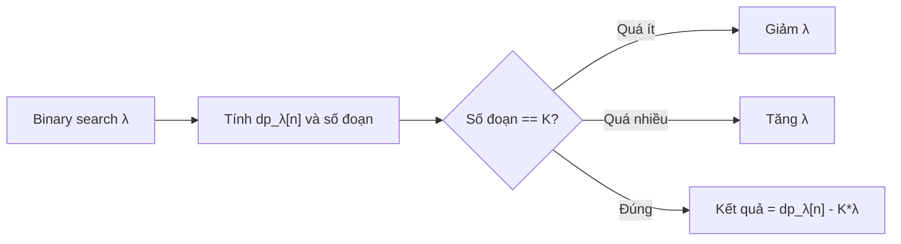
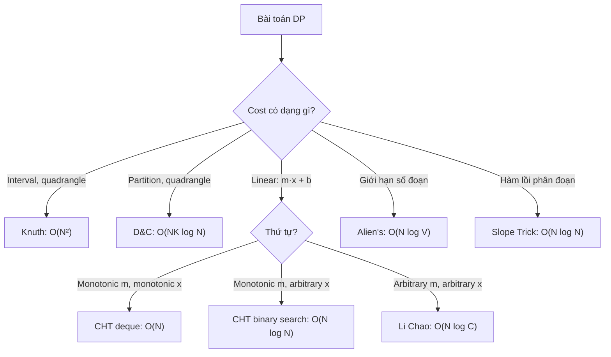

# Bài 50: Tối ưu Quy Hoạch Động - Knuth, D&C, CHT!

> **Tác giả:** FPTOJ Wiki<br>
> **Nội dung tham khảo từ:** VNOI Wiki, CP-Algorithms

---

## Bạn sẽ học được gì?

- Knuth's Optimization: O(N³) → O(N²) cho interval DP
- Divide & Conquer DP: O(NK log N)
- Convex Hull Trick cho DP
- Li Chao Tree: CHT động
- Alien's Trick (Lambda Optimization)
- Slope Trick cho DP hàm lồi

---

## 1. Giới thiệu

Nhiều bài toán quy hoạch động có công thức chuyển trạng thái dạng:

```
dp[i] = min/max over j { dp[j] + cost(j, i) }
```

Nếu duyệt tất cả `j`, ta mất O(N) cho mỗi trạng thái → O(N²) tổng. Tuy nhiên, **cấu trúc đặc biệt** của hàm `cost` có thể giúp ta tối ưu:

| Tối ưu | Điều kiện | Độ phức tạp |
|---|---|---|
| **Knuth's** | Quadrangle inequality + monotonicity (interval DP) | O(N³) → O(N²) |
| **Divide & Conquer** | Quadrangle inequality (partition DP) | O(NK log N) → O(NK) |
| **Convex Hull Trick** | `dp[j] = m[j]·x[i] + b[j]`, `m[j]` đơn điệu | O(N²) → O(N) hoặc O(N log N) |
| **Li Chao Tree** | `dp[j] = m[j]·x[i] + b[j]`, thêm dòng tùy ý | O(N²) → O(N log N) |
| **Alien's Trick** | Giới hạn số đoạn, tách penalty | O(NK) → O(N log V) |
| **Slope Trick** | Hàm chi phí lồi, phân đoạn tuyến tính | O(N log N) |

```mermaid
graph TD
    A["dp[i] = min/max dp[j] + cost(j,i)"] --> B{Cấu trúc cost?}
    B -->|"Interval DP, quadrangle"| C["Knuth's Optimization"]
    B -->|"Partition DP, quadrangle"| D["Divide & Conquer DP"]
    B -->|"cost = m[j]·x[i] + b[j]"| E{Thứ tự m[j]?}
    E -->|"Monotonic"| F["Convex Hull Trick"]
    E -->|"Arbitrary"| G["Li Chao Tree"]
    B -->|"Giới hạn số đoạn"| H["Alien's Trick"]
    B -->|"Hàm lồi phân đoạn"| I["Slope Trick"]
```

---

## 2. Knuth's Optimization

### 2.1 Ý tưởng

Cho bài toán interval DP:

```
dp[l][r] = min over k∈(l,r) { dp[l][k] + dp[k][r] + cost(l, r) }
```

Độ phức tạp mặc định: O(N³) với `l`, `r`, `k` mỗi biến O(N).

**Định lý Knuth:** Nếu hàm `cost` thỏa mãn:

1. **Quadrangle Inequality:** `cost(a,c) + cost(b,d) ≤ cost(a,d) + cost(b,c)` với mọi `a ≤ b ≤ c ≤ d`
2. **Monotonicity:** `cost(b,c) ≤ cost(a,d)` với mọi `a ≤ b ≤ c ≤ d`

Thì `opt[l][r-1] ≤ opt[l][r] ≤ opt[l+1][r]`, trong đó `opt[l][r]` là giá trị `k` tối ưu cho `dp[l][r]`.

→ Khi duyệt `k` cho `dp[l][r]`, ta chỉ cần duyệt trong khoảng `[opt[l][r-1], opt[l+1][r]]` thay vì `[l+1, r-1]`.

### 2.2 Chứng minh trực giác

Với `a ≤ b ≤ c ≤ d` và `cost` thỏa mãn quadrangle inequality:

```
opt[l][r-1] ≤ opt[l][r]:  vì thêm phần bên phải vào, điểm tối ưu không di chuyển sang trái
opt[l][r] ≤ opt[l+1][r]:  vì thêm phần bên trái vào, điểm tối ưu không di chuyển sang phải
```

Tổng số lần duyệt `k` trên toàn bộ bảng DP là O(N²) thay vì O(N³).

### 2.3 Khi nào áp dụng?

- **Interval DP** dạng `dp[l][r]` với điểm chia `k` ở giữa.
- Hàm `cost(l, r)` thỏa mãn hai điều kiện trên.
- Ví dụ phổ biến: Optimal Binary Search Tree, Matrix Chain Multiplication (với điều kiện phù hợp), Palindrome Partitioning.

### 2.4 Code

=== "C++"

    ```cpp
    #include <bits/stdc++.h>
    using namespace std;
    
    const int MAXN = 5005;
    const long long INF = 1e18;
    
    int n;
    long long cost[MAXN][MAXN];
    long long dp[MAXN][MAXN];
    int opt[MAXN][MAXN];
    
    void solve() {
        // Khởi tạo dp[l][l+1] = 0 (base case)
        for (int i = 1; i <= n + 1; i++) {
            for (int j = 1; j <= n + 1; j++) {
                dp[i][j] = INF;
            }
            dp[i][i + 1] = 0;
            opt[i][i + 1] = i;
        }
    
        // Duyệt theo độ dài tăng dần
        for (int len = 2; len <= n; len++) {
            for (int l = 1; l + len <= n + 1; l++) {
                int r = l + len;
                int left = opt[l][r - 1];
                int right = opt[l + 1][r];
    
                for (int k = left; k <= right; k++) {
                    long long val = dp[l][k] + dp[k][r] + cost[l][r];
                    if (val < dp[l][r]) {
                        dp[l][r] = val;
                        opt[l][r] = k;
                    }
                }
            }
        }
    
        cout << dp[1][n + 1] << "\n";
    }
    ```

=== "Python"

    ```python
    import sys
    input = sys.stdin.readline
    
    INF = float('inf')
    
    def solve():
        n = int(input())
        # cost[l][r] đã được tính trước
        dp = [[INF] * (n + 2) for _ in range(n + 2)]
        opt = [[0] * (n + 2) for _ in range(n + 2)]
    
        for i in range(1, n + 2):
            dp[i][i + 1] = 0
            opt[i][i + 1] = i
    
        for length in range(2, n + 1):
            for l in range(1, n + 2 - length):
                r = l + length
                left = opt[l][r - 1]
                right = opt[l + 1][r]
                for k in range(left, right + 1):
                    val = dp[l][k] + dp[k][r] + cost[l][r]
                    if val < dp[l][r]:
                        dp[l][r] = val
                        opt[l][r] = k
    
        print(dp[1][n + 1])
    ```

### 2.5 Ví dụ: Optimal Binary Search Tree

**Bài toán:** Cho `n` khóa với tần suất truy cập `f[i]`. Xây BST sao cho tổng `f[i] · depth(i)` nhỏ nhất.

Công thức DP:

```
dp[l][r] = min over k∈(l,r) { dp[l][k] + dp[k][r] } + sum(f[l..r-1])
```

Hàm `cost(l,r) = sum(f[l..r-1])` thỏa mãn quadrangle inequality vì `sum` là hàm cộng tính.

```cpp
// Tính prefix sum
long long prefix[MAXN];
// cost(l, r) = prefix[r-1] - prefix[l-1]

// Knuth's Optimization áp dụng trực tiếp
```

---

## 3. Divide & Conquer DP

### 3.1 Ý tưởng

Cho bài toán partition DP:

```
dp[i][j] = min over k < j { dp[i-1][k] + C[k][j] }
```

Trong đó `C` là hàm chi phí thỏa mãn **quadrangle inequality**. Gọi `opt[i][j]` là giá trị `k` tối ưu.

**Định lý:** Nếu `C` thỏa mãn quadrangle inequality, thì `opt[i][j]` đơn điệu không giảm theo `j`.

→ Thay vì duyệt tất cả `k` cho mỗi `j`, ta dùng **chia để trị** để tính toàn bộ hàng `dp[i]` trong O(N log N).

### 3.2 Thuật toán



Với mỗi lời gọi `solve(i, lo, hi, optL, optR)`:

1. Tính `mid = (lo + hi) / 2`
2. Tìm `k*` tối ưu cho `dp[i][mid]` trong khoảng `[optL, optR]`
3. Đệ quy: `solve(i, lo, mid-1, optL, k*)` và `solve(i, mid+1, hi, k*, optR)`

Mỗi `k` được xét O(log N) lần → tổng O(NK log N).

### 3.3 Code

=== "C++"

    ```cpp
    #include <bits/stdc++.h>
    using namespace std;
    
    const int MAXN = 100005;
    const int MAXK = 205;
    const long long INF = 1e18;
    
    int n, K;
    long long C[MAXN][MAXN]; // C[k][j] = chi phí đoạn [k+1..j]
    long long dp[MAXK][MAXN];
    int opt[MAXK][MAXN];
    
    // Tính dp[row][lo..hi] biết opt nằm trong [optL, optR]
    void solve(int row, int lo, int hi, int optL, int optR) {
        if (lo > hi) return;
    
        int mid = (lo + hi) / 2;
        dp[row][mid] = INF;
        opt[row][mid] = -1;
    
        // Tìm k tối ưu cho dp[row][mid]
        for (int k = optL; k <= min(mid - 1, optR); k++) {
            long long val = dp[row - 1][k] + C[k][mid];
            if (val < dp[row][mid]) {
                dp[row][mid] = val;
                opt[row][mid] = k;
            }
        }
    
        // Đệ quy 2 bên
        solve(row, lo, mid - 1, optL, opt[row][mid]);
        solve(row, mid + 1, hi, opt[row][mid], optR);
    }
    
    int main() {
        // Đọc input, tính C[k][j]...
    
        // Base case: dp[0][0] = 0
        dp[0][0] = 0;
        for (int j = 1; j <= n; j++) dp[0][j] = INF;
    
        // Tính từng hàng
        for (int i = 1; i <= K; i++) {
            solve(i, 1, n, 0, n - 1);
        }
    
        cout << dp[K][n] << "\n";
        return 0;
    }
    ```

=== "Python"

    ```python
    import sys
    input = sys.stdin.readline
    
    INF = float('inf')
    
    def solve(row, lo, hi, optL, optR):
        if lo > hi:
            return
    
        mid = (lo + hi) // 2
        dp[row][mid] = INF
        opt[row][mid] = -1
    
        for k in range(optL, min(mid, optR + 1)):
            val = dp[row - 1][k] + C[k][mid]
            if val < dp[row][mid]:
                dp[row][mid] = val
                opt[row][mid] = k
    
        solve(row, lo, mid - 1, optL, opt[row][mid])
        solve(row, mid + 1, hi, opt[row][mid], optR)
    
    def main():
        global n, K, C, dp, opt
        n, K = map(int, input().split())
        C = [[0] * (n + 1) for _ in range(n + 1)]
        dp = [[INF] * (n + 1) for _ in range(K + 1)]
        opt = [[0] * (n + 1) for _ in range(K + 1)]
    
        # Đọc và tính C[k][j]...
    
        dp[0][0] = 0
        for i in range(1, K + 1):
            solve(i, 1, n, 0, n - 1)
    
        print(dp[K][n])
    ```

### 3.4 Ví dụ: Chia dãy thành K đoạn

**Bài toán:** Chia dãy `a[1..n]` thành `K` đoạn liên tiếp sao cho tổng chi phí các đoạn là nhỏ nhất. Chi phí đoạn `[l..r]` cho trước (ví dụ: `(sum[l..r])²`).

```cpp
// C[k][j] = chi phí đoạn [k+1..j]
// Nếu C[k][j] = (prefix[j] - prefix[k])², thỏa mãn quadrangle inequality.

long long prefix[MAXN];

void computeCost() {
    for (int k = 0; k <= n; k++) {
        for (int j = k + 1; j <= n; j++) {
            long long s = prefix[j] - prefix[k];
            C[k][j] = s * s;
        }
    }
}
```

---

## 4. Convex Hull Trick (CHT)

### 4.1 Ý tưởng

Cho công thức DP dạng:

```
dp[i] = min over j < i { dp[j] + b[j] * a[i] + c[i] }
```

Mỗi `j` tương ứng với một **đường thẳng** `y = b[j] * x + dp[j]` (xét tại `x = a[i]`). Ta cần tìm đường thẳng cho giá trị nhỏ nhất tại `x = a[i]`.

Nếu `b[j]` đơn điệu (tăng hoặc giảm), ta có thể duy trì **bao lồi dưới** (lower envelope) của các đường thẳng bằng deque.



### 4.2 Điều kiện áp dụng

Công thức DP phải có dạng:

```
dp[i] = min/max { m[j] * x[i] + b[j] } + const[i]
```

Trong đó:
- `m[j]` (hệ số góc) **đơn điệu** theo `j` (tăng hoặc giảm)
- `x[i]` (giá trị query) **đơn điệu** theo `i` (tăng hoặc giảm)

Nếu `x[i]` không đơn điệu, cần dùng **Li Chao Tree** (xem Section 5).

### 4.3 Code — Deque (O(N))

=== "C++"

    ```cpp
    #include <bits/stdc++.h>
    using namespace std;
    
    const long long INF = 1e18;
    
    struct Line {
        long long m, b; // y = m * x + b
        long long eval(long long x) const {
            return m * x + b;
        }
    };
    
    // Kiểm tra có thể loại bỏ đường thẳng giữa (B) không
    // A, B, C lần lượt là 3 đường thẳng trong deque
    // Điều kiện: intersection(A,C) ≤ intersection(A,B)
    // Với m giảm dần và query x tăng dần
    bool bad(const Line& A, const Line& B, const Line& C) {
        // (C.b - A.b) / (A.m - C.m) ≤ (B.b - A.b) / (A.m - B.m)
        // Chéo nhân (tránh chia, tránh overflow nếu cẩn thận)
        return (__int128)(C.b - A.b) * (A.m - B.m) <= (__int128)(B.b - A.b) * (A.m - C.m);
    }
    
    struct CHT {
        deque<Line> dq;
    
        // Thêm đường thẳng y = m*x + b
        // m phải giảm dần (cho min) hoặc tăng dần (cho max)
        void add(long long m, long long b) {
            Line nw = {m, b};
            while (dq.size() >= 2 && bad(dq[dq.size()-2], dq[dq.size()-1], nw)) {
                dq.pop_back();
            }
            dq.push_back(nw);
        }
    
        // Query tại x (x phải tăng dần)
        long long query(long long x) {
            while (dq.size() >= 2 && dq[1].eval(x) <= dq[0].eval(x)) {
                dq.pop_front();
            }
            return dq[0].eval(x);
        }
    };
    
    int main() {
        int n;
        cin >> n;
        vector<long long> a(n), b(n), dp(n);
    
        CHT cht;
        // dp[0] = base case
        dp[0] = ...;
        cht.add(b[0], dp[0]);
    
        for (int i = 1; i < n; i++) {
            dp[i] = cht.query(a[i]) + ...;
            cht.add(b[i], dp[i]);
        }
    
        cout << dp[n - 1] << "\n";
        return 0;
    }
    ```

=== "Python"

    ```python
    from collections import deque
    
    class CHT:
        def __init__(self):
            self.dq = deque()
    
        @staticmethod
        def _bad(A, B, C):
            # (C.b - A.b) * (A.m - B.m) <= (B.b - A.b) * (A.m - C.m)
            return (C[1] - A[1]) * (A[0] - B[0]) <= (B[1] - A[1]) * (A[0] - C[0])
    
        @staticmethod
        def _eval(line, x):
            return line[0] * x + line[1]
    
        def add(self, m, b):
            nw = (m, b)
            while len(self.dq) >= 2 and self._bad(self.dq[-2], self.dq[-1], nw):
                self.dq.pop()
            self.dq.append(nw)
    
        def query(self, x):
            while len(self.dq) >= 2 and self._eval(self.dq[1], x) <= self._eval(self.dq[0], x):
                self.dq.popleft()
            return self._eval(self.dq[0], x)
    
    def main():
        n = int(input())
        # Đọc input...
        cht = CHT()
        # dp[0] = base case
        # cht.add(b[0], dp[0])
        # for i in range(1, n):
        #     dp[i] = cht.query(a[i]) + ...
        #     cht.add(b[i], dp[i])
    ```

### 4.4 Code — Binary Search O(N log N)

Khi `x[i]` **không đơn điệu**, ta dùng binary search trên deque:

=== "C++"

    ```cpp
    struct CHT_BS {
        vector<Line> lines;
    
        bool bad(Line A, Line B, Line C) {
            return (__int128)(C.b - A.b) * (A.m - B.m) <= (__int128)(B.b - A.b) * (A.m - C.m);
        }
    
        void add(long long m, long long b) {
            Line nw = {m, b};
            while (lines.size() >= 2 && bad(lines[lines.size()-2], lines[lines.size()-1], nw)) {
                lines.pop_back();
            }
            lines.push_back(nw);
        }
    
        long long query(long long x) {
            int lo = 0, hi = (int)lines.size() - 1;
            while (lo < hi) {
                int mid = (lo + hi) / 2;
                if (lines[mid].eval(x) <= lines[mid + 1].eval(x)) {
                    hi = mid;
                } else {
                    lo = mid + 1;
                }
            }
            return lines[lo].eval(x);
        }
    };
    ```

=== "Python"

    ```python
    class CHT_BS:
        def __init__(self):
            self.lines = []
    
        @staticmethod
        def _bad(A, B, C):
            return (C[1] - A[1]) * (A[0] - B[0]) <= (B[1] - A[1]) * (A[0] - C[0])
    
        @staticmethod
        def _eval(line, x):
            return line[0] * x + line[1]
    
        def add(self, m, b):
            nw = (m, b)
            while len(self.lines) >= 2 and self._bad(self.lines[-2], self.lines[-1], nw):
                self.lines.pop()
            self.lines.append(nw)
    
        def query(self, x):
            lo, hi = 0, len(self.lines) - 1
            while lo < hi:
                mid = (lo + hi) // 2
                if self._eval(self.lines[mid], x) <= self._eval(self.lines[mid + 1], x):
                    hi = mid
                else:
                    lo = mid + 1
            return self._eval(self.lines[lo], x)
    ```

### 4.5 Ví dụ: Batch Scheduling (IOI 2002)

**Bài toán:** Có `N` công việc. Công việc `i` có thời gian `t[i]` và hệ số phạt `f[i]`. Chia thành các batch, mỗi batch gồm các công việc liên tiếp. Chi phí batch `[l..r]` = `S · sum(f[l..r]) + sum(t[1..r]) · sum(f[l..r])`. Tìm tổng chi phí nhỏ nhất.

```
dp[i] = min over j < i { dp[j] + T[i] * (F[n] - F[j]) + S * (F[n] - F[j]) }
      = min over j < i { dp[j] - (T[i] + S) * F[j] } + (T[i] + S) * F[n]
```

Đây là dạng CHT: `m[j] = -F[j]`, `x[i] = T[i] + S`, `b[j] = dp[j]`.

```cpp
// dp[0] = 0
// CHT cht; cht.add(-F[0], dp[0]);
// for i = 1..n:
//   dp[i] = cht.query(T[i] + S) + (T[i] + S) * F[n];
//   cht.add(-F[i], dp[i]);
```

---

## 5. Li Chao Tree

### 5.1 Ý tưởng

Khi `x[i]` **không đơn điệu** và `m[j]` cũng **không đơn điệu** (thêm đường thẳng tùy ý), ta dùng **Li Chao Tree**.

Li Chao Tree là một segment tree trên miền giá trị `x`. Mỗi node lưu **một đường thẳng** tốt nhất tại điểm giữa của đoạn.

### 5.2 Cấu trúc



Khi thêm đường thẳng `new_line` vào node `[L, R]`:

1. So sánh `new_line` và `best_line` tại `mid = (L + R) / 2`
2. Nếu `new_line` tốt hơn tại `mid`, hoán đổi hai đường thẳng
3. So sánh `new_line` với `best_line` tại `L` hoặc `R` để xác định đi con nào
4. Đệ quy thêm `new_line` vào con phù hợp

### 5.3 Code

=== "C++"

    ```cpp
    #include <bits/stdc++.h>
    using namespace std;
    
    const long long INF = 1e18;
    
    struct LiChaoTree {
        struct Line {
            long long m = 0, b = INF;
            long long eval(long long x) const {
                return m * x + b;
            }
        };
    
        int n;
        vector<Line> tree;
    
        LiChaoTree(int size) : n(size), tree(4 * size) {}
    
        void add_line(Line nw, int node = 1, int lo = 0, int hi = -1) {
            if (hi < 0) hi = n - 1;
            int mid = (lo + hi) / 2;
    
            bool leftBetter = nw.eval(lo) < tree[node].eval(lo);
            bool midBetter = nw.eval(mid) < tree[node].eval(mid);
    
            if (midBetter) {
                swap(tree[node], nw);
            }
    
            if (lo == hi) return;
    
            if (leftBetter != midBetter) {
                add_line(nw, 2 * node, lo, mid);
            } else {
                add_line(nw, 2 * node + 1, mid + 1, hi);
            }
        }
    
        long long query(int x, int node = 1, int lo = 0, int hi = -1) {
            if (hi < 0) hi = n - 1;
            long long res = tree[node].eval(x);
            if (lo == hi) return res;
    
            int mid = (lo + hi) / 2;
            if (x <= mid) {
                res = min(res, query(x, 2 * node, lo, mid));
            } else {
                res = min(res, query(x, 2 * node + 1, mid + 1, hi));
            }
            return res;
        }
    };
    
    int main() {
        int n, coord_max;
        cin >> n >> coord_max;
    
        LiChaoTree lichao(coord_max + 1);
    
        // Thêm đường thẳng tùy ý
        // lichao.add_line({m, b});
        // Giá trị query tại x:
        // lichao.query(x);
    
        return 0;
    }
    ```

=== "Python"

    ```python
    INF = float('inf')
    
    class LiChaoTree:
        class Line:
            def __init__(self, m=0, b=INF):
                self.m = m
                self.b = b
            def eval(self, x):
                return self.m * x + self.b
    
        def __init__(self, size):
            self.n = size
            self.tree = [self.Line() for _ in range(4 * size)]
    
        def add_line(self, nw, node=1, lo=0, hi=None):
            if hi is None:
                hi = self.n - 1
            mid = (lo + hi) // 2
    
            left_better = nw.eval(lo) < self.tree[node].eval(lo)
            mid_better = nw.eval(mid) < self.tree[node].eval(mid)
    
            if mid_better:
                self.tree[node], nw = nw, self.tree[node]
    
            if lo == hi:
                return
    
            if left_better != mid_better:
                self.add_line(nw, 2 * node, lo, mid)
            else:
                self.add_line(nw, 2 * node + 1, mid + 1, hi)
    
        def query(self, x, node=1, lo=0, hi=None):
            if hi is None:
                hi = self.n - 1
            res = self.tree[node].eval(x)
            if lo == hi:
                return res
            mid = (lo + hi) // 2
            if x <= mid:
                res = min(res, self.query(x, 2 * node, lo, mid))
            else:
                res = min(res, self.query(x, 2 * node + 1, mid + 1, hi))
            return res
    ```

### 5.4 Khi nào dùng Li Chao Tree?

- Thêm đường thẳng **tùy ý thứ tự** (m không đơn điệu)
- Query **tùy ý** (x không đơn điệu)
- Độ phức tạp: O(log C) mỗi lần thêm/query, với C là miền giá trị của x
- Có thể nén tọa độ nếu x là số thực hoặc giá trị lớn

---

## 6. Alien's Trick (Lambda Optimization)

### 6.1 Ý tưởng

Cho bài toán: chia dãy thành **đúng K** đoạn sao cho tổng chi phí nhỏ nhất.

```
dp[i] = min over j < i { dp[j] + cost(j+1, i) }
```

Nếu không giới hạn số đoạn, ta chỉ cần `dp[n]`. Nhưng muốn **đúng K đoạn**, ta thêm **hình phạt** λ cho mỗi đoạn:

```
dp[i][k] = min over j { dp[j][k-1] + cost(j+1, i) }
→ dp_λ[i] = min over j { dp_λ[j] + cost(j+1, i) + λ }
```

→ Chỉ cần 1D DP! Duyệt binary search trên λ để tìm λ sao cho số đoạn = K.

### 6.2 Phân tích

- Tăng λ → số đoạn giảm (ít đoạn hơn, mỗi đoạn dài hơn)
- Giảm λ → số đoạn tăng
- Binary search trên λ trong khoảng phù hợp



### 6.3 Code

=== "C++"

    ```cpp
    #include <bits/stdc++.h>
    using namespace std;
    
    const long long INF = 1e18;
    int n, K;
    long long cost[MAXN][MAXN]; // chi phí đoạn [l..r]
    
    // Tính dp với penalty lambda, trả về {chi phí, số đoạn}
    pair<long long, int> solve_with_lambda(long long lambda) {
        vector<long long> dp(n + 1, INF);
        vector<int> cnt(n + 1, 0);
    
        dp[0] = 0;
        cnt[0] = 0;
    
        for (int i = 1; i <= n; i++) {
            for (int j = 0; j < i; j++) {
                long long val = dp[j] + cost[j + 1][i] + lambda;
                if (val < dp[i]) {
                    dp[i] = val;
                    cnt[i] = cnt[j] + 1;
                }
            }
        }
    
        return {dp[n], cnt[n]};
    }
    
    long long alien_trick() {
        long long lo = -1e12, hi = 1e12;
        long long ans = 0;
    
        while (lo <= hi) {
            long long mid = (lo + hi) / 2;
            auto [cost, segments] = solve_with_lambda(mid);
    
            if (segments >= K) {
                // Quá nhiều đoạn → tăng lambda
                lo = mid + 1;
                ans = cost - (long long)K * mid;
            } else {
                // Quá ít đoạn → giảm lambda
                hi = mid - 1;
            }
        }
    
        return ans;
    }
    ```

=== "Python"

    ```python
    INF = float('inf')
    
    def solve_with_lambda(lam):
        dp = [INF] * (n + 1)
        cnt = [0] * (n + 1)
        dp[0] = 0
    
        for i in range(1, n + 1):
            for j in range(i):
                val = dp[j] + cost(j + 1, i) + lam
                if val < dp[i]:
                    dp[i] = val
                    cnt[i] = cnt[j] + 1
    
        return dp[n], cnt[n]
    
    def alien_trick():
        lo, hi = -10**12, 10**12
        ans = 0
        while lo <= hi:
            mid = (lo + hi) // 2
            c, segs = solve_with_lambda(mid)
            if segs >= K:
                lo = mid + 1
                ans = c - K * mid
            else:
                hi = mid - 1
        return ans
    ```

### 6.4 Lưu ý quan trọng

- Kết quả cuối cùng = `dp_λ[n] - K * λ` (trừ đi penalty đã thêm)
- Nếu bài toán yêu cầu **≤ K** đoạn, chỉ cần binary search sao cho `segments ≤ K`
- Cần cẩn thận với **dangling** (nhiều λ cho cùng số đoạn) → kết quả có thể sai 1-2 đơn vị
- Giải pháp: lưu thêm `min_segments` và `max_segments` cho mỗi λ

---

## 7. Slope Trick

### 7.1 Ý tưởng

Slope Trick áp dụng cho DP mà **hàm `dp[i](x)`** là hàm lồi, có thể biểu diễn bằng các đoạn tuyến tính (piecewise linear convex function).

Thay vì lưu toàn bộ hàm, ta chỉ lưu:
- Giá trị tại điểm tối ưu `min_val`
- Các **điểm gãy** (breakpoints) bằng hai priority queue: left (max-heap) và right (min-heap)

### 7.2 Ví dụ

Cho `dp[0](x) = 0`, và:

```
dp[i](x) = min over y { dp[i-1](y) + |x - a[i]| }
```

Đây là hàm lồi. Mỗi bước, ta thêm hàm `|x - a[i]|` (hàm V-shape).

### 7.3 Code (đơn giản hóa)

=== "C++"

    ```cpp
    #include <bits/stdc++.h>
    using namespace std;
    
    int main() {
        int n;
        cin >> n;
    
        priority_queue<long long> left;    // max-heap, bên trái
        priority_queue<long long, vector<long long>, greater<long long>> right; // min-heap, bên phải
        long long min_val = 0;
    
        for (int i = 0; i < n; i++) {
            long long a;
            cin >> a;
    
            // Thêm breakpoint mới tại a
            left.push(a);
            right.push(a);
    
            // Cân bằng: di chuyển max của left sang right
            if (left.top() > right.top()) {
                long long l = left.top(); left.pop();
                long long r = right.top(); right.pop();
                left.push(r);
                right.push(l);
            }
    
            // Chi phí di chuyển
            min_val += abs(a - left.top());
        }
    
        cout << min_val << "\n";
        return 0;
    }
    ```

=== "Python"

    ```python
    import heapq
    
    def solve():
        n = int(input())
        left = []   # max-heap (dùng giá trị âm)
        right = []  # min-heap
        min_val = 0
    
        for _ in range(n):
            a = int(input())
    
            heapq.heappush(left, -a)
            heapq.heappush(right, a)
    
            if -left[0] > right[0]:
                l = -heapq.heappop(left)
                r = heapq.heappop(right)
                heapq.heappush(left, -r)
                heapq.heappush(right, l)
    
            min_val += abs(a - (-left[0]))
    
        print(min_val)
    ```

### 7.4 Khi nào dùng Slope Trick?

- Hàm DP là **hàm lồi phân đoạn tuyến tính**
- Phổ biến trong các bài Codeforces: chuyển hàng, điều chỉnh dãy, cost dạng `|x - a[i]|` hoặc `max(0, x - a[i])`
- Kết hợp với lazy propagation trên heap để xử lý offset

---

## 8. Lưu ý & Cạm bẫy

### 8.1 Knuth's Optimization

| Cạm bẫy | Giải pháp |
|---|---|
| Quên kiểm tra quadrangle inequality | Luôn chứng minh trước khi áp dụng |
| Duyệt `k` ngoài khoảng `[opt[l][r-1], opt[l+1][r]]` | Đảm bảo cập nhật `opt` đúng |
| `cost(l, r)` không thỏa mãn monotonicity | Knuth's KHÔNG áp dụng được |

### 8.2 Divide & Conquer DP

| Cạm bẫy | Giải pháp |
|---|---|
| `C[k][j]` không thỏa mãn quadrangle inequality | D&C DP cho kết quả SAI, không chỉ chậm |
| Quên base case `dp[0][0] = 0` | Luôn khởi tạo đúng |
| `opt[row][mid]` không cập nhật | Đảm bảo gán `opt[row][mid]` trước khi đệ quy |

### 8.3 Convex Hull Trick

| Cạm bẫy | Giải pháp |
|---|---|
| `m[j]` không đơn điệu | Dùng CHT với binary search hoặc Li Chao Tree |
| Overflow khi tính intersection | Dùng `__int128` hoặc chia trước |
| Quên trường hợp `m[j]` bằng nhau | Xử lý riêng: giữ đường thẳng có `b` tốt hơn |
| Query không đơn điệu | Dùng binary search version |

### 8.4 Alien's Trick

| Cạm bẫy | Giải pháp |
|---|---|
| Kết quả sai do floating point | Dùng integer λ nếu có thể |
| Nhiều λ cho cùng số đoạn | Lưu `min_cnt` và `max_cnt` |
| Binary search không hội tụ | Giới hạn số bước (60-80 iterations) |

### 8.5 Kiểm tra Quadrangle Inequality

Hàm `cost(a, b)` thỏa mãn quadrangle inequality nếu:

```
cost(a, c) + cost(b, d) ≤ cost(a, d) + cost(b, c)   ∀ a ≤ b ≤ c ≤ d
```

Một số hàm thỏa mãn:
- `cost(l, r) = (prefix[r] - prefix[l])²` ✓
- `cost(l, r) = sum(f[l..r-1])` ✓ (prefix sum)
- `cost(l, r) = (r - l)²` ✓
- `cost(l, r) = max(a[l..r])` ✓

Một số hàm KHÔNG thỏa mãn:
- `cost(l, r) = min(a[l..r])` ✗
- Hàm tùy ý ✗

---

## 9. Bài tập

| # | Bài | Tối ưu | Độ khó |
|---|---|---|---|
| 1 | [IOI 2002 - Batch Scheduling](https://oj.vnoi.info/problem/batch) | CHT | ⭐⭐⭐ |
| 2 | [CEOI 2004 - Two Saws](https://oj.vnoi.info/problem/saw) | Knuth's | ⭐⭐ |
| 3 | [APIO 2010 - Commando](https://oj.vnoi.info/problem/commando) | CHT | ⭐⭐⭐ |
| 4 | [USACO - Circular Barn](https://usaco.org/index.php?page=viewproblem2&cpid=622) | Knuth's | ⭐⭐⭐ |
| 5 | [CF 319C - Kalila and Dimna](https://codeforces.com/problemset/problem/319/C) | CHT | ⭐⭐⭐ |
| 6 | [CF 678F - Lena and Queries](https://codeforces.com/problemset/problem/678/F) | Li Chao | ⭐⭐⭐⭐ |
| 7 | [IOI 2016 - Aliens](https://oj.vnoi.info/problem/aliens) | Alien's Trick | ⭐⭐⭐⭐ |
| 8 | [CF 713C - Sonya and Problem Without a Legend](https://codeforces.com/problemset/problem/713/C) | Slope Trick | ⭐⭐⭐ |
| 9 | [SPOJ NKLEAVES](https://www.spoj.com/problems/NKLEAVES/) | D&C DP | ⭐⭐⭐ |
| 10 | [CF 868F - Yet Another Minimization Problem](https://codeforces.com/problemset/problem/868/F) | D&C DP | ⭐⭐⭐⭐ |
| 11 | [CSES - Increasing Subsequence](https://cses.fi/problemset/task/1145) | LIS | ⭐⭐ |
| 12 | [VNOJ - AtCoder DP N - Slimes](https://oj.vnoi.info/problem/atcoder_dp_n) | Knuth's | ⭐⭐⭐ |
| 13 | [VNOJ - AtCoder DP W - Intervals](https://oj.vnoi.info/problem/atcoder_dp_w) | Lazy SegTree | ⭐⭐⭐⭐ |

---

## 10. Tổng kết



**Quy trình quyết định:**

1. Viết DP brute force O(N²) hoặc O(N³)
2. Nhận dạng cấu trúc cost → chọn tối ưu phù hợp
3. Kiểm tra điều kiện (quadrangle inequality, monotonicity)
4. Implement và test với dữ liệu nhỏ trước
5. Debug bằng cách so sánh kết quả với brute force

---

> **Bài tiếp theo:** [Bài 51: Aho-Corasick](aho-corasick.md)
