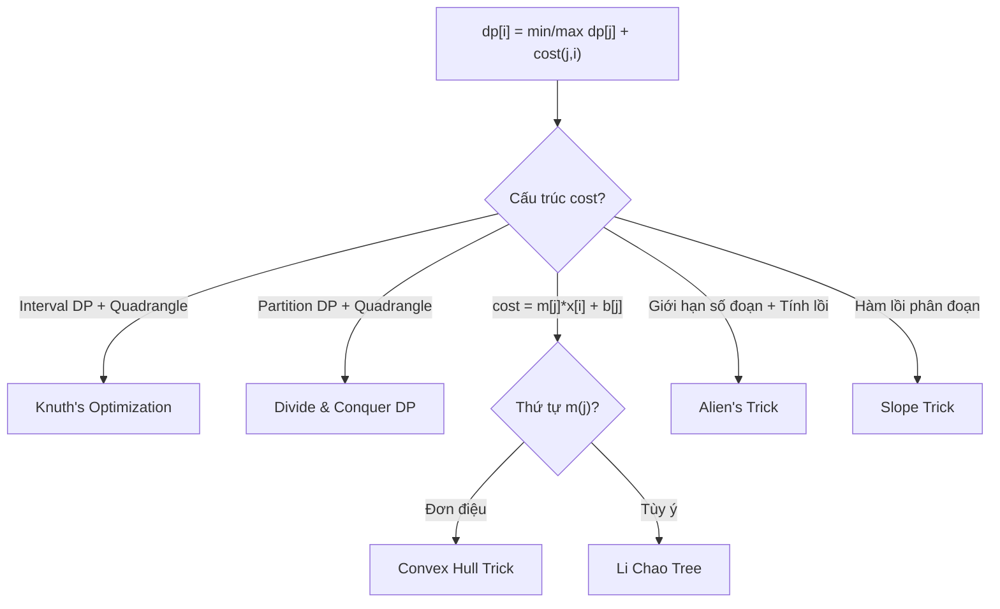
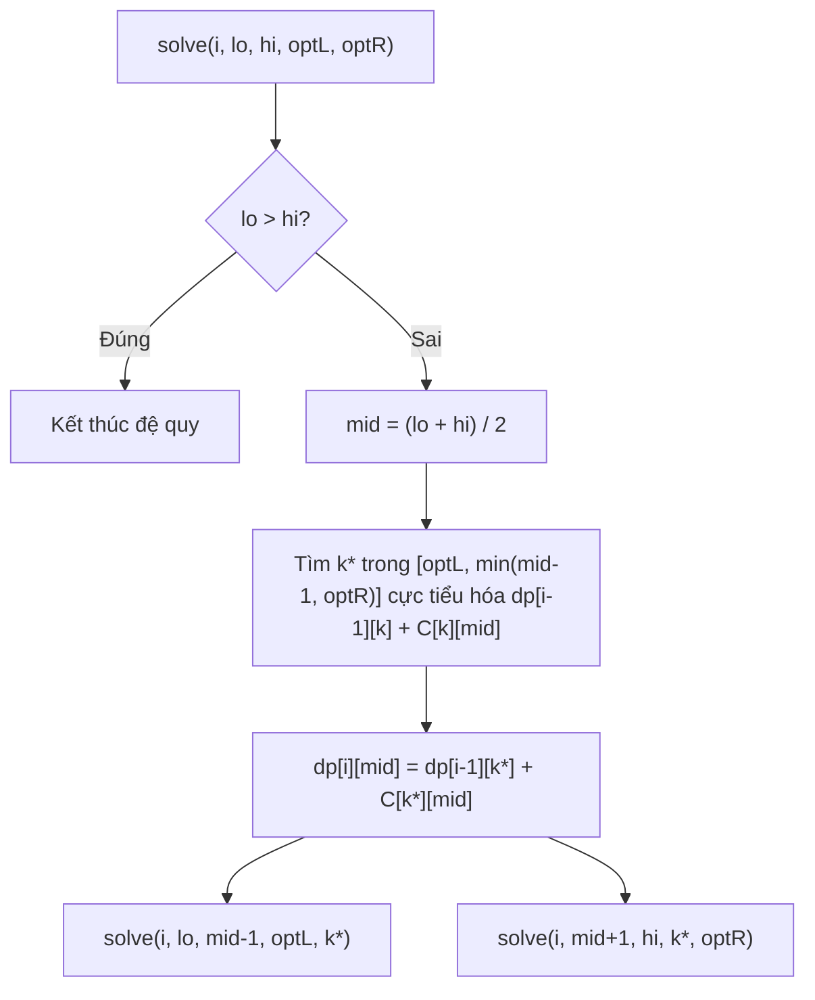
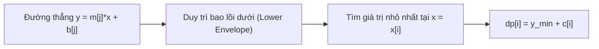
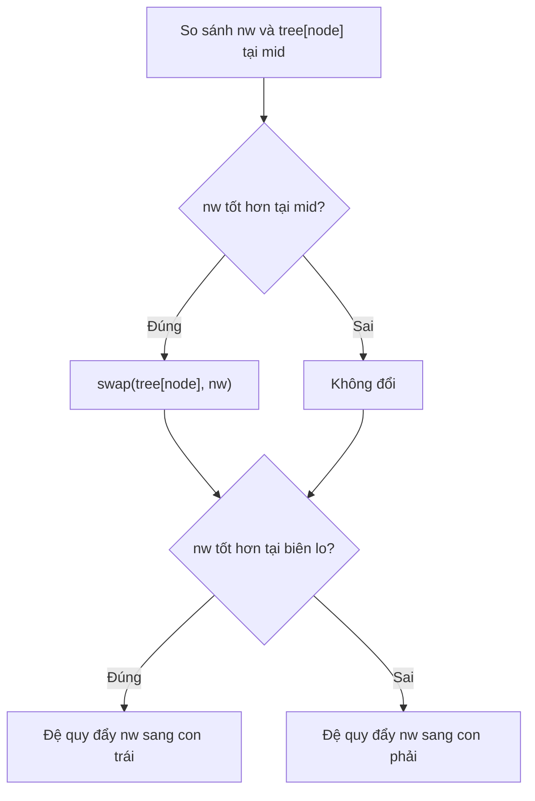
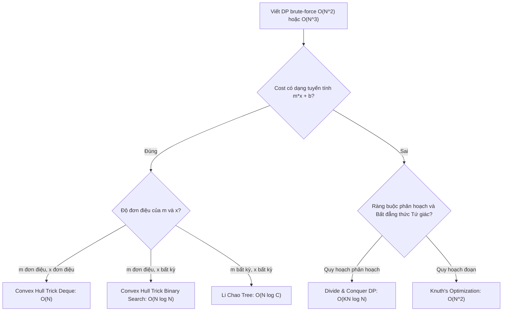

# Bài 50: Tối ưu Quy Hoạch Động - Knuth, D&C, CHT

> **Tác giả:** FPTOJ Team<br>
> **Nội dung tham khảo từ:** VNOI Wiki, CP-Algorithms

---

## Bạn sẽ học được gì?

- **Knuth's Optimization:** Tối ưu độ phức tạp từ $O(N^3)$ về $O(N^2)$ cho quy hoạch động trên đoạn (Interval DP).
- **Divide & Conquer DP:** Giảm độ phức tạp từ $O(N^2 \cdot K)$ về $O(N \cdot K \log N)$ nhờ tính đơn điệu của điểm tối ưu.
- **Convex Hull Trick (CHT):** Quản lý bao lồi của các đường thẳng để tối ưu hóa trong $O(N)$ hoặc $O(N \log N)$.
- **Li Chao Tree:** Giải pháp CHT động mạnh mẽ khi hệ số góc và giá trị truy vấn không đơn điệu.
- **Alien's Trick (WQS Binary Search):** Sử dụng nhân tử Lagrange để biến quy hoạch động 2D có ràng buộc số lượng đoạn thành quy hoạch động 1D.
- **Slope Trick:** Biểu diễn hàm chi phí lồi bằng các điểm gãy (breakpoints) thông qua cấu trúc dữ liệu Heap.

---

## 1. Giới thiệu

Trong lập trình thi đấu nâng cao, nhiều bài toán quy hoạch động có công thức truy hồi dạng:
$$dp[i] = \min_{j < i} \{ dp[j] + \text{cost}(j, i) \}$$

Nếu thực hiện duyệt tuyến tính qua mọi giá trị $j$, ta mất thời gian $O(N)$ cho mỗi trạng thái, dẫn đến tổng độ phức tạp là $O(N^2)$. Tuy nhiên, nếu hàm chi phí $\text{cost}(j, i)$ sở hữu các **tính chất hình học hoặc toán học đặc biệt**, ta có thể áp dụng các kỹ thuật tối ưu hóa để hạ thấp đáng kể độ phức tạp thời gian.

Dưới đây là bảng tổng hợp các phương pháp tối ưu hóa phổ biến:

| Kỹ thuật tối ưu | Điều kiện áp dụng của hàm $\text{cost}$ | Độ phức tạp |
| :--- | :--- | :--- |
| **Knuth's Optimization** | Bất đẳng thức tứ giác (Quadrangle Inequality) + Tính đơn điệu trên đoạn | $O(N^3) \to O(N^2)$ |
| **Divide & Conquer DP** | Bất đẳng thức tứ giác (áp dụng cho quy hoạch động phân hoạch) | $O(N^2 \cdot K) \to O(N \cdot K \log N)$ |
| **Convex Hull Trick** | Có dạng tuyến tính $dp[j] \cdot x[i] + b[j]$ với hệ số góc đơn điệu | $O(N^2) \to O(N)$ hoặc $O(N \log N)$ |
| **Li Chao Tree** | Có dạng tuyến tính, hệ số góc và truy vấn bất kỳ | $O(N^2) \to O(N \log C)$ |
| **Alien's Trick** | Hàm chi phí lồi/lõm theo số đoạn $K$ | $O(N \cdot K) \to O(N \log V)$ |
| **Slope Trick** | Hàm chi phí là hàm lồi phân đoạn tuyến tính (Piecewise Linear Convex) | $O(N^2) \to O(N \log N)$ |



---

## 2. Knuth's Optimization

### 2.1 Tư duy cốt lõi

Knuth's Optimization được áp dụng cho các bài toán quy hoạch động trên đoạn (Interval DP) có công thức:
$$dp[l][r] = \min_{l < k < r} \{ dp[l][k] + dp[k][r] + \text{cost}(l, r) \}$$

Gọi $opt[l][r]$ là chỉ số $k$ nhỏ nhất đạt được giá trị tối ưu cho trạng thái $dp[l][r]$.

#### Định lý Knuth:
Nếu hàm $\text{cost}(l, r)$ thỏa mãn hai điều kiện sau với mọi $a \le b \le c \le d$:
1. **Bất đẳng thức tứ giác (Quadrangle Inequality):**
   $$\text{cost}(a, c) + \text{cost}(b, d) \le \text{cost}(a, d) + \text{cost}(b, c)$$
2. **Tính đơn điệu (Monotonicity):**
   $$\text{cost}(b, c) \le \text{cost}(a, d)$$

Thì ta có tính chất đơn điệu của điểm chia tối ưu:
$$opt[l][r-1] \le opt[l][r] \le opt[l+1][r]$$

#### Ý nghĩa thực tế:
Thay vì phải duyệt biến $k$ trong toàn bộ khoảng từ $l+1$ tới $r-1$ (tốn $O(N)$ bước), ta chỉ cần tìm kiếm $k$ trong khoảng giới hạn hẹp:
$$k \in [opt[l][r-1], opt[l+1][r]]$$

Tổng số bước lặp trên toàn bộ bảng DP khi áp dụng giới hạn này sẽ giảm từ $O(N^3)$ xuống $O(N^2)$.

### 2.2 Chứng minh trực giác
- Khi ta cố định điểm đầu $l$ và mở rộng điểm cuối từ $r-1$ sang $r$, điểm chia tối ưu $opt[l][r]$ sẽ không dịch chuyển sang bên trái.
- Khi ta cố định điểm cuối $r$ và dịch chuyển điểm đầu từ $l$ sang $l+1$, điểm chia tối ưu $opt[l][r]$ sẽ không dịch chuyển sang bên trái.
Do đó, $opt[l][r]$ bị kẹp chặt giữa hai giá trị đã được tính toán ở các trạng thái trước đó có độ dài đoạn nhỏ hơn.

=== "C++"

    ```cpp
    #include <bits/stdc++.h>
    using namespace std;
    
    const int MAXN = 5005;
    const long long INF = 1e18;
    
    int n;
    long long cost[MAXN][MAXN];
    long long dp[MAXN][MAXN];
    int opt[MAXN][MAXN];
    
    void solve() {
        // Khởi tạo trường hợp cơ sở: đoạn độ dài 1 có chi phí bằng 0
        for (int i = 1; i <= n + 1; i++) {
            for (int j = 1; j <= n + 1; j++) {
                dp[i][j] = INF;
            }
            dp[i][i + 1] = 0;
            opt[i][i + 1] = i;
        }
    
        // Duyệt theo độ dài tăng dần của đoạn
        for (int len = 2; len <= n; len++) {
            for (int l = 1; l + len <= n + 1; l++) {
                int r = l + len;
                int left_bound = opt[l][r - 1];
                int right_bound = opt[l + 1][r];
    
                for (int k = left_bound; k <= right_bound; k++) {
                    long long val = dp[l][k] + dp[k][r] + cost[l][r];
                    if (val < dp[l][r]) {
                        dp[l][r] = val;
                        opt[l][r] = k;
                    }
                }
            }
        }
    
        cout << dp[1][n + 1] << "\n";
    }
    ```

=== "Python"

    ```python
    import sys

    INF = float('inf')
    
    def solve(n, cost):
        # dp[l][r] và opt[l][r]
        dp = [[INF] * (n + 2) for _ in range(n + 2)]
        opt = [[0] * (n + 2) for _ in range(n + 2)]
    
        for i in range(1, n + 2):
            dp[i][i + 1] = 0
            opt[i][i + 1] = i
    
        for length in range(2, n + 1):
            for l in range(1, n + 2 - length):
                r = l + length
                left_bound = opt[l][r - 1]
                right_bound = opt[l + 1][r]
                for k in range(left_bound, right_bound + 1):
                    val = dp[l][k] + dp[k][r] + cost[l][r]
                    if val < dp[l][r]:
                        dp[l][r] = val
                        opt[l][r] = k
    
        return dp[1][n + 1]
    ```

---

## 3. Divide & Conquer DP (Quy hoạch động Chia để trị)

### 3.1 Tư duy cốt lõi

Chia để trị áp dụng cho bài toán phân hoạch một dãy phần tử thành $K$ nhóm liên tiếp sao cho tổng chi phí nhỏ nhất:
$$dp[i][j] = \min_{k < j} \{ dp[i-1][k] + C[k][j] \}$$
Trong đó $dp[i][j]$ là chi phí tối ưu khi phân chia $j$ phần tử đầu tiên thành $i$ nhóm.

#### Ràng buộc áp dụng:
Nếu hàm chi phí đoạn $C[k][j]$ thỏa mãn bất đẳng thức tứ giác (Quadrangle Inequality):
$$C[a, c] + C[b, d] \le C[a, d] + C[b, c], \quad \forall a \le b \le c \le d$$
Thì ta có tính chất đơn điệu của điểm tối ưu:
$$opt[i][j-1] \le opt[i][j] \le opt[i][j+1]$$

Nói cách khác, điểm cắt tối ưu $opt[i][j]$ là một hàm không giảm theo $j$ khi cố định dòng $i$.

### 3.2 Thuật toán chia để trị
Khi tính toán dòng $i$ của bảng quy hoạch động, thay vì tính tuần tự từ $1$ tới $N$, ta tính giá trị tại vị trí trung lộ $mid = \lfloor (lo + hi)/2 \rfloor$ trước. 

Giả sử ta biết điểm chia tối ưu của $dp[i][mid]$ chỉ có thể nằm trong đoạn $[optL, optR]$. Sau khi tìm được điểm tối ưu $k^*$ của $mid$ bằng cách quét tuyến tính trong $[optL, optR]$:
1. Đối với các trạng thái ở nửa bên trái ($j < mid$): điểm tối ưu của chúng chắc chắn thuộc đoạn $[optL, k^*]$.
2. Đối với các trạng thái ở nửa bên phải ($j > mid$): điểm tối ưu của chúng chắc chắn thuộc đoạn $[k^*, optR]$.

Ta đệ quy giải quyết hai nửa.



=== "C++"

    ```cpp
    #include <bits/stdc++.h>
    using namespace std;
    
    const int MAXN = 50005;
    const int MAXK = 105;
    const long long INF = 1e18;
    
    int n, K;
    long long C[MAXN][MAXN]; // C[k][j] là chi phí đoạn từ k+1 đến j
    long long dp[MAXK][MAXN];
    
    // Tính dp[row][lo..hi] với khoảng tìm kiếm điểm tối ưu trong [optL, optR]
    void solve(int row, int lo, int hi, int optL, int optR) {
        if (lo > hi) return;
    
        int mid = (lo + hi) / 2;
        dp[row][mid] = INF;
        int best_k = -1;
    
        // Điểm cắt k chỉ có thể tối đa là mid - 1
        for (int k = optL; k <= min(mid - 1, optR); k++) {
            long long val = dp[row - 1][k] + C[k][mid];
            if (val < dp[row][mid]) {
                dp[row][mid] = val;
                best_k = k;
            }
        }
    
        // Đệ quy xử lý hai nửa trái và phải
        solve(row, lo, mid - 1, optL, best_k);
        solve(row, mid + 1, hi, best_k, optR);
    }
    
    int main() {
        ios_base::sync_with_stdio(false);
        cin.tie(nullptr);
    
        // Đọc n, K và khởi tạo chi phí C...
        // Base case: 
        dp[0][0] = 0;
        for (int j = 1; j <= n; j++) dp[0][j] = INF;
    
        for (int i = 1; i <= K; i++) {
            solve(i, 1, n, 0, n - 1);
        }
    
        cout << dp[K][n] << "\n";
        return 0;
    }
    ```

=== "Python"

    ```python
    import sys
    
    INF = float('inf')
    
    def solve_dc(row, lo, hi, opt_l, opt_r, dp, C):
        if lo > hi:
            return
    
        mid = (lo + hi) // 2
        dp[row][mid] = INF
        best_k = -1
    
        for k in range(opt_l, min(mid, opt_r + 1)):
            val = dp[row - 1][k] + C[k][mid]
            if val < dp[row][mid]:
                dp[row][mid] = val
                best_k = k
    
        solve_dc(row, lo, mid - 1, opt_l, best_k, dp, C)
        solve_dc(row, mid + 1, hi, best_k, opt_r, dp, C)
    
    def compute_dp(n, K, C):
        dp = [[INF] * (n + 1) for _ in range(K + 1)]
        dp[0][0] = 0
        
        for i in range(1, K + 1):
            solve_dc(i, 1, n, 0, n - 1, dp, C)
            
        return dp[K][n]
    ```

**Độ phức tạp thời gian:** Mỗi tầng đệ quy của hàm chia để trị mất tổng thời gian là $O(\text{optR} - \text{optL})$ trên tất cả các lời gọi. Tổng độ phức tạp tính toán cho một dòng là $O(N \log N)$. Khi tính toàn bộ $K$ dòng, tổng thời gian là $O(K \cdot N \log N)$.

---

## 4. Convex Hull Trick (CHT - Biểu diễn bao lồi đường thẳng)

### 4.1 Ý tưởng toán học

Khi công thức quy hoạch động có dạng:
$$dp[i] = \min_{j < i} \{ dp[j] + m[j] \cdot x[i] + b[j] \} + c[i]$$

Ta có thể coi mỗi lựa chọn $j$ tương ứng với một đường thẳng $y = m[j] \cdot x + b[j]$ với biến số $x$. 
Giá trị tối ưu tại trạng thái $i$ tương ứng với việc tìm đường thẳng có giá trị $y$ nhỏ nhất tại hoành độ $x = x[i]$.

Nếu ta vẽ tất cả các đường thẳng lên hệ trục tọa độ, đường bao dưới cùng của chúng tạo thành một **bao lồi dưới** (Lower Envelope) gồm tập hợp các đoạn thẳng có hệ số góc giảm dần (hoặc tăng dần).



### 4.2 Trường hợp 1: Hệ số góc $m$ và truy vấn $x$ đơn điệu ($O(N)$)
Nếu:
1. Hệ số góc $m[j]$ được thêm vào theo thứ tự đơn điệu giảm dần.
2. Hoành độ truy vấn $x[i]$ tăng dần.

Ta có thể duy trì bao lồi bằng một hàng đợi hai đầu (`std::deque`). 
- Khi thêm đường thẳng mới: Ta loại bỏ các đường thẳng ở cuối deque không còn đóng góp vào bao lồi.
- Khi truy vấn: Ta tịnh tiến đầu hàng đợi bằng cách loại bỏ các đường thẳng không còn tối ưu tại hoành độ $x$ hiện tại (do $x$ tăng đơn điệu).

#### Điều kiện loại bỏ đường thẳng:
Xét ba đường thẳng liên tiếp $A$, $B$, $C$. Giao điểm của $A$ và $C$ nằm bên trái giao điểm của $A$ và $B$ chứng tỏ đường thẳng $B$ hoàn toàn vô dụng.
Hoành độ giao điểm của hai đường thẳng $L_1(m_1, b_1)$ và $L_2(m_2, b_2)$ là:
$$x_{\text{intersect}} = \frac{b_2 - b_1}{m_1 - m_2}$$

=== "C++"

    ```cpp
    #include <bits/stdc++.h>
    using namespace std;
    
    struct Line {
        long long m, b;
        long long eval(long long x) const {
            return m * x + b;
        }
    };
    
    // Kiểm tra đường thẳng B có trở nên vô dụng sau khi thêm C vào sau A không
    // Tránh dùng số thực để ngăn lỗi sai số bằng cách nhân chéo
    bool is_bad(const Line& A, const Line& B, const Line& C) {
        return (__int128)(C.b - A.b) * (A.m - B.m) <= (__int128)(B.b - A.b) * (A.m - C.m);
    }
    
    struct CHT_Deque {
        deque<Line> dq;
    
        // Thêm đường thẳng mới (yêu cầu m giảm dần)
        void add(long long m, long long b) {
            Line nw = {m, b};
            while (dq.size() >= 2 && is_bad(dq[dq.size() - 2], dq[dq.size() - 1], nw)) {
                dq.pop_back();
            }
            dq.push_back(nw);
        }
    
        // Tìm giá trị cực tiểu tại x (yêu cầu x tăng dần)
        long long query(long long x) {
            while (dq.size() >= 2 && dq[1].eval(x) <= dq[0].eval(x)) {
                dq.pop_front();
            }
            return dq[0].eval(x);
        }
    };
    ```

=== "Python"

    ```python
    from collections import deque

    class CHT_Deque:
        def __init__(self):
            self.dq = deque()
    
        def _is_bad(self, A, B, C):
            # A, B, C đại diện cho các đường thẳng dạng (m, b)
            # Nhân chéo tránh phép chia số thực
            return (C[1] - A[1]) * (A[0] - B[0]) <= (B[1] - A[1]) * (A[0] - C[0])
    
        def add(self, m, b):
            nw = (m, b)
            while len(self.dq) >= 2 and self._is_bad(self.dq[-2], self.dq[-1], nw):
                self.dq.pop()
            self.dq.append(nw)
    
        def query(self, x):
            while len(self.dq) >= 2 and (self.dq[1][0]*x + self.dq[1][1]) <= (self.dq[0][0]*x + self.dq[0][1]):
                self.dq.popleft()
            return self.dq[0][0]*x + self.dq[0][1]
    ```

---

### 4.3 Trường hợp 2: Hệ số góc đơn điệu, truy vấn $x$ không đơn điệu ($O(N \log N)$)
Khi hoành độ truy vấn $x$ nhảy tự do, ta không thể loại bỏ các đường thẳng ở đầu deque. Tuy nhiên, do hệ số góc đơn điệu, các đoạn thẳng tối ưu trên bao lồi sắp xếp tăng dần theo hoành độ giao điểm của chúng. Ta sử dụng Tìm kiếm nhị phân để xác định đường thẳng tốt nhất trong bao lồi.

=== "C++"

    ```cpp
    #include <bits/stdc++.h>
    using namespace std;
    
    struct Line {
        long long m, b;
        long long eval(long long x) const {
            return m * x + b;
        }
    };
    
    bool is_bad(Line A, Line B, Line C) {
        return (__int128)(C.b - A.b) * (A.m - B.m) <= (__int128)(B.b - A.b) * (A.m - C.m);
    }
    
    struct CHT_BinarySearch {
        vector<Line> lines;
    
        void add(long long m, long long b) {
            Line nw = {m, b};
            while (lines.size() >= 2 && is_bad(lines[lines.size() - 2], lines[lines.size() - 1], nw)) {
                lines.pop_back();
            }
            lines.push_back(nw);
        }
    
        // Tìm kiếm nhị phân trên bao lồi để tìm đường thẳng tối ưu tại x
        long long query(long long x) {
            int lo = 0, hi = (int)lines.size() - 1;
            while (lo < hi) {
                int mid = (lo + hi) / 2;
                if (lines[mid].eval(x) <= lines[mid + 1].eval(x)) {
                    hi = mid;
                } else {
                    lo = mid + 1;
                }
            }
            return lines[lo].eval(x);
        }
    };
    ```

=== "Python"

    ```python
    class CHT_BinarySearch:
        def __init__(self):
            self.lines = []
    
        def _is_bad(self, A, B, C):
            return (C[1] - A[1]) * (A[0] - B[0]) <= (B[1] - A[1]) * (A[0] - C[0])
    
        def add(self, m, b):
            nw = (m, b)
            while len(self.lines) >= 2 and self._is_bad(self.lines[-2], self.lines[-1], nw):
                self.lines.pop()
            self.lines.append(nw)
    
        def query(self, x):
            lo, hi = 0, len(self.lines) - 1
            while lo < hi:
                mid = (lo + hi) // 2
                val1 = self.lines[mid][0] * x + self.lines[mid][1]
                val2 = self.lines[mid + 1][0] * x + self.lines[mid + 1][1]
                if val1 <= val2:
                    hi = mid
                else:
                    lo = mid + 1
            return self.lines[lo][0] * x + self.lines[lo][1]
    ```

---

## 5. Li Chao Tree (Cây phân đoạn quản lý đường thẳng)

### 5.1 Tư duy cốt lõi
Khi cả hệ số góc $m$ và truy vấn $x$ đều **không đơn điệu** (đường thẳng được chèn vào một cách ngẫu nhiên và truy vấn tại các điểm ngẫu nhiên), cấu trúc bao lồi cổ điển sẽ thất bại. **Li Chao Tree** là một cây phân đoạn Segment Tree được thiết kế để giải quyết bài toán này.

Cây quản lý một miền giá trị hoành độ nguyên $[L, R]$. Mỗi nút quản lý một đoạn con $[lo, hi]$ và lưu trữ duy nhất **đường thẳng tốt nhất tại tọa độ trung tâm $mid = \lfloor (lo + hi)/2 \rfloor$** của đoạn đó.

#### Thuật toán thêm đường thẳng mới $nw$:
Tại nút đang quản lý đoạn $[lo, hi]$ với trung tâm là $mid$:
1. So sánh giá trị của đường thẳng mới $nw$ và đường thẳng hiện tại của nút $tree[node]$ tại hoành độ $mid$.
2. Nếu $nw$ tối ưu hơn tại $mid$, ta hoán đổi đường thẳng của nút và $nw$ (để nút luôn giữ đường thẳng tốt nhất tại điểm trung tâm).
3. Tại điểm biên $lo$ hoặc $hi$, ta so sánh xem đường thẳng nào tối ưu hơn để quyết định đẩy đường thẳng yếu hơn xuống đệ quy ở nút con bên trái hay con bên phải.



=== "C++"

    ```cpp
    #include <bits/stdc++.h>
    using namespace std;
    
    const long long INF = 1e18;
    
    struct Line {
        long long m = 0, b = INF;
        long long eval(long long x) const {
            return m * x + b;
        }
    };
    
    struct LiChaoTree {
        int n;
        vector<Line> tree;
    
        LiChaoTree(int size) : n(size), tree(4 * size) {}
    
        void add_line(Line nw, int node = 1, int lo = 0, int hi = -1) {
            if (hi < 0) hi = n - 1;
            int mid = (lo + hi) / 2;
    
            bool left_better = nw.eval(lo) < tree[node].eval(lo);
            bool mid_better = nw.eval(mid) < tree[node].eval(mid);
    
            if (mid_better) {
                swap(tree[node], nw);
            }
    
            if (lo == hi) return;
    
            if (left_better != mid_better) {
                add_line(nw, 2 * node, lo, mid);
            } else {
                add_line(nw, 2 * node + 1, mid + 1, hi);
            }
        }
    
        long long query(int x, int node = 1, int lo = 0, int hi = -1) {
            if (hi < 0) hi = n - 1;
            long long res = tree[node].eval(x);
            if (lo == hi) return res;
    
            int mid = (lo + hi) / 2;
            if (x <= mid) {
                res = min(res, query(x, 2 * node, lo, mid));
            } else {
                res = min(res, query(x, 2 * node + 1, mid + 1, hi));
            }
            return res;
        }
    };
    ```

=== "Python"

    ```python
    INF = float('inf')
    
    class Line:
        def __init__(self, m=0, b=INF):
            self.m = m
            self.b = b
        def eval(self, x):
            return self.m * x + self.b
            
    class LiChaoTree:
        def __init__(self, size):
            self.n = size
            self.tree = [Line() for _ in range(4 * size)]
    
        def add_line(self, nw, node=1, lo=0, hi=None):
            if hi is None:
                hi = self.n - 1
            mid = (lo + hi) // 2
    
            left_better = nw.eval(lo) < self.tree[node].eval(lo)
            mid_better = nw.eval(mid) < self.tree[node].eval(mid)
    
            if mid_better:
                self.tree[node], nw = nw, self.tree[node]
    
            if lo == hi:
                return
    
            if left_better != mid_better:
                self.add_line(nw, 2 * node, lo, mid)
            else:
                self.add_line(nw, 2 * node + 1, mid + 1, hi)
    
        def query(self, x, node=1, lo=0, hi=None):
            if hi is None:
                hi = self.n - 1
            res = self.tree[node].eval(x)
            if lo == hi:
                return res
            mid = (lo + hi) // 2
            if x <= mid:
                res = min(res, self.query(x, 2 * node, lo, mid))
            else:
                res = min(res, self.query(x, 2 * node + 1, mid + 1, hi))
            return res
    ```

**Độ phức tạp:** $O(\log C)$ cho mỗi thao tác thêm đường thẳng hoặc truy vấn, với $C$ là kích thước miền giá trị của $x$.

---

## 6. Alien's Trick (WQS Binary Search)

### 6.1 Tư duy cốt lõi

Alien's Trick (hay tối ưu hóa Lambda) được áp dụng khi cần giải quyết bài toán tìm cấu hình tối ưu với ràng buộc chọn **đúng $K$ thành phần** (ví dụ chia dãy thành đúng $K$ đoạn). 
Gọi $f(k)$ là giá trị tối ưu của bài toán khi có ràng buộc chọn đúng $k$ thành phần.

#### Ràng buộc toán học:
Hàm số $f(k)$ phải có tính chất **lồi** (hoặc lõm) theo biến $k$. 
Một cách trực quan, sự chênh lệch chi phí khi tăng số lượng thành phần từ $k \to k+1$ nhỏ hơn khi tăng từ $k-1 \to k$.

#### Ý tưởng kỹ thuật:
Ta gỡ bỏ ràng buộc "chọn đúng $K$ thành phần" bằng cách thêm một hình phạt (penalty) có giá trị $\lambda$ cho mỗi thành phần được chọn. 
Khi đó, ta giải bài toán quy hoạch động không ràng buộc mới:
$$dp_{\lambda}[i] = \min_{j < i} \{ dp_{\lambda}[j] + \text{cost}(j+1, i) + \lambda \}$$

- Nếu hình phạt $\lambda$ rất lớn, ta sẽ chọn rất ít thành phần để giảm thiểu chi phí phạt.
- Nếu hình phạt $\lambda$ rất nhỏ (thậm chí âm), ta sẽ chọn rất nhiều thành phần để thu được lợi ích.
Vì hàm $f(k)$ lồi, số lượng thành phần tối ưu được chọn là một hàm đơn điệu giảm theo $\lambda$. Ta có thể **tìm kiếm nhị phân giá trị $\lambda$** phù hợp sao cho quy hoạch động không ràng buộc chọn đúng $K$ thành phần.

=== "C++"

    ```cpp
    #include <bits/stdc++.h>
    using namespace std;
    
    const int MAXN = 50005;
    const long long INF = 1e18;
    int n, K;
    long long C[MAXN][MAXN]; // C[j][i] là chi phí đoạn từ j đến i
    
    // Tính quy hoạch động 1D với hình phạt lambda
    // Trả về {tổng chi phí, số lượng đoạn đã chọn}
    pair<long long, int> solve_dp(long long lambda) {
        vector<long long> dp(n + 1, INF);
        vector<int> cnt(n + 1, 0);
        
        dp[0] = 0;
        for (int i = 1; i <= n; i++) {
            for (int j = 0; j < i; j++) {
                long long val = dp[j] + C[j + 1][i] + lambda;
                if (val < dp[i]) {
                    dp[i] = val;
                    cnt[i] = cnt[j] + 1;
                }
            }
        }
        return {dp[n], cnt[n]};
    }
    
    long long get_min_cost() {
        long long lo = 0, hi = 1e12;
        long long ans = -1;
        
        // Tìm kiếm nhị phân lambda
        for (int iter = 0; iter < 60; iter++) {
            long long mid = lo + (hi - lo) / 2;
            auto [cost, segments] = solve_dp(mid);
            
            if (segments >= K) {
                // Số đoạn nhiều hơn hoặc bằng K -> tăng hình phạt lambda để giảm số đoạn
                ans = cost - K * mid;
                lo = mid + 1;
            } else {
                // Số đoạn ít hơn K -> giảm hình phạt lambda
                hi = mid - 1;
            }
        }
        return ans;
    }
    ```

=== "Python"

    ```python
    def solve_dp_lambda(n, K, C, lam):
        # Trả về (dp_val, segments)
        dp = [float('inf')] * (n + 1)
        cnt = [0] * (n + 1)
        dp[0] = 0
        
        for i in range(1, n + 1):
            for j in range(i):
                val = dp[j] + C[j + 1][i] + lam
                if val < dp[i]:
                    dp[i] = val
                    cnt[i] = cnt[j] + 1
        return dp[n], cnt[n]

    def alien_trick(n, K, C):
        lo, hi = 0, 10**12
        ans = -1
        
        for _ in range(60):
            mid = (lo + hi) // 2
            cost, segments = solve_dp_lambda(n, K, C, mid)
            if segments >= K:
                ans = cost - K * mid
                lo = mid + 1
            else:
                hi = mid - 1
        return ans
    ```

---

## 7. Slope Trick (Kỹ thuật quản lý hàm lồi phân đoạn)

### 7.1 Ý tưởng toán học
Slope Trick được áp dụng khi hàm trạng thái quy hoạch động $f(x)$ là một **hàm lồi liên tục phân đoạn tuyến tính** (Piecewise Linear Convex Function). 
Một hàm như vậy được đặc trưng hoàn toàn bởi:
1. Giá trị nhỏ nhất của hàm số: $min\_val$.
2. Tập hợp các **điểm gãy** (breakpoints) tại đó hệ số góc thay đổi. 

Hệ số góc của hàm số chỉ nhận các giá trị nguyên, tăng dần từ trái sang phải.
Ta sử dụng hai hàng đợi ưu tiên (Priority Queue):
- `left` (Max-Heap): Lưu các điểm gãy nơi hệ số góc $< 0$.
- `right` (Min-Heap): Lưu các điểm gãy nơi hệ số góc $> 0$.

### 7.2 Ví dụ bài toán chuyển hàng
Xét bài toán cập nhật trạng thái:
$$dp_i(x) = \min_{y \le x} \{ dp_{i-1}(y) \} + |x - a_i|$$

Ta thêm một hàm trị tuyệt đối (hình chữ V) có điểm gãy tại $a_i$ vào hàm quy hoạch động. Điểm tối ưu sẽ dịch chuyển và ta cần cập nhật các heap điểm gãy tương ứng.

=== "C++"

    ```cpp
    #include <bits/stdc++.h>
    using namespace std;
    
    int main() {
        int n;
        if (!(cin >> n)) return 0;
    
        priority_queue<long long> left_heap; // Max-heap quản lý nhánh dốc đi xuống
        priority_queue<long long, vector<long long>, greater<long long>> right_heap; // Min-heap quản lý nhánh dốc đi lên
        long long min_val = 0;
    
        for (int i = 0; i < n; i++) {
            long long a;
            cin >> a;
    
            // Thêm điểm gãy của hàm trị tuyệt đối vào cả hai heap
            left_heap.push(a);
            right_heap.push(a);
    
            // Cân bằng hai heap: Nếu đỉnh dốc trái lớn hơn dốc phải
            if (left_heap.top() > right_heap.top()) {
                long long l = left_heap.top(); left_heap.pop();
                long long r = right_heap.top(); right_heap.pop();
                left_heap.push(r);
                right_heap.push(l);
            }
    
            // Giá trị nhỏ nhất tăng thêm khoảng cách từ a tới điểm gãy tối ưu hiện tại
            min_val += abs(a - left_heap.top());
        }
    
        cout << min_val << "\n";
        return 0;
    }
    ```

=== "Python"

    ```python
    import heapq
    import sys

    def solve():
        input = sys.stdin.read
        data = input().split()
        if not data:
            return
        
        n = int(data[0])
        left_heap = []  # Max-heap (lưu giá trị âm)
        right_heap = [] # Min-heap
        min_val = 0
    
        for i in range(1, n + 1):
            a = int(data[i])
            
            heapq.heappush(left_heap, -a)
            heapq.heappush(right_heap, a)
    
            if -left_heap[0] > right_heap[0]:
                l = -heapq.heappop(left_heap)
                r = heapq.heappop(right_heap)
                heapq.heappush(left_heap, -r)
                heapq.heappush(right_heap, l)
    
            min_val += abs(a - (-left_heap[0]))
    
        print(min_val)

    if __name__ == '__main__':
        solve()
    ```

---

## 8. Cạm bẫy và Kiểm tra Bất đẳng thức Tứ giác

> [!WARNING]
> ### 1. Kiểm tra tính đúng đắn của Bất đẳng thức Tứ giác
> Bất đẳng thức tứ giác:
> $$\text{cost}(a, c) + \text{cost}(b, d) \le \text{cost}(a, d) + \text{cost}(b, c), \quad \forall a \le b \le c \le d$$
> Nếu hàm $\text{cost}$ của bạn không thỏa mãn tính chất này, việc sử dụng Knuth hoặc Divide & Conquer sẽ cho ra **kết quả sai** chứ không chỉ chạy chậm.  
> *Mẹo nhỏ:* Hãy lập trình một đoạn mã kiểm tra nhỏ (brute force) chạy qua mọi bộ $a, b, c, d$ trên tập mẫu nhỏ để kiểm nghiệm bất đẳng thức trước khi viết thuật chính.

> [!IMPORTANT]
> ### 2. Tràn số khi tính Giao điểm (CHT Intersection Overflow)
> Khi so sánh giao điểm của hai đường thẳng:
> $$(C.b - A.b) \cdot (A.m - B.m) \le (B.b - A.b) \cdot (A.m - C.m)$$
> Tích của hiệu hệ số tự do và hiệu hệ số góc có thể vượt quá giới hạn của số nguyên $64\text{-bit}$ (`long long` trong C++).  
> **Giải pháp:** Sử dụng kiểu số nguyên lớn `__int128` trong C++ để tính toán tích trung gian này một cách an toàn.

> [!CAUTION]
> ### 3. Nhiều giá trị $\lambda$ tương ứng với cùng một số lượng đoạn (Alien's Trick)
> Khi hàm $f(k)$ có các đoạn thẳng nằm ngang song song trục hoành (hàm không lồi nghiêm ngặt), tìm kiếm nhị phân số nguyên $\lambda$ có thể không bao giờ đạt được chính xác giá trị $K$.  
> **Giải pháp:** Trong hàm quy hoạch động, ta luôn lưu lại đồng thời cả số lượng đoạn tối thiểu và số lượng đoạn tối đa có thể chọn tại mỗi trạng thái tối ưu.

---

## 9. Bài tập luyện tập

| STT | Bài toán | Kỹ thuật áp dụng | Độ khó | Liên kết |
| :--- | :--- | :--- | :--- | :--- |
| 1 | **Batch Scheduling (IOI 2002)** | Convex Hull Trick | ★★★☆ | [VNOJ - Batch](https://oj.vnoi.info/problem/batch) |
| 2 | **Commando (APIO 2010)** | Convex Hull Trick | ★★★☆ | [VNOJ - Commando](https://oj.vnoi.info/problem/commando) |
| 3 | **Yet Another Minimization Problem** | Divide & Conquer DP | ★★★★ | [Codeforces - 868F](https://codeforces.com/problemset/problem/868/F) |
| 4 | **Slimes (AtCoder DP N)** | Knuth's Optimization | ★★★☆ | [VNOJ - AtCoder DP N](https://oj.vnoi.info/problem/atcoder_dp_n) |
| 5 | **Sonya and Problem Without a Legend** | Slope Trick | ★★★★ | [Codeforces - 713C](https://codeforces.com/problemset/problem/713/C) |
| 6 | **Aliens (IOI 2016)** | Alien's Trick + CHT | ★★★★★ | [VNOJ - Aliens](https://oj.vnoi.info/problem/aliens) |

---

## 10. Tổng kết quy trình lựa chọn tối ưu



Hãy thực hiện tuần tự việc viết lời giải quy hoạch động ngây thơ trước để kiểm nghiệm tính đúng đắn của công thức chuyển trạng thái, sau đó mới áp dụng các công cụ tối ưu toán học/hình học để nâng cao hiệu năng chạy chương trình.
