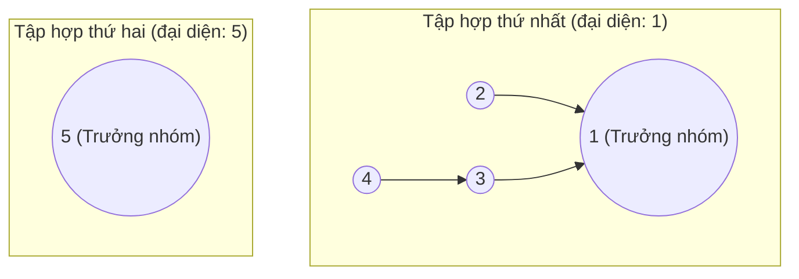
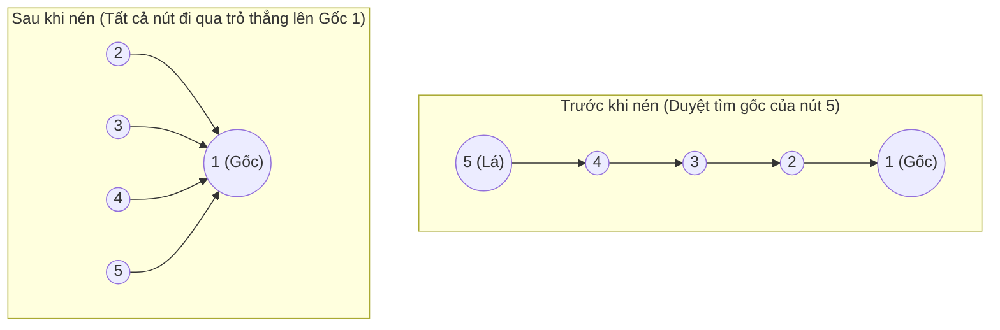
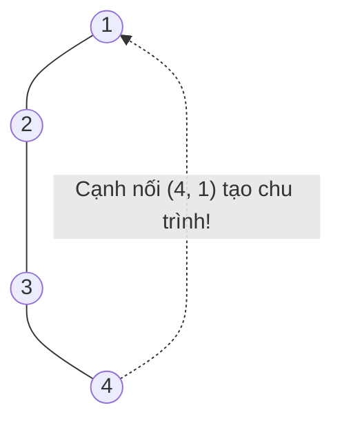
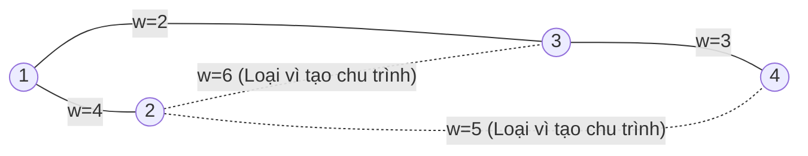

# Bài 8b: Disjoint Set Union (DSU) - Cấu Trúc Các Tập Hợp Rời Nhau

> **Tác giả:** FPTOJ Team<br>
> **Nội dung tham khảo từ:** VNOI Wiki - Disjoint Set Union, CP-Algorithms

---

## 1. Bản chất vấn đề

### Bài toán thực tế
Giả sử ta có $N$ phần tử được đánh số từ $1$ đến $N$, ban đầu mỗi phần tử nằm trong một tập hợp riêng biệt của chính nó. Ta cần thực hiện chuỗi các yêu cầu thuộc hai loại sau:

1.  **Gộp tập hợp (`union(a, b)`):** Gộp tập hợp chứa phần tử $a$ và tập hợp chứa phần tử $b$ lại thành một tập hợp duy nhất.
2.  **Tìm kiếm đại diện (`find(v)`):** Xác định phần tử đại diện (trưởng nhóm) cho tập hợp chứa phần tử $v$. Hai phần tử cùng thuộc một tập hợp nếu và chỉ nếu chúng có cùng một phần tử đại diện.

### Tại sao các cấu trúc dữ liệu ngây thơ thất bại?

*   **Sử dụng mảng định danh trực tiếp:**
    *   Ta dùng một mảng $id[1 \ldots N]$ trong đó $id[v]$ lưu chỉ số tập hợp của phần tử $v$.
    *   Thao tác tìm kiếm đại diện `find(v)` vô cùng nhanh chóng: chỉ cần trả về $id[v]$ trong thời gian $O(1)$.
    *   Tuy nhiên, khi thực hiện gộp hai tập hợp chứa $a$ và $b$ (`union(a, b)`), ta phải duyệt qua toàn bộ $N$ phần tử để cập nhật lại chỉ số của những phần tử có cùng nhóm với $b$ sang nhóm của $a$. Thao tác này tốn $O(N)$ thời gian. 
    *   Nếu thực hiện $Q$ truy vấn gộp trên mảng kích thước $N$, tổng độ phức tạp sẽ là $O(Q \times N)$ — quá chậm đối với dữ liệu $N, Q \approx 10^5$.

**Disjoint Set Union (DSU)** giải quyết xuất sắc bài toán này bằng cách biểu diễn mỗi tập hợp dưới dạng một cây nhị phân/nhiều con, giúp tối ưu hóa cả hai thao tác gộp và tìm kiếm về độ phức tạp thực tế gần như **$O(1)$** (trung bình là $O(\alpha(N))$).

---

## 2. Tư duy cốt lõi: Biểu diễn tập hợp dưới dạng cây

Ý tưởng của DSU là biểu diễn mỗi tập hợp dưới dạng một cây:
*   Mỗi nút trên cây tương ứng với một phần tử của tập hợp.
*   Mỗi nút $v$ lưu một con trỏ trỏ đến cha của nó, ký hiệu là $parent[v]$.
*   Nút gốc của cây (nơi $parent[root] = root$) đóng vai trò là **phần tử đại diện** duy nhất cho toàn bộ tập hợp đó.

### Trạng thái ban đầu và sau các phép gộp

Ban đầu, mỗi phần tử tự quản lý chính mình:
$$parent[i] = i \quad \forall i \in [1, N]$$

| Chỉ số $i$ | $1$ | $2$ | $3$ | $4$ | $5$ |
|:---:|:---:|:---:|:---:|:---:|:---:|
| Cha $parent[i]$ | $1$ | $2$ | $3$ | $4$ | $5$ |

Khi thực hiện lần lượt các phép gộp:
1.  `union(1, 2)`: Gán cha của $2$ là $1$ ($parent[2] = 1$). Tập hợp mới là $\{1, 2\}$, đại diện là $1$.
2.  `union(3, 4)`: Gán cha của $4$ là $3$ ($parent[4] = 3$). Tập hợp mới là $\{3, 4\}$, đại diện là $3$.
3.  `union(1, 3)`: Tìm gốc của $1$ (là $1$) và gốc của $3$ (là $3$). Gán cha của $3$ là $1$ ($parent[3] = 1$). Tập hợp mới là $\{1, 2, 3, 4\}$, đại diện chung là $1$.

Bảng mảng $parent$ sau chuỗi thao tác:

| Chỉ số $i$ | $1$ | $2$ | $3$ | $4$ | $5$ |
|:---:|:---:|:---:|:---:|:---:|:---:|
| Cha $parent[i]$ | $1$ | $1$ | $1$ | $3$ | $5$ |

Cấu trúc hình cây tương ứng của hệ thống tập hợp:



Để kiểm tra hai phần tử $u$ và $v$ có cùng thuộc một tập hợp hay không, ta chỉ cần gọi `find(u)` và `find(v)` rồi so sánh kết quả:
*   `find(2)`: Đi từ nút $2 \to 1$ (gốc). Trả về $1$.
*   `find(4)`: Đi từ nút $4 \to 3 \to 1$ (gốc). Trả về $1$.
*   Vì `find(2) == find(4) == 1`, ta kết luận $2$ và $4$ cùng một nhóm.

---

## 3. Tối ưu hóa 1: Nén đường đi (Path Compression)

### Vấn đề chiều cao cây
Nếu ta thực hiện phép gộp một cách ngẫu nhiên, cây có thể bị lệch và kéo dài thành một chuỗi tuyến tính (ví dụ: $5 \to 4 \to 3 \to 2 \to 1$). Khi đó, thao tác tìm kiếm `find(5)` đòi hỏi duyệt qua toàn bộ $5$ nút, độ phức tạp suy biến về $O(N)$.

### Giải pháp nén đường đi
Khi thực hiện thao tác tìm kiếm gốc của nút $v$, ta duyệt ngược lên gốc để tìm đại diện của nhóm. Trên đường quay lui của hàm đệ quy, ta cập nhật con trỏ cha của **tất cả các nút đã đi qua** trỏ trực tiếp đến nút gốc đó.



### Trace chi tiết quá trình gọi hàm `find(5)` đệ quy có nén đường đi:

1.  **Duyệt đi lên (Tìm gốc):**
    *   `find(5)`: $parent[5] = 4 \neq 5 \to$ gọi đệ quy `find(4)`
    *   `find(4)`: $parent[4] = 3 \neq 4 \to$ gọi đệ quy `find(3)`
    *   `find(3)`: $parent[3] = 2 \neq 3 \to$ gọi đệ quy `find(2)`
    *   `find(2)`: $parent[2] = 1 \neq 2 \to$ gọi đệ quy `find(1)`
    *   `find(1)`: $parent[1] = 1 \to$ trả về nút gốc là $1$.
2.  **Duyệt đi xuống (Cập nhật liên kết cha):**
    *   `find(2)` gán lại $parent[2] = 1$, trả về $1$.
    *   `find(3)` gán lại $parent[3] = 1$, trả về $1$.
    *   `find(4)` gán lại $parent[4] = 1$, trả về $1$.
    *   `find(5)` gán lại $parent[5] = 1$, trả về $1$.

### Hàm nghịch đảo Ackermann $\alpha(N)$ là gì?
Nhờ nén đường đi, độ phức tạp trung bình của mỗi thao tác DSU giảm xuống chỉ còn $O(\alpha(N))$, trong đó $\alpha$ là hàm nghịch đảo của hàm Ackermann.
Hàm Ackermann tăng trưởng cực kỳ nhanh, do đó hàm nghịch đảo $\alpha(N)$ tăng trưởng vô cùng chậm. Với mọi giá trị thực tế của $N$ trong vũ trụ ($N \leq 2^{2^{2^{65536}}}$), ta luôn có:
$$\alpha(N) \leq 4$$
Vì thế, thao tác tìm kiếm có nén đường đi có thể coi là chạy trong thời gian **hằng số $O(1)$**.

---

## 4. Tối ưu hóa 2: Gộp theo kích thước hoặc theo bậc (Union by Size/Rank)

### Khái niệm
Để giữ chiều cao của cây luôn thấp trong quá trình gộp:
*   **Gộp theo kích thước (Union by Size):** Ta lưu số lượng phần tử thuộc tập hợp quản lý bởi gốc $i$ trong một mảng $sz[i]$. Khi gộp hai cây, ta luôn chọn gốc của cây có kích thước **nhỏ hơn** trỏ đến gốc của cây có kích thước **lớn hơn**.
*   **Gộp theo bậc (Union by Rank):** Ta lưu bậc (rank - chiều cao xấp xỉ của cây) tại mỗi nút gốc trong mảng $rank[i]$. Khi gộp, cây có bậc **nhỏ hơn** sẽ trỏ đến cây có bậc **lớn hơn**. Nếu bậc bằng nhau, ta tùy ý chọn một cây làm cha và tăng bậc của cây cha lên $1$.

### Chứng minh toán học: Chiều cao cây luôn $\leq \log_2 N$ dưới phép gộp tối ưu
Dưới đây là chứng minh chiều cao tối đa của cây DSU sử dụng Union by Size luôn bị chặn trên bởi $O(\log N)$ (trường hợp chưa nén đường đi):

*   **Định lý:** Cây DSU bất kỳ có chiều cao $H$ luôn chứa ít nhất $2^H$ nút.
*   **Chứng minh bằng quy nạp toán học:**
    *   **Bước cơ sở:** Với cây có chiều cao $H = 0$ (chỉ gồm nút gốc đơn lẻ), số lượng nút tối thiểu là $2^0 = 1$ (Đúng).
    *   **Bước quy nạp:** Giả sử định lý đúng đến chiều cao $H-1$, tức là cây có chiều cao $H-1$ có ít nhất $2^{H-1}$ nút.
    *   Để tạo ra một cây có chiều cao $H$: Ta chỉ có thể gộp hai cây có cùng chiều cao $H-1$ lại với nhau (nếu gộp cây thấp hơn vào cây cao hơn, chiều cao cây mới vẫn là cây cao hơn và không thay đổi).
    *   Khi gộp hai cây cùng chiều cao $H-1$: Theo giả thiết quy nạp, mỗi cây chứa ít nhất $2^{H-1}$ nút.
    *   Tổng số nút của cây mới là:
        $$Size_{\text{mới}} \geq 2^{H-1} + 2^{H-1} = 2 \cdot 2^{H-1} = 2^H \quad (\text{đpcm})$$
*   Vì tổng số phần tử trên toàn bộ hệ thống là $N$, ta có:
    $$2^H \leq N \implies H \leq \log_2 N$$

Do đó, chiều cao tối đa của cây luôn bị chặn bởi $O(\log N)$. Khi kết hợp cùng tối ưu hóa **Nén đường đi**, chiều cao của cây sẽ giảm đi đáng kể và độ phức tạp đạt mức hằng số $O(\alpha(N))$.

```matplotlib
import math

N_values = [2**k for k in range(1, 21)]
labels_x = [f'2^{k}' if k % 3 == 1 or k == 20 else '' for k in range(1, 21)]

naive_height = N_values[:]
log_height = [math.log2(n) for n in N_values]
alpha_approx = [min(4, math.log2(math.log2(n) + 1) + 1) for n in N_values]

fig, ax = plt.subplots(figsize=(11, 5))

ax.plot(range(len(N_values)), naive_height, 'o-', label='Không tối ưu hóa: O(N)', linewidth=2, markersize=4)
ax.plot(range(len(N_values)), log_height, 's-', label='Union by Size/Rank: O(log N)', linewidth=2, markersize=4)
ax.plot(range(len(N_values)), alpha_approx, '^-', label='Path Compression + Union: O(α(N)) ≈ O(1)', linewidth=2.5, markersize=5)

ax.set_yscale('log')
ax.set_xticks(range(len(N_values)))
ax.set_xticklabels(labels_x, rotation=45, fontsize=8)
ax.set_xlabel('Kích thước N (lũy thừa 2)', fontsize=10)
ax.set_ylabel('Chiều cao cây tối đa (log scale)', fontsize=10)
ax.set_title('So sánh chiều cao cây DSU theo phương pháp tối ưu hóa', fontweight='bold', fontsize=12)
ax.legend(fontsize=9)
ax.grid(True, alpha=0.3)
plt.tight_layout()
```

---


## 5. Cài đặt Cấu trúc Dấu hiệu DSU Tiêu chuẩn

Dưới đây là mã nguồn của cấu trúc DSU chuẩn hỗ trợ đồng thời cả nén đường đi và gộp theo kích thước hoặc theo bậc:

### 5.1. DSU gộp theo kích thước (Union by Size)

=== "C++"

    ```cpp
    #include <vector>
    #include <numeric>

    using namespace std;

    struct DSU {
        vector<int> parent;
        vector<int> sz; // sz[i] lưu kích thước của tập hợp có gốc là i

        DSU(int n) {
            parent.resize(n + 1);
            iota(parent.begin(), parent.end(), 0); // parent[i] = i
            sz.assign(n + 1, 1); // Ban đầu mỗi tập hợp có kích thước là 1
        }

        // Tìm phần tử đại diện của nhóm chứa v - O(alpha(N))
        int find_set(int v) {
            if (v == parent[v]) return v;
            return parent[v] = find_set(parent[v]); // Nén đường đi
        }

        // Gộp hai nhóm chứa a và b - O(alpha(N))
        void union_sets(int a, int b) {
            a = find_set(a);
            b = find_set(b);
            if (a != b) {
                // Luôn gộp cây nhỏ hơn vào cây lớn hơn
                if (sz[a] < sz[b]) {
                    swap(a, b);
                }
                parent[b] = a;
                sz[a] += sz[b]; // Cập nhật kích thước gốc mới
            }
        }

        bool same_group(int a, int b) {
            return find_set(a) == find_set(b);
        }

        int get_size(int v) {
            return sz[find_set(v)];
        }
    };
    ```

=== "Python"

    ```python
    class DSU:
        def __init__(self, n):
            self.parent = list(range(n + 1))
            self.size = [1] * (n + 1)

        def find(self, v):
            """Tìm trưởng nhóm dùng phương pháp lặp hai lượt để tránh tràn đệ quy trong Python"""
            root = v
            while root != self.parent[root]:
                root = self.parent[root]
            
            # Nén đường đi
            curr = v
            while curr != root:
                nxt = self.parent[curr]
                self.parent[curr] = root
                curr = nxt
            return root

        def union(self, a, b):
            """Gộp hai nhóm chứa a và b theo kích thước"""
            a = self.find(a)
            b = self.find(b)
            if a != b:
                if self.size[a] < self.size[b]:
                    a, b = b, a
                self.parent[b] = a
                self.size[a] += self.size[b]

        def same_group(self, a, b):
            return self.find(a) == self.find(b)

        def get_size(self, v):
            return self.size[self.find(v)]
    ```

### 5.2. DSU gộp theo bậc (Union by Rank)

=== "C++"

    ```cpp
    #include <vector>
    #include <numeric>

    using namespace std;

    struct DSU_Rank {
        vector<int> parent;
        vector<int> rank; // rank[i] lưu chiều cao xấp xỉ của cây gốc i

        DSU_Rank(int n) {
            parent.resize(n + 1);
            iota(parent.begin(), parent.end(), 0);
            rank.assign(n + 1, 0); // Ban đầu rank các lá là 0
        }

        int find_set(int v) {
            if (v == parent[v]) return v;
            return parent[v] = find_set(parent[v]);
        }

        void union_sets(int a, int b) {
            a = find_set(a);
            b = find_set(b);
            if (a != b) {
                if (rank[a] < rank[b]) {
                    swap(a, b);
                }
                parent[b] = a;
                if (rank[a] == rank[b]) {
                    rank[a]++; // Chỉ tăng rank của cha khi hai cây có cùng rank
                }
            }
        }
    };
    ```

=== "Python"

    ```python
    class DSURank:
        def __init__(self, n):
            self.parent = list(range(n + 1))
            self.rank = [0] * (n + 1)

        def find(self, v):
            root = v
            while root != self.parent[root]:
                root = self.parent[root]
            curr = v
            while curr != root:
                nxt = self.parent[curr]
                self.parent[curr] = root
                curr = nxt
            return root

        def union(self, a, b):
            a = self.find(a)
            b = self.find(b)
            if a != b:
                if self.rank[a] < self.rank[b]:
                    a, b = b, a
                self.parent[b] = a
                if self.rank[a] == self.rank[b]:
                    self.rank[a] += 1
    ```

---

## 6. DSU hỗ trợ Hoàn tác (DSU với Rollback)

### Khái niệm
Trong một số bài toán đồ thị động (Dynamic Connectivity) hoặc thuật toán chia để trị trên thời gian, ta cần thực hiện thao tác hoàn tác (undo) một phép gộp `union` vừa thực hiện để quay lại trạng thái trước đó.

### Tại sao Nén đường đi phá vỡ tính chất rollback?
Thao tác nén đường đi thay đổi trực tiếp cấu trúc của cây một cách vĩnh viễn và làm mất đi dấu vết lịch sử của mối quan hệ cha-con ban đầu. Việc khôi phục lại cấu trúc sau khi nén đường đi đòi hỏi chi phí lưu trữ cực kỳ lớn.

### Giải pháp
1.  **Không sử dụng Nén đường đi:** Ta chỉ sử dụng gộp theo kích thước (Union by Size). Điều này đảm bảo độ phức tạp của mỗi truy vấn tìm kiếm bị giới hạn chặt chẽ ở mức $O(\log N)$.
2.  **Sử dụng Stack lưu lịch sử:** Trước khi thay đổi giá trị của nút cha và kích thước của nút gốc trong phép gộp, ta đẩy các thông tin cũ (vị trí bị thay đổi và giá trị gốc của nó) vào một stack lưu trữ lịch sử thay đổi.
3.  **Hoàn tác:** Khi cần hoàn tác, ta lấy thông tin từ đỉnh stack ra và khôi phục các giá trị cũ của mảng $parent$ và $sz$.

### Cài đặt DSU với Rollback

=== "C++"

    ```cpp
    #include <vector>
    #include <numeric>
    #include <stack>

    using namespace std;

    struct DSU_Rollback {
        vector<int> parent;
        vector<int> sz;
        
        struct Operation {
            int u, parent_u;
            int v, sz_v;
        };
        stack<Operation> history;

        DSU_Rollback(int n) {
            parent.resize(n + 1);
            iota(parent.begin(), parent.end(), 0);
            sz.assign(n + 1, 1);
        }

        // Tìm kiếm gốc KHÔNG nén đường đi - O(log N)
        int find_set(int v) {
            if (v == parent[v]) return v;
            return find_set(parent[v]); // Chỉ duyệt đệ quy thông thường
        }

        // Gộp hai nhóm và lưu vết vào stack - O(log N)
        void union_sets(int a, int b) {
            a = find_set(a);
            b = find_set(b);
            if (a != b) {
                if (sz[a] < sz[b]) {
                    swap(a, b);
                }
                // Lưu trạng thái trước khi thay đổi: u gộp vào v
                history.push({b, parent[b], a, sz[a]});
                parent[b] = a;
                sz[a] += sz[b];
            } else {
                // Đẩy trạng thái rỗng để biểu thị thao tác không gây thay đổi thực tế
                history.push({-1, -1, -1, -1});
            }
        }

        // Hoàn tác thao tác union gần nhất - O(1)
        void rollback() {
            if (history.empty()) return;
            auto op = history.top();
            history.pop();
            
            if (op.u != -1) {
                // Khôi phục lại trạng thái cũ của phần tử con và phần tử cha
                parent[op.u] = op.parent_u;
                sz[op.v] = op.sz_v;
            }
        }
    };
    ```

=== "Python"

    ```python
    class DSURollback:
        def __init__(self, n):
            self.parent = list(range(n + 1))
            self.size = [1] * (n + 1)
            self.history = []

        def find(self, v):
            """Tìm kiếm gốc không nén đường đi - O(log N)"""
            curr = v
            while curr != self.parent[curr]:
                curr = self.parent[curr]
            return curr

        def union(self, a, b):
            """Gộp hai nhóm theo kích thước và lưu vết vào lịch sử"""
            a = self.find(a)
            b = self.find(b)
            if a != b:
                if self.size[a] < self.size[b]:
                    a, b = b, a
                self.history.append((b, self.parent[b], a, self.size[a]))
                self.parent[b] = a
                self.size[a] += self.size[b]
            else:
                self.history.append((-1, -1, -1, -1))

        def rollback(self):
            """Hoàn tác thao tác union gần nhất"""
            if not self.history:
                return
            u, parent_u, v, size_v = self.history.pop()
            if u != -1:
                self.parent[u] = parent_u
                self.size[v] = size_v
    ```

---

## 7. Các ứng dụng thực tế phổ biến của DSU

### 7.1. Đếm số thành phần liên thông của đồ thị vô hướng
Ban đầu, khi chưa có cạnh nào được thêm vào đồ thị, ta có $N$ đỉnh ứng với $N$ thành phần liên thông riêng biệt. 
Mỗi lần thêm một cạnh vô hướng giữa hai đỉnh $u$ và $v$:
*   Ta thực hiện gộp nhóm chứa $u$ và $v$ bằng hàm `union(u, v)`.
*   Nếu trước đó $u$ và $v$ thuộc hai thành phần liên thông khác nhau (`find(u) != find(v)`), việc gộp thành công sẽ làm giảm số lượng thành phần liên thông đi $1$.

### 7.2. Phát hiện chu trình trên đồ thị vô hướng
Khi xét duyệt thêm một cạnh mới nối giữa hai đỉnh $u$ và $v$:
*   Ta kiểm tra xem $u$ và $v$ đã có chung một đỉnh đại diện hay chưa (`find(u) == find(v)`).
*   Nếu đã cùng nhóm từ trước, điều này có nghĩa là đã tồn tại một đường đi giữa $u$ và $v$. Việc thêm cạnh $(u, v)$ sẽ lập tức tạo ra một **chu trình đóng** trên đồ thị.



### 7.3. Thuật toán Kruskal tìm cây khung nhỏ nhất (MST)
Thuật toán Kruskal hoạt động theo nguyên lý tham lam dựa trên cấu trúc DSU:

1.  Sắp xếp toàn bộ các cạnh của đồ thị theo trọng số tăng dần.
2.  Khởi tạo một cấu trúc DSU quản lý các đỉnh của đồ thị.
3.  Lần lượt duyệt qua các cạnh đã sắp xếp:
    *   Nếu hai đầu mút của cạnh thuộc hai tập hợp khác nhau, ta chọn cạnh này đưa vào cây khung nhỏ nhất và gộp hai tập hợp đó lại.
    *   Nếu hai đầu mút đã cùng nhóm, ta bỏ qua cạnh để tránh tạo chu trình.
4.  Thuật toán kết thúc khi ta đã chọn đủ $N-1$ cạnh.

#### Minh họa quá trình chạy Kruskal với đồ thị có $4$ đỉnh:



Bảng trace Kruskal và hoạt động của DSU:

| Cạnh được xét | Trọng số $w$ | Trạng thái DSU | Hành động | Trọng số cây khung |
|:---:|:---:|:---:|:---:|:---:|
| $(1, 3)$ | $2$ | `find(1) != find(3)` | **Chọn cạnh**, `union(1, 3)` | $2$ |
| $(3, 4)$ | $3$ | `find(3) != find(4)` | **Chọn cạnh**, `union(3, 4)` | $5$ |
| $(1, 2)$ | $4$ | `find(1) != find(2)` | **Chọn cạnh**, `union(1, 2)` | $9$ |
| $(2, 4)$ | $5$ | `find(2) == find(4)` | **Loại bỏ** (Tránh chu trình) | $9$ |
| $(2, 3)$ | $6$ | `find(2) == find(3)` | **Loại bỏ** (Tránh chu trình) | $9$ |

---

## 8. Khi nào nên dùng cấu trúc DSU?

| Tình huống bài toán | Phù hợp dùng DSU? | Giải pháp thay thế / Bổ sung |
|:---|:---:|:---|
| Tìm thành phần liên thông vô hướng | **Cực kỳ phù hợp** | Duyệt DFS / BFS |
| Phát hiện chu trình đồ thị vô hướng | **Cực kỳ phù hợp** | DFS |
| Tìm cây khung nhỏ nhất (MST) | **Cực kỳ phù hợp** | Thuật toán Prim |
| Yêu cầu gộp các phần tử theo nhóm | **Cực kỳ phù hợp** | Không có |
| Yêu cầu tách một nhóm thành các phần tử rời nhau | **Không hỗ trợ** | Cấu trúc dữ liệu động nâng cao (Link-Cut Tree) |
| Yêu cầu hoàn tác các bước gộp | **Có hỗ trợ** | Sử dụng DSU với Rollback (Không nén đường đi) |

---

## 9. Tóm tắt Độ phức tạp thuật toán DSU

| Thuật toán & Tối ưu hóa | Chiều cao cây lớn nhất | Độ phức tạp `find` | Độ phức tạp `union` |
|:---|:---:|:---:|:---:|
| Không tối ưu hóa | $O(N)$ | $O(N)$ | $O(N)$ |
| Chỉ dùng Nén đường đi | $O(N)$ | $O(\log N)$ trung bình | $O(\log N)$ trung bình |
| Chỉ dùng Gộp theo kích thước/bậc | $O(\log N)$ | $O(\log N)$ | $O(\log N)$ |
| **Kết hợp cả hai tối ưu hóa** | $O(\log N)$ | **$O(\alpha(N)) \approx O(1)$** | **$O(\alpha(N)) \approx O(1)$** |
| DSU với Rollback (Không nén) | $O(\log N)$ | $O(\log N)$ | $O(\log N)$ |

---

## 10. Các cạm bẫy thường gặp trong thi đấu

### 10.1. Quên lưu kết quả gán trong hàm đệ quy `find` (Mất nén đường đi)
```cpp
// SAI: Không thực hiện gán lại parent[v]
int find_set(int v) {
    if (v == parent[v]) return v;
    return find_set(parent[v]); // Trở thành duyệt thông thường O(N)
}

// ĐÚNG: Nén đường đi bằng phép gán
int find_set(int v) {
    if (v == parent[v]) return v;
    return parent[v] = find_set(parent[v]); // Nén đường đi
}
```

### 10.2. Tràn đệ quy (Recursion Limit) trong Python
Trong Python, giới hạn độ sâu đệ quy mặc định là $1000$. Nếu ta sử dụng cây nhị phân chưa nén đường đi ở các phần tử lớn, chương trình sẽ gặp lỗi `RecursionError`.
*   **Khắc phục:** Nên viết hàm `find` theo cấu trúc lặp (two-pass loop) như hướng dẫn trong mã nguồn Python ở Mục 5 để tối ưu hóa thời gian chạy và an toàn tuyệt đối trước giới hạn đệ quy.

---

## 11. Bài tập luyện tập nâng cao

| Bài tập | Nền tảng | Độ khó | Hướng dẫn sơ lược |
|:---|:---:|:---:|:---|
| [CSES - Road Construction](https://cses.fi/problemset/task/1676) | CSES | ⭐⭐ | DSU cơ bản để theo dõi số lượng nhóm và kích thước lớn nhất. |
| [CSES - Road Reparation](https://cses.fi/problemset/task/1675) | CSES | ⭐⭐ | Tìm cây khung nhỏ nhất sử dụng Kruskal kết hợp DSU. |
| [LeetCode - Number of Provinces](https://leetcode.com/problems/number-of-provinces/) | LeetCode | ⭐⭐ | Đếm số thành phần liên thông vô hướng. |
| [VNOJ - IOIBIN](https://oj.vnoi.info/problem/ioibin) | VNOJ | ⭐ | Bài tập DSU cơ bản nhất để kiểm tra tính liên thông nhanh. |

---

## Tài liệu tham khảo

*   [CP-Algorithms - Disjoint Set Union](https://cp-algorithms.com/data_structures/disjoint-set-union.html)
*   [VNOI Wiki - Disjoint Set Union](https://wiki.vnoi.info/algo/data-structures/disjoint-set-union)

**Bài liên quan:**
*   [Bài 8a: Heap (Hàng đợi ưu tiên)](heap.md)
*   [Bài 8c: Segment Tree (Cây phân đoạn)](segment-tree.md)
*   [Bài 8d: Fenwick Tree (Cây chỉ số nhị phân)](fenwick-tree.md)
