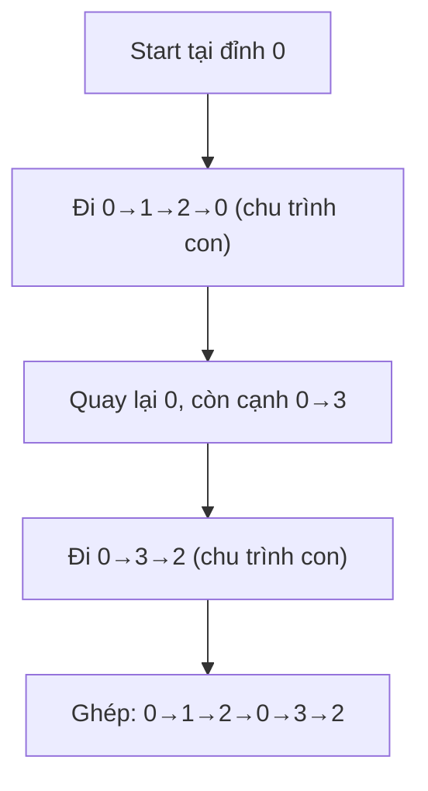

# Đường Đi - Chu Trình Euler

> **Tác giả:** FPTOJ Team<br>
> **Nội dung tham khảo từ:** VNOI Wiki, CP-Algorithms - Eulerian Path

---

## 1. Bản chất vấn đề

### Câu chuyện mở đầu: vẽ một nét và xếp Domino

Bạn từng chơi trò **vẽ một nét không nhấc bút**? Hay xếp bộ **Domino** sao cho số khớp nhau nối tiếp nhau hết cả bộ? Cả hai đều là một bài toán: đi qua **mỗi cạnh đúng một lần**. Năm 1736, Euler giải bài toán 7 cây cầu Königsberg bằng đúng tư duy này — khai sinh lý thuyết đồ thị.

### Bài toán: Đường đi qua mọi cạnh đúng 1 lần

Cho đồ thị $N$ đỉnh, $M$ cạnh. Tìm đường đi (hoặc chu trình) đi qua **mỗi cạnh đúng 1 lần**.

- **Đường đi Euler (Eulerian Path):** Đi qua mỗi cạnh đúng 1 lần, không cần quay về điểm đầu.
- **Chu trình Euler (Eulerian Circuit):** Đi qua mỗi cạnh đúng 1 lần, quay về điểm đầu.

### Điều kiện tồn tại

**Đồ thị vô hướng (liên thông):**

| Loại | Điều kiện |
|------|-----------|
| Chu trình Euler | Mọi đỉnh đều có **bậc chẵn** |
| Đường đi Euler | Có đúng **2 đỉnh bậc lẻ** (2 đỉnh đó là đầu và cuối) |

**Đồ thị có hướng (liên thông yếu):**

| Loại | Điều kiện |
|------|-----------|
| Chu trình Euler | Mọi đỉnh: $\text{in-degree} = \text{out-degree}$ |
| Đường đi Euler | Có đúng 1 đỉnh $\text{out} - \text{in} = 1$ (đầu) và 1 đỉnh $\text{in} - \text{out} = 1$ (cuối) |

---

## 2. Tư duy cốt lõi

### Hierholzer's Algorithm

**Ý tưởng:** Bắt đầu từ đỉnh đầu, đi theo cạnh chưa thăm cho đến khi quay về (hoặc hết đường). Nếu còn cạnh chưa thăm → chèn chu trình mới vào đường đi hiện tại.

**Tại sao không dùng DFS thường?** DFS có thể "cắt" đồ thị thành 2 phần không liên thông.

### Trace chi tiết

**Đồ thị:** 4 đỉnh, 5 cạnh (vô hướng).

| Cạnh |
|------|
| $0 - 1$ |
| $1 - 2$ |
| $2 - 0$ |
| $0 - 3$ |
| $3 - 2$ |

**Bậc:** $\text{deg}(0) = 3$, $\text{deg}(1) = 2$, $\text{deg}(2) = 3$, $\text{deg}(3) = 2$

Hai đỉnh bậc lẻ: 0 và 2 $\Rightarrow$ **Đường đi Euler** từ 0 đến 2 (hoặc ngược lại).

```matplotlib
fig, (ax1, ax2) = plt.subplots(1, 2, figsize=(12, 5))

conditions = ['Chu trình\n(vô hướng)', 'Đường đi\n(vô hướng)', 'Chu trình\n(có hướng)', 'Đường đi\n(có hướng)']
values = [4, 4, 4, 4]
colors = ['#2ecc71', '#3498db', '#e67e22', '#9b59b6']
labels = ['Mọi đỉnh\nbậc chẵn', '2 đỉnh\nbậc lẻ', 'in = out\nmọi đỉnh', '1 đỉnh out>in\n1 đỉnh in>out']

bars = ax1.bar(conditions, values, color=colors, alpha=0.8)
ax1.set_ylabel('Điều kiện')
ax1.set_title('Điều kiện tồn tại Euler Path/Circuit')
ax1.set_ylim(0, 5)
for bar, label in zip(bars, labels):
    ax1.text(bar.get_x() + bar.get_width()/2, bar.get_height() + 0.1,
             label, ha='center', va='bottom', fontsize=8)

nodes = [0, 1, 2, 3]
degrees = [3, 2, 3, 2]
colors_deg = ['#e74c3c' if d % 2 == 1 else '#2ecc71' for d in degrees]

bars2 = ax2.bar(nodes, degrees, color=colors_deg, alpha=0.8)
ax2.set_xlabel('Đỉnh')
ax2.set_ylabel('Bậc')
ax2.set_title('Bậc các đỉnh trong ví dụ\n(Đỏ = bậc lẻ, Xanh = bậc chẵn)')
ax2.set_xticks(nodes)
ax2.grid(True, alpha=0.3, axis='y')
for bar, d in zip(bars2, degrees):
    ax2.text(bar.get_x() + bar.get_width()/2, bar.get_height() + 0.05,
             str(d), ha='center', va='bottom', fontsize=10, fontweight='bold')

plt.tight_layout()
```

**Chạy Hierholzer từ đỉnh 0:**

| Bước | Đỉnh hiện tại | Cạnh chọn | Stack (đường đi) |
|------|---------------|-----------|------------------|
| 1 | 0 | 0→1 | $[0, 1]$ |
| 2 | 1 | 1→2 | $[0, 1, 2]$ |
| 3 | 2 | 2→0 | $[0, 1, 2, 0]$ |
| 4 | 0 | 0→3 | $[0, 1, 2, 0, 3]$ |
| 5 | 3 | 3→2 | $[0, 1, 2, 0, 3, 2]$ |

**Kết quả:** $0 \to 1 \to 2 \to 0 \to 3 \to 2$ — đi qua mỗi cạnh đúng 1 lần!

### Minh họa thuật toán


```mermaid
flowchart TD
    A["Start tại đỉnh 0"] --> B["Đi 0→1→2→0 (chu trình con)"]
    B --> C["Quay lại 0, còn cạnh 0→3"]
    C --> D["Đi 0→3→2 (chu trình con)"]
    D --> E["Ghép: 0→1→2→0→3→2"]
```

---

## 3. Phân tích tính đúng đắn

### Tại sao Hierholzer hoạt động?

**Bất biến:** Mọi đỉnh trong đồ thị Euler đều có bậc chẵn (hoặc chênh lệch đúng 1 cho đường đi). Khi đi qua 1 cạnh, bậc giảm đi 1. Do đó, khi "mắc kẹt" tại đỉnh $v$, bậc của $v$ = 0 (đã đi hết cạnh). Mọi đỉnh trung gian đều có bậc chẵn → khi đi vào thì phải đi ra được.

Điều này đảm bảo: khi "mắc kẹt", ta đã tạo 1 chu trình con. Nếu còn cạnh chưa thăm, chu trình con đó có thể chèn vào đường đi chính.

---

## 4. Đánh giá độ phức tạp

| Thuật toán | Thời gian | Không gian |
|------------|-----------|------------|
| Hierholzer | $O(N + M)$ | $O(N + M)$ |
| Fleury | $O(N \cdot M)$ | $O(N + M)$ |

Hierholzer tối ưu hơn Fleury vì không cần kiểm tra cầu.

---

## Code minh họa

### Đường đi Euler trên đồ thị có hướng

=== "C++"

    ```cpp
    #include <bits/stdc++.h>
    using namespace std;

    int main() {
        ios_base::sync_with_stdio(false);
        cin.tie(NULL);

        int n, m;
        cin >> n >> m;

        vector<vector<int>> adj(n); // Bước 1: danh sách kề có hướng
        vector<int> in_deg(n, 0), out_deg(n, 0); // Bước 2: đếm bán bậc vào/ra

        for (int i = 0; i < m; i++) { // Bước 3: đọc cạnh u -> v
            int u, v;
            cin >> u >> v;
            adj[u].push_back(v);
            out_deg[u]++;
            in_deg[v]++;
        }

        // Bước 4: kiểm tra điều kiện đường đi Euler có hướng
        int start = -1, end = -1; // start: out-in=1; end: in-out=1
        bool valid = true;
        for (int i = 0; i < n; i++) {
            if (out_deg[i] - in_deg[i] == 1) { // Bước 5: ứng viên đỉnh đầu
                if (start != -1) { valid = false; break; } // Bước 6: quá 1 đỉnh đầu -> loại
                start = i;
            } else if (in_deg[i] - out_deg[i] == 1) { // Bước 7: ứng viên đỉnh cuối
                if (end != -1) { valid = false; break; }
                end = i;
            } else if (in_deg[i] != out_deg[i]) { // Bước 8: lệch khác 1 -> loại
                valid = false;
                break;
            }
        }

        if (!valid) {
            cout << "Khong ton tai duong di Euler\n";
            return 0;
        }

        if (start == -1) start = 0; // Bước 9: không có đỉnh lệch -> chu trình, bắt đầu ở 0

        // Bước 10: thuật toán Hierholzer dùng ngăn xếp
        vector<int> path; // Bước 11: chứa các đỉnh theo thứ tự ngược lúc quay lui
        stack<int> stk;
        stk.push(start); // Bước 12: xuất phát từ đỉnh đầu

        // Bước 13: sắp xếp cạnh để ra thứ tự từ điển nhỏ nhất
        for (int i = 0; i < n; i++)
            sort(adj[i].begin(), adj[i].end());

        vector<int> ptr(n, 0); // Bước 14: con trỏ cạnh tiếp theo của mỗi đỉnh (mỗi cạnh xét 1 lần)

        while (!stk.empty()) { // Bước 15: còn đỉnh trong ngăn xếp thì đi tiếp
            int u = stk.top();
            if (ptr[u] < (int)adj[u].size()) { // Bước 16: còn cạnh chưa đi -> đi sâu
                stk.push(adj[u][ptr[u]++]);
            } else { // Bước 17: hết cạnh -> chốt u vào đường đi rồi quay lui
                path.push_back(u);
                stk.pop();
            }
        }

        reverse(path.begin(), path.end()); // Bước 18: đảo lại vì ghi theo thứ tự quay lui

        for (int v : path) cout << v << " ";
        cout << "\n";
        return 0;
    }
    ```

=== "Python"

    ```python
    from collections import deque
    import sys
    input = sys.stdin.readline

    # Bước 1: đọc đồ thị có hướng, đếm bán bậc vào/ra
    n, m = map(int, input().split())
    adj = [[] for _ in range(n)] # Bước 2: danh sách kề có hướng
    in_deg = [0] * n
    out_deg = [0] * n

    for _ in range(m): # Bước 3: đọc cạnh u -> v
        u, v = map(int, input().split())
        adj[u].append(v)
        out_deg[u] += 1
        in_deg[v] += 1

    # Bước 4: kiểm tra điều kiện (1 đỉnh đầu out-in=1, 1 đỉnh cuối in-out=1)
    start = end = -1
    valid = True
    for i in range(n):
        if out_deg[i] - in_deg[i] == 1: # Bước 5: ứng viên đỉnh đầu
            if start != -1:
                valid = False
                break
            start = i
        elif in_deg[i] - out_deg[i] == 1: # Bước 6: ứng viên đỉnh cuối
            if end != -1:
                valid = False
                break
            end = i
        elif in_deg[i] != out_deg[i]: # Bước 7: lệch khác 1 -> loại
            valid = False
            break

    if not valid:
        print("Khong ton tai duong di Euler")
        exit()

    if start == -1: # Bước 8: không lệch -> chu trình, bắt đầu ở 0
        start = 0

    # Bước 9: thuật toán Hierholzer dùng ngăn xếp
    for i in range(n): # Bước 10: sắp xếp để ra thứ tự từ điển
        adj[i].sort()

    ptr = [0] * n # Bước 11: con trỏ cạnh tiếp theo (mỗi cạnh xét 1 lần)
    path = [] # Bước 12: đỉnh chốt theo thứ tự quay lui (ngược)
    stack = [start] # Bước 13: xuất phát từ đỉnh đầu

    while stack: # Bước 14: còn đỉnh trong ngăn xếp thì đi tiếp
        u = stack[-1]
        if ptr[u] < len(adj[u]): # Bước 15: còn cạnh -> đi sâu
            stack.append(adj[u][ptr[u]])
            ptr[u] += 1
        else: # Bước 16: hết cạnh -> chốt u rồi quay lui
            path.append(u)
            stack.pop()

    path.reverse() # Bước 17: đảo lại vì ghi lúc quay lui
    print(*path)
    ```

---

## 5. Lỗi thường gặp (SAI / ĐÚNG)

### Lỗi 1: Chỉ kiểm tra bậc, quên liên thông yếu

**SAI:** mọi đỉnh bậc chẵn nhưng đồ thị rời rạc (2 cụm riêng) → kết luận có chu trình Euler.

```cpp
// SAI: chỉ đếm bậc
bool ok = true;
for (int i = 0; i < n; i++) if (deg[i] % 2) ok = false;
```

**ĐÚNG:** thêm BFS/DFS bỏ qua đỉnh cô lập, kiểm tra mọi đỉnh có cạnh đều tới được nhau.

```cpp
// ĐÚNG: bậc đúng + liên thông yếu (trên đồ thị vô hướng hóa)
bool ok = degreeOK && isWeaklyConnected(n, adj);
```

### Lỗi 2: Chọn đỉnh bắt đầu sai

**SAI:** luôn `start = 0` dù có 2 đỉnh bậc lẻ → đường đi bắt đầu giữa chừng, Hierholzer kẹt sớm.

```cpp
// SAI: cứng đỉnh 0
int start = 0;
```

**ĐÚNG:** đường đi Euler phải bắt đầu ở đỉnh bậc lẻ (có hướng: đỉnh `out - in = 1`); chỉ khi là chu trình mới lấy đỉnh bất kỳ có cạnh.

```cpp
// ĐÚNG: ưu tiên đỉnh lẻ, fallback về đỉnh có cạnh
if (start == -1) start = firstVertexWithEdge;
```

### Lỗi 3: Quên `reverse(path)`

**SAI:** in `path` trực tiếp → thứ tự ngược (vì đỉnh được chốt lúc quay lui).

```cpp
// SAI: thiếu đảo
for (int v : path) cout << v << " ";
```

**ĐÚNG:** luôn đảo trước khi in.

```cpp
// ĐÚNG: ghi lúc backtrack nên phải đảo
reverse(path.begin(), path.end());
for (int v : path) cout << v << " ";
```

---

## Bài tập luyện tập

| Bài | Nền tảng | Độ khó | Chủ đề |
|-----|----------|--------|--------|
| [euler-basic](https://fptoj.com/problem/euler-basic) | FPTOJ | ⭐⭐ | Chu trình Euler vô hướng |
| [euler-path](https://fptoj.com/problem/euler-path) | FPTOJ | ⭐⭐ | Đường đi Euler vô hướng |
| [euler-directed](https://fptoj.com/problem/euler-directed) | FPTOJ | ⭐⭐ | Chu trình Euler có hướng |
| [euler-reconstruct](https://fptoj.com/problem/euler-reconstruct) | FPTOJ | ⭐⭐⭐ | Đường đi Euler có hướng |
| [euler-domino](https://fptoj.com/problem/euler-domino) | FPTOJ | ⭐⭐⭐ | Sắp xếp Domino qua Euler |
| [euler-de-bruijn](https://fptoj.com/problem/euler-de-bruijn) | FPTOJ | ⭐⭐⭐⭐ | Chuỗi De Bruijn |
| [euler-word-chain](https://fptoj.com/problem/euler-word-chain) | FPTOJ | ⭐⭐⭐⭐ | Sắp xếp chuỗi từ tiếng Anh |
| [euler-postman](https://fptoj.com/problem/euler-postman) | FPTOJ | ⭐⭐⭐⭐⭐ | Người đưa thư Trung Hoa |
