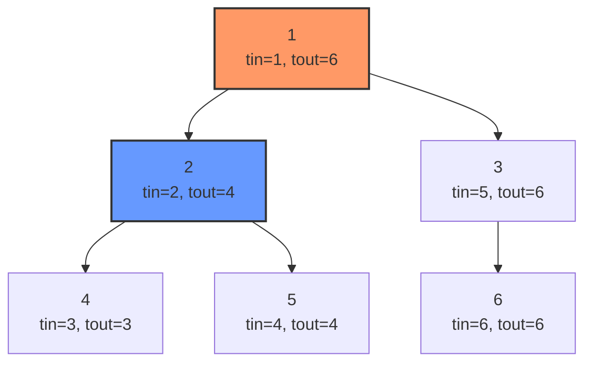
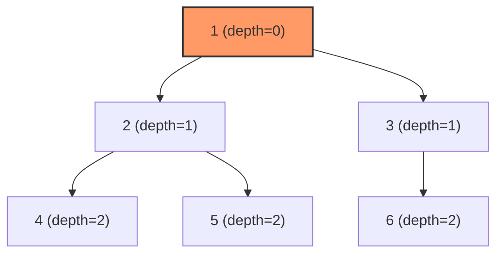

# Bài 44: Euler Tour trên cây - Biến cây thành mảng!

> **Tác giả:** FPTOJ Wiki<br>
> **Nội dung tham khảo từ:** VNOI Wiki, CP-Algorithms

---

## Bản chất vấn đề

Cây là cấu trúc dữ liệu phi tuyến tính — các đỉnh liên kết nhau theo dạng phân cấp, không có chỉ số đánh tuyến tính như mảng. Điều này khiến việc truy vấn trên cây (tổng subtree, cập nhật đường đi, tìm LCA) trở nên khó khăn nếu xử lý trực tiếp.

**Vấn đề cốt lõi:** Làm sao biến một cấu trúc cây thành một cấu trúc tuyến tính (mảng) để có thể dùng các cấu trúc dữ liệu quen thuộc như BIT, Segment Tree, Sparse Table?

**Euler Tour** là kỹ thuật giải quyết chính xác vấn đề này. Bằng cách duyệt DFS và ghi lại thứ tự thăm, ta "trải phẳng" cây thành mảng sao cho các tập hợp đỉnh có ý nghĩa (subtree, đường đi) trở thành các đoạn liên tục hoặc có thể xử lý bằng mảng hiệu.

Với cây có $N \leq 10^5$ đỉnh và $Q \leq 10^5$ truy vấn:

| Bài toán | Không có Euler Tour | Có Euler Tour |
|----------|-------------------|---------------|
| Tổng subtree | $O(N)$ mỗi truy vấn | $O(\log N)$ |
| Cập nhật + truy vấn subtree | $O(NQ)$ | $O(Q \log N)$ |
| LCA | $O(\log N)$ | $O(1)$ |

---

## Tư duy cốt lõi

### Nguyên lý: DFS Flatten

Khi duyệt DFS trên cây, mỗi đỉnh được "vào" một lần và "ra" một lần. Ghi lại hai thời điểm này ta được cặp giá trị $(tin[u], tout[u])$ cho mỗi đỉnh $u$.

**Tính chất then chốt:** Tất cả đỉnh trong subtree của $u$ tạo thành đoạn liên tục $[tin[u], tout[u]]$ trong mảng Euler Tour.

### Minh họa bằng Mermaid



Mảng Euler Tour (chỉ ghi đỉnh): $[1, 2, 4, 5, 3, 6]$

- Subtree của đỉnh 2: đoạn $[tin[2], tout[2]] = [2, 4]$ chứa các đỉnh $\{2, 4, 5\}$
- Subtree của đỉnh 3: đoạn $[tin[3], tout[3]] = [5, 6]$ chứa các đỉnh $\{3, 6\}$

### Các biến thể Euler Tour

**Loại 1 — Entry Only (mỗi đỉnh 1 lần):** Dùng cho truy vấn subtree (tổng, min, max trên đoạn).

**Loại 2 — Entry + Exit (mỗi đỉnh 2 lần):** Dùng cho cập nhật subtree kết hợp truy vấn đỉnh (mảng hiệu).

**Loại 3 — Edge Tour (mỗi cạnh 2 lần):** Ít phổ biến, dùng cho bài toán trên cạnh.

### Bài toán 1: Truy vấn kích thước subtree

Đây là ứng dụng đơn giản nhất. Khi đã có $tin[u]$ và $tout[u]$, kích thước subtree của $u$ chính là $tout[u] - tin[u] + 1$.

=== "C++"

    ```cpp
    #include <bits/stdc++.h>
    using namespace std;

    const int MAXN = 200005;
    vector<int> adj[MAXN];
    int tin[MAXN], tout[MAXN];
    int timer_dfs = 0;

    void dfs(int u, int parent) {
        tin[u] = ++timer_dfs;
        for (int v : adj[u]) {
            if (v != parent) {
                dfs(v, u);
            }
        }
        tout[u] = timer_dfs;
    }

    bool is_ancestor(int u, int v) {
        return tin[u] <= tin[v] && tout[v] <= tout[u];
    }

    int main() {
        ios_base::sync_with_stdio(false);
        cin.tie(nullptr);

        int n, q;
        cin >> n >> q;

        for (int i = 0; i < n - 1; i++) {
            int u, v;
            cin >> u >> v;
            adj[u].push_back(v);
            adj[v].push_back(u);
        }

        dfs(1, 0);

        while (q--) {
            int u;
            cin >> u;
            cout << tout[u] - tin[u] + 1 << "\n";
        }
        return 0;
    }
    ```

=== "Python"

    ```python
    import sys
    sys.setrecursionlimit(300000)

    def dfs(u, parent):
        global timer_dfs
        timer_dfs += 1
        tin[u] = timer_dfs
        for v in adj[u]:
            if v != parent:
                dfs(v, u)
        tout[u] = timer_dfs

    def is_ancestor(u, v):
        return tin[u] <= tin[v] and tout[v] <= tout[u]

    n, q = map(int, input().split())
    adj = [[] for _ in range(n + 1)]
    tin = [0] * (n + 1)
    tout = [0] * (n + 1)
    timer_dfs = 0

    for _ in range(n - 1):
        u, v = map(int, input().split())
        adj[u].append(v)
        adj[v].append(u)

    dfs(1, 0)

    for _ in range(q):
        u = int(input())
        print(tout[u] - tin[u] + 1)
    ```

### Bài toán 2: Truy vấn tổng subtree bằng BIT

**Bài toán:** Cho cây $N$ đỉnh, mỗi đỉnh có giá trị. Xử lý hai loại truy vấn:

- `UPDATE u val`: Gán giá trị đỉnh $u = val$
- `QUERY u`: Tính tổng giá trị các đỉnh trong subtree của $u$

**Ý tưởng:** Duyệt Euler Tour Loại 1, lưu giá trị đỉnh $u$ tại vị trí $tin[u]$ trong mảng BIT. Subtree của $u$ là đoạn $[tin[u], tout[u]]$, dùng BIT để tính tổng đoạn.

=== "C++"

    ```cpp
    #include <bits/stdc++.h>
    using namespace std;

    const int MAXN = 200005;
    vector<int> adj[MAXN];
    int tin[MAXN], tout[MAXN];
    long long val[MAXN];
    long long bit[MAXN];
    int timer_dfs = 0;
    int n, q;

    void update(int i, long long delta) {
        for (; i <= n; i += i & (-i))
            bit[i] += delta;
    }

    long long query(int i) {
        long long sum = 0;
        for (; i > 0; i -= i & (-i))
            sum += bit[i];
        return sum;
    }

    long long range_query(int l, int r) {
        return query(r) - query(l - 1);
    }

    void dfs(int u, int parent) {
        tin[u] = ++timer_dfs;
        for (int v : adj[u]) {
            if (v != parent) {
                dfs(v, u);
            }
        }
        tout[u] = timer_dfs;
    }

    int main() {
        ios_base::sync_with_stdio(false);
        cin.tie(nullptr);

        cin >> n >> q;
        for (int i = 1; i <= n; i++) cin >> val[i];

        for (int i = 0; i < n - 1; i++) {
            int u, v;
            cin >> u >> v;
            adj[u].push_back(v);
            adj[v].push_back(u);
        }

        dfs(1, 0);

        for (int i = 1; i <= n; i++) {
            update(tin[i], val[i]);
        }

        while (q--) {
            int type;
            cin >> type;
            if (type == 1) {
                int u;
                long long new_val;
                cin >> u >> new_val;
                long long delta = new_val - val[u];
                val[u] = new_val;
                update(tin[u], delta);
            } else {
                int u;
                cin >> u;
                cout << range_query(tin[u], tout[u]) << "\n";
            }
        }
        return 0;
    }
    ```

=== "Python"

    ```python
    import sys
    sys.setrecursionlimit(300000)

    def update(i, delta):
        while i <= n:
            bit[i] += delta
            i += i & (-i)

    def query(i):
        s = 0
        while i > 0:
            s += bit[i]
            i -= i & (-i)
        return s

    def range_query(l, r):
        return query(r) - query(l - 1)

    def dfs(u, parent):
        global timer_dfs
        timer_dfs += 1
        tin[u] = timer_dfs
        for v in adj[u]:
            if v != parent:
                dfs(v, u)
        tout[u] = timer_dfs

    input_data = sys.stdin.read().split()
    idx = 0
    n = int(input_data[idx]); idx += 1
    q = int(input_data[idx]); idx += 1

    val = [0] * (n + 1)
    for i in range(1, n + 1):
        val[i] = int(input_data[idx]); idx += 1

    adj = [[] for _ in range(n + 1)]
    for _ in range(n - 1):
        u = int(input_data[idx]); idx += 1
        v = int(input_data[idx]); idx += 1
        adj[u].append(v)
        adj[v].append(u)

    tin = [0] * (n + 1)
    tout = [0] * (n + 1)
    timer_dfs = 0
    dfs(1, 0)

    bit = [0] * (n + 1)
    for i in range(1, n + 1):
        update(tin[i], val[i])

    out = []
    for _ in range(q):
        t = int(input_data[idx]); idx += 1
        if t == 1:
            u = int(input_data[idx]); idx += 1
            new_val = int(input_data[idx]); idx += 1
            delta = new_val - val[u]
            val[u] = new_val
            update(tin[u], delta)
        else:
            u = int(input_data[idx]); idx += 1
            out.append(str(range_query(tin[u], tout[u])))

    print("\n".join(out))
    ```

### Bài toán 3: Truy vấn min/max trên subtree bằng Segment Tree

Tương tự BIT, nhưng thay vì tính tổng, ta lưu giá trị nhỏ nhất (hoặc lớn nhất) trên đoạn.

=== "C++"

    ```cpp
    #include <bits/stdc++.h>
    using namespace std;

    const int MAXN = 200005;
    const long long INF = 1e18;
    vector<int> adj[MAXN];
    int tin[MAXN], tout[MAXN];
    long long val[MAXN];
    long long tree[4 * MAXN];
    int timer_dfs = 0;
    int n;

    void build(int node, int start, int end) {
        if (start == end) {
            tree[node] = INF;
            return;
        }
        int mid = (start + end) / 2;
        build(2 * node, start, mid);
        build(2 * node + 1, mid + 1, end);
        tree[node] = min(tree[2 * node], tree[2 * node + 1]);
    }

    void update(int node, int start, int end, int pos, long long new_val) {
        if (start == end) {
            tree[node] = new_val;
            return;
        }
        int mid = (start + end) / 2;
        if (pos <= mid)
            update(2 * node, start, mid, pos, new_val);
        else
            update(2 * node + 1, mid + 1, end, pos, new_val);
        tree[node] = min(tree[2 * node], tree[2 * node + 1]);
    }

    long long query(int node, int start, int end, int l, int r) {
        if (r < start || end < l) return INF;
        if (l <= start && end <= r) return tree[node];
        int mid = (start + end) / 2;
        return min(query(2 * node, start, mid, l, r),
                   query(2 * node + 1, mid + 1, end, l, r));
    }

    void dfs(int u, int parent) {
        tin[u] = ++timer_dfs;
        for (int v : adj[u]) {
            if (v != parent) dfs(v, u);
        }
        tout[u] = timer_dfs;
    }

    int main() {
        ios_base::sync_with_stdio(false);
        cin.tie(nullptr);

        cin >> n;
        for (int i = 1; i <= n; i++) cin >> val[i];

        for (int i = 0; i < n - 1; i++) {
            int u, v; cin >> u >> v;
            adj[u].push_back(v);
            adj[v].push_back(u);
        }

        dfs(1, 0);
        build(1, 1, n);

        for (int i = 1; i <= n; i++) {
            update(1, 1, n, tin[i], val[i]);
        }

        int q; cin >> q;
        while (q--) {
            int type; cin >> type;
            if (type == 1) {
                int u; long long new_val;
                cin >> u >> new_val;
                val[u] = new_val;
                update(1, 1, n, tin[u], new_val);
            } else {
                int u; cin >> u;
                cout << query(1, 1, n, tin[u], tout[u]) << "\n";
            }
        }
        return 0;
    }
    ```

=== "Python"

    ```python
    import sys
    sys.setrecursionlimit(300000)

    INF = float('inf')

    def build(node, start, end):
        if start == end:
            tree[node] = INF
        else:
            mid = (start + end) // 2
            build(2 * node, start, mid)
            build(2 * node + 1, mid + 1, end)
            tree[node] = min(tree[2 * node], tree[2 * node + 1])

    def update(node, start, end, pos, new_val):
        if start == end:
            tree[node] = new_val
        else:
            mid = (start + end) // 2
            if pos <= mid:
                update(2 * node, start, mid, pos, new_val)
            else:
                update(2 * node + 1, mid + 1, end, pos, new_val)
            tree[node] = min(tree[2 * node], tree[2 * node + 1])

    def query(node, start, end, l, r):
        if r < start or end < l:
            return INF
        if l <= start and end <= r:
            return tree[node]
        mid = (start + end) // 2
        return min(query(2 * node, start, mid, l, r),
                   query(2 * node + 1, mid + 1, end, l, r))

    def dfs(u, parent):
        global timer_dfs
        timer_dfs += 1
        tin[u] = timer_dfs
        for v in adj[u]:
            if v != parent:
                dfs(v, u)
        tout[u] = timer_dfs

    input_data = sys.stdin.read().split()
    idx = 0
    n = int(input_data[idx]); idx += 1

    val = [0] * (n + 1)
    for i in range(1, n + 1):
        val[i] = int(input_data[idx]); idx += 1

    adj = [[] for _ in range(n + 1)]
    for _ in range(n - 1):
        u = int(input_data[idx]); idx += 1
        v = int(input_data[idx]); idx += 1
        adj[u].append(v)
        adj[v].append(u)

    tin = [0] * (n + 1)
    tout = [0] * (n + 1)
    timer_dfs = 0
    dfs(1, 0)

    tree = [0] * (4 * n + 5)
    build(1, 1, n)
    for i in range(1, n + 1):
        update(1, 1, n, tin[i], val[i])

    q = int(input_data[idx]); idx += 1
    out = []
    for _ in range(q):
        t = int(input_data[idx]); idx += 1
        if t == 1:
            u = int(input_data[idx]); idx += 1
            new_val = int(input_data[idx]); idx += 1
            update(1, 1, n, tin[u], new_val)
        else:
            u = int(input_data[idx]); idx += 1
            out.append(str(query(1, 1, n, tin[u], tout[u])))

    print("\n".join(out))
    ```

### Bài toán 4: Cập nhật subtree bằng Euler Tour Type 2 + Mảng hiệu

**Bài toán:** Cho cây $N$ đỉnh. Xử lý hai loại truy vấn:

- `UPDATE u val`: Cộng $val$ vào **tất cả đỉnh trong subtree** của $u$
- `QUERY u`: Truy vấn giá trị tại đỉnh $u$

**Ý tưởng:** Dùng Euler Tour Loại 2 (entry + exit). Mỗi đỉnh xuất hiện 2 lần. Dùng mảng hiệu (difference array):

- Cập nhật subtree $u$ với giá trị $val$: cộng $val$ tại $tin[u]$, trừ $val$ tại $tout[u] + 1$
- Truy vấn đỉnh $u$: lấy tổng tiền tố tại $tin[u]$

Điều này hoạt động vì tất cả vị trí trong phạm vi $[tin[u], tout[u]]$ đều nhận được $val$, còn các vị trí ngoài phạm vi thì không (hiệu triệt tiêu nhau).

=== "C++"

    ```cpp
    #include <bits/stdc++.h>
    using namespace std;

    const int MAXN = 200005;
    vector<int> adj[MAXN];
    int tin[MAXN], tout[MAXN];
    long long bit[2 * MAXN];
    int timer_dfs = 0;
    int n, q;

    void update(int i, long long delta) {
        for (; i <= 2 * n; i += i & (-i))
            bit[i] += delta;
    }

    long long query(int i) {
        long long sum = 0;
        for (; i > 0; i -= i & (-i))
            sum += bit[i];
        return sum;
    }

    void dfs(int u, int parent) {
        tin[u] = ++timer_dfs;
        for (int v : adj[u]) {
            if (v != parent) {
                dfs(v, u);
            }
        }
        tout[u] = ++timer_dfs;
    }

    void update_subtree(int u, long long val) {
        update(tin[u], val);
        update(tout[u] + 1, -val);
    }

    long long point_query(int u) {
        return query(tin[u]);
    }

    int main() {
        ios_base::sync_with_stdio(false);
        cin.tie(nullptr);

        cin >> n >> q;

        for (int i = 0; i < n - 1; i++) {
            int u, v;
            cin >> u >> v;
            adj[u].push_back(v);
            adj[v].push_back(u);
        }

        dfs(1, 0);

        for (int i = 1; i <= n; i++) {
            long long val;
            cin >> val;
            update_subtree(i, val);
        }

        while (q--) {
            int type;
            cin >> type;
            if (type == 1) {
                int u; long long val;
                cin >> u >> val;
                update_subtree(u, val);
            } else {
                int u;
                cin >> u;
                cout << point_query(u) << "\n";
            }
        }
        return 0;
    }
    ```

=== "Python"

    ```python
    import sys
    sys.setrecursionlimit(300000)

    def update(i, delta):
        while i <= 2 * n:
            bit[i] += delta
            i += i & (-i)

    def query(i):
        s = 0
        while i > 0:
            s += bit[i]
            i -= i & (-i)
        return s

    def dfs(u, parent):
        global timer_dfs
        timer_dfs += 1
        tin[u] = timer_dfs
        for v in adj[u]:
            if v != parent:
                dfs(v, u)
        timer_dfs += 1
        tout[u] = timer_dfs

    def update_subtree(u, val):
        update(tin[u], val)
        update(tout[u] + 1, -val)

    def point_query(u):
        return query(tin[u])

    input_data = sys.stdin.read().split()
    idx = 0
    n = int(input_data[idx]); idx += 1
    q = int(input_data[idx]); idx += 1

    adj = [[] for _ in range(n + 1)]
    for _ in range(n - 1):
        u = int(input_data[idx]); idx += 1
        v = int(input_data[idx]); idx += 1
        adj[u].append(v)
        adj[v].append(u)

    tin = [0] * (n + 1)
    tout = [0] * (n + 1)
    bit = [0] * (2 * n + 5)
    timer_dfs = 0
    dfs(1, 0)

    for i in range(1, n + 1):
        val = int(input_data[idx]); idx += 1
        update_subtree(i, val)

    out = []
    for _ in range(q):
        t = int(input_data[idx]); idx += 1
        if t == 1:
            u = int(input_data[idx]); idx += 1
            val = int(input_data[idx]); idx += 1
            update_subtree(u, val)
        else:
            u = int(input_data[idx]); idx += 1
            out.append(str(point_query(u)))

    print("\n".join(out))
    ```

### So sánh Loại 1 và Loại 2

| Loại | Mỗi đỉnh xuất hiện | Dùng cho |
|------|-------------------|----------|
| Type 1 (Entry Only) | 1 lần | Truy vấn subtree (tổng/min/max đoạn) |
| Type 2 (Entry + Exit) | 2 lần | Cập nhật subtree + truy vấn đỉnh (mảng hiệu) |

### Bài toán 5: LCA bằng Euler Tour + Sparse Table

Thay vì dùng Binary Lifting, ta có thể tìm LCA trong $O(1)$ bằng Euler Tour kết hợp RMQ.

**Bước 1:** Duyệt DFS, ghi đỉnh vào mảng $E$ mỗi lần thăm (bao gồm cả quay lui). Mỗi đỉnh xuất hiện nhiều lần.

**Bước 2:** Ghi $first[u]$ = chỉ số đầu tiên $u$ xuất hiện trong $E$.

**Bước 3:** $LCA(u, v)$ = đỉnh có depth nhỏ nhất trong $E[first[u] \dots first[v]]$.

Dùng Sparse Table để truy vấn min-depth trong $O(1)$.



Euler Tour: $E = [1, 2, 4, 2, 5, 2, 1, 3, 6, 3, 1]$

$first[1]=0,\ first[2]=1,\ first[4]=2,\ first[5]=4,\ first[3]=7,\ first[6]=8$

$E[2 \dots 4] = [4, 2, 5]$ với depth $[2, 1, 2]$ — min depth = 1 tại đỉnh 2, nên $LCA(4, 5) = 2$.

=== "C++"

    ```cpp
    #include <bits/stdc++.h>
    using namespace std;

    const int MAXN = 200005;
    const int LOG = 20;
    vector<int> adj[MAXN];
    int depth[MAXN];
    int euler[2 * MAXN];
    int first[MAXN];
    int euler_depth[2 * MAXN];
    int st[2 * MAXN][LOG];
    int log_table[2 * MAXN];
    int n, q, euler_cnt;

    void dfs(int u, int parent, int d) {
        depth[u] = d;
        euler[euler_cnt] = u;
        euler_depth[euler_cnt] = d;
        if (first[u] == -1) first[u] = euler_cnt;
        euler_cnt++;

        for (int v : adj[u]) {
            if (v != parent) {
                dfs(v, u, d + 1);
                euler[euler_cnt] = u;
                euler_depth[euler_cnt] = d;
                euler_cnt++;
            }
        }
    }

    void build_sparse_table() {
        int m = euler_cnt;
        log_table[1] = 0;
        for (int i = 2; i <= m; i++)
            log_table[i] = log_table[i / 2] + 1;

        for (int i = 0; i < m; i++)
            st[i][0] = i;

        for (int j = 1; (1 << j) <= m; j++) {
            for (int i = 0; i + (1 << j) - 1 < m; i++) {
                int left = st[i][j - 1];
                int right = st[i + (1 << (j - 1))][j - 1];
                st[i][j] = (euler_depth[left] < euler_depth[right]) ? left : right;
            }
        }
    }

    int query_rmq(int l, int r) {
        int k = log_table[r - l + 1];
        int left = st[l][k];
        int right = st[r - (1 << k) + 1][k];
        return (euler_depth[left] < euler_depth[right]) ? left : right;
    }

    int lca(int u, int v) {
        int l = first[u], r = first[v];
        if (l > r) swap(l, r);
        int idx = query_rmq(l, r);
        return euler[idx];
    }

    int main() {
        ios_base::sync_with_stdio(false);
        cin.tie(nullptr);

        cin >> n >> q;

        for (int i = 0; i < n - 1; i++) {
            int u, v;
            cin >> u >> v;
            adj[u].push_back(v);
            adj[v].push_back(u);
        }

        memset(first, -1, sizeof(first));
        euler_cnt = 0;
        dfs(1, 0, 0);
        build_sparse_table();

        while (q--) {
            int u, v;
            cin >> u >> v;
            cout << lca(u, v) << "\n";
        }
        return 0;
    }
    ```

=== "Python"

    ```python
    import sys
    sys.setrecursionlimit(300000)

    def dfs(u, parent, d):
        global euler_cnt
        depth[u] = d
        euler[euler_cnt] = u
        euler_depth[euler_cnt] = d
        if first[u] == -1:
            first[u] = euler_cnt
        euler_cnt += 1

        for v in adj[u]:
            if v != parent:
                dfs(v, u, d + 1)
                euler[euler_cnt] = u
                euler_depth[euler_cnt] = d
                euler_cnt += 1

    def build_sparse_table():
        m = euler_cnt
        log_table[1] = 0
        for i in range(2, m + 1):
            log_table[i] = log_table[i // 2] + 1

        for i in range(m):
            st[i][0] = i

        j = 1
        while (1 << j) <= m:
            i = 0
            while i + (1 << j) - 1 < m:
                left = st[i][j - 1]
                right = st[i + (1 << (j - 1))][j - 1]
                st[i][j] = left if euler_depth[left] < euler_depth[right] else right
                i += 1
            j += 1

    def query_rmq(l, r):
        k = log_table[r - l + 1]
        left = st[l][k]
        right = st[r - (1 << k) + 1][k]
        return left if euler_depth[left] < euler_depth[right] else right

    def lca(u, v):
        l, r = first[u], first[v]
        if l > r:
            l, r = r, l
        idx = query_rmq(l, r)
        return euler[idx]

    input_data = sys.stdin.read().split()
    idx = 0
    n = int(input_data[idx]); idx += 1
    q = int(input_data[idx]); idx += 1

    adj = [[] for _ in range(n + 1)]
    for _ in range(n - 1):
        u = int(input_data[idx]); idx += 1
        v = int(input_data[idx]); idx += 1
        adj[u].append(v)
        adj[v].append(u)

    depth = [0] * (n + 1)
    euler = [0] * (2 * n)
    euler_depth = [0] * (2 * n)
    first = [-1] * (n + 1)
    log_table = [0] * (2 * n + 1)
    st = [[0] * 20 for _ in range(2 * n)]
    euler_cnt = 0

    dfs(1, 0, 0)
    build_sparse_table()

    out = []
    for _ in range(q):
        u = int(input_data[idx]); idx += 1
        v = int(input_data[idx]); idx += 1
        out.append(str(lca(u, v)))

    print("\n".join(out))
    ```

### So sánh: LCA bằng Euler Tour vs Binary Lifting

| Tiêu chí | Binary Lifting | Euler Tour + RMQ |
|----------|---------------|-----------------|
| Tiền xử lý | $O(N \log N)$ | $O(N \log N)$ |
| Truy vấn | $O(\log N)$ | $O(1)$ |
| Bộ nhớ | $O(N \log N)$ | $O(N \log N)$ |
| Linh hoạt | Cao (khoảng cách, nhảy $k$ bước) | Chỉ LCA |

Dùng Euler Tour + RMQ khi cần truy vấn LCA rất nhiều lần ($\geq 10^5$). Dùng Binary Lifting khi cần linh hoạt hơn.

---

## Phân tích tính đúng đắn

### Tính chất: Subtree là đoạn liên tục

**Cần chứng minh:** Với mọi đỉnh $u$, tất cả đỉnh trong subtree của $u$ có $tin$ nằm trong đoạn $[tin[u], tout[u]]$, và không đỉnh nào ngoài subtree có $tin$ trong đoạn này.

**Chứng minh:** Trong DFS, khi thăm $u$, ta ghi $tin[u]$. Sau đó đệ quy thăm tất cả con $v_1, v_2, \dots, v_k$. Mỗi con $v_i$ và toàn bộ subtree của $v_i$ được thăm xong trước khi chuyển sang con tiếp theo. Cuối cùng ghi $tout[u]$.

Do đó:
- Mọi đỉnh $w$ trong subtree $u$: $tin[u] \leq tin[w] \leq tout[w] \leq tout[u]$
- Mọi đỉnh $w$ ngoài subtree $u$: hoặc $tin[w] < tin[u]$ hoặc $tin[w] > tout[u]$

Suy ra subtree $u$ ứng chính xác với đoạn $[tin[u], tout[u]]$.

### Tính chất: Mảng hiệu cho cập nhật subtree (Type 2)

Khi dùng Euler Tour Type 2 (entry + exit), mỗi đỉnh $u$ có $tin[u]$ (lần vào) và $tout[u]$ (lần ra). Dãy Euler Tour có $2N$ phần tử.

Khi cập nhật subtree $u$ với giá trị $val$:
- Cộng $val$ tại vị trí $tin[u]$
- Trừ $val$ tại vị trí $tout[u] + 1$

Tổng tiền tố tại vị trí $p$ sẽ nhận được $val$ khi và chỉ khi $tin[u] \leq p \leq tout[u]$. Điều này đúng vì:
- Nếu $p < tin[u]$: chưa gặp $+val$ nên tổng tiền tố không đổi
- Nếu $tin[u] \leq p \leq tout[u]$: đã gặp $+val$ nhưng chưa gặp $-val$, nên tổng tiền tố cộng thêm $val$
- Nếu $p > tout[u]$: đã gặp cả $+val$ và $-val$, hiệu triệt tiêu nhau

### Tính chất: LCA bằng RMQ

$E$ là mảng Euler Tour DFS (ghi đỉnh mỗi lần thăm, kể cả quay lại). $first[u]$ là vị trí đầu tiên $u$ xuất hiện trong $E$.

**Cần chứng minh:** $LCA(u, v)$ = đỉnh có depth nhỏ nhất trong đoạn $E[\min(first[u], first[v]) \dots \max(first[u], first[v])]$.

**Chứng minh:** Khi DFS từ $first[u]$ đến $first[v]$, đường đi trong cây đi từ $u$ lên $LCA(u,v)$ rồi xuống $v$. Đỉnh có depth nhỏ nhất trên đường này chính là $LCA(u,v)$. Mọi đỉnh khác trong đoạn $E$ đều có depth lớn hơn vì chúng nằm trong các nhánh phụ được thăm xen kẽ.

---

## Đánh giá độ phức tạp

### Tiền xử lý Euler Tour

- DFS duyệt qua mỗi đỉnh đúng 1 lần (Type 1) hoặc 2 lần (Type 2): $O(N)$
- Xây dựng BIT hoặc Segment Tree: $O(N)$ cho build, hoặc $O(N \log N)$ nếu cập nhật từng phần tử

### Truy vấn subtree (Type 1 + BIT/Segment Tree)

| Thao tác | BIT | Segment Tree |
|----------|-----|-------------|
| Cập nhật điểm | $O(\log N)$ | $O(\log N)$ |
| Truy vấn đoạn (tổng/min/max) | $O(\log N)$ | $O(\log N)$ |
| Bộ nhớ | $O(N)$ | $O(N)$ |

### Cập nhật subtree + truy vấn đỉnh (Type 2 + Mảng hiệu)

| Thao tác | Độ phức tạp |
|----------|------------|
| Cập nhật subtree | $O(\log N)$ (2 lần update BIT) |
| Truy vấn đỉnh | $O(\log N)$ (1 lần query BIT) |
| Bộ nhớ | $O(N)$ |

### LCA bằng Euler Tour + Sparse Table

| Thao tác | Độ phức tạp |
|----------|------------|
| Tiền xử lý | $O(N \log N)$ |
| Truy vấn LCA | $O(1)$ |
| Bộ nhớ | $O(N \log N)$ |

### Tổng hợp

| Bài toán | Kỹ thuật | Truy vấn | Bộ nhớ |
|----------|----------|---------|--------|
| Tổng/min/max subtree | Type 1 + BIT/SegTree | $O(\log N)$ | $O(N)$ |
| Cập nhật subtree + point query | Type 2 + BIT (mảng hiệu) | $O(\log N)$ | $O(N)$ |
| LCA | Euler Tour + Sparse Table | $O(1)$ | $O(N \log N)$ |
| Kiểm tra tổ tiên | Type 1 (chỉ cần $tin/tout$) | $O(1)$ | $O(N)$ |

---

## Cạm bẫy thường gặp

**Nhầm $tout[u] + 1$ trong Type 2:** Phải dùng `update(tout[u] + 1, -val)`, không phải `update(tout[u], -val)`. Nếu dùng $tout[u]$, chính đỉnh $u$ sẽ bị trừ mất giá trị.

**1-indexed vs 0-indexed:** BIT thường dùng 1-indexed ($i > 0$ trong vòng lặp). Cần nhất quán giữa chỉ số Euler Tour và BIT.

**Quên reset timer:** Khi chạy nhiều test case, phải đặt lại `timer_dfs = 0` trước mỗi test.

**Stack overflow:** Cây dạng dây (chain) với $N = 2 \times 10^5$ gây tràn stack. Giải pháp: dùng iterative DFS trong C++, hoặc `sys.setrecursionlimit(300000)` trong Python.

**Sparse Table so sánh sai:** Phải so sánh $euler\_depth$, không so sánh chỉ số mảng.

---

## Bài tập luyện tập

| Bài | Nền tảng | Độ khó | Chủ đề |
|-----|----------|--------|--------|
| [CSES - Subtree Queries](https://cses.fi/problemset/task/1137) | CSES | ⭐⭐ | Subtree sum với BIT |
| [CSES - Path Queries](https://cses.fi/problemset/task/1138) | CSES | ⭐⭐⭐ | Path sum Euler Tour |
| [CSES - Company Queries II](https://cses.fi/problemset/task/1688) | CSES | ⭐⭐ | LCA qua Euler Tour |
| [CF 383C - Propagating tree](https://codeforces.com/problemset/problem/383/C) | CF | ⭐⭐⭐ | Euler Tour + BIT |
| [SPOJ - QTREE](https://www.spoj.com/problems/QTREE/) | SPOJ | ⭐⭐⭐⭐ | Euler Tour + HLD |
| [VNOJ - AtCoder DP V - Subtree](https://oj.vnoi.info/problem/atcoder_dp_v) | VNOJ | ⭐⭐⭐⭐ | Rerooting + Euler Tour |
