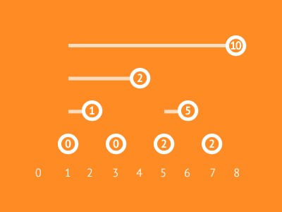
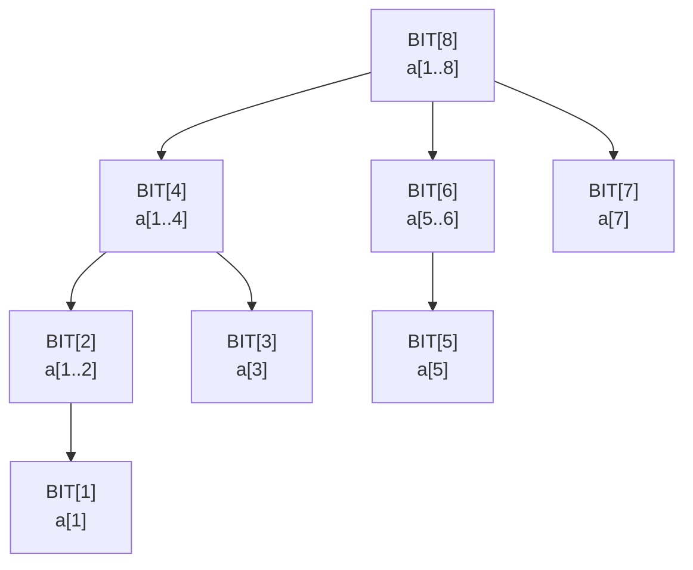
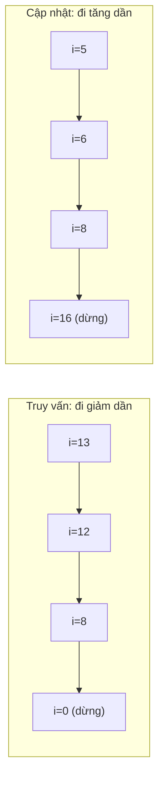
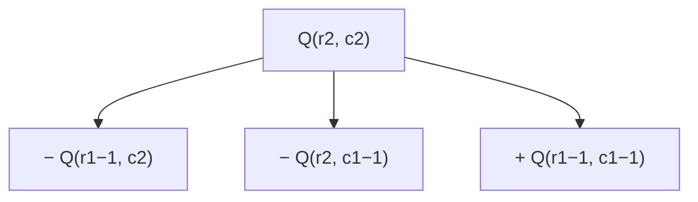

# Bài 8d: Fenwick Tree (BIT) — Cây Chỉ Số Nhị Phân

> **Tác giả:** Hà Trí Kiên
> **Nội dung tham khảo từ:** VNOI Wiki, CP-Algorithms, Topcoder

---

## Bản chất vấn đề

Cho mảng $a[1], a[2], \ldots, a[N]$. Cần hỗ trợ hai thao tác:

- **Cập nhật:** $a[i] \mathrel{+}= \delta$
- **Truy vấn tổng prefix:** tính $a[1] + a[2] + \cdots + a[p]$

Với mảng thường, mỗi truy vấn tổng prefix mất $O(N)$. Nếu có $Q$ truy vấn, tổng thời gian là $O(NQ)$ — quá chậm khi $N, Q$ lên đến $10^5$.

**Fenwick Tree** (còn gọi là Binary Indexed Tree, viết tắt BIT) giải quyết cả hai thao tác trong $O(\log N)$ với chỉ khoảng 10 dòng code, và sử dụng đúng $O(N)$ bộ nhớ.

<figure markdown="span">
  
  <figcaption>Minh họa Fenwick Tree (Nguồn: VisuAlgo)</figcaption>
</figure>

!!! tip "Thử tương tác"
    <iframe src="https://visualgo.net/en/fenwicktree" style="width: 100%; height: 500px; border: 1px solid #ccc; border-radius: 8px;"></iframe>

### So sánh với các phương pháp khác

| Tiêu chí | Prefix Sum | BIT | Segment Tree |
|----------|-----------|-----|--------------|
| Tổng prefix $[1..p]$ | $O(1)$ | $O(\log N)$ | $O(\log N)$ |
| Cập nhật $a[i]$ | $O(N)$ | $O(\log N)$ | $O(\log N)$ |
| Cập nhật đoạn | $O(1)$ (diff array) | $O(N \log N)$ | $O(\log N)$ với lazy |
| Bộ nhớ | $O(N)$ | $O(N)$ | $O(4N)$ |
| Độ dài code | Ngắn | Ngắn (~10 dòng) | Dài (~40 dòng) |
| Hỗ trợ min/max | Không | Không (trực tiếp) | Có |

---

## Tư duy cốt lõi

### Phép toán $i \mathbin{\&} (-i)$ — Bit thấp nhất

Trong máy tính, số nguyên âm được lưu dưới dạng **số bù 2** (Two's Complement):

1. Đảo tất cả các bit (phép NOT)
2. Cộng thêm 1

Khi thực hiện $i \mathbin{\&} (-i)$, kết quả là **duy nhất một bit** ở vị trí thấp nhất đang bật của $i$. Giá trị này gọi là `lowbit`.

Ví dụ với $i = 12$:

| Bước | Giá trị | Nhị phân |
|------|---------|----------|
| $i$ | $12$ | `1100` |
| Đảo bit | — | `0011` |
| Cộng 1 $\Rightarrow -i$ | $-12$ | `0100` |
| $i \mathbin{\&} (-i)$ | $4$ | `0100` |

$\Rightarrow$ lowbit của $12$ là $4$. Vậy `BIT[12]` quản lý block gồm 4 phần tử: $a[9], a[10], a[11], a[12]$.

Bảng các giá trị lowbit thường dùng:

| $i$ | Nhị phân | $i \mathbin{\&} (-i)$ | Block quản lý |
|-----|----------|----------------------|---------------|
| $1$ | `0001` | $1$ | $a[1]$ |
| $2$ | `0010` | $2$ | $a[1..2]$ |
| $3$ | `0011` | $1$ | $a[3]$ |
| $4$ | `0100` | $4$ | $a[1..4]$ |
| $5$ | `0101` | $1$ | $a[5]$ |
| $6$ | `0110` | $2$ | $a[5..6]$ |
| $7$ | `0111` | $1$ | $a[7]$ |
| $8$ | `1000` | $8$ | $a[1..8]$ |

Quy luật: số lẻ luôn có lowbit $= 1$. Số chẵn có lowbit dài hơn, phụ thuộc vào số bit $0$ ở cuối.

### Cấu trúc BIT

Mỗi vị trí $i$ trong BIT lưu tổng của một đoạn con:

$$\text{BIT}[i] = \sum_{k = i - \text{lowbit}(i) + 1}^{i} a[k]$$

Ví dụ với $N = 8$:

| $i$ | $\text{lowbit}(i)$ | $\text{BIT}[i]$ |
|-----|---------------------|-----------------|
| $1$ | $1$ | $a[1]$ |
| $2$ | $2$ | $a[1] + a[2]$ |
| $3$ | $1$ | $a[3]$ |
| $4$ | $4$ | $a[1] + a[2] + a[3] + a[4]$ |
| $5$ | $1$ | $a[5]$ |
| $6$ | $2$ | $a[5] + a[6]$ |
| $7$ | $1$ | $a[7]$ |
| $8$ | $8$ | $a[1] + a[2] + \cdots + a[8]$ |

Cấu trúc cây của BIT thể hiện quan hệ cha-con giữa các node:



### Truy vấn: Tổng prefix $[1..i]$

Để tính tổng $a[1] + \cdots + a[i]$, ta **cộng các BIT** theo hướng **giảm dần** — mỗi bước xóa bit thấp nhất:

Ví dụ tính $\text{prefix\_sum}(13)$:

| Bước | $i$ | Nhị phân | $\text{lowbit}$ | Lấy | $i$ mới |
|------|-----|----------|------------------|-----|---------|
| 1 | $13$ | `1101` | $1$ | $\text{BIT}[13] = a[13]$ | $12$ |
| 2 | $12$ | `1100` | $4$ | $\text{BIT}[12] = a[9..12]$ | $8$ |
| 3 | $8$ | `1000` | $8$ | $\text{BIT}[8] = a[1..8]$ | $0$ |

Dừng vì $i = 0$.

$$\text{prefix\_sum}(13) = \text{BIT}[13] + \text{BIT}[12] + \text{BIT}[8] = a[1..13]$$

Tổng cộng chỉ 3 bước thay vì 13 phép cộng. Hướng đi giảm dần vì khi xóa bit thấp nhất của $i$, ta nhảy đến vị trí BIT quản lý đoạn trước đó.

### Cập nhật: Cộng $\delta$ vào vị trí $i$

Khi cập nhật $a[i]$, cần cập nhật **tất cả BIT "bao chứa" $i$** — đi theo hướng **tăng dần** — mỗi bước thêm bit thấp nhất:

Ví dụ cập nhật $a[5] \mathrel{+}= 3$:

| Bước | $i$ | Nhị phân | $\text{lowbit}$ | Thao tác | $i$ mới |
|------|-----|----------|------------------|----------|---------|
| 1 | $5$ | `101` | $1$ | $\text{BIT}[5] \mathrel{+}= 3$ | $6$ |
| 2 | $6$ | `110` | $2$ | $\text{BIT}[6] \mathrel{+}= 3$ | $8$ |
| 3 | $8$ | `1000` | $8$ | $\text{BIT}[8] \mathrel{+}= 3$ | $16$ |

Dừng vì $16 > N$.

Hướng đi tăng dần vì khi thêm bit thấp nhất của $i$, ta nhảy đến BIT cha (quản lý đoạn lớn hơn có chứa vị trí $i$).



---

## Phân tích tính đúng đắn

### BIT cơ bản

Mọi số nguyên dương $i$ đều biểu diễn được dưới dạng tổng các lũy thừa của 2 dựa trên các bit bật. Phép $i \mathbin{\&} (-i)$ tách ra bit thấp nhất, đảm bảo:

- **Truy vấn:** Khi đi từ $i$ về $0$ bằng cách lần lượt xóa bit thấp nhất, ta ghép đúng tất cả các đoạn con tạo nên $a[1..i]$ — không bỏ sót, không trùng lắp.
- **Cập nhật:** Khi đi từ $i$ lên bằng cách lần lượt thêm bit thấp nhất, ta chạm đúng tất cả các BIT node có đoạn chứa vị trí $i$.

Số bước trong cả hai thao tác bằng đúng số bit bật của $i$, tức là tối đa $\lfloor \log_2 N \rfloor + 1$.

### Xây dựng BIT

Xây BIT bằng cách gọi `update(i, a[i])` cho từng $i$ từ $1$ đến $N$. Mỗi `update` mất $O(\log N)$, tổng thời gian $O(N \log N)$.

Có thể tối ưu xuống $O(N)$ bằng cách tính tổng prefix rồi trừ dần, nhưng cách $O(N \log N)$ đơn giản hơn và đủ nhanh trong thi đấu.

### BIT 2D

Mở rộng BIT 1D thành 2 chiều bằng cách dùng hai vòng lặp lồng nhau:

$$\text{BIT}[i][j] \text{ quản lý tổng vùng hình chữ nhật tương ứng}$$

Truy vấn tổng vùng $(1,1) \to (r,c)$ dùng nguyên lý **bao hàm-xử trừ** (inclusion-exclusion):

$$\text{rangeSum}(r_1, c_1, r_2, c_2) = Q(r_2, c_2) - Q(r_1-1, c_2) - Q(r_2, c_1-1) + Q(r_1-1, c_1-1)$$

trong đó $Q(r,c)$ là tổng prefix từ $(1,1)$ đến $(r,c)$.



### Range Update + Point Query (Cập nhật đoạn, truy vấn điểm)

Sử dụng **mảng hiệu** $d[]$ sao cho $a[i] = d[1] + d[2] + \cdots + d[i]$.

Khi cộng $\text{val}$ cho $a[l]..a[r]$:

- $d[l] \mathrel{+}= \text{val}$ (bắt đầu cộng từ $l$)
- $d[r+1] \mathrel{-}= \text{val}$ (dừng cộng từ $r+1$)

Truy vấn $a[i]$ chính là tổng prefix $d[1..i]$ — dùng BIT trên mảng $d$.

### Range Update + Range Query (Cập nhật đoạn, truy vấn đoạn)

Đây là trường hợp tổng quát nhất, cần **2 BIT**.

Khi cộng $\text{val}$ cho $a[l]..a[r]$, tổng prefix $S(x) = a[1] + \cdots + a[x]$ thay đổi:

- Nếu $x < l$: $S(x)$ không đổi
- Nếu $l \le x \le r$: $S(x)$ tăng thêm $\text{val} \cdot (x - l + 1)$
- Nếu $x > r$: $S(x)$ tăng thêm $\text{val} \cdot (r - l + 1)$

Biến đổi: $\text{val} \cdot (x - l + 1) = \text{val} \cdot x - \text{val} \cdot (l-1)$

Vậy ta duy trì 2 BIT:

$$S(x) = \text{BIT}_1.\text{query}(x) \cdot x - \text{BIT}_2.\text{query}(x)$$

Khi `range_update(l, r, val)`:

| BIT | Cập nhật tại $l$ | Cập nhật tại $r+1$ |
|-----|-------------------|---------------------|
| $\text{BIT}_1$ | $+\text{val}$ | $-\text{val}$ |
| $\text{BIT}_2$ | $+\text{val} \cdot (l-1)$ | $-\text{val} \cdot r$ |

---

## Đánh giá độ phức tạp

| Thao tác | BIT 1D | BIT 2D |
|----------|--------|--------|
| Cập nhật 1 điểm | $O(\log N)$ | $O(\log N \cdot \log M)$ |
| Truy vấn tổng prefix | $O(\log N)$ | $O(\log N \cdot \log M)$ |
| Xây dựng | $O(N \log N)$ | $O(NM \log N \log M)$ |
| Bộ nhớ | $O(N)$ | $O(NM)$ |

So với Segment Tree, BIT nhanh hơn về mặt hằng số vì truy cập bộ nhớ tuyến tính hơn (ít cache miss). Code cũng ngắn hơn nhiều — chỉ 2 hàm `update` và `query`.

---

## Code

### BIT cơ bản

=== "C++"

    ```cpp
    #include <bits/stdc++.h>
    using namespace std;

    const int MAXN = 200005;
    int bit[MAXN];
    int n;

    void update(int i, int delta) {
        for (; i <= n; i += i & (-i))
            bit[i] += delta;
    }

    int query(int i) {
        int sum = 0;
        for (; i > 0; i -= i & (-i))
            sum += bit[i];
        return sum;
    }

    int rangeSum(int l, int r) {
        return query(r) - query(l - 1);
    }

    int main() {
        ios_base::sync_with_stdio(false);
        cin.tie(NULL);

        cin >> n;
        for (int i = 1; i <= n; i++) {
            int val;
            cin >> val;
            update(i, val);
        }

        int q;
        cin >> q;
        while (q--) {
            int type, l, r;
            cin >> type >> l >> r;
            if (type == 1) {
                update(l, r);
            } else {
                cout << rangeSum(l, r) << "\n";
            }
        }
    }
    ```

=== "Python"

    ```python
    class FenwickTree:
        def __init__(self, n):
            self.n = n
            self.bit = [0] * (n + 1)

        def update(self, i, delta):
            while i <= self.n:
                self.bit[i] += delta
                i += i & (-i)

        def query(self, i):
            s = 0
            while i > 0:
                s += self.bit[i]
                i -= i & (-i)
            return s

        def range_sum(self, l, r):
            return self.query(r) - self.query(l - 1)

    n = int(input())
    a = [0] + list(map(int, input().split()))

    bit = FenwickTree(n)
    for i in range(1, n + 1):
        bit.update(i, a[i])

    q = int(input())
    for _ in range(q):
        parts = list(map(int, input().split()))
        if parts[0] == 1:
            bit.update(parts[1], parts[2])
        else:
            print(bit.range_sum(parts[1], parts[2]))
    ```

### BIT 2D

=== "C++"

    ```cpp
    const int MAXN = 1005;
    int bit2d[MAXN][MAXN];
    int n, m;

    void update(int r, int c, int delta) {
        for (int i = r; i <= n; i += i & (-i))
            for (int j = c; j <= m; j += j & (-j))
                bit2d[i][j] += delta;
    }

    int query(int r, int c) {
        int sum = 0;
        for (int i = r; i > 0; i -= i & (-i))
            for (int j = c; j > 0; j -= j & (-j))
                sum += bit2d[i][j];
        return sum;
    }

    int rangeSum(int r1, int c1, int r2, int c2) {
        return query(r2, c2)
             - query(r1 - 1, c2)
             - query(r2, c1 - 1)
             + query(r1 - 1, c1 - 1);
    }
    ```

=== "Python"

    ```python
    class FenwickTree2D:
        def __init__(self, n, m):
            self.n = n
            self.m = m
            self.bit = [[0] * (m + 1) for _ in range(n + 1)]

        def update(self, r, c, delta):
            i = r
            while i <= self.n:
                j = c
                while j <= self.m:
                    self.bit[i][j] += delta
                    j += j & (-j)
                i += i & (-i)

        def query(self, r, c):
            s = 0
            i = r
            while i > 0:
                j = c
                while j > 0:
                    s += self.bit[i][j]
                    j -= j & (-j)
                i -= i & (-i)
            return s

        def range_sum(self, r1, c1, r2, c2):
            return (self.query(r2, c2)
                  - self.query(r1 - 1, c2)
                  - self.query(r2, c1 - 1)
                  + self.query(r1 - 1, c1 - 1))
    ```

### Range Update + Point Query

=== "C++"

    ```cpp
    int bit[MAXN];
    int n;

    void _update(int i, int delta) {
        for (; i <= n; i += i & (-i))
            bit[i] += delta;
    }

    int _query(int i) {
        int sum = 0;
        for (; i > 0; i -= i & (-i))
            sum += bit[i];
        return sum;
    }

    void range_update(int l, int r, int val) {
        _update(l, val);
        _update(r + 1, -val);
    }

    int point_query(int i) {
        return _query(i);
    }
    ```

=== "Python"

    ```python
    class BITRangeUpdatePointQuery:
        def __init__(self, n):
            self.n = n
            self.bit = [0] * (n + 1)

        def _update(self, i, delta):
            while i <= self.n:
                self.bit[i] += delta
                i += i & (-i)

        def _query(self, i):
            s = 0
            while i > 0:
                s += self.bit[i]
                i -= i & (-i)
            return s

        def range_update(self, l, r, val):
            self._update(l, val)
            self._update(r + 1, -val)

        def point_query(self, i):
            return self._query(i)
    ```

### Range Update + Range Query

=== "C++"

    ```cpp
    const int MAXN = 200005;
    long long bit1[MAXN], bit2[MAXN];
    int n;

    void _update(long long bit[], int i, long long delta) {
        for (; i <= n; i += i & (-i))
            bit[i] += delta;
    }

    long long _query(long long bit[], int i) {
        long long sum = 0;
        for (; i > 0; i -= i & (-i))
            sum += bit[i];
        return sum;
    }

    void range_update(int l, int r, long long val) {
        _update(bit1, l, val);
        _update(bit1, r + 1, -val);
        _update(bit2, l, val * (l - 1));
        _update(bit2, r + 1, -val * r);
    }

    long long prefix_sum(int i) {
        return _query(bit1, i) * i - _query(bit2, i);
    }

    long long range_sum(int l, int r) {
        return prefix_sum(r) - prefix_sum(l - 1);
    }
    ```

=== "Python"

    ```python
    class BITRangeUpdateRangeQuery:
        def __init__(self, n):
            self.n = n
            self.bit1 = [0] * (n + 1)
            self.bit2 = [0] * (n + 1)

        def _update(self, bit, i, delta):
            while i <= self.n:
                bit[i] += delta
                i += i & (-i)

        def _query(self, bit, i):
            s = 0
            while i > 0:
                s += bit[i]
                i -= i & (-i)
            return s

        def range_update(self, l, r, val):
            self._update(self.bit1, l, val)
            self._update(self.bit1, r + 1, -val)
            self._update(self.bit2, l, val * (l - 1))
            self._update(self.bit2, r + 1, -val * r)

        def prefix_sum(self, i):
            return self._query(self.bit1, i) * i - self._query(self.bit2, i)

        def range_sum(self, l, r):
            return self.prefix_sum(r) - self.prefix_sum(l - 1)
    ```

---

## Lưu ý và cạm bẫy

### Luôn 1-indexed

BIT bắt đầu từ index $1$. Nếu mảng gốc 0-indexed, cập nhật BIT tại index $i+1$. Gọi `update(0, delta)` gây vòng lặp vô hạn vì $0 + (0 \mathbin{\&} 0) = 0$.

### Khi thay đổi giá trị

Phải trừ giá trị cũ trước khi cộng giá trị mới:

```cpp
int oldVal = a[pos];
a[pos] = newVal;
update(pos, newVal - oldVal);
```

### Integer overflow

Dùng `long long` khi giá trị hoặc tổng có thể vượt $2^{31} - 1$.

### Điều kiện dừng trong query

Vòng lặp phải là `i > 0`, không phải `i >= 0`. Nếu $i = 0$: $i - (i \mathbin{\&} (-i)) = 0$ → lặp vô hạn.

---

## Bài tập luyện tập

| Bài | Nền tảng | Độ khó | Ghi chú |
|-----|----------|--------|---------|
| [CSES - Dynamic Range Sum Queries](https://cses.fi/problemset/task/1648) | CSES | Trung bình | BIT cơ bản |
| [CSES - Salary Queries](https://cses.fi/problemset/task/1144) | CSES | Trung bình+ | BIT + Coordinate Compression |
| [CSES - Prefix Sum Queries](https://cses.fi/problemset/task/2166) | CSES | Trung bình+ | BIT nâng cao |
| [CSES - Range Update Queries](https://cses.fi/problemset/task/1651) | CSES | Trung bình+ | BIT range update |
| [LeetCode - Count of Smaller Numbers After Self](https://leetcode.com/problems/count-of-smaller-numbers-after-self/) | LeetCode | Trung bình+ | BIT / Segment Tree |
| [SPOJ - UPDATEIT](https://www.spoj.com/problems/UPDATEIT/) | SPOJ | Trung bình | Range Update + Point Query |
| [SPOJ - HORRIBLE](https://www.spoj.com/problems/HORRIBLE/) | SPOJ | Trung bình+ | Range Update + Range Query |

---

## Tài liệu tham khảo

- [CP-Algorithms — Fenwick Tree](https://cp-algorithms.com/data_structures/fenwick.html)
- [Topcoder — Binary Indexed Trees](https://www.topcoder.com/community/competitive-programming/tutorials/binary-indexed-trees/)
- [VNOI Wiki — Fenwick Tree](https://wiki.vnoi.info/algo/data-structures/fenwick)
- [USACO Guide — Fenwick Tree](https://usaco.guide/plat/Fenwick?lang=cpp)
