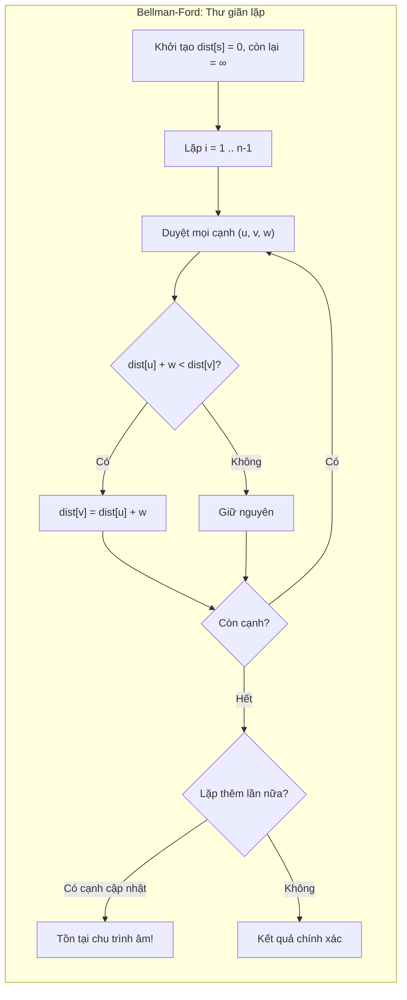
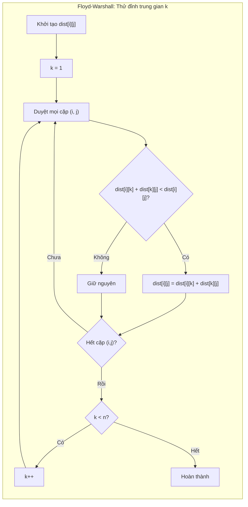

# Bài 23: Floyd-Warshall & Bellman-Ford

> **Tác giả:** FPTOJ Team<br>
> **Nội dung tham khảo từ:** VNOI Wiki - Các thuật toán về tìm đường đi ngắn nhất

---

## 1. Bellman-Ford — Đường đi ngắn nhất có trọng số âm

### Bản chất vấn đề

Cho đồ thị có hướng $G = (V, E)$ với $|V| = n$ đỉnh, $|E| = m$ cạnh, mỗi cạnh có trọng số $w(u,v)$ **có thể âm**. Cho đỉnh nguồn $s$. Tìm đường đi ngắn nhất từ $s$ đến mọi đỉnh $v \in V$, hoặc phát hiện tồn tại **chu trình âm** (negative cycle).

Đây là mở rộng của bài toán đường đi ngắn nhất một nguồn (Single-Source Shortest Path — SSSP) mà Dijkstra không giải được khi có trọng số âm.

### Tư duy cốt lõi

**Vấn đề của Dijkstra với trọng số âm:**

Dijkstra chọn đỉnh chưa thăm có $dist$ nhỏ nhất rồi đánh dấu "xong". Nhưng khi có cạnh âm, một đỉnh đã đánh dấu có thể được cải thiện qua đường đi khác chứa cạnh âm → kết quả sai.

**Ý tưởng Bellman-Ford — Thư giãn lặp:**

Thay vì chọn đỉnh "tốt nhất", Bellman-Ford duyệt **tất cả** cạnh và cập nhật (thư giãn) nếu tìm được đường ngắn hơn. Lặp lại $n - 1$ lần.



**Thư giãn (Relaxation)** là thao tác cốt lõi: kiểm tra xem đường đi từ $s$ đến $v$ qua $u$ có ngắn hơn đường đi hiện tại hay không. Nếu có, cập nhật:

$$dist[v] \leftarrow dist[u] + w(u, v)$$

=== "C++"

    ```cpp
    bool bellmanFord(int n, int s, vector<tuple<int,int,int>>& edges,
                     vector<long long>& dist) {
        dist.assign(n + 1, LLONG_MAX);
        dist[s] = 0;

        for (int i = 1; i < n; i++) {
            for (auto [u, v, w] : edges) {
                if (dist[u] != LLONG_MAX && dist[u] + w < dist[v])
                    dist[v] = dist[u] + w;
            }
        }

        for (auto [u, v, w] : edges) {
            if (dist[u] != LLONG_MAX && dist[u] + w < dist[v])
                return true;
        }
        return false;
    }
    ```

=== "Python"

    ```python
    def bellman_ford(n, s, edges):
        dist = [float('inf')] * (n + 1)
        dist[s] = 0

        for _ in range(n - 1):
            for u, v, w in edges:
                if dist[u] != float('inf') and dist[u] + w < dist[v]:
                    dist[v] = dist[u] + w

        for u, v, w in edges:
            if dist[u] != float('inf') and dist[u] + w < dist[v]:
                return True, dist
        return False, dist
    ```

### Phân tích tính đúng đắn

**Vì sao lặp đúng $n - 1$ lần?**

Đường đi ngắn nhất trong đồ thị $n$ đỉnh đi qua tối đa $n - 1$ cạnh (nếu $\geq n$ cạnh thì có chu trình, và chu trình âm sẽ bị phát hiện riêng).

Khi lặp lần thứ $i$, Bellman-Ford đã tìm được đường đi ngắn nhất sử dụng tối đa $i$ cạnh. Sau $n - 1$ lần lặp, mọi đường đi ngắn nhất (tối đa $n - 1$ cạnh) đều đã được tìm thấy.

**Vì sao kiểm tra thêm lần thứ $n$?**

Nếu sau $n - 1$ lần lặp vẫn tồn tại cạnh $(u, v)$ sao cho $dist[u] + w < dist[v]$, nghĩa là có đường đi sử dụng $\geq n$ cạnh mà vẫn cải thiện được → đường đi này chứa **chu trình âm** → có thể ngắn mãi mãi.

**Minh họa phát hiện chu trình âm:**

Xét đồ thị 3 đỉnh với các cạnh có hướng:

| Cạnh | Trọng số |
|------|----------|
| $1 \to 2$ | $1$ |
| $2 \to 3$ | $-1$ |
| $3 \to 2$ | $-1$ |

Biến động $dist$ qua các lần lặp (khởi tạo từ đỉnh $1$):

| Lặp | $dist[1]$ | $dist[2]$ | $dist[3]$ | Cạnh cập nhật |
|-----|-----------|-----------|-----------|---------------|
| Khởi tạo | $0$ | $\infty$ | $\infty$ | — |
| 1 | $0$ | $1$ | $0$ | $1 \to 2$, $2 \to 3$ |
| 2 | $0$ | $-1$ | $-2$ | $3 \to 2$, $2 \to 3$ |
| Kiểm tra | — | $-3$ | — | $3 \to 2$ vẫn cải thiện → chu trình âm! |

### Đánh giá độ phức tạp

| Yếu tố | Độ phức tạp |
|---------|-------------|
| Thời gian | $O(nm)$ — $n - 1$ lần lặp, mỗi lần duyệt $m$ cạnh |
| Không gian | $O(n + m)$ — mảng $dist$ và danh sách cạnh |

**So sánh với Dijkstra:**

- Dijkstra: $O(m \log n)$ với min-heap, nhưng **không xử lý được** trọng số âm.
- Bellman-Ford: $O(nm)$, chậm hơn, nhưng **xử lý được** trọng số âm và **phát hiện chu trình âm**.

---

## 2. Floyd-Warshall — Đường đi ngắn nhất mọi cặp

### Bản chất vấn đề

Cho đồ thị $G = (V, E)$ với $n$ đỉnh, mỗi cạnh có trọng số $w(u,v)$ (có thể âm, nhưng **không có chu trình âm**). Tìm đường đi ngắn nhất giữa **mọi cặp** đỉnh $(i, j)$.

Đây là bài toán All-Pairs Shortest Path (APSP). Nếu chạy Bellman-Ford từ mỗi đỉnh sẽ mất $O(n^2 m)$, quá chậm. Floyd-Warshall giải quyết trong $O(n^3)$.

### Tư duy cốt lõi

**Ý tưởng — Quy hoạch động 3 chiều:**

Gọi $dist[i][j]$ là độ dài đường đi ngắn nhất từ $i$ đến $j$. Floyd-Warshall duyệt qua các đỉnh trung gian $k = 1, 2, \ldots, n$ và cập nhật:

$$dist[i][j] = \min(dist[i][j],\ dist[i][k] + dist[k][j])$$

Sau khi xử lý xong đỉnh trung gian $k$, mảng $dist$ chứa đường đi ngắn nhất giữa mọi cặp đỉnh mà chỉ đi qua các đỉnh trung gian thuộc tập $\{1, 2, \ldots, k\}$.



=== "C++"

    ```cpp
    void floydWarshall(int n, vector<vector<long long>>& dist) {
        for (int k = 1; k <= n; k++) {
            for (int i = 1; i <= n; i++) {
                for (int j = 1; j <= n; j++) {
                    if (dist[i][k] != LLONG_MAX && dist[k][j] != LLONG_MAX)
                        dist[i][j] = min(dist[i][j], dist[i][k] + dist[k][j]);
                }
            }
        }
    }
    ```

=== "Python"

    ```python
    def floyd_warshall(n, dist):
        for k in range(1, n + 1):
            for i in range(1, n + 1):
                for j in range(1, n + 1):
                    if dist[i][k] != float('inf') and dist[k][j] != float('inf'):
                        dist[i][j] = min(dist[i][j], dist[i][k] + dist[k][j])
    ```

### Phân tích tính đúng đắn

**Giải thích thứ tự vòng lặp — $k$ PHẢI ở ngoài cùng:**

Vòng lặp $k$ là đỉnh trung gian. Khi xét $k$, giả thiết là ta đã biết đường đi ngắn nhất giữa mọi cặp đỉnh chỉ dùng đỉnh trung gian $\{1, \ldots, k-1\}$. Câu hỏi: đi qua đỉnh $k$ có tốt hơn không?

Nếu $k$ nằm trong cùng, ta sẽ cập nhật $dist[i][j]$ bằng $dist[i][k]$ và $dist[k][j]$ mà có thể **chưa được cập nhật** với đầy đủ đỉnh trung gian → sai hoàn toàn.

**Khởi tạo:**

- $dist[i][i] = 0$ cho mọi $i$.
- $dist[i][j] = w(i, j)$ nếu có cạnh $(i, j)$.
- $dist[i][j] = \infty$ nếu không có cạnh trực tiếp.

**Phát hiện chu trình âm:**

Sau khi chạy Floyd-Warshall, nếu $dist[i][i] < 0$ thì đỉnh $i$ nằm trong một chu trình âm.

**Truy vết đường đi:**

Dùng mảng $next[i][j]$ để lưu đỉnh kề tiếp theo trên đường đi ngắn nhất từ $i$ đến $j$.

=== "C++"

    ```cpp
    int next[MAXN][MAXN];

    void floydWithPath(int n, vector<vector<long long>>& dist) {
        for (int i = 1; i <= n; i++)
            for (int j = 1; j <= n; j++)
                next[i][j] = (i != j && dist[i][j] < LLONG_MAX) ? j : -1;

        for (int k = 1; k <= n; k++) {
            for (int i = 1; i <= n; i++) {
                for (int j = 1; j <= n; j++) {
                    if (dist[i][k] != LLONG_MAX && dist[k][j] != LLONG_MAX &&
                        dist[i][k] + dist[k][j] < dist[i][j]) {
                        dist[i][j] = dist[i][k] + dist[k][j];
                        next[i][j] = next[i][k];
                    }
                }
            }
        }
    }

    vector<int> getPath(int u, int v) {
        if (next[u][v] == -1) return {};
        vector<int> path = {u};
        while (u != v) {
            u = next[u][v];
            path.push_back(u);
        }
        return path;
    }
    ```

=== "Python"

    ```python
    def floyd_with_path(n, dist):
        nxt = [[-1] * (n + 1) for _ in range(n + 1)]
        for i in range(1, n + 1):
            for j in range(1, n + 1):
                if i != j and dist[i][j] < float('inf'):
                    nxt[i][j] = j

        for k in range(1, n + 1):
            for i in range(1, n + 1):
                for j in range(1, n + 1):
                    if dist[i][k] + dist[k][j] < dist[i][j]:
                        dist[i][j] = dist[i][k] + dist[k][j]
                        nxt[i][j] = nxt[i][k]
        return nxt

    def get_path(u, v, nxt):
        if nxt[u][v] == -1:
            return []
        path = [u]
        while u != v:
            u = nxt[u][v]
            path.append(u)
        return path
    ```

### Đánh giá độ phức tạp

| Yếu tố | Độ phức tạp |
|---------|-------------|
| Thời gian | $O(n^3)$ — 3 vòng lặp lồng nhau, mỗi vòng $n$ lần |
| Không gian | $O(n^2)$ — ma trận $dist$ kích thước $n \times n$ |

**Lưu ý thực tế:** Floyd-Warshall hiệu quả khi $n \leq 500$. Với $n > 500$, $O(n^3)$ quá chậm, cân nhắc chạy Dijkstra/Bellman-Ford từ mỗi đỉnh.

---

## 3. Ứng dụng

### 3.1. Bao đóng bắc giác (Transitive Closure)

Dùng Floyd-Warshall với toán tử $\lor$ thay vì $\min$, $\land$ thay vì $+$:

=== "C++"

    ```cpp
    bool reach[MAXN][MAXN];

    void transitiveClosure(int n) {
        for (int k = 1; k <= n; k++)
            for (int i = 1; i <= n; i++)
                for (int j = 1; j <= n; j++)
                    reach[i][j] = reach[i][j] || (reach[i][k] && reach[k][j]);
    }
    ```

=== "Python"

    ```python
    def transitive_closure(n, reach):
        for k in range(1, n + 1):
            for i in range(1, n + 1):
                for j in range(1, n + 1):
                    reach[i][j] = reach[i][j] or (reach[i][k] and reach[k][j])
    ```

### 3.2. Tìm chu trình âm và in ra

Dùng Bellman-Ford kết hợp mảng $parent$ để truy vết chu trình:

=== "C++"

    ```cpp
    bool bellmanFordWithPath(int n, int s, vector<tuple<int,int,int>>& edges,
                             vector<long long>& dist, vector<int>& parent) {
        dist.assign(n + 1, LLONG_MAX);
        parent.assign(n + 1, -1);
        dist[s] = 0;

        int lastUpdated = -1;
        for (int i = 1; i < n; i++) {
            for (auto [u, v, w] : edges) {
                if (dist[u] != LLONG_MAX && dist[u] + w < dist[v]) {
                    dist[v] = dist[u] + w;
                    parent[v] = u;
                }
            }
        }

        for (auto [u, v, w] : edges) {
            if (dist[u] != LLONG_MAX && dist[u] + w < dist[v]) {
                parent[v] = u;
                lastUpdated = v;
                break;
            }
        }

        if (lastUpdated == -1) return false;

        vector<int> cycle;
        int x = lastUpdated;
        for (int i = 0; i < n; i++) x = parent[x];
        int cur = x;
        do {
            cycle.push_back(cur);
            cur = parent[cur];
        } while (cur != x);
        cycle.push_back(x);
        reverse(cycle.begin(), cycle.end());

        cout << "Chu trinh am: ";
        for (int v : cycle) cout << v << " ";
        return true;
    }
    ```

=== "Python"

    ```python
    def bellman_ford_with_path(n, s, edges):
        dist = [float('inf')] * (n + 1)
        parent = [-1] * (n + 1)
        dist[s] = 0

        last_updated = -1
        for _ in range(n - 1):
            for u, v, w in edges:
                if dist[u] != float('inf') and dist[u] + w < dist[v]:
                    dist[v] = dist[u] + w
                    parent[v] = u

        for u, v, w in edges:
            if dist[u] != float('inf') and dist[u] + w < dist[v]:
                parent[v] = u
                last_updated = v
                break

        if last_updated == -1:
            return False, [], dist

        x = last_updated
        for _ in range(n):
            x = parent[x]
        cycle = []
        cur = x
        while True:
            cycle.append(cur)
            cur = parent[cur]
            if cur == x:
                cycle.append(cur)
                break
        cycle.reverse()
        return True, cycle, dist
    ```

### 3.3. Thuật toán Johnson — APSP cho đồ thị thưa

Khi đồ thị thưa ($m \ll n^2$), Floyd-Warshall $O(n^3)$ lãng phí. Johnson kết hợp Bellman-Ford + Dijkstra:

1. Thêm đỉnh ảo $0$, nối đến mọi đỉnh với trọng số $0$.
2. Chạy Bellman-Ford từ đỉnh $0$ → lấy potential $h[v]$.
3. Cập nhật trọng số: $w'(u,v) = w(u,v) + h[u] - h[v]$ → mọi trọng số $\geq 0$.
4. Chạy Dijkstra từ mỗi đỉnh trên đồ thị trọng số mới.
5. Khôi phục khoảng cách thực: $dist(u,v) = dist'(u,v) - h[u] + h[v]$.

Độ phức tạp: $O(nm + n \cdot m \log n)$, tốt hơn $O(n^3)$ khi đồ thị thưa.

---

## 4. So sánh các thuật toán đường đi ngắn nhất

| Thuật toán | Loại | Trọng số âm? | Chu trình âm? | Độ phức tạp |
|-----------|------|-------------|---------------|-------------|
| **BFS** | 1 nguồn, không trọng số | Không | Không | $O(n + m)$ |
| **Dijkstra** | 1 nguồn | Không | Không | $O(m \log n)$ |
| **Bellman-Ford** | 1 nguồn | **Có** | **Phát hiện** | $O(nm)$ |
| **Floyd-Warshall** | Mọi cặp | **Có** | **Phát hiện** | $O(n^3)$ |

**Chọn thuật toán phù hợp:**

| Tình huống | Thuật toán |
|-----------|------------|
| Đồ thị không trọng số | **BFS** |
| Trọng số $\geq 0$, 1 nguồn | **Dijkstra** |
| Có trọng số âm | **Bellman-Ford** |
| Cần đường đi ngắn nhất mọi cặp, $n \leq 500$ | **Floyd-Warshall** |
| Cần phát hiện chu trình âm | **Bellman-Ford** hoặc **Floyd-Warshall** |

```matplotlib
n = np.linspace(2, 200, 100)
m_sparse = n * np.log2(n)
m_dense = n**2

bfs = n + m_sparse
dijkstra = m_sparse * np.log2(n)
bellman_ford = n * m_sparse
floyd = n**3

fig, (ax1, ax2) = plt.subplots(1, 2, figsize=(12, 5))

ax1.plot(n, bfs, label='BFS $O(V+E)$', color='#2ecc71', linewidth=2)
ax1.plot(n, dijkstra, label='Dijkstra $O(E\\log V)$', color='#3498db', linewidth=2)
ax1.plot(n, bellman_ford, label='Bellman-Ford $O(VE)$', color='#e67e22', linewidth=2)
ax1.plot(n, floyd, label='Floyd-Warshall $O(V^3)$', color='#e74c3c', linewidth=2)
ax1.set_xlabel('Số đỉnh V')
ax1.set_ylabel('Số phép tính (thang log)')
ax1.set_title('So sánh thuật toán đường đi ngắn nhất\n(đồ thị thưa, E ≈ V·log V)')
ax1.set_yscale('log')
ax1.legend(fontsize=8)
ax1.grid(True, alpha=0.3)

n2 = np.arange(2, 501)
bf_n2 = n2 * (n2 * np.log2(n2))
fw_n2 = n2**3
cross_idx = np.argmin(np.abs(bf_n2 - fw_n2))

ax2.plot(n2, bf_n2, label='Bellman-Ford $O(VE)$', color='#e67e22', linewidth=2)
ax2.plot(n2, fw_n2, label='Floyd-Warshall $O(V^3)$', color='#e74c3c', linewidth=2)
ax2.axvline(x=n2[cross_idx], color='gray', linestyle='--', alpha=0.5)
ax2.set_xlabel('Số đỉnh V')
ax2.set_ylabel('Số phép tính (thang log)')
ax2.set_title('Bellman-Ford vs Floyd-Warshall\n(đồ thị thưa)')
ax2.set_yscale('log')
ax2.legend(fontsize=9)
ax2.grid(True, alpha=0.3)

plt.tight_layout()
```

---

## 5. Lưu ý quan trọng

- **Dijkstra SAI** khi có trọng số âm → bắt buộc dùng Bellman-Ford.
- **Floyd-Warshall:** Khởi tạo $dist[i][i] = 0$, $dist[i][j] = \infty$ nếu không có cạnh trực tiếp.
- **Tràn số:** Dùng `long long` trong C++, kiểm tra `!= LLONG_MAX` trước khi cộng để tránh tràn.
- **Thứ tự vòng lặp Floyd:** $k$ PHẢI ở ngoài cùng. Đặt $k$ trong cùng sẽ cho kết quả sai hoàn toàn.
- **Đồ thị vô hướng + cạnh âm:** Mỗi cạnh vô hướng coi như 2 cạnh có hướng.
- **Floyd-Warshall phát hiện chu trình âm:** Nếu $dist[i][i] < 0$ sau khi chạy, đỉnh $i$ nằm trong chu trình âm.
- **Bellman-Ford chỉ phát hiện** chu trình âm reachable từ đỉnh nguồn. Để phát hiện mọi chu trình âm, thêm đỉnh ảo hoặc chạy từ mỗi thành phần liên thông.

---

## 6. Bài tập luyện tập

| Bài | Nền tảng | Độ khó | Chủ đề |
|-----|----------|--------|--------|
| [CSES - Shortest Routes II](https://cses.fi/problemset/task/1672) | CSES | ⭐⭐ | Floyd-Warshall |
| [CSES - Cycle Finding](https://cses.fi/problemset/task/1678) | CSES | ⭐⭐⭐ | Bellman-Ford + chu trình âm |
| [CSES - Flight Discount](https://cses.fi/problemset/task/1195) | CSES | ⭐⭐⭐ | Dijkstra nâng cao |
| [SPOJ - NEGGRAPH](https://www.spoj.com/problems/NEGGRAPH/) | SPOJ | ⭐⭐⭐ | Bellman-Ford |
| [VNOJ - NKPATH](https://oj.vnoi.info/problem/nkpath) | VNOJ | ⭐⭐⭐ | Floyd + DP |
| [VNOJ - QBMST](https://oj.vnoi.info/problem/qbmst) | VNOJ | ⭐⭐ | MST cơ bản |
| [VNOJ - DIJKSTRA](https://oj.vnoi.info/problem/dijkstra) | VNOJ | ⭐⭐ | Dijkstra trực tiếp |
| [LeetCode - Network Delay Time](https://leetcode.com/problems/network-delay-time/) | LeetCode | ⭐⭐ | Dijkstra/Floyd |
| [LeetCode - Cheapest Flights Within K Stops](https://leetcode.com/problems/cheapest-flights-within-k-stops/) | LeetCode | ⭐⭐⭐ | Bellman-Ford variant |
| [LeetCode - Find the City](https://leetcode.com/problems/find-the-city-with-the-smallest-number-of-neighbors-at-a-threshold-distance/) | LeetCode | ⭐⭐ | Floyd-Warshall |

---

## Bài viết liên quan

- [Bài 10: BFS & DFS](bfs-dfs-do-thi.md)
- [Bài 13: MST, Dijkstra, Topo Sort](mst-dijkstra-topo-sort.md)

## Tài liệu tham khảo

- [VNOI Wiki - Các thuật toán tìm đường đi ngắn nhất](https://wiki.vnoi.info/algo/graph-theory/shortest-path)
- [CP-Algorithms - Bellman-Ford](https://cp-algorithms.com/graph/bellman_ford.html)
- [CP-Algorithms - Floyd-Warshall](https://cp-algorithms.com/graph/all-pair-shortest-path-floyd-warshall.html)
- [USACO Guide - Shortest Paths](https://usaco.guide/gold/shortest-paths)
