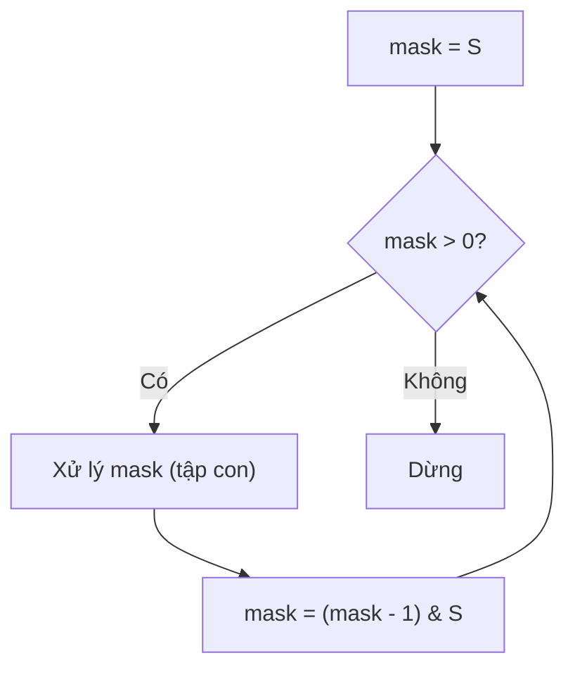

# Fun with Bits - Những Thủ Thuật Bit Hay Gặp

> **Tác giả:** FPTOJ Team<br>
> **Nội dung tham khảo từ:** VNOI Wiki - Phép toán bit, Bit Tricks

---

## 1. Bản chất vấn đề

Bài [Phép toán bit](phep-toan-bit.md) đã giới thiệu các phép toán cơ bản. Bài này tổng hợp các **thủ thuật bit** thường gặp trong thi đấu, giúp code ngắn hơn và chạy nhanh hơn.

### Bảng tổng hợp thủ thuật

| Thủ thuật | Công thức | Ý nghĩa |
|-----------|-----------|----------|
| Kiểm tra số chẵn | `n & 1 == 0` | Bit cuối = 0 |
| Nhân / chia 2 | `n << 1`, `n >> 1` | Dịch bit |
| Đổi dấu | `~n + 1` hoặc `-n` | Bù 2 |
| Kiểm tra lũy thừa 2 | `n & (n-1) == 0` | Chỉ có 1 bit 1 |
| Đếm bit 1 | `__builtin_popcount(n)` | popcount |
| Lấy bit cuối cùng | `n & (-n)` | Bit 1 thấp nhất |
| Xóa bit cuối cùng | `n & (n-1)` | Xóa LSB |
| Duyệt tập con | `mask = (mask - 1) & subset` | Liệt kê tập con |

---

## 2. Tư duy cốt lõi

### 2.1. Kiểm tra lũy thừa của 2

**Bài toán:** Kiểm tra $n$ có phải lũy thừa của 2 ($1, 2, 4, 8, 16, \ldots$) không.

**Công thức:** $n \mathbin{\&} (n-1) = 0 \iff n$ là lũy thừa của 2.

**Tại sao?** Lũy thừa của 2 chỉ có **đúng 1 bit 1**. Trừ đi 1 sẽ đảo tất cả bit từ bit 1 đó trở xuống.

| $n$ | Nhị phân | $n-1$ | $n \mathbin{\&} (n-1)$ |
|-----|----------|-------|------------------------|
| $1$ | `0001` | `0000` | `0000` = 0 ✓ |
| $2$ | `0010` | `0001` | `0000` = 0 ✓ |
| $3$ | `0011` | `0010` | `0010` ≠ 0 ✗ |
| $4$ | `0100` | `0011` | `0000` = 0 ✓ |
| $5$ | `0101` | `0100` | `0100` ≠ 0 ✗ |
| $8$ | `1000` | `0111` | `0000` = 0 ✓ |

### 2.2. Lấy bit thấp nhất (Lowest Set Bit)

**Công thức:** $n \mathbin{\&} (-n)$

Lý do: $-n$ trong bù 2 = đảo bit $n$ rồi cộng 1. Phép AND với $n$ chỉ giữ lại bit 1 cuối cùng.

| $n$ | Nhị phân | $-n$ (bù 2) | $n \mathbin{\&} (-n)$ |
|-----|----------|-------------|----------------------|
| $12$ | `1100` | `0100` | `0100` = $4$ |
| $10$ | `1010` | `0110` | `0010` = $2$ |
| $7$ | `0111` | `1001` | `0001` = $1$ |

**Ứng dụng:** Fenwick Tree dùng $n \mathbin{\&} (-n)$ để tìm vùng quản lý.

### 2.3. Xóa bit thấp nhất

**Công thức:** $n = n \mathbin{\&} (n-1)$

Mỗi lần thực hiện, bit 1 cuối cùng bị xóa. Lặp lại cho đến khi $n = 0$ để đếm số bit 1.

| Lần | $n$ | Nhị phân | $n \mathbin{\&} (n-1)$ | Bit bị xóa |
|-----|-----|----------|------------------------|-------------|
| 0 | $13$ | `1101` | `1100` | Bit 0 |
| 1 | $12$ | `1100` | `1000` | Bit 2 |
| 2 | $8$ | `1000` | `0000` | Bit 3 |
| 3 | $0$ | `0000` | — | Dừng |

$\Rightarrow$ $13$ có 3 bit 1.

### 2.4. Duyệt tất cả tập con của một bitmask

Cho tập $S$ (biểu diễn bởi bitmask). Liệt kê tất cả tập con của $S$:



**Ví dụ:** $S = 13$ (`1101`), các tập con:

| Bước | $mask$ | Nhị phân | Tập con |
|------|--------|----------|---------|
| 1 | $13$ | `1101` | $\{0, 2, 3\}$ |
| 2 | $12$ | `1100` | $\{2, 3\}$ |
| 3 | $9$ | `1001` | $\{0, 3\}$ |
| 4 | $8$ | `1000` | $\{3\}$ |
| 5 | $5$ | `0101` | $\{0, 2\}$ |
| 6 | $4$ | `0100` | $\{2\}$ |
| 7 | $1$ | `0001` | $\{0\}$ |
| 8 | $0$ | `0000` | $\{\}$ (dừng) |

### 2.5. Đếm bit 1 (Popcount)

**Cách 1 — Built-in:**

=== "C++"

    ```cpp
    int cnt = __builtin_popcount(n);  // với int
    int cnt = __builtin_popcountll(n); // với long long
    ```

=== "Python"

    ```python
    cnt = bin(n).count('1')
    # hoặc
    cnt = n.bit_count()  # Python 3.10+
    ```

**Cách 2 — Brian Kernighan:** Lặp lại $n = n \mathbin{\&} (n-1)$ cho đến khi $n = 0$. Số lần lặp = số bit 1.

Độ phức tạp: $O(\text{số bit 1})$ thay vì $O(\log n)$.

### 2.6. Đổi dấu số bằng bit

Trong bù 2: $-n = \sim n + 1$ (đảo bit rồi cộng 1).

| $n$ | Nhị phân (8-bit) | $\sim n$ | $\sim n + 1 = -n$ |
|-----|-------------------|----------|---------------------|
| $5$ | `00000101` | `11111010` | `11111011` = $-5$ |
| $-3$ | `11111101` | `00000010` | `00000011` = $3$ |

---

## 3. Phân tích tính đúng đắn

### $n \mathbin{\&} (n-1) = 0 \iff n$ là lũy thừa của 2

**($\Rightarrow$):** Nếu $n \mathbin{\&} (n-1) = 0$, thì $n$ và $n-1$ không có bit 1 nào chung. Vì $n-1$ khác $n$ đúng ở các bit từ LSB trở xuống, điều này chỉ xảy ra khi $n$ có đúng 1 bit 1.

**($\Leftarrow$):** Nếu $n = 2^k$, thì $n$ chỉ có bit thứ $k$ là 1. $n - 1$ có tất cả bit từ $0$ đến $k-1$ là 1. Phép AND = 0.

### $n \mathbin{\&} (-n)$ lấy bit thấp nhất

$-n = \sim n + 1$. Khi cộng 1 vào $\sim n$, tất cả bit 0 cuối cùng của $\sim n$ (tương ứng bit 1 cuối cùng của $n$) bị flip, và các bit phía trước giữ nguyên. Phép AND chỉ giữ lại bit đó.

---

## 4. Đánh giá độ phức tạp

| Thủ thuật | Độ phức tạp | Ghi chú |
|-----------|-------------|---------|
| Kiểm tra lũy thừa 2 | $O(1)$ | 1 phép AND |
| Lấy / xóa bit thấp nhất | $O(1)$ | 1 phép AND |
| Đếm bit 1 (built-in) | $O(1)$ | Hardware hỗ trợ |
| Đếm bit 1 (Kernighan) | $O(\text{popcount})$ | Tối đa $O(\log n)$ |
| Duyệt tập con của $S$ | $O(2^{|S|})$ | $|S|$ = số bit 1 |

---

## Code minh họa

### Duyệt tất cả tập con

=== "C++"

    ```cpp
    #include <bits/stdc++.h>
    using namespace std;

    int main() {
        int s = 13; // 1101₂ = {0, 2, 3}

        cout << "Tap con cua S = {0, 2, 3}:" << endl;
        for (int mask = s; mask > 0; mask = (mask - 1) & s) {
            cout << mask << " (";
            bool first = true;
            for (int i = 0; i < 32; i++) {
                if (mask & (1 << i)) {
                    if (!first) cout << ", ";
                    cout << i;
                    first = false;
                }
            }
            cout << ")" << endl;
        }
        return 0;
    }
    ```

=== "Python"

    ```python
    s = 13  # 1101₂ = {0, 2, 3}

    print("Tap con cua S = {0, 2, 3}:")
    mask = s
    while mask > 0:
        elements = [str(i) for i in range(32) if mask & (1 << i)]
        print(f"{mask} ({', '.join(elements)})")
        mask = (mask - 1) & s
    ```

### Đếm bit 1 bằng Brian Kernighan

=== "C++"

    ```cpp
    #include <bits/stdc++.h>
    using namespace std;

    int popcount(int n) {
        int cnt = 0;
        while (n) {
            n &= (n - 1); // xóa bit 1 cuối cùng
            cnt++;
        }
        return cnt;
    }

    int main() {
        int n = 13; // 1101 → 3 bit 1
        cout << popcount(n) << endl; // Output: 3
        return 0;
    }
    ```

=== "Python"

    ```python
    def popcount(n):
        cnt = 0
        while n:
            n &= (n - 1)
            cnt += 1
        return cnt

    print(popcount(13))  # Output: 3
    ```

### Kiểm tra và tìm lũy thừa của 2 gần nhất

=== "C++"

    ```cpp
    #include <bits/stdc++.h>
    using namespace std;

    bool isPowerOf2(int n) {
        return n > 0 && (n & (n - 1)) == 0;
    }

    int highestPowerOf2(int n) {
        // Tìm lũy thừa 2 lớn nhất <= n
        int p = 1;
        while ((p << 1) <= n) p <<= 1;
        return p;
    }

    int lowestPowerOf2(int n) {
        // Tìm lũy thừa 2 nhỏ nhất >= n
        int p = 1;
        while (p < n) p <<= 1;
        return p;
    }

    int main() {
        cout << isPowerOf2(16) << endl; // 1
        cout << isPowerOf2(12) << endl; // 0
        cout << highestPowerOf2(20) << endl; // 16
        cout << lowestPowerOf2(20) << endl;  // 32
        return 0;
    }
    ```

=== "Python"

    ```python
    def is_power_of_2(n):
        return n > 0 and (n & (n - 1)) == 0

    def highest_power_of_2(n):
        p = 1
        while (p << 1) <= n:
            p <<= 1
        return p

    def lowest_power_of_2(n):
        p = 1
        while p < n:
            p <<= 1
        return p

    print(is_power_of_2(16))      # True
    print(is_power_of_2(12))      # False
    print(highest_power_of_2(20)) # 16
    print(lowest_power_of_2(20))  # 32
    ```
