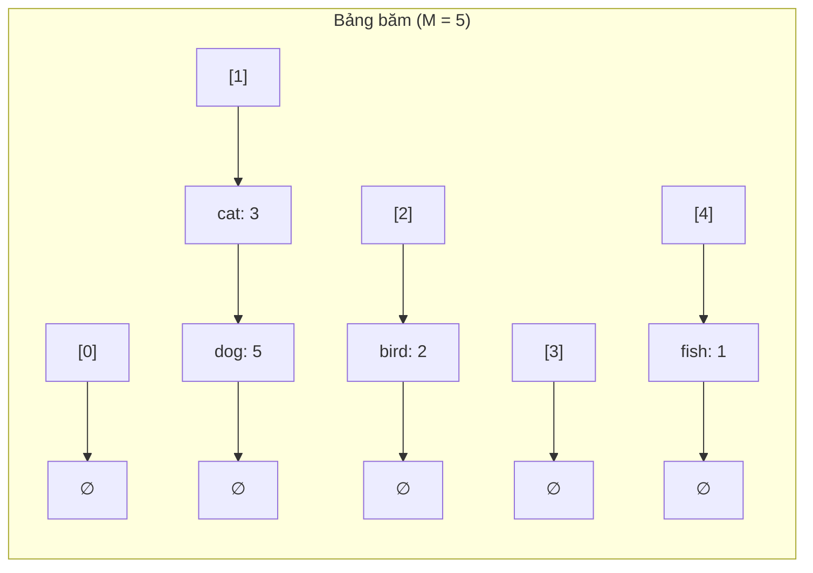

# Bài 16: Hash Table (Bảng Băm)

> **Tác giả:** FPTOJ Team<br>
> **Nội dung tham khảo từ:** VNOI Wiki - Bảng băm

---

## Bản chất vấn đề

Bài toán cơ bản: Cho một tập hợp $N$ phần tử, xây dựng cấu trúc dữ liệu hỗ trợ ba thao tác — **chèn**, **tìm kiếm**, **xóa** — với tốc độ nhanh nhất có thể.

Một cách tiếp cận trực tiếp là sử dụng mảng hoặc danh sách liên kết, duyệt tuần tự để tìm phần tử. Độ phức tạp mỗi thao tác là $O(N)$. Khi $N$ lớn và số lượng truy vấn nhiều, cách này trở nên quá chậm.

Ví dụ, với 100.000 từ trong từ điển và 100.000 truy vấn, duyệt tuần tự tốn $O(N^2) = O(10^{10})$ phép tính — không khả thi.

**Câu hỏi cốt lõi:** Làm sao truy cập trực tiếp đến phần tử mong muốn mà không cần duyệt qua tất cả?

Giải pháp là **Hash Table** — một cấu trúc dữ liệu cho phép trung bình $O(1)$ cho mỗi thao tác chèn, tìm kiếm, xóa. Ý tưởng chính là sử dụng một **hàm băm** $h(key)$ để chuyển đổi key thành chỉ số trong mảng, từ đó truy cập trực tiếp đến vị trí lưu trữ.

---

## Tư duy cốt lõi

### Hàm băm (Hash Function)

Hàm băm $h$ nhận vào một key (số nguyên, xâu, hoặc bất kỳ kiểu dữ liệu nào) và trả về một chỉ số trong mảng $table[0..M-1]$:

$$h: key \rightarrow [0, M-1]$$

Một hàm băm tốt cần thỏa mãn ba tính chất:

- **Nhanh:** Tính được trong $O(1)$ hoặc $O(|key|)$
- **Phân phối đều:** Các key khác nhau nên rơi vào các vị trí khác nhau, tránh tập trung vào một vài ô
- **Xác định:** Cùng key luôn cho cùng giá trị hash

=== "C++"

    ```cpp
    int simpleHash(string s, int tableSize) {
        int h = 0;
        for (char c : s)
            h = (h * 31 + c) % tableSize;
        return h;
    }
    ```

=== "Python"

    ```python
    def simple_hash(s, table_size):
        h = 0
        for c in s:
            h = (h * 31 + ord(c)) % table_size
        return h
    ```

Hệ số 31 là một số nguyên tố nhỏ, giúp phân phối đều. Giá trị `tableSize` nên chọn là số nguyên tố để giảm xung đột.

### Xử lý xung đột (Collision)

Hàm băm ánh xạ không gian key vô hạn vào mảng kích thước hữu hạn $M$, nên **xung đột là không thể tránh khỏi** — hai key khác nhau có thể cùng hash về một vị trí.

Có hai phương pháp chính để xử lý xung đột.

**Phương pháp 1: Chaining (Danh sách liên kết)**

Mỗi ô trong bảng băm là một danh sách liên kết. Khi nhiều key cùng hash về một ô, chúng được lưu trong cùng danh sách đó.



Trong ví dụ trên, `"cat"` và `"dog"` cùng có hash bằng 1, nên chúng nằm trong cùng một danh sách tại ô `[1]`.

**Phương pháp 2: Open Addressing (Địa chỉ mở)**

Khi xung đột, ta tìm một ô trống khác trong bảng theo một quy tắc xác định:

| Chiến lược | Quy tắc tìm ô | Bước nhảy |
|---|---|---|
| Linear Probing | Thử $h(k)+1, h(k)+2, h(k)+3, \ldots$ | $1, 2, 3, \ldots$ |
| Quadratic Probing | Thử $h(k)+1^2, h(k)+2^2, h(k)+3^2, \ldots$ | $1, 4, 9, \ldots$ |
| Double Hashing | Dùng hàm băm thứ 2 $h_2(k)$ làm bước nhảy | $h_2(k), 2h_2(k), \ldots$ |

### So sánh hai phương pháp

| Tiêu chí | Chaining | Open Addressing |
|---|---|---|
| Dễ cài đặt | Dễ hơn | Khó hơn |
| Bộ nhớ | Nhiều hơn (con trỏ) | Ít hơn |
| Khi load factor cao | Vẫn hoạt động tốt | Rất chậm |
| Cache performance | Kém hơn (nhảy theo con trỏ) | Tốt hơn (truy cập tuần tự) |

### Load Factor và Rehashing

**Load factor** $\alpha$ là tỷ lệ giữa số phần tử và kích thước bảng:

$$\alpha = \frac{N}{M}$$

Khi $\alpha$ vượt quá ngưỡng (thường là 0.75), hiệu suất giảm do xung đột tăng. Lúc này cần **rehashing**: tạo bảng mới lớn gấp đôi, rồi đưa tất cả phần tử sang.

```matplotlib
import numpy as np

alpha = np.linspace(0.01, 0.95, 100)

chaining = 1 + alpha
open_addr = 1.0 / (1.0 - alpha)

fig, ax = plt.subplots(figsize=(10, 5))

ax.plot(alpha, chaining, label='Chaining: 1 + α', linewidth=2.5, color='#3498db')
ax.plot(alpha, open_addr, label='Open Addressing: 1/(1-α)', linewidth=2.5, color='#e74c3c')

ax.axvline(x=0.75, color='gray', linestyle='--', alpha=0.7, label='Ngưỡng khuyến nghị α = 0.75')
ax.axvspan(0.75, 0.95, alpha=0.08, color='red')

ax.annotate('α = 0.75\nOpen Addressing ≈ 4 probes',
            xy=(0.75, 4.0), xytext=(0.5, 6),
            fontsize=11, color='#e74c3c', fontweight='bold',
            arrowprops=dict(arrowstyle='->', color='#e74c3c', lw=1.5))

ax.set_xlabel('Load Factor α = N/M', fontsize=12)
ax.set_ylabel('Số lần trung bình (avg probes)', fontsize=12)
ax.set_title('Hiệu suất Hash Table theo Load Factor', fontsize=14, fontweight='bold')
ax.set_xlim(0, 0.95)
ax.set_ylim(0, 12)
ax.legend(fontsize=11, loc='upper left')
ax.grid(True, alpha=0.3)

plt.tight_layout()
```

### Thư viện chuẩn

=== "C++"

    ```cpp
    #include <unordered_map>
    #include <unordered_set>
    using namespace std;

    int main() {
        unordered_map<string, int> wordCount;

        wordCount["hello"] = 5;       // Chèn / cập nhật
        wordCount["world"] = 3;

        if (wordCount.find("hello") != wordCount.end())  // Tìm kiếm
            cout << "Tim thay: " << wordCount["hello"] << endl;

        wordCount.erase("hello");     // Xóa

        for (auto& [key, value] : wordCount)
            cout << key << ": " << value << endl;

        unordered_set<int> s;
        s.insert(5);
        s.insert(10);
        s.insert(5);       // Trùng lặp, không thêm

        if (s.count(5))
            cout << "5 co trong tap hop\n";

        cout << "So phan tu: " << s.size() << endl;  // 2
    }
    ```

=== "Python"

    ```python
    word_count = {}
    word_count["hello"] = 5      # Chèn / cập nhật
    word_count["world"] = 3

    if "hello" in word_count:    # Tìm kiếm
        print(f"Tim thay: {word_count['hello']}")

    del word_count["hello"]      # Xóa

    s = set()
    s.add(5)
    s.add(10)
    s.add(5)       # Trùng lặp, không thêm

    if 5 in s:
        print("5 co trong tap hop")

    print(len(s))    # 2
    ```

### Ứng dụng trong thi đấu

Hash table là công cụ cực kỳ phổ biến trong lập trình thi đấu. Bảng sau tổng hợp các mẫu bài toán thường gặp:

| Bài toán | Cấu trúc dùng | Ví dụ |
|---|---|---|
| Đếm tần suất xuất hiện | `unordered_map<value, count>` | Đếm số lần xuất hiện của mỗi phần tử |
| Kiểm tra trùng lặp | `unordered_set` | Mảng có phần tử giống nhau không? |
| Nhóm phần tử theo key | `unordered_map<key, vector>` | Group Anagrams |
| Two Sum | `unordered_map<value, index>` | Tìm 2 số có tổng bằng $X$ |
| Đếm ký tự trong xâu | `unordered_map<char, int>` | Kiểm tra xâu đối xứng |

**Ví dụ: Đếm tần suất**

=== "C++"

    ```cpp
    vector<int> a = {1, 2, 3, 2, 1, 1, 3, 2, 1};
    unordered_map<int, int> freq;
    for (int x : a)
        freq[x]++;

    for (auto& [val, count] : freq)
        cout << val << " xuat hien " << count << " lan\n";
    ```

=== "Python"

    ```python
    from collections import Counter
    a = [1, 2, 3, 2, 1, 1, 3, 2, 1]
    freq = Counter(a)
    print(freq)  # Counter({1: 4, 2: 3, 3: 2})
    ```

**Ví dụ: Two Sum — Tìm 2 số có tổng bằng $X$**

Ý tưởng: Duyệt mảng, với mỗi phần tử $a[i]$, kiểm tra $X - a[i]$ đã xuất hiện chưa bằng hash table.

=== "C++"

    ```cpp
    vector<int> twoSum(vector<int>& a, int target) {
        unordered_map<int, int> pos;
        for (int i = 0; i < a.size(); i++) {
            int complement = target - a[i];
            if (pos.count(complement))
                return {pos[complement], i};
            pos[a[i]] = i;
        }
        return {};
    }
    ```

=== "Python"

    ```python
    def two_sum(a, target):
        pos = {}
        for i, x in enumerate(a):
            complement = target - x
            if complement in pos:
                return [pos[complement], i]
            pos[x] = i
        return []
    ```

**Ví dụ: Group Anagrams — Nhóm từ đảo chữ**

Ý tưởng: Sắp xếp ký tự mỗi từ, từ đã sắp xếp chính là key. Các từ cùng key là đảo chữ của nhau.

=== "C++"

    ```cpp
    vector<vector<string>> groupAnagrams(vector<string>& strs) {
        unordered_map<string, vector<string>> groups;
        for (string& s : strs) {
            string sorted_s = s;
            sort(sorted_s.begin(), sorted_s.end());
            groups[sorted_s].push_back(s);
        }
        vector<vector<string>> result;
        for (auto& [key, group] : groups)
            result.push_back(group);
        return result;
    }
    ```

=== "Python"

    ```python
    def group_anagrams(strs):
        groups = {}
        for s in strs:
            key = ''.join(sorted(s))
            if key not in groups:
                groups[key] = []
            groups[key].append(s)
        return list(groups.values())
    ```

**Ví dụ: Kiểm tra phần tử trùng lặp**

=== "C++"

    ```cpp
    bool hasDuplicate(vector<int>& a) {
        unordered_set<int> seen;
        for (int x : a) {
            if (seen.count(x)) return true;
            seen.insert(x);
        }
        return false;
    }
    ```

=== "Python"

    ```python
    def has_duplicate(a):
        seen = set()
        for x in a:
            if x in seen:
                return True
            seen.add(x)
        return False
    ```

### Cài đặt thủ công (Chaining)

Để hiểu sâu nguyên lý, dưới đây là cài đặt hash table đơn giản với phương pháp chaining.

=== "C++"

    ```cpp
    struct HashTable {
        static const int SIZE = 10007;
        vector<pair<string,int>> table[SIZE];

        int hash(string key) {
            int h = 0;
            for (char c : key)
                h = (h * 31 + c) % SIZE;
            return h;
        }

        void insert(string key, int value) {
            int idx = hash(key);
            for (auto& [k, v] : table[idx]) {
                if (k == key) {
                    v = value;
                    return;
                }
            }
            table[idx].push_back({key, value});
        }

        int get(string key) {
            int idx = hash(key);
            for (auto& [k, v] : table[idx])
                if (k == key) return v;
            return -1;
        }

        void erase(string key) {
            int idx = hash(key);
            auto& chain = table[idx];
            for (auto it = chain.begin(); it != chain.end(); it++) {
                if (it->first == key) {
                    chain.erase(it);
                    return;
                }
            }
        }
    };
    ```

=== "Python"

    ```python
    class HashTable:
        SIZE = 10007

        def __init__(self):
            self.table = [[] for _ in range(self.SIZE)]

        def _hash(self, key):
            h = 0
            for c in key:
                h = (h * 31 + ord(c)) % self.SIZE
            return h

        def insert(self, key, value):
            idx = self._hash(key)
            for i, (k, v) in enumerate(self.table[idx]):
                if k == key:
                    self.table[idx][i] = (key, value)
                    return
            self.table[idx].append((key, value))

        def get(self, key):
            idx = self._hash(key)
            for k, v in self.table[idx]:
                if k == key:
                    return v
            return -1

        def erase(self, key):
            idx = self._hash(key)
            self.table[idx] = [(k, v) for k, v in self.table[idx] if k != key]
    ```

---

## Phân tích tính đúng đắn

### Tại sao hash table hoạt động đúng?

Tính đúng đắn của hash table dựa trên hai tiền đề:

**Tiền đề 1: Hàm băm xác định.** Với cùng một key, hàm băm luôn trả về cùng một chỉ số. Điều này đảm bảo khi ta chèn một phần tử với key $k$ vào vị trí $h(k)$, sau đó tìm kiếm lại với key $k$, ta luôn quay về đúng vị trí đó.

**Tiền đề 2: Xung đột được giải quyết triệt để.** Dù nhiều key có thể hash về cùng một vị trí, phương pháp chaining hoặc open addressing đảm bảo tất cả các key đều được lưu trữ và có thể tìm thấy.

### Chứng minh tính đúng đắn của Chaining

Giả sử ta chèn $N$ key vào bảng kích thước $M$ với chaining.

- **Chèn key $k$:** Tính $idx = h(k)$, duyệt danh sách tại $table[idx]$. Nếu $k$ đã tồn tại, cập nhật giá trị. Nếu chưa, thêm vào cuối danh sách. Thao tác này đúng vì mọi key có hash bằng $idx$ đều nằm trong danh sách tại $table[idx]$.

- **Tìm kiếm key $k$:** Tính $idx = h(k)$, duyệt danh sách tại $table[idx]$. Nếu tìm thấy $k$, trả về giá trị. Nếu duyệt hết mà không thấy, key không tồn tại. Điều này đúng vì nếu $k$ đã được chèn, nó phải nằm trong danh sách tại $h(k)$.

- **Xóa key $k$:** Tương tự tìm kiếm, nhưng thay vì trả về, ta xóa node khỏi danh sách.

### Chứng minh tính đúng đắn của Open Addressing

Với linear probing, giả sử ta chèn key $k$ vào vị trí $h(k)$ hoặc vị trí trống đầu tiên sau $h(k)$.

Khi tìm kiếm key $k$, ta bắt đầu từ $h(k)$ và duyệt tuyến tính cho đến khi:

1. Tìm thấy $k$ — trả về giá trị
2. Gặp ô trống — $k$ không tồn tại
3. Duyệt hết bảng — $k$ không tồn tại

Điểm mấu chốt: Nếu $k$ đã được chèn, ta chắc chắn tìm thấy nó vì ta đi theo đúng chuỗi probing mà nó đã đi qua khi chèn. Nếu gặp ô trống trước khi tìm thấy $k$, điều đó có nghĩa $k$ chưa bao giờ được chèn (vì nếu nó được chèn, nó sẽ nằm tại hoặc trước vị trí trống đó).

### Anti-Hash Attack

Một điểm yếu của hash table là kẻ tấn công có thể cố tình tạo ra nhiều key có cùng hash, đẩy bảng vào worst case $O(N)$ cho mỗi thao tác. Đây gọi là **anti-hash attack**.

Cách phòng chống:

- Sử dụng hàm băm ngẫu nhiên hóa (randomized hash)
- Dùng hai hàm băm độc lập (double hashing)
- Trong thi đấu, hiếm khi bị anti-hash attack vì dữ liệu đầu vào không được tạo bởi người dùng

---

## Đánh giá độ phức tạp

### Trường hợp trung bình (Average Case)

Giả sử hàm băm phân phối đều và load factor $\alpha = N/M$.

| Thao tác | Chaining | Open Addressing |
|---|---|---|
| Chèn | $O(1)$ | $O(1)$ |
| Tìm kiếm | $O(1 + \alpha)$ | $\displaystyle O\!\left(\frac{1}{1-\alpha}\right)$ |
| Xóa | $O(1 + \alpha)$ | $\displaystyle O\!\left(\frac{1}{1-\alpha}\right)$ |

Khi $\alpha$ nhỏ (ví dụ $\alpha \leq 0.75$), tất cả các thao tác đều gần $O(1)$.

### Trường hợp tệ nhất (Worst Case)

Khi tất cả $N$ key đều hash về cùng một vị trí:

| Thao tác | Chaining | Open Addressing |
|---|---|---|
| Chèn | $O(N)$ | $O(N)$ |
| Tìm kiếm | $O(N)$ | $O(N)$ |
| Xóa | $O(N)$ | $O(N)$ |

Worst case xảy ra khi hàm băm kém hoặc bị anti-hash attack. Trong thực tế, với hàm băm tốt và load factor được kiểm soát, worst case rất hiếm.

### So sánh với các cấu trúc khác

| Cấu trúc | Tìm kiếm trung bình | Tìm kiếm tệ nhất | Có thứ tự |
|---|---|---|---|
| Hash Table | $O(1)$ | $O(N)$ | Không |
| Cây đỏ-đen (`map`) | $O(\log N)$ | $O(\log N)$ | Có |
| Mảng + Binary Search | $O(\log N)$ | $O(\log N)$ | Có |
| Danh sách liên kết | $O(N)$ | $O(N)$ | Không |

Lựa chọn cấu trúc phụ thuộc vào yêu cầu:

- Cần tìm kiếm nhanh nhất, không cần thứ tự — Hash Table
- Cần duy trì thứ tự — Cây đỏ-đen
- Dữ liệu tĩnh (không chèn/xóa) — Mảng + Binary Search

### Tóm tắt

- **Trung bình:** $O(1)$ cho mọi thao tác — đây là ưu điểm lớn nhất của hash table
- **Worst case:** $O(N)$ — xảy ra khi tất cả key cùng hash hoặc bị anti-hash attack
- **Bộ nhớ:** $O(N)$ — cần thêm không gian cho bảng băm và các cấu trúc xử lý xung đột
- **Load factor $\alpha < 0.75$:** Ngưỡng khuyến nghị để đảm bảo hiệu suất tốt

---

## Bài tập luyện tập

| Bài | Nền tảng | Độ khó | Chủ đề |
|---|---|---|---|
| [CSES - Distinct Numbers](https://cses.fi/problemset/task/1621) | CSES | ⭐ | Set |
| [CSES - Sum of Two Values](https://cses.fi/problemset/task/1640) | CSES | ⭐⭐ | Map |
| [LeetCode - Two Sum](https://leetcode.com/problems/two-sum/) | LC | ⭐ | Map cơ bản |
| [LeetCode - Group Anagrams](https://leetcode.com/problems/group-anagrams/) | LC | ⭐⭐ | Map + string |
| [VNOJ - PNUMBER](https://oj.vnoi.info/problem/pnumber) | VNOJ | ⭐⭐ | Prime numbers |
| [VNOJ - NKDIV](https://oj.vnoi.info/problem/nkdiv) | VNOJ | ⭐⭐ | Hash application |
| [CSES - Subarray Sum Queries](https://cses.fi/problemset/task/1190) | CSES | ⭐⭐⭐ | Map + prefix |

## Bài viết liên quan

- [Bài 14: Hash xâu & Z-algorithm](hash-xau-z-algorithm.md)
- [Bài 17: Trie](trie.md)

## Tài liệu tham khảo

- [VNOI Wiki - Bảng băm](https://wiki.vnoi.info/algo/data-structures/hash-table)
- [CP-Algorithms - Hash Table](https://cp-algorithms.com/string/string-hashing.html)
- [GeeksforGeeks - Hashing Data Structure](https://www.geeksforgeeks.org/dsa/hashing-data-structure/)
- [Codeforces - Hash Tables](https://codeforces.com/blog/entry/60445)

**Bài tiếp theo:** [Trie](trie.md)
