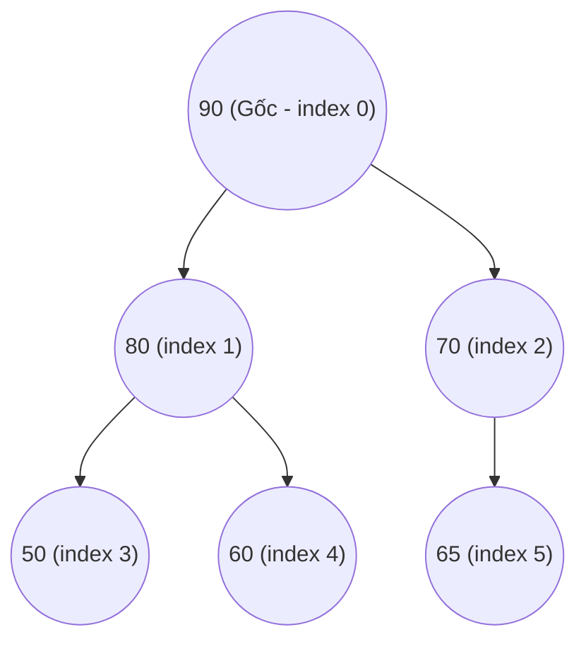
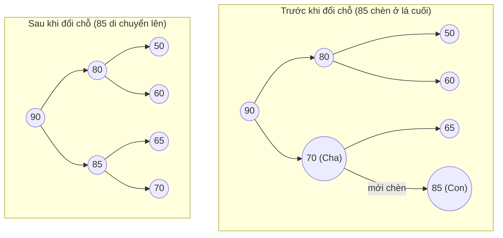
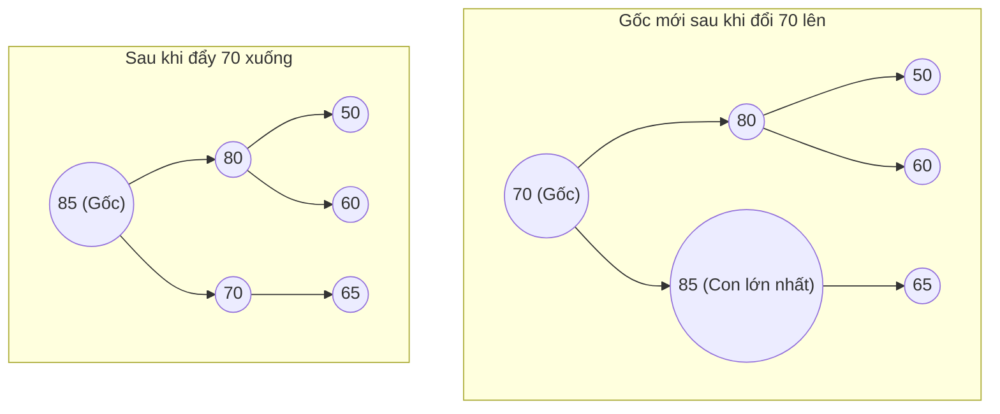

# Bài 8a: Heap (Đống) - Hàng Đợi Ưu Tiên

> **Tác giả:** FPTOJ Team<br>
> **Nội dung tham khảo từ:** VNOI Wiki - Binary Heap, CP-Algorithms

---

## 1. Bản chất vấn đề

### Hàng đợi ưu tiên (Priority Queue)
Trong thực tế cuộc sống, ta thường gặp tình huống cần quản lý một danh sách công việc hoặc đối tượng và luôn muốn lấy ra đối tượng có mức độ ưu tiên lớn nhất (hoặc nhỏ nhất) trước tiên.
Ví dụ điển hình là phòng cấp cứu của bệnh viện: bệnh nhân có tình trạng nguy kịch nhất luôn được đưa vào khám trước, bất kể họ đến trước hay sau. Đây chính là mô hình **Hàng đợi ưu tiên (Priority Queue)**.

### So sánh Queue vs Priority Queue

| Tiêu chí | Queue (Hàng đợi thường) | Priority Queue (Hàng đợi ưu tiên) |
|:---|:---:|:---:|
| **Nguyên tắc hoạt động** | FIFO: Vào trước, ra trước | Phần tử có mức độ ưu tiên cao nhất ra trước |
| **Độ phức tạp thêm phần tử** | $O(1)$ | $O(\log N)$ |
| **Độ phức tạp xem cực trị** | $O(1)$ (phần tử ở đầu hàng) | $O(1)$ (phần tử có độ ưu tiên cao nhất) |
| **Độ phức tạp lấy cực trị ra** | $O(1)$ | $O(\log N)$ |
| **Mô hình thực tế** | Hàng người xếp hàng mua vé | Phòng cấp cứu bệnh viện |

**Binary Heap (Đống nhị phân)** là cấu trúc dữ liệu tối ưu nhất dùng để cài đặt Priority Queue.

---

## 2. Binary Heap là gì?

Binary Heap là một cây nhị phân lưu trữ các phần tử của mảng và thỏa mãn hai tính chất cốt lõi sau:

1.  **Cây nhị phân đầy đủ (Complete Binary Tree):** Tất cả các tầng của cây đều được lấp đầy từ trái sang phải, riêng tầng cuối cùng có thể chưa đầy nhưng bắt buộc phải điền từ trái sang.
2.  **Tính chất đống (Heap Property):** 
    *   **Max-Heap:** Giá trị tại nút cha luôn lớn hơn hoặc bằng giá trị tại các nút con của nó. Phần tử lớn nhất nằm ở nút gốc.
    *   **Min-Heap:** Giá trị tại nút cha luôn nhỏ hơn hoặc bằng giá trị tại các nút con của nó. Phần tử nhỏ nhất nằm ở nút gốc.

---

## 3. Biểu diễn Heap dưới dạng mảng 0-indexed

Nhờ tính chất là một cây nhị phân đầy đủ, ta có thể lưu trữ Binary Heap trực tiếp dưới dạng một mảng tĩnh một chiều mà không cần dùng đến hệ thống con trỏ liên kết.

### Định vị cha - con trên mảng
Xét mảng $a[0 \ldots N-1]$ lưu trữ cây Heap, với phần tử gốc nằm tại vị trí chỉ số $0$. Với một nút nằm tại vị trí chỉ số $i$, chỉ số các nút liên quan được xác định bằng công thức:
*   Con trái: $2i + 1$
*   Con phải: $2i + 2$
*   Cha trực tiếp: $\lfloor \frac{i - 1}{2} \rfloor$

### Chứng minh công thức chỉ số cha con trên mảng
Ta chứng minh bằng quy nạp toán học cho cây nhị phân đầy đủ biểu diễn dưới dạng mảng 0-indexed:

1.  **Trường hợp cơ sở:**
    *   Nút gốc nằm ở tầng $0$, chỉ số $0$.
    *   Tầng $1$ có $2$ nút: index $1$ (con trái) và index $2$ (con phải).
    *   Thử lại công thức cho nút gốc $i = 0$:
        *   Con trái: $2(0) + 1 = 1$ (Đúng).
        *   Con phải: $2(0) + 2 = 2$ (Đúng).
2.  **Bước quy nạp:**
    *   Giả sử tầng $d$ có các nút chạy từ chỉ số $start_d$ đến $end_d$. Tầng này chứa $2^d$ nút và bắt đầu tại chỉ số $start_d = 2^d - 1$.
    *   Tầng kế tiếp $d+1$ sẽ bắt đầu tại chỉ số:
        $$start_{d+1} = start_d + 2^d = 2^d - 1 + 2^d = 2^{d+1} - 1$$
    *   Xét nút thứ $k$ (với $0 \leq k < 2^d$) ở tầng $d$. Chỉ số của nút này trên mảng là:
        $$i = start_d + k = 2^d - 1 + k$$
    *   Hai nút con của nó ở tầng $d+1$ sẽ là nút thứ $2k$ và $2k+1$ tính từ đầu tầng $d+1$.
    *   Chỉ số của nút con trái:
        $$index_{left} = start_{d+1} + 2k = (2^{d+1} - 1) + 2k = 2(2^d - 1 + k) + 1 = 2i + 1$$
    *   Chỉ số của nút con phải:
        $$index_{right} = index_{left} + 1 = 2i + 2$$
3.  **Công thức xác định cha:**
    *   Với nút con trái $L = 2i+1 \implies i = \frac{L-1}{2}$.
    *   Với nút con phải $R = 2i+2 \implies i = \frac{R-2}{2}$.
    *   Vì phép chia số nguyên tự động lấy phần sàn, ta luôn có:
        $$\lfloor \frac{L-1}{2} \rfloor = i \quad \text{và} \quad \lfloor \frac{R-1}{2} \rfloor = \lfloor \frac{2i+1}{2} \rfloor = i$$
    *   Do đó, cha của nút $i$ bất kỳ luôn nằm tại chỉ số $\lfloor \frac{i-1}{2} \rfloor$.

### Ví dụ minh họa Max-Heap
Mảng lưu trữ: `[90, 80, 70, 50, 60, 65]` ứng với chỉ số $0$ đến $5$:

| Chỉ số $i$ | $0$ | $1$ | $2$ | $3$ | $4$ | $5$ |
|:---:|:---:|:---:|:---:|:---:|:---:|:---:|
| Giá trị $a[i]$ | $90$ | $80$ | $70$ | $50$ | $60$ | $65$ |

Cấu trúc cây nhị phân tương ứng:



---

## 4. Hai thao tác cốt lõi trên Heap

Để duy trì các tính chất đống sau mỗi lần thêm hoặc xóa phần tử, ta sử dụng hai phép biến đổi:

### 4.1. Thao tác đẩy lên (Sift-Up) — Khi thêm phần tử
Khi chèn một phần tử có giá trị $val$ vào Heap:
1.  Ta thêm phần tử đó vào cuối mảng (vị trí lá trống ngoài cùng bên trái) để giữ nguyên tính chất cây nhị phân đầy đủ.
2.  So sánh phần tử vừa chèn với cha của nó: nếu giá trị của nó lớn hơn cha (ở Max-Heap), ta đổi chỗ hai phần tử này.
3.  Lặp lại quá trình so sánh và đổi chỗ hướng lên trên cho đến khi gặp nút gốc hoặc khi phần tử mới nhỏ hơn hoặc bằng cha.

#### Minh họa: Thêm $85$ vào Max-Heap `[90, 80, 70, 50, 60, 65]`
Thêm $85$ vào cuối mảng tại chỉ số $6$. Cha của $85$ nằm ở chỉ số $\lfloor \frac{6-1}{2} \rfloor = 2$ (giá trị $70$). Do $85 > 70$, ta tiến hành đổi chỗ:



Mảng kết quả: `[90, 80, 85, 50, 60, 65, 70]`

*   **Độ phức tạp thời gian:** $O(\log N)$ vì số tầng tối đa phần tử phải di chuyển chính là chiều cao của cây $H \approx \log_2 N$.

---

### 4.2. Thao tác đẩy xuống (Sift-Down / Heapify) — Khi lấy cực trị ra
Để xóa phần tử lớn nhất ra khỏi Max-Heap:
1.  Ta lấy giá trị tại gốc (chỉ số $0$) ra để trả về.
2.  Đưa phần tử ở cuối mảng lên thay thế vị trí nút gốc để đảm bảo cây nhị phân đầy đủ, sau đó xóa phần tử cuối đi.
3.  Tại nút gốc mới, ta so sánh nó với hai con trực tiếp của nó. Đổi chỗ nút này với con có giá trị **lớn hơn** (đối với Max-Heap).
4.  Lặp lại việc so sánh và đẩy xuống cho đến khi nút này lớn hơn tất cả các con của nó hoặc khi nó chạm đáy (lá).

#### Minh họa: Lấy giá trị lớn nhất ($90$) từ Max-Heap `[90, 80, 85, 50, 60, 65, 70]`
Đưa giá trị cuối cùng ($70$) lên gốc. Lúc này gốc có giá trị $70$, hai con là $80$ (trái) và $85$ (phải). Do $85$ lớn nhất, ta đổi chỗ $70$ và $85$:



Mảng kết quả: `[85, 80, 70, 50, 60, 65]`

*   **Độ phức tạp thời gian:** $O(\log N)$ vì ta chỉ di chuyển dọc xuống một nhánh của cây chiều cao $H \approx \log_2 N$.

---

## 5. Cài đặt Binary Heap thủ công và Thư viện chuẩn

=== "C++ (Tự cài đặt)"

    ```cpp
    #include <vector>
    #include <iostream>
    #include <algorithm>

    using namespace std;

    class MaxHeap {
    private:
        vector<int> a;

        int left(int i) { return 2 * i + 1; }
        int right(int i) { return 2 * i + 2; }
        int parent(int i) { return (i - 1) / 2; }

        // Đẩy xuống từ chỉ số i - O(log N)
        void sift_down(int i) {
            int largest = i;
            int l = left(i);
            int r = right(i);

            if (l < (int)a.size() && a[l] > a[largest]) {
                largest = l;
            }
            if (r < (int)a.size() && a[r] > a[largest]) {
                largest = r;
            }

            if (largest != i) {
                swap(a[i], a[largest]);
                sift_down(largest); // Đệ quy đẩy xuống tiếp
            }
        }

        // Đẩy lên từ chỉ số i - O(log N)
        void sift_up(int i) {
            while (i > 0 && a[parent(i)] < a[i]) {
                swap(a[parent(i)], a[i]);
                i = parent(i);
            }
        }

    public:
        void push(int val) {
            a.push_back(val);
            sift_up(a.size() - 1);
        }

        int pop() {
            if (a.empty()) throw runtime_error("Heap is empty!");
            int max_val = a[0];
            a[0] = a.back();
            a.pop_back();
            if (!a.empty()) {
                sift_down(0);
            }
            return max_val;
        }

        int top() {
            if (a.empty()) throw runtime_error("Heap is empty!");
            return a[0];
        }

        int size() { return a.size(); }
        bool empty() { return a.empty(); }
    };
    ```

=== "C++ (priority_queue)"

    ```cpp
    #include <queue>
    #include <iostream>

    using namespace std;

    int main() {
        // Max-Heap mặc định (phần tử lớn nhất ở top)
        priority_queue<int> max_heap;
        max_heap.push(5);
        max_heap.push(10);
        max_heap.push(3);
        cout << "Max-Heap Top: " << max_heap.top() << "\n"; // In ra 10
        max_heap.pop();

        // Min-Heap (phần tử nhỏ nhất ở top)
        priority_queue<int, vector<int>, greater<int>> min_heap;
        min_heap.push(5);
        min_heap.push(10);
        min_heap.push(3);
        cout << "Min-Heap Top: " << min_heap.top() << "\n"; // In ra 3
        return 0;
    }
    ```

=== "Python (heapq)"

    ```python
    import heapq

    # Thư viện heapq của Python mặc định cài đặt MIN-HEAP.
    min_heap = []
    heapq.heappush(min_heap, 5)
    heapq.heappush(min_heap, 10)
    heapq.heappush(min_heap, 3)
    print("Min-Heap Top:", min_heap[0])  # Giá trị nhỏ nhất: 3 - O(1)
    print("Pop:", heapq.heappop(min_heap))  # Lấy 3 ra - O(log N)

    # Muốn dùng Max-Heap trong Python: Ta thực hiện đảo dấu của phần tử khi chèn và lấy ra.
    max_heap = []
    heapq.heappush(max_heap, -5)
    heapq.heappush(max_heap, -10)
    heapq.heappush(max_heap, -3)
    print("Max-Heap Top:", -max_heap[0])  # In ra giá trị lớn nhất: 10
    ```

---

## 6. Sắp xếp bằng Heap (Heap Sort)

### Ý tưởng thuật toán
Heap Sort là thuật toán sắp xếp tại chỗ (in-place) có độ phức tạp thời gian ổn định là **$O(N \log N)$** trong mọi trường hợp:

1.  **Xây dựng Max-Heap (Heapify):** Chuyển mảng đầu vào thành Max-Heap. Thay vì gọi `push` từng phần tử mất $O(N \log N)$, ta gọi `sift_down` từ các phần tử không phải là lá (chỉ số $\lfloor N/2 \rfloor - 1$ ngược về $0$). Thao tác xây dựng này chỉ tốn thời gian **$O(N)$**.
2.  **Sắp xếp mảng:** Lần lượt đổi chỗ phần tử gốc (lớn nhất) với phần tử cuối cùng của mảng, giảm kích thước Heap đi $1$ và gọi `sift_down` tại gốc để thiết lập lại tính chất Heap. Lặp lại quá trình này cho đến khi kích thước Heap bằng $1$.

### Chứng minh toán học: Xây dựng Heap bằng phương pháp Bottom-up có độ phức tạp $O(N)$
Tại sao việc xây dựng Heap từ một mảng bằng cách duyệt từ lá lên gốc chỉ mất thời gian $O(N)$ thay vì $O(N \log N)$? Dưới đây là chứng minh toán học chi tiết:

1.  Xét một cây nhị phân đầy đủ có chiều cao $H$ chứa $N$ nút. Ta có:
    $$N \approx 2^{H+1} - 1 \implies H \approx \log_2 N$$
2.  Ở một tầng $d$ bất kỳ (với gốc là tầng $0$, các lá là tầng $H$), số lượng nút tối đa ở tầng đó là $2^d$.
3.  Khi gọi hàm `sift_down` tại một nút ở tầng $d$, nút đó di chuyển xuống tối đa đến tầng lá $H$. Do đó, số bước di chuyển tối đa là $H - d$.
4.  Tổng chi phí xây dựng Heap là tổng chi phí gọi `sift_down` cho tất cả các nút:
    $$S = \sum_{d=0}^{H} 2^d \times (H - d)$$
5.  Đặt $k = H - d$. Khi $d$ chạy từ $0$ đến $H$, thì $k$ chạy từ $H$ về $0$. Ta có:
    $$2^d = 2^{H-k} = \frac{2^H}{2^k}$$
    Thay vào biểu thức của $S$:
    $$S = \sum_{k=0}^{H} \frac{2^H}{2^k} \times k = 2^H \sum_{k=0}^{H} \frac{k}{2^k}$$
6.  Xét chuỗi số vô hạn:
    $$C = \sum_{k=0}^{\infty} \frac{k}{2^k} = \frac{1}{2} + \frac{2}{4} + \frac{3}{8} + \frac{4}{16} + \cdots$$
    Ta tính tổng chuỗi này bằng phương pháp sai phân:
    $$\frac{1}{2} C = \sum_{k=0}^{\infty} \frac{k}{2^{k+1}} = \sum_{k=1}^{\infty} \frac{k-1}{2^k}$$
    Trừ hai phương trình:
    $$C - \frac{1}{2} C = \sum_{k=1}^{\infty} \frac{k - (k - 1)}{2^k} = \sum_{k=1}^{\infty} \frac{1}{2^k} = 1 \implies C = 2$$
7.  Do đó:
    $$S < 2^H \sum_{k=0}^{\infty} \frac{k}{2^k} = 2^H \times 2 = 2^{H+1}$$
8.  Vì $N \approx 2^{H+1} - 1$, ta có:
    $$S < 2N = O(N)$$

Như vậy, độ phức tạp thời gian để xây dựng Heap bằng thuật toán Bottom-up chỉ là $O(N)$.

### Minh họa từng bước Heap Sort trên mảng `[4, 10, 3, 5, 1]`

*   **Bước 1 (Xây Max-Heap):** Thực hiện heapify tại chỉ số $1$, rồi chỉ số $0$.
    Mảng ban đầu $\to$ Max-Heap: `[10, 5, 3, 4, 1]`
*   **Bước 2 (Trích xuất cực trị về cuối):**

| Vòng lặp | Trạng thái đổi chỗ gốc và cuối | Mảng sau Heapify | Phần tử đã được sắp xếp cố định |
|:---:|:---|:---|:---|
| Khởi đầu | — | `[10, 5, 3, 4, 1]` | `[]` |
| Lần 1 | Đổi $10 \leftrightarrow 1 \to$ `[1, 5, 3, 4, 10]` | `[5, 4, 3, 1, 10]` | `[10]` |
| Lần 2 | Đổi $5 \leftrightarrow 1 \to$ `[1, 4, 3, 5, 10]` | `[4, 1, 3, 5, 10]` | `[5, 10]` |
| Lần 3 | Đổi $4 \leftrightarrow 3 \to$ `[3, 1, 4, 5, 10]` | `[3, 1, 4, 5, 10]` | `[4, 5, 10]` |
| Lần 4 | Đổi $3 \leftrightarrow 1 \to$ `[1, 3, 4, 5, 10]` | `[1, 3, 4, 5, 10]` | `[3, 4, 5, 10]` |

Mảng được sắp xếp tăng dần hoàn chỉnh: `[1, 3, 4, 5, 10]`.

---

### Cài đặt thuật toán Heap Sort

=== "C++"

    ```cpp
    #include <vector>
    #include <algorithm>

    using namespace std;

    void sift_down(vector<int>& a, int n, int i) {
        int largest = i;
        int l = 2 * i + 1;
        int r = 2 * i + 2;

        if (l < n && a[l] > a[largest]) {
            largest = l;
        }
        if (r < n && a[r] > a[largest]) {
            largest = r;
        }

        if (largest != i) {
            swap(a[i], a[largest]);
            sift_down(a, n, largest);
        }
    }

    void heapSort(vector<int>& a) {
        int n = a.size();

        // Bước 1: Xây dựng Max-Heap từ mảng ban đầu - O(N)
        for (int i = n / 2 - 1; i >= 0; i--) {
            sift_down(a, n, i);
        }

        // Bước 2: Đổi chỗ phần tử gốc ra cuối mảng và heapify lại - O(N log N)
        for (int i = n - 1; i > 0; i--) {
            swap(a[0], a[i]);
            sift_down(a, i, 0); // Giới hạn kích thước heap giảm dần xuống i
        }
    }
    ```

=== "Python"

    ```python
    def sift_down(a, n, i):
        largest = i
        l = 2 * i + 1
        r = 2 * i + 2

        if l < n and a[l] > a[largest]:
            largest = l
        if r < n and a[r] > a[largest]:
            largest = r

        if largest != i:
            a[i], a[largest] = a[largest], a[i]
            sift_down(a, n, largest)

    def heap_sort(a):
        n = len(a)

        # Bước 1: Xây dựng Max-Heap - O(N)
        for i in range(n // 2 - 1, -1, -1):
            sift_down(a, n, i)

        # Bước 2: Di chuyển gốc về cuối và heapify lại - O(N log N)
        for i in range(n - 1, 0, -1):
            a[0], a[i] = a[i], a[0]
            sift_down(a, i, 0)
    ```

---

## 7. Ứng dụng nâng cao: Tìm $K$ phần tử lớn nhất trong mảng

### Bài toán
Cho mảng gồm $N$ phần tử, ta cần tìm $K$ phần tử có giá trị lớn nhất trong mảng ($K \ll N$).

### Giải pháp tối ưu với Heap
*   **Hướng ngây thơ:** Sắp xếp toàn bộ mảng theo thứ tự giảm dần và lấy ra $K$ phần tử đầu tiên. Thời gian thực thi là $O(N \log N)$.
*   **Hướng tối ưu:** Sử dụng cấu trúc **Min-Heap** có kích thước tối đa là $K$:
    1.  Duyệt qua từng phần tử $x$ của mảng.
    2.  Thêm $x$ vào Min-Heap.
    3.  Nếu số phần tử trong Min-Heap vượt quá $K$ (đạt $K + 1$), ta loại bỏ phần tử nhỏ nhất ra khỏi Heap (sử dụng `pop`). Phần tử bị loại này chắc chắn không thuộc nhóm $K$ phần tử lớn nhất.
    4.  Kết thúc duyệt, Min-Heap sẽ chứa đúng $K$ phần tử lớn nhất.

*   **Độ phức tạp thời gian:** $O(N \log K)$. Do $K \ll N$, thuật toán này tối ưu hơn rất nhiều so với việc sắp xếp mảng.

---

### Cài đặt Tìm $K$ phần tử lớn nhất

=== "C++"

    ```cpp
    #include <queue>
    #include <vector>

    using namespace std;

    vector<int> findTopK(const vector<int>& a, int k) {
        // Sử dụng Min-Heap để giữ lại các phần tử lớn nhất
        priority_queue<int, vector<int>, greater<int>> min_heap;

        for (int x : a) {
            min_heap.push(x);
            if ((int)min_heap.size() > k) {
                min_heap.pop(); // Loại bỏ phần tử nhỏ nhất khi kích thước vượt quá K
            }
        }

        vector<int> result;
        while (!min_heap.empty()) {
            result.push_back(min_heap.top());
            min_heap.pop();
        }
        return result; // Trả về K phần tử lớn nhất (đã được sắp xếp tăng dần)
    }
    ```

=== "Python"

    ```python
    import heapq

    def find_top_k(a, k):
        min_heap = []
        for x in a:
            heapq.heappush(min_heap, x)
            if len(min_heap) > k:
                heapq.heappop(min_heap) # Loại bỏ phần tử nhỏ nhất
        
        # Trả về các phần tử được sắp xếp giảm dần
        return sorted(min_heap, reverse=True)
    ```

---

## 8. Khi nào nên sử dụng Heap?

| Tình huống bài toán | Phù hợp dùng Heap? | Giải pháp thay thế |
|:---|:---:|:---|
| Tìm giá trị Min hoặc Max liên tục khi mảng thay đổi | **Cực kỳ phù hợp** | Cây đỏ đen (C++ `std::set`), Segment Tree |
| Cần sắp xếp mảng một cách ổn định không tốn bộ nhớ phụ | **Phù hợp** | Quick Sort, Merge Sort |
| Tìm $K$ phần tử lớn nhất/nhỏ nhất | **Cực kỳ phù hợp** | Thuật toán Quick Select |
| Lấy phần tử ngẫu nhiên hoặc theo chỉ số bất kỳ | **Không hỗ trợ** | Mảng tĩnh (Array) |
| Xóa phần tử ở giữa hoặc tìm kiếm giá trị xác định | **Không hỗ trợ** | Cây tự cân bằng (Balanced BST) |

---

## 9. Bài tập luyện tập nâng cao

| Tên bài tập | Nền tảng | Độ khó | Hướng dẫn sơ lược |
|:---|:---:|:---:|:---|
| [LeetCode - Kth Largest Element](https://leetcode.com/problems/kth-largest-element-in-an-array/) | LeetCode | ⭐⭐ | Sử dụng Min-Heap kích thước $K$ để tìm phần tử lớn thứ $K$. |
| [LeetCode - Top K Frequent Elements](https://leetcode.com/problems/top-k-frequent-elements/) | LeetCode | ⭐⭐ | Kết hợp Hash Map đếm tần suất và Min-Heap kích thước $K$. |
| [LeetCode - Find Median from Data Stream](https://leetcode.com/problems/find-median-from-data-stream/) | LeetCode | ⭐⭐⭐ | Sử dụng kết hợp song song $2$ Heap: Max-Heap lưu nửa nhỏ, Min-Heap lưu nửa lớn. |
| [CSES - Concert Tickets](https://cses.fi/problemset/task/1091) | CSES | ⭐⭐ | Quản lý giá vé bằng cấu trúc Heap hoặc Multi-set để tìm giá vé lớn nhất $\leq x$. |

---

## Tài liệu tham khảo

*   [VNOI Wiki - Binary Heap](https://wiki.vnoi.info/algo/data-structures/binary-heap)
*   [CP-Algorithms - Heap](https://cp-algorithms.com/data_structures/heap.html)
*   [GeeksforGeeks - Heap Sort Algorithm](https://www.geeksforgeeks.org/heap-sort/)
