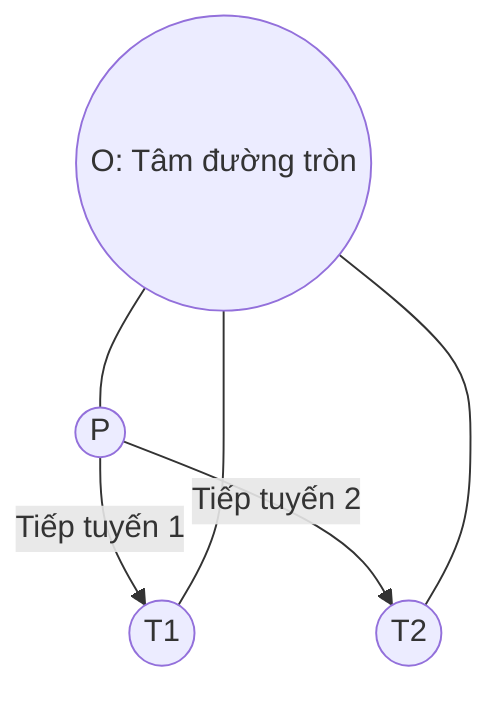

# Bài 60: Hình Học Đường Tròn

> **Tác giả:** FPTOJ Team<br>
> **Nội dung tham khảo từ:** CP-Algorithms, VNOI Wiki

---

## Bạn sẽ học được gì?

- **Phương trình đường tròn:** Các dạng biểu diễn và cách xác định tâm, bán kính từ 3 điểm không thẳng hàng.
- **Tiếp tuyến từ điểm đến đường tròn:** Công thức và cách tìm tọa độ điểm tiếp xúc.
- **Giao điểm hai đường tròn:** Phân tích hình học và thuật toán tìm tọa độ các giao điểm.
- **Diện tích giao hai đường tròn:** Công thức tính toán chính xác sử dụng hình quạt.
- Các bài toán ứng dụng và lời giải chi tiết bằng cả C++ và Python.

---

## 1. Phương trình đường tròn và Đường tròn ngoại tiếp từ 3 điểm

### 1.1 Phương trình đường tròn
Trong hệ tọa độ Descartes $Oxy$, một đường tròn có tâm $I(a, b)$ và bán kính $r$ được biểu diễn bằng hai dạng chính:
- **Dạng chính tắc:**
  $$(x - a)^2 + (y - b)^2 = r^2$$
- **Dạng tổng quát (khai triển):**
  $$x^2 + y^2 + Dx + Ey + F = 0$$
  Với các mối hệ thức:
  $$D = -2a, \quad E = -2b, \quad F = a^2 + b^2 - r^2$$
  Từ đó, nếu biết $D, E, F$, ta tìm lại được tâm $I\left(-\frac{D}{2}, -\frac{E}{2}\right)$ và bán kính $r = \sqrt{a^2 + b^2 - F}$ (với điều kiện $a^2 + b^2 - F > 0$).

---

### 1.2 Xác định đường tròn từ 3 điểm không thẳng hàng

Cho 3 điểm không thẳng hàng $A, B, C$. Đường tròn đi qua $3$ điểm này là đường tròn ngoại tiếp tam giác $ABC$. 

#### Phân tích toán học:
Tâm $I(x, y)$ của đường tròn ngoại tiếp là giao điểm của các đường trung trực của tam giác $ABC$. Ta có hệ phương trình khoảng cách:
$$IA^2 = IB^2 = IC^2$$
$$(x - x_A)^2 + (y - y_A)^2 = (x - x_B)^2 + (y - y_B)^2 = (x - x_C)^2 + (y - y_C)^2$$

Khai triển và rút gọn, ta thu được hệ phương trình tuyến tính đối với $x$ và $y$:
$$2(x_B - x_A)x + 2(y_B - y_A)y = (x_B^2 + y_B^2) - (x_A^2 + y_A^2)$$
$$2(x_C - x_A)x + 2(y_C - y_A)y = (x_C^2 + y_C^2) - (x_A^2 + y_A^2)$$

Giải hệ phương trình này bằng phương pháp định thức Cramer ta sẽ tìm được tọa độ tâm $I(x, y)$ và bán kính $r = \text{dist}(I, A)$.

=== "C++"

    ```cpp
    #include <bits/stdc++.h>
    using namespace std;

    struct Point {
        double x, y;
    };

    struct Circle {
        double x, y, r;
    };

    Circle circumCircle(Point A, Point B, Point C) {
        double a = B.x - A.x, b = B.y - A.y;
        double c = C.x - A.x, d = C.y - A.y;
        double e = a * (A.x + B.x) + b * (A.y + B.y);
        double f = c * (A.x + C.x) + d * (A.y + C.y);
        double g = 2.0 * (a * (C.y - B.y) - b * (C.x - B.x));
        
        // g chính là 2 lần tích chéo, nếu g = 0 thì 3 điểm thẳng hàng
        if (abs(g) < 1e-9) {
            return {0.0, 0.0, -1.0}; 
        }
        
        double cx = (d * e - b * f) / g;
        double cy = (a * f - c * e) / g;
        double r = hypot(A.x - cx, A.y - cy);
        return {cx, cy, r};
    }
    ```

=== "Python"

    ```python
    import math

    class Point:
        def __init__(self, x, y):
            self.x = x
            self.y = y

    class Circle:
        def __init__(self, x, y, r):
            self.x = x
            self.y = y
            self.r = r

    def circum_circle(A, B, C):
        a = B.x - A.x
        b = B.y - A.y
        c = C.x - A.x
        d = C.y - A.y
        e = a * (A.x + B.x) + b * (A.y + B.y)
        f = c * (A.x + C.x) + d * (A.y + C.y)
        g = 2.0 * (a * (C.y - B.y) - b * (C.x - B.x))
        
        if abs(g) < 1e-9:
            return Circle(0.0, 0.0, -1.0)
            
        cx = (d * e - b * f) / g
        cy = (a * f - c * e) / g
        r = math.hypot(A.x - cx, A.y - cy)
        return Circle(cx, cy, r)
    ```

```matplotlib
plt.figure(figsize=(8, 8))

# Three points
Ax, Ay = 1.0, 1.0
Bx, By = 5.0, 2.0
Cx, Cy = 3.0, 6.0

# Circumcircle center calculation
a = Bx - Ax
b = By - Ay
c = Cx - Ax
d = Cy - Ay
e_val = a * (Ax + Bx) + b * (Ay + By)
f_val = c * (Ax + Cx) + d * (Ay + Cy)
g_val = 2.0 * (a * (Cy - By) - b * (Cx - Bx))
ox = (d * e_val - b * f_val) / g_val
oy = (a * f_val - c * e_val) / g_val
R = math.hypot(Ax - ox, Ay - oy)

# Draw circumcircle
theta = np.linspace(0, 2 * np.pi, 200)
circle_x = ox + R * np.cos(theta)
circle_y = oy + R * np.sin(theta)
plt.plot(circle_x, circle_y, color='#3498db', linewidth=2, label='Đường tròn ngoại tiếp')

# Draw triangle edges
tri_x = [Ax, Bx, Cx, Ax]
tri_y = [Ay, By, Cy, Ay]
plt.plot(tri_x, tri_y, color='#2c3e50', linewidth=2, zorder=4)

# Draw triangle edges to center (dashed)
for px, py in [(Ax, Ay), (Bx, By), (Cx, Cy)]:
    plt.plot([px, ox], [py, oy], '--', color='#95a5a6', linewidth=1, alpha=0.7)

# Plot points A, B, C
for (px, py, name) in [(Ax, Ay, 'A'), (Bx, By, 'B'), (Cx, Cy, 'C')]:
    plt.plot(px, py, 'o', color='#e74c3c', markersize=10, zorder=5)
    plt.annotate(name, (px, py), textcoords="offset points",
                 xytext=(8, 8), fontsize=14, fontweight='bold', color='#e74c3c')

# Plot center I
plt.plot(ox, oy, '*', color='#f39c12', markersize=15, zorder=5, label=f'Tâm I({ox:.1f}, {oy:.1f})')
plt.annotate('I (Tâm)', (ox, oy), textcoords="offset points",
             xytext=(10, -15), fontsize=13, fontweight='bold', color='#f39c12')

# Draw radius
plt.plot([ox, Ax], [oy, Ay], '-', color='#f39c12', linewidth=1.5, alpha=0.8)
mid_rx, mid_ry = (ox + Ax) / 2, (oy + Ay) / 2
plt.annotate(f'r = {R:.2f}', (mid_rx, mid_ry), textcoords="offset points",
             xytext=(-30, 10), fontsize=10, color='#f39c12')

plt.xlim(-3, 9)
plt.ylim(-2, 10)
plt.xlabel('x', fontsize=12)
plt.ylabel('y', fontsize=12)
plt.title('Đường tròn ngoại tiếp tam giác ABC', fontsize=14)
plt.legend(loc='upper right', fontsize=10)
plt.grid(True, alpha=0.3)
plt.axhline(y=0, color='k', linewidth=0.5)
plt.axvline(x=0, color='k', linewidth=0.5)
plt.gca().set_aspect('equal', adjustable='box')
plt.tight_layout()
```

---

## 2. Vị trí tương đối giữa Điểm và Đường tròn

### 2.1 Mối quan hệ khoảng cách
Cho điểm $P$ và đường tròn $C$ có tâm $O(x_c, y_c)$, bán kính $r$. Gọi $d = \text{dist}(P, O)$ là khoảng cách từ $P$ tới tâm $O$:
- **$P$ nằm trong đường tròn:** $d < r \iff d^2 < r^2$
- **$P$ nằm trên đường tròn (biên):** $d = r \iff d^2 = r^2$
- **$P$ nằm ngoài đường tròn:** $d > r \iff d^2 > r^2$

*Mẹo lập trình:* Để tránh sai số dấu phẩy động khi tọa độ là số nguyên, ta so sánh bình phương khoảng cách $d^2$ với bình phương bán kính $r^2$ trên kiểu dữ liệu số nguyên.

=== "C++"

    ```cpp
    bool pointInCircle(Point P, Circle C) {
        double d2 = (P.x - C.x) * (P.x - C.x) + (P.y - C.y) * (P.y - C.y);
        return d2 <= C.r * C.r + 1e-9;
    }
    ```

=== "Python"

    ```python
    def point_in_circle(P, C):
        d2 = (P.x - C.x) ** 2 + (P.y - C.y) ** 2
        return d2 <= C.r ** 2 + 1e-9
    ```

---

## 3. Tiếp tuyến từ điểm đến đường tròn

Cho điểm $P$ nằm ngoài đường tròn tâm $O(x_c, y_c)$ bán kính $r$. Ta cần tìm tọa độ của hai điểm tiếp xúc $T_1$ và $T_2$ trên đường tròn của các tiếp tuyến kẻ từ $P$.



### 3.1 Phân tích lượng giác
1. Khoảng cách giữa điểm $P$ và tâm $O$ là $d = \text{dist}(P, O)$.
2. Chiều dài đoạn tiếp tuyến là $l = \sqrt{d^2 - r^2}$.
3. Góc ở tâm $\alpha = \angle T_1OP = \angle T_2OP$ được tính qua công thức:
   $$\cos(\alpha) = \frac{r}{d} \implies \alpha = \arccos\left(\frac{r}{d}\right)$$
4. Góc của vectơ pháp tuyến $\vec{OP}$ đối với trục hoành là $\beta = \text{atan2}(y_P - y_O, x_P - x_O)$.
5. Tọa độ hai tiếp điểm lần lượt là:
   $$T_1 = (x_O + r \cdot \cos(\beta + \alpha), \, y_O + r \cdot \sin(\beta + \alpha))$$
   $$T_2 = (x_O + r \cdot \cos(\beta - \alpha), \, y_O + r \cdot \sin(\beta - \alpha))$$

=== "C++"

    ```cpp
    // Trả về hai tiếp điểm, nếu P ở trong đường tròn trả về hai điểm trùng gốc tọa độ
    pair<Point, Point> tangentPoints(Point P, Circle C) {
        double d = hypot(P.x - C.x, P.y - C.y);
        if (d < C.r - 1e-9) {
            return {{0.0, 0.0}, {0.0, 0.0}}; 
        }

        Point O = {C.x, C.y};
        double alpha = acos(C.r / d);
        double beta = atan2(P.y - O.y, P.x - O.x);

        double t1 = beta + alpha;
        double t2 = beta - alpha;

        Point T1 = {O.x + C.r * cos(t1), O.y + C.r * sin(t1)};
        Point T2 = {O.x + C.r * cos(t2), O.y + C.r * sin(t2)};
        return {T1, T2};
    }
    ```

=== "Python"

    ```python
    def tangent_points(P, C):
        d = math.hypot(P.x - C.x, P.y - C.y)
        if d < C.r - 1e-9:
            return (Point(0.0, 0.0), Point(0.0, 0.0))
            
        O = Point(C.x, C.y)
        alpha = math.acos(C.r / d)
        beta = math.atan2(P.y - O.y, P.x - O.x)
        
        t1 = beta + alpha
        t2 = beta - alpha
        
        T1 = Point(O.x + C.r * math.cos(t1), O.y + C.r * math.sin(t1))
        T2 = Point(O.x + C.r * math.cos(t2), O.y + C.r * math.sin(t2))
        return (T1, T2)
    ```

---

## 4. Giao điểm của hai đường tròn

Cho hai đường tròn $C_1(O_1, r_1)$ và $C_2(O_2, r_2)$. Gọi $d = \text{dist}(O_1, O_2)$ là khoảng cách giữa hai tâm.

### 4.1 Phân tích các trường hợp hình học
- $d > r_1 + r_2$: Hai đường tròn nằm ngoài nhau, không giao nhau.
- $d < |r_1 - r_2|$: Một đường tròn chứa trong đường tròn còn lại, không giao nhau.
- $d = 0$ và $r_1 = r_2$: Hai đường tròn trùng nhau (vô số điểm giao).
- $d = r_1 + r_2$ hoặc $d = |r_1 - r_2|$: Tiếp xúc nhau (đúng $1$ điểm giao).
- $|r_1 - r_2| < d < r_1 + r_2$: Cắt nhau tại đúng $2$ điểm phân biệt.

---

### 4.2 Thuật toán tìm tọa độ giao điểm
Giả sử hai đường tròn cắt nhau tại $2$ điểm. Đường nối hai giao điểm vuông góc với đường nối hai tâm $O_1O_2$.
1. Gọi $M$ là giao điểm của đường nối hai giao điểm với đoạn thẳng $O_1O_2$.
2. Gọi $a = \text{dist}(O_1, M)$. Áp dụng định lý Pythagoras cho các tam giác vuông tạo thành, ta tìm được:
   $$a = \frac{r_1^2 - r_2^2 + d^2}{2d}$$
3. Chiều cao từ giao điểm xuống đoạn nối tâm là $h = \sqrt{r_1^2 - a^2}$.
4. Tọa độ điểm trung gian $M(x_M, y_M)$ là:
   $$x_M = x_1 + a \cdot \frac{x_2 - x_1}{d}, \quad y_M = y_1 + a \cdot \frac{y_2 - y_1}{d}$$
5. Vectơ chỉ phương của dây cung giao điểm vuông góc với $O_1O_2$. Từ đó ta tính tọa độ hai giao điểm:
   $$x = x_M \pm h \cdot \frac{y_1 - y_2}{d}, \quad y = y_M \mp h \cdot \frac{x_1 - x_2}{d}$$

=== "C++"

    ```cpp
    vector<Point> circleCircleIntersection(Circle C1, Circle C2) {
        double d = hypot(C1.x - C2.x, C1.y - C2.y);
        
        // Không giao nhau (nằm ngoài hoặc chứa trong nhau)
        if (d > C1.r + C2.r + 1e-9 || d < abs(C1.r - C2.r) - 1e-9) {
            return {};
        }

        double a = (C1.r * C1.r - C2.r * C2.r + d * d) / (2.0 * d);
        double h = sqrt(max(0.0, C1.r * C1.r - a * a));

        double mx = C1.x + a * (C2.x - C1.x) / d;
        double my = C1.y + a * (C2.y - C1.y) / d;

        // Tiếp xúc 1 điểm
        if (h < 1e-9) {
            return {{mx, my}};
        }

        // Cắt nhau tại 2 điểm
        double rx = -h * (C2.y - C1.y) / d;
        double ry = h * (C2.x - C1.x) / d;
        return {{mx + rx, my + ry}, {mx - rx, my - ry}};
    }
    ```

=== "Python"

    ```python
    def circle_circle_intersection(C1, C2):
        d = math.hypot(C1.x - C2.x, C1.y - C2.y)
        if d > C1.r + C2.r + 1e-9 or d < abs(C1.r - C2.r) - 1e-9:
            return []
            
        a = (C1.r**2 - C2.r**2 + d**2) / (2.0 * d)
        h = math.sqrt(max(0.0, C1.r**2 - a**2))
        
        mx = C1.x + a * (C2.x - C1.x) / d
        my = C1.y + a * (C2.y - C1.y) / d
        
        if h < 1e-9:
            return [Point(mx, my)]
            
        rx = -h * (C2.y - C1.y) / d
        ry = h * (C2.x - C1.x) / d
        return [Point(mx + rx, my + ry), Point(mx - rx, my - ry)]
    ```

---

## 5. Đường tròn Ngoại tiếp và Nội tiếp Tam giác

### 5.1 Đường tròn ngoại tiếp (Circumcircle)
Bán kính đường tròn ngoại tiếp $R$ liên hệ với độ dài ba cạnh $a, b, c$ và diện tích tam giác $S$ qua công thức:
$$R = \frac{a \cdot b \cdot c}{4S}$$

### 5.2 Đường tròn nội tiếp (Incircle)
Bán kính đường tròn nội tiếp $r$ liên hệ với diện tích $S$ và nửa chu vi $s = \frac{a + b + c}{2}$ qua công thức:
$$r = \frac{S}{s}$$

=== "C++"

    ```cpp
    // Tính bán kính ngoại tiếp
    double circumradius(double a, double b, double c) {
        double s = (a + b + c) / 2.0;
        double area = sqrt(s * (s - a) * (s - b) * (s - c)); // Công thức Heron
        return a * b * c / (4.0 * area);
    }

    // Tính bán kính nội tiếp
    double inradius(double a, double b, double c) {
        double s = (a + b + c) / 2.0;
        double area = sqrt(s * (s - a) * (s - b) * (s - c));
        return area / s;
    }
    ```

=== "Python"

    ```python
    def circumradius(a, b, c):
        s = (a + b + c) / 2.0
        area = math.sqrt(s * (s - a) * (s - b) * (s - c))
        return a * b * c / (4.0 * area)

    def inradius(a, b, c):
        s = (a + b + c) / 2.0
        area = math.sqrt(s * (s - a) * (s - b) * (s - c))
        return area / s
    ```

---

## 6. Diện tích phần giao của hai đường tròn

### Công thức Toán học
Gọi hai đường tròn có bán kính $r_1, r_2$, khoảng cách tâm là $d$. Phần giao nhau được tạo bởi hai hình quạt tròn trừ đi diện tích hai tam giác cân tương ứng:
$$S_{\text{intersection}} = r_1^2 \alpha + r_2^2 \beta - d \cdot h$$
Trong đó các góc ở tâm $\alpha, \beta$ (tính bằng radian) được xác định bằng định lý hàm số cosin:
$$\alpha = \arccos\left(\frac{d^2 + r_1^2 - r_2^2}{2 \cdot d \cdot r_1}\right)$$
$$\beta = \arccos\left(\frac{d^2 + r_2^2 - r_1^2}{2 \cdot d \cdot r_2}\right)$$
Và chiều cao $h$ là khoảng cách từ giao điểm tới đoạn nối tâm.

=== "C++"

    ```cpp
    double circleIntersectionArea(Circle C1, Circle C2) {
        double d = hypot(C1.x - C2.x, C1.y - C2.y);
        
        // Trường hợp 1: Không giao nhau
        if (d >= C1.r + C2.r - 1e-9) return 0.0;
        
        // Trường hợp 2: Một đường tròn nằm trọn trong đường tròn kia
        if (d + min(C1.r, C2.r) <= max(C1.r, C2.r) + 1e-9) {
            double r = min(C1.r, C2.r);
            return M_PI * r * r;
        }

        double r1 = C1.r, r2 = C2.r;
        double alpha = acos((d * d + r1 * r1 - r2 * r2) / (2.0 * d * r1));
        double beta = acos((d * d + r2 * r2 - r1 * r2) / (2.0 * d * r2)); // Sửa lỗi r1*r2
        
        double term1 = r1 * r1 * alpha;
        double term2 = r2 * r2 * beta;
        double term3 = 0.5 * sqrt((-d + r1 + r2) * (d + r1 - r2) * (d - r1 + r2) * (d + r1 + r2));
        
        return term1 + term2 - term3;
    }
    ```

=== "Python"

    ```python
    def circle_intersection_area(C1, C2):
        d = math.hypot(C1.x - C2.x, C1.y - C2.y)
        if d >= C1.r + C2.r - 1e-9:
            return 0.0
        if d + min(C1.r, C2.r) <= max(C1.r, C2.r) + 1e-9:
            r = min(C1.r, C2.r)
            return math.pi * r * r

        r1, r2 = C1.r, C2.r
        alpha = math.acos((d**2 + r1**2 - r2**2) / (2.0 * d * r1))
        beta = math.acos((d**2 + r2**2 - r1**2) / (2.0 * d * r2))
        
        term1 = r1**2 * alpha
        term2 = r2**2 * beta
        term3 = 0.5 * math.sqrt((-d + r1 + r2) * (d + r1 - r2) * (d - r1 + r2) * (d + r1 + r2))
        
        return term1 + term2 - term3
    ```

---

## 7. Bài tập luyện tập và Lời giải chi tiết

### Bài 1: Kiểm tra điểm trong đường tròn
**Đề bài:** Cho đường tròn tâm $O(a, b)$ bán kính $r$ và điểm $P(x, y)$. Kiểm tra điểm $P$ nằm trong, nằm trên hay nằm ngoài đường tròn.
**Độ khó:** ★☆☆

??? tip "Lời giải"
    Tính khoảng cách bình phương và so sánh với bình phương bán kính để bảo toàn số nguyên.

    === "C++"

        ```cpp
        #include <bits/stdc++.h>
        using namespace std;
        int main() {
            int q; cin >> q;
            while (q--) {
                long long x, y, a, b, r;
                cin >> x >> y >> a >> b >> r;
                long long dx = x - a, dy = y - b;
                long long d2 = dx * dx + dy * dy;
                long long r2 = r * r;
                if (d2 < r2) cout << "INSIDE\n";
                else if (d2 == r2) cout << "ON\n";
                else cout << "OUTSIDE\n";
            }
            return 0;
        }
        ```

    === "Python"

        ```python
        import sys

        def main():
            input = sys.stdin.read
            data = input().split()
            if not data:
                return
            q = int(data[0])
            idx = 1
            out = []
            for _ in range(q):
                x = int(data[idx])
                y = int(data[idx+1])
                a = int(data[idx+2])
                b = int(data[idx+3])
                r = int(data[idx+4])
                idx += 5
                d2 = (x - a)**2 + (y - b)**2
                r2 = r**2
                if d2 < r2:
                    out.append("INSIDE")
                elif d2 == r2:
                    out.append("ON")
                else:
                    out.append("OUTSIDE")
            print('\n'.join(out))

        if __name__ == '__main__':
            main()
        ```

---

### Bài 2: Số điểm giao của hai đường tròn
**Đề bài:** Cho 2 đường tròn $C_1(a_1, b_1, r_1)$ và $C_2(a_2, b_2, r_2)$. Đếm số điểm giao của chúng.
**Độ khó:** ★★☆

??? tip "Lời giải"
    So sánh khoảng cách tâm bình phương với các đại lượng tổng, hiệu bán kính bình phương.

    === "C++"

        ```cpp
        #include <bits/stdc++.h>
        using namespace std;
        int main() {
            long long x1, y1, r1, x2, y2, r2;
            if (cin >> x1 >> y1 >> r1 >> x2 >> y2 >> r2) {
                long long dx = x1 - x2, dy = y1 - y2;
                long long d2 = dx * dx + dy * dy;
                long long sum = r1 + r2, diff = abs(r1 - r2);
                if (d2 == 0 && r1 == r2) cout << -1 << "\n"; // Trùng nhau
                else if (d2 > sum * sum || d2 < diff * diff) cout << 0 << "\n";
                else if (d2 == sum * sum || d2 == diff * diff) cout << 1 << "\n";
                else cout << 2 << "\n";
            }
            return 0;
        }
        ```

    === "Python"

        ```python
        import sys

        def main():
            input = sys.stdin.read
            data = input().split()
            if not data:
                return
            x1, y1, r1, x2, y2, r2 = map(int, data)
            d2 = (x1 - x2)**2 + (y1 - y2)**2
            sum_r = r1 + r2
            diff_r = abs(r1 - r2)
            if d2 == 0 and r1 == r2:
                print(-1)
            elif d2 > sum_r**2 or d2 < diff_r**2:
                print(0)
            elif d2 == sum_r**2 or d2 == diff_r**2:
                print(1)
            else:
                print(2)

        if __name__ == '__main__':
            main()
        ```

---

### Bài 3: Bán kính đường tròn ngoại tiếp tam giác
**Đề bài:** Cho 3 đỉnh tam giác $A(x_1, y_1), B(x_2, y_2), C(x_3, y_3)$. Tính bán kính ngoại tiếp của tam giác.
**Độ khó:** ★★☆

??? tip "Lời giải"
    Áp dụng công thức Heron để tính diện tích $S$, sau đó tính $R = \frac{abc}{4S}$.

    === "C++"

        ```cpp
        #include <bits/stdc++.h>
        using namespace std;
        int main() {
            double x1, y1, x2, y2, x3, y3;
            if (cin >> x1 >> y1 >> x2 >> y2 >> x3 >> y3) {
                double a = hypot(x2 - x1, y2 - y1);
                double b = hypot(x3 - x2, y3 - y2);
                double c = hypot(x1 - x3, y1 - y3);
                double s = (a + b + c) / 2.0;
                double area = sqrt(s * (s - a) * (s - b) * (s - c));
                double R = a * b * c / (4.0 * area);
                cout << fixed << setprecision(3) << R << "\n";
            }
            return 0;
        }
        ```

    === "Python"

        ```python
        import sys
        import math

        def main():
            input = sys.stdin.read
            data = input().split()
            if not data:
                return
            x1, y1, x2, y2, x3, y3 = map(float, data)
            a = math.hypot(x2 - x1, y2 - y1)
            b = math.hypot(x3 - x2, y3 - y2)
            c = math.hypot(x1 - x3, y1 - y3)
            s = (a + b + c) / 2.0
            area = math.sqrt(s * (s - a) * (s - b) * (s - c))
            R = a * b * c / (4.0 * area)
            print(f"{R:.3f}")

        if __name__ == '__main__':
            main()
        ```