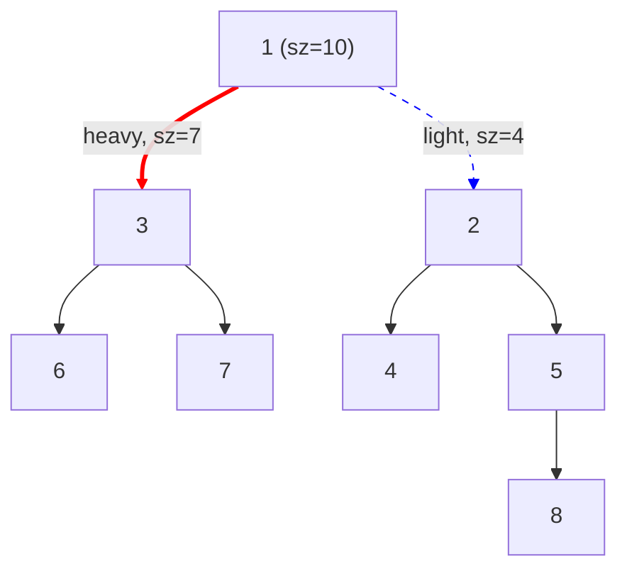
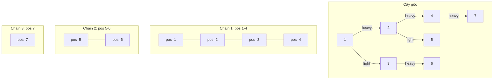
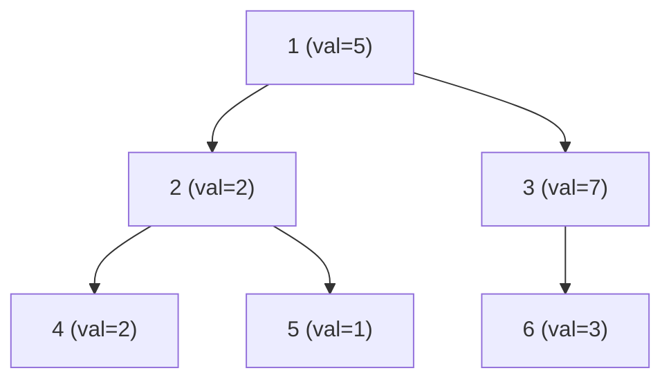

# Bài 46: Heavy-Light Decomposition - Phân rã cây!

> **Tác giả:** FPTOJ Wiki<br>
> **Nội dung tham khảo từ:** VNOI Wiki, CP-Algorithms

---

## Bạn sẽ học được gì?

- Heavy/Light edges là gì và tại sao chỉ có $O(\log N)$ light edges trên đường đi
- HLD biến đường đi trên cây thành $O(\log N)$ đoạn liên tục
- Truy vấn min/max/sum trên đường đi trong $O(\log^2 N)$
- Cách áp dụng HLD cho truy vấn subtree, LCA, và cập nhật cạnh

---

## Bản chất vấn đề

### Phát biểu

Cho cây $N$ đỉnh ($N \leq 10^5$), mỗi đỉnh có một giá trị. Hỗ trợ hai loại truy vấn:

| Loại truy vấn | Mô tả |
|---|---|
| `UPDATE(u, val)` | Gán giá trị `val` cho đỉnh $u$ |
| `QUERY(u, v)` | Tìm tổng / min / max trên đường đi từ $u$ đến $v$ |

### Tại sao bài toán khó?

Với mỗi truy vấn `QUERY(u, v)`, ta cần duyệt toàn bộ đường đi từ $u$ lên LCA rồi xuống $v$. Cách naïve mất $O(N)$ mỗi truy vấn, $Q$ truy vấn sẽ là $O(N \cdot Q)$ — quá chậm với $N, Q = 10^5$.

Đường đi trên cây **không phải** là một đoạn liên tục trong mảng, nên không thể dùng Segment Tree trực tiếp.

### Giải pháp

Dùng **Heavy-Light Decomposition (HLD)** để biến đường đi trên cây thành $O(\log N)$ đoạn liên tục trong mảng, rồi dùng Segment Tree trên mỗi đoạn.

---

## Tư duy cốt lõi

### Heavy Edge và Light Edge

Với mỗi đỉnh $u$ (không phải lá), gọi $sz[v]$ là kích thước cây con gốc $v$.

- **Heavy edge** của $u$: cạnh nối $u$ với con $v$ mà $sz[v]$ lớn nhất (nếu nhiều con cùng kích thước, chọn bất kỳ).
- **Light edge** của $u$: tất cả các cạnh còn lại từ $u$ đến các con.



Cạnh $(1, 3)$ là heavy edge vì $sz[3] = 7 > sz[2] = 4$.

### Tính chất cốt lõi: Light edges giảm một nửa kích thước

!!! info "Định lý"
    Trên đường đi từ gốc đến bất kỳ lá, có **tối đa $\log N$ light edges**.

**Chứng minh:** Khi đi qua một light edge từ $u$ sang con $v$, ta có $sz[v] \leq sz[u]/2$ (vì $v$ không phải heavy child). Vậy kích thước cây con giảm ít nhất một nửa. Sau tối đa $\log N$ bước, kích thước giảm xuống 1.

Đây chính là "bí mật" khiến HLD hoạt động hiệu quả: mỗi lần nhảy qua light edge, cây con co lại ít nhất một nửa.

### Chain Decomposition - Phân rã chuỗi

Mỗi **heavy path** (chuỗi các heavy edges liên tiếp) tạo thành một **chain**. Ta gán DFS order (thứ tự duyệt) sao cho mỗi chain là một **đoạn liên tục** trong mảng.



Mỗi chain ứng với một đoạn liên tục trong mảng, nên có thể dùng Segment Tree trên toàn bộ mảng.

### Các biến cần lưu trữ

| Biến | Ý nghĩa |
|------|----------|
| $pos[u]$ | Vị trí của đỉnh $u$ trong mảng (theo DFS order) |
| $head[u]$ | Đỉnh đầu tiên trong chain chứa $u$ |
| $heavy[u]$ | Con nặng (heavy child) của $u$, $-1$ nếu là lá |
| $parent[u]$ | Cha của $u$ |
| $depth[u]$ | Độ sâu của $u$ |
| $sz[u]$ | Kích thước cây con gốc $u$ |

### Bước 1: DFS tìm Heavy Child

DFS tính $parent$, $depth$, $sz$, $heavy$ cho mỗi đỉnh.

=== "C++"

    ```cpp
    #include <bits/stdc++.h>
    using namespace std;

    const int MAXN = 100005;

    int n;
    vector<int> adj[MAXN];
    int parent[MAXN], depth[MAXN], sz[MAXN], heavy[MAXN];

    void dfs(int u, int p) {
        parent[u] = p;
        sz[u] = 1;
        heavy[u] = -1;
        int max_sz = 0;

        for (int v : adj[u]) {
            if (v == p) continue;
            depth[v] = depth[u] + 1;
            dfs(v, u);
            sz[u] += sz[v];
            if (sz[v] > max_sz) {
                max_sz = sz[v];
                heavy[u] = v;
            }
        }
    }
    ```

=== "Python"

    ```python
    import sys
    from collections import defaultdict

    sys.setrecursionlimit(300000)

    n = 0
    adj = defaultdict(list)
    parent = [0] * 200005
    depth = [0] * 200005
    sz = [0] * 200005
    heavy = [-1] * 200005

    def dfs(u, p):
        parent[u] = p
        sz[u] = 1
        heavy[u] = -1
        max_sz = 0

        for v in adj[u]:
            if v == p:
                continue
            depth[v] = depth[u] + 1
            dfs(v, u)
            sz[u] += sz[v]
            if sz[v] > max_sz:
                max_sz = sz[v]
                heavy[u] = v
    ```

### Bước 2: Decompose - Gán DFS Order

Thứ tự thăm đỉnh rất quan trọng: gốc, heavy child, heavy child của heavy child, rồi quay lại light children. Nhờ vậy, toàn bộ heavy path được gán **liên tục** trong mảng $pos[]$.

=== "C++"

    ```cpp
    int cur_pos;
    int head[MAXN], pos[MAXN];
    int val[MAXN], arr[MAXN];

    void decompose(int u, int h) {
        head[u] = h;
        pos[u] = cur_pos;
        arr[cur_pos] = val[u];
        cur_pos++;

        if (heavy[u] != -1) {
            decompose(heavy[u], h);
        }

        for (int v : adj[u]) {
            if (v == parent[u] || v == heavy[u]) continue;
            decompose(v, v);
        }
    }

    // Gọi trong main:
    // dfs(1, -1);
    // decompose(1, 1);
    ```

=== "Python"

    ```python
    cur_pos = 0
    head = [0] * 200005
    pos_arr = [0] * 200005
    val = [0] * 200005
    seg_arr = [0] * 200005

    def decompose(u, h):
        global cur_pos
        head[u] = h
        pos_arr[u] = cur_pos
        seg_arr[cur_pos] = val[u]
        cur_pos += 1

        if heavy[u] != -1:
            decompose(heavy[u], h)

        for v in adj[u]:
            if v == parent[u] or v == heavy[u]:
                continue
            decompose(v, v)

    # Gọi:
    # dfs(1, -1)
    # decompose(1, 1)
    ```

### Bước 3: Segment Tree trên mảng

Sau khi decompose, ta có mảng `arr[]` phẳng. Dùng Segment Tree để truy vấn / cập nhật trên mảng này.

=== "C++"

    ```cpp
    struct SegTree {
        int n;
        vector<long long> tree;

        void init(int _n) {
            n = _n;
            tree.assign(4 * n, 0);
        }

        void build(int node, int tl, int tr, long long a[]) {
            if (tl == tr) {
                tree[node] = a[tl];
                return;
            }
            int tm = (tl + tr) / 2;
            build(2 * node, tl, tm, a);
            build(2 * node + 1, tm + 1, tr, a);
            tree[node] = tree[2 * node] + tree[2 * node + 1];
        }

        void update(int node, int tl, int tr, int pos, long long val) {
            if (tl == tr) {
                tree[node] = val;
                return;
            }
            int tm = (tl + tr) / 2;
            if (pos <= tm)
                update(2 * node, tl, tm, pos, val);
            else
                update(2 * node + 1, tm + 1, tr, pos, val);
            tree[node] = tree[2 * node] + tree[2 * node + 1];
        }

        long long query(int node, int tl, int tr, int l, int r) {
            if (l > tr || r < tl) return 0;
            if (l <= tl && tr <= r) return tree[node];
            int tm = (tl + tr) / 2;
            return query(2 * node, tl, tm, l, r) +
                   query(2 * node + 1, tm + 1, tr, l, r);
        }
    };
    ```

=== "Python"

    ```python
    class SegTree:
        def __init__(self, n):
            self.n = n
            self.tree = [0] * (4 * n)

        def build(self, node, tl, tr, arr):
            if tl == tr:
                self.tree[node] = arr[tl]
                return
            tm = (tl + tr) // 2
            self.build(2 * node, tl, tm, arr)
            self.build(2 * node + 1, tm + 1, tr, arr)
            self.tree[node] = self.tree[2 * node] + self.tree[2 * node + 1]

        def update(self, node, tl, tr, pos, val):
            if tl == tr:
                self.tree[node] = val
                return
            tm = (tl + tr) // 2
            if pos <= tm:
                self.update(2 * node, tl, tm, pos, val)
            else:
                self.update(2 * node + 1, tm + 1, tr, pos, val)
            self.tree[node] = self.tree[2 * node] + self.tree[2 * node + 1]

        def query(self, node, tl, tr, l, r):
            if l > tr or r < tl:
                return 0
            if l <= tl and tr <= r:
                return self.tree[node]
            tm = (tl + tr) // 2
            return (self.query(2 * node, tl, tm, l, r) +
                    self.query(2 * node + 1, tm + 1, tr, l, r))
    ```

### Bước 4: Path Query - Truy vấn đường đi

Để truy vấn đường đi từ $u$ đến $v$:

1. Miễn là $head[u] \neq head[v]$, nhảy lên chain chứa đỉnh sâu hơn.
2. Khi $head[u] = head[v]$, truy vấn đoạn còn lại giữa $u$ và $v$.

Mỗi bước nhảy qua một light edge, tối đa $O(\log N)$ bước.

=== "C++"

    ```cpp
    SegTree st;

    long long path_query(int u, int v) {
        long long res = 0;
        while (head[u] != head[v]) {
            if (depth[head[u]] > depth[head[v]]) swap(u, v);
            res += st.query(1, 0, n - 1, pos[head[v]], pos[v]);
            v = parent[head[v]];
        }
        if (depth[u] > depth[v]) swap(u, v);
        res += st.query(1, 0, n - 1, pos[u], pos[v]);
        return res;
    }

    void update_node(int u, long long val) {
        st.update(1, 0, n - 1, pos[u], val);
    }
    ```

=== "Python"

    ```python
    st = SegTree(n)

    def path_query(u, v):
        res = 0
        while head[u] != head[v]:
            if depth[head[u]] > depth[head[v]]:
                u, v = v, u
            res += st.query(1, 0, n - 1, pos_arr[head[v]], pos_arr[v])
            v = parent[head[v]]
        if depth[u] > depth[v]:
            u, v = v, u
        res += st.query(1, 0, n - 1, pos_arr[u], pos_arr[v])
        return res

    def update_node(u, val):
        st.update(1, 0, n - 1, pos_arr[u], val)
    ```

### Code đầy đủ (Full Solution)

=== "C++"

    ```cpp
    #include <bits/stdc++.h>
    using namespace std;

    const int MAXN = 100005;

    int n;
    vector<int> adj[MAXN];
    int parent[MAXN], depth[MAXN], sz[MAXN], heavy[MAXN];
    int head[MAXN], pos[MAXN];
    int cur_pos;
    long long val[MAXN], arr[MAXN];

    void dfs(int u, int p) {
        parent[u] = p;
        sz[u] = 1;
        heavy[u] = -1;
        int max_sz = 0;
        for (int v : adj[u]) {
            if (v == p) continue;
            depth[v] = depth[u] + 1;
            dfs(v, u);
            sz[u] += sz[v];
            if (sz[v] > max_sz) {
                max_sz = sz[v];
                heavy[u] = v;
            }
        }
    }

    void decompose(int u, int h) {
        head[u] = h;
        pos[u] = cur_pos;
        arr[cur_pos] = val[u];
        cur_pos++;
        if (heavy[u] != -1) {
            decompose(heavy[u], h);
        }
        for (int v : adj[u]) {
            if (v == parent[u] || v == heavy[u]) continue;
            decompose(v, v);
        }
    }

    struct SegTree {
        int n;
        vector<long long> tree;
        void init(int _n) { n = _n; tree.assign(4 * n, 0); }
        void build(int nd, int tl, int tr, long long a[]) {
            if (tl == tr) { tree[nd] = a[tl]; return; }
            int tm = (tl + tr) / 2;
            build(2*nd, tl, tm, a); build(2*nd+1, tm+1, tr, a);
            tree[nd] = tree[2*nd] + tree[2*nd+1];
        }
        void update(int nd, int tl, int tr, int p, long long v) {
            if (tl == tr) { tree[nd] = v; return; }
            int tm = (tl + tr) / 2;
            if (p <= tm) update(2*nd, tl, tm, p, v);
            else update(2*nd+1, tm+1, tr, p, v);
            tree[nd] = tree[2*nd] + tree[2*nd+1];
        }
        long long query(int nd, int tl, int tr, int l, int r) {
            if (l > tr || r < tl) return 0;
            if (l <= tl && tr <= r) return tree[nd];
            int tm = (tl + tr) / 2;
            return query(2*nd, tl, tm, l, r) + query(2*nd+1, tm+1, tr, l, r);
        }
    } st;

    long long path_query(int u, int v) {
        long long res = 0;
        while (head[u] != head[v]) {
            if (depth[head[u]] > depth[head[v]]) swap(u, v);
            res += st.query(1, 0, n-1, pos[head[v]], pos[v]);
            v = parent[head[v]];
        }
        if (depth[u] > depth[v]) swap(u, v);
        res += st.query(1, 0, n-1, pos[u], pos[v]);
        return res;
    }

    void update_node(int u, long long v) {
        st.update(1, 0, n-1, pos[u], v);
    }

    int main() {
        ios::sync_with_stdio(false);
        cin.tie(nullptr);

        int q;
        cin >> n >> q;
        for (int i = 1; i <= n; i++) cin >> val[i];
        for (int i = 0; i < n - 1; i++) {
            int u, v;
            cin >> u >> v;
            adj[u].push_back(v);
            adj[v].push_back(u);
        }

        dfs(1, -1);
        cur_pos = 0;
        decompose(1, 1);

        st.init(n);
        st.build(1, 0, n-1, arr);

        while (q--) {
            int type;
            cin >> type;
            if (type == 1) {
                int u; long long v;
                cin >> u >> v;
                update_node(u, v);
            } else {
                int u, v;
                cin >> u >> v;
                cout << path_query(u, v) << '\n';
            }
        }
        return 0;
    }
    ```

=== "Python"

    ```python
    import sys
    from collections import defaultdict

    sys.setrecursionlimit(300000)
    input = sys.stdin.readline

    n = 0
    adj = defaultdict(list)
    parent = [0] * 200005
    depth = [0] * 200005
    sz = [0] * 200005
    heavy = [-1] * 200005
    head = [0] * 200005
    pos_arr = [0] * 200005
    val = [0] * 200005
    seg_arr = [0] * 200005
    cur_pos = 0

    def dfs(u, p):
        parent[u] = p
        sz[u] = 1
        heavy[u] = -1
        max_sz = 0
        for v in adj[u]:
            if v == p:
                continue
            depth[v] = depth[u] + 1
            dfs(v, u)
            sz[u] += sz[v]
            if sz[v] > max_sz:
                max_sz = sz[v]
                heavy[u] = v

    def decompose(u, h):
        global cur_pos
        head[u] = h
        pos_arr[u] = cur_pos
        seg_arr[cur_pos] = val[u]
        cur_pos += 1
        if heavy[u] != -1:
            decompose(heavy[u], h)
        for v in adj[u]:
            if v == parent[u] or v == heavy[u]:
                continue
            decompose(v, v)

    class SegTree:
        def __init__(self, n):
            self.n = n
            self.tree = [0] * (4 * n)
        def build(self, nd, tl, tr, arr):
            if tl == tr:
                self.tree[nd] = arr[tl]
                return
            tm = (tl + tr) // 2
            self.build(2*nd, tl, tm, arr)
            self.build(2*nd+1, tm+1, tr, arr)
            self.tree[nd] = self.tree[2*nd] + self.tree[2*nd+1]
        def update(self, nd, tl, tr, p, v):
            if tl == tr:
                self.tree[nd] = v
                return
            tm = (tl + tr) // 2
            if p <= tm:
                self.update(2*nd, tl, tm, p, v)
            else:
                self.update(2*nd+1, tm+1, tr, p, v)
            self.tree[nd] = self.tree[2*nd] + self.tree[2*nd+1]
        def query(self, nd, tl, tr, l, r):
            if l > tr or r < tl:
                return 0
            if l <= tl and tr <= r:
                return self.tree[nd]
            tm = (tl + tr) // 2
            return (self.query(2*nd, tl, tm, l, r) +
                    self.query(2*nd+1, tm+1, tr, l, r))

    def path_query(u, v):
        res = 0
        while head[u] != head[v]:
            if depth[head[u]] > depth[head[v]]:
                u, v = v, u
            res += st.query(1, 0, n-1, pos_arr[head[v]], pos_arr[v])
            v = parent[head[v]]
        if depth[u] > depth[v]:
            u, v = v, u
        res += st.query(1, 0, n-1, pos_arr[u], pos_arr[v])
        return res

    def update_node(u, v):
        st.update(1, 0, n-1, pos_arr[u], v)

    def main():
        global n, st
        n, q = map(int, input().split())
        vals = list(map(int, input().split()))
        for i in range(n):
            val[i+1] = vals[i]
        for _ in range(n-1):
            u, v = map(int, input().split())
            adj[u].append(v)
            adj[v].append(u)

        dfs(1, -1)
        global cur_pos
        cur_pos = 0
        decompose(1, 1)

        st = SegTree(n)
        st.build(1, 0, n-1, seg_arr)

        out = []
        for _ in range(q):
            parts = list(map(int, input().split()))
            if parts[0] == 1:
                update_node(parts[1], parts[2])
            else:
                out.append(str(path_query(parts[1], parts[2])))
        print('\n'.join(out))

    main()
    ```

---

## Phân tích tính đúng đắn

### Bước chạy chi tiết (Trace)

Cho cây sau với giá trị tại mỗi đỉnh:



### Trace bước 1: DFS tính $sz$ và $heavy$

DFS từ đỉnh 1, tính toán đệ quy từ lá lên:

| $u$ | $sz[u]$ | $heavy[u]$ | $depth[u]$ | $parent[u]$ |
|-----|----------|------------|------------|-------------|
| 4   | 1        | -1         | 2          | 2           |
| 5   | 1        | -1         | 2          | 2           |
| 2   | 3        | 4          | 1          | 1           |
| 6   | 1        | -1         | 2          | 3           |
| 3   | 2        | 6          | 1          | 1           |
| 1   | 6        | 2          | 0          | -1          |

Đỉnh 2 được chọn làm heavy child của 1 vì $sz[2] = 3 > sz[3] = 2$.

### Trace bước 2: Decompose - Gán DFS Order

Thứ tự gán $pos$: ưu tiên heavy child trước.

| Bước | Gọi             | $head$ | $pos$ | $arr$ |
|------|-----------------|--------|-------|-------|
| 1    | decompose(1, 1) | 1      | 0     | 5     |
| 2    | decompose(2, 1) | 1      | 1     | 2     |
| 3    | decompose(4, 1) | 1      | 2     | 2     |
| 4    | decompose(5, 5) | 5      | 3     | 1     |
| 5    | decompose(3, 3) | 3      | 4     | 7     |
| 6    | decompose(6, 3) | 3      | 5     | 3     |

Kết quả:

| $u$ | $head[u]$ | $pos[u]$ | Chain   |
|-----|-----------|----------|---------|
| 1   | 1         | 0        | 1-2-4   |
| 2   | 1         | 1        | 1-2-4   |
| 4   | 1         | 2        | 1-2-4   |
| 5   | 5         | 3        | 5       |
| 3   | 3         | 4        | 3-6     |
| 6   | 3         | 5        | 3-6     |

Mảng $arr[] = [5, 2, 2, 1, 7, 3]$.

### Trace bước 3: Truy vấn QUERY(4, 6)

Tìm tổng trên đường đi $4 \to 2 \to 1 \to 3 \to 6$. Kỳ vọng: $2 + 2 + 5 + 7 + 3 = 19$.

**Vòng lặp 1:** $head[4] = 1$, $head[6] = 3$, khác nhau.

- $depth[head[4]] = 0 < depth[head[6]] = 1$, nên nhảy chain của đỉnh 6.
- $query(pos[head[6]], pos[6]) = query(4, 5) = arr[4] + arr[5] = 7 + 3 = 10$.
- $v = parent[head[6]] = parent[3] = 1$.
- $res = 10$.

**Vòng lặp 2:** $head[4] = 1$, $head[1] = 1$, giống nhau.

- $depth[4] = 2 > depth[1] = 0$, swap: $u = 1, v = 4$.
- $query(pos[1], pos[4]) = query(0, 2) = arr[0] + arr[1] + arr[2] = 5 + 2 + 2 = 9$.
- $res = 10 + 9 = 19$.

Kết quả: $19 = (5 + 2 + 2) + (7 + 3) = 9 + 10$. Đúng!

### Tại sao HLD luôn đúng?

**Tính chất 1: Mỗi heavy path là đoạn liên tục.**

Hàm `decompose` luôn thăm heavy child ngay sau đỉnh hiện tại (cùng giá trị $head$). Các light children được thăm sau, tạo chain mới. Do đó toàn bộ một heavy path nhận $pos$ liên tiếp.

**Tính chất 2: Đường đi bất kỳ gồm $O(\log N)$ đoạn liên tục.**

Đường đi từ $u$ đến $v$ đi qua LCA. Trên mỗi nửa đường (từ $u$ lên LCA, từ $v$ lên LCA), mỗi lần nhảy qua light edge, kích thước cây con giảm ít nhất một nửa. Số light edges tối đa là $\log N$, nên số đoạn liên tục tối đa là $2 \log N = O(\log N)$.

**Tính chất 3: Subtree là đoạn liên tục.**

Trong DFS, toàn bộ cây con của $u$ được thăm liên tục trước khi quay lại. Do đó:

$$\text{Subtree}(u) = [pos[u],\ pos[u] + sz[u] - 1]$$

---

## Đánh giá độ phức tạp

### Độ phức tạp thời gian

| Loại truy vấn       | Độ phức tạp       | Giải thích                                    |
|----------------------|--------------------|-----------------------------------------------|
| Path query $(u, v)$  | $O(\log^2 N)$      | $O(\log N)$ đoạn $\times$ $O(\log N)$ mỗi đoạn trên SegTree |
| Subtree query $(u)$  | $O(\log N)$        | 1 lần truy vấn SegTree trên đoạn $[pos[u], pos[u] + sz[u] - 1]$ |
| Update node $(u)$    | $O(\log N)$        | 1 lần cập nhật SegTree                        |
| LCA $(u, v)$         | $O(\log N)$        | Nhảy chain, không cần SegTree                 |

**Tổng cho $Q$ truy vấn:** $O(Q \log^2 N)$.

### Độ phức tạp bộ nhớ

- Mảng adjacency: $O(N)$.
- Các mảng $parent$, $depth$, $sz$, $heavy$, $head$, $pos$: $O(N)$.
- Segment Tree: $O(N)$.
- **Tổng:** $O(N)$.

### So sánh với các phương pháp khác

| Phương pháp           | Path query | Subtree query | Update node | Bộ nhớ |
|------------------------|------------|---------------|-------------|--------|
| HLD + SegTree          | $O(\log^2 N)$ | $O(\log N)$  | $O(\log N)$ | $O(N)$ |
| Euler Tour + BIT       | Không hỗ trợ | $O(\log N)$  | $O(\log N)$ | $O(N)$ |
| Binary Lifting         | $O(\log N)$ tìm LCA | Không hỗ trợ | Không hỗ trợ | $O(N \log N)$ |
| Centroid Decomposition | $O(\log^2 N)$ | $O(\log N)$  | $O(\log^2 N)$ | $O(N \log N)$ |

HLD là lựa chọn tốt nhất khi cần **cả path query lẫn subtree query** với bộ nhớ $O(N)$.

---

## Ứng dụng mở rộng

### Tìm LCA bằng HLD

Trên đường đi từ $u$ lên $v$, đỉnh cuối cùng trước khi $head[u] = head[v]$ chính là LCA.

=== "C++"

    ```cpp
    int lca(int u, int v) {
        while (head[u] != head[v]) {
            if (depth[head[u]] > depth[head[v]])
                u = parent[head[u]];
            else
                v = parent[head[v]];
        }
        if (depth[u] > depth[v]) swap(u, v);
        return u;
    }
    ```

=== "Python"

    ```python
    def lca(u, v):
        while head[u] != head[v]:
            if depth[head[u]] > depth[head[v]]:
                u = parent[head[u]]
            else:
                v = parent[head[v]]
        if depth[u] > depth[v]:
            u, v = v, u
        return u
    ```

Độ phức tạp: $O(\log N)$, nhanh hơn Binary Lifting về hằng số.

### Cập nhật cạnh (Edge Queries)

Khi cần truy vấn giá trị trên **cạnh** thay vì đỉnh: gán giá trị của cạnh $(parent[u], u)$ vào đỉnh $u$ (đỉnh sâu hơn).

Khi truy vấn đường đi $u \to v$, cần **loại trừ** đỉnh LCA vì cạnh $(parent[\text{LCA}], \text{LCA})$ không thuộc đường đi.

=== "C++"

    ```cpp
    long long edge_query(int u, int v) {
        long long res = 0;
        int l = lca(u, v);
        while (head[u] != head[l]) {
            res += st.query(1, 0, n-1, pos[head[u]], pos[u]);
            u = parent[head[u]];
        }
        if (u != l) {
            res += st.query(1, 0, n-1, pos[l]+1, pos[u]);
        }
        while (head[v] != head[l]) {
            res += st.query(1, 0, n-1, pos[head[v]], pos[v]);
            v = parent[head[v]];
        }
        if (v != l) {
            res += st.query(1, 0, n-1, pos[l]+1, pos[v]);
        }
        return res;
    }
    ```

=== "Python"

    ```python
    def edge_query(u, v):
        res = 0
        l = lca(u, v)
        while head[u] != head[l]:
            res += st.query(1, 0, n-1, pos_arr[head[u]], pos_arr[u])
            u = parent[head[u]]
        if u != l:
            res += st.query(1, 0, n-1, pos_arr[l]+1, pos_arr[u])
        while head[v] != head[l]:
            res += st.query(1, 0, n-1, pos_arr[head[v]], pos_arr[v])
            v = parent[head[v]]
        if v != l:
            res += st.query(1, 0, n-1, pos_arr[l]+1, pos_arr[v])
        return res
    ```

### Cập nhật đường đi (Path Update)

Kết hợp HLD với Lazy Propagation Segment Tree để hỗ trợ `UPDATE_PATH(u, v, val)`: thêm `val` vào tất cả đỉnh trên đường đi $u \to v$.

=== "C++"

    ```cpp
    struct LazySegTree {
        int n;
        vector<long long> tree, lazy;

        void init(int _n) {
            n = _n;
            tree.assign(4 * n, 0);
            lazy.assign(4 * n, 0);
        }

        void push(int nd, int tl, int tr) {
            if (lazy[nd] != 0) {
                tree[nd] += lazy[nd] * (tr - tl + 1);
                if (tl != tr) {
                    lazy[2*nd] += lazy[nd];
                    lazy[2*nd+1] += lazy[nd];
                }
                lazy[nd] = 0;
            }
        }

        void update(int nd, int tl, int tr, int l, int r, long long val) {
            push(nd, tl, tr);
            if (l > tr || r < tl) return;
            if (l <= tl && tr <= r) {
                lazy[nd] += val;
                push(nd, tl, tr);
                return;
            }
            int tm = (tl + tr) / 2;
            update(2*nd, tl, tm, l, r, val);
            update(2*nd+1, tm+1, tr, l, r, val);
            tree[nd] = tree[2*nd] + tree[2*nd+1];
        }

        long long query(int nd, int tl, int tr, int l, int r) {
            push(nd, tl, tr);
            if (l > tr || r < tl) return 0;
            if (l <= tl && tr <= r) return tree[nd];
            int tm = (tl + tr) / 2;
            return query(2*nd, tl, tm, l, r) + query(2*nd+1, tm+1, tr, l, r);
        }
    } st;

    void path_update(int u, int v, long long val) {
        while (head[u] != head[v]) {
            if (depth[head[u]] > depth[head[v]]) swap(u, v);
            st.update(1, 0, n-1, pos[head[v]], pos[v], val);
            v = parent[head[v]];
        }
        if (depth[u] > depth[v]) swap(u, v);
        st.update(1, 0, n-1, pos[u], pos[v], val);
    }
    ```

### Min/Max trên đường đi

Thay Segment Tree sum bằng Segment Tree min/max. Chỉ cần đổi phép toán trong Segment Tree.

=== "C++"

    ```cpp
    struct MinSegTree {
        int n;
        vector<int> tree;

        void init(int _n) { n = _n; tree.assign(4 * n, INT_MAX); }

        void build(int nd, int tl, int tr, int a[]) {
            if (tl == tr) { tree[nd] = a[tl]; return; }
            int tm = (tl + tr) / 2;
            build(2*nd, tl, tm, a); build(2*nd+1, tm+1, tr, a);
            tree[nd] = min(tree[2*nd], tree[2*nd+1]);
        }

        void update(int nd, int tl, int tr, int p, int v) {
            if (tl == tr) { tree[nd] = v; return; }
            int tm = (tl + tr) / 2;
            if (p <= tm) update(2*nd, tl, tm, p, v);
            else update(2*nd+1, tm+1, tr, p, v);
            tree[nd] = min(tree[2*nd], tree[2*nd+1]);
        }

        int query(int nd, int tl, int tr, int l, int r) {
            if (l > tr || r < tl) return INT_MAX;
            if (l <= tl && tr <= r) return tree[nd];
            int tm = (tl + tr) / 2;
            return min(query(2*nd, tl, tm, l, r),
                       query(2*nd+1, tm+1, tr, l, r));
        }
    };

    int path_min(int u, int v) {
        int res = INT_MAX;
        while (head[u] != head[v]) {
            if (depth[head[u]] > depth[head[v]]) swap(u, v);
            res = min(res, st.query(1, 0, n-1, pos[head[v]], pos[v]));
            v = parent[head[v]];
        }
        if (depth[u] > depth[v]) swap(u, v);
        res = min(res, st.query(1, 0, n-1, pos[u], pos[v]));
        return res;
    }
    ```

---

## Lưu ý và cạm bẫy

### Thứ tự gọi DFS và Decompose

Phải gọi `dfs(1, -1)` **trước** `decompose(1, 1)` **trước** `st.build()`. Gọi sai thứ tự sẽ khiến $sz[]$, $heavy[]$ chưa được tính.

### Nhầm $pos[]$ và $depth[]$

- $pos[u]$: vị trí trong mảng, dùng cho Segment Tree.
- $depth[u]$: độ sâu trong cây, dùng cho so sánh chain.

Dùng nhầm sẽ sai kết quả mà không báo lỗi.

### Quên cập nhật Segment Tree

Sau khi HLD, mọi cập nhật phải đi qua Segment Tree. Không được gán trực tiếp vào mảng cũ.

### Stack overflow với cây sâu

Cây sâu có thể gây tràn đệ quy. C++ cần tăng stack size hoặc dùng iterative DFS. Python cần gọi `sys.setrecursionlimit(300000)`.

---

## Bài tập luyện tập

| STT | Bài toán        | Nguồn      | Độ khó   | Ghi chú                           |
|-----|-----------------|------------|----------|-----------------------------------|
| 1   | QTREE           | SPOJ       | 4/5      | Bài kinh điển - HLD cơ bản       |
| 2   | QTREE2          | SPOJ       | 4/5      | Path sum + LCA                    |
| 3   | QTREE3          | SPOJ       | 4/5      | Path query với màu sắc            |
| 4   | QTREE4          | SPOJ       | 5/5      | Cực khó - HLD + multiset          |
| 5   | Distinct Colors | CSES       | 3/5      | Subtree query                     |
| 6   | Path Queries    | CSES       | 3/5      | Path sum                          |
| 7   | Path Queries II | CSES       | 4/5      | Path max                          |
| 8   | Company Queries II | CSES    | 3/5      | LCA (có thể dùng HLD)            |
| 9   | Counting Paths  | CSES       | 3/5      | Path increment                    |
| 10  | Subtree Queries | CSES       | 3/5      | Subtree query                     |
| 11  | Lubenica        | VNOJ       | 3/5      | Min/max trên đường đi             |

### Gợi ý giải QTREE (SPOJ)

Bài QTREE yêu cầu:
- `CHANGE i t`: Cạnh thứ $i$ có giá trị mới $t$.
- `QUERY u v`: Giá trị lớn nhất trên đường đi $u \to v$.

**Cách giải:**

1. Gán giá trị cạnh $(parent[u], u)$ vào đỉnh $u$.
2. Dùng HLD + Max Segment Tree.
3. `CHANGE i t`: cập nhật Segment Tree tại $pos[\text{deeper\_node}]$.
4. `QUERY u v`: dùng `path_max(u, v)`.

---

## Tóm tắt

| Khái niệm    | Mô tả                                                  |
|--------------|---------------------------------------------------------|
| Heavy edge   | Cạnh nối đỉnh với con có cây con lớn nhất              |
| Light edge   | Các cạnh còn lại, tối đa $\log N$ trên đường đi         |
| Chain        | Chuỗi heavy edges liên tiếp, ứng với đoạn liên tục    |
| $pos[u]$     | Vị trí đỉnh $u$ trong mảng DFS order                    |
| $head[u]$    | Đỉnh đầu chain chứa $u$                                 |
| Path query   | $O(\log^2 N)$ - nhảy chain + Segment Tree               |
| Subtree query| $O(\log N)$ - 1 lần Segment Tree                        |
| LCA          | $O(\log N)$ - nhảy chain                                |

**Điểm mấu chốt:** HLD biến đường đi trên cây thành $O(\log N)$ đoạn liên tục. Mỗi đoạn liên tục truy vấn Segment Tree mất $O(\log N)$. Tổng mỗi truy vấn đường đi: $O(\log^2 N)$.

> **Lời khuyên:** Hãy hiểu rõ DFS order trên cây trước khi học HLD. HLD chỉ là "DFS order thông minh" — ưu tiên thăm heavy child trước!

---

*Bài tiếp theo: [Bài 47: DP trên cây](./dp-on-trees.md)*
