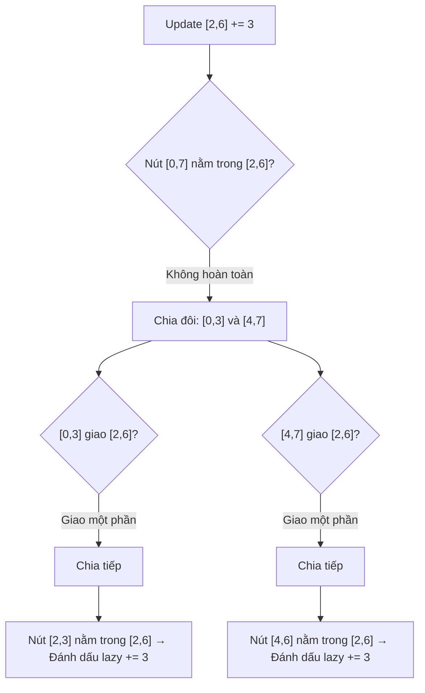

# Cải Tiến Segment Tree - Lazy Propagation & Merging

> **Tác giả:** FPTOJ Team<br>
> **Nội dung tham khảo từ:** VNOI Wiki, CP-Algorithms - Segment Tree

---

## 1. Bản chất vấn đề

### Bài toán: Cập nhật đoạn và truy vấn đoạn

Cho mảng $A$ gồm $N$ phần tử, thực hiện $Q$ truy vấn:

- **Update range:** Cộng $val$ vào tất cả phần tử trong đoạn $[l, r]$.
- **Query range:** Tìm tổng / min / max trong đoạn $[l, r]$.

**Segment Tree thường** chỉ hỗ trợ update 1 phần tử $O(\log N)$. Update đoạn bằng cách gọi update từng phần tử $\Rightarrow O(N \log N)$ mỗi truy vấn $\Rightarrow$ **quá chậm!**

**Lazy Propagation:** Đánh dấu "lười" (lazy), chỉ lan truyền khi cần $\Rightarrow O(\log N)$ mỗi truy vấn.

---

## 2. Tư duy cốt lõi

### Lazy Propagation — Ý tưởng

Khi cập nhật đoạn $[l, r]$, thay vì lan giá trị xuống tất cả lá:

1. Đánh dấu nút quản lý toàn bộ $[l, r]$ là "lazy" (chưa lan).
2. Chỉ lan (push down) khi cần truy vấn con của nút đó.

### Minh họa luồng



### Trace chi tiết

**Mảng:** $A = [1, 2, 3, 4, 5, 6, 7, 8]$, $N = 8$

**Cây Segment Tree ban đầu (tổng):**

| Nút | Đoạn | Tổng |
|-----|------|------|
| $[0,7]$ | $[1,2,3,4,5,6,7,8]$ | $36$ |
| $[0,3]$ | $[1,2,3,4]$ | $10$ |
| $[4,7]$ | $[5,6,7,8]$ | $26$ |

**Update: Cộng 3 vào đoạn $[2, 6]$:**

| Bước | Nút | Thao tác | lazy | sum mới |
|------|-----|----------|------|---------|
| 1 | $[0,7]$ | Chia đôi | 0 | 36 |
| 2 | $[0,3]$ | Giao $[2,6]$ → chia | 0 | 10 |
| 3 | $[2,3]$ | Giao $[2,6]$ → chia | 0 | 7 |
| 4 | $[2,2]$ | Nằm trong $[2,6]$ → lazy += 3 | 3 | $3 + 3 = 6$ |
| 5 | $[3,3]$ | Nằm trong $[2,6]$ → lazy += 3 | 3 | $4 + 3 = 7$ |
| 6 | Cập nhật $[2,3]$ sum | | | $6 + 7 = 13$ |
| 7 | $[4,7]$ | Giao $[2,6]$ → chia | 0 | 26 |
| 8 | $[4,5]$ | Nằm trong $[2,6]$ → lazy += 3 | 3 | $11 + 6 = 17$ |
| 9 | $[6,7]$ | Giao $[2,6]$ → chia | 0 | 15 |
| 10 | $[6,6]$ | Nằm trong $[2,6]$ → lazy += 3 | 3 | $7 + 3 = 10$ |
| 11 | $[7,7]$ | Không giao → giữ nguyên | 0 | 8 |
| 12 | Cập nhật $[6,7]$ sum | | | $10 + 8 = 18$ |
| 13 | Cập nhật $[4,7]$ sum | | | $17 + 18 = 35$ |
| 14 | Cập nhật $[0,7]$ sum | | | $13 + 35 = 48$ |

**Kết quả:** Tổng toàn mảng = $48 = 36 + 3 \times 4$ (4 phần tử trong $[2,6]$ được cộng 3).

---

## 3. Phân tích tính đúng đắn

### Tại sao Lazy Propagation đúng?

**Bất biến (Invariant):** Giá trị `sum[node]` luôn đúng cho đoạn mà node quản lý, **bao gồm cả giá trị lazy chưa lan**.

Khi cần truy vấn con:

1. **Push down:** Lan giá trị lazy từ node xuống 2 con.
2. Reset lazy của node về 0.
3. Tiếp tục đệ quy.

Đảm bảo: Trước khi truy vấn bất kỳ nút nào, tất cả tổ tiên lazy đã được push down.

---

## 4. Đánh giá độ phức tạp

| Thao tác | Thời gian | Không gian |
|----------|-----------|------------|
| Xây cây | $O(N)$ | $O(N)$ |
| Update đoạn | $O(\log N)$ | $O(1)$ |
| Query đoạn | $O(\log N)$ | $O(1)$ |
| **Tổng cho $Q$ truy vấn** | $O((N + Q) \log N)$ | $O(N)$ |

---

## Code minh họa

### Segment Tree với Lazy Propagation — Update đoạn, Query tổng

=== "C++"

    ```cpp
    #include <bits/stdc++.h>
    using namespace std;

    int n;
    vector<long long> tree, lazy;

    void push(int node, int lo, int hi) {
        if (lazy[node] != 0) {
            tree[node] += lazy[node] * (hi - lo + 1);
            if (lo != hi) {
                lazy[2 * node] += lazy[node];
                lazy[2 * node + 1] += lazy[node];
            }
            lazy[node] = 0;
        }
    }

    void update(int node, int lo, int hi, int l, int r, long long val) {
        push(node, lo, hi);
        if (r < lo || hi < l) return;
        if (l <= lo && hi <= r) {
            lazy[node] += val;
            push(node, lo, hi);
            return;
        }
        int mid = (lo + hi) / 2;
        update(2 * node, lo, mid, l, r, val);
        update(2 * node + 1, mid + 1, hi, l, r, val);
        tree[node] = tree[2 * node] + tree[2 * node + 1];
    }

    long long query(int node, int lo, int hi, int l, int r) {
        push(node, lo, hi);
        if (r < lo || hi < l) return 0;
        if (l <= lo && hi <= r) return tree[node];
        int mid = (lo + hi) / 2;
        return query(2 * node, lo, mid, l, r) +
               query(2 * node + 1, mid + 1, hi, l, r);
    }

    int main() {
        ios_base::sync_with_stdio(false);
        cin.tie(NULL);

        cin >> n;
        tree.assign(4 * n, 0);
        lazy.assign(4 * n, 0);

        for (int i = 0; i < n; i++) {
            long long val;
            cin >> val;
            update(1, 0, n - 1, i, i, val);
        }

        int q;
        cin >> q;
        while (q--) {
            int type;
            cin >> type;
            if (type == 1) {
                int l, r;
                long long val;
                cin >> l >> r >> val;
                l--; r--;
                update(1, 0, n - 1, l, r, val);
            } else {
                int l, r;
                cin >> l >> r;
                l--; r--;
                cout << query(1, 0, n - 1, l, r) << "\n";
            }
        }
        return 0;
    }
    ```

=== "Python"

    ```python
    import sys
    input = sys.stdin.readline
    sys.setrecursionlimit(1 << 25)

    n = int(input())
    tree = [0] * (4 * n)
    lazy = [0] * (4 * n)

    def push(node, lo, hi):
        if lazy[node] != 0:
            tree[node] += lazy[node] * (hi - lo + 1)
            if lo != hi:
                lazy[2 * node] += lazy[node]
                lazy[2 * node + 1] += lazy[node]
            lazy[node] = 0

    def update(node, lo, hi, l, r, val):
        push(node, lo, hi)
        if r < lo or hi < l:
            return
        if l <= lo and hi <= r:
            lazy[node] += val
            push(node, lo, hi)
            return
        mid = (lo + hi) // 2
        update(2 * node, lo, mid, l, r, val)
        update(2 * node + 1, mid + 1, hi, l, r, val)
        tree[node] = tree[2 * node] + tree[2 * node + 1]

    def query(node, lo, hi, l, r):
        push(node, lo, hi)
        if r < lo or hi < l:
            return 0
        if l <= lo and hi <= r:
            return tree[node]
        mid = (lo + hi) // 2
        return query(2 * node, lo, mid, l, r) + query(2 * node + 1, mid + 1, hi, l, r)

    a = list(map(int, input().split()))
    for i in range(n):
        update(1, 0, n - 1, i, i, a[i])

    q = int(input())
    for _ in range(q):
        parts = list(map(int, input().split()))
        if parts[0] == 1:
            l, r, val = parts[1] - 1, parts[2] - 1, parts[3]
            update(1, 0, n - 1, l, r, val)
        else:
            l, r = parts[1] - 1, parts[2] - 1
            print(query(1, 0, n - 1, l, r))
    ```
