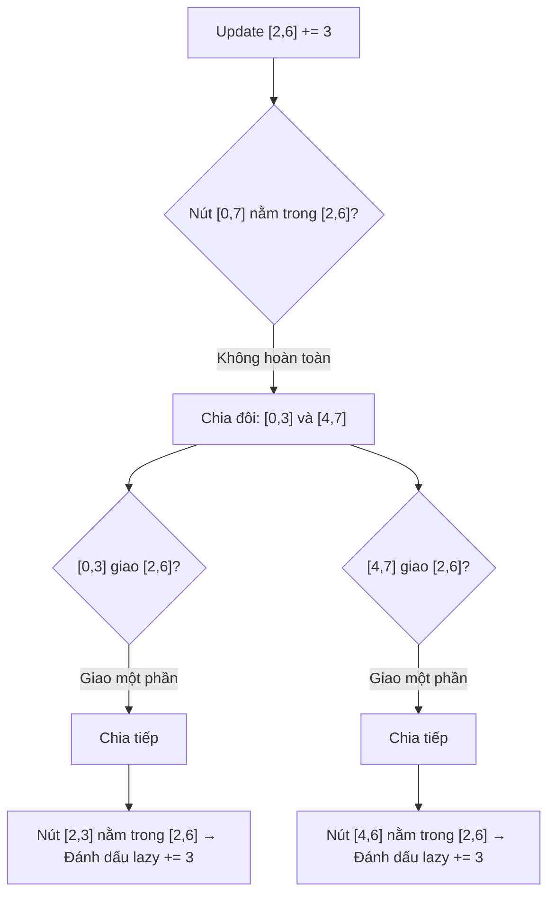

# Cải Tiến Segment Tree - Lazy Propagation & Merging

> **Tác giả:** FPTOJ Team<br>
> **Nội dung tham khảo từ:** VNOI Wiki, CP-Algorithms - Segment Tree

---

## 1. Bản chất vấn đề

### Bài toán: Cập nhật đoạn và truy vấn đoạn

Cho mảng $A$ gồm $N$ phần tử, thực hiện $Q$ truy vấn:

- **Update range:** Cộng $val$ vào tất cả phần tử trong đoạn $[l, r]$.
- **Query range:** Tìm tổng / min / max trong đoạn $[l, r]$.

**Segment Tree thường** chỉ hỗ trợ update 1 phần tử $O(\log N)$. Update đoạn bằng cách gọi update từng phần tử $\Rightarrow O(N \log N)$ mỗi truy vấn $\Rightarrow$ **quá chậm!**

**Lazy Propagation:** Đánh dấu "lười" (lazy), chỉ lan truyền khi cần $\Rightarrow O(\log N)$ mỗi truy vấn.

---

## 2. Tư duy cốt lõi

### Lazy Propagation — Ý tưởng

Khi cập nhật đoạn $[l, r]$, thay vì lan giá trị xuống tất cả lá:

1. Đánh dấu nút quản lý toàn bộ $[l, r]$ là "lazy" (chưa lan).
2. Chỉ lan (push down) khi cần truy vấn con của nút đó.

### Minh họa luồng


```mermaid
flowchart TD
    A["Update [2,6] += 3"] --> B{"Nút [0,7] nằm trong [2,6]?"}
    B -- "Không hoàn toàn" --> C["Chia đôi: [0,3] và [4,7]"]
    C --> D{"[0,3] giao [2,6]?"}
    C --> E{"[4,7] giao [2,6]?"}
    D -- "Giao một phần" --> F["Chia tiếp"]
    E -- "Giao một phần" --> G["Chia tiếp"]
    F --> H["Nút [2,3] nằm trong [2,6] → Đánh dấu lazy += 3"]
    G --> I["Nút [4,6] nằm trong [2,6] → Đánh dấu lazy += 3"]
```

### Trace chi tiết

**Mảng:** $A = [1, 2, 3, 4, 5, 6, 7, 8]$, $N = 8$

**Cây Segment Tree ban đầu (tổng):**

| Nút | Đoạn | Tổng |
|-----|------|------|
| $[0,7]$ | $[1,2,3,4,5,6,7,8]$ | $36$ |
| $[0,3]$ | $[1,2,3,4]$ | $10$ |
| $[4,7]$ | $[5,6,7,8]$ | $26$ |

**Update: Cộng 3 vào đoạn $[2, 6]$:**

| Bước | Nút | Thao tác | lazy | sum mới |
|------|-----|----------|------|---------|
| 1 | $[0,7]$ | Giao một phần → chia đôi | 0 | 36 |
| 2 | $[0,3]$ | Giao một phần → chia | 0 | 10 |
| 3 | $[2,3]$ | Nằm gọn trong $[2,6]$ → lazy += 3, dừng (không xuống lá) | 3 | $7 + 3 \times 2 = 13$ |
| 4 | $[4,7]$ | Giao một phần → chia | 0 | 26 |
| 5 | $[4,5]$ | Nằm gọn trong $[2,6]$ → lazy += 3, dừng | 3 | $11 + 3 \times 2 = 17$ |
| 6 | $[6,7]$ | Giao một phần → chia | 0 | 15 |
| 7 | $[6,6]$ | Nằm gọn trong $[2,6]$ → lazy += 3, dừng | 3 | $7 + 3 = 10$ |
| 8 | $[7,7]$ | Không giao → giữ nguyên | 0 | 8 |
| 9 | Cập nhật $[6,7]$ sum | | | $10 + 8 = 18$ |
| 10 | Cập nhật $[4,7]$ sum | | | $17 + 18 = 35$ |
| 11 | Cập nhật $[0,7]$ sum | | | $13 + 35 = 48$ |

!!! tip "Điểm mấu chốt của lazy"
    Khi đoạn của nút **nằm gọn** trong đoạn update (như $[2,3] \subset [2,6]$), ta chỉ cộng lazy và cập nhật `sum`, **không đi xuống lá**. Đó là lý do update chỉ tốn $O(\log N)$ thay vì $O(N)$.

**Kết quả:** Tổng toàn mảng = $48 = 36 + 3 \times 4$ (4 phần tử trong $[2,6]$ được cộng 3).

---

## 3. Phân tích tính đúng đắn

### Tại sao Lazy Propagation đúng?

**Bất biến (Invariant):** Giá trị `sum[node]` luôn đúng cho đoạn mà node quản lý, **bao gồm cả giá trị lazy chưa lan**.

Khi cần truy vấn con:

1. **Push down:** Lan giá trị lazy từ node xuống 2 con.
2. Reset lazy của node về 0.
3. Tiếp tục đệ quy.

Đảm bảo: Trước khi truy vấn bất kỳ nút nào, tất cả tổ tiên lazy đã được push down.

---

## 4. Đánh giá độ phức tạp

| Thao tác | Thời gian | Không gian |
|----------|-----------|------------|
| Xây cây | $O(N)$ | $O(N)$ |
| Update đoạn | $O(\log N)$ | $O(1)$ |
| Query đoạn | $O(\log N)$ | $O(1)$ |
| **Tổng cho $Q$ truy vấn** | $O((N + Q) \log N)$ | $O(N)$ |

---

## Code minh họa

### Segment Tree với Lazy Propagation — Update đoạn, Query tổng

=== "C++"

    ```cpp
    #include <bits/stdc++.h>
    using namespace std;

    int n;
    vector<long long> tree, lazy;  // cây phân đoạn và mảng lazy

    void push(int node, int lo, int hi) {
        if (lazy[node] != 0) {
            tree[node] += lazy[node] * (hi - lo + 1);  // cập nhật node
            if (lo != hi) {                    // lan xuống hai con
                lazy[2 * node] += lazy[node];
                lazy[2 * node + 1] += lazy[node];
            }
            lazy[node] = 0;                    // reset lazy
        }
    }

    void update(int node, int lo, int hi, int l, int r, long long val) {
        push(node, lo, hi);                    // lan lazy trước
        if (r < lo || hi < l) return;          // ngoài đoạn
        if (l <= lo && hi <= r) {              // nằm hoàn toàn trong đoạn
            lazy[node] += val;
            push(node, lo, hi);
            return;
        }
        int mid = (lo + hi) / 2;
        update(2 * node, lo, mid, l, r, val);
        update(2 * node + 1, mid + 1, hi, l, r, val);
        tree[node] = tree[2 * node] + tree[2 * node + 1];  // tổng hợp
    }

    long long query(int node, int lo, int hi, int l, int r) {
        push(node, lo, hi);                    // lan lazy trước
        if (r < lo || hi < l) return 0;        // ngoài đoạn
        if (l <= lo && hi <= r) return tree[node];  // nằm hoàn toàn
        int mid = (lo + hi) / 2;
        return query(2 * node, lo, mid, l, r) +
               query(2 * node + 1, mid + 1, hi, l, r);
    }

    int main() {
        ios_base::sync_with_stdio(false);
        cin.tie(NULL);

        cin >> n;
        tree.assign(4 * n, 0);
        lazy.assign(4 * n, 0);

        for (int i = 0; i < n; i++) {
            long long val;
            cin >> val;
            update(1, 0, n - 1, i, i, val);  // xây cây
        }

        int q;
        cin >> q;
        while (q--) {
            int type;
            cin >> type;
            if (type == 1) {
                int l, r;
                long long val;
                cin >> l >> r >> val;
                l--; r--;
                update(1, 0, n - 1, l, r, val);  // cập nhật đoạn
            } else {
                int l, r;
                cin >> l >> r;
                l--; r--;
                cout << query(1, 0, n - 1, l, r) << "\n";  // truy vấn tổng đoạn
            }
        }
        return 0;
    }
    ```

=== "Python"

    ```python
    import sys
    input = sys.stdin.readline
    sys.setrecursionlimit(1 << 25)

    n = int(input())
    tree = [0] * (4 * n)   # cây phân đoạn
    lazy = [0] * (4 * n)   # mảng lazy

    def push(node, lo, hi):
        if lazy[node] != 0:
            tree[node] += lazy[node] * (hi - lo + 1)  # cập nhật node
            if lo != hi:                               # lan xuống hai con
                lazy[2 * node] += lazy[node]
                lazy[2 * node + 1] += lazy[node]
            lazy[node] = 0                             # reset lazy

    def update(node, lo, hi, l, r, val):
        push(node, lo, hi)            # lan lazy trước
        if r < lo or hi < l:          # ngoài đoạn
            return
        if l <= lo and hi <= r:       # nằm hoàn toàn trong đoạn
            lazy[node] += val
            push(node, lo, hi)
            return
        mid = (lo + hi) // 2
        update(2 * node, lo, mid, l, r, val)
        update(2 * node + 1, mid + 1, hi, l, r, val)
        tree[node] = tree[2 * node] + tree[2 * node + 1]  # tổng hợp

    def query(node, lo, hi, l, r):
        push(node, lo, hi)            # lan lazy trước
        if r < lo or hi < l:          # ngoài đoạn
            return 0
        if l <= lo and hi <= r:       # nằm hoàn toàn
            return tree[node]
        mid = (lo + hi) // 2
        return query(2 * node, lo, mid, l, r) + query(2 * node + 1, mid + 1, hi, l, r)

    a = list(map(int, input().split()))
    for i in range(n):
        update(1, 0, n - 1, i, i, a[i])  # xây cây

    q = int(input())
    for _ in range(q):
        parts = list(map(int, input().split()))
        if parts[0] == 1:
            l, r, val = parts[1] - 1, parts[2] - 1, parts[3]
            update(1, 0, n - 1, l, r, val)  # cập nhật đoạn
        else:
            l, r = parts[1] - 1, parts[2] - 1
            print(query(1, 0, n - 1, l, r))  # truy vấn tổng đoạn
    ```

---

## 5. Lỗi thường gặp (SAI / ĐÚNG)

### SAI 1: Quên `push` trước khi query / update → đọc giá trị cũ

```cpp
// SAI: không lan lazy, tree[node] của con chưa được cập nhật
long long query(int node, int lo, int hi, int l, int r) {
    if (r < lo || hi < l) return 0;
    ...
}
```

```cpp
// ĐÚNG: dòng đầu tiên của update/query LUÔN là push
long long query(int node, int lo, int hi, int l, int r) {
    push(node, lo, hi); // lan lazy của cha xuống trước khi đi tiếp
    if (r < lo || hi < l) return 0;
    ...
}
```

| Vị trí quên `push` | Hậu quả |
|---|---|
| Đầu `update` | Cộng dồn sai vì con chưa nhận lazy cũ của cha |
| Đầu `query` | Trả về tổng cũ, thiếu phần lazy chưa lan |

### SAI 2: Build cây bằng $N$ lần update-điểm → $O(N \log N)$ chậm

```cpp
// SAI (chậm, code hiện tại trong bài cũng đang làm vậy để minh họa):
for (int i = 0; i < n; i++) update(1, 0, n - 1, i, i, a[i]);
```

```cpp
// ĐÚNG: build đệ quy O(N) — lá = a[lo], nút trong = tổng 2 con
void build(int node, int lo, int hi) {
    if (lo == hi) { tree[node] = a[lo]; return; } // lá: giá trị mảng
    int mid = (lo + hi) / 2;
    build(2 * node, lo, mid);          // xây cây con trái
    build(2 * node + 1, mid + 1, hi);  // xây cây con phải
    tree[node] = tree[2 * node] + tree[2 * node + 1]; // tổng hợp
}
```

### SAI 3: Nhầm `lo/hi` (đoạn nút quản lý) với `l/r` (đoạn truy vấn)

```cpp
// SAI: đảo điều kiện → nhánh cắt sai, kết quả sai
if (lo <= l && r <= hi) return tree[node];
if (l < lo || hi < r) return;
```

```cpp
// ĐÚNG: đọc theo thứ tự "nút [lo,hi] so với truy vấn [l,r]"
if (r < lo || hi < l) return;          // ngoài đoạn: không giao nhau
if (l <= lo && hi <= r) return tree[node]; // nằm gọn: lấy luôn
```

> **Mẹo nhớ:** `lo/hi` đi với `node` (đoạn của nút), `l/r` đi với `val`/truy vấn. Điều kiện "nằm gọn" luôn là `l <= lo && hi <= r` (truy vấn bao trùm nút).

---

## 6. Bài tập luyện tập

| Mã bài | Tên bài tập | Độ khó | Kiểu bài tập (Bản chất) |
|---|---|---|---|
| [`st-range-mul-add`](https://fptoj.com/problem/st-range-mul-add) | Cộng Nhân Đoạn Tính Tổng | ⭐⭐⭐ | Quản lý đồng thời 2 nhãn lười (cộng & nhân) |
| [`st-dynamic`](https://fptoj.com/problem/st-dynamic) | Cây Phân Đoạn Động | ⭐⭐⭐ | Dynamic Segment Tree (cấp phát động) |
| [`st-tree-path`](https://fptoj.com/problem/st-tree-path) | Cập Nhật Đường Đi Trên Cây | ⭐⭐⭐⭐ | Phân rã cây Heavy-Light Decomposition (HLD) |
| [`st-sweepline-area`](https://fptoj.com/problem/st-sweepline-area) | Hợp Diện Tích Hình Chữ Nhật | ⭐⭐⭐⭐ | Thuật toán Sweep Line quét đĩa |
| [`st-2d-basic`](https://fptoj.com/problem/st-2d-basic) | Cập Nhật Điểm Tổng Ma Trận Con | ⭐⭐⭐⭐ | 2D Segment Tree (Cây lồng cây 2 chiều) |
| [`st-persistent-sum`](https://fptoj.com/problem/st-persistent-sum) | Tổng Đoạn Trên Lịch Sử | ⭐⭐⭐⭐ | Cây phân đoạn bền vững (Persistent Segment Tree) |
| [`st-merge`](https://fptoj.com/problem/st-merge) | Tần Suất Màu Sắc Cây Con | ⭐⭐⭐⭐ | Gộp cây phân đoạn (Segment Tree Merging) |
| [`st-range-chmin`](https://fptoj.com/problem/st-range-chmin) | Chmin Đoạn Và Tính Tổng | ⭐⭐⭐⭐⭐ | Segment Tree Beats (Cập nhật min đoạn nâng cao) |

---

## 6. Tài liệu tham khảo

*   [CP-Algorithms - Segment Tree Beats](https://cp-algorithms.com/data_structures/segment_tree.html#segment-tree-beats)
*   [VNOI Wiki - Heavy-Light Decomposition](https://wiki.vnoi.info/algo/data-structures/heavy-light-decomposition)
*   [VNOI Wiki - Persistent Segment Tree](https://wiki.vnoi.info/algo/data-structures/persistent-segment-tree)
*   [Codeforces - Segment Tree Merging](https://codeforces.com/blog/entry/19004)

