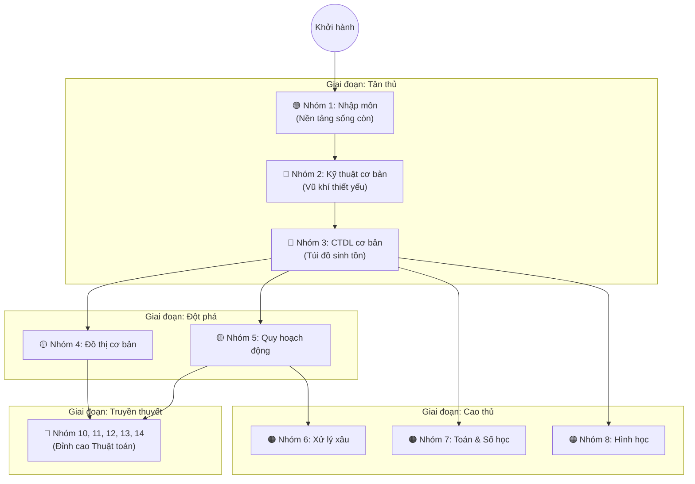

# 🌟 Hành trình Lập trình Thi đấu: Từ Zero đến Hero

Chào mừng bạn đến với **Vũ trụ Lập trình Thi đấu** của FPTOJ! Bạn có thể xem đây như một trò chơi nhập vai (RPG), nơi bạn bắt đầu từ một "Tân thủ" và rèn luyện kỹ năng qua từng thử thách để trở thành một "Đại cao thủ" (Grandmaster). 

!!! warning "Lưu ý sống còn: Hãy trang bị vũ khí trước khi ra trận!"
    Nếu bạn **chưa từng viết code** hoặc chưa tự tin với kỹ năng lập trình, hãy mài dũa "vũ khí" của mình trước tiên:
    👉 Học [**Chương 1: Python cho Thi Đấu**](../coding/python/index.md) 
    👉 Hoặc [**Chương 2: C++ cho Thi Đấu**](../coding/cpp/index.md) 
    
    *Tuyệt đối không lao vào học thuật toán khi chưa nắm vững cú pháp ngôn ngữ!*

---

## 🗺️ Bản đồ Thăng cấp (Roadmap)

Dưới đây là sa bàn chiến lược giúp bạn định hướng lộ trình. Hãy kiên nhẫn đi từng bước, xây chắc móng nhà trước khi lên tầng cao!

*(Bạn muốn xem gợi ý mốc thời gian cụ thể cho từng giai đoạn? [Xem Lộ trình chi tiết tại đây](roadmap.md))*

---

## 🎒 Giai đoạn 1: Những bước chân đầu tiên (Tân thủ)

> **Mục tiêu:** Xây dựng tư duy thuật toán cơ bản. Sau khi cày xong khu vực này, bạn có thể "solo" được 60-70% các bài toán mức độ dễ.

### 🟢 Nhóm 1: Nhập môn (Bài 1 - 6)
| # | Bài học | Mô tả ngắn gọn | Độ khó |
|---|---------|-------|--------|
| 01 | [Setup môi trường thi đấu](setup-moi-truong.md) | Cài đặt VS Code, Template C++/Python chuẩn. | ⭐ |
| 02 | [Độ phức tạp thời gian](do-phuc-tap-thoi-gian.md) | Cách ước lượng xem code của bạn có bị Time Limit Exceeded (TLE) không. | ⭐ |
| 03 | [Thuật toán sắp xếp](thuat-toan-sap-xep.md) | Cách để biến một đống hỗn độn thành có trật tự. | ⭐⭐ |
| 04 | [Tìm kiếm nhị phân](tim-kiem-nhi-phan.md) | Tuyệt kỹ tìm đồ cực nhanh như cách lật từ điển. | ⭐⭐ |
| 05 | [Phép toán bit](phep-toan-bit.md) | Trực tiếp điều khiển bộ nhớ với AND, OR, XOR. | ⭐⭐ |
| 05b| [Fun with Bits](fun-with-bits.md) | Các mẹo vặt ma thuật thao tác trên Bit. | ⭐⭐ |
| 06 | [Đệ quy và quay lui](de-quy-va-quay-lui.md) | Cách giải quyết một vấn đề lớn bằng cách chia nó thành các phiên bản nhỏ hơn của chính nó. | ⭐⭐ |

### 🔵 Nhóm 2: Kỹ thuật cơ bản (Bài 7 - 9)
| # | Bài học | Mô tả ngắn gọn | Độ khó |
|---|---------|-------|--------|
| 07 | [Kĩ thuật hai con trỏ](ky-thuat-hai-con-tro.md) | Mẹo dùng 2 ngón tay chỉ vào mảng để tìm đáp án cực nhanh. | ⭐⭐ |
| 08 | [Mảng, Stack, Prefix Sum](mang-stack-prefix-sum.md) | Những cấu trúc dữ liệu nền tảng bạn sẽ dùng hằng ngày. | ⭐⭐ |
| 09 | [Lũy thừa nhị phân & Sàng nguyên tố](luy-thua-nhi-phan-sang-nguyen-to.md) | Tính toán nhanh như chớp và sàng lọc các số nguyên tố. | ⭐⭐ |
| 09b| [Chia đôi tập (Meet in the Middle)](meet-in-the-middle.md) | Phương pháp bẻ đôi bài toán để vượt rào giới hạn thời gian. | ⭐⭐ |
| 09c| [Rời rạc hoá (Nén số)](discretization.md) | Mẹo thu nhỏ các con số khổng lồ về một không gian dễ quản lý. | ⭐ |

### 🔵 Nhóm 3: Cấu trúc dữ liệu (CTDL) cơ bản (Bài 10 - 18)
| # | Bài học | Mô tả ngắn gọn | Độ khó |
|---|---------|-------|--------|
| 10 | [Linked List chi tiết](linked-list.md) | Danh sách liên kết - linh hoạt hơn mảng truyền thống. | ⭐⭐ |
| 11 | [Queue cơ bản](queue.md) | Xếp hàng chờ đến lượt (FIFO - First In First Out). | ⭐⭐ |
| 12 | [Hash Table](hash-table.md) | Bảng băm giúp truy xuất dữ liệu trong chớp mắt (O(1)). | ⭐⭐ |
| 13 | [Heap (Hàng đợi ưu tiên)](heap.md) | Hàng đợi dành riêng cho "VIP" - giá trị lớn/nhỏ luôn đứng đầu. | ⭐⭐ |
| 14 | [DSU (Gộp tập hợp)](dsu.md) | Kỹ năng liên kết các nhóm bạn và kiểm tra xem ai quen ai. | ⭐⭐ |
| 14b| [DSU Rollback](dsu-rollback.md) | Gộp nhóm rồi nhưng lại muốn "quay xe". | ⭐⭐⭐ |
| 15 | [Deque & Sliding Window](deque-sliding-window.md) | Xếp hàng nhưng có thể chen ngang cả đầu lẫn cuối. | ⭐⭐⭐ |
| 16 | [Trie](trie.md) | Cây tiền tố - cứu tinh cho các bài toán tìm kiếm từ vựng. | ⭐⭐⭐ |
| 17 | [Segment Tree](segment-tree.md) | Cây phân đoạn - Vũ khí tối thượng xử lý truy vấn trên mảng. | ⭐⭐⭐ |
| 17b| [Cải tiến Segment Tree](improved-seg-tree.md) | Nâng cấp Segment Tree để cập nhật hàng loạt siêu tốc (Lazy). | ⭐⭐⭐ |
| 18 | [Fenwick Tree (BIT)](fenwick-tree.md) | Nhỏ gọn, chạy nhanh, dễ code - thay thế hoàn hảo cho Segment Tree. | ⭐⭐⭐ |
| 18b| [BIT 2D](bit-2d.md) | Nâng cấp Fenwick Tree lên không gian 2 chiều. | ⭐⭐⭐ |
| 18c| [Persistent Segment Tree](persistent-segment-tree.md) | Giữ lại các phiên bản lịch sử để "du hành thời gian" lúc cần. | ⭐⭐⭐ |
| 18d| [Skip List](skip-list.md) | Cấu trúc dữ liệu nhảy vọt đầy tính xác suất. | ⭐⭐⭐ |
| 18e| ["Nhảy nhị phân" O(n)](binary-lifting-array.md) | Nhảy cóc bậc 2^k để tìm đường đi siêu tốc. | ⭐⭐⭐ |
| 18f| [Static Wavelet Tree](wavelet-tree.md) | CTDL cực mạnh để đếm số lượng phần tử nhỏ hơn X trong khoảng. | ⭐⭐⭐ |
| 18g| [Interval Tree](interval-tree.md) | Truy vấn tìm sự giao nhau của các đoạn thẳng. | ⭐⭐⭐⭐ |

---

## Giai đoạn 2: Đột phá ranh giới (Trung cấp)

> **Mục tiêu:** Mở khóa hai kỹ năng khó nhằn nhất nhưng mạnh mẽ nhất: Đồ thị và Quy hoạch động. Đây là nơi phân loại giữa tân thủ và cao thủ!

### Nhóm 4: Thuật toán đồ thị (Bài 19 - 22)
| # | Bài học | Mô tả ngắn gọn | Độ khó |
|---|---------|-------|--------|
| 19 | [BFS/DFS trên đồ thị](bfs-dfs-do-thi.md) | Các kỹ năng dò đường cơ bản nhất trong mê cung. | ⭐⭐ |
| 19b| [BFS 0-1](bfs-01.md) | Dò đường cực nhanh khi con đường chỉ dài 0 hoặc 1 mét. | ⭐⭐ |
| 20 | [MST, Dijkstra, Topo Sort](mst-dijkstra-topo-sort.md) | Tìm đường đi ngắn nhất như Google Maps. | ⭐⭐⭐ |
| 21 | [Floyd-Warshall & Bellman-Ford](floyd-warshall-bellman-ford.md) | Xử lý những con đường xuyên không có trọng số âm. | ⭐⭐⭐ |
| 21b| [SPFA](spfa.md) | Phiên bản tối ưu của Bellman-Ford (rất hay bị TLE, cẩn thận!). | ⭐⭐⭐ |
| 21c| [Chu trình Euler](euler-circuit.md) | Đường đi qua tất cả cây cầu mà không bị lặp lại. | ⭐⭐ |
| 22 | [LCA & Binary Lifting](lca-binary-lifting.md) | Tìm Tổ tiên chung gần nhất trên gia phả họ hàng (Cây). | ⭐⭐⭐ |

### Nhóm 5: Quy hoạch động & Tham lam (Bài 23 - 25)
| # | Bài học | Mô tả ngắn gọn | Độ khó |
|---|---------|-------|--------|
| 23 | [Greedy](greedy.md) | Tham lam một cách thông minh để giành lợi ích lớn nhất. | ⭐⭐⭐ |
| 23b| [Matroid](matroid.md) | Lý thuyết toán học bảo chứng cho tính đúng đắn của Tham lam. | ⭐⭐⭐⭐ |
| 24 | [Quy hoạch động (DP)](quy-hoach-dong.md) | Đỉnh cao tư duy thuật toán - Nhớ lại quá khứ để kiến tạo tương lai. | ⭐⭐⭐⭐ |
| 24b| [Quy hoạch động Bitmask](bitmask-dp.md) | Quy hoạch động kết hợp với Phép toán Bit để tối ưu bộ nhớ. | ⭐⭐⭐ |
| 24c| [Quy hoạch động trên DAG](dp-on-dag.md) | Truyền trạng thái trên đồ thị không có vòng lặp. | ⭐⭐ |
| 25 | [Binary Search on Answer](binary-search-on-answer.md) | Khi không thể tìm trực tiếp, hãy đoán mò đáp án một cách có học thức. | ⭐⭐⭐ |

---

## Giai đoạn 3: Rèn luyện Bí kíp (Cao thủ)

> **Mục tiêu:** Trở thành chuyên gia xử lý các bài toán đặc thù về Chuỗi, Toán học và Hình học. Rất cần thiết cho các kỳ thi học sinh giỏi cấp Quốc gia!

### Nhóm 6: Xử lý xâu ký tự (Bài 26 - 29)
| # | Bài học | Mô tả | Độ khó |
|---|---------|-------|--------|
| 26 | [KMP - Tìm xâu](kmp-tim-xau.md) | Tìm kiếm một đoạn văn bị giấu kín cực nhanh mà không cần đối chiếu lại từ đầu. | ⭐⭐⭐ |
| 27 | [Hash xâu & Z-algorithm](hash-xau-z-algorithm.md) | Biến chữ thành số để kiểm tra sự giống nhau trong vòng O(1). | ⭐⭐⭐ |
| 28 | [Manacher](manacher.md) | Truy tìm xâu đối xứng (đọc ngược xuôi như nhau) dài nhất. | ⭐⭐⭐⭐ |
| 29 | [Suffix Array](suffix-array.md) | Mảng chứa tất cả các hậu tố - cẩm nang bách khoa toàn thư của xâu. | ⭐⭐⭐⭐ |
| 29b| [Palindrome Tree](palindrome-tree.md) | Cây lưu trữ sự đối xứng (Eertree) siêu việt. | ⭐⭐⭐⭐ |
| 29c| [Suffix Tree](suffix-tree.md) | Cây hậu tố đầy quyền năng nhưng cực kì khó cài đặt. | ⭐⭐⭐⭐ |

### Nhóm 7: Toán học & Số học (Bài 30 - 41)
| # | Bài học | Mô tả | Độ khó |
|---|---------|-------|--------|
| 30 | [Euclid & Modular Inverse](euclid-modular-inverse.md) | Thuật toán kinh điển nhất của nhân loại và phép chia lấy dư. | ⭐⭐⭐ |
| 30b| [Hàm Phi Euler](phi-euler.md) | Đếm số lượng những con số không có chung ước với $N$. | ⭐⭐ |
| 30c| [Định lý Wilson & Lucas](wilson-lucas.md) | Bí kíp giải quyết số lớn của Tổ hợp Toán học. | ⭐⭐ |
| 30d| [Định lý Thặng dư (CRT)](crt.md) | Thặng dư Trung Hoa - Giải hệ phương trình chia lấy dư. | ⭐⭐ |
| 30e| [Hàm Mobius & Nhân tính](mobius-multiplicative.md) | Bước vào thế giới ảo diệu của Hàm Nhân tính. | ⭐⭐⭐⭐ |
| 30f| [Giai thừa & Căn bậc 2 mod](factorial-sqrt-mod.md) | Tính căn bậc 2 trong thế giới phần dư. | ⭐⭐⭐ |
| 31 | [Tổ hợp & Xác suất](to-hop-xac-suat.md) | Các bài toán bốc bi, gieo xúc xắc và Hoán vị/Chỉnh hợp/Tổ hợp. | ⭐⭐⭐ |
| 32 | [Số học nâng cao](so-hoc-nang-cao.md) | Cẩm nang Toán Số tổng hợp mức độ khó. | ⭐⭐⭐⭐ |
| 33 | [Lý thuyết trò chơi](ly-thuyet-tro-choi.md) | Chơi Nim và tính chỉ số Grundy để luôn luôn chiến thắng. | ⭐⭐⭐⭐ |
| 34 | [Sàng nâng cao & Hàm ước](sang-nang-cao-ham-uoc.md) | Tối ưu hóa việc phân tích thừa số bằng Linear Sieve. | ⭐⭐⭐ |
| 35 | [Bao hàm - Loại trừ](nguyen-ly-bao-ham-loai-tru.md) | Kỹ thuật bù trừ đếm các trường hợp bị trùng lặp. | ⭐⭐⭐ |
| 36 | [Đếm đường đi trên lưới](dem-duong-di-luoi.md) | Toán Tổ hợp trên mặt phẳng tọa độ (Catalan number). | ⭐⭐⭐ |
| 37 | [Nhân ma trận](nhan-ma-tran.md) | Tính số Fibonacci thứ 1 tỷ trong vòng 1 nốt nhạc. | ⭐⭐⭐ |
| 38 | [Logarithm rời rạc](logarithm-roi-rac.md) | Bước tiến nhỏ, nhảy vọt lớn (Baby-Step Giant-Step). | ⭐⭐⭐⭐ |
| 39 | [Căn nguyên thủy](can-nguyen-thuy.md) | Nền tảng mật mã học - Primitive root. | ⭐⭐⭐⭐ |
| 40 | [NTT & Nhân đa thức](ntt-nhan-da-thuc.md) | Phép biến đổi Fourier trong thế giới Số nguyên (Siêu phép nhân). | ⭐⭐⭐⭐ |
| 41 | [Khử Gauss](khu-gauss.md) | Đại số tuyến tính, giải hệ phương trình nhiều biến. | ⭐⭐⭐⭐ |

### Nhóm 8: Hình học tính toán (Bài 42 - 51)
| # | Bài học | Mô tả | Độ khó |
|---|---------|-------|--------|
| 42 | [Hình học cơ bản](hinh-hoc-co-ban.md) | Tọa độ phẳng, Tích vô hướng, Tích có hướng. | ⭐⭐⭐ |
| 43 | [Phương trình đường thẳng](phuong-trinh-duong-thang.md) | Giao điểm và khoảng cách các đường thẳng hình học. | ⭐⭐⭐ |
| 44 | [Hình học đường tròn](hinh-hoc-duong-tron.md) | Tương tác giữa các đường tròn trên hệ tọa độ phẳng. | ⭐⭐⭐⭐ |
| 45 | [Định lý Pick](dinh-ly-pick.md) | Đếm số lượng điểm nguyên nằm bên trong đa giác. | ⭐⭐⭐ |
| 46 | [Góc & Phép quay](goc-phep-quay.md) | Xoay vần thế giới bằng Toán học (Hàm `atan2`). | ⭐⭐⭐ |
| 47 | [Sắp xếp cực & Quét góc](sap-xep-cuc.md) | Duyệt các điểm xoay quanh một tâm điểm. | ⭐⭐⭐⭐ |
| 48 | [Bao lồi (Convex Hull)](bao-loi.md) | Tìm sợi dây chun bọc kín toàn bộ các cây cọc. | ⭐⭐⭐⭐ |
| 48b| [Đường quét (Sweep Line)](sweep-line.md) | Lướt một cây thước qua hệ tọa độ để giải bài siêu nhanh. | ⭐⭐⭐ |
| 49 | [Stack nâng cao](stack-nang-cao.md) | Tìm Hình chữ nhật lớn nhất trong biểu đồ cột. | ⭐⭐⭐ |
| 50 | [Binary Search Tree (BST)](bst.md) | Cây nhị phân tự cân bằng, cốt lõi của `std::set`. | ⭐⭐⭐ |
| 51 | [Sparse Table (RMQ)](sparse-table.md) | Tra cứu Min/Max trên mảng không thay đổi ở tốc độ ánh sáng O(1). | ⭐⭐⭐ |

---

## Kỹ năng "Thực chiến" (Soft Skills)

!!! tip "Kiến thức chỉ là sức mạnh tiềm năng, Kỹ năng thực chiến mới đem lại huy chương!"
    Biết thuật toán nhưng không biết debug, không biết phân bổ thời gian thì vẫn TLE/WA như thường. Đừng bỏ qua mục này!

| Bài học | Mô tả cực chất | Độ khó |
|---------|-------|--------|
| [Kỹ năng thi đấu](ky-nang-thi-dau.md) | Tuyệt kỹ đọc đề, chiến thuật tâm lý phòng thi, phân bổ thời gian không để bị "cháy máy". | ⭐ |
| [Sinh testcase & Stress test](sinh-testcase.md) | Tự tạo đối thủ (testcase) đấm vào code của mình để tìm bug trước khi máy chấm làm điều đó. | ⭐⭐ |
| [Debug & Mẹo thi đấu](debug-meo.md) | Fix bug thần tốc, dùng `#define` thông minh, các bùa chú gỡ rối. | ⭐⭐ |
| [Tổ chức code & Nộp bài](to-chuc-code.md) | Setup thư mục khoa học, tránh thảm họa nộp nhầm file phút 89. | ⭐⭐ |

---

## Giai đoạn 4: Vùng đất của những Huyền thoại (Đỉnh cao)

> **Mục tiêu:** Nếu bạn đọc tới đây và muốn chinh phục những tấm Huy chương Vàng danh giá nhất (ICPC, APIO, IOI), hãy đối mặt với chúng.

### Nhóm 10: Đồ thị nâng cao (Bài 52 - 55)
| # | Bài học | Nội dung | Độ khó |
|---|---------|-------|--------|
| 52 | [SCC & Cầu & Khớp](scc-bridges.md) | Tarjan, Kosaraju, tìm các điểm yếu chết người của mạng lưới. | ⭐⭐⭐⭐ |
| 53 | [Network Flow](network-flow.md) | Luồng cực đại trên mạng - Edmonds-Karp, Dinic siêu cấp. | ⭐⭐⭐⭐ |
| 54 | [Bipartite Matching](bipartite-matching.md) | Bài toán ghép đôi hoàn hảo (Cặp đôi hoàn cảnh). | ⭐⭐⭐⭐ |
| 55 | [2-SAT](2sat.md) | Giải hệ logic phức tạp Bằng Đồ thị có hướng. | ⭐⭐⭐⭐ |

### Nhóm 11: Cây nâng cao (Bài 56 - 58)
| # | Bài học | Nội dung | Độ khó |
|---|---------|-------|--------|
| 56 | [Euler Tour trên cây](euler-tour-tree.md) | San phẳng một cái Cây thành Mảng 1 chiều. | ⭐⭐⭐⭐ |
| 57 | [Centroid Decomposition](centroid-decomposition.md) | Phân tách trọng tâm, kỹ thuật xử lý siêu hạn trên Cây. | ⭐⭐⭐⭐ |
| 58 | [Heavy-Light Decomposition](hld.md) | Chặt Cây thành những sợi xích để cắm Segment Tree lên. | ⭐⭐⭐⭐ |
| 58b| [RMQ trên cây (Lubenica)](lubenica-rmq-tree.md) | Trượt lên xuống trên Cây để tìm khoảng lớn nhất. | ⭐⭐⭐ |

### Nhóm 12: DP Siêu cấp (Bài 59 - 62)
| # | Bài học | Nội dung | Độ khó |
|---|---------|-------|--------|
| 59 | [DP trên cây](dp-on-trees.md) | Tổ hợp Quy hoạch động và cấu trúc gia phả Cây. | ⭐⭐⭐⭐ |
| 60 | [Digit DP](digit-dp.md) | Đếm số lượng các con số thõa mãn điều kiện kì quái ở hệ thập phân. | ⭐⭐⭐⭐ |
| 61 | [Interval DP](interval-dp.md) | DP trên từng khoảng, chia để trị. | ⭐⭐⭐⭐ |
| 62 | [Tối ưu DP](dp-optimization.md) | Knuth's, Divide & Conquer DP, CHT, Alien's trick. Đỉnh cao hack não. | ⭐⭐⭐⭐⭐ |
| 62b| [Quy hoạch động SOS](sos-dp.md) | Sum Over Subsets, thuật toán chạy O(N·2^N) ảo diệu. | ⭐⭐⭐ |
| 62c| [Tối ưu bằng Bao lồi](dp-convex-hull.md) | Tối ưu DP bằng Hình học (Convex Hull Trick). | ⭐⭐⭐ |
| 62d| [Tối ưu 1D1D](dp-1d1d.md) | Tối ưu Divide & Conquer siêu tốc độ. | ⭐⭐⭐ |

### Nhóm 13: Xâu Siêu cấp & Nhóm 14: Kỹ thuật Kỳ lạ
| # | Bài học | Nội dung | Độ khó |
|---|---------|-------|--------|
| 63 | [Aho-Corasick](aho-corasick.md) | Cỗ máy tìm kiếm hàng nghìn từ vựng cùng lúc (Dictionary Matching). | ⭐⭐⭐⭐ |
| 64 | [Suffix Automaton](suffix-automaton.md) | Máy trạng thái hữu hạn cực mạnh giải quyết mọi vấn đề về Hậu tố. | ⭐⭐⭐⭐⭐ |
| 65 | [Mo's Algorithm (Chia Căn)](sqrt-mo.md) | Kỹ thuật Sqrt Decomposition làm bốc hơi mọi giới hạn truy vấn offline. | ⭐⭐⭐⭐ |
| 66 | [Convex Hull Trick Động](convex-hull-trick.md) | Li Chao Tree - Cây phân đoạn quản lý đường thẳng. | ⭐⭐⭐⭐ |
| 67 | [Ternary Search](ternary-search.md) | Tìm kiếm tam phân đỉnh cao trên hàm Parabol lồi/lõm. | ⭐⭐⭐ |
| 68 | [Alpha-Beta Pruning](alpha-beta.md) | Cắt tỉa cây Trí tuệ Nhân tạo trong Game (Minimax). | ⭐⭐⭐ |
| 69 | [Local Search](local-search.md) | Leo đồi (Hill Climbing) và Luyện kim (Simulated Annealing) để phá vỡ bế tắc. | ⭐⭐⭐ |

---

## "Bãi Farm" Quái Vật (Nơi rèn luyện)

Sau khi trang bị kỹ năng, bạn phải đem chúng ra thực chiến. Hãy tham gia cày cuốc tại các bãi farm sau:

- **[CSES Problem Set](https://cses.fi/problemset/)** - Bãi tân thủ hoàn hảo, sắp xếp gọn gàng theo từng chủ đề.
- **[VNOJ (Vietnam Online Judge)](https://oj.vnoi.info/)** - Đấu trường quốc nội, tổng hợp đề thi HSG, VOI các năm.
- **[Codeforces](https://codeforces.com/)** - Đấu trường quốc tế, cứ mỗi tuần lại có event (contest) xếp hạng căng thẳng.
- **[AtCoder](https://atcoder.jp/)** - Nơi các bài toán siêu trong sáng nhưng siêu đau đầu từ Nhật Bản.

## Tàng Kinh Các (Tài liệu mượn đọc)

Nếu bài học ở FPTOJ chưa đủ đã, bạn có thể tham khảo thêm các bộ bách khoa toàn thư khác:

- [VNOI Wiki](https://wiki.vnoi.info/) - Kho tàng bằng Tiếng Việt vĩ đại nhất.
- [CP-Algorithms](https://cp-algorithms.com/) - Bản gốc bằng Tiếng Anh, chuyên sâu, chuẩn chỉ.
- [USACO Guide](https://usaco.guide/) - Lộ trình cực kỳ bài bản của Mỹ.
