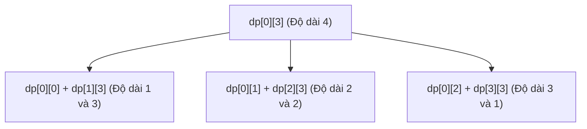

# Bài 49: Interval DP - Quy hoạch động trên đoạn

> **Tác giả:** FPTOJ Team<br>
> **Nội dung tham khảo từ:** CP-Algorithms, USACO Guide

---

## Bạn sẽ học được gì?

- **Interval DP là gì:** Bản chất và cách phân tích trạng thái trên các phân đoạn liên tiếp.
- **Quy trình duyệt đúng:** Tại sao bắt buộc phải duyệt theo độ dài tăng dần của đoạn và các cạm bẫy về thứ tự vòng lặp.
- **Các bài toán kinh điển:** Matrix Chain Multiplication, Merge Stones (gộp đá), Boolean Parenthesization, Palindrome Partitioning và Optimal BST.
- **Tối ưu hóa nâng cao:** Knuth's Optimization nâng cao hiệu năng từ $O(N^3)$ về $O(N^2)$ khi thỏa mãn tính chất lồi.

---

## 1. Giới thiệu

### Bài toán dẫn nhập: Gộp đá

Bạn có $N$ đống đá xếp thành một hàng ngang. Đống thứ $i$ có trọng lượng là $a[i]$. Tại mỗi bước, bạn chỉ được phép **gộp hai đống đá kề nhau** thành một đống mới. Chi phí để thực hiện việc gộp này bằng **tổng trọng lượng** của hai đống đá đó. Hãy tìm **tổng chi phí nhỏ nhất** để gộp tất cả $N$ đống đá ban đầu thành một đống duy nhất.

Xét ví dụ: Dãy trọng lượng đá ban đầu là $a = [4, 1, 3, 2]$.
Ta có nhiều cách để gộp các đống đá này:
- **Cách 1:** 
  1. Gộp $4$ và $1$ (chi phí $5$), dãy trở thành $[5, 3, 2]$.
  2. Gộp $5$ và $3$ (chi phí $8$), dãy trở thành $[8, 2]$.
  3. Gộp $8$ và $2$ (chi phí $10$), thu được đống cuối cùng.
  Tổng chi phí = $5 + 8 + 10 = 23$.
- **Cách 2:**
  1. Gộp $1$ và $3$ (chi phí $4$), dãy trở thành $[4, 4, 2]$.
  2. Gộp $4$ và $2$ (chi phí $6$), dãy trở thành $[4, 6]$.
  3. Gộp $4$ và $6$ (chi phí $10$), thu được đống cuối cùng.
  Tổng chi phí = $4 + 6 + 10 = 20$.

Đáp án tối ưu là **$20$**.

---

### Ý tưởng cốt lõi của Quy hoạch động trên đoạn
Để ý rằng dù đống đá cuối cùng được hình thành bằng cách nào, ở bước cuối cùng ta vẫn phải gộp đúng **hai đống đá lớn** lại với nhau. Hai đống đá lớn này tương ứng với hai đoạn con liên tiếp: một đoạn từ đầu đến vị trí thứ $k$, và một đoạn từ $k+1$ đến cuối. 

Điều này gợi ý ta thiết lập trạng thái quy hoạch động trên các đoạn con của dãy:
- Định nghĩa trạng thái $dp[l][r]$: Chi phí nhỏ nhất để gộp tất cả các đống đá từ vị trí $l$ đến vị trí $r$ thành một đống duy nhất.
- Để tính toán $dp[l][r]$, ta thử duyệt qua mọi vị trí chia cắt khả dĩ $k$ ($l \le k < r$):
  - Gộp đoạn bên trái $[l, k]$ thành một đống: tốn chi phí $dp[l][k]$.
  - Gộp đoạn bên phải $[k+1, r]$ thành một đống: tốn chi phí $dp[k+1][r]$.
  - Gộp hai đống lớn lại với nhau: tốn chi phí bằng tổng trọng lượng của cả đoạn từ $l$ tới $r$, ký hiệu là $sum(l, r)$.
- Ta có công thức chuyển trạng thái:
  $$dp[l][r] = \min_{l \le k < r} \{ dp[l][k] + dp[k+1][r] + sum(l, r) \}$$

#### Tại sao quy hoạch động trên đoạn hoạt động?
Quy hoạch động trên đoạn đáp ứng đầy đủ hai tính chất nền tảng của quy hoạch động:
1. **Cấu trúc con tối ưu (Optimal Substructure):** Kết quả tối ưu của đoạn lớn $[l, r]$ có thể tính được từ kết quả tối ưu của các đoạn con nhỏ hơn của nó là $[l, k]$ và $[k+1, r]$.
2. **Các bài toán con trùng lặp (Overlapping Subproblems):** Kết quả của một đoạn con $[l, r]$ sẽ được tái sử dụng nhiều lần để tính toán cho nhiều đoạn lớn hơn bao phủ nó.

---

## 2. Khung mẫu Quy hoạch động trên đoạn (Template)

### Quy trình duyệt đúng thứ tự
Khi tính giá trị $dp[l][r]$, công thức truy hồi đòi hỏi ta phải biết trước giá trị $dp[l][k]$ và $dp[k+1][r]$. Đây đều là các trạng thái ứng với các đoạn con có độ dài **ngắn hơn** đoạn $[l, r]$. 

Do đó, để đảm bảo tính đúng đắn khi điền bảng DP, ta bắt buộc phải duyệt các đoạn theo **thứ tự độ dài tăng dần của đoạn** (từ $2$ cho tới $N$).



#### Cấu trúc giả mã tổng quát:
```
Khởi tạo: dp[i][i] = Giá trị cơ sở cho các đoạn có độ dài 1
Duyệt độ dài len từ 2 tới N:
    Duyệt chỉ số đầu l từ 0 tới N - len:
        Chỉ số cuối r = l + len - 1
        Khởi tạo dp[l][r] với giá trị vô cùng (INF hoặc -INF)
        Duyệt điểm chia k từ l tới r - 1:
            dp[l][r] = min/max(dp[l][r], dp[l][k] + dp[k+1][r] + cost(l, k, r))
```

=== "C++"

    ```cpp
    #include <bits/stdc++.h>
    using namespace std;

    const int MAXN = 505;
    const long long INF = 1e18;

    int n;
    long long a[MAXN];
    long long dp[MAXN][MAXN];

    // Hàm chi phí đặc trưng của bài toán
    long long get_cost(int l, int k, int r) {
        // Cần được định nghĩa tùy theo yêu cầu cụ thể của từng bài toán
        return 0; 
    }

    long long solve_interval_dp() {
        // Khởi tạo các đoạn độ dài 1 (trường hợp cơ sở)
        for (int i = 0; i < n; i++) {
            dp[i][i] = 0; // Thường chi phí cho đoạn độ dài 1 bằng 0
        }

        // Vòng lặp chính duyệt theo độ dài tăng dần
        for (int len = 2; len <= n; len++) {
            for (int l = 0; l + len - 1 < n; l++) {
                int r = l + len - 1;
                dp[l][r] = INF;

                for (int k = l; k < r; k++) {
                    dp[l][r] = min(dp[l][r], 
                        dp[l][k] + dp[k+1][r] + get_cost(l, k, r));
                }
            }
        }
        return dp[0][n - 1];
    }
    ```

=== "Python"

    ```python
    INF = float('inf')

    def solve_interval_dp(n, a):
        # Khởi tạo bảng DP
        dp = [[0 if i == j else INF for j in range(n)] for i in range(n)]

        # Duyệt theo độ dài đoạn tăng dần
        for length in range(2, n + 1):
            for l in range(n - length + 1):
                r = l + length - 1
                for k in range(l, r):
                    cost = get_cost(l, k, r) # Cần định nghĩa hàm chi phí cụ thể
                    dp[l][r] = min(dp[l][r], dp[l][k] + dp[k+1][r] + cost)

        return dp[0][n-1]

    def get_cost(l, k, r):
        return 0
    ```

---

## 3. Ví dụ 1: Matrix Chain Multiplication (Nhân xích ma trận)

**Bài toán:** Cho một dãy gồm $N$ ma trận liên tiếp $A_1, A_2, \dots, A_N$. Ma trận $A_i$ có kích thước $d[i] \times d[i+1]$. Ta cần nhân tất cả các ma trận này lại với nhau theo đúng thứ tự. Tìm số lượng phép nhân vô hướng **ít nhất** cần thực hiện bằng cách đặt các dấu ngoặc tối ưu.

### Phân tích và Công thức DP
- Trạng thái: Định nghĩa $dp[l][r]$ là số phép nhân tối thiểu để nhân các ma trận từ chỉ số $l$ tới chỉ số $r$ (lưu ý chỉ số chạy từ $0$ tới $N-1$).
- Khi thực hiện bước nhân cuối cùng tại điểm phân chia $k$:
  $$(A_l \times \dots \times A_k) \times (A_{k+1} \times \dots \times A_r)$$
- Ma trận tích bên trái có kích thước $d[l] \times d[k+1]$, ma trận tích bên phải có kích thước $d[k+1] \times d[r+1]$. Chi phí thực hiện phép nhân hai ma trận tích này là:
  $$\text{merge\_cost} = d[l] \cdot d[k+1] \cdot d[r+1]$$
- Ta thu được công thức quy hoạch động:
  $$dp[l][r] = \min_{l \le k < r} \{ dp[l][k] + dp[k+1][r] + d[l] \cdot d[k+1] \cdot d[r+1] \}$$

#### Trace chi tiết cho ví dụ $4$ ma trận có kích thước:
$A_0(10 \times 30), A_1(30 \times 5), A_2(5 \times 60), A_3(60 \times 10)$.  
Kích thước được lưu trong mảng: $d = [10, 30, 5, 60, 10]$.

- **Độ dài 1:** $dp[0][0] = dp[1][1] = dp[2][2] = dp[3][3] = 0$.
- **Độ dài 2:**
  - $dp[0][1] = 10 \cdot 30 \cdot 5 = 1500$.
  - $dp[1][2] = 30 \cdot 5 \cdot 60 = 9000$.
  - $dp[2][3] = 5 \cdot 60 \cdot 10 = 3000$.
- **Độ dài 3:**
  - $dp[0][2] = \min \begin{cases} k=0: dp[0][0] + dp[1][2] + 10 \cdot 30 \cdot 60 = 0 + 9000 + 18000 = 27000 \\ k=1: dp[0][1] + dp[2][2] + 10 \cdot 5 \cdot 60 = 1500 + 0 + 3000 = 4500 \end{cases} \implies 4500$.
  - $dp[1][3] = \min \begin{cases} k=1: dp[1][1] + dp[2][3] + 30 \cdot 5 \cdot 10 = 0 + 3000 + 1500 = 4500 \\ k=2: dp[1][2] + dp[3][3] + 30 \cdot 60 \cdot 10 = 9000 + 0 + 18000 = 27000 \end{cases} \implies 4500$.
- **Độ dài 4:**
  - $dp[0][3] = \min \begin{cases} k=0: dp[0][0] + dp[1][3] + 10 \cdot 30 \cdot 10 = 0 + 4500 + 3000 = 7500 \\ k=1: dp[0][1] + dp[2][3] + 10 \cdot 5 \cdot 10 = 1500 + 3000 + 500 = 5000 \\ k=2: dp[0][2] + dp[3][3] + 10 \cdot 60 \cdot 10 = 4500 + 0 + 6000 = 10500 \end{cases} \implies 5000$.

**Kết quả tối ưu:** $5000$ phép nhân vô hướng.

```matplotlib
import numpy as np

d = [10, 30, 5, 60, 10]
n = 4

dp = np.full((n, n), np.inf)
order = np.zeros((n, n), dtype=int)
for i in range(n):
    dp[i][i] = 0
    order[i][i] = 1

step = 1
for length in range(2, n + 1):
    for l in range(n - length + 1):
        r = l + length - 1
        step += 1
        best = np.inf
        for k in range(l, r):
            cost = dp[l][k] + dp[k+1][r] + d[l] * d[k+1] * d[r+1]
            best = min(best, cost)
        dp[l][r] = best
        order[l][r] = step

fig, (ax1, ax2) = plt.subplots(1, 2, figsize=(14, 5))

im1 = ax1.imshow(order, cmap='Blues', aspect='equal', vmin=0, vmax=step)
for i in range(n):
    for j in range(n):
        if order[i][j] > 0:
            ax1.text(j, i, f'{int(order[i][j])}', ha='center', va='center', fontsize=14, fontweight='bold',
                    color='white' if order[i][j] > step * 0.5 else 'black')
        else:
            ax1.text(j, i, '—', ha='center', va='center', fontsize=14, color='gray')
ax1.set_xticks(range(n))
ax1.set_yticks(range(n))
ax1.set_xticklabels([f'A{i}' for i in range(n)], fontsize=12)
ax1.set_yticklabels([f'A{i}' for i in range(n)], fontsize=12)
ax1.set_xlabel('r (kết thúc)', fontsize=12)
ax1.set_ylabel('l (bắt đầu)', fontsize=12)
ax1.set_title('Thứ tự điền bảng DP\n(tăng dần theo độ dài)', fontsize=13, fontweight='bold')

im2 = ax2.imshow(dp, cmap='YlOrRd', aspect='equal')
for i in range(n):
    for j in range(n):
        if dp[i][j] < np.inf:
            ax2.text(j, i, f'{int(dp[i][j])}', ha='center', va='center', fontsize=13, fontweight='bold',
                    color='white' if dp[i][j] > 5000 * 0.6 else 'black')
        else:
            ax2.text(j, i, '—', ha='center', va='center', fontsize=14, color='gray')
ax2.set_xticks(range(n))
ax2.set_yticks(range(n))
ax2.set_xticklabels([f'A{i}' for i in range(n)], fontsize=12)
ax2.set_yticklabels([f'A{i}' for i in range(n)], fontsize=12)
ax2.set_xlabel('r (kết thúc)', fontsize=12)
ax2.set_ylabel('l (bắt đầu)', fontsize=12)
ax2.set_title('Giá trị dp[l][r]\n(số phép nhân tối thiểu)', fontsize=13, fontweight='bold')

fig.suptitle('Matrix Chain Multiplication: d=[10,30,5,60,10]', fontsize=14, fontweight='bold')
plt.tight_layout()
```

=== "C++"

    ```cpp
    #include <bits/stdc++.h>
    using namespace std;

    const long long INF = 1e18;

    int main() {
        ios_base::sync_with_stdio(false);
        cin.tie(NULL);

        int n;
        if (!(cin >> n)) return 0;
        vector<int> d(n + 1);
        for (int i = 0; i <= n; i++) cin >> d[i];

        vector<vector<long long>> dp(n, vector<long long>(n, 0));

        for (int len = 2; len <= n; len++) {
            for (int l = 0; l + len - 1 < n; l++) {
                int r = l + len - 1;
                dp[l][r] = INF;

                for (int k = l; k < r; k++) {
                    long long cost = dp[l][k] + dp[k + 1][r] 
                                   + 1LL * d[l] * d[k + 1] * d[r + 1];
                    dp[l][r] = min(dp[l][r], cost);
                }
            }
        }

        cout << dp[0][n - 1] << "\n";
        return 0;
    }
    ```

=== "Python"

    ```python
    import sys

    def matrix_chain(n, d):
        dp = [[0] * n for _ in range(n)]

        for length in range(2, n + 1):
            for l in range(n - length + 1):
                r = l + length - 1
                dp[l][r] = float('inf')
                for k in range(l, r):
                    cost = dp[l][k] + dp[k+1][r] + d[l] * d[k+1] * d[r+1]
                    dp[l][r] = min(dp[l][r], cost)

        return dp[0][n-1]

    def main():
        input = sys.stdin.read
        data = input().split()
        if not data:
            return
        n = int(data[0])
        d = [int(x) for x in data[1:]]
        print(matrix_chain(n, d))

    if __name__ == '__main__':
        main()
    ```

---

## 4. Ví dụ 2: Merge Stones (Gộp đống đá)

**Bài toán:** Trở lại bài toán gộp đá ở phần giới thiệu. Nhận thấy chi phí gộp đống lớn cuối cùng chính là tổng của tất cả các phần tử trên đoạn $[l, r]$. 
Ta tối ưu hóa việc tính tổng này bằng kỹ thuật Mảng cộng dồn (Prefix Sum) để tính tổng đoạn trong $O(1)$.

### Phân tích thuật toán
Gọi $pref[i]$ là tổng của các phần tử $a[0 \dots i-1]$. Tổng trọng lượng của đoạn $[l, r]$ là:
$$sum(l, r) = pref[r+1] - pref[l]$$

Ta áp dụng trực tiếp công thức:
$$dp[l][r] = \min_{l \le k < r} \{ dp[l][k] + dp[k+1][r] + sum(l, r) \}$$

=== "C++"

    ```cpp
    #include <bits/stdc++.h>
    using namespace std;

    const long long INF = 1e18;

    int main() {
        ios_base::sync_with_stdio(false);
        cin.tie(NULL);

        int n;
        if (!(cin >> n)) return 0;
        vector<int> a(n);
        for (int i = 0; i < n; i++) cin >> a[i];

        vector<long long> pref(n + 1, 0);
        for (int i = 0; i < n; i++) {
            pref[i + 1] = pref[i] + a[i];
        }

        auto get_sum = [&](int l, int r) {
            return pref[r + 1] - pref[l];
        };

        vector<vector<long long>> dp(n, vector<long long>(n, INF));
        for (int i = 0; i < n; i++) {
            dp[i][i] = 0;
        }

        for (int len = 2; len <= n; len++) {
            for (int l = 0; l + len - 1 < n; l++) {
                int r = l + len - 1;
                for (int k = l; k < r; k++) {
                    dp[l][r] = min(dp[l][r], 
                        dp[l][k] + dp[k + 1][r] + get_sum(l, r));
                }
            }
        }

        cout << dp[0][n - 1] << "\n";
        return 0;
    }
    ```

=== "Python"

    ```python
    import sys

    def merge_stones(n, a):
        pref = [0] * (n + 1)
        for i in range(n):
            pref[i+1] = pref[i] + a[i]

        def get_sum(l, r):
            return pref[r+1] - pref[l]

        INF = float('inf')
        dp = [[0 if i == j else INF for j in range(n)] for i in range(n)]

        for length in range(2, n + 1):
            for l in range(n - length + 1):
                r = l + length - 1
                for k in range(l, r):
                    dp[l][r] = min(dp[l][r], 
                        dp[l][k] + dp[k+1][r] + get_sum(l, r))

        return dp[0][n-1]

    def main():
        input = sys.stdin.read
        data = input().split()
        if not data:
            return
        n = int(data[0])
        a = [int(x) for x in data[1:]]
        print(merge_stones(n, a))

    if __name__ == '__main__':
        main()
    ```

---

## 5. Ví dụ 3: Boolean Parenthesization (Đặt ngoặc biểu thức logic)

**Bài toán:** Cho một biểu thức logic dưới dạng chuỗi chứa các ký tự `'T'` (đại diện cho True), `'F'` (đại diện cho False) xen kẽ với các toán tử logic: `'&'` (AND), `'|'` (OR), `'^'` (XOR). Đếm số cách đặt dấu ngoặc hợp lệ vào biểu thức sao cho kết quả cuối cùng đạt giá trị True.

### Thiết lập Quy hoạch động nhiều chiều
Với mỗi đoạn $[l, r]$, ta không thể chỉ quan tâm đến số cách để đoạn đó đạt giá trị True, vì việc một toán tử logic hoạt động phụ thuộc vào kết quả của cả hai nhánh. Do đó, ta đồng thời tính:
- $dp[l][r][1]$: Số cách đặt ngoặc đoạn $[l, r]$ để biểu thức con có giá trị True.
- $dp[l][r][0]$: Số cách đặt ngoặc đoạn $[l, r]$ để biểu thức con có giá trị False.

Khi ta chia biểu thức tại toán tử k nằm giữa $l$ và $r$:
- Đoạn trái có số cách đạt các giá trị là $lt = dp[l][k-1][1]$ và $lf = dp[l][k-1][0]$.
- Đoạn phải có số cách đạt các giá trị là $rt = dp[k+1][r][1]$ và $rf = dp[k+1][r][0]$.

Công thức gộp tương ứng với từng toán tử:
- **Toán tử `&` (AND):**
  - $dp[l][r][1] += lt \cdot rt$
  - $dp[l][r][0] += lt \cdot rf + lf \cdot rt + lf \cdot rf$
- **Toán tử `|` (OR):**
  - $dp[l][r][1] += lt \cdot rt + lt \cdot rf + lf \cdot rt$
  - $dp[l][r][0] += lf \cdot rf$
- **Toán tử `^` (XOR):**
  - $dp[l][r][1] += lt \cdot rf + lf \cdot rt$
  - $dp[l][r][0] += lt \cdot rt + lf \cdot rf$

=== "C++"

    ```cpp
    #include <bits/stdc++.h>
    using namespace std;

    int main() {
        ios_base::sync_with_stdio(false);
        cin.tie(NULL);

        string s;
        if (!(cin >> s)) return 0;
        int n = s.size();

        // dp[l][r][0] = False ways, dp[l][r][1] = True ways
        vector<vector<vector<long long>>> dp(
            n, vector<vector<long long>>(n, vector<long long>(2, 0)));

        // Đoạn độ dài 1: chỉ chứa giá trị T hoặc F
        for (int i = 0; i < n; i += 2) {
            if (s[i] == 'T') dp[i][i][1] = 1;
            else dp[i][i][0] = 1;
        }

        // Duyệt độ dài tăng dần (chỉ xét độ dài lẻ vì biểu thức dạng V_1 op V_2 ... op V_k)
        for (int len = 3; len <= n; len += 2) {
            for (int l = 0; l + len - 1 < n; l += 2) {
                int r = l + len - 1;
                for (int k = l + 1; k < r; k += 2) {
                    long long lt = dp[l][k - 1][1], lf = dp[l][k - 1][0];
                    long long rt = dp[k + 1][r][1], rf = dp[k + 1][r][0];

                    if (s[k] == '&') {
                        dp[l][r][1] += lt * rt;
                        dp[l][r][0] += lt * rf + lf * rt + lf * rf;
                    } else if (s[k] == '|') {
                        dp[l][r][1] += lt * rt + lt * rf + lf * rt;
                        dp[l][r][0] += lf * rf;
                    } else if (s[k] == '^') {
                        dp[l][r][1] += lt * rf + lf * rt;
                        dp[l][r][0] += lt * rt + lf * rf;
                    }
                }
            }
        }

        cout << dp[0][n - 1][1] << "\n";
        return 0;
    }
    ```

=== "Python"

    ```python
    import sys

    def count_boolean_ways(s):
        n = len(s)
        dp = [[[0, 0] for _ in range(n)] for _ in range(n)]

        for i in range(0, n, 2):
            dp[i][i][1] = 1 if s[i] == 'T' else 0
            dp[i][i][0] = 1 if s[i] == 'F' else 0

        for length in range(3, n + 1, 2):
            for l in range(0, n - length + 1, 2):
                r = l + length - 1
                for k in range(l + 1, r, 2):
                    lt, lf = dp[l][k-1][1], dp[l][k-1][0]
                    rt, rf = dp[k+1][r][1], dp[k+1][r][0]

                    if s[k] == '&':
                        dp[l][r][1] += lt * rt
                        dp[l][r][0] += lt * rf + lf * rt + lf * rf
                    elif s[k] == '|':
                        dp[l][r][1] += lt * rt + lt * rf + lf * rt
                        dp[l][r][0] += lf * rf
                    elif s[k] == '^':
                        dp[l][r][1] += lt * rf + lf * rt
                        dp[l][r][0] += lt * rt + lf * rf

        return dp[0][n-1][1]

    def main():
        s = sys.stdin.read().strip()
        if not s:
            return
        print(count_boolean_ways(s))

    if __name__ == '__main__':
        main()
    ```

---

## 6. Ví dụ 4: Palindrome Partitioning (Phân hoạch Palindrome tối thiểu)

**Bài toán:** Cho một chuỗi $s$. Hãy tìm số lần cắt tối thiểu để chia chuỗi $s$ thành các phần con liên tiếp sao cho mỗi phần con đều là một chuỗi đối xứng (Palindrome).

### Kỹ thuật kết hợp Quy hoạch động 1D và 2D
Mặc dù ta có thể giải trực tiếp bằng quy hoạch động đoạn, phương pháp hiệu quả hơn là kết hợp:
1. **Bước 1 (Quy hoạch động đoạn 2D):** Xác định nhanh xem mọi đoạn con $s[l \dots r]$ có phải là palindrome hay không. Lưu trữ kết quả trong bảng $isPalin[l][r]$:
   $$isPalin[l][r] = (s[l] == s[r]) \land isPalin[l+1][r-1]$$
2. **Bước 2 (Quy hoạch động tuyến tính 1D):** Định nghĩa $dp[i]$ là số lần cắt tối thiểu cho tiền tố $s[0 \dots i]$.
   $$dp[i] = \min_{0 \le j \le i, \, s[j \dots i] \text{ là Palindrome}} \{ dp[j-1] + 1 \}$$
   (với quy ước $dp[-1] = -1$).

Sự kết hợp này giảm độ phức tạp thời gian từ $O(N^3)$ xuống $O(N^2)$.

=== "C++"

    ```cpp
    #include <bits/stdc++.h>
    using namespace std;

    int main() {
        ios_base::sync_with_stdio(false);
        cin.tie(NULL);

        string s;
        if (!(cin >> s)) return 0;
        int n = s.size();

        // Bước 1: Tính trước các đoạn là palindrome
        vector<vector<bool>> isPalin(n, vector<bool>(n, false));
        for (int i = 0; i < n; i++) isPalin[i][i] = true;
        for (int i = 0; i + 1 < n; i++) {
            isPalin[i][i + 1] = (s[i] == s[i + 1]);
        }
        for (int len = 3; len <= n; len++) {
            for (int l = 0; l + len - 1 < n; l++) {
                int r = l + len - 1;
                isPalin[l][r] = (s[l] == s[r]) && isPalin[l + 1][r - 1];
            }
        }

        // Bước 2: Quy hoạch động 1D để tìm số lần cắt tối thiểu
        vector<int> dp(n, 1e9);
        for (int i = 0; i < n; i++) {
            if (isPalin[0][i]) {
                dp[i] = 0;
                continue;
            }
            for (int j = 1; j <= i; j++) {
                if (isPalin[j][i]) {
                    dp[i] = min(dp[i], dp[j - 1] + 1);
                }
            }
        }

        cout << dp[n - 1] << "\n";
        return 0;
    }
    ```

=== "Python"

    ```python
    import sys

    def min_palindrome_cuts(s):
        n = len(s)
        is_palin = [[False] * n for _ in range(n)]

        for i in range(n):
            is_palin[i][i] = True
        for i in range(n - 1):
            is_palin[i][i+1] = (s[i] == s[i+1])

        for length in range(3, n + 1):
            for l in range(n - length + 1):
                r = l + length - 1
                is_palin[l][r] = (s[l] == s[r]) and is_palin[l+1][r-1]

        dp = [10**9] * n
        for i in range(n):
            if is_palin[0][i]:
                dp[i] = 0
                continue
            for j in range(1, i + 1):
                if is_palin[j][i]:
                    dp[i] = min(dp[i], dp[j-1] + 1)

        return dp[n-1]

    def main():
        s = sys.stdin.read().strip()
        if not s:
            return
        print(min_palindrome_cuts(s))

    if __name__ == '__main__':
        main()
    ```

---

## 7. Ví dụ 5: Optimal Binary Search Tree (Cây tìm kiếm nhị phân tối ưu)

**Bài toán:** Cho một dãy gồm $N$ khóa đã sắp xếp và tần suất truy cập tương ứng là $freq[0 \dots N-1]$. Ta cần xây dựng một cây tìm kiếm nhị phân (BST) từ các khóa này sao cho tổng chi phí tìm kiếm trung bình là tối thiểu. Chi phí tìm khóa thứ $i$ bằng:
$$\text{Cost}(i) = freq[i] \cdot (\text{depth}(i) + 1)$$

### Công thức quy hoạch động
- Định nghĩa $dp[l][r]$ là chi phí tìm kiếm tối thiểu cho tập hợp các khóa từ $l$ tới $r$.
- Khi chọn khóa $k$ ($l \le k \le r$) làm gốc của cây con này:
  - Các khóa từ $l$ tới $k-1$ sẽ tạo thành cây con bên trái.
  - Các khóa từ $k+1$ tới $r$ sẽ tạo thành cây con bên phải.
- Do cây con trái và phải bị đẩy sâu xuống $1$ mức khi được ghép dưới gốc $k$, tần suất truy cập của tất cả các phần tử trong cây con đều phải cộng thêm một lượng tương ứng với tần suất của chúng. 
- Mối liên hệ chuyển trạng thái:
  $$dp[l][r] = \min_{l \le k \le r} \{ dp[l][k-1] + dp[k+1][r] + \sum_{i=l}^{r} freq[i] \}$$

=== "C++"

    ```cpp
    #include <bits/stdc++.h>
    using namespace std;

    const long long INF = 1e18;

    int main() {
        ios_base::sync_with_stdio(false);
        cin.tie(NULL);

        int n;
        if (!(cin >> n)) return 0;
        vector<int> freq(n);
        for (int i = 0; i < n; i++) cin >> freq[i];

        vector<long long> pref(n + 1, 0);
        for (int i = 0; i < n; i++) {
            pref[i + 1] = pref[i] + freq[i];
        }

        auto get_sum = [&](int l, int r) {
            return pref[r + 1] - pref[l];
        };

        vector<vector<long long>> dp(n, vector<long long>(n, INF));
        for (int i = 0; i < n; i++) {
            dp[i][i] = freq[i];
        }

        for (int len = 2; len <= n; len++) {
            for (int l = 0; l + len - 1 < n; l++) {
                int r = l + len - 1;
                for (int k = l; k <= r; k++) {
                    long long left = (k > l) ? dp[l][k - 1] : 0;
                    long long right = (k < r) ? dp[k + 1][r] : 0;
                    dp[l][r] = min(dp[l][r], left + right + get_sum(l, r));
                }
            }
        }

        cout << dp[0][n - 1] << "\n";
        return 0;
    }
    ```

=== "Python"

    ```python
    import sys

    def optimal_bst(n, freq):
        pref = [0] * (n + 1)
        for i in range(n):
            pref[i+1] = pref[i] + freq[i]

        def get_sum(l, r):
            return pref[r+1] - pref[l]

        INF = float('inf')
        dp = [[0 if i == j else INF for j in range(n)] for i in range(n)]
        
        for i in range(n):
            dp[i][i] = freq[i]

        for length in range(2, n + 1):
            for l in range(n - length + 1):
                r = l + length - 1
                for k in range(l, r + 1):
                    left = dp[l][k-1] if k > l else 0
                    right = dp[k+1][r] if k < r else 0
                    dp[l][r] = min(dp[l][r], left + right + get_sum(l, r))

        return dp[0][n-1]

    def main():
        input = sys.stdin.read
        data = input().split()
        if not data:
            return
        n = int(data[0])
        freq = [int(x) for x in data[1:]]
        print(optimal_bst(n, freq))

    if __name__ == '__main__':
        main()
    ```

---

## 8. Tối ưu hóa nâng cao: Knuth's Optimization

Khi hàm chi phí $\text{cost}(l, r)$ thỏa mãn **bất đẳng thức tứ giác** và **tính đơn điệu**, ta có thể áp dụng Knuth's Optimization để giới hạn khoảng tìm kiếm của $k$ tại $dp[l][r]$ trong khoảng $[opt[l][r-1], opt[l+1][r]]$.

Kỹ thuật này hạ độ phức tạp thời gian từ **$O(N^3)$ xuống $O(N^2)$**, mở rộng giới hạn xử lý của $N$ từ $300$ lên tới $5000$.

*(Chi tiết về chứng minh toán học và cài đặt nâng cao được trình bày cụ thể tại [Bài 50: Tối ưu Quy Hoạch Động](dp-optimization.md)).*

---

## 9. Lưu ý và Các cạm bẫy thường gặp

> [!WARNING]
> ### 1. Thứ tự vòng lặp sai
> Rất nhiều lập trình viên sử dụng vòng lặp duyệt chỉ số $l$ và $r$ theo cách thông thường:
> ```cpp
> for (int l = 0; l < n; l++) {
>     for (int r = l; r < n; r++) { ... }
> }
> ```
> Thứ tự duyệt này hoàn toàn sai vì tại thời điểm tính $dp[l][r]$, giá trị $dp[k+1][r]$ nằm ở dòng $k+1$ (lớn hơn $l$) chưa hề được tính toán. Hãy nhớ: **Luôn duyệt độ dài tăng dần của đoạn**.

> [!IMPORTANT]
> ### 2. Lỗi Off-by-one trong phân mảnh
> Hãy kiểm tra kỹ biên của biến phân đoạn $k$:
> - Nhánh trái: $[l, k]$ có độ dài tối thiểu là $1$ (khi $k = l$).
> - Nhánh phải: $[k+1, r]$ có độ dài tối thiểu là $1$ (khi $k = r-1$).
> - Ràng buộc: Điểm cắt $k$ chạy trong nửa khoảng $[l, r)$ tức là $l \le k < r$. Đảm bảo không để $k = r$ vì khi đó sẽ truy cập trạng thái không hợp lệ $dp[r+1][r]$.

> [!CAUTION]
> ### 3. Giới hạn bộ nhớ và Tràn số
> - Bảng $dp[N][N]$ với $N = 2000$ kiểu dữ liệu `long long` tiêu tốn $2000 \times 2000 \times 8 \text{ Bytes} \approx 32 \text{ MB}$, hoàn toàn an toàn. Tuy nhiên nếu $N = 5000$, nó sẽ ngốn khoảng $200 \text{ MB}$, cần lưu ý giới hạn bộ nhớ của hệ thống chấm bài.
> - Chi phí nhân ma trận hoặc tổng đá lũy kế có thể rất lớn và dễ gây tràn số nguyên $32\text{-bit}$ (`int`). Luôn sử dụng kiểu dữ liệu số nguyên $64\text{-bit}$ (`long long` trong C++) cho mảng DP và các tính toán trung gian.

---

## 10. Bài tập luyện tập

| STT | Tên bài toán | Nguồn | Độ khó | Chủ đề |
| :--- | :--- | :--- | :--- | :--- |
| 1 | [Slimes](https://atcoder.jp/contests/dp/tasks/dp_n) | AtCoder | ★★★ | Merge Stones kinh điển |
| 2 | [Zuma](https://codeforces.com/problemset/problem/607/B) | Codeforces | ★★★☆ | Triệt tiêu đoạn đối xứng |
| 3 | [Burst Balloons](https://leetcode.com/problems/burst-balloons/) | LeetCode | ★★★★ | Tính toán ngược từ quả bóng cuối cùng |
| 4 | [Minimum Cost to Cut a Stick](https://leetcode.com/problems/minimum-cost-to-cut-a-stick/) | LeetCode | ★★★☆ | Chọn điểm cắt tối ưu trên thanh gỗ |
| 5 | [Polygon](https://codeforces.com/problemset/problem/1099/F) | Codeforces | ★★★★ | Trò chơi tối ưu trên đoạn tròn |

---

## Tóm tắt

- **Định nghĩa trạng thái:** $dp[l][r]$ lưu trữ nghiệm tối ưu của đoạn con từ vị trí $l$ tới vị trí $r$.
- **Lớp bài toán:** Thường áp dụng cho các bài toán có thể phân hoạch thành hai đoạn con độc lập, sau đó gộp kết quả tại ranh giới phân chia.
- **Công thức cốt lõi:**
  $$dp[l][r] = \min_{l \le k < r} \{ dp[l][k] + dp[k+1][r] + \text{merge\_cost} \}$$
- **Kỹ năng tối quan trọng:** Quản lý vòng lặp theo độ dài tăng dần của đoạn để đảm bảo nguyên lý phụ thuộc dữ liệu của quy hoạch động.
