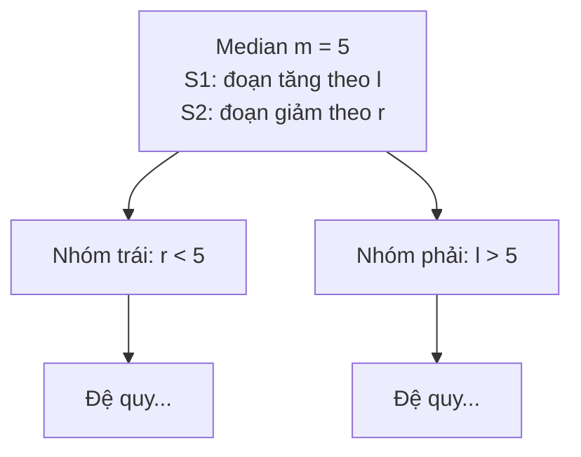

# Interval Tree Trên Tập Đoạn Thẳng - Truy Vấn Giao Đoạn

> **Tác giả:** FPTOJ Team<br>
> **Nội dung tham khảo từ:** CP-Algorithms - Interval Tree

---

## 1. Bản chất vấn đề

### Bài toán: Tìm đoạn thẳng giao với đoạn truy vấn

Cho $N$ đoạn thẳng $[l_i, r_i]$ trên trục số. Thực hiện $Q$ truy vấn: với đoạn $[a, b]$, liệt kê tất cả đoạn trong tập đã cho giao với $[a, b]$.

**Hai đoạn giao nhau** khi $[l_i, r_i] \cap [a, b] \neq \emptyset$, tức $\max(l_i, a) \le \min(r_i, b)$.

**Cách thường:** Duyệt $N$ đoạn $\Rightarrow O(N)$ mỗi truy vấn $\Rightarrow O(NQ)$.

**Interval Tree:** Truy vấn $O(\log N + k)$ với $k$ là số đoạn giao.

---

## 2. Tư duy cốt lõi

### Ý tưởng: Sắp xếp theo median

1. Tìm median $m$ của tất cả điểm đầu $l_i$.
2. Chia đoạn thành 3 nhóm:
   - **Trái:** $r_i < m$ (toàn bộ nằm bên trái median)
   - **Phải:** $l_i > m$ (toàn bộ nằm bên phải median)
   - **Giao:** $l_i \le m \le r_i$ (chứa median)

3. Nhóm "Giao" sắp xếp thành 2 mảng:
   - $S_1$: tăng dần theo $l_i$
   - $S_2$: giảm dần theo $r_i$

4. Đệ quy xây cây cho nhóm Trái và Phải.

### Cấu trúc cây



### Truy vấn: Tìm đoạn giao với $[a, b]$

| Trường hợp | Điều kiện | Kết quả |
|------------|-----------|---------|
| $b < m$ | Đoạn truy vấn nằm trái | Tìm trong S1: đoạn nào $l_i \le b$ |
| $a > m$ | Đoạn truy vấn nằm phải | Tìm trong S2: đoạn nào $r_i \ge a$ |
| $a \le m \le b$ | Chứa median | Tất cả đoạn trong S1 và S2 đều giao |

---

## 3. Phân tích tính đúng đắn

### Tại sao S1 và S2 tối ưu?

**S1** (tăng theo $l_i$): Khi $b < m$, đoạn truy vấn $[a, b]$ chỉ giao với đoạn có $l_i \le b$ (vì $r_i \ge m > b$ không cần xét). Do S1 tăng dần, chỉ cần lấy prefix có $l_i \le b$ $\Rightarrow$ binary search.

**S2** (giảm theo $r_i$): Khi $a > m$, chỉ cần đoạn có $r_i \ge a$. Do S2 giảm dần, binary search.

---

## 4. Đánh giá độ phức tạp

| Thao tác | Thời gian | Không gian |
|----------|-----------|------------|
| Xây cây | $O(N \log N)$ | $O(N \log N)$ |
| Truy vấn 1 đoạn | $O(\log N + k)$ | $O(1)$ |

$k$ = số đoạn giao được tìm thấy.

---

## Code minh họa

=== "C++"

    ```cpp
    #include <bits/stdc++.h>
    using namespace std;

    struct IntervalTree {
        struct Node {
            int median;
            vector<pair<int,int>> S1; // tăng theo l
            vector<pair<int,int>> S2; // giảm theo r
            Node *left = nullptr, *right = nullptr;
        };

        Node* root;

        Node* build(vector<pair<int,int>>& intervals) {
            if (intervals.empty()) return nullptr;

            Node* node = new Node();

            // Tìm median của l_i
            vector<int> lvals;
            for (auto& [l, r] : intervals) lvals.push_back(l);
            sort(lvals.begin(), lvals.end());
            node->median = lvals[lvals.size() / 2];

            vector<pair<int,int>> leftSet, rightSet;
            for (auto& [l, r] : intervals) {
                if (r < node->median) leftSet.push_back({l, r});
                else if (l > node->median) rightSet.push_back({l, r});
                else {
                    node->S1.push_back({l, r});
                    node->S2.push_back({l, r});
                }
            }

            sort(node->S1.begin(), node->S1.end());
            sort(node->S2.begin(), node->S2.end(), [](auto& a, auto& b) {
                return a.second > b.second;
            });

            node->left = build(leftSet);
            node->right = build(rightSet);
            return node;
        }

        IntervalTree(vector<pair<int,int>>& intervals) {
            root = build(intervals);
        }

        void query(Node* node, int a, int b, vector<pair<int,int>>& result) {
            if (!node) return;

            if (b < node->median) {
                // Tìm trong S1: l_i <= b
                for (auto& seg : node->S1) {
                    if (seg.first <= b) result.push_back(seg);
                    else break;
                }
                query(node->left, a, b, result);
            } else if (a > node->median) {
                // Tìm trong S2: r_i >= a
                for (auto& seg : node->S2) {
                    if (seg.second >= a) result.push_back(seg);
                    else break;
                }
                query(node->right, a, b, result);
            } else {
                // [a,b] chứa median → tất cả S1, S2 đều giao
                for (auto& seg : node->S1) result.push_back(seg);
                query(node->left, a, b, result);
                query(node->right, a, b, result);
            }
        }
    };

    int main() {
        int n, q;
        cin >> n >> q;
        vector<pair<int,int>> intervals(n);
        for (int i = 0; i < n; i++)
            cin >> intervals[i].first >> intervals[i].second;

        IntervalTree tree(intervals);

        while (q--) {
            int a, b;
            cin >> a >> b;
            vector<pair<int,int>> result;
            tree.query(tree.root, a, b, result);
            cout << result.size() << "\n";
            for (auto& [l, r] : result)
                cout << l << " " << r << "\n";
        }
        return 0;
    }
    ```

=== "Python"

    ```python
    class IntervalTree:
        def __init__(self, intervals):
            self.root = self._build(intervals)

        def _build(self, intervals):
            if not intervals:
                return None
            lvals = sorted(l for l, r in intervals)
            median = lvals[len(lvals) // 2]

            left_set, right_set, mid_set = [], [], []
            for l, r in intervals:
                if r < median:
                    left_set.append((l, r))
                elif l > median:
                    right_set.append((l, r))
                else:
                    mid_set.append((l, r))

            return {
                'median': median,
                'S1': sorted(mid_set),
                'S2': sorted(mid_set, key=lambda x: -x[1]),
                'left': self._build(left_set),
                'right': self._build(right_set)
            }

        def query(self, a, b):
            result = []
            self._query(self.root, a, b, result)
            return result

        def _query(self, node, a, b, result):
            if not node:
                return
            m = node['median']
            if b < m:
                for l, r in node['S1']:
                    if l <= b:
                        result.append((l, r))
                    else:
                        break
                self._query(node['left'], a, b, result)
            elif a > m:
                for l, r in node['S2']:
                    if r >= a:
                        result.append((l, r))
                    else:
                        break
                self._query(node['right'], a, b, result)
            else:
                result.extend(node['S1'])
                self._query(node['left'], a, b, result)
                self._query(node['right'], a, b, result)

    n, q = map(int, input().split())
    intervals = [tuple(map(int, input().split())) for _ in range(n)]
    tree = IntervalTree(intervals)

    for _ in range(q):
        a, b = map(int, input().split())
        result = tree.query(a, b)
        print(len(result))
        for l, r in result:
            print(l, r)
    ```
